# FAQ

[常见问题答疑](https://ecnuhbfhvn9e.feishu.cn/wiki/APCJwqO5Fic5gwkkXmDcjn8Gngb?from=from_copylink)

## 1. 关于低功耗唤醒问题

**1. shutof**

也叫软关机，该模式功耗为2uA，基本所有的芯片都是这个功耗。该模式下RAM是会掉电的，退出该模式后所有外设需要重新初始化

**a. 进入条件**

调用spple_power_event_to_user(POWER_EVENT_POWER_SOFTOFF);函数
该函数是AC630N_bt_data_transfer_sdk_release_v2.4.0版本的写法，其他低版本的sdk没有该函数请参考240版本实现一下。
**注意！！！**
spple_set_soft_poweroff
power_set_soft_poweroff
这两个函数只能在app_core任务中调用，不可以在中断、系统定时器、软件定时器、其他任务中调用

**b. 唤醒条件**

- 按键IO中断唤醒
- lp内置触摸按键唤醒
  部分芯片支持ac637、ac638
- rtc定时器唤醒

**2. powerdown**

  也叫低功耗、该模式RAM是不掉电的、但是硬件外设是会掉电的例如（uart、 硬件定时器等）。进入前芯片会保存寄存器的状态、被唤醒后芯片会从之前的状态继续运行。硬件外设不需要重新初始化。

**a、进入条件**

首先需要使能低功耗模块

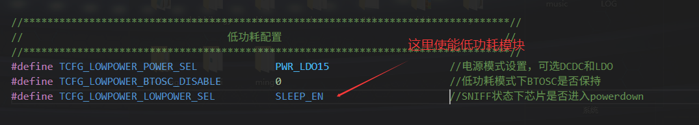

程序不能控制芯片主动进低功耗，但是程序可以控制芯片不要进低功耗。那么反过来如果我们的程序进不了低功耗就可以查一下REGISTER_LP_TARGET注册的函数是不是有地方没有返回1；

```
//代码任意地方添加此段代码,全局修改此变量,底层会自动获取判断
u8 can_enter_lp = 0; //置1 可进睡眠，置0 不可进睡眠
static u8 custom_idle_query(void)
{
    if(can_enter_lp){
        return 1;
    }else{
        return 0;
    }
}
REGISTER_LP_TARGET(custom_lp_target) = {
    .name = "custom_lp",
    .is_idle = custom_idle_query,
};
```

**b、唤醒条件**

- 系统定时器唤醒

```
u16 sys_timer_add(void *priv, void (*func)(void *priv), u32 msec);
u16 sys_timeout_add(void *priv, void (*func)(void *priv), u32 msec);
```

- 按键IO中断唤醒
- lp内置触摸按键唤醒
  部分芯片支持ac637、ac638
- rtc定时器唤醒

**c、进出低功耗回调函数**

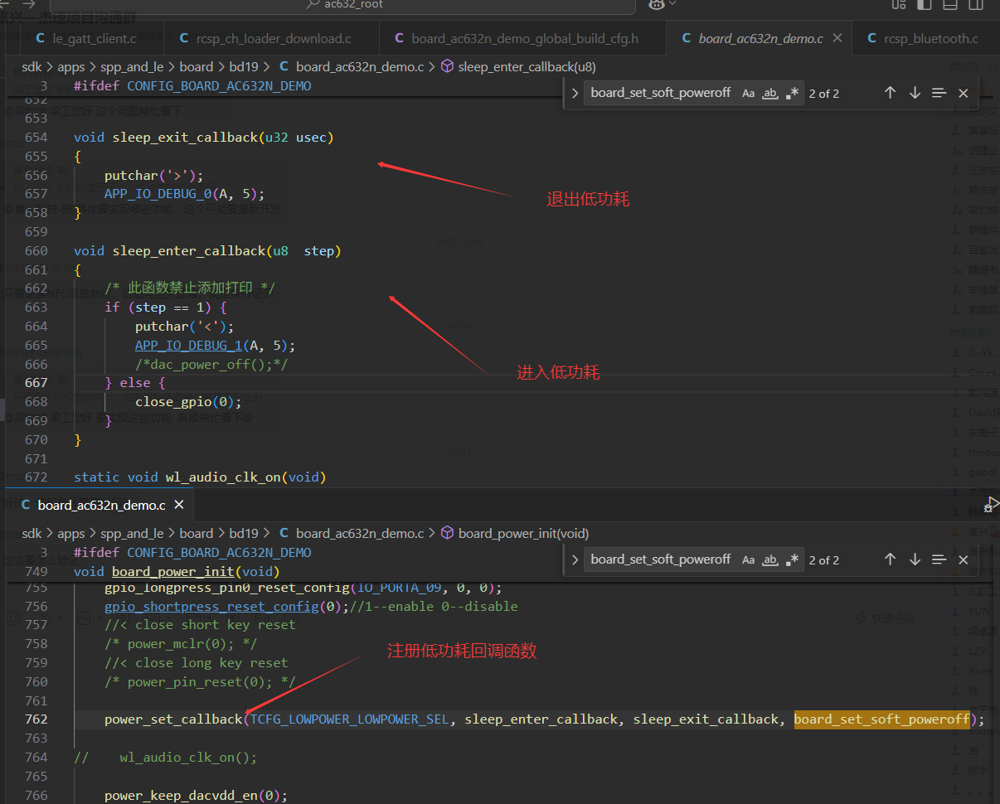

进入低功耗的时候会将所有的IO设置为高阻态，如果想维持原先io状态需要在close_gpio函数中调用port_protect函数

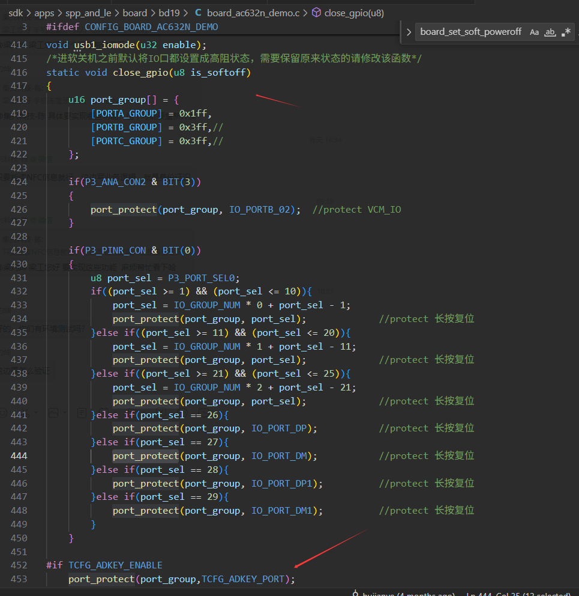

有打印<>和[]就表示有正常进低功耗了'<'和'>'是应用层的打印，'['和']'是库里面的打印，

**d、低功耗参数配置**

```
struct low_power_param {
    u8 osc_type;    //低功耗下时钟的选择：内部OSC_TYPE_LR时钟、外部OSC_TYPE_BT_OSC蓝牙时钟（需要btosc_disable=1）
    u32 btosc_hz;    //低功耗下的时钟频率
    u8  delay_us;    //提供给低功耗模块的延时(不需要需修改)
    u8  config;      //是否开启低功耗模块
    u8  btosc_disable;    //低功耗下是否维持外部晶振

    u8 vddiom_lev;    //工作模式下的vddio电压等级
    u8 vddiow_lev;    //低功耗模式下的vddio电压等级
    u8 pd_wdvdd_lev;    //wdvdd的电压等级
    u8 lpctmu_en;        //是否支持内置触摸按键唤醒
    u8 vddio_keep;       //低功耗下vddio是否跟正常模式下保持一致

    u32 osc_delay_us;    //晶振启动后延时多少个时钟周期退出低功耗模式

    u8 vd13_cap_en;    //有BT_AVDD引脚电容,可以置1,否则要配0
    u8 rtc_clk;        //低功耗下rtc时钟是否维持
    u8 light_sleep_attribute;

};
```

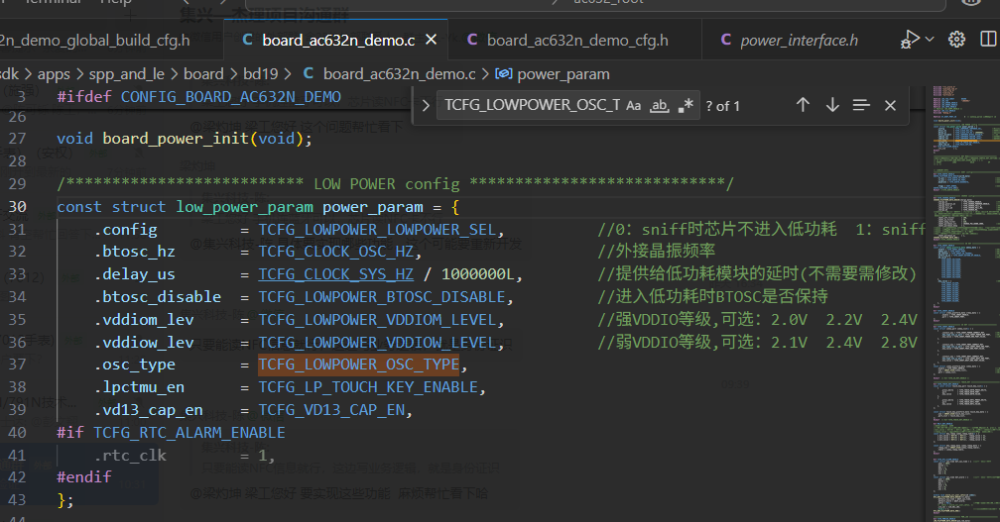

## 2. USBDM、USBDP用做唤醒口---配置说明
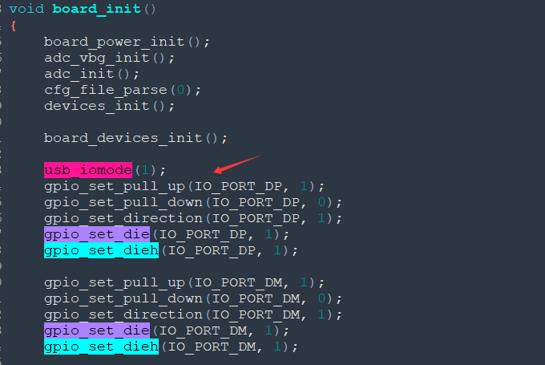
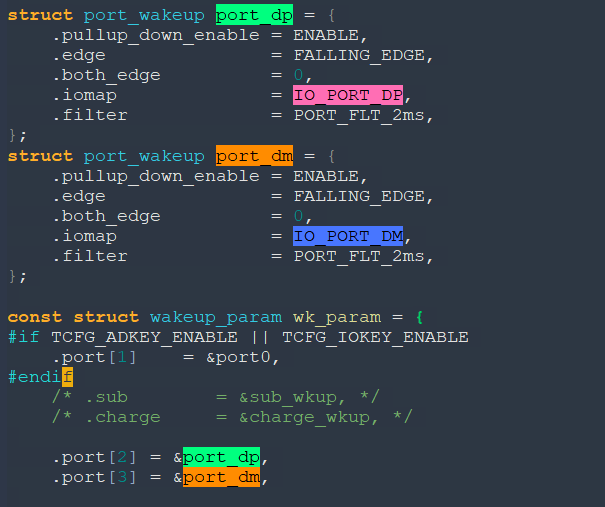
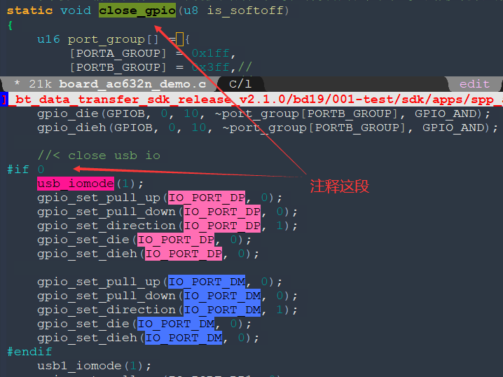
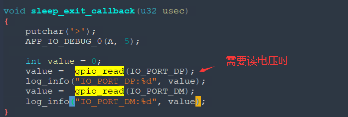

## 3. 杰理各系列芯片复位源跟唤醒源获取方式

1、判断芯片是上电，需要同时判断VDDIO_LVD和VDDIO_POR。

2、判断唤醒源，要过滤是否有复位源，复位状态下唤醒源可能存在误判。

3、如果存在USBDP、USBDM做唤醒口，会出现其他IO唤醒的，同时会判断到USB口唤醒，只能做个软件过滤。
(USB唤醒的，就只有一个IO，存在2个IO唤醒的，就是另一个唤醒IO触发的)。

4、避免选用《ROM中》的IO，也会误判。

- **bd19-AC632**

```
//此段代码需要放置在 void board_power_init(void) 的函数体内部的末尾。
    log_info("get_reset_source_value:0x%x", get_reset_source_value());
    u32 reset_source = get_reset_source_value();
    if(reset_source & BIT(11)){log_info("WDT_RESET");}
    if(reset_source & BIT(16)){log_info("VDDIO_POR");}
    if(reset_source & BIT(17)){log_info("VDDIO_LVD");}
    if(reset_source & BIT(18)){log_info("VCM");}
    if(reset_source & BIT(19)){log_info("PPINR");}
    if(reset_source & BIT(20)){log_info("P11_SYS_RESET");}
    if(reset_source & BIT(21)){log_info("CPU_RESET");}

    extern u16 get_wakeup_pnd(void);
    log_info("get_wakeup_source:0x%x", get_wakeup_source());
    log_info("get_wakeup_pnd:0x%x", get_wakeup_pnd());
    u16 wakeup_source = get_wakeup_pnd();
    if(get_wakeup_source() & BIT(1)){
        for(u8 i = 0; i < MAX_WAKEUP_PORT; i++){
            if(wakeup_source & BIT(i)){
                u32 gpio = wk_param.port[i]->iomap;
                printf("WAKEUP:[index:%d, GPIO:0x%02x -> IO_PORT%c_%02d]", i,
                       gpio, (gpio/IO_GROUP_NUM) + 'A', gpio%IO_GROUP_NUM);
            }
        }
    }
```

- **br23-AC635/AC695**

```
//此段代码需要放置在 void board_power_init(void) 的函数体内部的末尾
    extern u8 power_reset_src;
    log_info("power_reset_src:0x%x", power_reset_src);
    u8 reset_source = power_reset_src;
    if(reset_source & BIT(0)){log_info("VDDIO_POR");}
    if(reset_source & BIT(1)){log_info("VDDIO_LVD");}
    if(reset_source & BIT(2)){log_info("WDT");}
    if(reset_source & BIT(3)){log_info("VCM");}
    if(reset_source & BIT(4)){log_info("PPINR");}
    if(reset_source & BIT(6)){log_info("CPU_RESET");}//SOFT_RESET

    extern u16 get_wakeup_pnd(void);
    log_info("get_wakeup_pnd:0x%x", get_wakeup_pnd());
    log_info("get_wakeup_source:0x%x", get_wakeup_source());
    u8 wakeup_io = get_wakeup_pnd();
    if(get_wakeup_source() & BIT(1)){
        for(u8 i = 0; i < MAX_WAKEUP_PORT; i++){
            if(wakeup_io & BIT(i)){
                u32 gpio = wk_param.port[i]->iomap;
                printf("WAKEUP:[index:%d, GPIO:0x%02x -> IO_PORT%c_%02d]", i,
                       gpio, (gpio/IO_GROUP_NUM) + 'A', gpio%IO_GROUP_NUM);
            }
        }
    }
```

- **br25-AC636/AC696**

```
u8 get_wakeup_pnd(void)
{
    static u8 wkup_pnd = 0;
    if(!wkup_pnd){
        wkup_pnd = P33_CON_GET(P3_WKUP_PND);
    }
    log_info("%s[P3_WKUP_PND:0x%x]", __func__, wkup_pnd);
    return wkup_pnd;
}
```


先按照截图位置调用，不可放其他地方，再添加下面代码。

```
//此段代码需要放置在 void board_power_init(void) 的函数体内部的末尾。
    extern u8 power_reset_src;
    log_info("power_reset_src:0x%x", power_reset_src);
    u8 reset_source = power_reset_src;
    if(reset_source & BIT(0)){log_info("VDDIO_POR");}
    if(reset_source & BIT(1)){log_info("VDDIO_LVD");}
    if(reset_source & BIT(2)){log_info("WDT");}
    if(reset_source & BIT(3)){log_info("VCM");}
    if(reset_source & BIT(4)){log_info("PPINR");}//bug:唤醒会误报,可同时判断wakeup_source == 0
    if(reset_source & BIT(6)){log_info("CPU_RESET");}//SOFT_RESET

    log_info("get_wakeup_source:0x%x", get_wakeup_source());
    u8 wakeup_io = get_wakeup_pnd();
    if(get_wakeup_source() & BIT(1)){
        for(u8 i = 0; i < MAX_WAKEUP_PORT; i++){
            if(wakeup_io & BIT(i)){
                u32 gpio = wk_param.port[i]->iomap;
                printf("WAKEUP:[index:%d, GPIO:0x%02x -> IO_PORT%c_%02d]", i,
                       gpio, (gpio/IO_GROUP_NUM) + 'A', gpio%IO_GROUP_NUM);
            }
        }
    }
```

- **br30-AC637、br34-AC638**

```
//此段代码需要放置在 void board_power_init(void) 的函数体内部的末尾。
    log_info("get_reset_source_value:0x%x", get_reset_source_value());
    u32 reset_source = get_reset_source_value();
    if(reset_source & BIT(11)){log_info("WDT_RESET");}
    if(reset_source & BIT(16)){log_info("VDDIO_POR");}
    if(reset_source & BIT(17)){log_info("VDDIO_LVD");}
    if(reset_source & BIT(18)){log_info("VCM");}
    if(reset_source & BIT(19)){log_info("PPINR");}
    if(reset_source & BIT(20)){log_info("P11_SYS_RESET");}
    if(reset_source & BIT(21)){log_info("CPU_RESET");}

    extern u8 get_wakeup_pnd(void);
    log_info("get_wakeup_pnd:0x%x", get_wakeup_pnd());
    log_info("get_wakeup_source:0x%x", get_wakeup_source());
    u8 wakeup_source = get_wakeup_pnd();
    if(get_wakeup_source() & BIT(1)){
        for(u8 i = 0; i < MAX_WAKEUP_PORT; i++){
            if(wakeup_source & BIT(i)){
                u32 gpio = wk_param.port[i]->iomap;
                log_info("WAKEUP:[index:%d, GPIO:0x%02x -> IO_PORT%c_%02d]", i,
                         gpio, (gpio/IO_GROUP_NUM) + 'A', gpio%IO_GROUP_NUM);
            }
        }
    }
```

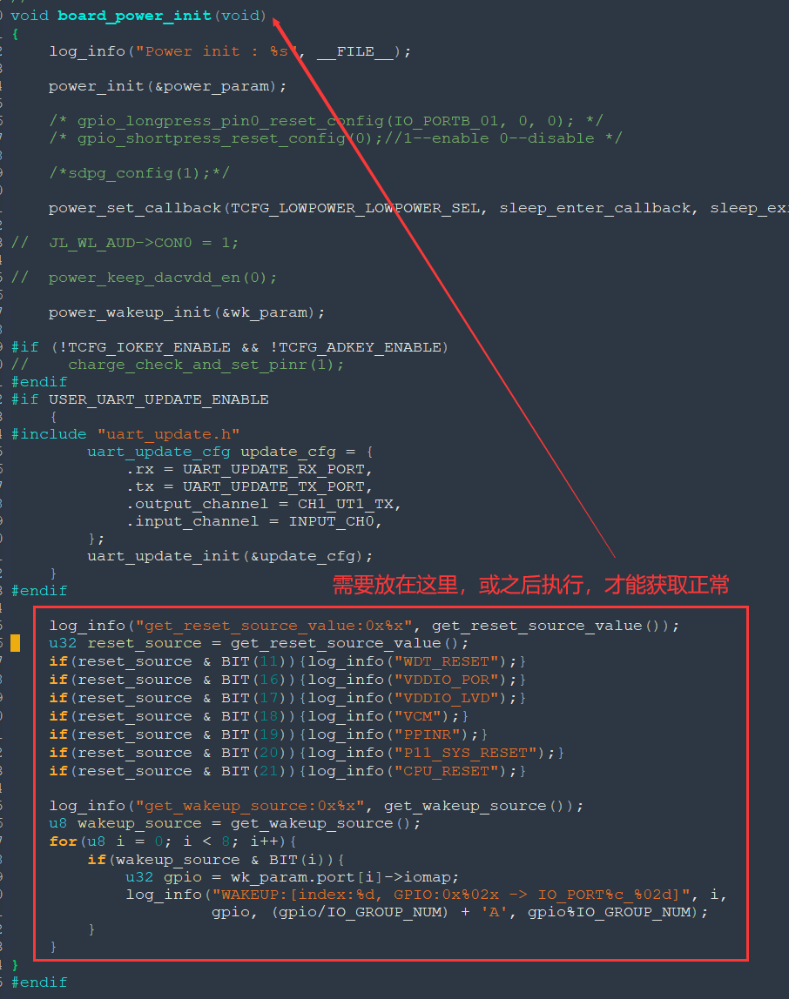

## 4. 代码异常复位等异常情况，开启详细打印的方式

**一、开启详细打印**

打开库打印

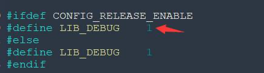

打开断言及异常

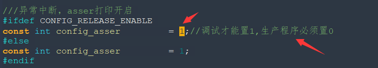

打开PMU的打印，复位后会打印复位源信息

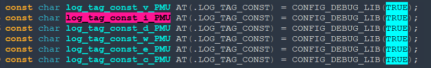

打印等级设置0，表示最低，所有打印都会打

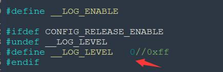

打开时间戳打印

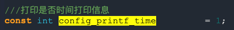

**二、可能出现的打印信息**

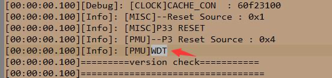

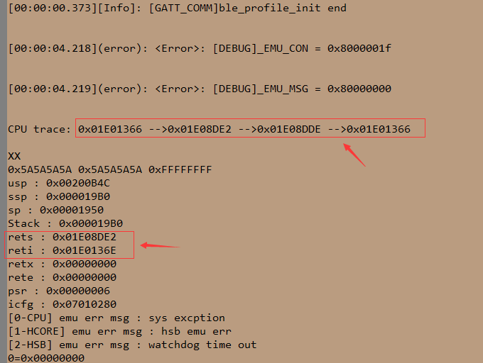

**三、编译产生反汇编文件**

记事本编辑打开 sdk\cpu\bd19\tools\download.c

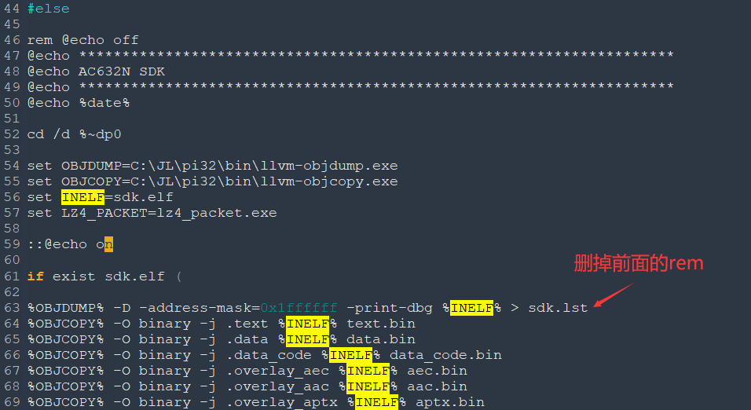

```
%OBJDUMP% -D -address-mask=0x1ffffff -print-dbg %INELF% > sdk.lst
%OBJDUMP% -D -address-mask=0x1ffffff -print-dbg %ELFFILE% > sdk.lst
```

**四、异常点对应的函数位置**

记事本编辑打开 sdk\cpu\bd19\tools\sdk.lst

```
CPU trace: ......
rets : ......
reti : ......
```

查找这几个打印的地址，对应的汇编代码，关联在哪个函数。

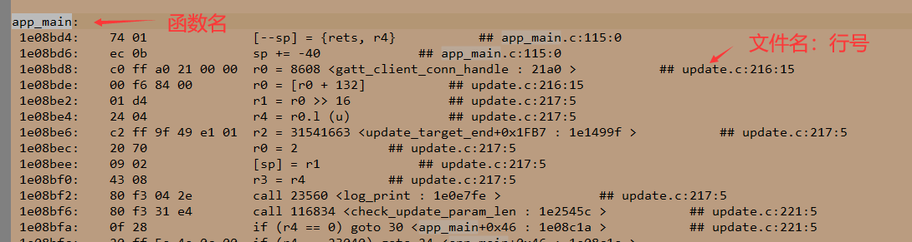

**五、常见复位源**

- VDDIO_POR:上电复位，一般是硬件原因
- VDDIO_LVD:低电复位，一般是硬件原因
- VCM:短按复位,软件可关闭(632:PB2)
- PPINR:长按8s复位，引脚功能，软硬件设计对不上
- CPU_RESET:软复位，断言或异常引起，软件原因
- WDT:看门狗复位，一般是软件原因，系统卡死
- DVDD_NO_OK:硬件是LDO做法，软件设置成DCDC,`#define TCFG_LOWPOWER_POWER_SEL PWR_LDO15`

## 5. 数传工程简易配对流程
- 在数传工程主机le_client_demo添加判断流程，可使主机与从机实现一对一的绑定，避免有多个从机存在时连上同名的不同从机

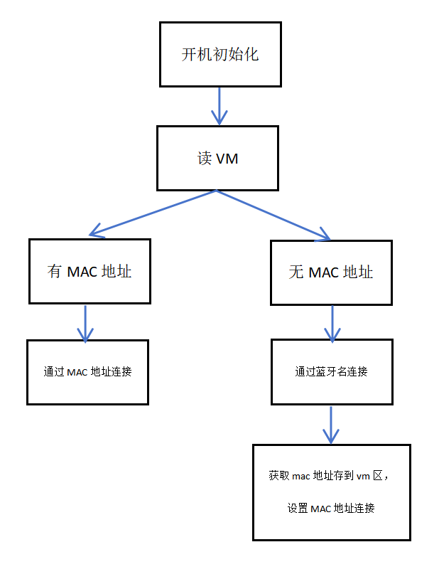

- ble初始化时获取vm区的mac信息

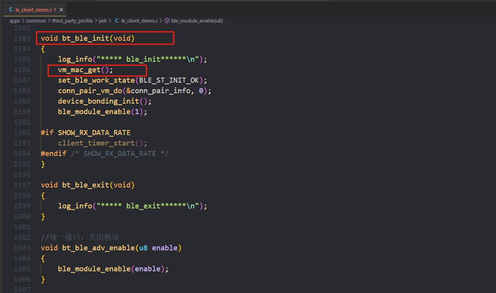

```
#define CFG_USER_BUF	 3
static u8 buf[6]  __attribute__((aligned(4)));
static u8 mac_buf[6]  __attribute__((aligned(4)));
static int pair_flag=0;
void vm_mac_get(void)
{
    log_info("%s", __func__);
    int ret = 0;
	memset(buf, 0x00, sizeof(buf));
    ret = syscfg_read(CFG_USER_BUF, buf, sizeof(buf));
    log_info("%s[CFG_USER_BUF -> syscfg_read:%d]", __func__, ret);
    if(ret != sizeof(buf)){
        log_info("CFG_USER_BUF -> syscfg_read -> err:%d", ret);
    }else{
        log_info_hexdump(buf, sizeof(buf));
    }
    if(ret>0){
        pair_flag=1;
        match_dev01.create_conn_mode=BIT(CLI_CREAT_BY_ADDRESS);
        match_dev01.compare_data_len = 6; 
        memcpy(test_remoter_mac,buf,6);
        match_dev01.compare_data = test_remoter_mac;
        match_dev01.bonding_flag = 0;
    }else{
        pair_flag=0;
        match_dev01.create_conn_mode=BIT(CLI_CREAT_BY_NAME);
        match_dev01.compare_data_len = sizeof(test_remoter_name1) - 1; 
        match_dev01.compare_data = test_remoter_name1;
        match_dev01.bonding_flag = 0;
    }
}
```

- 连接完成后将mac地址保存并设置mac地址方式发起连接

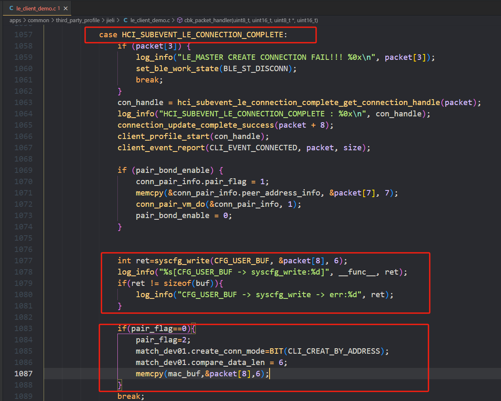

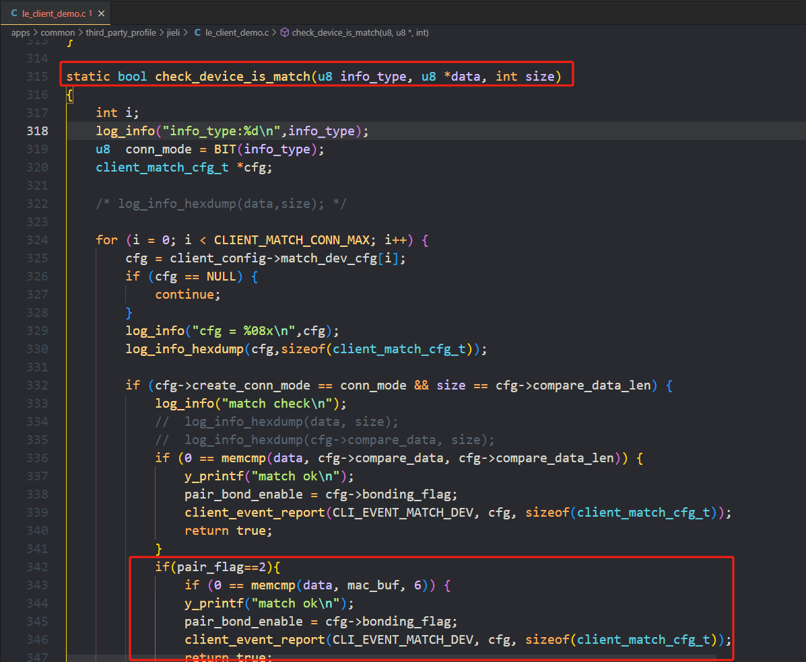

```
int ret=syscfg_write(CFG_USER_BUF, &packet[8], 6);
log_info("%s[CFG_USER_BUF -> syscfg_write:%d]", __func__, ret);
if(ret != sizeof(buf)){
	log_info("CFG_USER_BUF -> syscfg_write -> err:%d", ret);
}

if(pair_flag==0){
	pair_flag=2;
	match_dev01.create_conn_mode=BIT(CLI_CREAT_BY_ADDRESS);
	match_dev01.compare_data_len = 6; 
	memcpy(mac_buf,&packet[8],6);
}
```

```
if(pair_flag==2)
{
	if (0 == memcmp(data, mac_buf, 6)) {
    	y_printf("match ok\n");
        pair_bond_enable = cfg->bonding_flag;
        client_event_report(CLI_EVENT_MATCH_DEV, cfg, sizeof(client_match_cfg_t));
        return true;
        }
}
```

- 清除配对信息

```
void client_clear_pair_info(void)
{
    log_info("client_clear_pair_info\n");
    memset(buf, 0x00, sizeof(buf));
    int ret=syscfg_write(CFG_USER_BUF, buf, sizeof(buf));
    log_info("%s[CFG_USER_BUF -> syscfg_write:%d]", __func__, ret);
    if(ret != sizeof(buf)){
        log_info("CFG_USER_BUF -> syscfg_write -> err:%d", ret);
    }
    bt_ble_adv_enable(0);
    pair_flag=0;
    match_dev01.create_conn_mode=BIT(CLI_CREAT_BY_NAME);
    match_dev01.compare_data_len = sizeof(test_remoter_name1) - 1; 
    match_dev01.compare_data = test_remoter_name1;
    match_dev01.bonding_flag = 0;
    bt_ble_adv_enable(1);
}
```
