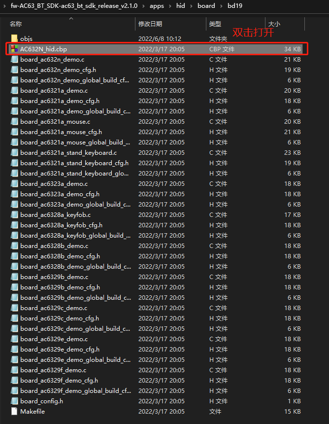
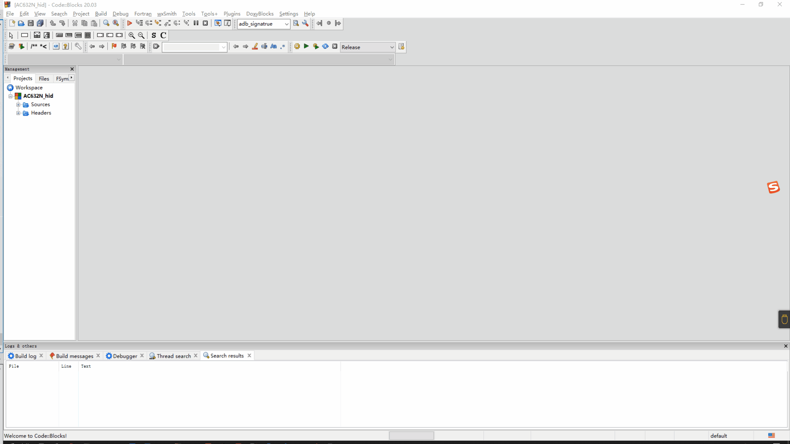
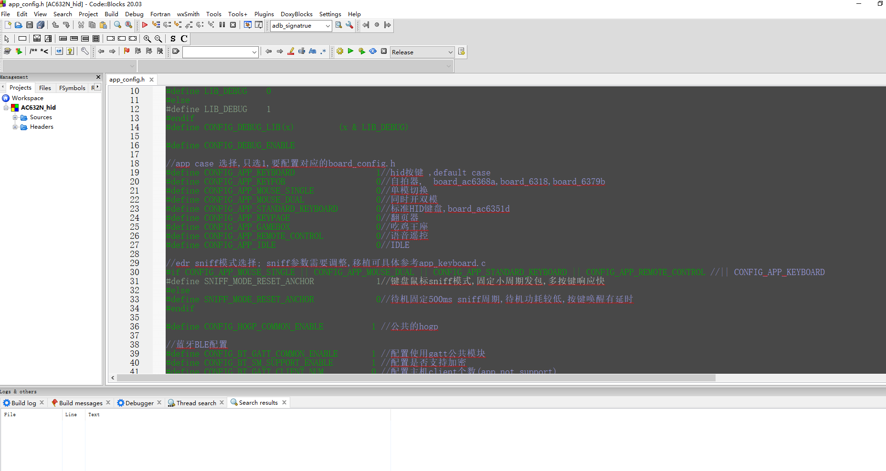
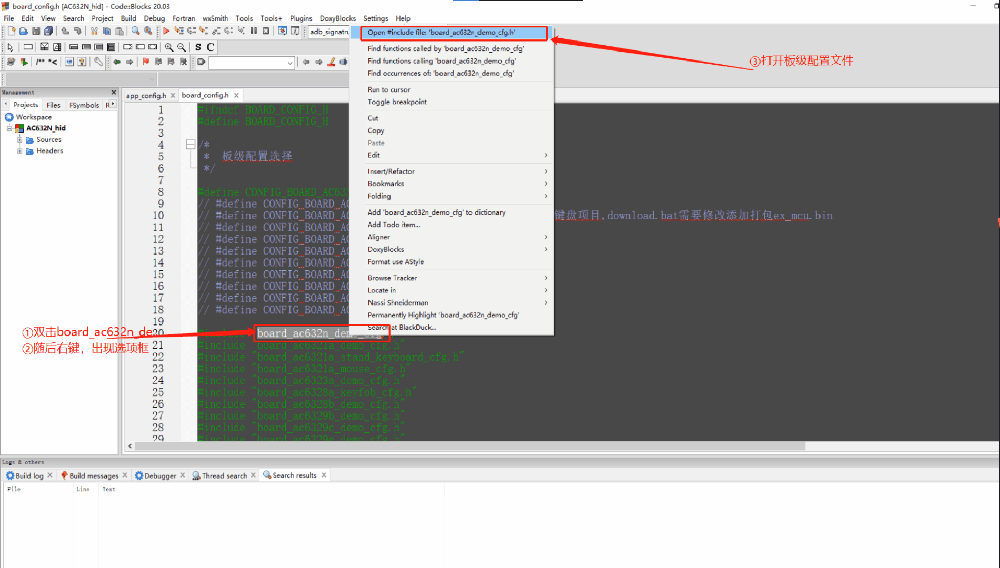
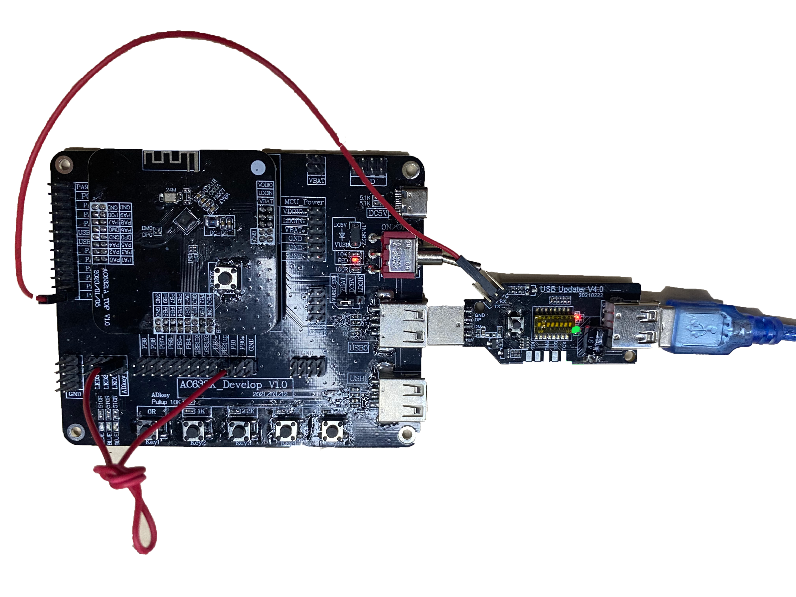
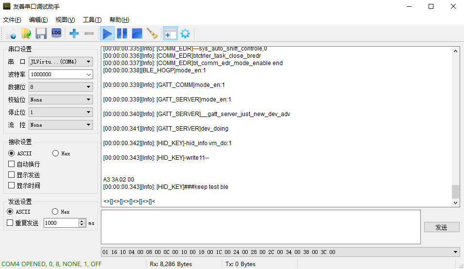
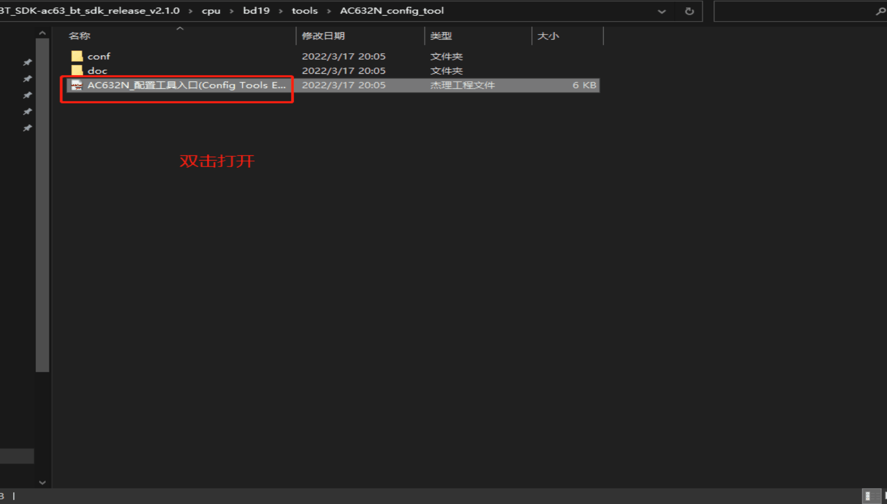

# 2. HID DEMO说明

## 2.1. 工程介绍

- 通用Human Interface Devices（HID）工程，一般做蓝牙从机连接手机/电脑/蓝牙主机,使用领域：hid按键、自拍器、 鼠标、键盘、翻页器、吃鸡王座、语音遥控器…

## 2.2. 配置使用

- 以下的DEMO的配置与说明均使用CodeBlocks进行演示。

### 2.2.1. 打开工程

- 按照 :[fw-AC63_BT_SDK](https://gitcode.com/yunthinker/fw-AC63_BT_SDK) 下载官方SDK。
- 去到/fw-AC63_BT_SDK-ac63_bt_sdk_release_vx.x.x/apps/hid/board/bd19目录下，双击AC632N_hid.cbp打开工程。
  

### 2.2.2. 配置板级

- 打开工程后，使用快捷键Alt + g 搜索board_config.h文件并双击打开。一般选择默认的板级（不同的板级有不同的开发需求）。



> **Note**
>
> 板级配置选择是单选，只能选择一个板级。

### 2.2.3. 选择case（默认选择hid按键示例）

- 使用快捷键Alt + g 打开app_config.h，配置CONFIG_APP_KEYBOARD使能。



- 让芯片处于下载模式，后进行编译下载。

- 下载代码后，根据代码将按键接线和log接线连接好。

  代码配置如下：



> **Note**
>
> 需要注意的是，上图的代码配置是默认配置，若开发者想更换按照需求更换即可（更换AD key时需要注意IO是否具有AD功能）， `同时board_ac632n_demo_cfg.h里面包含基本所有模块的宏开关，开发者应该特别重视`。

按照代码配置接线如下(下图按键接线：ADkey–PB1(ad按键,连接蓝牙后可控制播歌等操作)；RX–PA1(打印口))：



- 重新上电可查看log（baud:1000000）。至此恭喜你已经完成从安装到下载的全部步骤



- 代码下载好了也能跑了，作为一个蓝牙开发板他肯定具备被手机连接的功能。但是开发者怎么知道设备叫什么名字呢？ 双击打开/fw-AC63_BT_SDK-ac63_bt_sdk_release_vx.x.x/cpu/bd19/tools/AC632N_config_tool下的“AC632N_配置工具入口(Config Tools Entry).jlxproj”工具，为自己的设备设置一个蓝牙名字，并点击保存，再重新编译下载代码即可完成蓝牙名字设置。下载好后重新上电即可用手机搜索到设置的蓝牙名，开发者可以点击连接这个设备。



> **Note**
>
> 这个配置工具除了配置蓝牙名字，还能设置充电、电压提醒、设置蓝牙地址、设置蓝牙发射功率等功能，每次设置之后必须保存再重新下载代码才有效。

- 下一步根据自己选择的case进行相关开发，默认选择“hid按键”

### 2.3.1. hid按键

- 本案例为基于 HID 的键盘设备，可以用来媒体播放，上下曲暂停音量的控制，支持安卓和 IOS 的双系统，并且支持 BLE 和 EDR 两种工作模式。
- 支持的板级： br25、br23、br30、bd19、br34 支持的芯片： AC636N、AC635N、AC632N、AC638N

#### 2.3.1.1. hid按键case使用

- 使用快捷键Alt + g 打开app_config.h，配置CONFIG_APP_KEYBOARD使能

  

- 板级选择默认板级即可


- 编译下载代码、接线、复位设备,再使用手机搜索设备进行连接。
- 开发者可以操作板子上面的按键去控制手机：媒体播放，上下曲暂停音量的控制（需要打开手机的播歌软件）。 `至此恭喜你已经完成case的下载与测试`。

> **Note**
>
> 若出现无法进行：媒体播放，上下曲暂停音量的控制。开发者应该确保手机蓝牙是否正常连接、查看ad key接线是否接上，如还是无法成功，请先查阅 faq，可能你的答案已经存在。

#### 2.3.1.2. hid按键代码流程

完成了代码下载，case使用，下一步即开发代码，hid的代码结构如下，同时参考启动流程了解： :[SDK启动流程](https://doc.zh-jieli.com/AC63/zh-cn/release_v2.3.0/getting_started/sdk_app_develop/start_process.html#start-process) 。

> Note
>
> 以下只是为演示代码流程，开发者不用去修改代码。以下示例是用默认CONFIG_APP_KEYBOARD例子进行说明，其他例子流程参考如下流程理解。

- APP 注册运行：打开app_main.c，里面的app_main()函数即做app的注册和运行

```c
#if (CONFIG_APP_MOUSE)
    it.name = "mouse";
    it.action = ACTION_MOUSE_MAIN;
#elif(CONFIG_APP_KEYFOB)
    it.name = "keyfob";
    it.action = ACTION_KEYFOB;
#elif(CONFIG_APP_KEYBOARD)
    it.name = "hid_key";

    start_app(&it);
}
```

- 首先会在 app_main.c 函数中添加 hid_key 应用分支，然后进行应用注册

```
REGISTER_APPLICATION(app_hid) = {
.name   = "hid_key",
.action = ACTION_HID_MAIN,
.ops    = &app_hid_ops,
.state  = APP_STA_DESTROY,
};
```

- 按照上述代码进行APP注册，执行配置好的app。之后进入APP_state_machine（app_keyboard.c文件里）,根据状态机的不同状态执行不同的分支，第一次执行时进入APP_STA_CREATE分支后再进入APP_STA_START分支，执行对应的app_start()。开始执行app_start()在该函数内进行时钟初始化，进行蓝牙模式选择，按键消息使能等一些初始化操作，其中按键使能使得系统在有外部按键事件发生时及时响应，进行事件处理。

```
REGISTER_LP_TARGET(app_hidkey_lp_target) = {
    .name = "app_hidkey_deal",
    .is_idle = hidkey_app_idle_query,
};
static const struct application_operation app_hidkey_ops = {
    .state_machine  = hidkey_state_machine,
    .event_handler  = hidkey_event_handler,
};
```

- hie_key应用注册以后，进行以上的app_hid_ops进行处理。分为两个模块hidkey_state_machine和hidkey_event_handler。执行流程大致如下，对应函数位于app_keyboard.c文件：hidkey_state_machine()—>app_start()—>sys_key_event_enable()。主要根据应用的状态进行时钟初始化，蓝牙名设置，读取配置信息，消息按键使能等配置。hidkey_event_handler(struct application [*](https://doc.zh-jieli.com/AC63/zh-cn/release_v2.3.0/module_demo/hid/keyboard.html#id2)app, struct sys_event [*](https://doc.zh-jieli.com/AC63/zh-cn/release_v2.3.0/module_demo/hid/keyboard.html#id4)event)—>hidkey_key_event_handler(sys_event [*](https://doc.zh-jieli.com/AC63/zh-cn/release_v2.3.0/module_demo/hid/keyboard.html#id6)event)—>hidkey_key_deal_test(key_type,key_value)—->hidkey_key_deal_test(key_msg)。事件处理流程大致如上所示。hidkey_event_handler()根据传入的第二个参数事件类型，选择对应的处理分支，此处选择执行按键事件，然后调用按键事件处理函数根据事件的按键值和按键类型进行对应的事件处理。

#### 2.3.1.3. hid代码APP事件处理机制

- 参考开发框架理解 :APP 开发框架。

- 事件的产生与定义：外部事件的数据采集在系统软件定时器的中断服务函数中完成，采集的数据将被打包为相应的 事件周期性地上报至全局事件列表。void sys_event_notify(struct sys_event [*](https://doc.zh-jieli.com/AC63/zh-cn/release_v2.3.0/module_demo/hid/keyboard.html#id8)e)；此函数为事件通知函数，系统有事件发生时调用。

- 事件的处理：本案例中主要的事件处理包括连接事件处理、按键事件处理处理，事件处理函数的共同入口都是event_handler()之后调用不同的函数实现不同类型事件的响应处理。

  > - 蓝牙连接事件处理：在APP运行以后，首先进行的蓝牙连接事件处理，进行蓝牙初始化，HID描述符解读，蓝牙模式选择等，。调用hidkey_event_handler(),hidkey_bt_connction_status_event_handler()函数实现蓝牙连接等事件(可理解为 :[APP 开发框架](https://doc.zh-jieli.com/AC63/zh-cn/release_v2.3.0/getting_started/sdk_app_develop/app_framework.html#start-frame) 图中的handler_1)。
  > - 按键事件处理：通过hidkey_event_handler()函数中调用hidkey_key_event_handler()函数实现对按键事件的处理(可理解为 :[APP 开发框架](https://doc.zh-jieli.com/AC63/zh-cn/release_v2.3.0/getting_started/sdk_app_develop/app_framework.html#start-frame) 图中的handler_2)。

#### 2.3.1.4. 主要代码说明

hid代码数据发送模块：

- 自定义的键盘描述符（上发给手机的包格式就是按照hidkey_report_map里面的格式进行上发给手机）如下所示（app_keyboard.c）：

```
static const u8 hidkey_report_map[] = {
    0x05, 0x0C,        // Usage Page (Consumer)
    0x09, 0x01,        // Usage (Consumer Control)
    0xA1, 0x01,        // Collection (Application)
    0x85, 0x01,        //   Report ID (1)
    0x09, 0xE9,        //   Usage (Volume Increment)
    0x09, 0xEA,        //   Usage (Volume Decrement)
    0x09, 0xCD,        //   Usage (Play/Pause)
    0x09, 0xE2,        //   Usage (Mute)
    0x09, 0xB6,        //   Usage (Scan Previous Track)
    0x09, 0xB5,        //   Usage (Scan Next Track)
    0x09, 0xB3,        //   Usage (Fast Forward)
    0x09, 0xB4,        //   Usage (Rewind)
    0x15, 0x00,        //   Logical Minimum (0)
    0x25, 0x01,        //   Logical Maximum (1)
    0x75, 0x01,        //   Report Size (1)
    0x95, 0x10,        //   Report Count (16)
    0x81, 0x02,        //   Input (Data,Var,Abs,No Wrap,Linear,Preferred State,No Null Position)
    0xC0,              // End Collection
    // 35 bytes
};
```

- 根据不同的按键值和按键类型，进行数据发送。部分发送函数入下（app_keyboard.c）：

```
    if (key_msg) {
        printf("key_msg = %02x\n", key_msg);
        if (bt_hid_mode == HID_MODE_EDR) {
            edr_hid_key_deal_test(key_msg);
            bt_sniff_ready_clean();
        } else {
#if TCFG_USER_BLE_ENABLE
            ble_hid_key_deal_test(key_msg);
#endif
        }
        return;
```

> **Note**
>
> 开发者可以参考“HID模块”了解hid描述符含义。


### 2.3.2. 自拍杆

- 本案例主要用于蓝牙自拍器实现，进行以下配置后，打开手机蓝牙连接设备可进行对应的拍照 操作。由于自拍器的使用会用到 LED 所以本案例也要对 LED 进行对应的设置，自拍器设备上电以后 没有连接蓝牙之前，LED 以一定的频率闪烁，直到连接或者是进入 sleep 模式时熄灭。蓝牙连接以后 LED 熄灭，同时按键按下的时候 LED 会变化，可以通过 LED 的状态来判断自拍器的工作状态。
- 支持板级：br25、bd19 支持芯片：AC6368A、AC6328A

#### 2.3.2.1. 自拍杆case使用

- 使用快捷键Alt + g 打开app_config.h，配置CONFIG_APP_KEYFOB使能

```
//app case 选择,只选1,要配置对应的board_config.h
#define CONFIG_APP_KEYFOB        1//自拍器,  board_ac6328a,board_6328
```

- 使用快捷键Alt + g 打开board_config.h，板级选择CONFIG_BOARD_AC6328A_KEYFOB

```
//#define CONFIG_BOARD_AC632N_DEMO       // CONFIG_APP_KEYBOARD,CONFIG_APP_PAGE_TURNER
// #define CONFIG_BOARD_AC6321A_MOUSE  // CONFIG_APP_MOUSE
 #define CONFIG_BOARD_AC6328A_KEYFOB     // CONFIG_APP_KEYFOB
```

- 按照 :HID DEMO说明 编译下载代码、接线(接线参考下列)、复位设备,再使用手机搜索设备进行连接。

​	KEY: key接线需要打开board_ac6328a_keyfob_cfg.h查看IO key接线，将IO key1 连接USB0DP(IO_PORT_DP)、IO key2 连接USB0DM(IO_PORT_DM)。

```
//*********************************************************************************//
//                                 iokey 配置                                      //
//*********************************************************************************//
#define TCFG_IOKEY_ENABLE                   ENABLE_THIS_MOUDLE //是否使能IO按键
#define TCFG_IOKEY_PREV_CONNECT_WAY         ONE_PORT_TO_LOW  //按键一端接低电平一端接IO
#define TCFG_IOKEY_PREV_ONE_PORT            IO_PORT_DP
#define TCFG_IOKEY_NEXT_CONNECT_WAY         ONE_PORT_TO_LOW  //按键一端接低电平一端接IO
#define TCFG_IOKEY_NEXT_ONE_PORT            IO_PORT_DM
```

​	LED： led接线打开board_ac6328a_keyfob_cfg.h查看led接线

```
//*********************************************************************************//
//                                  LED 配置                                       //
//*********************************************************************************//
#define TCFG_PWMLED_ENABLE                  ENABLE_THIS_MOUDLE          //是否支持PMW LED推灯模块
#define TCFG_PWMLED_IO_PUSH                 DISABLE_THIS_MOUDLE
#define TCFG_PWMLED_IOMODE                  LED_ONE_IO_MODE             //LED模式，单IO还是两个IO推灯
#define TCFG_PWMLED_PIN                     IO_PORTA_09                 //LED使用的IO口
```

- 开发者可以操作板子IO key1、IO key2实现蓝牙自拍器的功能。

#### 2.3.2.2. 主要代码说明

APP注册运行：

- 代码进行 APP 注册，执行配置好的 app。之后进入 APP_state_machine,根据状态机的 不同状态执行不同的分支，第一次执行时进入 APP_STA_CREATE 分支，执行对应的 app_start()。开始执行 app_start()在该函数内进行时钟初始化，进行蓝牙模式选择，按键消息使能等一些初始化操作， 其中按键使能使得系统在有外部按键事件发生时及时响应，进行事件处理（app_keyfob.c）。

```
REGISTER_LP_TARGET(app_hid_lp_target) = {
.name = "app_hid_deal",
.is_idle = app_hid_idle_query,
};

static const struct application_operation app_hid_ops = {
.state_machine = state_machine,
.event_handler = event_handler,
};
/*
* 注册 AT Module 模式
*/
REGISTER_APPLICATION(app_hid) = {
.name = "keyfob",
.action = ACTION_KEYFOB,
.ops = &app_hid_ops,
.state = APP_STA_DESTROY,
};
```

APP 事件处理机制：

- 事件的产生与定义
  - 外部事件的数据采集在系统软件定时器的中断服务函数中完成，采集的数据将被打包为相应的“事件”周期性地上报至全局事件列表。
  - void sys_event_notify(struct sys_event [*](https://doc.zh-jieli.com/AC63/zh-cn/release_v2.3.0/module_demo/hid/keyfob.html#id3)e)； 此函数为事件通知函数，系统有事件发生时调用。
- 事件的处理
  - 本案例中主要的事件处理包括连接事件处理、按键事件处理和 LED 事件处理，事件处理函数的 共同入口都是 event_handler().之后调用不同的函数实现不同类型事件的响应处理。
  - 蓝牙连接事件处理：在 APP 运行以后，首先进行的蓝牙连接事件处理，再进行蓝牙初始化，HID 描述符解读，蓝牙模式选择等，下列函数的第二个参数根据事件的不同，传入不同的事件类型，执行不同分支，如下代码所示（app_keyfob.c）：

```
static int keyfob_event_handler(struct application *app, struct sys_event *event)
{

#if (TCFG_HID_AUTO_SHUTDOWN_TIME)
    //重置无操作定时计数
    if (event->type != SYS_DEVICE_EVENT || DEVICE_EVENT_FROM_POWER != event->arg) { //过滤电源消息
        sys_timer_modify(g_auto_shutdown_timer, TCFG_HID_AUTO_SHUTDOWN_TIME * 1000);
    }
#endif

#if TCFG_USER_EDR_ENABLE
    bt_comm_edr_sniff_clean();
#endif
    /* log_info("event: %s", event->arg); */
    switch (event->type) {
    case SYS_KEY_EVENT:
        /* log_info("Sys Key : %s", event->arg); */
        app_keyfob_event_handler(event);
        return 0;
```

- 以下代码为蓝牙连接事件处理函数，进行蓝牙初始化以及模式选择（app_keyfob.c）。

```
static int keyfob_bt_connction_status_event_handler(struct bt_event *bt)
{

    log_info("--------keyfob_bt_connction_status_event_handler %d", bt->event);

    switch (bt->event) {
    case BT_STATUS_INIT_OK:
        /*
         * 蓝牙初始化完成
         */
        log_info("BT_STATUS_INIT_OK\n");
```

- 调用 keyfob_event_handler()，keyfob_bt_connction_status_event_handler()函数实现蓝牙连接等事件。
- 按键事件处理和 LED 事件处理：通过调用 app_keyfob_event_handler()函数进入按键事件处理流程，根据按键的类型和按键值进 入 app_key_deal_test()函数进行事件处理（app_keyfob.c）。

```
static void app_keyfob_event_handler(struct sys_event *event)
{
    /* u16 cpi = 0; */
    u8 event_type = 0;
    u8 key_value = 0;

    if (event->arg == (void *)DEVICE_EVENT_FROM_KEY) {
        event_type = event->u.key.event;
        key_value = event->u.key.value;
        printf("app_key_evnet: %d,%d\n", event_type, key_value);
        app_keyfob_deal_test(event_type, key_value);
    }
}

static void app_keyfob_deal_test(u8 key_type, u8 key_value)
{
    u16 key_msg = 0;

#if TCFG_USER_EDR_ENABLE
    if (bt_hid_mode == HID_MODE_EDR && !edr_hid_is_connected()) {
        if (bt_connect_phone_back_start()) { //回连
            return;
        }
    }
#endif

    switch (key_type) {
```

- 下图为 LED 工作状态部分实现函数（app_keyfob.c）。

```
static void led_on_off(u8 state, u8 res)
{
    /* if(led_state != state || (state == LED_KEY_HOLD)){ */
    if (1) { //相同状态也要更新时间
        u8 prev_state = led_state;
        log_info("led_state: %d>>>%d", led_state, state);
        led_state = state;
        led_io_flash = 0;
```

- 数据发送：

- KEYFOB 属于 HID 设备范畴，数据的定义与发送要根据 HID 设备描述符的内容进行确定，由下 图的描述符可知，该描述符是一个用户自定义描述符，可以组合实现各种需要的功能，一共有两个 Input 实体描述符。其中每个功能按键对应一个 bit,一共 11bit,剩余一个 13bit 的常数输入实体，所以 自定义描述符的数据包长度位 3byte.如果用户需要在自拍器的基础上增加不同按键类型的事件，可 以在下面的描述符中先添加该功能，然后在按键处理函数分支进行对应的按键值和按键类型的设置， 来实现对应的功能。
- 用户自定义的描述符组成本案例的 KEYFOB 描述符，实现对应的按键功能（app_keyfob.c）。

```
static const u8 keyfob_report_map[] = {
    //通用按键
    0x05, 0x0C,        // Usage Page (Consumer)
    0x09, 0x01,        // Usage (Consumer Control)
    0xA1, 0x01,        // Collection (Application)
    0x85, 0x03,        //   Report ID (3)
    0x15, 0x00,        //   Logical Minimum (0)
    0x25, 0x01,        //   Logical Maximum (1)
    0x75, 0x01,        //   Report Size (1)
    0x95, 0x0B,        //   Report Count (11)
    0x0A, 0x23, 0x02,  //   Usage (AC Home)
    0x0A, 0x21, 0x02,  //   Usage (AC Search)
    0x0A, 0xB1, 0x01,  //   Usage (AL Screen Saver)
    0x09, 0xB8,        //   Usage (Eject)
    0x09, 0xB6,        //   Usage (Scan Previous Track)
    0x09, 0xCD,        //   Usage (Play/Pause)
    0x09, 0xB5,        //   Usage (Scan Next Track)
    0x09, 0xE2,        //   Usage (Mute)
    0x09, 0xEA,        //   Usage (Volume Decrement)
    0x09, 0xE9,        //   Usage (Volume Increment)
    0x09, 0x30,        //   Usage (Power)
    0x0A, 0xAE, 0x01,  //   Usage (AL Keyboard Layout)
    0x81, 0x02,        //   Input (Data,Var,Abs,No Wrap,Linear,Preferred State,No Null Position)
    0x95, 0x01,        //   Report Count (1)
    0x75, 0x0D,        //   Report Size (13)
    0x81, 0x03,        //   Input (Const,Var,Abs,No Wrap,Linear,Preferred State,No Null Position)
    0xC0,              // End Collection

    // 119 bytes
};
```

- 下列即发送模块，发送的数据是按照上面的 HID 设备描述符 格式进行发送的（app_keyfob.c）。

```
static void key_value_send(u8 key_value, u8 mode)
{
    void (*hid_data_send_pt)(u8 report_id, u8 * data, u16 len) = NULL;

    if (bt_hid_mode == HID_MODE_EDR) {
#if TCFG_USER_EDR_ENABLE
        hid_data_send_pt = edr_hid_data_send;
#endif
    } else {
#if TCFG_USER_BLE_ENABLE
        hid_data_send_pt = ble_hid_data_send;
#endif
    }

    if (!hid_data_send_pt) {
        return;
    }

    if (key_value == KEY_BIG_ID) {
```

### 2.3.3. 单模鼠标

- 标准的蓝牙鼠标，支持蓝牙 CLASSIC，蓝牙 BLE 和 2.4G 模式。
- 蓝牙鼠标支持 windows 系统，mac 系统、安卓系统、ios 系统连接。
- 支持的板级：br25、bd19 支持的芯片：AC6363F、AC6369F

#### 2.3.3.1. 单模鼠标case使用

- 使用快捷键Alt + g 打开app_config.h，配置CONFIG_APP_MOUSE_SINGLE使能

```
//app case 选择,只选1,要配置对应的board_config.h
#define CONFIG_APP_MOUSE_SINGLE        1//自拍器,  board_ac6328a,board_6328
```

- 使用快捷键Alt + g 打开board_config.h，板级选择CONFIG_BOARD_AC6321A_MOUSE

```
//#define CONFIG_BOARD_AC632N_DEMO       // CONFIG_APP_KEYBOARD,CONFIG_APP_PAGE_TURNER
 #define CONFIG_BOARD_AC6321A_MOUSE  // CONFIG_APP_MOUSE
// #define CONFIG_BOARD_AC6328A_KEYFOB     // CONFIG_APP_KEYFOB
```

按照 :HID DEMO说明编译下载代码、接线(接线参考下列)、复位设备,再使用手机搜索设备进行连接。

​	KEY: key接线需要打开”board_ac6321a_mouse_cfg.h”查看IO key接线。

```
#define MOUSE_KEY_SCAN_MODE               ENABLE_THIS_MOUDLE
#define TCFG_IOKEY_ENABLE                                 ENABLE_THIS_MOUDLE //是否使能IO按键

#define TCFG_IOKEY_POWER_CONNECT_WAY              ONE_PORT_TO_LOW    //按键一端接低电平一端接IO

#define TCFG_IOKEY_MOUSE_LK_PORT                      IO_PORTA_01 //鼠标左键
#define TCFG_IOKEY_MOUSE_RK_PORT                      IO_PORTA_02 //鼠标右键
#define TCFG_IOKEY_MOUSE_HK_PORT                      IO_PORTA_00 //鼠标中键
#define TCFG_IOKEY_MOUSE_MK_IN_PORT                       NO_CONFIG_PORT //未使用
#define TCFG_IOKEY_MOUSE_MK_OUT_PORT                      NO_CONFIG_PORT //未使用
```

code switch： 打开”board_ac6321a_mouse_cfg.h”查看编码开关接线

```
//*********************************************************************************//
//                                  code switch配置                                //
//*********************************************************************************//
#define TCFG_CODE_SWITCH_ENABLE                   ENABLE_THIS_MOUDLE
#define TCFG_CODE_SWITCH_A_PHASE_PORT             IO_PORTB_04
#define TCFG_CODE_SWITCH_B_PHASE_PORT             IO_PORTB_05
```

optical mouse sensor： 打开”board_ac6321a_mouse_cfg.h”查看鼠标位移传感器接线

```
//*********************************************************************************//
//                                  optical mouse sensor配置                       //
//*********************************************************************************//
#define TCFG_OMSENSOR_ENABLE                      ENABLE_THIS_MOUDLE
#define TCFG_HAL3205_EN                           TCFG_OMSENSOR_ENABLE  //同时配置OMSensor_config.h中的配置项
// #define TCFG_HAL3212_EN                           TCFG_OMSENSOR_ENABLE
#define TCFG_OPTICAL_SENSOR_SCLK_PORT             IO_PORTA_07
#define TCFG_OPTICAL_SENSOR_DATA_PORT             IO_PORTA_08
#define TCFG_OPTICAL_SENSOR_INT_PORT              IO_PORTB_06

#define OPTICAL_SENSOR_SAMPLE_PERIOD     6 //ms
```

- 开发者可以准备好相应硬件并进行连接进行调试。

#### 2.3.3.2. 主要代码说明

- 模式选择：配置 BLE 或 2.4G 模式；若选择 2.4G 配对码必须跟对方的配对码一致（app_mouse.c）

```
//2.4G模式: 0---ble, 非0---2.4G配对码
#define CFG_RF_24G_CODE_ID       (0) //<=24bits
/* #define CFG_RF_24G_CODE_ID       (0x23) //<=24bits */
```

- 支持双模 HID 设备切换处理（app_mouse.c）

```
static void mouse_select_btmode(u8 mode)
{
    if (mode != HID_MODE_INIT) {
        if (bt_hid_mode == mode) {
            return;
        }
        bt_hid_mode = mode;
    } else {
        //init start
    }


    log_info("###### %s: %d,%d\n", __FUNCTION__, mode, bt_hid_mode);


    if (bt_hid_mode == HID_MODE_BLE) {
        //ble
        log_info("---------app select ble--------\n");
```

- 支持进入省电低功耗 Sleep（board_ac6321a_mouse_cfg.h）

```
//*********************************************************************************//
//                                  低功耗配置                                     //
//*********************************************************************************//
#define TCFG_LOWPOWER_POWER_SEL                               PWR_DCDC15
// #define TCFG_LOWPOWER_POWER_SEL                            PWR_LDO15                    //电源模式设置，可选DCDC和LDO
#define TCFG_LOWPOWER_BTOSC_DISABLE                   0                            //低功耗模式下BTOSC是否保持
#define TCFG_LOWPOWER_LOWPOWER_SEL                    SLEEP_EN                     //SNIFF状态下芯片是否进入powerdown
/*强VDDIO等级配置,可选：
    VDDIOM_VOL_20V    VDDIOM_VOL_22V    VDDIOM_VOL_24V    VDDIOM_VOL_26V
    VDDIOM_VOL_30V    VDDIOM_VOL_30V    VDDIOM_VOL_32V    VDDIOM_VOL_36V*/
#define TCFG_LOWPOWER_VDDIOM_LEVEL                    VDDIOM_VOL_30V
/*弱VDDIO等级配置，可选：
    VDDIOW_VOL_21V    VDDIOW_VOL_24V    VDDIOW_VOL_28V    VDDIOW_VOL_32V*/
#define TCFG_LOWPOWER_VDDIOW_LEVEL                    VDDIOW_VOL_28V               //弱VDDIO等级配置
#define TCFG_LOWPOWER_OSC_TYPE              OSC_TYPE_LRC
#define TCFG_VD13_CAP_EN                                      1
```

- 支持进入软关机，可用 IO 触发唤醒（board_ac6321a_mouse.c）

```
struct port_wakeup port0 = {
      .pullup_down_enable = ENABLE,                            //配置I/O 内部上下拉是否使能
      .edge               = FALLING_EDGE,                      //唤醒方式选择,可选：上升沿\下降沿
      .both_edge          = 0,
      .filter             = 0,
      .iomap              = TCFG_CODE_SWITCH_A_PHASE_PORT,                       //唤醒口选择
};

void board_set_soft_poweroff(void)
{
      u32 porta_value = 0xffff;
      u32 portb_value = 0xffff;
      u32 portc_value = 0xffff;

#if TCFG_OMSENSOR_ENABLE
      optical_mouse_sensor_led_switch(0);
#endif
      gSensor_wkupup_disable();

      log_info("%s",__FUNCTION__);
```

- 系统事件处理函数（app_mouse.c）

```
static int event_handler(struct application *app, struct sys_event *event)
```

- 蓝牙事件处理函数（app_mouse.c）

```
static int bt_hci_event_handler(struct bt_event *bt)
```

- 增加配对绑定管理（app_mouse.c）

```
//使能开配对管理，BLE & 2.4g 鼠标只绑定1个主机,可自己修改按键方式
#define DOUBLE_KEY_HOLD_PAIR      (0 & CFG_RF_24G_CODE_ID)  //中键+右键 长按数秒,进入2.4G配对模式
#define DOUBLE_KEY_HOLD_CNT       (4)  //长按中键计算次数 >= 4s
```

#### 2.3.3.3. 蓝牙鼠标case功耗

- 所用光学传感器资料

- 测试条件

  ble连接状态下Interval：6*1.25 ms = 7.5ms，lantency：100；

  Radio TX: 7.2 dBm

  DCDC；VDDIOM 3.0V；VDDIOW 2.4V

  VDDIO和VBAT短接

- 芯片功耗

  *芯片功耗（1、硬件不接模块；2、软件关闭所有模块）*

| ／   | ／       | 无操作  | 软关机 |
| ---- | -------- | ------- | ------ |
| 2.1V | 最大电流 | 1.338mA | 1uA    |
| 2.1V | 平均电流 | 139uA   | 1uA    |
| 2.1V | 最小电流 | 30uA    | 1uA    |
| 2.6V | 最大电流 | 852uA   | 2uA    |
| 2.6V | 平均电流 | 110uA   | 2uA    |
| 2.6V | 最小电流 | 33uA    | 1uA    |
| 3.0V | 最大电流 | 965uA   | 2uA    |
| 3.0V | 平均电流 | 110uA   | 2uA    |
| 3.0V | 最小电流 | 33uA    | 2uA    |
| 3.3V | 最大电流 | 813uA   | 3uA    |
| 3.3V | 平均电流 | 113uA   | 3uA    |
| 3.3V | 最小电流 | 35uA    | 1uA    |

- 整机功耗

​	*芯片功耗（1、硬件接上所有模块；2、软件使能所有模块）*

| ／   | ／       | sleep1(无操作256毫秒后) | sleep2(无操作20.48秒后) | 软关机 |
| ---- | -------- | ----------------------- | ----------------------- | ------ |
| 2.1V | 最大电流 | 2.894mA                 | 1.253mA                 | 65uA   |
| 2.1V | 平均电流 | 230uA                   | 140uA                   | 12uA   |
| 2.1V | 最小电流 | 95uA                    | 29uA                    | 1uA    |
| 2.6V | 最大电流 | 1.008mA                 | 1.062mA                 | 63u    |
| 2.6V | 平均电流 | 193uA                   | 125uA                   | 13u    |
| 2.6V | 最小电流 | 111uA                   | 31uA                    | 3uA    |
| 3.0V | 最大电流 | 864uA                   | 864uA                   | 55uA   |
| 3.0V | 平均电流 | 190uA                   | 120uA                   | 13uA   |
| 3.0V | 最小电流 | 109uA                   | 37uA                    | 6uA    |
| 3.3V | 最大电流 | 858uA                   | 783uA                   | 53uA   |
| 3.3V | 平均电流 | 185uA                   | 139uA                   | 14uA   |
| 3.3V | 最小电流 | 114uA                   | 39uA                    | 7uA    |

### 2.3.4. 双模鼠标

- 标准的蓝牙鼠标，支持蓝牙 CLASSIC，蓝牙 BLE 和 2.4G 模式。
- 蓝牙鼠标支持 windows 系统，mac 系统、安卓系统、ios 系统连接。
- 支持的板级：br25、bd19 支持的芯片：AC6363F、AC6369F

#### 2.3.4.1. 双模鼠标case使用

- 使用快捷键Alt + g 打开app_config.h，配置CONFIG_APP_KEYFOB使能

```
//app case 选择,只选1,要配置对应的board_config.h
#define CONFIG_APP_MOUSE_DUAL                  1//同时开双模
```

- 使用快捷键Alt + g 打开board_config.h，板级选择CONFIG_BOARD_AC6321A_MOUSE

```
//#define CONFIG_BOARD_AC632N_DEMO       // CONFIG_APP_KEYBOARD,CONFIG_APP_PAGE_TURNER
 #define CONFIG_BOARD_AC6321A_MOUSE  // CONFIG_APP_MOUSE
// #define CONFIG_BOARD_AC6328A_KEYFOB     // CONFIG_APP_KEYFOB
```

- 编译下载代码、接线、复位设备,再使用手机搜索设备进行连接。
- 开发者可以准备好相应硬件并进行连接进行调试。

#### 2.3.4.2. 主要代码说明

- 参考单模鼠标

### 2.3.5. 蓝牙键盘[](https://doc.zh-jieli.com/AC63/zh-cn/release_v2.3.0/module_demo/hid/standard_keyboard.html#id1)

- 本案例主要用于标准双模蓝牙键盘的实现，设备开机之后进入配对状态，用于可以与能搜索到 蓝牙 3.0、蓝牙 4.0 两种设备进行连接，连接成功之后，另一个会消失。SDK 默认支持 4 个设备连接 键盘（同时只能连接一个），通过按键进行切换设备。
- 支持板级：br23、bd19 支持芯片：AC6351D、AC6321A
- 对于bd19的键盘方案：新增加了按键扫描模块 AD15N，除了处理按键扫描有点区别外，其他部分 实现方式跟 AC6351D 实现方式是一致的，需要在批处理文件中添加.bin文件用于编译 tools/download/data_trans/download.bat。

- 用记事本的方式打开 tools/download/data_trans/download.bat文件，并在下列位置添加 **../../ex_mcu.bin** 这行代码

```
../../isd_download.exe ../../isd_config.ini -tonorflash -dev bd19 -boot 0x2000 -div8 -wait 300 -uboot ../../uboot.boot -app ../../app.bin ../../cfg_tool.bin -res ../../p11_code.bin `../../ex_mcu.bin` -uboot_compress
```

#### 2.3.5.1. 蓝牙键盘case使用

- 因为下列键盘使用的br23键盘举例，首先关闭之前bd19的工程，打开/fw-AC63_BT_SDK-ac63_bt_sdk_release_vx.x.x/apps/hid/board/br23下的AC635N_hid.cbp即可打开工程
- 使用快捷键Alt + g 打开app_config.h，配置CONFIG_APP_KEYFOB使能

```
//app case 选择,只选1,要配置对应的board_config.h
#define CONFIG_APP_STANDARD_KEYBOARD        1//标准HID键盘,board_ac6351d
```

- 使用快捷键Alt + g 打开board_config.h，板级选择CONFIG_BOARD_AC6328A_KEYFOB

```
// 板级配置选择
#define #define CONFIG_BOARD_AC6351D_KEYBOARD//标准 HID 键盘,board_ac6351d
```

按照 :HID DEMO说明编译下载代码、接线(接线参考下列)、复位设备,再使用手机搜索设备进行连接。

​	MATRIX KEY: key接线需要打开board_ac6351d_keyboard.c查看MATRIX key接线，分别有行和列。

```
/************************** MATRIX KEY ****************************/
#if TCFG_MATRIX_KEY_ENABLE

#if TCFG_MATRIX_KEY_CORE == 1
static u32 key_row[] = {IO_PORTB_09, IO_PORTB_07, IO_PORTB_11, IO_PORTC_07,    IO_PORTB_10, IO_PORTC_06, IO_PORTB_06, IO_PORTB_08 };

static u32 key_col[] = {IO_PORTA_04, IO_PORTA_00, IO_PORTA_02, IO_PORTA_01,    IO_PORTA_03, IO_PORTA_05, IO_PORTA_08, IO_PORTA_06, \
         IO_PORTA_07, IO_PORTA_12, IO_PORTC_00, IO_PORTA_15,    IO_PORTC_01, IO_PORTB_05, IO_PORTA_13, IO_PORTA_14, \
         IO_PORTA_09, IO_PORTA_11, IO_PORTA_10,
       };
```

​	触摸板 KEY：

```
//*********************************************************************************//
//                                 触摸板 配置                                      //
//*********************************************************************************//
#define TCFG_TOUCHPAD_ENABLE                DISABLE_THIS_MOUDLE
```

- 开发者在具有键盘样机并在烧录代码后可以操作FN + 1 的组合按键（按下FN 不松开，在按下 1 即可）打开蓝牙功能，再使用电脑或者手机连接键盘使用。

#### 2.3.5.2. 按键唤醒说明

- 键盘进入低功耗之后需要通过按键唤醒cpu，635N支持8个普通IO、LVD唤醒、LDOIN唤醒（board_ac6351d_keyboard.c）
  - 普通IO唤醒：

```
struct port_wakeup port0 = {
    .pullup_down_enable = ENABLE,                            //配置I/O 内部上下拉是否使能
    .edge               = FALLING_EDGE,                      //唤醒方式选择,可选：上升沿\下降沿
    .attribute          = BLUETOOTH_RESUME,                  //保留参数
    .iomap              = IO_PORTB_06,                       //唤醒口选择
    .filter_enable      = ENABLE,
};
const struct wakeup_param wk_param = {
    .port[0] = &port0,
    ...
    ...
    .port[7] = &port7,
    .sub = &sub_wkup,
    .charge = &charge_wkup,
};
```

- LVD唤醒，LDOIN唤醒为充电唤醒：
  - lvd_extern_wakeup_enable(); //要根据封装来选择是否可以使用LVD唤醒， 6531C封装LVD是PB4

#### 2.3.5.3. 键值的配置说明

- app_standard_keyboard.c文件中定义了键盘的键值表matrix_key_table和 fn键重映射键值表fn_remap_event还要其他按键事件other_key_map

  - matrix_key_table 定义的是标准Keyboard的键值，如RCTRL、LCTRL、A、B等…, 用户根据方案选择键芯来修改键盘键值表，对应的键值功能定义在`apps/common/usb/host/usb_hid_keys.h`

  - fn_remap_event分为两种，一种用于系统控制，如音量加键、搜索查找等，另一种为用于客户自定义的功能，如蓝牙切换等, is_user_key为0表示按键为系统控制用，键值可以在COUSTOM_CONTROL页里找。

  - Is_user_key为1表示为用于自动义按键，跟标准HID无关，相关按键的处理再user_key_deal里处理。

#### 2.3.5.4. 主要代码说明

APP注册运行：

- 按照下述代码进行APP注册，执行配置好的app。之后进入APP_state_machine,根据状态机的不同状态执行不同的分支，第一次执行时进入APP_STA_CREATE分支，执行对应的app_start()。开始执行app_start()在该函数内进行时钟初始化，进行蓝牙模式选择，按键消息使能等一些初始化操作，其中按键使能使得系统在有外部按键事件发生时及时响应，进行事件处理。

```
REGISTER_LP_TARGET(app_hid_lp_target) = {
    .name = "app_hid_deal",
    .is_idle = app_hid_idle_query,
};

static const struct application_operation app_hid_ops = {
    .state_machine  = state_machine,
    .event_handler  = event_handler,
};
/*
 * 注册AT Module模式
 */
REGISTER_APPLICATION(app_hid) = {
    .name   = "hid_key",
    .action = ACTION_KEYFOB,
    .ops    = &app_hid_ops,
    .state  = APP_STA_DESTROY,
};
```

APP 事件处理机制：

- 事件的产生与定义
  - 外部事件的数据采集在系统软件定时器的中断服务函数中完成，采集的数据将被打包为相应的“事件”周期性地上报至全局事件列表。
  - void sys_event_notify(struct sys_event [*](https://doc.zh-jieli.com/AC63/zh-cn/release_v2.3.0/module_demo/hid/standard_keyboard.html#id5)e)； 此函数为事件通知函数，系统有事件发生时调用。
- 事件的处理
  - 本案例中主要的事件处理包括连接事件处理、按键事件处理和LED事件处理，事件处理函数的共同入口都是event_handler().之后调用不同的函数实现不同类型事件的响应处理。
  - 蓝牙连接事件处理：在APP运行以后，首先进行的蓝牙连接事件处理，进行蓝牙初始化，HID描述符解读，蓝牙模式选择等，函数的第二个参数根据事件的不同，传入不同的事件类型，执行不同分支，如下（app_standard_keyboard.c）：

```
static int stdkb_event_handler(struct application *app, struct sys_event *event)
{
    u8 i = 0;
#if (TCFG_HID_AUTO_SHUTDOWN_TIME)
    //重置无操作定时计数
    if (event->type != SYS_DEVICE_EVENT || DEVICE_EVENT_FROM_POWER != event->arg) { //过滤电源消息
        //过滤掉sniff_enable or sniff_disable带来电源消息
        if (!(event->type == SYS_BT_EVENT && event->arg == DEVICE_EVENT_FROM_CON)) {
            sys_timer_modify(g_auto_shutdown_timer, TCFG_HID_AUTO_SHUTDOWN_TIME * 1000);
        }
    }
#endif

#if TCFG_USER_EDR_ENABLE
    bt_comm_edr_sniff_clean();
#endif

    /* log_info("event: %s", event->arg); */
    switch (event->type) {
    case SYS_KEY_EVENT:
        /* log_info("Sys Key : %s", event->arg); */
        stdkb_key_event_handler(event);
        return 0;
```

- 以下代码为蓝牙连接事件处理函数，进行蓝牙初始化以及模式选择（app_keyfob.c）。

```
static int stdkb_bt_connction_status_event_handler(struct bt_event *bt)
{
    int ret = 0;
    log_info("----%s %d", __FUNCTION__, bt->event);


    switch (bt->event) {
    case BT_STATUS_INIT_OK:
        /*
         * 蓝牙初始化完成
         */
```

- 调用 stdkb__event_handler()，stdkb_bt_connction_status_event_handler()函数实现蓝牙连接等事件。
- 按键事件处理和 LED 事件处理：通过调用 app_keyfob_event_handler()函数进入按键事件处理流程，根据按键的类型和按键值进 入 app_key_deal_test()函数进行事件处理（app_standard_keyboard.c）。

```
static void app_keyfob_event_handler(struct sys_event *event)
{
    /* u16 cpi = 0; */
    u8 event_type = 0;
    u8 key_value = 0;

    if (event->arg == (void *)DEVICE_EVENT_FROM_KEY) {
        event_type = event->u.key.event;
        key_value = event->u.key.value;
        printf("app_key_evnet: %d,%d\n", event_type, key_value);
        app_keyfob_deal_test(event_type, key_value);
    }
}

static void app_keyfob_deal_test(u8 key_type, u8 key_value)
{
    u16 key_msg = 0;

#if TCFG_USER_EDR_ENABLE
    if (bt_hid_mode == HID_MODE_EDR && !edr_hid_is_connected()) {
        if (bt_connect_phone_back_start()) { //回连
            return;
        }
    }
#endif

    switch (key_type) {
```

- 下图为 LED 工作状态部分实现函数（app_keyfob.c）。

```
static void led_on_off(u8 state, u8 res)
{
    /* if(led_state != state || (state == LED_KEY_HOLD)){ */
    if (1) { //相同状态也要更新时间
        u8 prev_state = led_state;
        log_info("led_state: %d>>>%d", led_state, state);
        led_state = state;
        led_io_flash = 0;
```

- 按键事件处理和触摸板事件处理

- 通过调用stdkb_key_event_handler()函数进入按键事件处理流程，根据按键的类型和按键值进入matrix_key_map_deal()或者stdkb_touch_pad_event_deal，函数进行事件处理。

```
static void matrix_key_map_deal(u8 *map)
{
    u8 row, col, i = 0;
    static u8 fn_press = 0;

    if (keyboard_system == SYSTEM_ARD) {
        if (special_key_deal(map, fn_remap_key, sizeof(fn_remap_key) / sizeof(special_key), fn_remap_event, 1)) {
            /* log_info("fn mark...\n"); */
            return;
        }
    }

static void stdkb_touch_pad_event_deal(struct sys_event *event)
{
    u8 mouse_report[8] = {0};
    if ((event->u).touchpad.gesture_event) {
        //g_printf("touchpad gesture_event:0x%x\n", (event->u).touchpad.gesture_event);
        switch ((event->u).touchpad.gesture_event) {
        case 0x1:
            mouse_report[0] |= _KEY_MOD_LMETA;
            mouse_report[2] = _KEY_EQUAL;
            hid_report_send(KEYBOARD_REPORT_ID, mouse_report, 8);
            memset(mouse_report, 0x0, 8);
            hid_report_send(KEYBOARD_REPORT_ID, mouse_report, 8);
            return;
        case 0x2:
```

- 数据发送：

- KEYBOARD属于HID设备范畴，数据的定义与发送要根据HID 设备描述符的内容进行确定，由下图的描述符可知，该描述符是一个用户自定义描述符，由KeyBoard、Consumer Control和Mouse组成， Keyboard主要实现普通按键的功能，Consumer Control实现多媒体系统控制， Mouse实现触摸板功能(app_standard_keyboard.c)。

```
    0x05, 0x01,        // Usage Page (Generic Desktop Ctrls)
    0x09, 0x06,        // Usage (Keyboard)
    0xA1, 0x01,        // Collection (Application)
    0x85, KEYBOARD_REPORT_ID,//   Report ID (1)
    0x05, 0x07,        //   Usage Page (Kbrd/Keypad)
    0x19, 0xE0,        //   Usage Minimum (0xE0)
    0x29, 0xE7,        //   Usage Maximum (0xE7)
    0x15, 0x00,        //   Logical Minimum (0)
    0x25, 0x01,        //   Logical Maximum (1)
    0x75, 0x01,        //   Report Size (1)
    0x95, 0x08,        //   Report Count (8)
    0x81, 0x02,        //   Input (Data,Var,Abs,No Wrap,Linear,Preferred State,No Null Position)
    0x95, 0x01,        //   Report Count (1)
    0x75, 0x08,        //   Report Size (8)
    0x81, 0x01,        //   Input (Const,Array,Abs,No Wrap,Linear,Preferred State,No Null Position)
    0x95, 0x03,        //   Report Count (3)
    0x75, 0x01,        //   Report Size (1)
    0x05, 0x08,        //   Usage Page (LEDs)
    0x19, 0x01,        //   Usage Minimum (Num Lock)
    0x29, 0x03,        //   Usage Maximum (Scroll Lock)
    0x91, 0x02,        //   Output (Data,Var,Abs,No Wrap,Linear,Preferred State,No Null Position,Non-volatile)
    0x95, 0x05,        //   Report Count (5)
    0x75, 0x01,        //   Report Size (1)
    0x91, 0x01,        //   Output (Const,Array,Abs,No Wrap,Linear,Preferred State,No Null Position,Non-volatile)
    0x95, 0x06,        //   Report Count (6)
    0x75, 0x08,        //   Report Size (8)
    0x15, 0x00,        //   Logical Minimum (0)
    0x26, 0xFF, 0x00,  //   Logical Maximum (255)
    0x05, 0x07,        //   Usage Page (Kbrd/Keypad)
    0x19, 0x00,        //   Usage Minimum (0x00)
    0x2A, 0xFF, 0x00,  //   Usage Maximum (0xFF)
    0x81, 0x00,        //   Input (Data,Array,Abs,No Wrap,Linear,Preferred State,No Null Position)
    0xC0,              // End Collection
    0x05, 0x0C,        // Usage Page (Consumer)
    0x09, 0x01,        // Usage (Consumer Control)
    0xA1, 0x01,        // Collection (Application)
    0x85, COUSTOM_CONTROL_REPORT_ID,//   Report ID (3)
    0x75, 0x10,        //   Report Size (16)
    0x95, 0x01,        //   Report Count (1)
    0x15, 0x00,        //   Logical Minimum (0)
    0x26, 0x8C, 0x02,  //   Logical Maximum (652)
    0x19, 0x00,        //   Usage Minimum (Unassigned)
    0x2A, 0x8C, 0x02,  //   Usage Maximum (AC Send)
    0x81, 0x00,        //   Input (Data,Array,Abs,No Wrap,Linear,Preferred State,No Null Position)
    0xC0,              // End Collection
//
    // Dummy mouse collection starts here
    //
    0x05, 0x01,         // USAGE_PAGE (Generic Desktop)
    0x09, 0x02,         // USAGE (Mouse)
    0xa1, 0x01,         // COLLECTION (Application)
    0x85, MOUSE_POINT_REPORT_ID,     //   REPORT_ID (Mouse)
    0x09, 0x01,         //   USAGE (Pointer)
    0xa1, 0x00,         //   COLLECTION (Physical)
    0x05, 0x09,         //     USAGE_PAGE (Button)
    0x19, 0x01,         //     USAGE_MINIMUM (Button 1)
    0x29, 0x02,         //     USAGE_MAXIMUM (Button 2)
    0x15, 0x00,         //     LOGICAL_MINIMUM (0)
    0x25, 0x01,         //     LOGICAL_MAXIMUM (1)
    0x75, 0x01,         //     REPORT_SIZE (1)
    0x95, 0x02,         //     REPORT_COUNT (2)
    0x81, 0x02,         //     INPUT (Data,Var,Abs)
    0x95, 0x06,         //     REPORT_COUNT (6)
    0x81, 0x03,         //     INPUT (Cnst,Var,Abs)
    0x05, 0x01,         //     USAGE_PAGE (Generic Desktop)
    0x09, 0x30,         //     USAGE (X)
    0x09, 0x31,         //     USAGE (Y)
    0x15, 0x81,         //     LOGICAL_MINIMUM (-127)
    0x25, 0x7f,         //     LOGICAL_MAXIMUM (127)
    0x75, 0x08,         //     REPORT_SIZE (8)
    0x95, 0x02,         //     REPORT_COUNT (2)
    0x81, 0x06,         //     INPUT (Data,Var,Rel)
    0xc0,              //   END_COLLECTION
0xc0              // END_COLLECTION
```

- HID数据发送接口，根据当前连接模式来发送HID report。 app_standard_keyboard.c）。

```
void hid_report_send(u8 report_id, u8 *data, u16 len)
{
    if (bt_hid_mode == HID_MODE_EDR) {
#if TCFG_USER_EDR_ENABLE
        edr_hid_data_send(report_id, data, len);
#endif
    } else {
#if TCFG_USER_BLE_ENABLE
        ble_hid_data_send(report_id, data, len);
#endif
    }
}
```


### 2.3.6. 翻页器

- 本 APP 基于 HID 开发，主要用于浏览当下火爆的抖音等小视频的上下翻页、左右菜单切换、暂 停等操作。首先选择需要用到的应用本案例选择，然后进行对应的支持板级选择，具体参考下文的 步骤。通过软件编译下载到对应的开发板，打开手机蓝牙进行连接，进入视频浏览界面操作对应按 键即可。
- 支持的板级： br25、br23、bd19、br34 支持的芯片： AC636N、AC635N、AC638N

#### 2.3.6.1. 翻页器case使用

- 使用快捷键Alt + g 打开app_config.h，配置CONFIG_APP_KEYFOB使能

```
//app case 选择,只选1,要配置对应的board_config.h
#define CONFIG_APP_KEYPAGE                  1//翻页器
```

- 使用快捷键Alt + g 打开board_config.h，板级选择CONFIG_BOARD_AC632N_DEMO

```
#define CONFIG_BOARD_AC632N_DEMO       // CONFIG_APP_KEYBOARD,CONFIG_APP_PAGE_TURNER
// #define CONFIG_BOARD_AC6321A_MOUSE  // CONFIG_APP_MOUSE
```

- 按照 :HID DEMO说明编译下载代码、接线、复位设备,再使用手机搜索设备进行连接。
- 开发者可以操作板子AD key实现蓝牙翻页器的功能。

#### 2.3.6.2. 主要代码说明

APP注册运行(函数位于apps/hid/app_keypage.c)：

- 在系统进行初始化的过程中，根据以下信息进行APP注册。执行的大致流程为：REGISTER_APPLICATION—>state_machine—>app_start()—>sys_key_event_enable();这条流程主要进行设备的初始化设置以及一些功能使能。

REGISTER_APPLICATION—>event_handler—>app_key_event_handler()—>app_key_deal_test();这条流程在event_handler之下有多个case,上述选择按键事件的处理流程进行代码流说明，主要展示按键事件发生时，程序的处理流程。

```
REGISTER_LP_TARGET(app_hid_lp_target) = {
    .name = "app_keypage",
    .is_idle = app_hid_idle_query,
};
static const struct application_operation app_hid_ops = {
    .state_machine  = state_machine,
    .event_handler  = event_handler,
};
 * 注册模式
REGISTER_APPLICATION(app_hid) = {
    .name   = "keypage",
    .action = ACTION_KEYPAGE,
    .ops    = &app_hid_ops,
    .state  = APP_STA_DESTROY,
};
```

APP状态机：

- 状态机有create，start，pause，resume，stop，destory状态，根据不同的状态执行对应的分支。APP注册后进行初始运行，进入APP_STA_START分支，开始APP运行。

```
static int state_machine(struct application *app, enum app_state state, struct intent *it)
{    switch (state) {
    case APP_STA_CREATE:
        break;
    case APP_STA_START:
        if (!it) {
            break;          }
        switch (it->action) {
        case ACTION_TOUCHSCREEN:
            app_start();
```

- 进入app_start()函数后进行对应的初始化，时钟初始化，模式选择，低功耗初始化，以及外部事件使能。

```
static void app_start()
{
    log_info("=======================================");
    log_info("-----------------------------KEYPAGE------------------------");
    log_info("=======================================");
```

APP 事件处理机制：

- 事件的定义(代码位于Headersinclude_libsystemeven.h中)

```
struct sys_event {
    u16 type;
    u8 consumed;
    void *arg;
    union {
        struct key_event key;
        struct axis_event axis;
        struct codesw_event codesw;
```

- 事件的产生（include_libsystemevent.h）

  void sys_event_notify(struct sys_event [*](https://doc.zh-jieli.com/AC63/zh-cn/release_v2.3.0/module_demo/hid/keypage.html#id3)e);事件通知函数,系统有事件发生时调用此函数。

- 事件的处理(app_keypage.c)

  - 函数执行的大致流程为：evevt_handler()—>app_key_event_handler()—>app_key_deal_test().

```
static int keypage_event_handler(struct application *app, struct sys_event *event)
{
#if (TCFG_HID_AUTO_SHUTDOWN_TIME)
    //重置无操作定时计数
    sys_timer_modify(g_auto_shutdown_timer, TCFG_HID_AUTO_SHUTDOWN_TIME * 1000);
#endif

static void keypage_key_event_handler(struct sys_event *event)
{
    /* u16 cpi = 0; */
    u8 event_type = 0;
    u8 key_value = 0;

    if (event->arg == (void *)DEVICE_EVENT_FROM_KEY) {
        event_type = event->u.key.event;
        key_value = event->u.key.value;
        printf("app_key_evnet: %d,%d\n", event_type, key_value);
            app_key_deal_test(event_type, key_value);
    }
}

static void keypage_app_key_deal_test(u8 key_type, u8 key_value)
{
    u16 key_msg = 0;
    void (*hid_data_send_pt)(u8 report_id, u8 * data, u16 len) = NULL;

    log_info("app_key_evnet: %d,%d\n", key_type, key_value);

    }
```

- 数据发送：

当APP注册运行后，有按键事件发生时，会进行对应的数据发送，由于是HID设备，所以数据的发送形式从对应的HID设备的描述符产生。用户如需要对设备进行功能自定义，可以结合HID官方文档对下述描述符进行修改。部分描述符如下：(app_keypage.c)

```
static const u8 hid_report_map[] = {
    // 119 bytes
    0x05, 0x0D,        // Usage Page (Digitizer)
    0x09, 0x02,        // Usage (Pen)
    0xA1, 0x01,        // Collection (Application)
    0x85, 0x01,        //   Report ID (1)
    0x09, 0x22,        //   Usage (Finger)
    0xA1, 0x02,        //   Collection (Logical)
    0x09, 0x42,        //     Usage (Tip Switch)
    0x15, 0x00,        //     Logical Minimum (0)
    0x25, 0x01,        //     Logical Maximum (1)
    0x75, 0x01,        //     Report Size (1)
    0x95, 0x01,        //     Report Count (1)
    0x81, 0x02,        //     Input (Data,Var,Abs,No Wrap,Linear,Preferred State,No Null Position)
    0x09, 0x32,        //     Usage (In Range)
    0x81, 0x02,        //     Input (Data,Var,Abs,No Wrap,Linear,Preferred State,No Null Position)
    0x95, 0x06,        //     Report Count (6)
    0x81, 0x03,        //     Input (Const,Var,Abs,No Wrap,Linear,Preferred State,No Null Position)
    0x75, 0x08,        //     Report Size (8)
    0x09, 0x51,        //     Usage (0x51)
    0x95, 0x01,        //     Report Count (1)
    0x81, 0x02,        //     Input (Data,Var,Abs,No Wrap,Linear,Preferred State,No Null Position)
    0x05, 0x01,        //     Usage Page (Generic Desktop Ctrls)
static const u8 pp_press[7] = {0x07,0x07,0x70,0x07,0x70,0x07,0x01}; //暂定按键对应的HID发送数据包
static const u8 pp_null[7]=   {0x00,0x07,0x70,0x07,0x70,0x07,0x00};
```

- 上列为暂停按键对应的HID设备发送数据包，通过下面的hid_data_send_pt()进行数据传输（app_keypage.c）。

```
log_info("point: %d,%d", point_cnt, point_len);
   if (point_cnt) {
       for (int cnt = 0; cnt < point_cnt; cnt++) {
           hid_data_send_pt(1, key_data, point_len);
           key_data += point_len;
           KEY_DELAY_TIME();
       }
   }
```


- 由描述符可知，设备一共有5个输入实体Input，一共组成7byte的数据，所以对应的暂停按键数据包由7byte的数据组成，前2byte表示识别是否有触摸输入，中间2个2byte分别表示y坐标和x坐标，最后1byte表示contact count，不同的按键事件对应不同的数据包，数据通过hid_data_send_dt函数发送至设备。对应的按键事件通过事件处理机制和数据发送实现对应的功能。

- 增加处理公共消息
  - 跟据识别不同的手机系统，来切换描述符（app_keypage.c）。

```
static int keypage_common_event_handler(struct bt_event *bt)
{
    log_info("--------keypage_common_event_handler: %02x %02x", bt->event, bt->value);

    switch (bt->event) {
    case COMMON_EVENT_EDR_REMOTE_TYPE:
        log_info(" COMMON_EVENT_EDR_REMOTE_TYPE \n");
        connect_remote_type = bt->value;
        if (connect_remote_type == REMOTE_DEV_IOS) {
            user_hid_set_ReportMap(hid_report_map_ios, sizeof(hid_report_map_ios));
        } else {
            user_hid_set_ReportMap(hid_report_map, sizeof(hid_report_map));
        }
        break;

    case COMMON_EVENT_BLE_REMOTE_TYPE:
        log_info(" COMMON_EVENT_BLE_REMOTE_TYPE \n");
        connect_remote_type = bt->value;
```


