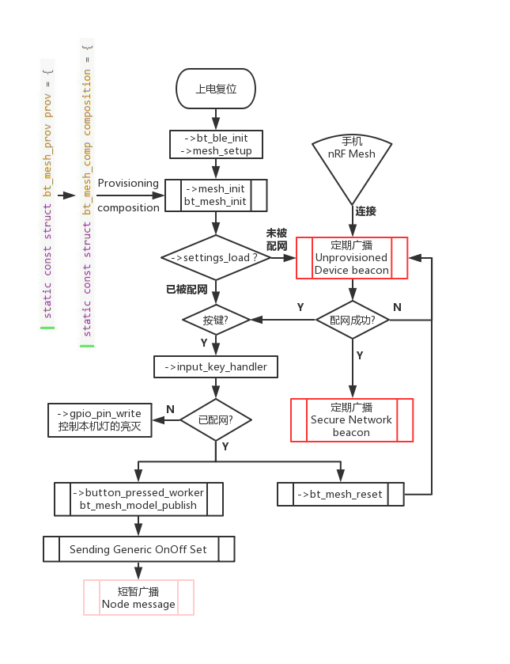
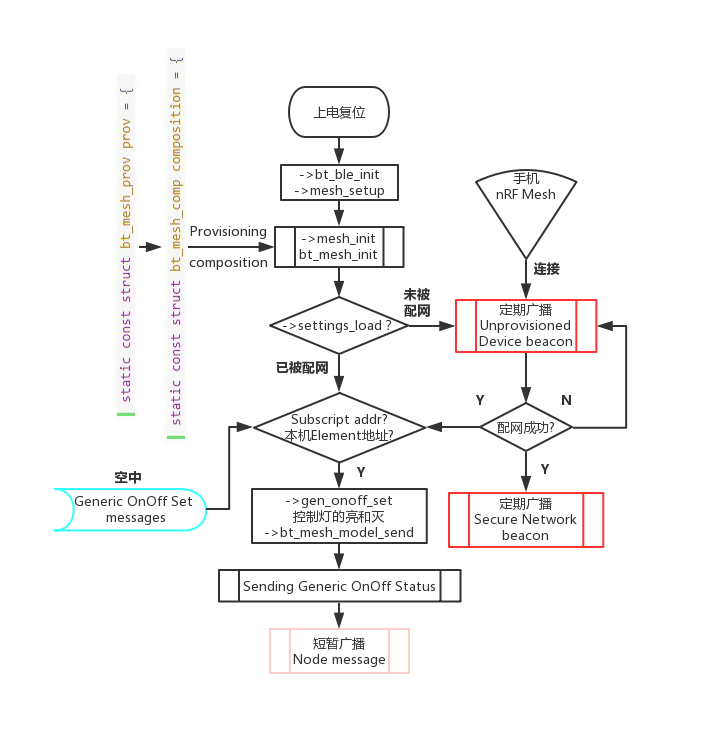

# 3. SIG Mesh DEMO使用说明

## 3.1. 概述

> 遵守[蓝牙SIG Mesh协议](https://www.bluetooth.com/specifications/mesh-specifications)，基于蓝牙5 ble实现网内节点间通讯，具体功能如下：

- 全节点类型支持(Relay/Proxy/Friend/Low Power)；

- 支持以PB-GATT方式入网(手机APP配网，支持”nRF Mesh”安卓和苹果最新版本)；

- 支持以PB-ADV方式入网（“天猫精灵”配网）；

- 支持设备上电自配网(不用网关就可实现设备在同一网内，支持加密key自定义)；

- 节点relay/beacon功能可修改；

- 节点地址可自定义；

- 节点信息断电保存；

- 节点发布(Publish)和订阅(Subscribe)地址可修改；

- 支持节点Reset为未配网设备；

- 支持蓝牙SIG既有Models和用户自定义Vendor Models。

  支持的板级： br25、bd19、br34、br23

  支持的芯片： AC636N、AC632N、AC638N、AC635N

## 3.2. 工程配置

代码工程：apps/mesh/board/bd19/AC632N_mesh.cbp

> ▾ mesh/
>
>   ▾ api/
>
> ​    feature_correct.h
>
> ​    mesh_config_common.c
>
> ​    model_api.c
>
> ​    model_api.h
>
>   ▾ board/
>
>    ▾ bd19/
>
> ​     board_ac632n_demo.c
>
> ​     board_ac632n_demo_cfg.h
>
> ​     board_config.h
>
>   ▾ examples/
>
> ​    generic_onoff_client.c
>
> ​    generic_onoff_server.c
>
> ​    vendor_client.c
>
> ​    vendor_server.c
>
> ​    AliGenie_socket.c

在api/model_api.h下，通过配置CONFIG_MESH_MODEL选择相应例子，SDK提供了5个应用实例。默认选择SIG_MESH_GENERIC_ONOFF_CLIENT，即位于examples/generic_onoff_client.c下的例子。

```
*//< Detail in "MshMDLv1.0.1"*
#define SIG_MESH_GENERIC_ONOFF_CLIENT       0 \ *// examples/generic_onoff_client.c*
#define SIG_MESH_GENERIC_ONOFF_SERVER       1 \ *// examples/generic_onoff_server.c*
#define SIG_MESH_VENDOR_CLIENT               2 \ *// examples/vendor_client.c*
#define SIG_MESH_VENDOR_SERVER               3 \ *// examples/vendor_server.c*
#define SIG_MESH_ALIGENIE_SOCKET          4 \ *// examples/AliGenie_socket.c*

*// more...*

*//< Config which example will use in <examples>*
#define CONFIG_MESH_MODEL                   SIG_MESH_GENERIC_ONOFF_CLIENT
```

### 3.2.1. Mesh配置

在api/mesh_config_common.c下，可以自由配置网络和节点特性，例如LPN/Friend节点特性、Proxy下配网前后广播interval、节点信息传递时广播interval和duration等。

如下举例了节点信息传递时广播interval和duration的配置，和PB-GATT下配网前后广播interval的配置。

```
*/*\
\* @brief Config adv bearer hardware param when node send messages
\*/
*/*-----------------------------------------------------------*/*
const u16 config_bt_mesh_node_msg_adv_interval = ADV_SCAN_UNIT(10); \ *// unit: ms*
const u16 config_bt_mesh_node_msg_adv_duration = 100; \ *// unit: ms*

*/*\
\* @brief Config proxy connectable adv hardware param
\*/
*/*-----------------------------------------------------------*/*
const u16 config_bt_mesh_proxy_unprovision_adv_interval = ADV_SCAN_UNIT(30); \ *// unit: ms*
const u16 config_bt_mesh_proxy_pre_node_adv_interval = ADV_SCAN_UNIT(10); \ *// unit: ms*
\_WEAK\_
const u16 config_bt_mesh_proxy_node_adv_interval = ADV_SCAN_UNIT(300); \ *// unit: ms*
注意：在常量前加上“_WEAK_”的声明，代表这个常量可以在其它文件重定义。如果想某一配置私有化到某一实例，应该在该文件下在该配置前加上“_WEAK_”声明，并在所在实例文件里重定义该常量配置。
```

### 3.2.2. board配置

在board/xxxx/board_config.h下，可以根据不同封装选择不同board，以AC63X为例，默认选择CONFIG_BOARD_AC632X_DEMO作为目标板。

```
*/\
\*  板级配置选择
\*/
#define CONFIG_BOARD_AC632N_DEMO


#include "board_ac632n_demo_cfg.h"
```

## 3.3. 应用实例

### 3.3.1. SIG Generic OnOff Client

1、简介

该实例通过手机“nRF Mesh”进行配网 -> 设备名称：OnOff_cli -> Node Features：Proxy + Relay -> Authentication方式：NO OOB -> Elements个数：1 -> Model：Configuration Server + Generic On Off Client

2、实际操作

1).基本配置

使用USB DP作为串口debug脚，波特率为1000000 使用PA3作为AD按键 设备名称为“OnOff_cli”，MAC地址为“11:22:33:44:55:66”

```
-> api/model_api.h
#define CONFIG_MESH_MODEL                   SIG_MESH_GENERIC_ONOFF_CLIENT

-> board/xxxx/board_xxxx_demo_cfg.h
#define TCFG_UART0_TX_PORT                   IO_PORT_DP
#define TCFG_UART0_BAUDRATE               1000000
#define TCFG_ADKEY_ENABLE                   ENABLE_THIS_MOUDLE \ *//是否使能AD按键*
#define TCFG_ADKEY_PORT                      IO_PORTA_03 \ *//注意选择的IO口是否支持AD功能*
#define TCFG_ADKEY_AD_CHANNEL        AD_CH_PA3

-> examples/generic_onoff_client.c
#define BLE_DEV_NAME             'O', 'n', 'O', 'f', 'f', '_', 'c', 'l', 'i'
#define CUR_DEVICE_MAC_ADDR      0x112233445566
```

对于MAC地址，如果想不同设备在第一次上电时使用随机值，可以按照以下操作，将NULL传入 bt_mac_addr_set函数

如果想用配置工具配置MAC地址，应不调用bt_mac_addr_set函数

```
-> examples/generic_onoff_client.c
void bt_ble_init(void)
{
u8 bt_addr[6] = {MAC_TO_LITTLE_ENDIAN(CUR_DEVICE_MAC_ADDR)};
bt_mac_addr_set(NULL);
     mesh_setup(mesh_init);
}
```

2).编译工程并下载到目标板，接好串口，接好AD按键，上电或者复位设备

3).使用手机APP“nRF Mesh”进行配网，详细操作请 [->点击这里<-](https://gitee.com/Jieli-Tech/fw-AC63_BT_SDK/blob/master/doc/mesh操作演示/Generic_On_Off_Client.gif)

配网完成后节点结构如下：

> ▾ Elements
>
> ▾ Element
>
> ​	Configuration Server  #SIG Model ID: 0x0000
>
> ​	Generic On Off Client #SIG Model ID: 0x1001

4).此时按下按键，就能将开关信息Publish到Group地址0xC000了，如果结合下一小节 SIG Generic OnOff Server，就能控制这个server设备led灯的亮和灭了

3、代码解读



### 3.3.2. SIG Generic OnOff Server

1、简介

​	该实例通过手机“nRF Mesh”进行配网 -> 设备名称：OnOff_srv -> Node Features：Proxy + Relay -> Authentication方式：NO OOB -> Elements个数：1 -> 	Model：Configuration Server + Generic On Off Server

2、实际操作

​	1).基本配置 使用USB DP作为串口debug脚，波特率为1000000 使用PA1控制LED灯 设备名称为“OnOff_srv”，MAC地址为“22:22:33:44:55:66”

```
-> api/model_api.h
#define CONFIG_MESH_MODEL                   SIG_MESH_GENERIC_ONOFF_SERVER

-> board/xxxx/board_xxxx_demo_cfg.h
#define TCFG_UART0_TX_PORT                   IO_PORT_DP
#define TCFG_UART0_BAUDRATE                1000000

-> examples/generic_onoff_server.c
#define BLE_DEV_NAME             'O', 'n', 'O', 'f', 'f', '_', 's', 'r', 'v'
#define CUR_DEVICE_MAC_ADDR      0x222233445566
const u8 led_use_port[] = {
    IO_PORTA_01,
};
```

对于MAC地址，如果想不同设备在第一次上电时使用随机值，可以按照以下操作，将NULL传入 bt_mac_addr_set函数

如果想用配置工具配置MAC地址，应不调用bt_mac_addr_set函数

```
-> examples/generic_onoff_server.c
void bt_ble_init(void)
{
u8 bt_addr[6] = {MAC_TO_LITTLE_ENDIAN(CUR_DEVICE_MAC_ADDR)};
bt_mac_addr_set(NULL);
     mesh_setup(mesh_init);
}
```

2).编译工程并下载到目标板，接好串口，接好演示用LED灯，上电或者复位设备

3).使用手机APP“nRF Mesh”进行配网，详细操作请 [->点击这里<-]([fw-AC63_BT_SDK/doc/mesh操作演示/Generic_On_Off_Server.gif · 云信/fw-AC63_BT_SDK - AtomGit | GitCode](https://gitcode.com/yunthinker/fw-AC63_BT_SDK/blob/main/doc/mesh操作演示/Generic_On_Off_Server.gif))

配网完成后节点结构如下：

> ▾ Elements
>
> ▾ Element
>
> ​	Configuration Server  #SIG Model ID: 0x0000
>
> ​	Generic On Off Server #SIG Model ID: 0x1000

4).结合上一小节 SIG Generic OnOff Server ，此时如果Client设备按下按键，那么本机的LED灯就会 亮或者灭了

3、代码解读



### 3.3.3. SIG AliGenie Socket

1、简介

该实例按照阿里巴巴“[*IoT开放平台*](https://www.aligenie.com/doc/357554/)”关于“[*天猫精灵蓝牙mesh软件基础规范*](https://www.aligenie.com/doc/357554/gtgprq)”，根据“*硬件品类规范*”描述自己为一个“[*插座*](https://www.aligenie.com/doc/357554/yh3tf3)”，通过“天猫精灵”语音输入进行发现连接(配网)和控制设备。

2、实际操作

1).基本配置

使用USB DP作为串口debug脚，波特率为1000000

使用PA1控制LED灯(模拟插座的开和关的操作)

设备名称为“AG-Socket”

三元组（MAC地址、ProductID、Secret）在天猫精灵开发者网站申请

```
-> api/model_api.h
#define CONFIG_MESH_MODEL                   SIG_MESH_ALIGENIE_SOCKET

-> board/xxxx/board_xxxx_demo_cfg.h
#define TCFG_UART0_TX_PORT                   IO_PORT_DP
#define TCFG_UART0_BAUDRATE                1000000

-> examples/AliGenie_socket.c
#define BLE_DEV_NAME             'A', 'G', '-', 'S', 'o', 'c', 'k', 'e', 't'
*//< 三元组(本例以个人名义申请的插座类三元组)*
#define CUR_DEVICE_MAC_ADDR          0x28fa7a42bf0d
#define PRODUCT_ID                   12623
#define DEVICE_SECRET                "753053e923f30c9f0bc4405cf13ebda6"
const u8 led_use_port[] = {
    IO_PORTA_01,
};
```

对于MAC地址，本例中一定要按照三元组里面的MAC地址传入到bt_mac_addr_set函数里

```
-> examples/AliGenie_socket.c
void bt_ble_init(void)
{
u8 bt_addr[6] = {MAC_TO_LITTLE_ENDIAN(CUR_DEVICE_MAC_ADDR)};
bt_mac_addr_set(bt_addr);
     mesh_setup(mesh_init);
}
```

2).编译工程并下载到目标板，接好串口，接好演示用LED灯，上电或者复位设备

3).天猫精灵连接到互联网上

①．上电“天猫精灵”，长按设备上的语音按键，让设备进入待连接状态

②．手机应用商店下载“天猫精灵”APP，APP上个人中心登陆

③．打开手机“WLAN”，将“天猫精灵”通过手机热点连接到互联网上

详细操作请 [->点击这里<-]([fw-AC63_BT_SDK/doc/mesh操作演示/AliGenie_connect.gif · 云信/fw-AC63_BT_SDK - AtomGit | GitCode](https://gitcode.com/yunthinker/fw-AC63_BT_SDK/blob/main/doc/mesh操作演示/AliGenie_connect.gif))

4).通过天猫精灵进行配网和控制

①．配网对话

用户：“天猫精灵，搜索设备”

天猫精灵：“发现一个智能插座，是否连接”

用户：“连接”

天猫精灵：“连接成功。。。 。。。”

②．语音控制插座命令(可通过 [IoT开放平台](https://iot.aligenie.com/account/login?spm=a2140w.13129968.0.0.375d643bZ07hUV&redirectURL=%2Fr%3Furl%3Dhttps%3A%2F%2Fiot.aligenie.com%2Fhome) 添加自定义语音命令)

命令：“天猫精灵，打开插座” 效果：开发板上LED灯打开

命令：“天猫精灵，关闭插座” 效果：开发板上LED灯关闭

3、代码解读

1).配网

关键在于如何设置在天猫精灵开发者网站申请下来的三元组

①．天猫精灵开发者网站申请三元组，并填到下面文件相应宏定义处

例如申请到的三元组如下：

| Product ID(十进制) | Device Secret:                   | Mac 地址     |
| ------------------ | -------------------------------- | ------------ |
| 12623              | 753053e923f30c9f0bc4405cf13ebda6 | 28fa7a42bf0d |

则按下面规则填写，MAC前要加上0x，Secret要用双引号包住

```
-> examples/AliGenie_socket.c
*//< 三元组(本例以个人名义申请的插座类三元组)*
#define CUR_DEVICE_MAC_ADDR          0x28fa7a42bf0d
#define PRODUCT_ID                   12623
#define DEVICE_SECRET                "753053e923f30c9f0bc4405cf13ebda6"
```

②．建立Element和Model

按照[*插座软件规范*](https://www.aligenie.com/doc/357554/yh3tf3)，要建立一个element，两个model

| Element | Model                        | 属性名称 |
| ------- | ---------------------------- | -------- |
| Primary | Generic On/Off Server 0x1000 | 开关     |
| Primary | Vendor Model 0x01A80000      | 故障上报 |

### 3.3.4. SIG Vendor Client

1、简介

该实例会自动进行配网

```
-> 设备名称：Vd_cli
-> Node Features:Proxy
-> Authentication方式：NO OOB
-> Elements个数：1
->Root model：Configuration Server + Configuration Client
->Vendor model: Vendor_Client_Model
```

1).实际操作

2).基本配置

使用USB DP作为串口debug脚，波特率为1000000 使用PA3作为AD按键端口，将PA3与ADKEY相连 设备名称为“Vd_cli” , “Node”地址为“0x0001”,“Group”地址为“0xc000” 设备名称为“OnOff_cli”，MAC地址为“11:22:33:44:55:66”

```
-> api/model_api.h
#define CONFIG_MESH_MODEL                    SIG_MESH_VENDOR_CLIENT

> board/xxxx/board_xxxx_demo_cfg.h
#define TCFG_UART0_TX_PORT                    IO_PORT_DP
#define TCFG_UART0_BAUDRATE                 1000000

-> examples/generic_onoff_server.c
#define BLE_DEV_NAME                        'V', 'd',  '_', 'c', 'l', 'i'
#define CUR_DEVICE_MAC_ADDR             0x222233445566
const u8 led_use_port[] = {
        IO_PORTA_01,
};
```

3).编译工程并下载到目标板上，接好串口，接好AD按键，上电或者复位设备

4).此时按下按键，就能把开关信息Publish到Group地址0xC000了，结合下一小节 SIG Vendor Client, 就可以控制server设备上的LED灯的亮灭了

3、代码解读

1).配网流程

​	1.配置节点信息与元素组成

```
      int bt_mesh_init(const struct bt_mesh_prov *prov,const struct bt_mesh_comp *comp);
              parameters:
                        prov  节点的配置信息
                        本实例中的prov： static const struct bt_mesh_prov prov = {
                        uuid = dev_uuid,
                        output_size = 0,
                        output_actions = 0,
                        output_number = 0,
                        complete = prov_complete,
                        .reset = prov_reset,
                        };
                        本实例中的comp： static const struct bt_mesh_comp composition = {
                        .cid = BT_COMP_ID_LF,
                        .elem = elements,
                        .elem_count = ARRAY_SIZE(elements),
                        };
              return\ 值:
                        int\ 型，返回0代表成功，其他代表出错

2.配置节点地址与网络通信密钥
```

```
      int bt_mesh_provision(const u8_t net_key[16], u16_t net_idx,
                                    u8_t flags, u32_t iv_index, u16_t addr,
                                    const u8_t dev_key[16]);
              parameters:
                        addr      节点地址
                        net_key   网络密钥，用于保护网络层的通信
                        net_idx   net_key网络密钥的索引
                        dev_key   设备密钥，用于保护节点和配置客户端之间的通信。
              return_value:

      int\ 型，返回0代表成功，其他代表出错

3.为节点添加app_key

添加的AppKey必须与NetKey成对使用，AppKey用于对接收和发送的消息进行身份验证和加密
```

```
      int bt_mesh_cfg_app_key_add(u16_t net_idx, u16_t addr, u16_t key_net_idx,
                                          u16_t key_app_idx, const u8_t app_key[16],
                                          u8_t *status);
              parameters:
                        addr           节点地址
                        app_key        应用密钥，用于保护上层传输层的通信
                        key_app_idx    app_key的索引
              return_value:
                        int\ 型

1. 小结

本实例中配置的net_key/dev_key/app_key必须与server的相同否则无法正常进行通信
```

2).model配置

​	1.将model绑定到该节点添加的app_key

​	将应用密钥与元素的模型绑定在一起

```
  int bt_mesh_cfg_mod_app_bind_vnd(u16_t net_idx, u16_t addr, u16_t elem_addr,u16_t mod_app_idx, u16_t mod_id, u16_t cid,u8_t *status);
              parameters:
              addr           节点地址
              elem_addr      配置为该模型的元素地址
              mod_id        模型的标识本例中的mod_id：BT_MESH_VENDOR_MODEL_ID_CLI
              key_app_idx    app_key的索引
              cid            公司标识符
              return_value:
              int\ 型

2.为model添加publish行为

配置模型的发布状态
```

```
int bt_mesh_cfg_mod_pub_set_vnd(u16_t net_idx, u16_t addr, u16_t elem_addr,u16_t mod_id, u16_t cid,struct bt_mesh_cfg_mod_pub *pub, u8_t *status);
        parameters:
                    addr        本节点的地址，即node_addr
                    elem_addr   配置为pub中的发送属性的元素地址
                    pub         pub结构体存放publish行为的相关属性
                                本实例中的pub结构体：
                                struct bt_mesh_cfg_mod_pub pub;
                    pub.addr = dst_addr;     //publish的目的地址
                    pub.app_idx = app_idx;   //app_key的索引
                    pub.cred_flag = 0;       //friendship的凭证标志
                    pub.ttl = 7;             //生命周期，决定能被relay的次数
                    pub.period = 0;          //定期状态发布的周期
                    pub.transmit = 0;        //每次 publish msg的重传次数（高3位） + 重传输之间50ms的步骤数（低5位）

            status       请求消息的状态
```

3).节点行为

1. client的Publish行为

当按键按下时进入 input_key_handle 函数，该函数会获取按键的键值和按键的状态，进行按键处理

```
void input_key_handler(u8 key_status, u8 key_number)
```

根据按键的不同状态 input_key_handle 函数会将相应的状态信息（点击为1，长按为0）通过结构体struct _switch *sw传入client_publish函数

```
static void client_publish(struct switch *sw)
```

client_publish 函数会对要发送的msg进行处理，接下来会详细介绍client_publish中主要函数的作用及msg的构成

首先 client_publish 函数根据key_number获取存在mod_cli_sw结构体里相应的 vendor_model，这个 vendor_model 的发送属性在上一节的 bt_mesh_cfg_mod_pub_set_vnd 函数里已经进行了配置之后使用bt_mesh_model_msg_init函数初始化一个结构体msg并存入3字节的操作码

```
void bt_mesh_model_msg_init(struct net_buf_simple *msg, u32_t opcode);
```

接下来会使用buffer_add_u8_at_tail函数添加一个状态值到msg尾部，用于server端控制LED状态

```
u8 *buffer_add_u8_at_tail(\ void *buf, u8 val);
```

然后使用buffer_memset函数将msg中剩下的空的部分用0x02填满，msg剩下的空的部分可以也可以由用户自定义内容

```
void *buffer_memset(struct net_buf_simple *buf, u8 val, u32 len);
```

之后就用bt_mesh_model_publish把包含msg的信息发送出去

```
int bt_mesh_model_publish(struct bt_mesh_model *model);
```

1. client的回调函数

结构体vendor_client_models里的BT_MESH_VENDOR_MODEL_ID_CLI注册了vendor_cli_op来进行数据处理

当收到对面的ack msg并匹配上BT_MESH_VENDOR_MODEL_OP_STATUS时就会调用 vendor_status回调函数对数据进行处理

```
static const struct bt_mesh_model_op vendor_cli_op[] = {
{
    BT_MESH_VENDOR_MODEL_OP_STATUS, ACCESS_OP_SIZE, vendor_status },
    BT_MESH_MODEL_OP_END,
};
```

vendor_status 函数的功能：显示作为ack msg的发送方server端的地址及其所受到client控制的情况

```
static void vendor_status(struct bt_mesh_model *model,
                      struct bt_mesh_msg_ctx *ctx,
                      struct net_buf_simple *buf)
```

### 3.3.5. SIG Vendor Server

1、简介

该实例会自动进行配网

```
->设备名称：Vd_srv
->Node Features:Proxy
->Authentication方式：NO OOB
->Elements个数：1
->Root model：Configuration Server + Configuration Client
->Vendor model: Vendor_Client_Model
```

2、实际操作

1).基本配置

使用USB DP作为串口debug脚，波特率为1000000 使用PA3作为AD按键端口，将PA1与LED相连 设备名称为“Vd_srv” , “Node”地址为“0x0002”,“Group”地址为“0xc000”

```
-> api/model_api.h
#define CONFIG_MESH_MODEL                    SIG_MESH_VENDOR_SERVER

> board/xxxx/board_xxxx_demo_cfg.h
#define TCFG_UART0_TX_PORT                    IO_PORT_DP
#define TCFG_UART0_BAUDRATE                 1000000

-> examples/generic_onoff_server.c
#define BLE_DEV_NAME                        'V', 'd',  '_', 's', r', 'v'
#define CUR_DEVICE_MAC_ADDR             0x222233445566
const u8 led_use_port[] = {

        IO_PORTA_01,
};
```

2).编译工程并下载到目标板上，接好串口，接好 LED 灯，上电或者复位设备 3).此时若 client 端按下按键，server 设备上的 LED 灯就会根据按键的点击还是长按而点亮或熄灭了

3、代码解读

1).配网流程

- 配置节点的信息与元素组成

```
int bt_mesh_init(const struct bt_mesh_prov *prov,
                 const struct bt_mesh_comp *comp);
parameters:
   prov  节点的配置信息
        本实例中的prov： static const struct bt_mesh_prov prov = {
                .uuid = dev_uuid,
                .output_size = 0,
                .output_actions = 0,
                .output_number = 0,
                .complete = prov_complete,
                .reset = prov_reset,
                };
comp  节点的元素组成
        本实例中的comp： static const struct bt_mesh_comp composition = {
                .cid = BT_COMP_ID_LF,
                .elem = elements,
                .elem_count = ARRAY_SIZE(elements),
                };
return\ 值:
                int\ 型，返回0代表成功，其他代表出错
```

- 配置节点地址与网络通信密钥

```
int bt_mesh_provision(const u8_t net_key[16], u16_t net_idx,
                      u8_t flags, u32_t iv_index, u16_t addr,
                      const u8_t dev_key[16]);
parameters:
          addr      节点地址
          net_key   网络密钥，用于保护网络层的通信
          net_idx   net_key的索引
          dev_key   设备密钥，用于保护节点和配置客户端之间的通信。
return_value:
                int\ 型，返回0代表成功，其他代表出错
```

- 为节点添加app_key

```
int bt_mesh_cfg_app_key_add(u16_t net_idx, u16_t addr, u16_t key_net_idx,
                            u16_t key_app_idx, const u8_t app_key[16],
                            u8_t *status);
parameters:
          addr           节点地址
          key_app_idx    app_key的索引
          app_key        应用密钥，用于保护上层传输层的通信
          status         请求消息的状态
return_value:
           int\ 型
```

- 小结

​	本实例中配置的net_key/dev_key/app_key必须与server的相同否则无法正常进行通信

2).model配置

1. 将model绑定到该节点添加的app_key

将应用密钥与元素的模式绑定在一起

```
      int bt_mesh_cfg_mod_app_bind_vnd(u16_t net_idx, u16_t addr, u16_t elem_addr,
                                     u16_t mod_app_idx, u16_t mod_id, u16_t cid,
                                     u8_t *status);
      parameters:
                  addr             节点地址
                  elem_addr        配置为该模型的元素地址
                  mod_id           模型的标识
                                   本例中的mod_id：BT_MESH_VENDOR_MODEL_ID_CLI
                  key_app_idx      app_key的索引
                  cid              公司标识符
                  status           请求消息的状态
      return_value:
                              int\ 型

2. 为model添加Subscription地址

配置模型的订阅地址，用于接收 client 端 publish 的msg
```

```
int bt_mesh_cfg_mod_sub_add_vnd(u16_t net_idx, u16_t addr, u16_t elem_addr,
                                u16_t sub_addr, u16_t mod_id, u16_t cid,
                                u8_t *status);
parameters:
            addr         本节点的地址
            elem_addr    元素地址，此处填入订阅控制信息对应元素的地址
            sub_addr     订阅的地址
            mod_id       模型的标识
            status       请求消息的状态

return_value:
                        int\ 型
```

3).节点行为

- server的回调函数

结构体 vendor_client_models 里的 BT_MESH_VENDOR_MODEL_ID_CLI 注册了 vendor_cli_op 来进行数据处理

当收到对面的ack并匹配上 BT_MESH_VENDOR_MODEL_OP_STATUS 时就会调用 vendor_set 回调函数对数据进行处理

```
static void vendor_set(struct bt_mesh_model *model,
                        struct bt_mesh_msg_ctx *ctx,
                        struct net_buf_simple *buf)
```

vendor_set 函数中使用 buffer_pull_u8_from_head 函数提取msg中存放的led状态信息

```
u8 buffer_pull_u8_from_head(\ void *buf);
```

之后使用 gpio_pin_write 函数进行点灯或者灭灯操作

```
void gpio_pin_write(u8_t led_index, u8_t onoff)
parameters:
       led_index     GPIO口的索引
       onoff         LED的亮灭状态
```

进行点灯操作后要组织信息作为ack反馈给 client 端，首先使用 bt_mesh_model_msg_init 函数

初始化一个 net_buf_simple 类型对象 ack_msg 并在其中添加3字节的操作码

```
      void bt_mesh_model_msg_init(struct net_buf_simple *msg, u32_t opcode)

之后使用 buffer_add_u8_at_tail 函数在 ack_msg 函数的尾部添加LED的状态
```

```
      u8 *buffer_add_u8_at_tail(\ void *buf, u8 val);

然后使用 buffer_memset 函数将 ack_msg 填满
```

```
      void *buffer_memset(struct net_buf_simple *buf, u8 val, u32 len);

最后就使用 bt_mesh_model_send 函数将反馈信息发送给 client 端
```

```
int bt_mesh_model_send(struct bt_mesh_model *model,
                       struct bt_mesh_msg_ctx *ctx,
                       struct net_buf_simple *msg,
                       const struct bt_mesh_send_cb *cb,
                       void *cb_data);
parameters:
           model      发送信息所属的模型
           ctx        消息的环境信息，包括通信的密钥，生命周期，远端地址等
           msg        反馈信息ack_msg
           cb         可选的消息发送的回调，此实例为空
           cb_data    要传递给回调的用户数据，此实例为空
```

### 3.3.6. SIG AliGenie Light

1、简介

该实例按照阿里巴巴“ [IoT开放平台](https://www.aligenie.com/doc/357554/) ”关于“[*天猫精灵蓝牙mesh软件基础规范*](https://www.aligenie.com/doc/357554/gtgprq)”，根据“*硬件品类规范*”描述自己为一个“*灯*”，通过“天猫精灵”语音输入进行发现连接(配网)和控制设备。

2、实际操作

1).基本配置 使用USB DP作为串口debug脚，波特率为1000000 使用PA1控制LED灯(模拟插座的开和关的操作) 设备名称为“AG-Socket” 三元组（MAC地址、ProductID、Secret）在天猫精灵开发者网站申请

```
-> api/model_api.h
#define CONFIG_MESH_MODEL                   SIG_MESH_ALIGENIE_SOCKET

-> board/xxxx/board_xxxx_demo_cfg.h
#define TCFG_UART0_TX_PORT                   IO_PORT_DP
#define TCFG_UART0_BAUDRATE                1000000

-> examples/AliGenie_socket.c
#define BLE_DEV_NAME             'A', 'G', '-', 'L', 'i', 'g', 'h', 't'
*//< 三元组(本例以个人名义申请的插座类三元组)*
#define CUR_DEVICE_MAC_ADDR          0x18146c110001
#define PRODUCT_ID                   7218909
#define DEVICE_SECRET                "aab00b61998063e62f98ff04c9a787d4"
const u8 led_use_port[] = {
    IO_PORTA_01,
};
```

对于MAC地址，本例中一定要按照三元组里面的MAC地址传入到bt_mac_addr_set函数里

```
-> examples/AliGenie_socket.c
void bt_ble_init(void)
{
u8 bt_addr[6] = {MAC_TO_LITTLE_ENDIAN(CUR_DEVICE_MAC_ADDR)};
bt_mac_addr_set(bt_addr);
     mesh_setup(mesh_init);
}
```

2).编译工程并下载到目标板，接好串口，接好演示用LED灯，上电或者复位设备

3).天猫精灵连接到互联网上

①．上电“天猫精灵”，长按设备上的语音按键，让设备进入待连接状态

②．手机应用商店下载“天猫精灵”APP，APP上个人中心登陆

③．打开手机“WLAN”，将“天猫精灵”通过手机热点连接到互联网上

详细操作请 [->点击这里<-]([fw-AC63_BT_SDK/doc/mesh操作演示/AliGenie_connect.gif · 云信/fw-AC63_BT_SDK - AtomGit | GitCode](https://gitcode.com/yunthinker/fw-AC63_BT_SDK/blob/main/doc/mesh操作演示/AliGenie_connect.gif))

4).通过天猫精灵进行配网和控制

①．配网对话 用户：“天猫精灵，搜索设备” 天猫精灵：“发现一个智能插座，是否连接” 用户：“连接” 天猫精灵：“连接成功。。。 。。。” ②．语音控制插座命令(可通过“ [IoT开放平台](https://iot.aligenie.com/account/login?spm=a2140w.13129968.0.0.375d643bZ07hUV&redirectURL=%2Fr%3Furl%3Dhttps%3A%2F%2Fiot.aligenie.com%2Fhome) ”添加自定义语音命令) 命令：“天猫精灵，开灯” 效果：开发板上LED灯打开 命令：“天猫精灵，灯的亮度调到50” 效果：开发板上LED灯亮度为50% 命令：“天猫精灵，关灯” 效果：开发板上LED灯关闭

3、代码解读

1).配网 关键在于如何设置在天猫精灵开发者网站申请下来的三元组

①．天猫精灵开发者网站申请三元组，并填到下面文件相应宏定义处 例如申请到的三元组如下：

| Product ID(十进制) | Device Secret:                   | Mac 地址     |
| ------------------ | -------------------------------- | ------------ |
| 7218909            | aab00b61998063e62f98ff04c9a787d4 | 18146c110001 |

则按下面规则填写，MAC前要加上0x，Secret要用双引号包住

```
  -> examples/AliGenie_socket.c
  *//< 三元组(本例以个人名义申请的插座类三元组)*
  #define CUR_DEVICE_MAC_ADDR          0x18146c110001
  #define PRODUCT_ID                   7218909
  #define DEVICE_SECRET                "aab00b61998063e62f98ff04c9a787d4"

②．建立Element和Model

按照\ `*灯具件规范* <https://www.aligenie.com/doc/357554/yh3tf3>`__\ ，要建立一个element，三个model
```

### 3.3.7. SIG AliGenie Fan

1、简介

该实例按照阿里巴巴“ [IoT开放平台](https://www.aligenie.com/doc/357554/) ”关于“[*天猫精灵蓝牙mesh软件基础规范*](https://www.aligenie.com/doc/357554/gtgprq)”，根据“*硬件品类规范*”描述自己为一个“*风扇*”，通过“天猫精灵”语音输入进行发现连接(配网)和控制设备。

2、实际操作

1).基本配置

使用USB DP作为串口debug脚，波特率为1000000 使用PA1控制LED灯(模拟插座的开和关的操作) 设备名称为“AG-Socket” 三元组（MAC地址、ProductID、Secret）在天猫精灵开发者网站申请

```
-> api/model_api.h
#define CONFIG_MESH_MODEL                   SIG_MESH_ALIGENIE_SOCKET

-> board/xxxx/board_xxxx_demo_cfg.h
#define TCFG_UART0_TX_PORT                   IO_PORT_DP
#define TCFG_UART0_BAUDRATE                1000000

-> examples/AliGenie_socket.c
#define BLE_DEV_NAME             'A', 'G', '-', 'F', 'a', 'n
*//< 三元组(本例以个人名义申请的插座类三元组)*
#define CUR_DEVICE_MAC_ADDR          0x27fa7af002a0
#define PRODUCT_ID                   7809508
#define DEVICE_SECRET                "d2729d5f3898079fa7b697c76a7bfe8e"
const u8 led_use_port[] = {
    IO_PORTA_01,
};
```

对于MAC地址，本例中一定要按照三元组里面的MAC地址传入到bt_mac_addr_set函数里

```
-> examples/AliGenie_socket.c
void bt_ble_init(void)
{
u8 bt_addr[6] = {MAC_TO_LITTLE_ENDIAN(CUR_DEVICE_MAC_ADDR)};
bt_mac_addr_set(bt_addr);
     mesh_setup(mesh_init);
}
```

2).编译工程并下载到目标板，接好串口，接好演示用LED灯（用于指示风扇开关状态和风速），上电或者复位设备

3).天猫精灵连接到互联网上

①．上电“天猫精灵”，长按设备上的语音按键，让设备进入待连接状态

②．手机应用商店下载“天猫精灵”APP，APP上个人中心登陆

③．打开手机“WLAN”，将“天猫精灵”通过手机热点连接到互联网上

详细操作请 [->点击这里<-]([fw-AC63_BT_SDK/doc/mesh操作演示/AliGenie_connect.gif · 云信/fw-AC63_BT_SDK - AtomGit | GitCode](https://gitcode.com/yunthinker/fw-AC63_BT_SDK/blob/main/doc/mesh操作演示/AliGenie_connect.gif))

4).通过天猫精灵进行配网和控制

①．配网对话 用户：“天猫精灵，搜索设备” 天猫精灵：“发现一个风扇，是否连接” 用户：“连接” 天猫精灵：“连接成功。。。 。。。” ②．语音控制插座命令(可通过“ [IoT开放平台](https://iot.aligenie.com/account/login?spm=a2140w.13129968.0.0.375d643bZ07hUV&redirectURL=%2Fr%3Furl%3Dhttps%3A%2F%2Fiot.aligenie.com%2Fhome) ”添加自定义语音命令) 命令：“天猫精灵，打开风扇” 效果：开发板上LED灯打开 命令：“天猫精灵，风扇调到2挡” 效果：开发板上LED灯亮度改变 命令：“天猫精灵，关闭风扇” 效果：开发板上LED灯关闭

3、代码解读

1).配网

关键在于如何设置在天猫精灵开发者网站申请下来的三元组

①．天猫精灵开发者网站申请三元组，并填到下面文件相应宏定义处

例如申请到的三元组如下：

| Product ID(十进制) | Device Secret:                   | Mac 地址     |
| ------------------ | -------------------------------- | ------------ |
| 7809508            | d2729d5f3898079fa7b697c76a7bfe8e | 27fa7af002a0 |

则按下面规则填写，MAC前要加上0x，Secret要用双引号包住

```
  -> examples/AliGenie_socket.c
  *//< 三元组(本例以个人名义申请的插座类三元组)*
  #define CUR_DEVICE_MAC_ADDR          0x27fa7af002a0
  #define PRODUCT_ID                   7809508
  #define DEVICE_SECRET                "d2729d5f3898079fa7b697c76a7bfe8e"

②．建立Element和Model

按照\ `*插座软件规范* <https://www.aligenie.com/doc/357554/yh3tf3>`__\ ，要建立一个element，两个model
```


