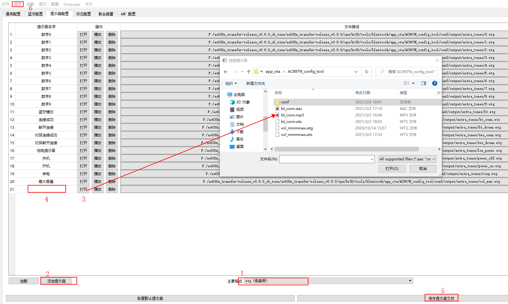

# 6. AUDIO 功能

## 6.1. 概述

- HID和SPP_AND_LE 新添加了AUDIO的实现示例代码，需要使用AUDIO功能要在板级配置使能 TCFG_AUDIO_ENABLE ，如下代码所示：

```
 //支持Audio功能，才能使能DAC/ADC模块
 #ifdef CONFIG_LITE_AUDIO
 #define TCFG_AUDIO_ENABLE                   ENABLE
 #if TCFG_AUDIO_ENABLE
 #undef TCFG_AUDIO_ADC_ENABLE
 #undef TCFG_AUDIO_DAC_ENABLE
 #define TCFG_AUDIO_ADC_ENABLE               ENABLE_THIS_MOUDLE
 #define TCFG_AUDIO_DAC_ENABLE               ENABLE_THIS_MOUDLE

- 支持板级：br23、br25、br30、br34
- 支持芯片：AC635N、AC636N、AC673N、AC638N
```

## 6.2. Audio的使用

- DAC硬件输出参数配置

	在板级配置文件里面有如下配置:

```
/*
DAC硬件上的连接方式,可选的配置：
    DAC_OUTPUT_MONO_L               左声道
    DAC_OUTPUT_MONO_R               右声道
    DAC_OUTPUT_LR                   立体声
    DAC_OUTPUT_MONO_LR_DIFF         单声道差分输出
*/
#define TCFG_AUDIO_DAC_CONNECT_MODE         DAC_OUTPUT_MONO_LR_DIFF
```

​		需要根据具体的硬件接法，配置 TCFG_AUDIO_DAC_CONNECT_MODE 宏。

- MIC配置和使用

​		配置说明:在每个 board.c 文件里都有配置 mic 参数的结构体，如下所示：

```
 /*
 struct adc_platform_data adc_data = {
     .mic_channel    = TCFG_AUDIO_ADC_MIC_CHA,                   //MIC通道选择，对于693x，MIC只有一个通道，固定选择右声道
 /*MIC LDO电流档位设置：
     0:0.625ua    1:1.25ua    2:1.875ua    3:2.5ua*/
    .mic_ldo_isel   = TCFG_AUDIO_ADC_LDO_SEL,
/*MIC 是否省隔直电容：
    0: 不省电容  1: 省电容 */
#if ((TCFG_AUDIO_DAC_CONNECT_MODE == DAC_OUTPUT_FRONT_LR_REAR_LR) || (TCFG_AUDIO_DAC_CONNECT_MODE == DAC_OUTPUT_DUAL_LR_DIFF))
    .mic_capless    = 0,//四声道与双声道差分使用，不省电容接法
#else
    .mic_capless    = 0,
#endif
/*MIC免电容方案需要设置，影响MIC的偏置电压
    21:1.18K    20:1.42K    19:1.55K    18:1.99K    17:2.2K     16:2.4K     15:2.6K     14:2.91K    13:3.05K    12:3.5K     11:3.73K
    10:3.91K    9:4.41K     8:5.0K      7:5.6K      6:6K        5:6.5K      4:7K        3:7.6K      2:8.0K      1:8.5K              */
    .mic_bias_res   = 16,
/*MIC LDO电压档位设置,也会影响MIC的偏置电压
    0:2.3v  1:2.5v  2:2.7v  3:3.0v */
    .mic_ldo_vsel  = 2,
/*MIC电容隔直模式使用内部mic偏置*/
    .mic_bias_inside = 1,
/*保持内部mic偏置输出*/
    .mic_bias_keep = 0,
    // ladc 通道
    .ladc_num = ARRAY_SIZE(ladc_list),
    .ladc = ladc_list,
};
```

​		主要关注以下变量：

​				mic_capless：0：选用不省电容模式 1：选用省电容模式；

​				mic_bias_res：选用省电容模式的时候才有效，mic 的上拉偏置电阻，选择范围为：1:16K 2:7.5K 3:5.1K 4:6.8K 5:4.7K 6:3.5K 7:2.9K 8:3K 9:2.5K 10:2.1K 11:1.9K 12:2K 13:1.8K 14:1.6K 15:1.5K 16:1K 31:0.6K；

​				mic_ldo_vsel：mic_ldo 的偏置电压，与偏置电阻共同决定 mic 的偏置，选择范围为：0:2.3v 1:2.5v 2:2.7v 3:3.0v；

​				mic_bias_inside：mic 外部电容隔直，芯片内部提供偏置电压，当 mic_bias_inside=1，可以正常使用 mic_bias_res 和 mic_ldo_vsel。

- 自动校准 MIC 偏置电压

​		使用省电容模式时，可在 app_config.h 配置 TCFG_MC_BIAS_AUTO_ADJUST，选择 MIC 的自动校准模式，自动选择对应的MIC 偏置电阻和偏置电压。配置如下：(注意：不省电容无法校准)。

```
 /*
*省电容mic偏置电压自动调整(因为校准需要时间，所以有不同的方式)
*1、烧完程序（完全更新，包括配置区）开机校准一次
*2、上电复位的时候都校准,即断电重新上电就会校准是否有偏差(默认)
*3、每次开机都校准，不管有没有断过电，即校准流程每次都跑
*/
#define MC_BIAS_ADJUST_DISABLE      0   //省电容mic偏置校准关闭
#define MC_BIAS_ADJUST_ONE          1   //省电容mic偏置只校准一次（跟dac trim一样）
#define MC_BIAS_ADJUST_POWER_ON     2   //省电容mic偏置每次上电复位都校准(Power_On_Reset)
#define MC_BIAS_ADJUST_ALWAYS       3   //省电容mic偏置每次开机都校准(包括上电复位和其他复位)
#define TCFG_MC_BIAS_AUTO_ADJUST    MC_BIAS_ADJUST_POWER_ON
#define TCFG_MC_CONVERGE_TRACE      0   //省电容mic收敛值跟踪
```

- Mic 的使用示例：可调用 audio_adc_open_demo(void)函数输出 mic 的声音，示例如下：

```
if (key_type == KEY_EVENT_LONG && key_value == TCFG_ADKEY_VALUE0) {
printf(">>>key0:open mic\n");
//br23/25 mic test
extern int audio_adc_open_demo(void);
audio_adc_open_demo();
//br30 mic test
/* extern void audio_adc_mic_demo(u8 mic_idx, u8 gain, u8 mic_2_dac); */
/* audio_adc_mic_demo(1, 1, 1); */
}
```

## 6.3. 提示音使用

- 提示音文件配置

​		打开SDK对应的cpu/brxx/tools/ACxxxN_config_tool，进入配置工具入口—>选择编译前配置工具—>提示音配置。



- 打开以上界面按步骤添加自己需要的*.mp3格式的源文件，转换成需要的主要格式。要注意文件的路径，SDK中默认的路径可能和本地保存的路径不同，要改成SDK当前的绝对路径。
- 在ota的目录download.bat下载项中添加tone.cfg配置选项
- 播放sin/wtg提示音，要在板级配置文件里面使能TCFG_DEC_G729_ENABLE 和 TCFG_DEC_PCM_ENABLE两个宏，如下所示：

```
#if TCFG_AUDIO_ENABLE
#undef TCFG_AUDIO_ADC_ENABLE
#undef TCFG_AUDIO_DAC_ENABLE
#define TCFG_AUDIO_ADC_ENABLE               ENABLE_THIS_MOUDLE
#define TCFG_AUDIO_DAC_ENABLE               ENABLE_THIS_MOUDLE
#define TCFG_DEC_G729_ENABLE                ENABLE
#define TCFG_DEC_PCM_ENABLE                 ENABLE
#define TCFG_ENC_OPUS_ENABLE                DISABLE
#define TCFG_ENC_SPEEX_ENABLE               DISABLE
#define TCFG_LINEIN_LR_CH                   AUDIO_LIN0_LR
#else
#define TCFG_DEC_PCM_ENABLE                 DISABLE
#endif/*TCFG_AUDIO_ENABLE*/
```

- 并在tone_player.h文件中定义文件名和路径：文件名和配置工具中第4步添加的提示音的名字要一致。

```
#define TONE_NUM_0                   TONE_RES_ROOT_PATH"tone/0.*"
```

- 提示音使用示例

​		可以调用tone_play()播放提示音，使用示例如下

```
if (key_type == KEY_EVENT_LONG && key_value == TCFG_ADKEY_VALUE2) {
    printf(">>>key1:tone_play_test\n");
    //br23/25 tone play test
    /* tone_play_by_path(TONE_NORMAL, 1); */
    /* tone_play_by_path(TONE_BT_CONN, 1); */
    //br30 tone play test
    tone_play(TONE_NUM_0, 1);
    /* tone_play(TONE_SIN_NORMAL, 1); */

}
```

## 6.4. opusspeex编码的使用

- 配置说明:opusspeex编码模块是对mic的数据进行编码，使用给功能，需要在板级配置文件里面使能TCFG_ENC_OPUS_ENABLE和TCFG_ENC_SPEEX_ENABLE这两个宏，配置如下图所示：

```
#if TCFG_AUDIO_ENABLE
#undef TCFG_AUDIO_ADC_ENABLE
#undef TCFG_AUDIO_DAC_ENABLE
#define TCFG_AUDIO_ADC_ENABLE ENABLE_THIS_MOUDLE
#define TCFG_AUDIO_DAC_ENABLE ENABLE_THIS_MOUDLE
#define TCFG_DEC_G729_ENABLE ENABLE
#define TCFG_DEC_PCM_ENABLE ENABLE
#define TCFG_ENC_OPUS_ENABLE ENABLE
#define TCFG_ENC_SPEEX_ENABLE ENABLE
#define TCFG_LINEIN_LR_CH AUDIO_LIN0_LR
#else
#define TCFG_DEC_PCM_ENABLE DISABLE
#endif/*TCFG_AUDIO_ENABLE*/
```

- opusspeex编码示例

```
int audio_mic_enc_open(**int** (*mic_output)(**void** *priv, **void** *buf, **int** len), u32 code_type);
```

- 对mic的数据进行opusspeex编码使用audio_mic_enc_open()函数，参数mic_output为编码后数据输出的函数，code_type为要进行编码的类型，可选AUDIO_CODING_OPUS和AUDIO_CODING_SPEEX，使用示例如下图：

```
/*encode test*/
extern int audio_mic_enc_open(int (*mic_output)(void *priv, void *buf, int len), u32
e_type);
audio_mic_enc_open(mic_enc_output_data, AUDIO_CODING_OPUS);//opus encode test
/* audio_mic_enc_open(mic_enc_output_data, AUDIO_CODING_SPEEX);//speex encode test *
```

## 6.5. 通用编码接口的使用

- 配置说明：通用编码接口在audio_codec_demo.c 文件里面，使用该接口需要在板级配置文件里面使能ENC_DEMO_EN这个宏，配置如下图所示：

```
#define ENC_DEMO_EN ENABLE;
```

- 要创建一个编码只需要调用如下的audio_demo_enc_open函数

```
int audio_demo_enc_open(\ **int** (*demo_output)(**void** \*priv, **void** \*buf, int len), u32 code_type, u8 ai_type)
```

- 第一个参数为外部注册的编码输出回调，注册此回调，在此回调中即可得到编码的后数据，第二个参数为编码类型，根据传入参数选择对应编码,可选的编码有OPUS 编码， SPEEX 编码， ADPCM编码，LC3编码，SBC编码和MSBC编码,创建对应编码器需分别在板级文件中使能TCFG_ENC_OPUS_ENABLE,TCFG_ENC_SPEEX_ENABLE,TCFG_ENC_ADPCM_ENABLE TCFG_ENC_SBC_ENABLE,TCFG_ENC_SBC_ENABLE，MSBC编码默认打开，没有宏控制

```
#define TCFG_ENC_OPUS_ENABLE ENABLE
#define TCFG_ENC_SPEEX_ENABLE ENABLE
#define TCFG_ENC_LC3_ENABLE ENABLE
#define TCFG_ENC_ADPCM_ENABLE ENABLE
#define TCFG_ENC_SBC_ENABLE ENABLE
```

- 第三个参数是speex 编码的参数，根据需要传0或者传1即可，不同的编码参数 修改均在audio_demo_enc_open函数内部修改 fmt 结构体的值即可，以adpcm 参数为例，如下

```
case AUDIO_CODING_WAV:
fmt.sample_rate = 16000;
fmt.bit_rate = 1024; //blockSize,可配成 256/512/1024/2048
fmt.channel = 2;
fmt.coding_type = AUDIO_CODING_WAV;
break;
```

- 根据实际编码参数修改fmt 结构体 成员的值即可，audio_demo_enc_open函数里默认打开了个定时器，定时器向解码器中写入需要编码的源数据，定时器执行如下函数：

```
static **void** demo_frame_test_time_fundc(\ **void** \*parm)
```

- 在此函数中写入源数据即可，代码默认写入正弦波数据去编码

- 关闭编码只需要调用如下的audio_demo_enc_close函数

```
**int** audio_demo_enc_close()
```

## 6.6. Audio_MIDI的使用

- 文件下载配置:在SDK/cpu/br23/tools下添加对应midi.bin文件,在同级目录的download.bat下添加下载项：

```
isd_download.exe -tonorflash -dev br23 -boot 0x12000 -div8 -wait 300 -uboot uboot.boot -app app.bin cfg_tool.bin -res midi.bin %1
```

- 在download.bat同级目录的isd_config.ini文件添加：

```
INTERNAL_DIR_ALIGN=0X2; //flash内目录里的文件起始地址4对齐
```

- 在对应的SDK/apps/spp_and_le/board/br23/board_ac635n_demo_cfg.h文件中，使能AUDIO 功能：

```
#define TCFG_AUDIO_ENABLE 1//DISABLE
#define AUDIO_MIDI_CTRL_CONFIG 1 //midi电子琴接口使能 ,开这个宏要关掉低功耗使能
```

- 关闭低功耗模式：

```
#define TCFG_LOWPOWER_LOWPOWER_SEL 0//SLEEP_EN //SNIFF状态下芯片是否进入powerdown#if TCFG_USER_BLE_ENABLE
```

- 在SDK/cpu/br23/audio_dec/audio_dec_midi_ctrl.c中做如下设置：具体函数内容以SDK为准。

```
void midi_paly_test(u32 key)
{
    static u8 open_close = 0;
    static u8 change_prog = 0;
    static u8 note_on_off = 0;
    switch (key) {
    case KEY_IR_NUM_0:
        if (!open_close) {
            /* midi_ctrl_dec_open(16000);//启动midi key */
            //midi_ctrl_dec_open(16000, "storage/sd0/C/MIDI.bin\0");//启动midi key  SD卡
            midi_ctrl_dec_open(16000,SDFILE_RES_ROOT_PATH"MIDI.bin\0");//启动midi key 系统

        } else {
            midi_ctrl_dec_close();//关闭midi key
        }
        open_close = !open_close;
        break;
    case KEY_IR_NUM_1:
        if (!change_prog) {
            midi_ctrl_set_porg(0, 0);//设置0号乐器，音轨0
        } else {
            midi_ctrl_set_porg(22, 0);//设置22号乐器，音轨0
        }
        change_prog = !change_prog;
        break;
    case KEY_IR_NUM_2:
        if (!note_on_off) {
            //模拟按键57、58、59、60、61、62,以力度127，通道0，按下测试
            ...
        } else
            //模拟按键57、58、59、60、61、62松开测试
          ...
        }
        note_on_off = !note_on_off;
        break;
    default:
        break;
    }
}
```

- 在app_spp_and_le.c种调用midi_play_test()函数播放对应文件：

```
static void app_key_event_handler(struct sys_event *event)
{
     ......
#if TCFG_AUDIO_ENABLE
if (event_type == KEY_EVENT_CLICK && key_value == TCFG_ADKEY_VALUE0) {
        /*midi test*/
     printf(">>>key0:open midi\n");
      midi_paly_test(KEY_IR_NUM_0);
        }
 if (event_type == KEY_EVENT_CLICK && key_value == TCFG_ADKEY_VALUE1) {

             printf(">>>key0:set  midi\n");
             midi_paly_test(KEY_IR_NUM_1);

        }
        if (event_type == KEY_EVENT_CLICK && key_value == TCFG_ADKEY_VALUE2)
             printf(">>>key2:play  midi\n");
             midi_paly_test(KEY_IR_NUM_2);
        }
```


