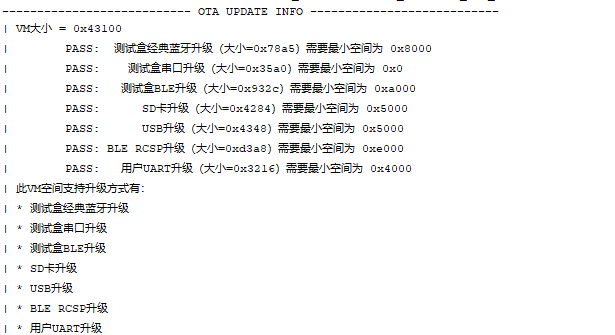
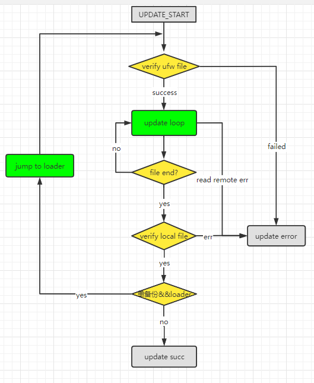
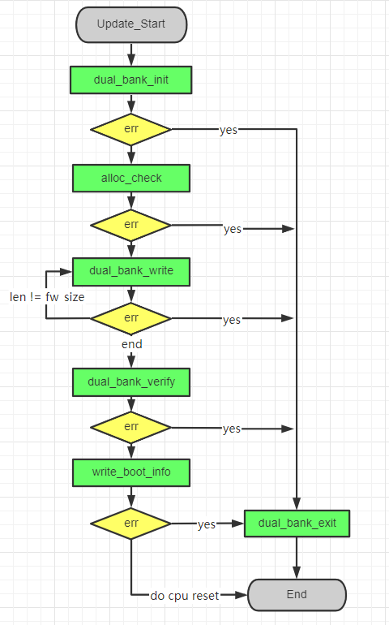
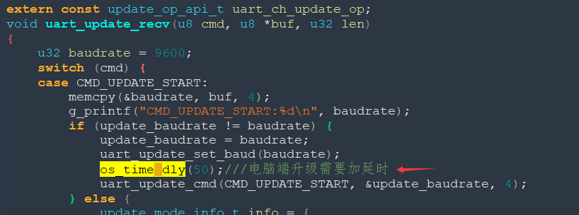
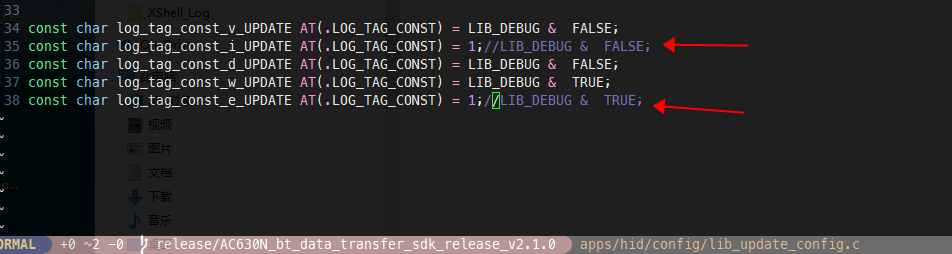

# 7. OTA升级概述

# 7.1. OTA升级相关说明

- 杰理升级分为测试盒升级、设备升级、APP升级三类。测试盒升级一般用于产线（需要向JL购买测试盒），设备升级、APP升级主要用于用户端。每种升级均支持单双备份，需要主要用户自定义升级仅支持双备份。

## 7.1.1. JL升级结构介绍

- 主动升级：使用ufw文件进行升级，分为单备份和双备份两种。
- 单备份：需要使用到ota.bin(包含各种升级方式的loader，如串口，测试盒EDR、BLE、RCSP等)，升级首先需要先将loader（ota.bin里对应当前升级方式的loader）加载到**VM区域**（需要需要保留VM数据需要在lib_update_config.c进行配置）。加载完成之后，会在flash里写入update_record，接下来跳转到**loader**进行升级流程。

VM的大小决定了单备份是否能将**loader**写入，如果VM空间不足以写入loader，则升级会提示**loader大小错误**,具体需要的大小可以通过编译最后的提示信息来得知：



升级过程被中断，如遭遇断电，测试盒通信失败等，若当前升级流程处于**loader加载**的过程，则固件不会丢失。若已经**加载完loader**,那固件会在loader里等待继续升级（此时原有的固件已经被擦除），测试蓝牙升级可以重新搜索**xxx_update**或者**xxx_LE_UPDATE**进行升级。测试盒串口可以继续点击开始升级来升级。

- 双备份:双备份主动升级区别于单备份升级，不需要ota.bin,也就是没有加载loader的流程，即使升级中途失败，原有的代码也不会丢失。

​		流程图



- 测试盒升级:测试盒相关升级请查看随测试盒自带的文档

- 测试盒EDR升级

- 测试盒BLE升级

- 测试盒串口升级

## 7.1.2. APP升级

杰理自带协议RCSP升级:

- 固件端

​	单备份配置

- 对于数传SDK V2xx版本，只需要打开***CONFIG_APP_OTA_ENABLE**即可升级，不需要修改`isd_config.ini`。
- 对于其他SDK，耳机需要打开宏**RCSP_MATE_EN**或者**RCSP_ADV_EN**,并将**RCSP_UPDATE_EN**置1;音箱需要打开宏**SMART_BOX_EN**并将**RCSP_UPDATE_EN**置1,还需要修改`isd_config.ini`(这里需不需要修改取发布SDK tools目录结构是否有`isd_config_rule.c`).如果tools目录没有`isd_config_rule.c`则需要在工程对于的`isd_config.ini`中添加已经配置如下参数：

```
 EXIF_ADR = AUTO;
  EXIF_LEN = 0x1000;
  EXIF_OPT = 1;

- 双备份配置

 - 对于数传SDK V2xx版本，只需要打开\*\ **CONFIG_APP_OTA_ENABLE**\ 和\ **CONFIG_DOUBLE_BANK_ENABLE**\ 即可升级，不需要修改\ ``isd_config.ini``\ 。
 - 对于其他SDK，耳机需要打开宏\ **RCSP_MATE_EN**\ 或者\ **RCSP_ADV_EN**,并将\ **RCSP_UPDATE_EN**\ 置1;音箱需要打开宏\ **SMART_BOX_EN**\ 并将\ **RCSP_UPDATE_EN**\ 置1,还需要修改\ ``isd_config.ini``\ (这里需不需要修改取发布SDKtools目录结构是否有\ ``isd_config_rule.c``).如果tools目录没有\ ``isd_config_rule.c``\ 则需要在工程对于的\ ``isd_config.ini``\ 中添加已经配置如下参数：
```

```
[EXTRA_CFG_PARAM]
BR22_TWS_DB = YES;                  //dual bank flash framework enable
FLASH_SIZE = CONFIG_FLASH_SIZE;     //flash_size cfg
BR22_TWS_VERSION = 0;               //default fw version
DB_UPDATE_DATA = YES;               //generate db_update_data.bin
#NEW_FLASH_FS = YES;                //enable single bank flash framework
```

> **Note**
>
> 双备份和单备份之间不能互相升级，配置双备份升级成功后使用强制升级工具去升级，会提示正常擦除CODE2…，说明当前flash结构已经为**双备份** , **db_update_data.bin**只存在一份代码（4K对齐或256Byte对齐），故用双备份被动升级时需要配置强制4K对齐，否则可能会导致**vm信息**丢失

```
FORCE_4K_ALIGN = YES; // force aligin with 4k bytes
```

- APP端

用户接入第三方协议

- 对于用户自定义的协议或者第三方协议接入，可使用`dual_bank_updata_api.h`,此种升级方式，使用的升级文件为**db_update_data.bin**，（需要在ini里配置flash结构为双备份，且生成db_update.bin的配置）。使用该升级方式，用户只需要提供升级的文件信息已经实现升级的数据通路（完成协议），调用提供的接口即可。ini配置：

```
[EXTRA_CFG_PARAM]
BR22_TWS_DB = YES;                  //dual bank flash framework enable
FLASH_SIZE = CONFIG_FLASH_SIZE;     //flash_size cfg
BR22_TWS_VERSION = 0;               //default fw version
DB_UPDATE_DATA = YES;               //generate db_update_data.bin
FORCE_4K_ALIGN = YES; // force aligin with 4k bytes
#NEW_FLASH_FS = YES;                //enable single bank flash framework
```

> **Note**
>
> 这里ini需要配置**强制4K对齐**，否则如果同一批生产的芯片有256Byte和4K对齐的芯片，会导致升级过后**VM信息丢失**
>
>- 接口解析：
>
> - u32 dual_bank_passive_update_init(u32 fw_crc, u32 fw_size, u16
>
> max_pkt_len, void *priv);
>
> - Note:初始化升级模块，创建升级任务
> - param1: **db_data_update.bin**的crc
> - param2: **db_data_update.bin**的大小
> - param3: 每次调用模块写入接口写入数据的最大长度
> - param4: reverse
> - return: 0:succ -2:no_memroy -3:获取不到当前flash的文件接口（检查当前ini是否正确配置）
>
> - u32 dual_bank_update_allow_check(u32 fw_size);
>
> - Note：检查当前的flash空间是否满足升级需求
> - param1: **db_data_update.bin**的大小
> - return: 0:succ -1: 升级模块未初始化 -2：当前flash空间小于升级文件需要的大小
>
> - u32 dual_bank_update_write(void [*](https://doc.zh-jieli.com/AC63/zh-cn/release_v2.3.0/module_demo/ota/ota_introduce.html#id1)data, u16 len, int
>
 ([*](https://doc.zh-jieli.com/AC63/zh-cn/release_v2.3.0/module_demo/ota/ota_introduce.html#id3)write_complete_cb)(void *priv))
>
> - Note: 升级文件数据写入接口，数据并非调用完该接口就已经写入flash，需要等write_complete_cb回调被调用才是成功写入了
> - param1: 写入数据的指针
> - param2: 写入数据的长度
> - param3: 数据写入成功的回调函数，只有该接口被调用，数据才算写入成功，这样设计是为了调用写入之后不用等到flash操作完成，可以在下次写的时候再去查上一次是否写入成功。
> - return: 0:succ -1: 升级模块未初始化 -3： 写入的数据长度 大于初始化的时候传递的参数**max_pkt_len**
>
> - u32 dual_bank_update_verify(void ([*](https://doc.zh-jieli.com/AC63/zh-cn/release_v2.3.0/module_demo/ota/ota_introduce.html#id5)crc_init_hdl)(void),
>
> u32(*crc_calc_hdl)(u32 init_crc, u8 \*data, u32 len), int (*verify_result_hdl)(int calc_crc))
>
> - Note: 数据校验接口，所有数据写入完成调用。
> - param1: crc计算初始化接口，初始化CRC变量（用户端提供），传递NULL，使用默认的**CRC16-CCITT Standard**
> - param2: crc计算接口（用户提供），传递NULL，使用默认的**CRC16-CCITT Standard**
> - param2: crc计算成功回调函数，和写入数据的接口一样，需要等待回调函数通知校验结果，回调函数参数传参**calc_crc**为1时，校验成功，为0则表示校验失败。
>
> - u32 dual_bank_update_burn_boot_info(int
>
> ([*](https://doc.zh-jieli.com/AC63/zh-cn/release_v2.3.0/module_demo/ota/ota_introduce.html#id7)burn_boot_info_result_hdl)(int err));
>
> - Note: boot_info写入接口，在校验成功之后调用，cpu复位之后则会运行新的代码。
> - param1: boot_info成功写入回调。 -1表示写入失败，0表示写入成功。
> - return: -1: 升级模块未初始化
>
> - u32 dual_bank_passive_update_exit(void *priv);
>
> - Note: 释放升级模块资源，在失败或者升级结束之后调用。
> - param1: reverse
>
> - u8 dual_bank_update_verify_without_crc(void)
>
> - Note: 对于手机没有传CRC过来的方案，提供该接口来进行crc校验
> - return: 0: 校验成功 1：校验失败。

双备份被动升级流程图：



## 7.1.3. 设备升级

用户串口升级:该功能用于用户多MCU之间使用串口进行升级，支持单IO（接收发送复用）和双IPO（接收发送分开两个IO），具体命令格式和流程参考《杰理串口升级规范.pdf》

- 如何验证：

  - 两块开发板分别做主从验证：SDK提供了`uart_update.c`和`uart_update_master.c`，分别是串口从机和串口主机的demo。验证可以拿两块开发板（主机需要支持SD卡或者U盘）分别下载主机和从机的demo，连接好TX:raw-latex:RX，主机插入带有**ufw文件**的U盘即可进行升级。

  - 上位机做主机，开发板做从机验证：

- 注意：
  - 用户自己开发PC上位机工具，可能会在切换波特率的流程出错（PC切换波特率需要延迟），可以在代码做如下修改：在loader升级过程主机可以不再变化波特率（只在SDK过程设置一次）。



- 出错分析：

​		先确定是主机还是从机问题， 可通过逻辑分析仪，抓对应的IO，分析串口数据（根据协议规定数据格式分析哪一步出错）。

## 7.1.4. 升级问题调试

- 尝试打开库和loader的打印定位问题：

  ​	在跳转loader前失败：打开`lib_update_config.c`，把update库的打印打开：



​		如果在loader中失败，可用tools目录下的**ota_debug.bin**替换**ota.bin**，并且配置isd_config.ini文件（这里需要注意，如果有isd_config_rule.c需要直接修改isd_config_rule.c，否则编译的时候isd_config.ini会重新生成）添加**UTTX**和**UTBD**，修改完成之后需要用**强制升级工具**升级一次把固件的ini配置更新。然后拿**新的update.ufw**升级查看loader打印信息。

```
  UTTX=PA00;          #配置打印口
  UTBD=1000000;       #配置打印波特率

- 如何通过错误码(err_code)信息，分析升级失败原因：

 - 升级失败退出会调用函数update_exit_common_handle。函数的传参ret_code里附带了升级的错误信息ret_code。
 - err_code对应的错误信息如下图（err_code或上了BIT(7)）：\ |升级错误码|
```

# 7.2. OTA使用说明

- 测试盒OTA升级介绍
  - AC632N默认支持通过杰理蓝牙测试盒进行BLE或者EDR链路的OTA升级，方便用户在开发阶段对不方便有线升级的样机进行固件更新，或者在量产阶段进行批量升级。有关杰理蓝牙测试盒的使用及相关升级操作说明，详见测试盒使用说明。

- APP OTA升级介绍
  - AC632N 可选支持APP OTA升级，SDK提供通过JL_RCSP协议与APP交互完成OTA的demo流程。用户可以直接参考JL_RCSP协议相关文档和手机APP OTA外接库说明，将APP OTA功能集成到用户自家APP中。APP OTA功能方便对已市场的产品进行远程固件推送升级，以此修复已知问题或支持新功能。

​		目前APP升级支持 BLE模式，EDR暂不支持。

## 7.2.1. OTA-APP升级（BLE）

- SDK工程相关配置

  - 板级头文件必须使能BLE模块功能，才能使用升级功能。

    ```
    #define TCFG_USER_BLE_ENABLE                      1   //BLE功能使能
    ```

  - 在对应板级配置文件 xxx_global_build_cfg.h 中打开 CONFIG_APP_OTA_ENABLE配置

    ```
    #define CONFIG_DOUBLE_BANK_ENABLE               1       //单双备份选择(若打开了改宏,FLASH结构变为双备份结构，适用于接入第三方协议的OTA， PS: JL-OTA同样支持双备份升级, 需要根据实际FLASH大小同时配置CONFIG_FLASH_SIZE)
    #define CONFIG_APP_OTA_ENABLE                   1       //是否支持RCSP升级(JL-OTA)
    #define CONFIG_UPDATE_JUMP_TO_MASK              0    //配置升级到loader的方式0为直接reset,1为跳转(适用于芯片电源由IO口KEEP住的方案,需要注意检查跳转前是否将使用DMA的硬件模块全部关闭)
    ```

  - 生成的升级文件为 update.ufw，将其放在手机 APP 对应的文件目录中，连接蓝牙，选择文件后点击开始升级即可。

- 打开APP升级，需要修改ini的话需要在 `cpu/bd19/tools/bluetooth/app_ota` 下修改，如果未打开APP升级，则修改 `cpu/bd19/tools/bluetooth/standard` 下的ini配置。对应生成的升级文件ufw也在对应的目录下。

- 手机端工具

  - 安卓端开发说明：详见tools目录下Android_杰理OTA外接库开发说明。

  - IOS端开发说明： 详见tools目录下IOS_杰理OTA外接库开发说明。

## 7.2.2. 自定义单/双线串口升级介绍

- 在 app_config.h 中打开 USER_UART_UPDATE_ENABLE 配置

```
#define USER_UART_UPDATE_ENABLE 0 //是否支持自定义串口升级
```

- 在 app_config.h 中，对收/发 IO 进行配置，如果收/发都配置为同一 IO 口，则当前就是单线串口升级。

```
#define UART_UPDATE_RX_PORT IO_PORTA_02 //设置 PA2 为接收口
#define UART_UPDATE_TX_PORT IO_PORTA_03 //设置 PA3 为接收口
```

- 如果样机之间需要进行串口升级的话，则需要配置当前的角色，即配置主机/从机，假如配置为主机则需要发送符合 《杰理串口升级规范》协议的数据让从机进行升级流程。AC63N 默认是配置为从机

```
#define UART_UPDATE_ROLE UART_UPDATE_SLAVE //主机对应的宏是 UART_UPDATE_MASTER
```

- SDK 目前支持的上位机是 1 拖 8 烧录工具(V3.1.8 以上版本)。


