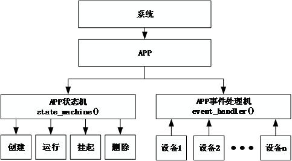
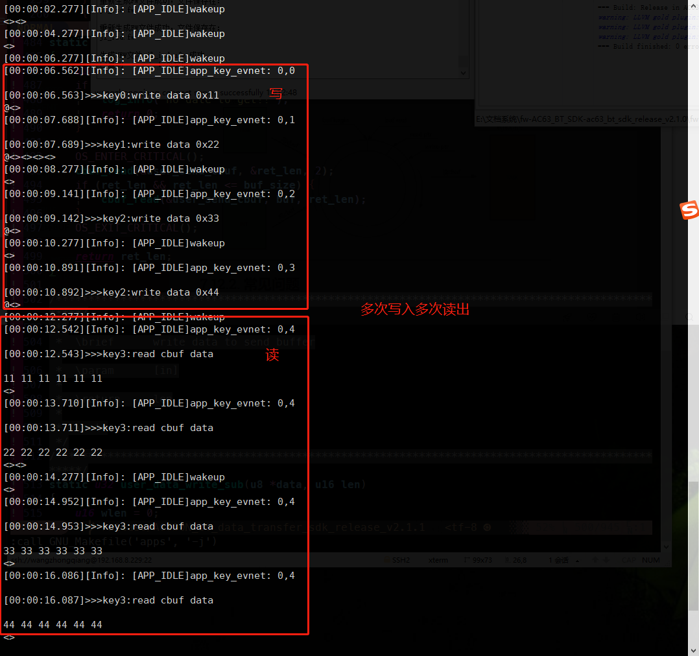
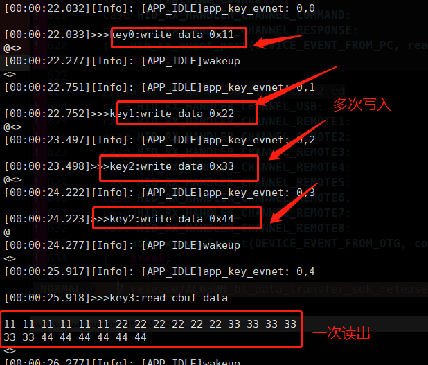
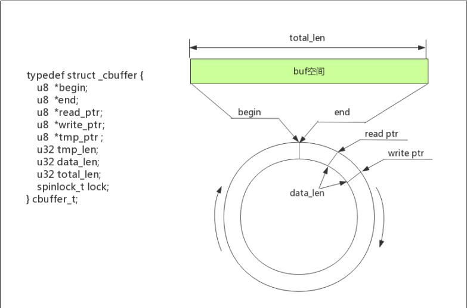
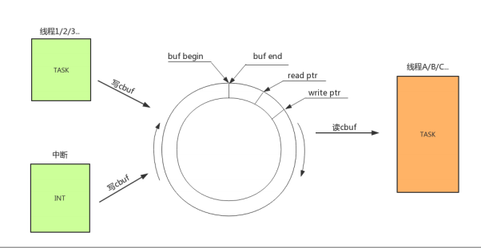

# 4. 系统说明

## 4.1. 模块介绍

### 4.1.1. APP_STATE_MACHINE

**Overview**

本案例以AC632N示例，提供展示了app_state_machine接口应用示例和常见问题。

#### 4.1.1.1. 应用示例

- app_state_machine的创建
- app_state_machine的使用与切换,具体流程如图：



#### 4.1.1.2. 工程配置

- /fw-AC63_BT_SDK-ac63_bt_sdk_release_vx.x.x/apps/hid/board/bd19目录下，双击AC632N_hid.cbp打开工程
- 使用快捷键Alt + g 打开app_config.h，配置CONFIG_APP_IDLE使能

```
//app case 选择,只选1,要配置对应的board_config.h
#define CONFIG_APP_IDLE                     1//IDLE
```

- 使用快捷键Alt + g 打开board_config.h，板级选择CONFIG_BOARD_AC632N_DEMO

```
#define CONFIG_BOARD_AC632N_DEMO       // CONFIG_APP_KEYBOARD,CONFIG_APP_PAGE_TURNER
// #define CONFIG_BOARD_AC6321A_MOUSE  // CONFIG_APP_MOUSE
//#define CONFIG_BOARD_AC6328A_KEYFOB     // CONFIG_APP_KEYFOB
```

- 使用快捷键Alt + g 打开app_idle.c，其中idle_event_handler、idle_state_machine就是对应这创建的事件机和状态机，别的工程、示例也是基于这种代码开发方式。

#### 4.1.1.3. 常见问题

- app_state_machine有什么作用？
  - 系统在运行过程中，可以通过 APP 状态机对其状态进行切换，其状态包括创建、运行、挂起、删除。
- 为什么要使用app_state_machine？
  - 使用app_state_machine可以使得所有执行的action都在 “app_core”任务执行,所有动作和事件都是单线程运转,不需要考虑互斥问题;
  - 存在多个模式,并且多个模式之间是互斥关系(非后台)的情况下, 建立多个app_state_machine切换可以使得系统资源合理利用和降低CPU的消耗;
  - 系统所有事件产生都会发送到当前app_state_machine的event_handler;

### 4.1.2. 循环BUFFER

**Overview**

本案例以AC632N示例，提供展示了循环buffer接口应用示例和常见问题。

#### 4.1.2.1. 应用示例

- /fw-AC63_BT_SDK-ac63_bt_sdk_release_vx.x.x/apps/hid/board/bd19目录下，双击AC632N_hid.cbp打开工程
- 使用快捷键Alt + g 打开app_config.h，配置CONFIG_APP_IDLE使能

```
//app case 选择,只选1,要配置对应的board_config.h
#define CONFIG_APP_IDLE                     1//IDLE
```

- 使用快捷键Alt + g 打开board_config.h，板级选择CONFIG_BOARD_AC632N_DEMO

```
#define CONFIG_BOARD_AC632N_DEMO       // CONFIG_APP_KEYBOARD,CONFIG_APP_PAGE_TURNER
// #define CONFIG_BOARD_AC6321A_MOUSE  // CONFIG_APP_MOUSE
//#define CONFIG_BOARD_AC6328A_KEYFOB     // CONFIG_APP_KEYFOB
```

- 使用快捷键Alt + g 打开app_idle.c，将cbuf_test.c 里面的代码覆盖app_idle.c里面的代码。编译下载代码。

- 将adkey接好后，短按下key0、key1、key2、key3可将数据写入到cbuf，短按下key4可将数据从cbuf里面读出来，不同的模式对应不同的结果：

  - 将#define CBUF_MODE设置为0，按下key0~key3多次写入，按下key4可多次读出

    

  - 将#define CBUF_MODE设置为1，按下key0~key3多次写入，按下key4可一次全部读出

    

  - 组合方式是非常灵活的，开发者可根据自己想法并合理使用API解决需求。

#### 4.1.2.2. 循环buf的原理

- buf 空间大小固定；
- 数据先进先出；
- buf开始和结尾是相连接的，在写到buf结束会继续从开始位置继续写入，形成唤醒结构；
- 数据可以多次写入一次读出，或一次写入多次读出；





#### 4.1.2.3. 常见问题

- cbuf通过用于什么场合?

答:适合用于流形式的数据包, 并且任务间数据流读写动态平衡的场合

- `circular_buf.h` 除了给出事例以外的接口如何使用?

答:如果例子展示的接口不满足客户应用需求, 请联系杰理技术团体增加更完善的接口使用说明

### 4.1.3. 系统不可屏蔽中断

- 请参考示例demo `5.2.1系统不可屏蔽中断`了解

### 4.1.4. VBAT供电和系统时钟频率关系限制

- 请参考示例demo `5.2.2 VBAT供电和系统时钟频率关系限制`了解


