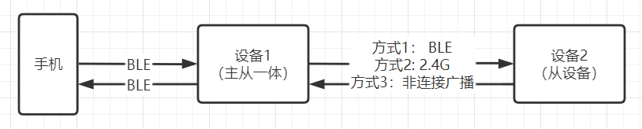

# 1. 概述

本章主要介绍通用蓝牙常见复合应用方案的配置使用，让用户能从最接近目标产品的 APP 开始开发。后续将会持续集成更多通用蓝牙方案。

# 1.1. APP - Ble And 24G And Adv_conn Case

## 1.1.1. 概述

- 本示例描述既可支持BLE的连接也可支持2.4g连接同时也支持非连接广播的应用开发示例。
- 支持的板级： br25、br23、bd19、br34
- 支持的芯片： AC636N、AC635N、AC632N、AC638N
- 原理如下图所示：一个手机、一个主从一体设备1、一个从设备2



## 1.1.2. 方式1:Ble连接工程配置

代码工程：apps/spp_and_le/board/bdxx/AC63xN_spp_and_le.cbp

### 1.1.2.1. 主从一体设备1代码配置

- 配置app选择(apps/spp_and_le/include/app_config.h)，选择多机（CONFIG_APP_MULTI）的应用示例。还可以选择别的支持主从一体的示例，例如：CONFIG_APP_CENTRAL、CONFIG_APP_AT_COM、CONFIG_APP_AT_CHAR_COM、CONFIG_APP_CONN_24G等示例，开发者可根据需求选择

```
*//app case 选择,只能选1个,要配置对应的board_config.h*
#define CONFIG_APP_MULTI 1 //蓝牙LE多连 + spp
```

- 配置对应示例支持主从一体(apps/spp_and_le/include/app_config.h)：

```
#elif CONFIG_APP_MULTI
#define CONFIG_BT_GATT_COMMON_ENABLE       1
#define CONFIG_BT_SM_SUPPORT_ENABLE        0
#define CONFIG_BT_GATT_CLIENT_NUM          1 //range(0~7):支持主机个数
#define CONFIG_BT_GATT_SERVER_NUM          1 //range(0~1):支持从机个数
#define CONFIG_BT_GATT_CONNECTION_NUM      (CONFIG_BT_GATT_SERVER_NUM + CONFIG_BT_GATT_CLIENT_NUM) //range(0~8)
#define CONFIG_BLE_HIGH_SPEED              0 //BLE提速模式: 使能DLE+2M, payload要匹配pdu的包长
```

- 先配置板级board_config.h(apps/spp_and_le/board/brxx/board_config.h)，选择对应的开发板，使用默认的板级

```
#define CONFIG_BOARD_AC632N_DEMO
*// #define CONFIG_BOARD_AC6321A_DEMO*
*// #define CONFIG_BOARD_AC6323A_DEMO*
*// #define CONFIG_BOARD_AC6328A_DEMO*
*// #define CONFIG_BOARD_AC6328B_DONGLE*
*// #define CONFIG_BOARD_AC6329B_DEMO*
*// #define CONFIG_BOARD_AC6329C_DEMO*
*// #define CONFIG_BOARD_AC6329E_DEMO*
*// #define CONFIG_BOARD_AC6329F_DEMO*
```

- 此文件下打开BLE使能，关闭EDR使能(未使用edr可以关闭,节约代码空间)

```
#define TCFG_USER_BLE_ENABLE                      1   \ *//BLE功能使能*
#define TCFG_USER_EDR_ENABLE                      0   \ *//EDR功能使能*
```

- 设置可连接设备名为“AC632N(BLE)”(ble_multi_central.c)，名字需要保证和设备2名字一样即可

```
static const u8 cetl_test_remoter_name1[] = "AC632N(BLE)";//
static const client_match_cfg_t multi_match_device_table[] = {
    {
        .create_conn_mode = BIT(CLI_CREAT_BY_NAME),
        .compare_data_len = sizeof(cetl_test_remoter_name1) - 1, //去结束符
        .compare_data = cetl_test_remoter_name1,
        .filter_pdu_bitmap = 0,
    },
};
```

- 设置完毕，下载代码进入设备1，下载后重启并测试能否被手机搜索到、并正常连接。

### 1.1.2.2. 从设备2代码配置

> **Note**
>
> 不必关闭SDK，在上述设备1的配置上继续操作

- 配置app选择(apps/spp_and_le/include/app_config.h)，选择spp_and_le的应用示例

```
*//app case 选择,只能选1个,要配置对应的board_config.h*
#define CONFIG_APP_SPP_LE 1 //SPP + LE or LE's client
```

- 设置完毕，下载代码进入设备2，下载后重启并测试能否被设备1正常连接、能否正常回连接即可。

### 1.1.2.3. 数据发送接口

- 设备1向设备2发数接口: 请参考示例demo [APP - Bluetooth Multi connections](https://doc.zh-jieli.com/AC63/zh-cn/release_v2.3.0/module_demo/spple/multi.html#multi) 下 [`](https://doc.zh-jieli.com/AC63/zh-cn/release_v2.3.0/classic_demo/ble_and_24g.html#id5)数据发送模块 ` 了解

## 1.1.3. 方式2:2.4G连接工程配置

代码工程：apps/spp_and_le/board/bdxx/AC63xN_spp_and_le.cbp

### 1.1.3.1. 主从一体设备1代码配置

- 配置app选择(apps/spp_and_le/include/app_config.h)，选择多机（CONFIG_APP_MULTI）的应用示例。还可以选择别的支持主从一体的示例，例如：CONFIG_APP_CENTRAL、CONFIG_APP_AT_COM、CONFIG_APP_AT_CHAR_COM、CONFIG_APP_CONN_24G等示例，开发者可根据需求选择

```
*//app case 选择,只能选1个,要配置对应的board_config.h*
#define CONFIG_APP_MULTI 1 //蓝牙LE多连 + spp
```

- 配置对应示例支持主从一体(apps/spp_and_le/include/app_config.h)：

```
#elif CONFIG_APP_MULTI
#define CONFIG_BT_GATT_COMMON_ENABLE       1
#define CONFIG_BT_SM_SUPPORT_ENABLE        0
#define CONFIG_BT_GATT_CLIENT_NUM          1 //range(0~7):支持主机个数
#define CONFIG_BT_GATT_SERVER_NUM          1 //range(0~1):支持从机个数
#define CONFIG_BT_GATT_CONNECTION_NUM      (CONFIG_BT_GATT_SERVER_NUM + CONFIG_BT_GATT_CLIENT_NUM) //range(0~8)
#define CONFIG_BLE_HIGH_SPEED              0 //BLE提速模式: 使能DLE+2M, payload要匹配pdu的包长
```

- 在(apps/spp_and_le/include/app_config.h)中继续添加2.4G配对码宏定义，在下图位置添加即可

```
#define TCFG_MEDIA_LIB_USE_MALLOC                   1

---------------------添加如下代码-------------------

//2.4G模式: 0---ble, 非0---2.4G配对码
#define CFG_RF_24G_CODE_ID          (0) //<=24bits
#define CFG_RF_24G_CODE_ID_SET      (0x23) //<=24bits
---------------------添加如上代码-------------------

//apps example 选择,只能选1个,要配置对应的board_config.h
#define CONFIG_APP_SPP_LE                 1 //SPP + LE or LE's client
#define CONFIG_APP_MULTI                  0 //蓝牙LE多连 + spp
#define CONFIG_APP_DONGLE                 0 //usb + 蓝牙(ble 主机),PC hid设备
```

- 先配置板级board_config.h(apps/spp_and_le/board/brxx/board_config.h)，选择对应的开发板，使用默认的板级

```
#define CONFIG_BOARD_AC632N_DEMO
*// #define CONFIG_BOARD_AC6321A_DEMO*
*// #define CONFIG_BOARD_AC6323A_DEMO*
*// #define CONFIG_BOARD_AC6328A_DEMO*
*// #define CONFIG_BOARD_AC6328B_DONGLE*
*// #define CONFIG_BOARD_AC6329B_DEMO*
*// #define CONFIG_BOARD_AC6329C_DEMO*
*// #define CONFIG_BOARD_AC6329E_DEMO*
*// #define CONFIG_BOARD_AC6329F_DEMO*
```

- 此文件下打开BLE使能，关闭EDR使能

```
#define TCFG_USER_BLE_ENABLE                      1   \ *//BLE功能使能*
#define TCFG_USER_EDR_ENABLE                      0   \ *//EDR功能使能*
```

- 设置可连接设备名为“AC632N(BLE)”(ble_multi_central.c)，名字需要保证和设备2名字一样即可

```
static const u8 cetl_test_remoter_name1[] = "AC632N(BLE)";//
static const client_match_cfg_t multi_match_device_table[] = {
    {
        .create_conn_mode = BIT(CLI_CREAT_BY_NAME),
        .compare_data_len = sizeof(cetl_test_remoter_name1) - 1, //去结束符
        .compare_data = cetl_test_remoter_name1,
        .filter_pdu_bitmap = BIT(EVENT_ADV_SCAN_IND) | BIT(EVENT_ADV_DIRECT_IND) | BIT(EVENT_ADV_NONCONN_IND),//过滤掉scan direct noconn广播
    },
};
```

- 设置广播为不定向广播（即设置2.4G配对码为0，这样可以保证被手机正常连接）(le_gatt_server.c)，设置如下图所示。

```
/*************************************************************************************************/
/*!
 *  \brief      调用开广播
 *
 *  \param      [in]
 *
 *  \return
 *
 *  \note
 */
/*************************************************************************************************/
int ble_gatt_server_adv_enable(u32 en)
{
---------------------添加如下代码-------------------
#if CONFIG_APP_SPP_LE
    rf_set_24g_hackable_coded(CFG_RF_24G_CODE_ID_SET);//从机广播设置为2.4g模式
#else
    rf_set_24g_hackable_coded(CFG_RF_24G_CODE_ID);//从机广播设置为非2.4g模式
#endif
---------------------添加如上代码-------------------

    ble_state_e next_state, cur_state;
```

- 设置扫描为只连接2.4G设备（即设置2.4G配对码为0x23，这样可以保证可以正常搜索到设备2）(le_gatt_client.c)，设置如下图所示

```
/*************************************************************************************************/
/*!
 *  \brief      打开设备scan
 *
 *  \param      [in]
 *
 *  \return     gatt_op_ret_e
 *
 *  \note
 */
/*************************************************************************************************/
int ble_gatt_client_scan_enable(u32 en)
{
---------------------添加如下代码-------------------
    rf_set_24g_hackable_coded(CFG_RF_24G_CODE_ID_SET);//主机扫描设置为2.4g模式
---------------------添加如上代码-------------------
    ble_state_e next_state, cur_state;
```

- 设置完毕，下载代码进入设备1，下载后重启并测试能否被手机搜索到、并正常连接。

### 1.1.3.2. 从设备2代码配置

> **Note**
>
> 不必关闭SDK，在上述设备1的配置上继续操作

- 配置app选择(apps/spp_and_le/include/app_config.h)，选择spp_and_le的应用示例

```
*//app case 选择,只能选1个,要配置对应的board_config.h*
#define CONFIG_APP_SPP_LE 1 //SPP + LE or LE's client
```

- 设置完毕，下载代码进入设备2，下载后重启并测试能否被设备1正常连接、能否正常回连接即可。
- 当开发者选择选择别的示例，需要把(le_gatt_client.c)中的判断部分（#if CONFIG_APP_SPP_LE）修改为对应示例宏定义即可（例如：#if CONFIG_APP_LL_SYNC）

```
/*************************************************************************************************/
/*!
 *  \brief      调用开广播
 *
 *  \param      [in]
 *
 *  \return
 *
 *  \note
 */
/*************************************************************************************************/
int ble_gatt_server_adv_enable(u32 en)
{
---------------------修改如下代码-------------------
#if CONFIG_APP_SPP_LE
---------------------修改如上代码-------------------
    rf_set_24g_hackable_coded(CFG_RF_24G_CODE_ID_SET);//从机广播设置为2.4g模式
#else
    rf_set_24g_hackable_coded(CFG_RF_24G_CODE_ID);//从机广播设置为非2.4g模式
#endif

    ble_state_e next_state, cur_state;
```

### 1.1.3.3. 数据发送接口

- 设备1向设备2发数接口: 请参考示例demo `APP - Bluetooth Multi connections` 下`数据发送模块 ` 了解

## 1.1.4. 方式3:非连接广播工程配置

代码工程：apps/spp_and_le/board/bdxx/AC63xN_spp_and_le.cbp

### 1.1.4.1. 主从一体设备1代码配置

- 配置app选择(apps/spp_and_le/include/app_config.h)，选择多机（CONFIG_APP_MULTI）的应用示例。还可以选择别的支持主从一体的示例，例如：CONFIG_APP_CENTRAL、CONFIG_APP_AT_COM、CONFIG_APP_AT_CHAR_COM、CONFIG_APP_CONN_24G等示例，开发者可根据需求选择

```
*//app case 选择,只能选1个,要配置对应的board_config.h*
#define CONFIG_APP_MULTI 1 //蓝牙LE多连 + spp
```

- 在(apps/spp_and_le/include/app_config.h)中继续添加2.4G配对码宏定义，在下图位置添加即可

```
#define TCFG_MEDIA_LIB_USE_MALLOC                   1

---------------------添加如下代码-------------------

//2.4G模式: 0---ble, 非0---2.4G配对码
#define CFG_RF_24G_CODE_ID0          (0) //<=24bits
#define CFG_RF_24G_CODE_ID_SET      (0x13) //<=24bits
---------------------添加如上代码-------------------
```

- 配置对应示例支持主从一体(apps/spp_and_le/include/app_config.h)：

```
#elif CONFIG_APP_MULTI
#define CONFIG_BT_GATT_COMMON_ENABLE       1
#define CONFIG_BT_SM_SUPPORT_ENABLE        0
#define CONFIG_BT_GATT_CLIENT_NUM          1 //range(0~7):支持主机个数
#define CONFIG_BT_GATT_SERVER_NUM          1 //range(0~1):支持从机个数
#define CONFIG_BT_GATT_CONNECTION_NUM      (CONFIG_BT_GATT_SERVER_NUM + CONFIG_BT_GATT_CLIENT_NUM) //range(0~8)
#define CONFIG_BLE_HIGH_SPEED              0 //BLE提速模式: 使能DLE+2M, payload要匹配pdu的包长
```

- 先配置板级board_config.h(apps/spp_and_le/board/brxx/board_config.h)，选择对应的开发板，使用默认的板级

```
#define CONFIG_BOARD_AC632N_DEMO
*// #define CONFIG_BOARD_AC6321A_DEMO*
*// #define CONFIG_BOARD_AC6323A_DEMO*
*// #define CONFIG_BOARD_AC6328A_DEMO*
*// #define CONFIG_BOARD_AC6328B_DONGLE*
*// #define CONFIG_BOARD_AC6329B_DEMO*
*// #define CONFIG_BOARD_AC6329C_DEMO*
*// #define CONFIG_BOARD_AC6329E_DEMO*
*// #define CONFIG_BOARD_AC6329F_DEMO*
```

- 此文件下打开BLE使能，关闭EDR使能(未使用edr可以关闭,节约代码空间)

```
#define TCFG_USER_BLE_ENABLE                      1   \ *//BLE功能使能*
#define TCFG_USER_EDR_ENABLE                      0   \ *//EDR功能使能*
```

- 添加非连接广播接收打印“AC632N(BLE)”(apps/spp_and_le/examples/multi_conn/ble_multi_central.c)

```
static int multi_client_event_packet_handler(int event, u8 *packet, u16 size, u8 *ext_param)
{
    /* log_info("event: %02x,size= %d\n",event,size); */
    switch (event) {
    case GATT_COMM_EVENT_GATT_DATA_REPORT: {
        att_data_report_t *report_data = (void *)packet;
        log_info("data_report:hdl=%04x,pk_type=%02x,size=%d\n", report_data->conn_handle, report_data->packet_type, report_data->blob_length);
        put_buf(report_data->blob, report_data->blob_length);

        switch (report_data->packet_type) {
        case GATT_EVENT_NOTIFICATION://notify
            break;
        case GATT_EVENT_INDICATION://indicate
            break;
        case GATT_EVENT_CHARACTERISTIC_VALUE_QUERY_RESULT://read
            break;
        case GATT_EVENT_LONG_CHARACTERISTIC_VALUE_QUERY_RESULT://read long
            break;
        default:
            break;
        }
    }
    break;
---------------------添加如下代码-------------------
    case GATT_COMM_EVENT_SCAN_ADV_REPORT:
        log_info("reject noconn adv data");
        put_buf(packet, size);
        break;
---------------------添加如上代码-------------------
    case GATT_COMM_EVENT_CAN_SEND_NOW:
```

- 上述文件继续修改主机scan conn参数，将过滤标志位值0

```
//scan参数设置
static void multi_scan_conn_config_set(struct ctl_pair_info_t *pair_info)
{
    multi_client_scan_cfg.scan_auto_do = 1;
    multi_client_scan_cfg.creat_auto_do = 1;
    multi_client_scan_cfg.scan_type = SET_SCAN_TYPE;
---------------------修改如下代码-------------------
    multi_client_scan_cfg.scan_filter = 0;
---------------------修改如上代码-------------------
    multi_client_scan_cfg.scan_interval = SET_SCAN_INTERVAL;
    multi_client_scan_cfg.scan_window = SET_SCAN_WINDOW;
```

- 上述文件继续关闭主机搜索配置，不需要此功能

```
#else
    log_info("no set scan para");
---------------------屏蔽如下代码-------------------
    /* ble_gatt_client_set_search_config(&multil_client_search_config); */
---------------------屏蔽如上代码-------------------
#endif
```

- 设置只接收2.4G非连接广播数据(le_gatt_client.c)，设置如下图所示

```
/*************************************************************************************************/
/*!
 *  \brief      打开设备scan
 *
 *  \param      [in]
 *
 *  \return     gatt_op_ret_e
 *
 *  \note
 */
/*************************************************************************************************/
int ble_gatt_client_scan_enable(u32 en)
{
---------------------添加如下代码-------------------
    rf_set_24g_hackable_coded(CFG_RF_24G_CODE_ID_SET);//主机扫描设置为2.4g模式
---------------------添加如上代码-------------------
    ble_state_e next_state, cur_state;
```

- 设置广播为不定向广播（即设置2.4G配对码为0，这样可以保证被手机正常连接）(le_gatt_server.c)，设置如下图所示。

```
/*************************************************************************************************/
/*!
 *  \brief      调用开广播
 *
 *  \param      [in]
 *
 *  \return
 *
 *  \note
 */
/*************************************************************************************************/
int ble_gatt_server_adv_enable(u32 en)
{
---------------------添加如下代码-------------------
    rf_set_24g_hackable_coded(CFG_RF_24G_CODE_ID0);//从机广播设置为非2.4g模式
---------------------添加如上代码-------------------

    ble_state_e next_state, cur_state;
```

- 设置完毕，下载代码进入设备1，下载后重启并测试能否被手机搜索到、并正常连接。

### 1.1.4.2. 从设备2代码配置

> **Note**
>
> 不必关闭SDK，在上述设备1的配置上继续操作

- 配置app选择(apps/spp_and_le/include/app_config.h)，选择CONFIG_APP_NONCONN_24G的应用示例

```
*//app case 选择,只能选1个,要配置对应的board_config.h*
#define CONFIG_APP_NONCONN_24G            1 //2.4G 非连接收发
```

- 设置2.4G 非连接收发作为发送端

```
//配置收发角色
#define CONFIG_TX_MODE_ENABLE     1 //发射器
#define CONFIG_RX_MODE_ENABLE     0 //接收器
```

- 将原本的通信信道屏蔽

```
u8 ext_name_len = sizeof(ble_ext_name) - 1;

rf_set_24g_hackable_coded(CFG_RF_24G_CODE_ID);
---------------------屏蔽如下代码-------------------
/* ble_rf_vendor_fixed_channel(36, 3); //通信信道，发送接收都要一致 */
---------------------屏蔽如上代码-------------------

name_p = bt_get_local_name();
```

- 设置完毕，下载代码进入设备2，下载后重启并测试设备2发送数据能否被设备1正常接收。

### 1.1.4.3. 数据发送接口

- 设备2向设备1发数接口: 请参考示例demo `APP - CONN_24G`下`数据发送模块 ` 了解


