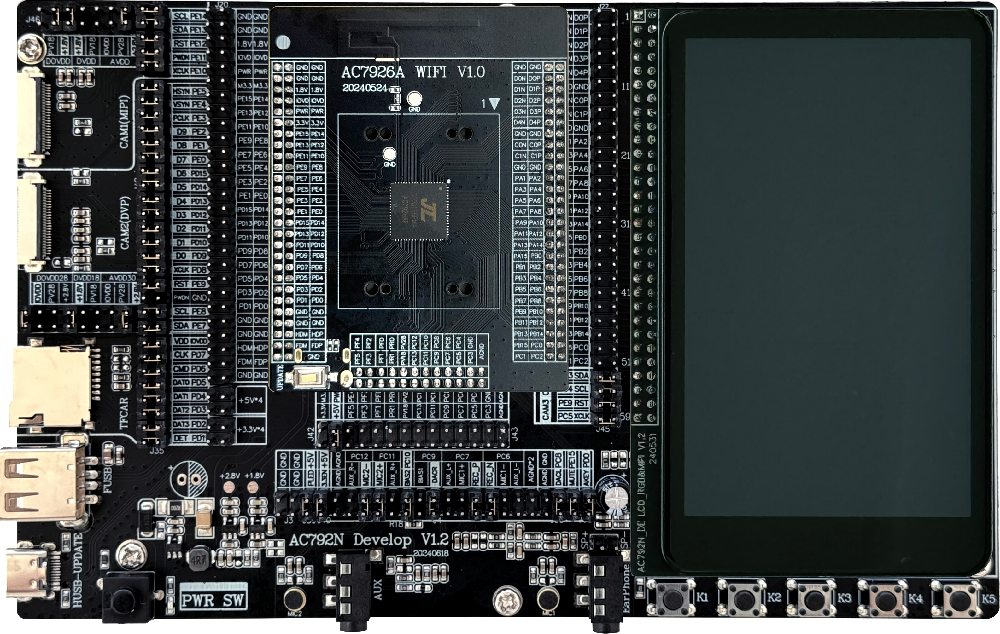

# 1. 开发板概述

AC792N开发板是一款以AC7926A为主芯片，实现WiFi/蓝牙/BLE 三模共存的音视频多媒体系统开发板。开发板主要由功能底板，MCU核心板、屏幕板等功能板组成。提供了多种音视频开发接口，主要包括了MIPI(4Lane)/RGB（最高支持24位）显示屏、MIPI/DVP摄像头（最高支持1280x720P@30Ffs）、TF卡、DAC、USB、ADC、DAC等丰富的外设接口，预留跳选电路和拓展接口，可以灵活开发AC792N全系列芯片方案。可以理解的是，AC7926A外的AC792N系列其它芯片顶板也可搭配本开发板底板开发使用。

AC792N系列芯片具有强大图形处理和显示性能，内置2.5D GPU /2D DMA，支持720P视频，拥有丰富的外设接口，支持WiFi/蓝牙/BLE三模共存，真正实现一芯多用，高度集成。

相关代码库[SDK开发固件](https://gitcode.com/yunthinker/fw-AC792_SDK)

开发板购买链接请点击[这里](https://item.taobao.com/item.htm?ft=t&id=1007411269513)

技术交流QQ群：593243414
