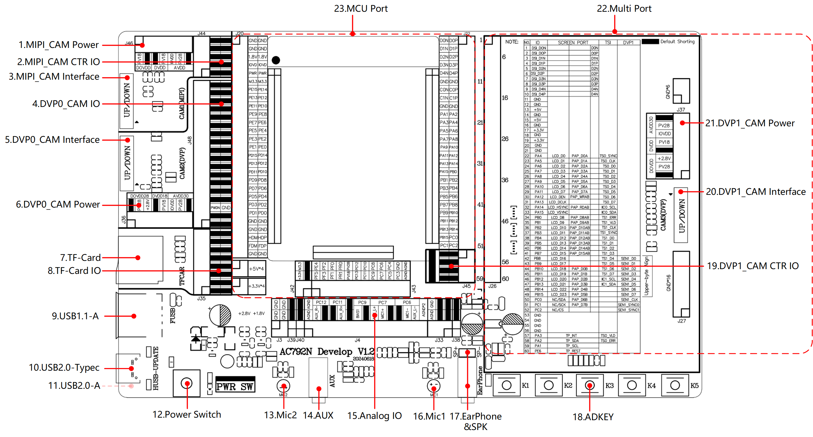

# 4. 功能框图

AC792N开发板功能框图如下所示：

> 
>
> **AC792N 开发板功能示意图**
>
> | **序号** | **主要组件**       | **基本介绍**                                                 |
> | -------- | ------------------ | ------------------------------------------------------------ |
> | 1        | MIPI_CAM Power     | MIPI 摄像头电源选择接口                                      |
> | 2        | MIPI_CAM CTR IO    | MIPI 摄像头控制IO                                            |
> | 3        | MIPI_CAM Interface | MIPI 摄像头接口，24Pin 上下接FPC座，最高支持1280x720P@30Ffs  |
> | 4        | DVP0_CAM IO        | DVP0 摄像头IO，最高支持10位DVP                               |
> | 5        | DVP0_CAM Interface | DVP0 摄像头接口，24Pin 上下接FPC座，最高支持1280x720P@30Ffs  |
> | 6        | DVP0_CAM Power     | DVP0 摄像头电源选择接口                                      |
> | 7        | TF-Card            | TF卡座，最大支持128G                                         |
> | 8        | TF-Card IO         | TF 卡SDIO, 四线                                              |
> | 9        | USB1.1-A           | FUSB,A口母座                                                 |
> | 10       | USB2.0-Typec       | HUSB，Typec接口，程序下载口                                  |
> | 11       | USB2.0-A           | HUSB,A口母座，程序下载口，位于底面                           |
> | 12       | Power Switch       | 整板电源开关                                                 |
> | 13       | Mic2               | 麦2，模拟麦                                                  |
> | 14       | AUX                | AUX接口，3.5mm音频座                                         |
> | 15       | Analog IO          | 模拟IO排针，根据功能选择连接跳线帽                           |
> | 16       | Mic1               | 麦1，模拟麦                                                  |
> | 17       | EarPhone&SPK       | 耳机接口，3.5mm音频接口；喇叭2.54mm排针接口，最大支持5W输出功率 |
> | 18       | ADKEY              | AD按键                                                       |
> | 19       | DVP1_CAM CTR IO    | DVP1 摄像头控制IO                                            |
> | 20       | DVP1_CAM Interface | DVP1 摄像头接口(8位)，24Pin 上下接FPC座，最高支持1280x720P@30Ffs |
> | 21       | DVP1_CAM Power     | DVP1 摄像头电源选择口                                        |
> | 22       | Multi Port         | 多功能接口，可接屏幕，TSI,DVP摄像头等功能                    |
> | 23       | MCU Port           | 主控板接口                                                   |