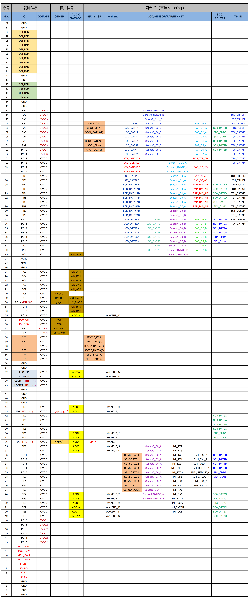

# 5. 主控板IO功能图表

AC792N开发板主控顶板的板框尺寸及 IO 接口信息如下图所示。主控顶板采用 2mm 排母和底板相连。开发者可将主控顶板单独作为模块，另外设计功能底板进行方案开发。

**AC792N 主控顶板框尺寸及IO接口**

**AC792N 主控顶板IO功能表**

**Note**

**关于数字和字母编号的说明：** 以SD0_DAT0A 为例，表示SDIO第 0 组的 数据0的A 出口，它与 SD0_DAT0B 属于同一组SDIO，仅 A/B 出口不同，当使用了同一组SDIO的 A 出口时， 就不能使用该SDIO的 B 出口，不支持同时使用。不同数字编号的同一种功能属于不同组，可以支持同时使用。上表其余功能项的数字和字母编号，与之串口编号类似。

**关于其它功能Crossbar映射说明：** AC792N 除了上表列举的固定IO功能，还支持UART/IIC/SPI/CAN/QEDC/ALINK/LEDC/MCPWM等功能，这些功能可以通过Crossbar映射到除PF、PR、PV口外的任意IO。具体功能和配置请参照各个具体封装芯片规格书和sdk配置说明。

**注[1]:** LVD为低电检测

**注[2]:** 长按复位（4s） 为低电4秒复位，该功能可关闭

**注[3]:** SDPG为SD卡供电电源

**注[4]:** MCLR为低电复位，该功能可关闭

**注:** 如果网页查看上面IO功能表偏小，可点开本网页右上角-切换宽屏-显示，或右键保存IO功能表图片进行查看，亦或宽屏显示状态下，缩小网页，图片将会触发放大显示。
