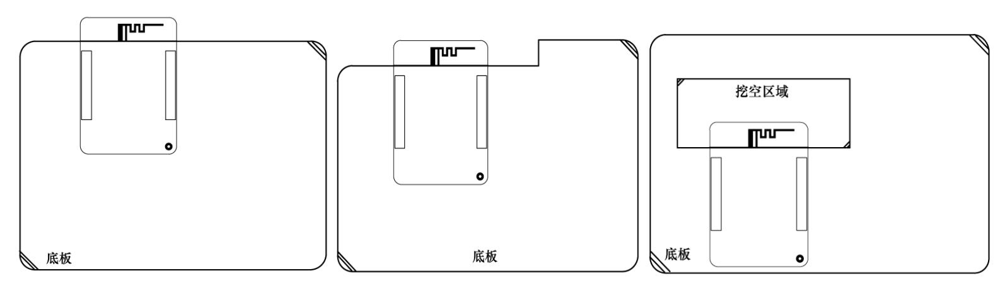

# 6. 扩展使用指南

AC792N 开发板集成了屏幕、摄像头、TF卡、DAC、MIC、LINEIN、USB等音视频开发接口，同时可映射使用IIC、SPI、UART、PWM等接口，可以外接多种传感器或者硬件模块进行开发调试。其中主控顶板还可单独作为模块配合用户自行设计的底板进行开发使用。

**Warning**

主控顶板大多数IO集成有多种功能，注意在使用时不要冲突。

**核心板作为模块进行开发**

主控顶板可作为模块板，灵活的用在其他方案板上进行开发使用。开发者可根据上文核心板IO布局及尺寸图，自行设计底板进行使用开发。开发者在自行设计底板原理图设计及PCB时，有以下注意点：

**1.电源部分**

输入：可使用TypeC座的电源输入或者5V电源连接排针MCU_PWR管脚供电； 输出：可使用主控顶板的MUC_3.3V排针，输出的3.3V供扩展外设使用。

**2.音频部分**

外接音频输入(MIC、AUX)或者音频输出（DACL、DACR）时候，模拟地AGND需与数字地GND在电源入口处或者麦克风处相接，减少音频底噪。PCB布局时最好能单独分出音频模拟部分区域，音频信号(MIC、AUX、DACL、DACR)布线时应远离数字信号线并做包地(模拟地AGND)处理。

**3.位置布局**

底板布局时，应尽量减少底板对天线的干扰衰减作用，条件允许的情况下，推荐系统板延伸出板外，使得板载PCB天线刚好伸出板外（如图）；若无法满足延伸板外的条件，请尽量避免板载天线的靠近外壳或者金属固件，可以选择切掉或者挖空相关区域（如图），尽量扩大板载天线的净空区域，减少底板对于PCB天线RF性能的影响。

> 