# 10. 第三方库部分

---

# 10.1. FINSH

**Overview**

展示了finsh使用流程和常见问题。

## 10.1.1. 使用流程

**1. app_config.h文件中开启宏定义 `#define FINSH_ENABLE`**

**2. 去对应的board.c文件中配置相对应的串口**

工程默认uart1为发送数据串口，关于串口的具体配置可以参考外设部分uart文档。发送串口可以改，具体操作看下面的常见问题。

## 10.1.2. 操作说明

**1. 烧录成功之后，在收集命令的串口输入要操作的命令。输入操作为命令+回车键，例如：输入version回车。**

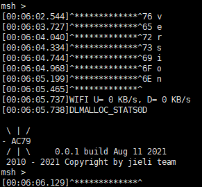

**2. 命令模式一般是直接进入到msh模式，如想去到finsh模式则输入exit命令。**

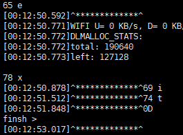

**3. 在finsh模式下输入命令操作为：version()回车。**

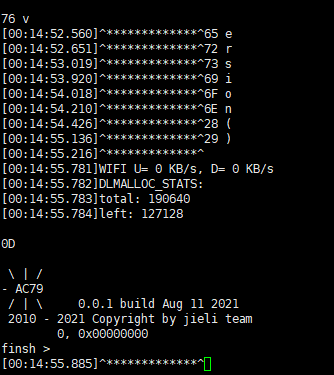

**4. 如果想从finsh模式回到msh模式则输入msh()命令**

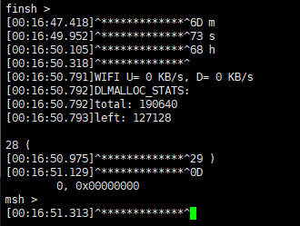

## 10.1.3. 常见问题

**1. 终端操作是通过一个串口发送命令，另一个串口打印数据**

**2. 如何自定义命令？**

（1）首先在cmd.c文件中实现函数功能。

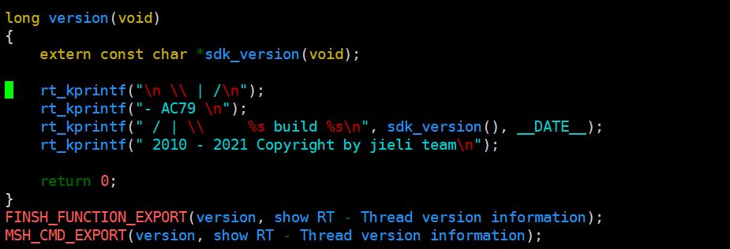

（2）在symbol.c文件中声明函数。

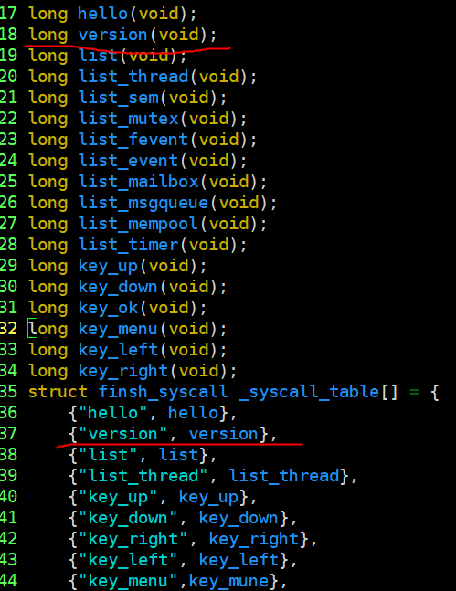

**3. 如何修改发送数据串口？**

（1）在board.c函数中调用图片中的函数返回想要修改的串口。

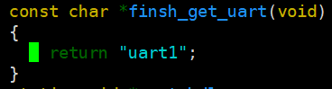

## 10.1.4. API Reference

---

# 10.2. AT

## 10.2.1. AT_SERVER

**Overview**

本工程展示了AT组件使用：

1. 电脑PC的串口助手作为AT客户端用于发送AT命令，AC79芯片作为AT服务端响应AT命令，返回执行结果到串口助手。
2. 添加自定义AT命令

### 10.2.1.1. 工程配置说明

**1. 进入 `apps/demo/demo_DevKitBoard/include/demo_config.h` ，开启宏 `USE_AT_SERVER_TEST_DEMO` 。**

**2. 在工程的board.c文件中配置相对应的串口**

并可以增加如下at_get_uart()函数进行串口修改返回，串口需要同时用做打印和通信功能，工程默认uart1为AT命令发送和接收数据串口。关于串口的具体配置可以参考外设部分uart文档。
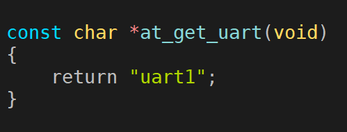

### 10.2.1.2. 模块依赖

- at.a 文件库

### 10.2.1.3. 操作说明

**1. 烧录成功之后，在电脑PC串口发送如下默认支持的操作命令**

输入操作为 `命令+\r+回车键`，其中 `\r` 为命令结束标志，所有命令必须以此标志结尾。

- **AT**：测试AT启动命令；
- **ATZ**：设备恢复出厂设置；
- **AT+RST**：设备重启；
- **AT&L**：列出全部命令列表；
- **AT+UART**：显示串口参数；

**2. 观察串口打印的响应结果**

例如：输入如下命令 `AT\r` 、 `AT+UART?\r`，均会响应相关执行结果

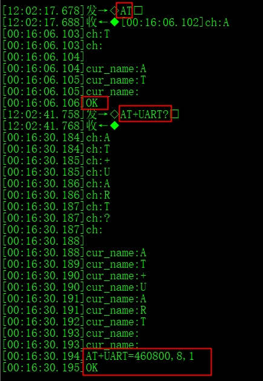

### 10.2.1.4. 常见问题

**如何自定义AT命令？**

答：用户想使用更多功能需要针对不同 AT 设备完成自定义 AT Server 命令，AT 组件提供类似于 finsh/msh命令添加方式的 AT 命令添加方式，方便用户实现需要的命令。

AT 命令根据传入的参数格式不同可以实现不同的功能，对于每个 AT 命令最多包含四种功能，如下所述：

- **测试功能**： `AT+<x>=?` 用于查询命令参数格式及取值范围；
- **查询功能**： `AT+<x>?` 用于返回命令参数当前值；
- **设置功能**： `AT+<x>=...` 用于用户自定义参数值；
- **执行功能**： `AT+<x>` 用于执行相关操作。

每个命令的四种功能并不需要全部实现，用户自定义添加 AT Server 命令时，可根据自己需求实现一种或几种上述功能函数，未实现的功能可以使用 NULL 表示，再通过自定义命令添加函数添加到基础命令列表，添加方式类似于 finsh/msh命令添加方式，添加函数如下：

```c
AT_CMD_EXPORT(_name_, _args_expr_, _test_, _query_, _setup_, _exec_);
```

**参数说明：**

| 参数          | 描述                                                               |
| ------------- | ------------------------------------------------------------------ |
| _name_      | AT命令名称                                                         |
| _args_expr_ | AT命令参数表达式；（无参数为NULL, <>中为必选参数，[]中为可选参数） |
| _test_      | AT测试功能函数名；（无实现为NULL）                                 |
| _query_     | AT查询功能函数名；（同上）                                         |
| _setup_     | AT设置功能函数名；（同上）                                         |
| _exec_      | AT执行功能函数名；（同上）                                         |

**如下为注册"AT+TEST"命令示例:**

在at_basd_cmd.c中添加如下"AT+TEST"命令的执行函数at_test_exec()、查询函数at_test_query()以及命令输出函数AT_CMD_EXPORT()

```c
static at_result_t at_test_exec(void)
{
    printf("AT test commands execute!");
  
    return AT_RESULT_OK;
}

static at_result_t at_test_query(void)
{
    printf("AT test commands query!");
  
    return AT_RESULT_OK;
}

AT_CMD_EXPORT("AT+TEST", "=<value1>", RT_NULL, at_test_query, RT_NULL, at_test_exec);
```

添加命令后，编译烧录程序，串口分别输入执行命令 `AT+TEST\r`、查询命令 `AT+TEST?\r`，执行结果如下

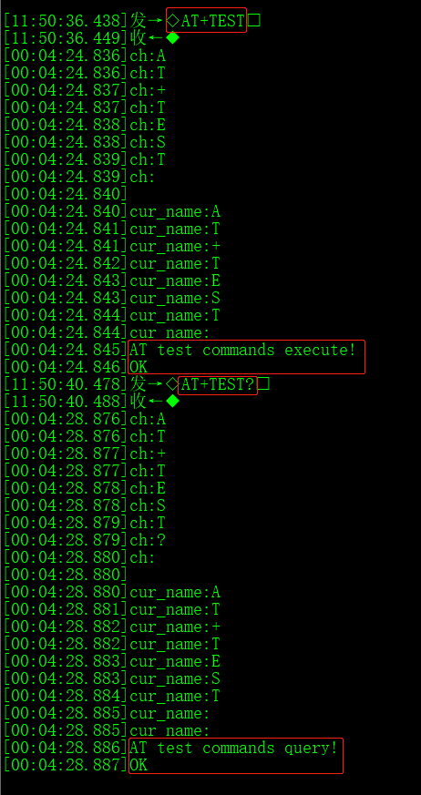

---

## 10.2.2. AT_SOCKET

**Overview**

本工程展示了at_socket在AC79上的使用：

**1. 创建at_socket自定义AT命令**

- `AT+TS` : 创建TCP SERVER模块接口命令
- `AT+TC` : 创建TCP CLIENT模块接口命令
- `AT+US` : 创建UDP SERVER模块接口命令

**2. 电脑PC的串口助手发送上述相关at_socket命令**

AC79芯片会响应上述命令进而创建对应的TCP/UDP Socket模块接口，利用Socket网络调试助手配置对应的协议类型、IP地址、端口号即可进行Socket通信，在网络调试助手进行Socket收发数据时，串口助手也会收到提示信息

### 10.2.2.1. 工程配置说明

**1. 进入 `apps/demo/demo_DevKitBoard/include/demo_config.h` ，开启宏 `USE_AT_SOCKET_TEST_DEMO` 。**

**2. 在工程的board.c文件中配置相对应的串口**

并可以增加如下at_get_uart()函数进行串口修改返回，串口需要同时用做打印和通信功能，工程默认uart1为AT命令发送和接收数据串口。关于串口的具体配置可以参考外设部分uart文档。


### 10.2.2.2. 模块依赖

- at.a 文件库

### 10.2.2.3. 操作说明

**1. 工程配置之后，示例需要运行在STA模式，并保证Socket网络调试助手和AC79处于同一网段下**

**2. 烧录成功之后，在电脑PC串口端发送如下支持的at_socket命令**

输入操作为 `命令+\r+回车键`，其中 `\r` 为命令结束标志，所有命令必须以此标志结尾

- `AT+TS` : 创建TCP SERVER模块接口命令
- `AT+TC` : 创建TCP CLIENT模块接口命令
- `AT+US` : 创建UDP SERVER模块接口命令

**3. 下面以at_socket命令 `AT+TS` 为例创建TCP SERVER模块接口， 详细说明at_socket的使用**

（1）在demo_wifi工程的STA模式下，在电脑串口端输入命令 `AT+TS\r`，得到如下响应，表示tcp server创建成功

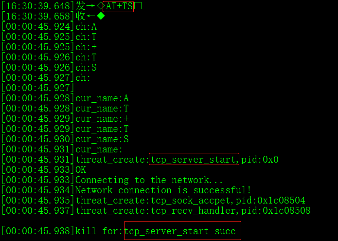

（2）在电脑PC端的Socket网络调试助手配置协议类型、IP地址、端口号如下

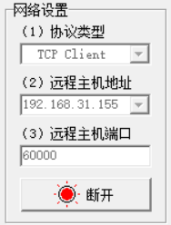

连接成功后串口助手会提示一下信息

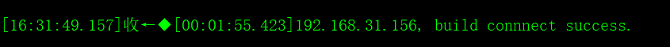

发送ascii数据 `JL_TECH_2021`，网络调试助手得到如下响应

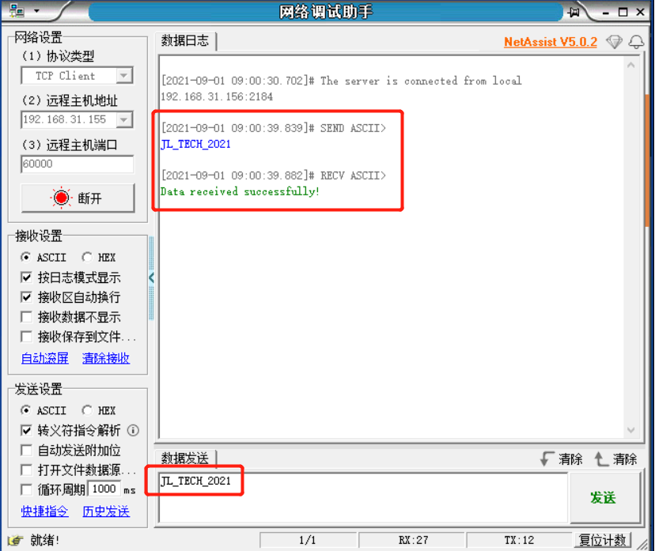

（3）同时串口助手端也会收到如下提示信息

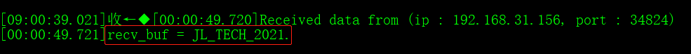

### 10.2.2.4. 常见问题

**at_socket预先配置各端口号是多少？怎么查看当前设备的IP地址？**

答：at_socket所有预设的端口号都是60000，当前设备的IP地址通过串口的以下信息得到

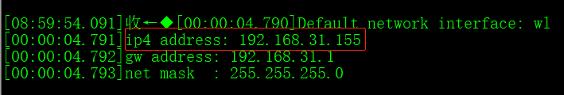

---

# 10.3. FlashDB

**Overview**

FlashDB是一个超轻量级的嵌入式数据库，专注于为嵌入式产品提供数据存储解决方案。与传统的基于文件系统的数据库不同，FlashDB结合了Flash的特点，具有较强的性能和可靠性。并在保证极低资源占用的前提下，应尽可能延长Flash的使用寿命。

## 10.3.1. 使用流程

**示例演示：** FlashDB 提供两种数据库模式：

- **键值数据库**：它是一个非关系数据库，它将数据存储为键值对的集合，其中键用作唯一标识符。KVDB操作简单，可扩展性强。
- **时序数据库**：时序数据库 （TSDB），按时间序列存储数据。TSDB数据具有时间戳、数据存储量大、插入查询性能高等特点。

**example:** `apps/demo/demo_DevKitBoard/include/demo_config.h` ，开启宏 `USE_FLASHDB_TEST_DEMO` 。

具体相关内容可以打开 [FlashDB](https://armink.github.io/FlashDB/) ,进行查看。

---

# 10.4. Tengine_cnn

**Overview**

Tengine 采用了轻量级模块化的高性能神经网络推理引擎，便于扩展和裁剪，最小体积程序可以做到 300KB，在 MCU 上甚至能够做到 20KB。而且，它专门针对 Arm 嵌入式设备优化，无需依赖第三方库，可跨平台使用支持 Android、Linux、RTOS。

## 10.4.1. 使用流程

**示例演示：**

**1. 在服务器上新建文件夹把Tengine的源码拉取下来**

```bash
git clone https://gitee.com/OAL/Tengine.git
```

ubuntu环境即可。

**2. 进入到Tengine中切换分支， 去到lite-v1.5-nvdla分支**

```bash
git checkout lite-v1.5-nvdla
```

**3. 复制补丁到Tengine目录下使用命令打入补丁**

```bash
patch -p1 < te-1.5.patch
```

补丁 `te-1.5.patch` 在 `apps\common\example\third_party\tengine\common` 中。

**4. 在Tengine目录下创建 build 文件**

```bash
mkdir build
```

**5. 进入在build文件， 使用命令生成makefile文件,之后编译文件**

```bash
cmake ../
make
```

**6. 然后使用命令生成文件Tengine**

```bash
make install
```

其中lib里面放着.a 和include里面放着 .h

**7. 打开工程在工程的 `cpu\wl82\liba` 中将.a添加，在 `apps\common\example\third_party\tengine` 中添加.h。**

**8. 添加测试文件 `tm_yolofastest1.c`**

例子在 `apps\common\example\third_party\tengine` 其余测试例子中自行添加编写。

**9. 添加相关联文件 `tengine_operations.c`**

在 `apps\common\example\third_party\tengine\common` 中

**10. sd卡存入文件**

在 `apps\common\example\third_party\tengine\common` 中的 `dog.jpg` 和 `yolo.txt`

**11. 在app_main中调用函数**

```c
extern int yolofastest(int argc, char* argv[]);

thread_fork("yolofastest",15,1024*128,512,NULL,yolofastest,NULL);
```

具体相关内容可以打开 [OPEN AILAB](http://www.openailab.com/) ,进行查看。

---

# 10.5. nnom

**Overview**

NNoM是专门为微控制器设计的高级参考神经网络库。使用一行代码将 Keras 模型部署到 NNoM 模型,支持复杂的结构;Inception， ResNet， DenseNet， Octave Convolution…

## 10.5.1. 使用流程

**示例演示：**

- 本文提供的例子是MNIST-SIMPLE例子，其余例子需自行配置。
- [MNIST](http://yann.lecun.com/exdb/mnist/) 是一个手写数字库，由250个人的手写数字组成。每个数字被裁剪成 28 * 28 的灰度图片。
- MNIST 经常被用来做为分类任务的入门数据库使用。

**example:** `apps/demo/demo_DevKitBoard/include/demo_config.h` ，开启宏 `USE_NNOM_TEST_DEMO` 。

具体相关内容可以打开 [NNOM的 GitHub](https://github.com/majianjia/nnom/tree/stable-v0.2.x/) ,进行下载查看。

---

# 10.6. LittleFs

**Overview**

1. 在小机端，通过LittleFs文件系统访问flash；
2. 在Windows端，通过LittleFS Explorer访问/浏览/新增flash中的文件。

## 10.6.1. LittleFS Explorer

**1. LittleFs为第三方开源软件**

代码路径：`apps/common/example/third_party/littlefs`

**2. LittleFS Explorer为GitHub开源项目**

路径：[https://github.com/bluscape/LittleFS-Windows-Explorer](https://github.com/bluscape/LittleFS-Windows-Explorer)

**3. LittleFS Explorer介绍**

[https://bluscape.blog/2019/10/01/littlefs-explorer-lfse-for-windows/](https://bluscape.blog/2019/10/01/littlefs-explorer-lfse-for-windows/)

## 10.6.2. 配置说明

**1. 配置flash信息**

将flash截取一部分空间用作extflash，只配置长度EXTFLASH_LEN即可(单位"字节")；若需要升级后保留此区域的数据，则配置EXTFLASH_OPT为1，否则配置为0。如下图：

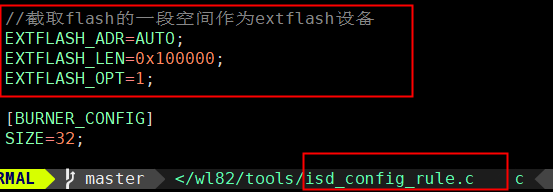

**2. 配置LittleFs接入的块设备信息**

注意block_size需要和extflash.c -> EXTFLASH_BLOCK_SIZE保持一致如下图：

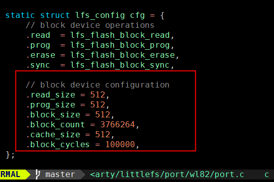

**3. 在对应板级文件中的设备列表添加extflash信息**

如下图：

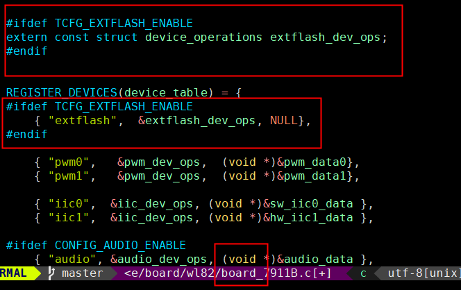

**4. 在app_config.h文件中使能以下宏**

如下图：

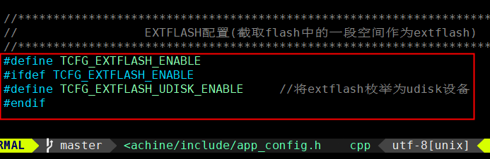

**5. extflash将被枚举为udisk**

以便于LittleFS Explorer访问；udisk上线后，需要限制小机访问extflash，否则数据将被篡改，如下图：

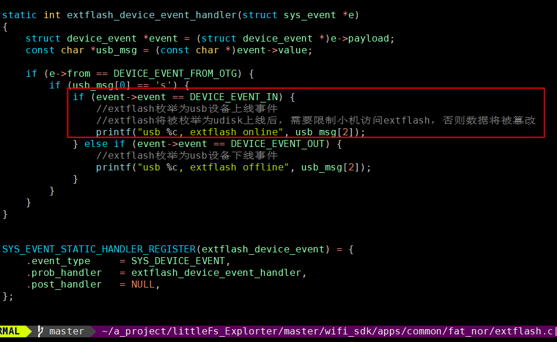

## 10.6.3. 使用示例

**1. 在小机端，通过LittleFs文件系统访问flash**

示例lfs_test.c -> lfs_to_flash_test.c，此示例将创建一个test.txt文件。

**2. 在Windows端，通过LittleFS Explorer访问/浏览/编辑flash中的内容**

将小机usb接入电脑，Windows资源管理器不能识别LittleFs，因此会提示"设备包含未识别文件系统"，并要求格式化；忽略这些提示，以管理员身份运行LittleFS Explorer，找到对应的盘符，即可看到刚刚创建的test.txt文件。新增文件直接拖入LittleFS Explorer即可。

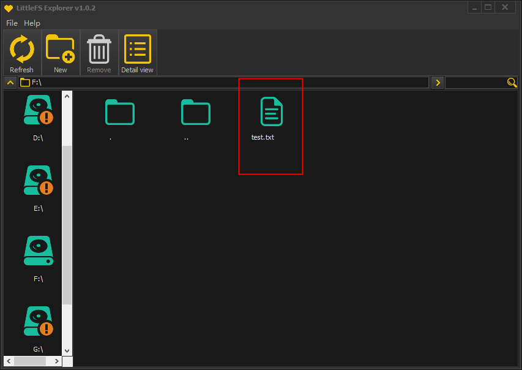

## 10.6.4. 常见问题

NULL
