# 2. 外设部分

# 2.1. ADC

## 2.1.1. Overview

本文仅介绍常规ADC，不包括Audio ADC。

AC792N的ADC精度为10bit，其时钟最大不可超过1MHz。有 `16个IO AD采样通道`，ADC还可以直接对芯片内部的部分PMU电源电压进行采样。

**示例工程：** 可在 `demo_hello`工程中的 `apps/demo/demo_hello/include/app_config.h`中打开 `USE_ADC_TEST_DEMO`宏测试。

**例程路径：**`apps/common/example/peripheral/adc/adc_test.c`

## 2.1.2. 采样值与电压转换

**ADC采样值与电压的转换公式：**

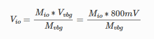

其中，Vio -> AD脚电压；Vvbg -> VBG电压；Mio -> AD脚采样值； Mvbg -> VBG采样值。Vvbg为芯片内部基准参考电压，固定为800mV。Mio和 Mvbg都可以通过ADC采样获得，因此可以求得AD脚的电压值。

**ADC采样电压值误差**：正常用户拿到的芯片都已经Trim过，Trim过程会将芯片内部参考电压 `VBG (800mV)`的电压误差控制在 `±7.5mV`内。以AD脚输入电压3200mV为例，这时理论上芯片AD采样获得的电压的误差值应在 `3200/800*7.5=30mV`以内，AD脚输入的电压值越高，误差值越大。

**满幅电压**：VDDIO的电压采样值恒为 `0x3FF(1024)`。

**如何确定Vvbg电压是否Trim准确**？通过前面的原理介绍，我们可以知道VDDIO的电压其实与Vvbg的电压是成比例关系的：

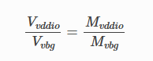

Vvddio可以直接通过仪表直接量得，且Mvddio固定为 `0x3FF(1024)`，而Mvbg可通过AD采样获得，从而可以计算出Vvbg。Vvbg与800mV的差值即为实际的Vvbg误差值，该误差值应该在 `±7.5mV`以内。

## 2.1.3. 可选通道

### 2.1.3.1. 16个IO采样通道如下(参考 `adc_api.h`)：

```
typedef enum {
    ADC_IO_CH_PD00,
    ADC_IO_CH_PD01,
    ADC_IO_CH_PD06,
    ADC_IO_CH_PD07,
    ADC_IO_CH_PD08,
    ADC_IO_CH_PD09,
    ADC_IO_CH_PD10,
    ADC_IO_CH_PE04,
    ADC_IO_CH_PE05,
    ADC_IO_CH_PE06,
    ADC_IO_CH_PE07,
    ADC_IO_CH_PE08,
    ADC_IO_CH_PE09,
    ADC_IO_CH_PC13,
    ADC_IO_CH_DP,
    ADC_IO_CH_DM,
    ADC_IO_CH_MAX, ///< 无用
} adc_io_ch_t;
```

### 2.1.3.2. 支持ADC采样的PMU电源如下(参考 `adc_api.h`)：

```
#define ADC_PMU_CH_VBG      (0x0 | (ADC_PMU_CH << 16))
#define ADC_PMU_CH_VDC14    (0x1 | (ADC_PMU_CH << 16))
#define ADC_PMU_CH_SYSVDD   (0x2 | (ADC_PMU_CH << 16))
#define ADC_PMU_CH_VTEMP    (0x3 | (ADC_PMU_CH << 16))
#define ADC_PMU_CH_WVDD     (0x4 | (ADC_PMU_CH << 16))
#define ADC_PMU_CH_VBAT     (0x5 | (ADC_PMU_CH << 16)) ///< 1/4 vbat电压
```

注意，选择 `ADC_PMU_CH_VBAT`返回的是四分之一的VBAT电压。

## 2.1.4. 使用流程

### 2.1.4.1. 一般使用流程

`ADC初始化` -> `配置IO为模拟输入`-> `添加扫描通道` -> `获取采样值`。

**初始化**：调用 `adc_init()`即可。不过一般SDK工程已经在 `board_xxx.c`中的 `board_init()`已经调用过，这时就无须再重复初始化。`adc_init()`除了对ADC进初始化，还会添加一个2ms的定时器，对已经添加的扫描通道轮流进行采样（每次中断只采样其中一个通道），也因此对于刚添加的扫描通道，需要一定延时才能正确获取到AD值。

**配置IO状态：**设置AD脚的IO状态为模拟输入，并可根据需要开启内部上拉/下拉电阻(阻值请参考具体芯片型号的datasheet)，不过由于内部上下拉电阻阻值偏差较大，不建议用在精度要求高的场景。

```
gpio_set_direction(IO_PORTD_00, 1);     //方向设为输入

// gpio_set_pull_up(IO_PORTD_00, 1);    //设置内部上拉10K
// gpio_set_pull_down(IO_PORTD_00, 1);  //设置内部下拉10K
```

**添加扫描通道** ：支持的采样通道参考前面<可选通道>章节。

```
adc_add_sample_ch(ADC_IO_CH_PD00);
```

**获取采样值：**

```
unsigned int adc_val = adc_get_value(ADC_IO_CH_PD00);  //获取AD采样值
unsigned int io_vol = adc_get_voltage(ADC_IO_CH_PD00); //获取AD采样电压
```

### 2.1.4.2. 立即获取AD值

如果不想常规方式延时等待定时器获取AD值，需要ADC立即对指定通道进行采样，可调用下面的接口：

```
/**

 * @brief adc_get_value_blocking, 阻塞式采集一个指定通道的adc原始值

 * @param ch : ADC通道号

 * @return 当前通道的AD值

*/

u32 adc_get_value_blocking(u32 ch);


/**

 * @brief adc_get_voltage_blocking, 阻塞式采集一个指定通道的电压值（经过均值滤波处理）

 * @param ch : ADC通道号

 * @return 转换后的电压值，单位mv

*/

u32 adc_get_voltage_blocking(u32 ch);
```

## 2.1.5. 常见问题说明

- 添加测量通道之后，不能马上去读取ADC值，需要延时一段时间（原因参考 `初始化` 的描述）。
- 电压测量范围是 `0 ~ VDDIO`，对应AD值为 `0x000 ~ 0x3FF`。
- 由于误差累积是线性的，VBG电压存在误差，比如误差值5mv，那么每800mV电压，会增加5mV误差，用户可以据此自行估计所测的误差范围。

## 2.1.6. API参考

**AD channel define**

ADC_PMU_CH_VBG
ADC_PMU_CH_VDC14
ADC_PMU_CH_SYSVDD
ADC_PMU_CH_VTEMP
ADC_PMU_CH_WVDD
ADC_PMU_CH_VBAT
ADC_PMU_CH_LDO5V
AD_AUDIO_CH_VCM
AD_AUDIO_CH_VOUTL
AD_AUDIO_CH_VOUTR
AD_AUDIO_CH_DACVDD

**enum adc_io_ch_t**
*Values:*
enumerator ADC_IO_CH_PD00
enumerator ADC_IO_CH_PD01
enumerator ADC_IO_CH_PD06
enumerator ADC_IO_CH_PD07
enumerator ADC_IO_CH_PD08
enumerator ADC_IO_CH_PD09
enumerator ADC_IO_CH_PD10
enumerator ADC_IO_CH_PE04
enumerator ADC_IO_CH_PE05
enumerator ADC_IO_CH_PE06
enumerator ADC_IO_CH_PE07
enumerator ADC_IO_CH_PE08
enumerator ADC_IO_CH_PE09
enumerator ADC_IO_CH_PC13
enumerator ADC_IO_CH_DP
enumerator ADC_IO_CH_DM
enumerator ADC_IO_CH_MAX

**void adc_init(void)**
	adc_init, adc初始化

**void adc_suspend(void)**
	adc_suspend, adc检测挂起

**void adc_resume(void)**
	adc_resume, adc检测恢复

**u32 adc_get_value(u32 ch)**
	adc_get_value, 从队列中获取adc通道测得的数值
**Parameters:** ch – : ADC通道号
**Returns:** 当前通道的AD值

**u32 adc_add_sample_ch(u32 ch)**
	adc_add_sample_ch, 添加adc采样通道到采样队列中
**Parameters:** ch – : ADC通道号
**Returns:** 当前通道值

**u32 adc_remove_sample_ch(u32 ch)**
	adc_remove_sample_ch, 从采样队列中移除adc采样通道
**Parameters:** ch – : ADC通道号
**Returns:** 当前通道值

**u32 adc_get_voltage(u32 ch)**
	adc_get_voltage, 换算电压的公式函数, 获取adc通道电压值，如果测得与实际不符，则需留意芯片是否trim过，trim值是否正确。
**Parameters:** ch – : ADC通道号
**Returns:** 当前通道的电压值，单位mv

**u32 adc_value_to_voltage(u32 adc_vbg, u32 adc_ch_val)**
	adc_value_to_voltage, 采样值换算电压，如果换算后与实际不符，则需留意芯片是否trim过，trim值是否正确。
**Parameters:**
  adc_vbg – : 基准电压采样值
  adc_ch_val – : 需要转换的通道的AD值
**Returns:** 转换后的电压值，单位mv

**u32 adc_get_value_blocking(u32 ch)**
	adc_get_value_blocking, 阻塞式采集一个指定通道的adc原始值
**Parameters:** ch – : ADC通道号
**Returns:** 当前通道的AD值

**u32 adc_get_voltage_blocking(u32 ch)**
	adc_get_voltage_blocking, 阻塞式采集一个指定通道的电压值（经过均值滤波处理）
**Parameters:** ch – : ADC通道号
**Returns:** 转换后的电压值，单位mv

**u32 adc_sample(u32 ch, u8 block)**
	adc_sample, 启动采样一次
**Note**
内部接口，用户请勿直接使用该接口
**Parameters:**
  ch – : ADC通道号
  block – : 是否堵塞
**Returns:** 堵塞时返回当前通道的AD值，非堵塞时返回上一次测量的AD值

**adc_io_ch_t adc_io2ch(int gpio)**
	adc_io2ch, adc io转换成对应adc通道序号
**Parameters:** gpio – : adc io
**Returns:** 对应通道序号

**Defines**
ADC_MAX_CH

# 2.2. GPIO

## 2.2.1. Overview

本文介绍GPIO(General purpose input/output)。AC792N的IO有如下特性：

- 支持配置强驱电流档位；
- 支持配置内部上/下拉电阻；
- 支持EXTI外部中断(PF、PR和PV口除外)；
- 支持crossbar映射外设模块接口(PF、PR和PV口除外)；
- 支持长按复位(PF和PR口除外)；

| 分类   | IO                                                                    |
| ------ | --------------------------------------------------------------------- |
| 普通IO | PA00~PA15、PB00~PB15、PC00~PC13、PD00~PD15、PE00~PE15               |
| 特殊IO | PF00~PF05、PR00和PR01、PV00和PV01、FUSB_DM和FUSB_DP、HUSB_DM和HUSB_DP |

**示例工程：** 可在 `demo_hello` 工程中的 `apps/demo/demo_hello/include/app_config.h` 中打开 `USE_GPIO_TEST_DEMO` 宏测试。

**例程路径：** `apps/common/example/peripheral/gpio/gpio_test.c`

## 2.2.2. GPIO特性

### 2.2.2.1. 内部上/下拉电阻

AC792N的IO内部上/下拉阻值精度±20%

- 内部上拉电阻值

| IO                                                                  | 内部上拉阻值            |
| ------------------------------------------------------------------- | ----------------------- |
| PA00~PA15、PB00~PB15、PC00~PC13、PD00~PD15、PE00~PE15、PF00~PF05 | 10K                     |
| HUSBDP                                                              | 1.5K(PU=1)、 1K(PU=2/3) |
| FUSBDP                                                              | 1.5K                    |

- 内部下拉电阻值

| IO                                                                  | 内部下拉阻值 |
| ------------------------------------------------------------------- | ------------ |
| PA00~PA15、PB00~PB15、PC00~PC13、PD00~PD15、PE00~PE15、PF00~PF05 | 10K          |
| HUSBDP、HUSBDM、FUSBDP、FUSBDM                                      | 15K          |

### 2.2.2.2. 电源域

AC792N系列芯片的IO电源域有四个：IOVDD、IOVDD2、IOVDD3、RTCVDD，不同电源域的IO电平可以不一样。

有什么用呢？比如有这种情况，主控IO电平3.3V，而某个外设芯片的IO电平是1.8V，两者要通讯，就需要通过电平转换电路才能接到一起。主控有了多个电源域，那就可以实现一部分IO电平3.3V，一部分电平1.8V，从而省去电平转换电路。将IOVDD2电源供电1.8V，那么PE10~PE15的IO高电平为1.8V，这部分IO就可以直连到电平为1.8V的外设芯片上了。

需要注意的是，不同封装，4个电源域供电口不一定会全部拉出来，尤其是IOVDD2和IOVDD3。没有拉出来的电源域供电口一般会在芯片封装内部直连到IOVDD。

| 电源域 | IO                                                                                                              |
| ------ | --------------------------------------------------------------------------------------------------------------- |
| IOVDD  | PA12~PA15、PB00~PB15、PC00~PC13、PD00~PD15、PE00~PE09、PF00~PF05、HUSBDP、HUSBDM、FUSBDP、FUSBDM、PV00和PV01 |
| IOVDD2 | PE10~PE15                                                                                                       |
| IOVDD3 | PA00~PA11                                                                                                       |
| RTCVDD | PR00和PR01                                                                                                      |

### 2.2.2.3. MCLR

PD08脚有一个特殊的功能，MCLR复位输入。 **MCLR低电平复位，可软件关闭** （当然，得保证芯片能跑到关闭MCLR的代码前不复位）。该引脚在进行IO分配时需要特别注意。该引脚上电默认上拉。

```c
p33_or_1byte(P3_PR_PWR, BIT(3)); ///< 开启MCLR
p33_and_1byte(P3_PR_PWR, (u8)~(BIT(3))); ///< 关闭MCLR
```

### 2.2.2.4. 长按复位

除了PF和PR口以外的IO支持映射 `长按复位`，即IO处于低/高电平状态N秒后系统复位。参数可配：

- 有效电平可配：0低电平、1高电平。比如配置为0时，当该引脚被拉到低电平N秒后，系统复位。
- 长按复位时间可配：1S、2S、4S、8S、16S。
- 复位释放时刻配置：timeout后，立刻释放系统 或者 等待复位IO恢复后释放系统。

**注意事项：**

1. IO_PORTD_01芯片硬件上默认开启长按复位功能。
2. IO_PORTD_01的配置支持上锁，该IO使用本接口使能长按复位功能后，DIE、DIEH、PU、PD、DIR等配置将锁死，需要断电后才能解锁。该功能能够避免程序跑飞后误修改长按复位配置，其它IO则无此上锁功能。
3. 按键功能需要复用长按复位时，应在key初始化完成后再设置长按复位，即 `gpio_longpress_pin0_reset_config()` 应在 `key_driver_init()` 之后调用。这是由于按键功能初始化会影响到长按复位的配置，因此有顺序要求。

**配置接口：**

```c
/* ------------------------------------------------------------------------------------*/
/**
 * @brief gpio_longpress_pin0_reset_config
 *
 * @Params pin          映射的IO（除了PF和PR口以外的IO）。
 * @Params level        只能是0或1。0-低电平，1-高电平。
 * @Params time         只能是0/1/2/4/8/16，其中，参数为0时，表示关闭长按复位功能。
 * @Params release      只能是0或1。0-等待复位IO恢复后释放系统，1-立刻释放系统。
 * @Params pull_enable  上/下拉使能。非0-使能。level为0时，IO被配置为上拉；level为1时，IO被配置为下拉。
 *
 * @note  IO_PORTD_01芯片硬件上默认开启长按复位功能。
 * @note  IO_PORTD_01较特殊，该IO使用本接口使能长按复位功能后，DIE、DIEH、PU、PD、DIR等配置将锁死，需要断电后才能解锁。该功能能够避免程序跑飞后误修改长按复位配置，其它IO则无此锁存功能。
 */
/* ------------------------------------------------------------------------------------*/
void gpio_longpress_pin0_reset_config(u32 pin, u32 level, u32 time, u32 release, u32 pull_enable);
```

### 2.2.2.5. EXTI外部中断

AC792N的IO支持EXTI外部中断，PF、PR和PV口除外。API接口：

```c
// exti.h

/**
 * @brief 注册外部中断
 *
 * @param gpio 参考宏IO_PORTx_xx，如IO_PORTA_00
 * @param edge 触发边沿
 * @param callback_in_irq 中断回调函数
 * @param priv 中断回调函数的私有指针
 *
 * @return 非负数: 注册成功的外部中断序号  负值: 参数有误注册失败
 */
int exti_init(unsigned int gpio, trigger_edge_t edge, void (*callback_in_irq)(void *priv, unsigned int gpio), void *priv);


/**
 * @brief 卸载外部中断
 *
 * @param index 注册时返回的外部中断序号
 *
 * @return 0: 成功  负值: 失败
 */
int exti_uninit(int index);
```

`exti_init()` 接口中传入的edge参数不同，IO会被配置为不同的上/下拉输入状态：

- EDGE_POSITIVE，上升沿触发中断，对应IO会被配置为下拉输入。
- EDGE_NEGATIVE，下降沿触发中断，对应IO会被配置为上拉输入。

## 2.2.3. 特殊IO

### 2.2.3.1. PV口

PV口可作IO，也是两个内部LDO的输出口。

- PV00：AVDD28内部LDO输出口。
- PV01：AVDD18内部LDO输出口。

作为IO使用时的api接口如下：

```c
// avdd_config.h

/**
 * @brief 设置PV口的方向
 * @param gpio 参考宏IO_PORT_PV_0X
 * @param dir 1: 输入       0: 输出
 * @return 0: 成功  非0: 失败
 */
int avdd_port_pv_dir(int port, u8 dir);


/**
 * @brief 获取PV口输入电平
 * @param gpio 参考宏IO_PORT_PV_0X
 * @return 0: 低电平  1: 高电平
 */
int avdd_port_pv_read(int port);


/**
 * @brief 设置PV口的输出电平
 * @param gpio 参考宏IO_PORT_PV_0X
 * @param on 1: 高电平       0: 低电平
 * @return 0: 成功  非0: 失败
 */
int avdd_port_pv_out(int port, u8 on);


/**
 * @brief 设置PV口的强驱
 * @param gpio 参考宏IO_PORT_PV_0X
 * @param on 1: 打开       0: 关闭
 * @return 0: 成功  非0: 失败
 */
int avdd_port_pv_hd(int port, u8 on);


/**
 * @brief 设置PV口的上拉电阻
 * @param gpio 参考宏IO_PORT_PV_0X
 * @param on 1: 打开       0: 关闭
 * @return 0: 成功  非0: 失败
 */
int avdd_port_pv_pu(int port, u8 on);


/**
 * @brief 设置PV口的下拉电阻
 * @param gpio 参考宏IO_PORT_PV_0X
 * @param on 1: 打开       0: 关闭
 * @return 0: 成功  非0: 失败
 */
int avdd_port_pv_pd(int port, u8 on);


/**
 * @brief 设置PV口的数字输入功能
 * @param gpio 参考宏IO_PORT_PV_0X
 * @param on 1: 打开       0: 关闭
 * @return 0: 成功  非0: 失败
 */
int avdd_port_pv_die(int port, u8 on);
```

### 2.2.3.2. PR口

PR口属于RTC模块的IO，可被配置为RTC的晶振脚 或 IO使用。作为IO使用时的api接口如下：

```c
// rtc.h


/**
 * @brief 设置PR口的方向
 * @param gpio  参考宏IO_PORT_PR_0X
 * @param dir   1: 输入  0: 输出
 * @return      0: 成功  非0: 失败
 */
int rtc_port_pr_dir(int port, u8 dir);


/**
 * @brief 获取PR口输入电平
 * @param gpio 参考宏IO_PORT_PR_0X
 * @return 0: 低电平  1: 高电平
 */
int rtc_port_pr_read(int port);


/**
 * @brief 设置PR口的输出电平
 * @param gpio 参考宏IO_PORT_PR_0X
 * @param on 1: 高电平       0: 低电平
 * @return 0: 成功  非0: 失败
 */
int rtc_port_pr_out(int port, u8 on);


/**
 * @brief 设置PR口的强驱
 * @param gpio 参考宏IO_PORT_PR_0X
 * @param on 1: 打开       0: 关闭
 * @return 0: 成功  非0: 失败
 */
int rtc_port_pr_hd(int port, u8 on);


/**
 * @brief 设置PR口的上拉电阻
 * @param gpio 参考宏IO_PORT_PR_0X
 * @param on 1: 打开       0: 关闭
 * @return 0: 成功  非0: 失败
 */
int rtc_port_pr_pu(int port, u8 on);


/**
 * @brief 设置PR口的下拉电阻
 * @param gpio 参考宏IO_PORT_PR_0X
 * @param on 1: 打开       0: 关闭
 * @return 0: 成功  非0: 失败
 */
int rtc_port_pr_pd(int port, u8 on);


/**
 * @brief 设置PR口的数字输入功能
 * @param gpio 参考宏IO_PORT_PR_0X
 * @param on 1: 打开       0: 关闭
 * @return 0: 成功  非0: 失败
 */
int rtc_port_pr_die(int port, u8 on);
```

### 2.2.3.3. USB_IO

AC792N有两个USB口，对应的DP和DM脚在非USB模式下，可以作为IO使用，并且使用的API接口与普通GPIO一样(参考gpio.h)。比如：

SDK驱动中，引脚定义关系如下：

| 引脚    | SDK定义         |
| ------- | --------------- |
| FUSB_DP | IO_PORT_USB_DPA |
| FUSB_DM | IO_PORT_USB_DMA |
| HUSB_DP | IO_PORT_USB_DPB |
| HUSB_DM | IO_PORT_USB_DMB |

即A口对应FUSB，B口对应HUSB。

## 2.2.4. 常见问题说明

- **为什么PD08软件配置为低电平后系统复位？**

  答：PD08开了MCLR功能，低电平复位，可软件关闭该功能。
- **软关机怎么保持IO状态？**

  答：软关机流程中，SDK驱动会统一将所有非保护的IO的配置成高阻态。如果需要保持IO状态，可在在board.c文件中找到 `gpio_config_soft_poweroff()`，并用 `PORT_PROTECT()` 保护IO。

  ```c
  static void gpio_config_soft_poweroff(void)
  {
      PORT_TABLE(g);
      // ...
  #if TCFG_ADKEY_ENABLE
      PORT_PROTECT(adkey_data.adkey_pin);
  #endif

  #if TCFG_LOWPOWER_WAKEUP_PORT0_ENABLE
      PORT_PROTECT(TCFG_LOWPOWER_WAKEUP_PORT0_IO);
  #endif

  #if TCFG_LOWPOWER_WAKEUP_PORT1_ENABLE
      PORT_PROTECT(TCFG_LOWPOWER_WAKEUP_PORT1_IO);
  #endif

  #if TCFG_LOWPOWER_WAKEUP_PORT2_ENABLE
      PORT_PROTECT(TCFG_LOWPOWER_WAKEUP_PORT2_IO);
  #endif
      // ...
      __port_init((u32)gpio_config);
  }
  ```
- **__gpio和gpio接口有什么不同？**

  答：两套接口函数实现的功能是一样的，只是 `gpio` 的这套接口在操作寄存器的时候都上了锁，确保操作时不会影响到同组引脚。 如果同一组引脚之间没有互斥，针对用户有高速度要求，并且不需要考虑同一组引脚之间操作互斥推荐使用 `__gpio` 这套api.

## 2.2.5. API参考

**Functions**

**void gpio_port_lock(unsigned int port)**
	gpio_port_lock，自旋锁，即不能被另一个cpu打断，也不能被中断打断
**Parameters:** port – 参考宏GPIO2PORT(IO_PORTx_xx)，如GPIO2PORT(IO_PORTA_00)

**void gpio_port_unlock(unsigned int port)**
	gpio_port_unlock，解除自旋锁
**Parameters:** port – 参考宏GPIO2PORT(IO_PORTx_xx)，如GPIO2PORT(IO_PORTA_00)

**int gpio_direction_input(unsigned int gpio)**
	gpio_direction_input，将引脚直接设为输入模式
**Parameters:** gpio – 参考宏IO_PORTx_xx，如IO_PORTA_00
**Returns:** 0：成功 非0：失败

**int gpio_direction_output(unsigned int gpio, int value)**
	gpio_direction_output，设置引脚的方向为输出，并设置一下电平
**Parameters:**
  gpio – 参考宏IO_PORTx_xx，如IO_PORTA_00
  value – 1：输出高电平， 0：输出低电平
**Returns:** 0：成功 非0：失败

**int gpio_set_pull_up(unsigned int gpio, gpio_pull_up_mode_t mode)**
	gpio_set_pull_up，设置引脚的上拉电阻等级
**Parameters:**
  gpio – 参考宏IO_PORTx_xx，如IO_PORTA_00
  mode – gpio_pull_up_mode_t
**Returns:** 0：成功 非0：失败

**int gpio_set_pull_down(unsigned int gpio, gpio_pull_down_mode_t mode)**
	gpio_set_pull_down，设置引脚的下拉电阻等级
**Parameters:**
  gpio – 参考宏IO_PORTx_xx，如IO_PORTA_00
  mode – gpio_pull_down_mode_t
**Returns:** 0：成功 非0：失败

**int gpio_set_hd(unsigned int gpio, gpio_drive_strength_t mode)**
	gpio_set_hd, 设置引脚的强驱等级
**Parameters:**
  gpio – 参考宏IO_PORTx_xx，如IO_PORTA_00
  mode – gpio_drive_strength_t
**Returns:** 0：成功 非0：失败

**int gpio_set_die(unsigned int gpio, int value)**
	gpio_set_die，设置引脚为数字功能还是模拟功能，比如引脚作为ADC的模拟输入，则die要置0
**Parameters:**
  gpio – 参考宏IO_PORTx_xx，如IO_PORTA_00
  value – 1：数字输入功能 0：跟电压相关的模拟功能
**Returns:** 0：成功 非0：失败

**int gpio_set_dieh(unsigned int gpio, int value)**
	gpio_set_dieh，设置引脚P33输入功能
**Parameters:**
  gpio – 参考宏IO_PORTx_xx，如IO_PORTA_00
  dir – 1：打开 0：关闭
**Returns:** 0：成功 非0：失败

**int gpio_set_direction(unsigned int gpio, unsigned int dir)**
	gpio_set_direction，设置引脚方向
**Parameters:**
  gpio – 参考宏IO_PORTx_xx，如IO_PORTA_00
  dir – 1：输入 0：输出
**Returns:** 0：成功 非0：失败

**int gpio_read(unsigned int gpio)**
	gpio_read，读取引脚的输入电平，引脚为数字输入模式时才有效
**Parameters:** gpio – 参考宏IO_PORTx_xx，如IO_PORTA_00
**Returns:** 电平值

**int gpio_set_spl(unsigned int gpio, int keep)**
	gpio_set_spl，设置引脚输出时是否维持上下拉电阻
**Parameters:**
  gpio – 参考宏IO_PORTx_xx，如IO_PORTA_00
  keep – 1：维持 0：不维持
**Returns:** 0：成功 非0：失败

**int gpio_set_mode(unsigned int gpio, gpio_mode_t mode)**
	gpio_set_mode，设置引脚工作模式
**Parameters:**
  gpio – 参考宏IO_PORTx_xx，如IO_PORTA_00
  mode – gpio_mode_t
**Returns:** 0：成功 非0：失败

**int gpio_enable_function(unsigned int gpio, gpio_function_t fn, int io_init)**
	gpio_enable_function，打开引脚映射功能
**Parameters:**
  gpio – 参考宏IO_PORTx_xx，如IO_PORTA_00
  fn – gpio_function_t
  io_init – 是否使用映射功能的默认IO初始化状态
**Returns:** 0：成功 非0：失败

**int gpio_disable_function(unsigned int gpio, gpio_function_t fn, int io_uninit)**
	gpio_disable_function，关闭引脚映射功能
**Parameters:**
  gpio – 参考宏IO_PORTx_xx，如IO_PORTA_00
  fn – gpio_function_t
  io_uninit – 是否还原IO的初始状态（输入高阻）
**Returns:** 0：成功 非0：失败

**void usb_iomode(unsigned char usb_id, int enable)**
	usb_iomode, usb引脚设为普通IO
**Parameters:**
  usb_id – usb名称号，0是usb0，1是usb1
  enable – 1：使能；0：关闭

**void gpio_latch_en(unsigned int gpio, int enable)**
	gpio_latch_en，锁定引脚状态，解锁前IO电平状态不会再改变
**Parameters:**
  gpio – 参考宏IO_PORTx_xx，如IO_PORTA_00
  enable – 1：锁定；0：解锁

# 2.3. UART_SPEC

## 2.3.1. UART参数配置

**1.配置结构体**

`uart_platform_data` 结构体

```c
struct uart_platform_data {
    u8 irq;                         ///< 中断号，在注册的时候已经对应设置好了
    u8 flow_ctl_enable;             ///< 1:使能串口流控
    u8 rts_hw_enable;               ///< 1:使能硬件RTS
    u8 rts_idle_level;              ///< 0:RTS空闲电平为低; 1:RTS空闲电平为高
    u8 cts_idle_level;              ///< 0:CTS空闲电平为低; 1:CTS空闲电平为高
    u8 rx_thresh;                   ///< 接收BUF触发流控的比值0-100
    u8 disable_tx_irq;              ///< 1:不使用发送中断
    u8 disable_rx_irq;              ///< 1:不使用中断接收
    u8 disable_ot_irq;              ///< 1:不使用超时中断
    int tx_pin;                     ///< 发送引脚，不配置需设置-1
    int rx_pin;                     ///< 接收引脚，不配置需设置-1
    int rts_pin;                    ///< 串口控制流RTS脚，不配置需设置-1
    int cts_pin;                    ///< 串口控制流CTS脚，不配置需设置-1
    int flags;                      ///< 串口用作打印
    u32 baudrate;                   ///< 波特率设置。理论范围：CLK/3 ~ CLK/4/(0xFFFF+1) -> CLK/3 ~ CLK/262144
    u32 max_continue_recv_cnt;      ///< 连续接收最大字节，范围：0 ~ 0xFFFFFFFF */
    u32 idle_sys_clk_cnt;           ///< 超时计数器。在指定时间里没有收到数据，则产生超时中断，范围：0 ~ 0xFFFFFFFF
    UART_PARITY parity;             ///< 奇偶校验位。可选：UART_PARITY_DISABLE、UART_PARITY_EVEN、UART_PARITY_ODD
    GPIO_DRIVE_STRENGTH tx_pin_hd_level; ///< tx io开强驱等级。可选GPIO_DRIVE_STRENGTH_1p8mA/6p0mA/20p0mA/24p0mA
};
```

- **流控使能 `flow_ctl_enable`**

使能串口流控功能。使能后，驱动会初始化流控相关的配置，用户才可以使用流控相关的命令。`flow_ctl_enable` 使能情况下 `rts_hw_enable`、`rts_idle_level`、`cts_idle_level`、`rx_thresh`、`rts_pin`、`cts_pin` 才有效。仅UART1和UART2支持流控功能。

- **硬件RTS流控使能 `rts_hw_enable`**

RTS流控功能分硬件和软件，模块控制器本身支持的硬件流控，软件RTS流控由驱动直接控制IO脚电平实现。软件流控没有硬件流控的对RTS脚状态的实时性高。软件流控实时性不行，需要在数据空间满之前，提前对RTS脚操作，因此有了 `rx_thresh`。仅UART1和UART2支持流控功能。

- **软件RTS自动流控阈值 `rx_thresh`**

软件RTS阈值，单位-%。比如 `rx_thresh = 80`，循环BUF大小1000，那么当接收到的数据达到1000 * 80% = 800的时候，驱动开始控制RTS脚状态为busy。

- **DMA最大连续接收数量 `max_continue_recv_cnt`**

DMA连续接收一次最大数量。该参数须小于等于循环BUF的长度，否则。当接收数据达到 `max_continue_recv_cnt` 后，会起RX中断(如果有配置中断回调，回调函数收到 `UART_IRQ_EVENT_RX`)。

在开启硬件流控的情况下，RX接收到数据一旦等于该值，RTS脚状态将变为busy。

- **超时计数 `idle_sys_clk_cnt`**

超时计数器。开始接收数据后，经过 `idle_sys_clk_cnt` 个时钟(串口baud)后没有再收到数据，则触发超时，中断回调函数收到 `UART_IRQ_EVENT_OT`。可用于分包判断。

- **奇偶校验 `parity`**

| 配置                | 功能         |
| ------------------- | ------------ |
| UART_PARITY_DISABLE | 关闭奇偶校验 |
| UART_PARITY_EVEN    | 偶校验       |
| UART_PARITY_ODD     | 奇校验       |

可配参数见 `uart_parity_t` 结构体。当接收到数据接口校验失败，触发中断，中断回调函数收到 `UART_IRQ_EVENT_CHK`。

**配置示例1：常规UART收发**

```c
UART2_PLATFORM_DATA_BEGIN(uart2_data)
    .flow_ctl_enable = 0,                       ///< 关闭流控
    .baudrate = 115200,
    .tx_pin = IO_PORTA_04,
    .rx_pin = IO_PORTA_05,
    .tx_pin_hd_level = GPIO_DRIVE_STRENGTH_6p0mA,
    .max_continue_recv_cnt = 1024,
    .idle_sys_clk_cnt = 500000,
    .parity = UART_PARITY_DISABLE,
UART2_PLATFORM_DATA_END();
```

**配置示例2：开启流控的UART收发**

```c
UART1_PLATFORM_DATA_BEGIN(uart1_data)
    .flow_ctl_enable = 1,                       ///< 开启流控
    .rts_hw_enable = 1,                         ///< 使能硬件流控
    .rts_pin = IO_PORTA_01,
    .cts_pin = IO_PORTA_02,
    .rts_idle_level = 0,                        ///< RTS空闲时低电平
    .cts_idle_level = 0,                        ///< CTS空闲时低电平
    // .rx_thresh = 80,                         ///< 如果rts_hw_enable为0，即软件流控，需要配置该参数
    .baudrate = 115200,
    .tx_pin = IO_PORTA_06,
    .rx_pin = IO_PORTA_07,
    .tx_pin_hd_level = GPIO_DRIVE_STRENGTH_6p0mA,
    .max_continue_recv_cnt = 1024,
    .idle_sys_clk_cnt = 500000,
    .parity = UART_PARITY_DISABLE,
UART1_PLATFORM_DATA_END();
```

**2.注册设备**

在 `REGISTER_DEVICES(device_table) = {    };` 中添加注册项。

```c
REGISTER_DEVICES(device_table) = {
    {"uart2", &uart_dev_ops, (void *)&uart2_data },
};
```

## 2.3.2. UART device操作

**1.打开设备**

操作：使用 `dev_open()` 打开设备。如果open设备时，传入了 `uart_platform_data` 类型的配置参数，那么UART将按照传入参数的配置进行初始化。如果传入的参数是 `NULL`，则按照Board中注册的配置进行初始化。

参数：arg0-设备名；arg1-`uart_palform_data` 类型变量的地址。

返回值：打开的设备的句柄。后续其他操作可通过该句柄对该设备进行操作。

注意：如果UART设备被 `dev_open()` 打开多次，那么设备只在第一次打开时执行初始化。

```c
struct uart_palform_data uart_pfdata;          ///< 自定义配置
void *hdl = dev_open("uart1", (u32)&uart_pfdata); ///< 传入配置参数，则按传入的参数初始化UART
void *hdl = dev_open("uart1", NULL);           ///< 传入NULL，则按Board中注册的配置初始化UART
```

**2.关闭设备**

操作：使用 `dev_close()` 关闭设备。

参数：UART设备open时获得的句柄。

返回值：固定为0。

注意：如果设备被 `dev_open()` 打开n次，关闭时则需要执行 `dev_close()` n次才能关闭。

```c
dev_close(hdl);
```

**3.接收数据**

操作：使用 `dev_read(hdl, buf, cnt)` 读取UART收到的数据。该接口将会把UART接收到的数据放入指定的 `buf` 中，放入最多 `cnt` 个数据(如果未配置 `IOCTL_UART_SET_RECV_ALL`，RX只接收到n个数据，且n < cnt，那么 `dev_read()` 将只读回n个数据)。

参数：arg0-设备句柄；arg1-接收数据的buf地址；arg2-一般为buf长度。

返回值：正常为放入指定buf中的数据个数。接收数据异常时会返回异常原因代号 `UART_CIRCULAR_BUFFER_WRITE_OVERLAY(-1)`、`UART_RECV_TIMEOUT(-2)`、`UART_RECV_EXIT(-3)`，分别对应内部循环buf写满出现覆盖、接收数据超时、(执行超时回调后)接收终止退出。

```c
u8 recv_buff[64];
dev_read(hdl, recv_buf, sizeof(recv_buff);
```

**4.发送数据**

操作：使用 `dev_write(hdl, buf, cnt)` 发送数据。该接口会将指定 `buf` 中的 `cnt` 个数据发送出去。

参数：arg0-设备句柄；arg1-发送的数据的buf地址；arg2-发送数据数量。

返回值：发送的数据量，即传入的agr2参数。`buf` 为 `NULL` 或者 `cnt` 为 `0` 时，返回值为0。

注意：如果设置了非阻塞发送，则函数会等待上一次数据发送完成后，才开始发送新数据。

```c
u8 send_buf[] = {0x00, 0x11, 0x22, 0x33};
dev_write(hdl, send_buf, sizeof(send_buf));
```

## 2.3.3. UART IOCTL命令

ioctl函数原型：

```c
/**
 * #brief dev_ioctl：用于对设备进行控制和参数的修改
 * @param device 设备句柄
 * @param cmd 设备控制命令
 * @param arg 控制参数
 * @return 0：正常执行完成  -EINVAL(-22):找不到该命令
 */
int dev_ioctl(void *device, int cmd, u32 arg);
```

串口设备的IOCTL命令：

```c
#define UART_MAGIC                          'U'
#define IOCTL_UART_FLUSH                    _IO(UART_MAGIC,1)       ///< 串口重载
#define IOCTL_UART_SET_SEND_BLOCK           _IOW(UART_MAGIC,2,bool) ///< 设置串口发送阻塞
#define IOCTL_UART_SET_RECV_BLOCK           _IOW(UART_MAGIC,3,bool) ///< 设置串口接收阻塞
#define IOCTL_UART_SET_RECV_ALL             _IOW(UART_MAGIC,4,bool) ///< 设置串口等待接收满才退出(但需先使用上一条命令配置UART为阻塞接收)
#define IOCTL_UART_SET_RECV_TIMEOUT         _IOW(UART_MAGIC,5,u32)  ///< 设置串口接收超时
#define IOCTL_UART_SET_RECV_TIMEOUT_CB      _IOW(UART_MAGIC,6,int (*)(void)) ///< 设置串口超时之后的回调函数
#define IOCTL_UART_GET_RECV_CNT             _IOR(UART_MAGIC,7,u32 *) ///< 获取串口循环buf中已接收到未被取走的数据的累计值
#define IOCTL_UART_START                    _IO(UART_MAGIC,8)       ///< 开启串口
#define IOCTL_UART_STOP                     _IO(UART_MAGIC,9)       ///< 暂停串口
#define IOCTL_UART_SET_CIRCULAR_BUFF_ADDR   _IOW(UART_MAGIC,10,u32) ///< 设置串口循环buf地址
#define IOCTL_UART_SET_CIRCULAR_BUFF_LENTH  _IOW(UART_MAGIC,11,u32) ///< 设置串口循环buf长度
#define IOCTL_UART_SET_BAUDRATE             _IOW(UART_MAGIC,12,u32) ///< 串口运行过程中修改波特率
#define IOCTL_UART_FLOW_CTL_RTS_SUSPEND     _IO(UART_MAGIC,13)      ///< 串口控制流挂起
#define IOCTL_UART_FLOW_CTL_RTS_RESUME      _IO(UART_MAGIC,14)      ///< 串口控制流恢复
#define IOCTL_UART_SET_IRQ_EVENT_CB         _IOW(UART_MAGIC,15,void (*)(UART_IRQ_EVENT)) ///< 设置中断事件回调函数
```

**1.IOCTL_UART_FLUSH**

功能：串口重载。函数会清除UART的pending、循环buf数据，恢复初始启动状态。

参数：无作用。

```c
dev_ioctl(hdl, IOCTL_UART_FLUSH, 0);
```

**2.IOCTL_UART_SET_SEND_BLOCK**

功能：设置串口是否以阻塞的方式发送数据。使能时，`dev_write()` 函数中会调用 `os_sem_pend()` 阻塞线程。

参数： 0 - 关闭；1 - 使能。模块默认初始化为1。

```c
dev_ioctl(hdl, IOCTL_UART_SET_SEND_BLOCK, 0);///< 关闭
dev_ioctl(hdl, IOCTL_UART_SET_SEND_BLOCK, 1);///< 使能
```

**3.IOCTL_UART_SET_RECV_BLOCK**

功能：设置串口是否以阻塞的方式接收数据。使能时，`dev_read()` 函数中会调用 `os_sem_pend()` 阻塞线程。如果未使用 `IOCTL_UART_SET_RECV_TIMEOUT` 命令设置timeout时间，则默认没有超时限制，那么 `dev_read()` 会死等接收到数据后才退出。

参数： 0 - 关闭；1 - 使能。默认为0。

```c
dev_ioctl(hdl, IOCTL_UART_SET_RECV_BLOCK, 0);///< 关闭
dev_ioctl(hdl, IOCTL_UART_SET_RECV_BLOCK, 1);///< 使能
```

**4.IOCTL_UART_SET_RECV_ALL**

功能：设置串口是否等待接收满才退出。比如，我们提供一个10 Byte长度的 `buf` 给 `dev_read(hdl, buf, 10)` 用于读取uart接收到的数据，而串口只收到5 Byte数据，那么 `dev_read()` 函数将只返回5 Byte数据；而如果使能了 `IOCTL_UART_SET_RECV_ALL`，`dev_read()` 将继续等待，直到接收到完整10 Byte数据后才返回。

参数： 0 - 关闭；1 - 使能。

注意：该命令需要先使能了 `IOCTL_UART_SET_RECV_BLOCK` 才有效。

```c
dev_ioctl(hdl, IOCTL_UART_SET_RECV_ALL, 0);///< 关闭
dev_ioctl(hdl, IOCTL_UART_SET_RECV_ALL, 1);///< 使能
```

**5.IOCTL_UART_SET_RECV_TIMEOUT**

功能：设置串口接收超时时间。

参数：超时时间，单位ms，可设置范围0~0xFFFFFFFF。若设置为0，则没有超时限制。

注意：该命令需要配置 `IOCTL_UART_SET_RECV_BLOCK` 才有效，而且与 `IOCTL_UART_SET_RECV_BLOCK` 没有设置顺序要求。

```c
dev_ioctl(hdl, IOCTL_UART_SET_RECV_TIMEOUT, 1000);
```

**6.IOCTL_UART_SET_RECV_TIMEOUT_CB**

功能：设置串口接收超时回调函数，`dev_read()` 读取数据出现超时时会调用该函数。

参数：超时回调函数地址。回调函数参数应为 `void` 类型，返回值为 `int` 类型。

注意：超时回调函数在 `dev_read()` 中执行，回调函数返回值会影响 `dev_read()` 的返回值：超时回调函数返回非0值，则 `dev_read()` 返回 `UART_RECV_EXIT(-3)`，否则返回 `UART_RECV_TIMEOUT(-2)`。

```c
int timeout_cb(void) {
    printf("I am timeout callback\n");
    return 1;
}
dev_ioctl(hdl, IOCTL_UART_SET_RECV_TIMEOUT_CB, (u32)&timeout_cb);
```

**7.IOCTL_UART_GET_RECV_CNT**

功能：获取串口循环buf中已接收到未被取走的数据的累计值。

参数：存放计数值的地址。

```c
u32 recv_cnt = 0;
dev_ioctl(hdl, IOCTL_UART_GET_RECV_CNT, (u32)&recv_cnt);
printf("UART receive data count:%u\n", recv_cnt);
```

**8.IOCTL_UART_START**

功能：开启串口。驱动会打开UART 模块RX开关。如果使能流控并配置了RTS，该命令还会设置RTS为idle状态。

参数：无作用。

```c
dev_ioctl(hdl, IOCTL_UART_START, 0);
```

**9.IOCTL_UART_STOP**

功能：串口停止。驱动关闭UART模块TX、RX开关，执行flush操作。如果使能流控并配置了RTS，该命令还会设置RTS为busy状态。

参数：无作用。

```c
dev_ioctl(hdl, IOCTL_UART_STOP, 0);
```

**10.IOCTL_UART_SET_CIRCULAR_BUFF_ADDR**

功能：设置串口循环buf地址。

参数：循环buf地址。

注意：a.循环buf地址空间必须要4字节对齐；b.驱动接收使用了dma，因此uart使用前须配置循环buf空间，否则会出现异常复位；c.该命令须与 `IOCTL_UART_SET_CIRCULAR_BUFF_LENTH` 命令配合使用，只配置buf地址，不配置buf长度的话，当uart模块收到数据时会报错 ：RP UART0_CIRCULAR_BUFFER_WRITE_OVERLAY。

```c
u8 recv_buf[64] __attribute__((aligned(4)));
dev_ioctl(hdl, IOCTL_UART_SET_CIRCULAR_BUFF_ADDR, (u32)recv_buf);
```

**11.IOCTL_UART_SET_CIRCULAR_BUFF_LENTH**

功能：设置串口循环buf长度。

参数：循环buf长度。

注意：该命令须与 `IOCTL_UART_SET_CIRCULAR_BUFF_ADDR` 命令配合使用。

```c
dev_ioctl(hdl, IOCTL_UART_SET_CIRCULAR_BUFF_LENTH, sizeof(recv_buf));
```

**12.IOCTL_UART_SET_BAUDRATE**

功能：修改串口波特率。`dev_open("uart2", NULL)` 后，uart波特率会初始化为board.c文件中配置值。该命令可在 `dev_open()` 串口后修改波特率。

参数：要设置的波特率。

注意：使用该命令修改波特率时，驱动会暂时关闭串口收发功能，清pending，并清空循环buf数据，使串口恢复初始状态。建议修改波特率前将内部循环buf的数据读取完后再执行该命令。

```c
dev_ioctl(hdl, IOCTL_UART_SET_BAUDRATE, 115200);
```

**13.IOCTL_UART_FLOW_CTL_RTS_SUSPEND**

功能：串口控制流挂起。串口关闭数据接收，并控制RTS脚，指示本设备未准备好，发送方不要发送数据。

参数：无作用。

注意：AC792N仅UART1和UART2支持硬件流控，该命令仅对这两个串口模块有效。

```c
dev_ioctl(hdl, UART1_FLOW_CTL_RTS_SUSPEND, 0);
```

**14.IOCTL_UART_FLOW_CTL_RTS_RESUME**

功能：串口控制流恢复。串口恢复数据接收，并控制RTS脚，指示本设备准备好了，发送方可以发送数据。

参数：无作用。

注意：AC792N仅UART1和UART2支持硬件流控，该命令仅对这两个串口模块有效。

```c
dev_ioctl(hdl, UART1_FLOW_CTL_RTS_RESUME, 0);
```

**15.IOCTL_UART_SET_IRQ_EVENT_CB**

功能：设置中断事件回调函数。

参数：中断事件回调函数地址。回调函数参数应为 `UART_IRQ_EVENT` 类型，返回值为 `void` 类型。

注意：该回调函数在中断中执行，回调函数程序应简单快速。

```c
void uart_irq_cb(UART_IRQ_EVENT event) {
    if(event == UART_IRQ_EVENT_TX)printf("I am UART_IRQ_EVENT_TX\n");
    else if(event == UART_IRQ_EVENT_RX)printf("I am UART_IRQ_EVENT_RX\n");
    else printf("I am %d\n",event);
}
dev_ioctl(hdl, IOCTL_UART_SET_IRQ_EVENT_CB , (u32)&uart_irq_cb);
```

中断事件枚举类型：

```c
typedef enum uart_irq_event {
    UART_IRQ_EVENT_NULL,    ///< 0.无*/
    UART_IRQ_EVENT_TX,      ///< 1.TX pnd*/
    UART_IRQ_EVENT_RX,      ///< 2.RX pnd,当RX DMA连续收到的数据超过RXCNT的设定值时*/
    UART_IRQ_EVENT_OT,      ///< 3.OverTime pnd,当RX DMA收到一包数据后经过OTCNT个CLK后未再收到新数据时*/
    UART_IRQ_EVENT_CTS,     ///< 4.CTS pnd*/
    UART_IRQ_EVENT_CHK,     ///< 5.CHK pnd*/
} UART_IRQ_EVENT;
```

## 2.3.4. 时钟源&波特率

### 2.3.4.1. 时钟源

UART的串口时钟源可选。5组UART使用相同时钟源。可使用 `uart_clk_src_set()` 接口设置时钟源。

| 时钟源  | 描述                                        |
| ------- | ------------------------------------------- |
| STD_48M | STD48M时钟                                  |
| STD_24M | STD24M时钟                                  |
| EXT_CLK | 外部时钟(使用inputchannel映射EXT_CLK到IO口) |
| LSB_CLK | 低速时钟                                    |

```c
/**
 * @brief uart_clk_src_set 设置UART的时钟源。所有UART都是同一个时钟源（包括log）。
 *
 * @Params src 时钟源。可选时钟源见结构体uart_clk_src_t
 * @Params clk_of_ext ext时钟的频率。时钟源为EXT_CLK(外部时钟)时，需要根据
 *                    实际输入的频率填入该参数。
 *
 * @return 0-设置成功; 非0-设置失败.
 */
int uart_clk_src_set(uart_clk_src_t src, u32 clk_of_ext);
```

### 2.3.4.2. 波特率

串口的波特率配置，由时钟源、前分频、后分频一起决定，计算公式：**波特率 = 时钟源频率 / 前分频 / (后分频 + 1)**。

前分频只有3分频和4分频，后分频范围0 ~ 0xFFFF。

驱动中设置目标波特率的大致算法：

```c
if ((clk_src / target_baud) % 4 < (clk_src / target_baud) % 3) { ///< 找到最佳的前分频
    first_div = 4;///<前分频选4
    second_div = clk_src / 4 / target_baud - 1;                   ///< 后分频计算
} else {
    first_div = 3;///<前分频选3
    second_div = clk_src / 3 / target_baud - 1;                   ///< 后分频计算
}
actual_baud = clk_src / first_div / (second_div + 1);             ///< 实际波特率
```

**实际波特率与目标波特率偏差问题：**

从上述算法可知，实际波特率会与目标波特率有一定偏差。如果偏差过大，会出现乱码现象。可以通过修改时钟源得到更接近波特率。

比如，目标波特率921600：

- 时钟源STD24M，按上述公式计算，前分频选4，后分频5，实际波特率为1000000，与目标波特率偏差78400。实际与目标偏差过大。
- 改为时钟源STD48M，则前后分别变为4和12，实际波特率923077，偏与目标波特率偏差1477，相较于时钟源为STD24M的偏差变小。

## 2.3.5. 其它说明

- 如果希望直接操作寄存器，自行实现程序逻辑，可参考例程：`apps/common/example/peripheral/uart/uart_reg_operation_test.c` 。
- 串口智能卡模式的使用，可参考例程：`apps/common/example/peripheral/uart/uart_smartcard_iso7816_test.c` 。
- UART接收，需要先用IOCTL的 `IOCTL_UART_SET_CIRCULAR_BUFF_ADDR` 和 `IOCTL_UART_SET_CIRCULAR_BUFF_LENTH` 命令配置循环buf空间。因为SDK的UART驱动，使用DMA进行收/发数据，未设置BUF的话，系统将因dma访问地址错误而复位。
- UART引脚没有固定IO口，可在任意普通IO(参考gpio章节)上使用crossbar映射出来，驱动内部已实现。
- 如果不需要用到 tx_pin 或者 rx_pin，需要将其赋值为-1。
- UART停止位固定为1位。
- UART的 `dev_write()` 函数内部会判断上次发送是否完成，未完成则程序会while等待。
- 非阻塞方式 `dev_write()` 发送数据后，如果有需要对uart的配置进行修改，建议先用 `dev_write(hd1,NULL,0)` 等待数据发送完成后.

## 2.3.6. API参考

**UART dev_ioctl function select**

UART_MAGIC
IOCTL_UART_FLUSH
串口重载

IOCTL_UART_SET_SEND_BLOCK
设置串口发送阻塞

IOCTL_UART_SET_RECV_BLOCK
设置串口接收阻塞

IOCTL_UART_SET_RECV_ALL
设置串口等待接收满才退出(需先使用上一条命令配置UART为阻塞接收)

IOCTL_UART_SET_RECV_TIMEOUT
设置串口接收超时

IOCTL_UART_SET_RECV_TIMEOUT_CB
设置串口超时之后的回调函数

IOCTL_UART_GET_RECV_CNT
获取串口循环buf中已接收到未被取走的数据的累计值

IOCTL_UART_START
开启串口

IOCTL_UART_STOP
暂停串口

IOCTL_UART_SET_CIRCULAR_BUFF_ADDR
设置串口循环buf地址

IOCTL_UART_SET_CIRCULAR_BUFF_LENTH
设置串口循环buf长度

IOCTL_UART_SET_BAUDRATE
串口运行过程中修改波特率

IOCTL_UART_FLOW_CTL_RTS_SUSPEND
串口控制流挂起

IOCTL_UART_FLOW_CTL_RTS_RESUME
串口控制流恢复

IOCTL_UART_SET_IRQ_EVENT_CB
设置中断事件回调函数

**const struct device_operations uart_dev_ops**

**int uart_init(const struct uart_platform_data *data)**

**void uart_debug_suspend(void)**

**void uart_debug_resume(void)**

---

**UART error**

**enum uart_event_t**
*Values:*
enumerator UART_CIRCULAR_BUFFER_WRITE_OVERLAY
循环buf写满

enumerator UART_RECV_TIMEOUT
接收超时

enumerator UART_RECV_EXIT
接收终止退出

---

**UART IRQ event**

**enum uart_irq_event_t**
*Values:*
enumerator UART_IRQ_EVENT_NULL
0.无

enumerator UART_IRQ_EVENT_TX
1.TX pnd

enumerator UART_IRQ_EVENT_RX
2.RX pnd,当RX DMA连续收到的数据超过RXCNT的设定值时

enumerator UART_IRQ_EVENT_OT
3.OverTime pnd,当RX DMA收到一包数据后经过OTCNT个CLK后未再收到新数据时

enumerator UART_IRQ_EVENT_CTS
4.CTS pnd

enumerator UART_IRQ_EVENT_CHK
5.CHK pnd

---

**struct uart_platform_data**
*Public Members:*
u8 irq
中断号，在注册的时候已经对应设置好了

u8 flow_ctl_enable
1:使能串口流控

u8 rts_hw_enable
1:使能硬件RTS

u8 rts_idle_level
0:RTS空闲电平为低; 1:RTS空闲电平为高

u8 cts_idle_level
0:CTS空闲电平为低; 1:CTS空闲电平为高

u8 rx_thresh
接收BUF触发流控的比值0-100

u8 disable_tx_irq
1:不使用发送中断

u8 disable_rx_irq
1:不使用中断接收

u8 disable_ot_irq
1:不使用超时中断

u8 tx_pin_hd_level
tx pin强驱等级

int tx_pin
发送引脚，不配置需设置-1

int rx_pin
接收引脚，不配置需设置-1

int rts_pin
串口一控制流RTS脚，不配置需设置-1

int cts_pin
串口一控制流CTS脚，不配置需设置-1

int flags
串口用作打印

u32 baudrate
波特率设置。理论范围：CLK/3 ~ CLK/4/(0xFFFF+1) -> CLK/3 ~ CLK/262144

u32 max_continue_recv_cnt
连续接收最大字节，范围：0 ~ 0xFFFFFFFF

u32 idle_sys_clk_cnt
超时计数器。在指定时间里没有收到数据，则产生超时中断，范围：0 ~ 0xFFFFFFFF

uart_clk_src_t clk_src
选择时钟源。可选：STD_48M、STD_24M、EXT_CLK、LSB_CLK

uart_parity_t parity
奇偶校验位。可选：UART_PARITY_DISABLE、UART_PARITY_EVEN、UART_PARITY_ODD

---

**UART clk source**

**enum uart_clk_src_t**
*Values:*
enumerator STD_48M
STD48M时钟

enumerator STD_24M
STD24M时钟

enumerator EXT_CLK
外部时钟

enumerator LSB_CLK
低速时钟

---

**UART parity**

**enum uart_parity_t**
*Values:*
enumerator UART_PARITY_DISABLE
关闭奇偶校验

enumerator UART_PARITY_EVEN
奇校验

enumerator UART_PARITY_ODD
偶校验

---

**Defines**
UART_NUM

# 2.4. UART _LOG

待更新~

# 2.5. I2C

**Overview**

提供 I2C 应用示例、配置介绍和常见问题。

## 2.5.1. 应用实例

**示例演示：**

* 软件 I2C 读写数据
* 硬件 I2C 读写数据

example: 具体示例代码详见 `apps/common/example/peripheral/iic/main.c`，示例工程实现需在 `apps/demo/demo_DevKitBoard/include/demo_config.h` 中开启宏 `USE_HW_I2C_TEST_DEMO` 或 `USE_SW_I2C_TEST_DEMO`。

## 2.5.2. 常见问题

* 硬件 I2C 和软件 I2C 的如何配置驱动程序？
  答：① 硬件 I2C 在 board.c 中配置参数
  >> ```
  >> //1.添加头文件
  >> #include "device/iic.h"
  >> #include "asm/iic.h"
  >>
  >> //2.添加软件IIC硬件配配置信息
  >> HW_IIC0_PLATFORM_DATA_BEGIN(hw_iic1_data)
  >>     .clk_pin = IO_PORTC_01,//clk
  >>     .dat_pin = IO_PORTC_02,//sdat
  >>     .baudrate = 2,//baudrate为lsb_clk时钟的分频系数，越小IIC时钟越快，IIC时钟=lsb_clk/((baudrate+1)*2) + 上拉电阻时间
  >> HW_IIC0_PLATFORM_DATA_END()
  >>
  >> //3.设备列表添加iic设备
  >> { "iic0",  &iic_dev_ops, (void *)&hw_iic1_data },
  >> ```
  >>
  >
  > ② 软件 I2C 在 board.c 中配置参数
  >
  >> ```
  >> //1.添加头文件
  >> #include "device/iic.h"
  >>
  >> //2.添加软件IIC硬件配配置信息
  >> SW_IIC_PLATFORM_DATA_BEGIN(sw_iic0_data)
  >>     .clk_pin = IO_PORTC_01,//clk
  >>     .dat_pin = IO_PORTC_02,//sdat
  >>     .sw_iic_delay = 50,//clk时钟周期（系统的nop时间个数）
  >> SW_IIC_PLATFORM_DATA_END()
  >>
  >> //3设备列表添加iic设备
  >> { "iic0",  &iic_dev_ops, (void *)&sw_iic0_data },
  >> ```
  >>
  >
* baudrate 值太大，则会引起 IIC 读写速度慢，需要留意该值配置。
* 软件 IIC 可以指定任意引脚，但是硬件 IIC 只能跟随硬件 IO，硬件 IIC 的 IO 详情请查看对应封装的数据手册。

## 2.5.3. API参考

I2C 的 API 接口说明如下：

**Functions**

void ***dev_open**(const char *name, void *arg)
	dev_open：用于打开一个设备
**Parameters:**
  name – 设备名称
  arg – 控制参数，一般为NULL

int **dev_read**(void *device, void *buf, u32 len)
	dev_read：用于设备数据的接收。
**Parameters:**
  device – 设备句柄
  buf – 要读入的 buffer 缓冲区
  len – 要读入的长度

int **dev_write**(void *device, void *buf, u32 len)
	dev_write：用于设备数据的发送。
**Parameters:**
  device – 设备句柄
  buf – 要写入的 buffer 缓冲区
  len – 要写入的长度

int **dev_ioctl**(void *device, int cmd, u32 arg)
	dev_ioctl：用于对设备进行控制和参数的修改
**Parameters:**
  device – 设备句柄
  cmd – 设备控制命令
  arg – 控制参数

int **dev_close**(void *device)
	dev_close：用于关闭一个设备
**Parameters:** device – 设备句柄

# 2.6. SPI

## 2.6.1. Overview

AC792N有3组通用SPI控制器。

- 支持STD、1WIRE、DUAL和QUAD模式（其中SPI2不支持DUAL和QUAD模式）。
- 支持主机和从机模式。
- 支持DMA收发。
- 输出时钟可配，由时钟源 LSB频率和分频器决定。
- 支持配置采样边沿 、更新边沿、CLK信号线空闲电平配置。
- SPI的信号线支持crossbar功能，能够映射到任意普通IO。

例程路径：`apps/common/example/peripheral/spi`，可在 `app_config.h` 中使能 `USE_SPI_MASTER_TEST_DEMO` 宏开关进行测试。

## 2.6.2. SPI参数配置

### 2.6.2.1. 1.配置结构体

`spi_platform_data` 结构体

```c
struct spi_platform_data {
    spi_mode_t mode;                ///< 模式
    u8 irq;                         ///< 中断号，每个SPI为固定值
    u8 priority;                    ///< 中断优先级
    u8 cpu_id;                      ///< 中断注册所在cpu
    u8 hd_level;                    ///< IO强驱等级
    u8 uf_ie_enable;                ///< dma fifo UnderFlow irq enable(for debug)
    u8 of_ie_enable;                ///< dma fifo OverFlow irq enable(for debug)
    u32 clk;                        ///< 波特率配置
    u32 sync_wait_timeout;          ///< 同步等待超时时间，单位ms
    spi_role_t role;                ///< 主、从机配置
    spi_attr_t attr;                ///< clk/updata/sample的电平/边沿配置
    spi_io_t io;                    ///< 使用的引脚配置
    JL_SPI_TypeDef *reg;            ///< 使用的寄存器组
};
```

**模式 `mode`**

| 模式           | 说明                                      |
| -------------- | ----------------------------------------- |
| SPI_STD_MODE   | 标准模式，双向，DO作输出，DI作输入        |
| SPI_1WIRE_MODE | 单线模式，单向，仅DO作输入/输出           |
| SPI_DUAL_MODE  | 双线模式，单向，DO和DI作输入/输出         |
| SPI_QUAD_MODE  | 四线模式，单向，DO、DI、D2、D3作输入/输出 |

**IO强驱档位 `hd_level`**

支持0~3档强驱，强驱档位电流见GPIO相关章节。CLK/DO/DI/D2/D3固定使用相同的档位hd_level（CS脚固定为0档强驱）。

**输出时钟频率 `clk`**

clk参数仅主机模式有效（因为芯片SPI作从机时时钟由主机提供）。

时钟频率由SPI的时钟源LSB和分频系数div决定。计算公式 `clk = LSB / (div + 1)`，其中div系数范围为0~255整数。如果LSB = 48M，那么SPI的可调时钟范围为 `[48000K / 256, 48000K]` -> `[187.5K, 48000K]`。

时钟频率无法设置任意值。由于分频系数div被限制为0-255的整数，导致输出时钟频率clk只能是基准频率LSB除以1至256的整数所得的离散值集合，无法覆盖这些特定值之间的任意频率。比如，LSB = 48M时，设置clk = 25M，实际输出48M；设置clk = 20M，实际输出24M。

**主从机 `role`**

- `SPI_MODE_MASTER` ——主机模式
- `SPI_MODE_SLAVE` ——从机模式

**采样边沿、更新边沿和CLK空闲电平 `attr`**

采样边沿，指SPI作为数据接收方，在时钟信号的相应边沿进行采样。

更新边沿，指SPI作为数据发送方，在时钟信号的相应边沿进行输出。

CLK空闲电平，指SPI作为主机，启动数据收/发前后的空闲状态时的CLK线的电平。

| 参数                | 说明                                  |
| ------------------- | ------------------------------------- |
| SPI_SCLK_H_UPH_SMPL | CLK空闲电平高，上升沿更新，下降沿采样 |
| SPI_SCLK_H_UPL_SMPH | CLK空闲电平高，下降沿更新，上升沿采样 |
| SPI_SCLK_H_UPH_SMPH | CLK空闲电平高，上升沿更新，上升沿采样 |
| SPI_SCLK_H_UPL_SMPL | CLK空闲电平高，下降沿更新，下降沿采样 |
| SPI_SCLK_L_UPH_SMPL | CLK空闲电平低，上升沿更新，下降沿采样 |
| SPI_SCLK_L_UPL_SMPH | CLK空闲电平低，下降沿更新，上升沿采样 |
| SPI_SCLK_L_UPH_SMPH | CLK空闲电平低，上升沿更新，上升沿采样 |
| SPI_SCLK_L_UPL_SMPL | CLK空闲电平低，下降沿更新，下降沿采样 |

> **Note:** 正常不要去使用采样和更新边沿相同的配置，比如 `SPI_SCLK_H_UPH_SMPH`。

**同步收发超时时间 `sync_wait_timeout`**

设置默认的等待同步收/发结束的超时时间。SPI打开后可通过 `IOCTL_SPI_SET_SYNC_TIMEOUT` 修改。

**结构体配置示例**

```c
// board_develop_AC792XX.h
#define TCFG_SPI1_ENABLE                1
#define TCFG_SPI1_CS_IO                 -1
#define TCFG_SPI1_CLK_IO                IO_PORTA_04
#define TCFG_SPI1_DO_IO                 IO_PORTA_05
#define TCFG_SPI1_DI_IO                 IO_PORTA_06
#define TCFG_SPI1_D2_IO                 -1      // IO_PORTA_07
#define TCFG_SPI1_D3_IO                 -1      // IO_PORTA_08
#define TCFG_SPI1_BAUDRATE              10000000
#define TCFG_SPI1_HD_LEVEL              0
#define TCFG_SPI1_MODE                  SPI_STD_MODE
#define TCFG_SPI1_ATTR                  SPI_SCLK_L_UPL_SMPH
#define TCFG_SPI1_ROLE                  SPI_MODE_MASTER

// board_develop.c
SPI1_PLATFORM_DATA_BEGIN(spi1_data)
    .io = {
        .cs_pin = TCFG_SPI1_CS_IO,
        .di_pin = TCFG_SPI1_DI_IO,
        .do_pin = TCFG_SPI1_DO_IO,
        .clk_pin = TCFG_SPI1_CLK_IO,
        .d2_pin = TCFG_SPI1_D2_IO,
        .d3_pin = TCFG_SPI1_D3_IO,
    },
    .clk = TCFG_SPI1_BAUDRATE,
    .mode = TCFG_SPI1_MODE,
    .priority = 6,
    .cpu_id = 1,
    .hd_level = TCFG_SPI1_HD_LEVEL,
    .attr = TCFG_SPI1_ATTR,
    .role = TCFG_SPI1_ROLE,
SPI1_PLATFORM_DATA_END()
```

### 2.6.2.2. 2.注册设备

在 `REGISTER_DEVICES(device_table) = {    };` 中添加注册项。

```c
REGISTER_DEVICES(device_table) = {
    { "spi1", &spi_dev_ops, (void *)&spi1_data },
};
```

## 2.6.3. SPI驱动使用

**1.打开设备**

操作：使用 `dev_open()` 打开设备。如果open设备时，传入了 `spi_platform_data` 类型的配置参数，那么SPI将按照传入参数的配置进行初始化。如果传入的参数是 `NULL`，则按照 `REGISTER_DEVICES()` 中注册的 `spi_platform_data` 进行初始化。

注意：如果SPI设备被 `dev_open()` 打开多次，那么设备只在第一次打开时执行初始化。

```c
struct spi_platform_data spi1_data;         ///< 自定义配置
void *hdl = dev_open("spi1", (u32)&spi1_data); ///< 传入配置参数，则按传入的参数初始化
void *hdl = dev_open("spi1", NULL);         ///< 传入NULL，则按Board中注册的配置初始化
```

**2.关闭设备**

操作：使用 `dev_close()` 关闭设备。

注意：如果设备被 `dev_open()` 打开n次，关闭时则需要执行 `dev_close()` n次才能关闭。

```c
dev_close(hdl);
```

**3.接收数据**

操作：使用 `dev_read(hdl, buf, cnt)` 读取SPI收到的数据。该接口将会把SPI接收到的数据放入指定的 `buf` 中，放入 `cnt` 个数据。

默认同步方式接收，可通过 `IOCTL_SPI_SET_USE_SEM`、`IOCTL_SPI_SET_TRIGGER_WAIT_SEM_TIME_THRE`、`IOCTL_SPI_SET_ASYNC_RECV` 修改。

9BIT模式需要通过 `IOCTL_SPI_9BIT_EN` 使能。

```c
u8 recv_buff[64];
dev_read(hdl, recv_buf, sizeof(recv_buf);
```

**4.发送数据**

操作：使用 `dev_write(hdl, buf, cnt)` 发送数据。该接口会将指定 `buf` 中的 `cnt` 个数据发送出去。

默认同步方式发送，可通过 `IOCTL_SPI_SET_USE_SEM`、`IOCTL_SPI_SET_TRIGGER_WAIT_SEM_TIME_THRE`、`IOCTL_SPI_SET_ASYNC_SEND` 修改。

9BIT模式需要通过 `IOCTL_SPI_9BIT_EN` 使能。

```c
u8 send_buf[] = {0x00, 0x11, 0x22, 0x33};
dev_write(hdl, send_buf, sizeof(send_buf));
```

## 2.6.4. SPI IOCTL命令

ioctl函数原型：

```c
/**
 * #brief dev_ioctl：用于对设备进行控制和参数的修改
 * @param device 设备句柄
 * @param cmd 设备控制命令
 * @param arg 控制参数
 * @return 0：正常执行完成  -EINVAL(-22):找不到该命令
 */
int dev_ioctl(void *device, int cmd, u32 arg);
```

SPI设备的IOCTL命令列表（详细说明请参考原网页文档）。

## 2.6.5. 常见问题说明

## 2.6.6. API参考

**SPI dev_ioctl function select**

- IOCTL_SPI_SET_CS_STATUS - 设置cs状态
- IOCTL_SPI_SET_CS_PORT_FUNC - 设置cs函数
- IOCTL_SPI_SEND_BYTE - 发送一个字节
- IOCTL_SPI_READ_BYTE - 读取一个字节
- IOCTL_SPI_SEND_CMD_2BIT_MODE - 以2bit模式发命令
- IOCTL_SPI_SET_USE_SEM - 设置是否使用信号量,0:使用 非0:不使用
- IOCTL_SPI_SET_TRIGGER_WAIT_SEM_TIME_THRE - 设置TX使用信号量的时间阈值
- IOCTL_SPI_SET_IRQ_FUNC - 设置中断函数
- IOCTL_SPI_SET_ASYNC_SEND - 设置是否同步方式发包
- IOCTL_SPI_WAIT_ASYNC_SEND_END - 等待非同步发送结束
- IOCTL_SPI_SET_ASYNC_RECV - 设置是否同步方式发包
- IOCTL_SPI_WAIT_ASYNC_RECV_END - 等待非同步发送结束
- IOCTL_SPI_SET_SYNC_TIMEOUT - 设置同步等待超时时间，单位ms
- IOCTL_SPI_FDX_TR_DATA - 全双工收发数据，仅STD模式支持
- IOCTL_SPI_SET_IRQ_EVENT_CB - 设置中断事件回调函数
- IOCTL_SPI_SET_BLOCK_DATA_CFG - 设置block data的配置
- IOCTL_SPI_READ_BLOCK_DATA - 读取block data
- IOCTL_SPI_FREE_BLOCK_DATA - 释放一个block data
- IOCTL_SPI_SET_BAUDRATE - 设置波特率

**SPI master or slave mode configuration parameters**

**enum spi_role_t**

*Values:*

- SPI_MODE_MASTER
- SPI_MODE_SLAVE

---

**SPI clk/updata/sample level and edge configuration parameters**

**enum spi_attr_t**

*Values:*

- SPI_SCLK_H_UPH_SMPL
- SPI_SCLK_H_UPL_SMPH
- SPI_SCLK_H_UPH_SMPH
- SPI_SCLK_H_UPL_SMPL
- SPI_SCLK_L_UPH_SMPL
- SPI_SCLK_L_UPL_SMPH
- SPI_SCLK_L_UPH_SMPH
- SPI_SCLK_L_UPL_SMPL

---

**SPI mode configuration parameters**

**enum spi_mode_t**

*Values:*

- SPI_STD_MODE - 标准模式，DI、DO、CLK
- SPI_1WIRE_MODE - 单线模式
- SPI_DUAL_MODE - 双线模式
- SPI_QUAD_MODE - 四线模式

---

**SPI IRQ event configuration parameters**

**enum spi_irq_event_t**

*Values:*

- SPI_IRQ_EVENT_NULL - 0.NULL
- SPI_IRQ_EVENT_TX - 1.send
- SPI_IRQ_EVENT_RX - 2.receive
- SPI_IRQ_EVENT_UF - 3.UnderFlow
- SPI_IRQ_EVENT_OF - 4.OverFlow
- SPI_IRQ_EVENT_BLOCK_RECV - 5.block receive data

---

**Defines**

SPI_MAX_SIZE - (2^31 - 1)//由于该宏可能赋值给有符合变量，因此使用2^31 - 1

---

**struct spi_2bit_data_t**

*Public Members:*

`u8 *buf` - 数据缓冲区

`u32 len` - 数据长度

---

**struct spi_block_data_cfg_t**

*Public Members:*

`u8 *buf` - block的buf地址

`u32 buf_size` - block的buf空间大小

`u32 dma_max_size` - 一次dma的最大数量，通常被配置为SPI_MAX_SIZE

`u32 first_dma_size` - 每个block第一次dma接收数据的大小

`u32 block_size` - 一个block的大小

---

**struct spi_fdx_data_t**

*Public Members:*

`u8 *send_buf` - 发送buf

`u8 *recv_buf` - 接收buf

`u32 len` - 收发数据量

---

**struct spi_platform_data**

*Public Members:*

`spi_mode_t mode` - 模式

`u8 irq` - 中断号，每个SPI为固定值

`u8 priority` - 中断优先级

`u8 cpu_id` - 中断注册所在cpu

`u8 hd_level` - IO强驱等级

`u8 uf_ie_enable` - dma fifo UnderFlow irq enable(for debug)

`u8 of_ie_enable` - dma fifo OverFlow irq enable(for debug)

`u32 clk` - 波特率配置

`u32 sync_wait_timeout` - 同步等待超时时间，单位ms

`spi_role_t role` - 主、从机配置

`spi_attr_t attr` - clk/updata/sample的电平/边沿配置

`spi_io_t io` - 使用的引脚配置

`JL_SPI_TypeDef *reg` - 使用的寄存器组

# 2.7. KEY

## 2.7.1. 应用实例

**示例演示：**

- 演示读取按键方法。

example: 具体示例代码详见 `apps/common/example/peripheral/key/main.c`，示例工程实现需在 `apps/demo/demo_DevKitBoard/include/demo_config.h` 中开启宏 `USE_KEY_TEST_DEMO`。

## 2.7.2. 常见问题

**AD 值的硬件计算原理？**

答：AD 值的硬件计算原理（board.c）:

```c
/*-------ADKEY GROUP 1------*/
#define ADKEY_UPLOAD_R              22
#define ADC_VDDIO                   (0x3FF)
```

> **Note**
>
> ADKEY_UPLOAD_R 为 22K 上拉电阻，ADC_VDDIO 为上拉时即电源电压 3.3v 所采集到的 ADC 的值，因为是 10bitADC，所以是 0x3ff(1023)

```c
#define ADC_09      (0x3FF * 220 / (220 + ADKEY_UPLOAD_R))
#define ADC_08      (0x3FF * 120 / (120 + ADKEY_UPLOAD_R))
#define ADC_07      (0x3FF * 51  / (51  + ADKEY_UPLOAD_R))
#define ADC_06      (0x3FF * 33  / (33  + ADKEY_UPLOAD_R))
#define ADC_05      (0x3FF * 22  / (22  + ADKEY_UPLOAD_R))
#define ADC_04      (0x3FF * 15  / (15  + ADKEY_UPLOAD_R))
#define ADC_03      (0x3FF * 10  / (10  + ADKEY_UPLOAD_R))
#define ADC_02      (0x3FF * 62  / (62  + ADKEY_UPLOAD_R * 10))
#define ADC_01      (0x3FF * 3   / ( 3  + ADKEY_UPLOAD_R))
#define ADC_00      (0)
```

> **Note**
>
> 上面的宏定义是 AD 按键不同电阻根据电阻分压原理计算出来的电压值转换后的 ADC 值

```c
#define ADKEY_V_9                   ((ADC_09 + ADC_VDDIO)/2)
#define ADKEY_V_8                   ((ADC_08 + ADC_09)/2)
#define ADKEY_V_7                   ((ADC_07 + ADC_08)/2)
#define ADKEY_V_6                   ((ADC_06 + ADC_07)/2)
#define ADKEY_V_5                   ((ADC_05 + ADC_06)/2)
#define ADKEY_V_4                   ((ADC_04 + ADC_05)/2)
#define ADKEY_V_3                   ((ADC_03 + ADC_04)/2)
#define ADKEY_V_2                   ((ADC_02 + ADC_03)/2)
#define ADKEY_V_1                   ((ADC_01 + ADC_02)/2)
#define ADKEY_V_0                   ((ADC_00 + ADC_01)/2)
```

> **Note**
>
> 上面为 ADC 取中间值的宏定义，这个也好理解，假如 KEY0 的键值 ADC 对应的是 920，KEY1 的是 846，那么就取两个的中间值，当大于这个中间值我们就可以认为是 KEY0，小于这个就认为是 KEY1

**若用户不需要使用所有的按键，其他按键应该如何设置？**

答：当用户不需要使用所有按键时，可以将不使用的按键 ADC 值均置为 0x3FF，例如下述代码中的 ADC05~ADC09：

```c
#define ADC_09      (0x3FF)
#define ADC_08      (0x3FF)
#define ADC_07      (0x3FF)
#define ADC_06      (0x3FF)
#define ADC_05      (0x3FF)
#define ADC_04      (0x3FF * 15  / (15  + ADKEY_UPLOAD_R))
#define ADC_03      (0x3FF * 10  / (10  + ADKEY_UPLOAD_R))
#define ADC_02      (0x3FF * 62  / (62  + ADKEY_UPLOAD_R * 10))
#define ADC_01      (0x3FF * 3   / ( 3  + ADKEY_UPLOAD_R))
#define ADC_00      (0)
```

**如何修改 ad_key 连接的引脚？**

答：参考以下配置，ad_channel 和 adkey_pin 是一一对应的。PB01 脚对应的是通道3。

```c
#define AD_CH_PA07      (0x0)
#define AD_CH_PA08      (0x1)
#define AD_CH_PA10      (0x2)
#define AD_CH_PB01      (0x3)
#define AD_CH_PB06      (0x4)
#define AD_CH_PB07      (0x5)
#define AD_CH_PC00      (0x6)
#define AD_CH_PC01      (0x7)
#define AD_CH_PC09      (0x8)
#define AD_CH_PC10      (0x9)
#define AD_CH_PH00      (0xa)
#define AD_CH_PH03      (0xb)
#define AD_CH_DM        (0xc)
#define AD_CH_DP        (0xd)
#define AD_CH_RTC       (0xe)
#define AD_CH_PMU       (0xf)
#define AD_CH_SYSPLL    (0xf)
#define AD_CH_AUDIO     (0xf)
#define AD_CH_WIFI      (0xf)
#define AD_CH_CTMU      (0xf)
```

**io_key 双按键如何使用？**

答：当我们配置的 `key_type.two_io.in_port` 的引脚接触到 GND 即触发，`key_type.two_io.out_port` 配置的引脚输出低电平。

**io_key的key_value值与ad_key的值是否一样？**

答：io_key 的 key_value 值与 ad_key 的值表是不一样的，io_key 的 key_value 值可以查看定义:

```c
#define KEY_POWER           0
#define KEY_PREV            1
#define KEY_NEXT            2
#define KEY_PLAY            3
#define KEY_VOLUME_DEC      4
#define KEY_VOLUME_INC      5
#define KEY_MODE            6
#define KEY_MENU            7
#define KEY_ENC             8
#define KEY_PHONE           9
#define KEY_PHOTO           10
#define KEY_F1              11
#define KEY_OK              12
#define KEY_CANCLE          13
#define KEY_LEFT            14
#define KEY_UP              15
#define KEY_RIGHT           16
#define KEY_DOWN            17
#define KEY_MUTE            18
#define KEY_COLLECT         19
#define KEY_LOCAL           20
#define KEY_0               30
#define KEY_1               31
#define KEY_2               32
#define KEY_3               33
#define KEY_4               34
#define KEY_5               35
#define KEY_6               36
#define KEY_7               37
#define KEY_8               38
#define KEY_9               39
#define NO_KEY              255
```

**uart_key 如何使用？**

答：

1. 在 `apps/demo/demo_DevKitBoard/include/app_config.h` 中开启宏 `#define TCFG_UART_KEY_ENABLE 1`
2. 在 board.c 的 `void board_init()` 函数中调用 `key_driver_init()`
3. 同时在 board.c 配置打印串口脚时，把rx脚也配置好。
4. 具体想修改对应的命令进入 `apps/common/key/uart_key.c` 中自己定义便可。

## 2.7.3. API参考

**iokey 的 API 接口说明如下：**

**struct one_io_key**

*Public Members:*

`u32 port` - io按键引脚

**struct two_io_key**

*Public Members:*

`u32 in_port` - io按键输入引脚

`u32 out_port` - io按键输出引脚

**union key_type**

*Public Members:*

`one_io_key` - 单io按键

`two_io_key` - 双io按键

**struct iokey_port**

*Public Members:*

`key_type` - io按键类型

`u8 connect_way` - io按键连接方式

`u8 key_value` - io按键值

**struct iokey_platform_data**

*Public Members:*

`u8 num` - io按键数量

`iokey_port *port` - io按键参数

**adkey 的 API 接口说明如下：**

**struct adkey_platform_data**

*Public Members:*

`u8 adkey_pin` - ad按键引脚

`u8 extern_up_en` - 是否用外部上拉，1：用外部上拉，0：用内部上拉10K

`u8 ad_channel` - ad通道

`u16 *ad_value` - ad值

`u8 *key_value` - key值

# 2.8. RTC 时间

## 2.8.1. 应用实例

**示例演示：**

- 设置和获取系统的 RTC 时间
- 获取系统 NTP 时间
- 获取系统运行时间
- 闹钟响铃
- 时间字符串格式化方法
- `gettimeofday()` 使用方法
- `time_lapse()` 使用方法

example: 具体示例代码详见 `apps/common/example/peripheral/rtc/main.c`，示例工程实现需在 `apps/demo/demo_DevKitBoard/include/demo_config.h` 中开启宏 `USE_RTC_TEST_DEMO`。

> **Important**
>
> 1. 测试例程rtc默认是本地sdk编译时间
> 2. 用户若要自己设置rtc时间，则还需要开启宏 `USER_SET_RTC_TIME`，并在 `user_set_rtc_time()` 函数中设置时间参数
> 3. 在 `user_set_rtc_time()` 函数中设置的时间一定要比当前编译的时间偏后，否则rtc会按当前编译时间计时间

**RTC介绍**

79系列RCT支持内部RC200k走时和外部32.768k时钟走时，支持外部供电和内部供电两种方式。支持闹钟响铃唤醒，能提供年月日时分秒以及星期等信息。

使用外部32.768K时钟能更精确的走时，内部RC会产生走时误差。

需要注意的是当使用内部供电的时候需要将HSB配置为2，LSB配置为5以降低IC于RTC模块通信时钟。

**RTC版籍参数说明**

```c
#ifdef CONFIG_RTC_ENABLE
//下面配置为7913使用内部RTC的配置使用内部电源的配置
const struct rtc_init_config rtc_init_data = {
    .rtc_clk_sel = RTC_CLK_SEL_INSIDE,
    .rtc_power_sel = RTCVDD_FLOAT,
    .rtc_power_res_sel = RES_6K,
};
#endif

//下面配置为使用外部32.768k时钟配置
const struct rtc_init_config rtc_init_data = {
    .rtc_clk_sel = RTC_CLK_SEL_OUTSIDE,
    .rtc_power_sel = RTCVDD_SUPPLY_OUTSIDE,
};

enum sel_rtc_clk {
    RTC_CLK_SEL_INSIDE = 0,     //使用内部RC时钟
    RTC_CLK_SEL_OUTSIDE,        //使用外部32.768K时钟
};

enum sel_rtcvdd {               //提供了三种供电选择
    RTCVDD_SUPPLY_OUTSIDE = 0,  //使用外部供电
    RTCVDD_SUPPLY_BOUND_INSIDE_VDDIO,//内部已经将RTCVDDIO供电
    RTCVDD_FLOAT,               //浮空需要自己配置电源库里已经做了操作 列如7913,7915需要使用内部供电
};
```

## 2.8.2. 常见问题

**如何添加 RTC 设备并进行 RTC 初始化？**

答：在 board.c 中添加 RTC 设备并进行 RTC 初始化：

```c
//设备列表 device_table 添加RTC设备，默认demo_hello和demo_wifi已经添加，例如demo_hello的board.c如下。
REGISTER_DEVICES(device_table) = {
    {"rtc", &rtc_dev_ops, NULL},//添加RTC设备
};

//添加RTC初始化函数，系统上电会调用（有wifi功能的在board_init()函数检查有没有rtc_early_init()，没有就需要加上该函数），如demo_hello的board.c
void board_init()
{
    rtc_early_init();
}
```

**如何获取内部RTC电压值**

```c
u8 rtc_vdd_value;
int get_rtc_vddio();
rtc_vdd_value = get_rtc_vddio();
```

**当使用内部RTC时如何使用外部PR0, PR1引脚用做GPIO，用法与其余GPIO一样**

```c
u8 time=0;
time = ++time % 2;
if(time){
    gpio_direction_output(IO_PORT_PR_00, 1);
    gpio_direction_output(IO_PORT_PR_01, 1);
}else{
    gpio_direction_output(IO_PORT_PR_00, 0);
    gpio_direction_output(IO_PORT_PR_01, 0);
}
```

**当使用内部电源时需要注意关机后的电压需要配置到3.2v不然会存在关机不走时**

```c
#define TCFG_LOWPOWER_VDDIOW_LEVEL      VDDIOW_VOL_32V  //弱VDDIO电压档位
```

> **Note**
>
> 1. `rtc_early_init()`
> 2. RTC内部系统有一个SDK发布时间作为默认时间：当应用层重定义 `set_rtc_default_time` 原函数时（例如上述测试例子的 `set_rtc_default_time` 函数定义），则设置默认时间为该函数设置的时间。
> 3. 当没有定义 `set_rtc_default_time` 函数则是系统默认时间为SDK发布时间，RTC设置时间不能小于默认时间。
> 4. 外部晶振接芯片的PR0和PR1引脚，当在某些封装中PR口可能会和其他IO内绑在一块，此时在 `board_init()` 函数首先需要把其他IO关闭上下拉并设置输入模式，才能调用 `rtc_early_init` 初始化RTC。

**外部晶振已经接了，为什么RTC不走时？**

答：① 先查看外部晶振是否震荡起来，如果不震荡，确定晶振是否已坏，同时晶振引脚需要接电容到地。② 检查芯片封装是否有内部IO和晶振的PR口内绑在一起，有则设置IO关闭上下拉并设置输入模式。

## 2.8.3. API参考

rtc 的 API 接口说明如下：

**Functions**

void ***dev_open**(const char *name, void *arg)
	dev_open：用于打开一个设备
**Parameters:**
  name – 设备名称
  arg – 控制参数，一般为NULL

int **dev_read**(void *device, void *buf, u32 len)
	dev_read：用于设备数据的接收。
**Parameters:**
  device – 设备句柄
  buf – 要读入的 buffer 缓冲区
  len – 要读入的长度

int **dev_write**(void *device, void *buf, u32 len)
	dev_write：用于设备数据的发送。
**Parameters:**
  device – 设备句柄
  buf – 要写入的 buffer 缓冲区
  len – 要写入的长度

int **dev_ioctl**(void *device, int cmd, u32 arg)
	dev_ioctl：用于对设备进行控制和参数的修改
**Parameters:**
  device – 设备句柄
  cmd – 设备控制命令
  arg – 控制参数

int **dev_close**(void *device)
	dev_close：用于关闭一个设备
**Parameters:** device – 设备句柄

# 2.9. TIMER

## 2.9.1. 应用实例

**示例演示：**

- 可用定时器选择
- 定时器中断/轮询方法使用
- 开始/暂停/继续/停止/计时功能使用
- 定时器捕获功能使用

**1.以上整体功能**

example: 具体示例代码详见 `apps/common/example/peripheral/timer/test1.c`，示例工程实现需在 `apps/demo/demo_DevKitBoard/include/demo_config.h` 中开启宏 `USE_TIMER_TEST2_DEMO`。

> **Note**
>
> `c_main()` 入口：
>
> - A）`timer_clk = clk_get("timer");` //先获取定时器的时钟源
> - B）`request_irq(timer_irq, 3, timer_isr, 0);` //注册中断函数定和中断优先级
> - C）`timer_set(50 * 1000);` //初始化50ms进一次中断
> - D）`os_time_dly(500);` //延时5s后，`timer4_stop();` //定时器停止
> - E）`os_time_dly(500);` //延时5s后，`timer4_run(2);` //定时器开始
> - F）`os_time_dly(500);` //延时5s后，`test();` //输入捕获功能测试,引脚为PC8
>
> `test()` 入口：
>
> - A）`timer5_init(1);` //定时器5初始化，1代表下降沿捕获
> - B）`while(1)` //进入while循环中
>
> while(1):
>
> - A）`timer5_start();` //清空数据
> - B）`while(!timer5_interrupt()) os_time_dly(20);` //检测到有下降沿则为true,采用轮询方式每200ms检测一次
> - C) `printf("——-%s——-%d get cnt = %d\n",__func__,__LINE__,timer5_get_cnt());` //返回出来的单位是10us 的cnt 就是 cnt* 100 000就是秒

**2.定时中断**

example: 具体示例代码详见 `apps/common/example/peripheral/timer/test2.c`，示例工程实现需在 `apps/demo/demo_DevKitBoard/include/demo_config.h` 中开启宏 `USE_TIMER_TEST1_DEMO`。

**3.如果想获得精确的time_delay，可以如下配置：**

```c
static void timer_cfg(u32 freq, u32 us)
{
    JL_TIMER_TypeDef *TMR = JL_TIMER4;//选择定时器4
    u8 timer_irq = IRQ_TIMER4_IDX;//选择定时器4
    const u8 timer_index[16] =  {0, 4, 1, 5, 2,  6,  3,  7,   8,   12,  9,    13,   10,   14,   11,    15};
    const u32 timer_table[16] = {1, 2, 4, 8, 16, 32, 64, 128, 256, 512, 1024, 2048, 4096, 8192, 16384, 32768};
    u32 clock = clk_get("timer");
    u8 psc = 0;
    u8 tmp = 0;
    u32 prd = 0;
    u32 ts = us / (1000 * 1000);//计算秒
    u32 tu = us % (1000 * 1000);//计算秒剩余us
    u8 i;
    float tp = 0;

    if (freq >= clock) {
        freq = clock;
    } else if (freq <= 1) {
        freq = 1;
        if (ts) {
            tp = (float)tu / (1000 * 1000);
        }
    }
    /*求prd值*/
    prd = clock / freq;
    if (prd > 65535) {
        for (psc = 0; psc < 16; psc++) {
            prd = (u32)(clock / (timer_table[psc]) / freq);
            if (prd <= 65535) {
                break;
            } else if (psc == 15) {
                prd = 65535;
                break;
            }
        }
    }
    prd = ts ? (prd * ts + tp * prd) : prd;
    psc = timer_index[psc];
    TMR->CON = 0;
    TMR->CNT = 0;
    TMR->CON |= BIT(14);
    TMR->PRD = prd;
    TMR->CON |= psc << 4; //lsb_clk分频
    TMR->CON |= BIT(0);
    while(!(TMR->CON & BIT(15)));
    TMR->CON |= BIT(14);
    TMR->CON = 0;
}

void time_delay(u32 us)//设置时间
{
    u32 freq = 1000000 / us;
    timer_cfg(freq, us);//传参：当只需要设置频率，则us = 0
}
```

## 2.9.2. 常见问题

**定时器频率比较高，中断响应慢，或者使得系统变慢。**

答：中断函数和中断函数调用函数全部指定在内部sram，指定方法：在函数定义加上 `SEC_USED(.volatile_ram_code)`。

建议中断时间<=1ms使用这种方法，以便提高整个系统效率。

例如： `static SEC_USED(.volatile_ram_code) void timer_cfg(u32 freq, u32 us)`

# 2.10. PWM

## 2.10.1. Overview

AC792N的PWM可以分为两种，分别是MCPWM(Motor Control PWM) 和TMR_PWM。支持crossbar到任意普通IO。

MCPWM即电机控制脉冲宽度调制器(Motor Control Pulse Width Modulation)，芯片总共有4组MCPWM，每组又MCPWM可分H和L两个通道。

TMR_PWM指TIMER模块的PWM输出功能，AC792N总共6个Timer，PWM驱动只支持使用其中4个（注意：这4个TMR中由于SDK的Audio和Video占用了2个TMR，一般开发者仅能使用TMR4和TMR5作PWM输出，这里建议能用MCPWM就不要用TMR PWM了）。

支持如下特性：

- 支持反向输出；
- 周期/占空比相关寄存器带缓冲，输出期间修改频率、占空比，不会出现突变。

其中MCPWM还支持死区时间配置。

例程： `apps/common/example/peripheral/pwm/pwm_test.c`，可使用hello_demo工程测试，使用时在 `app_config.h` 中使能 `USE_PWM_TEST_DEMO` 宏开关。

## 2.10.2. PWM参数配置

**1.配置结构体**

`pwm_platform_data` 结构体

```c
// pwm.h
typedef struct {
    float duty;             ///< 用于带2位小数点占空比的PWM，0.00%-100.00%
    u8 deathtime;           ///< 死区时间，最大值31
    u8 point_bit;           ///< 小数点精度:0-2
    u32 pwm_ch;             ///< PWM通道使能
    u32 freq;               ///< PWM输出频率配置
} pwm_config_t;

struct pwm_platform_data {
    int timer_pwm_port[TIME_PWM_MAX];   ///< TIMER PWM IO口配置
    int mcpwm_port[MCPWM_MAX_NUM * 2];  ///< MCPWM IO配置
    pwm_config_t pwm_config;            ///< PWM参数配置
    u8 hd_level;                        ///< IO强驱等级
};
```

**占空比 `duty`**

占空比参数范围0.00 ~ 100.00，支持最高2位小数精度的占空比，精度通过 `point_bit` 参数控制。(最高精度还受输出频率影响，详见占空比小节)。

**死区时间 `deathtime`**

参数范围0 ~ 31。单位为时钟源(LSB)周期时间。

**精度 `point_bit`**

参数范围0~2。0-精度1%，1-精度0.1%，2-精度0.01%。

**通道使能 `pwm_ch`**

可选通道如下

| MCPWM_H  | MCPWM_L  | TMR_PWM         |
| -------- | -------- | --------------- |
| PWMCH0_H | PWMCH0_L | PWM_TIMER2_OPCH |
| PWMCH1_H | PWMCH1_L | PWM_TIMER3_OPCH |
| PWMCH2_H | PWMCH2_L | PWM_TIMER4_OPCH |
| PWMCH3_H | PWMCH3_L | PWM_TIMER5_OPCH |

需要使能多个通道时使用 `|` 符号分隔，比如：
`.pwm_ch = PWMCH0_H | PWMCH0_L | PWM_TIMER2_OPCH,`

注意，`pwm_ch` 使能通道的同时，需要配合 `timer_pwm_port`/`mcpwm_port` 参数配置好IO出口，才能正确初始化输出pwm信号。

**频率 `freq`**

目标pwm频率。单位Hz，参数范围1 ~ F(src)。无法保证实际的pwm频率一定是所设置的频率，驱动只会按最接近 `.freq` 的频率来设置，详见频率小节。

建议开发者选择输出频率时，选择能够整除PWM时钟源(即LSB)的频率。

**TMR_PWM输出口配置 `timer_pwm_port`**

TMR_pwm的输出口配置。4个TMR_PWM的出口IO顺序如下：

```c
#define TCFG_PWM1_TIMER_PWM_REMAP_IO        { -1/*PWM2*/, -1/*PWM3*/, -1/*PWM4*/, -1/*PWM5*/, }
```

**MCPWM输出口配置 `mcpwm_port`**

MCPWM输出出口配置。4个MCPWM的出口IO顺序如下：

```c
#define TCFG_PWM1_MCPWM_REMAP_IO            {\
    -1/*MCPWM0H*/, -1/*MCPWM1H*/, -1/*MCPWM2H*/, -1/*MCPWM3H*/,\
    -1/*MCPWM0L*/, -1/*MCPWM1L*/, -1/*MCPWM2L*/, -1/*MCPWM3L*/,\
}
```

**强驱档位 `hd_level`**

输出PWM的IO的强驱档位配置，配置参数范围0 ~ 3，驱动电流见GPIO章节的 `gpio_drive_strength_t`。

**结构体配置示例1——MCPWM**

```c
// board_develop_AC792XX.h
#define TCFG_PWM1_TIMER_PWM_REMAP_IO        { -1/*PWM2*/, -1/*PWM3*/, -1/*PWM4*/, -1/*PWM5*/, }
#define TCFG_PWM1_MCPWM_REMAP_IO            {\
    -1/*MCPWM0H*/, -1/*MCPWM1H*/, IO_PORTA_04/*MCPWM2H*/, -1/*MCPWM3H*/,\
    -1/*MCPWM0L*/, -1/*MCPWM1L*/, IO_PORTA_06/*MCPWM2L*/, -1/*MCPWM3L*/,\
}
#define TCFG_PWM1_CH_MAPPING                PWM_TIMER2_OPCH
#define TCFG_PWM1_FREQUENCY                 4800
#define TCFG_PWM1_DUTY                      50
#define TCFG_PWM1_DECIMAL_POINT             2

PWM_PLATFORM_DATA_BEGIN(pwm_data1)
    .timer_pwm_port = TCFG_PWM1_TIMER_PWM_REMAP_IO,
    .mcpwm_port = TCFG_PWM1_MCPWM_REMAP_IO,
    .pwm_config = {
        .pwm_ch = TCFG_PWM1_CH_MAPPING,
        .freq = TCFG_PWM1_FREQUENCY,
        .duty = TCFG_PWM1_DUTY,
        .point_bit = TCFG_PWM1_DECIMAL_POINT,
    },
PWM_PLATFORM_DATA_END()
```

**结构体配置示例2——TMR_PWM**

```c
// board_develop_AC792XX.h
#define TCFG_PWM1_TIMER_PWM_REMAP_IO        { -1/*PWM2*/, -1/*PWM3*/, IO_PORTA_04/*PWM4*/, -1/*PWM5*/, }
#define TCFG_PWM1_MCPWM_REMAP_IO            {\
    -1/*MCPWM0H*/, -1/*MCPWM1H*/, -1/*MCPWM2H*/, -1/*MCPWM3H*/,\
    -1/*MCPWM0L*/, -1/*MCPWM1L*/, -1/*MCPWM2L*/, -1/*MCPWM3L*/,\
}
#define TCFG_PWM1_CH_MAPPING                PWM_TIMER4_OPCH
#define TCFG_PWM1_FREQUENCY                 2000000
#define TCFG_PWM1_DUTY                      50
#define TCFG_PWM1_DECIMAL_POINT             1
```

**2.注册设备**

在 `REGISTER_DEVICES(device_table) = {    };` 中添加注册项。

```c
REGISTER_DEVICES(device_table) = {
    { "pwm1", &pwm_dev_ops, (void *)&pwm_data1 },
};
```

## 2.10.3. PWM驱动使用

**1.打开设备**

操作：使用 `dev_open()` 打开设备。如果open设备时，传入了 `pwm_platform_data` 类型的配置参数，那么PWM将按照传入参数的配置进行初始化。如果传入的参数是 `NULL`，则按照 `REGISTER_DEVICES()` 中注册的 `pwm_platform_data` 进行初始化。

注意：如果PWM设备被 `dev_open()` 打开多次，那么设备只在第一次打开时执行初始化。

```c
struct pwm_platform_data pwm;           ///< 自定义配置
void *hdl = dev_open("pwm1", (u32)&pwm); ///< 传入配置参数，则按传入的参数初始化
void *hdl = dev_open("pwm1", NULL);     ///< 传入NULL，则按Board中注册的配置初始化
```

**2.关闭设备**

操作：使用 `dev_close()` 关闭设备。

```c
dev_close(hdl);
```

## 2.10.4. PWM IOCTL命令

PWM设备的IOCTL命令：

```c
#define PWM_MAGIC 'P'
#define IOCTL_PWM_GET_DUTY          _IOR(PWM_MAGIC,1,pwm_config_t *)    ///< 获取占空比，通过读取结构体形参中的duty获取，获取的pwm通道占空比是看传参中的pwm_ch，不支持多通道
#define IOCTL_PWM_SET_DUTY          _IOW(PWM_MAGIC,2,pwm_config_t *)    ///< 设置占空比，通过结构体形参中的duty设置，设置的PWM通道占空比是看传参中的pwm_ch，其他传参pwm_config_t *的IOCTL同理。支持多通道
#define IOCTL_PWM_SET_STOP          _IOW(PWM_MAGIC,3,pwm_config_t *)    ///< 停止，支持多通道
#define IOCTL_PWM_SET_RUN           _IOW(PWM_MAGIC,4,pwm_config_t *)    ///< 运行，支持多通道
#define IOCTL_PWM_SET_FORDIRC       _IOW(PWM_MAGIC,5,pwm_config_t *)    ///< 正向，支持多通道
#define IOCTL_PWM_SET_REVDIRC       _IOW(PWM_MAGIC,6,pwm_config_t *)    ///< 反向，支持多通道
#define IOCTL_PWM_SET_DEATH_TIME    _IOW(PWM_MAGIC,7,pwm_config_t *)    ///< 死区时间为系统频率周期时间的整数倍，最大值31，支持多通道
#define IOCTL_PWM_SET_FREQ          _IOW(PWM_MAGIC,8,pwm_config_t *)    ///< 设置频率，支持多通道
#define IOCTL_PWM_SET_REMOV_CHANNEL _IOW(PWM_MAGIC,9,struct pwm_platform_data *)    ///< 删除通道，与IOCTL_PWM_SET_ADD_CHANNEL成对使用
#define IOCTL_PWM_SET_ADD_CHANNEL   _IOW(PWM_MAGIC,10,struct pwm_platform_data *)   ///< 增加通道，与IOCTL_PWM_SET_REMOV_CHANNEL成对使用
```

**1.IOCTL_PWM_GET_DUTY**

获取占空比，通过读取结构体形参中的 `duty` 获取，获取的pwm通道占空比是看传参中的 `pwm_ch`，不支持多通道。参数类型：`pwm_config_t`。返回值通过 `pwm_config -> duty`。

```c
pwm_config_t pwm_cfg;
pwm_cfg.pwm_ch = PWMCH3_H;
dev_ioctl(pwm_hdl, IOCTL_PWM_GET_DUTY, (u32)&pwm_cfg);
```

**2.IOCTL_PWM_SET_DUTY**

设置占空比，通过结构体形参中的 `duty` 设置，设置的PWM通道占空比是看传参中的 `pwm_ch`，其他传参 `pwm_config_t *` 的IOCTL同理。支持多通道。参数类型：`pwm_config_t`。

```c
pwm_config_t pwm_cfg;
pwm_cfg.pwm_ch = PWMCH3_H | PWMCH3_L;
pwm_cfg.duty = 60;
pwm_cfg.point_bit = 2;
dev_ioctl(pwm_hdl, IOCTL_PWM_SET_DUTY, (u32)&pwm_cfg);
```

**3.IOCTL_PWM_SET_STOP**

停止PWM输出。支持多通道。参数类型：`pwm_config_t`，使用 `pwm_ch` 指定通道。

```c
pwm_config_t pwm_cfg;
pwm_cfg.pwm_ch = PWMCH3_H | PWMCH3_L;
dev_ioctl(pwm_hdl, IOCTL_PWM_SET_STOP, (u32)&pwm_cfg);
```

**4.IOCTL_PWM_SET_RUN**

运行PWM输出。支持多通道。参数类型：`pwm_config_t`，使用 `pwm_ch` 指定通道。

```c
pwm_config_t pwm_cfg;
pwm_cfg.pwm_ch = PWMCH3_H | PWMCH3_L;
//早期版本dev_open后，IO直接输出信号。现改为dev_open后需要使用IOCTL_PWM_SET_RUN才输出信号。-2025.12.05
dev_ioctl(pwm_hdl, IOCTL_PWM_SET_RUN, (u32)&pwm_cfg);
```

**5.IOCTL_PWM_SET_FORDIRC**

设置正向输出。支持多通道。参数类型：`pwm_config_t`，使用 `pwm_ch` 指定通道。

```c
pwm_config_t pwm_cfg;
pwm_cfg.pwm_ch = PWMCH3_H | PWMCH3_L;
dev_ioctl(pwm_hdl, IOCTL_PWM_SET_FORDIRC, (u32)&pwm_cfg);
```

**6.IOCTL_PWM_SET_REVDIRC**

设置反向输出。支持多通道。参数类型：`pwm_config_t`，使用 `pwm_ch` 指定通道。

```c
pwm_config_t pwm_cfg;
pwm_cfg.pwm_ch = PWMCH3_H | PWMCH3_L;
dev_ioctl(pwm_hdl, IOCTL_PWM_SET_REVDIRC, (u32)&pwm_cfg);
```

**7.IOCTL_PWM_SET_DEATH_TIME**

设置死区时间。死区时间为系统频率周期时间的整数倍，最大值31。支持多通道。参数类型：`pwm_config_t`，使用 `pwm_ch` 指定通道。

```c
pwm_config_t pwm_cfg;
pwm_cfg.pwm_ch = PWMCH3_H | PWMCH3_L;
pwm_cfg.deathtime = 1;
dev_ioctl(pwm_hdl, IOCTL_PWM_SET_DEATH_TIME, (u32)&pwm_cfg);
```

**8.IOCTL_PWM_SET_FREQ**

设置频率。支持多通道。参数类型：`pwm_config_t`，使用 `pwm_ch` 指定通道。注意需要同时设置 `duty` 和 `point_bit`。

```c
pwm_config_t pwm_cfg;
pwm_cfg.pwm_ch = PWMCH3_H | PWMCH3_L;
pwm_cfg.duty = 60;
pwm_cfg.point_bit = 2;
pwm_cfg.freq = 3000;
dev_ioctl(pwm_hdl, IOCTL_PWM_SET_FREQ, (u32)&pwm_cfg);
```

**9.IOCTL_PWM_SET_REMOV_CHANNEL**

删除通道，与 `IOCTL_PWM_SET_ADD_CHANNEL` 成对使用。参数类型：`struct pwm_platform_data`，使用 `pwm_ch` 指定通道，使用 `port` 指定IO。

```c
struct pwm_platform_data pwm_temp = {
    .mcpwm_port = {
        -1/*MCPWM0H*/, -1/*MCPWM1H*/, IO_PORTA_08/*MCPWM2H*/, -1/*MCPWM3H*/,
        -1/*MCPWM0L*/, -1/*MCPWM1L*/, IO_PORTA_10/*MCPWM2L*/, -1/*MCPWM3L*/,
    },
    .pwm_config = {
        .pwm_ch = PWMCH2_H | PWMCH2_L,
    },
};
dev_ioctl(pwm_hdl, IOCTL_PWM_SET_REMOV_CHANNEL, (u32)&pwm_temp);
```

**10.IOCTL_PWM_SET_ADD_CHANNEL**

增加通道，与 `IOCTL_PWM_SET_REMOV_CHANNEL` 成对使用。参数类型：`struct pwm_platform_data`。

```c
struct pwm_platform_data pwm_temp = {
    .timer_pwm_port = {-1/*TMR2*/, -1/*TMR3*/, -1/*TMR4*/, -1/*TMR5*/},
    .mcpwm_port = {
        -1/*MCPWM0H*/, -1/*MCPWM1H*/, IO_PORTA_08/*MCPWM2H*/, -1/*MCPWM3H*/,
        -1/*MCPWM0L*/, -1/*MCPWM1L*/, IO_PORTA_10/*MCPWM2L*/, -1/*MCPWM3L*/,
    },
    .pwm_config = {
        .pwm_ch = PWMCH2_H | PWMCH2_L,
        .freq = 9600,
        .duty = 50,
        .point_bit = 1,
    },
};
dev_ioctl(pwm_hdl, IOCTL_PWM_SET_ADD_CHANNEL, (u32)&pwm_temp);
dev_ioctl(pwm_hdl, IOCTL_PWM_SET_RUN, (u32)&pwm_temp.pwm_config);
```

## 2.10.5. 输出频率

**目标输出频率**

配置目标输出频率的寄存器值计算公式：

R(prd) = F(src) / DIV / F(target) = F(src) / (2 ^ R(psc)) / F(target)

- R(prd) —— 周期配置寄存器，最大值65535。
- R(psc) —— 分频配置寄存器，范围0 ~ 15。
- DIV —— 分频值。DIV = 2 ^ R(psc)，即DIV范围为{1, 2, 4, 8, 16, 32, 64, 128, 256, 512, 1024, 2048, 4096, 8192, 16384, 32768}。
- F(src) —— PWM模块时钟源频率，驱动中TMR_PWM和MCPWM都固定时钟源为LSB。
- F(target) —— 目标pwm输出频率。

驱动中设置输出频率的程序，其实就是根据频率计算公式找出能够满足R(prd)小于65536的最小分频系数R(psc)。

为什么需要找最小分频系数R(psc)？ R(prd)的值除了决定频率外，还影响了占空比精度。R(prd)值越大，占空比精度可以越高，因此R(pwm)在满足小于65535的同时，应该尽量的大，这时R(psc)分频系数就需要最小。详见占空比精度章节。

**实际输出频率**

由上述公式可知，实际PWM输出频率为：F(out) = F(src) / DIV / R(prd) 。该公式可以看出：

- 目标频率F(target)必须小F(src)。即PWM初始化的配置参数 `.freq` 的值必须小于LSB时钟频率。PWM驱动中判断目标频率大于时钟源频率时，实际输出频率会被配置为与时钟源同频。
- 实际输出频率F(out)无法保证等于F(target)，并且目标频率F(target)约接近时钟源频率F(src)，偏差可能越大。驱动只能让实际输出频率F(out)尽量可能接近F(target)。例子：

  - 如果时钟源频率F(src)为48M，目标频率F(target)为5M，那么可得DIV = 1， R(pwm) = 9，实际输出频率F(out)为5.33M，偏差0.33M。
  - 如果时钟源频率F(src)为48M，目标频率F(target)为32M，那么可得DIV = 1， R(pwm) = 1，实际输出频率F(out)为48M，偏差16M。

## 2.10.6. 占空比及精度

### 2.10.6.1. 占空比

驱动中占空比计算公式：DUTY = R(pwm) / R(prd)

- DUTY —— 目标占空比。
- R(pwm) —— 占空比寄存器

### 2.10.6.2. 占空比精度

除了初始化参数 `.point_bit` 外，占空比参数能达到的精度还受R(prd) 的值影响。R(prd)范围为0 ~ 65535，比如：

- R(prd)值为100，那么占空比精度最高只能为1%
- R(prd)值为1000，那么占空比精度最高只能为0.1%
- R(prd)值为10000，那么占空比精度最高能到0.01%
  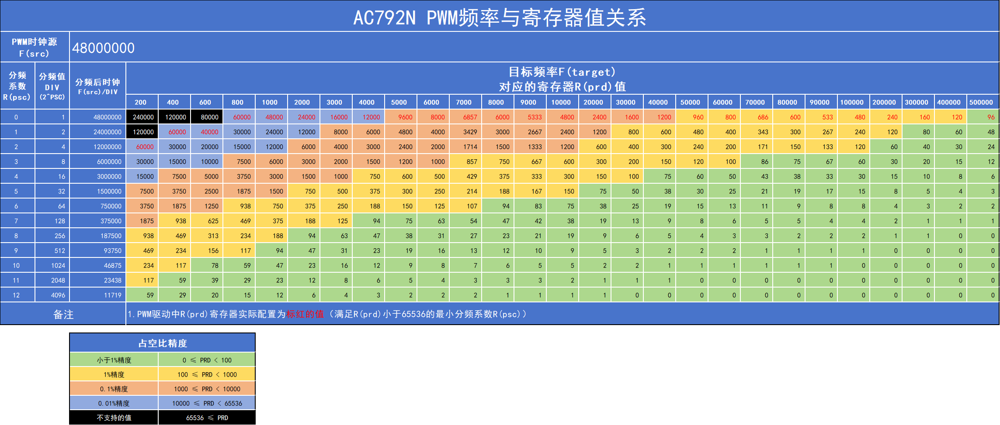

## 2.10.7. 死区时间

死区时间（Dead Time）在电子和电力系统中是一个重要的参数，它通常指的是在某些开关或转换过程中，为了避免由于元件的延迟或反向恢复特性而引起的短路或不稳定现象，特意设置的一段不进行操作的时间间隔。

AC792N的死区时间：

- 仅MCPWM有死区时间，且需要一个MCPWM的H和L通道同时启用才有效。
- 实际死区时间为(deathtime + 1)个时钟源(LSB)周期。
- 实际死区只能通过 `dev_ioctl()` 命令方式配置，`dev_open()` 不对该参数处理。
- 开启死区时间后，通道的占空比由H通道的参数决定。
- 如果死区参数为N，一个PWM周期里的2次电平跳变的死区时间为N * T，一个PWM周期总共有2 * N * T的死区时间。


## 2.10.8. 常见问题说明

**1. 设置PWM的占空比无效。**

PWM占空比精度受到所设置的PWM频率和 `.point_bit` 参数影响。设置时钟频率越高，能达到的占空比精度越低，因此可能出现微调占空比时，实际输出占空比不变的情况。详见PWM占空比小结。

**2. 设置PWM的频率无效。**

PWM频率无法做到线性调节。实际输出频率取目标频率的近似值，设置时钟频率越高，线性度越低，微调频率时输就可能出现不变的情况。详见PWM输出频率小节。

**3. 使用TMR_PWM出现一开始有输出，后面又没有输出。**

TMR_PWM本身是Timer定时器的pwm输出功能，对应Timer定时器可能被其它地方使用了。

建议开发者优先使用MCPWM。

**4. MCPWM模块硬件BUG**

AC792N的MCPWM，当 `R(pwm) = R(prd) - 1` 时，输出波形的占空比为100%，而正常应该是非100%的占空比。

该问题对于目标频率较高的影响比较大，降低目标频率可以降低影响。举例：

- 较高目标频率——时钟源48M，PWM频率0.48M，占空比精度0，对应 `R(prd) = 100`，那么可达到的占空比有 `[0, 1, 2, …, 97, 98, 100]`，无法达输出99%占空比。
- 降低目标频率——时钟源48M，PWM频率0.048M，占空比精度1，对应 `R(prd) = 1000`，那么可达到的占空比有 `[0, 0.1, 0.2, ..., 99.7, 99.8, 100]`，无法达输出99.9%占空比。虽然仍然有影响，但相比于上面0.48M的例子影响小。

## 2.10.9. API参考

**PWM通道枚举**

- MCPWMCHx_H - MCPWM高端通道
- MCPWMCHx_L - MCPWM低端通道
- TIMER PWM - 最多四个通道

**PWM dev_ioctl CMD**

- IOCTL_PWM_GET_DUTY - 获取占空比，通过读取结构体形参中的duty获取，获取的pwm通道占空比是看传参中的pwm_ch，不支持多通道
- IOCTL_PWM_SET_DUTY - 设置占空比，通过结构体形参中的duty设置，设置的PWM通道占空比是看传参中的pwm_ch，其他传参pwm_config_t *的IOCTL同理。支持多通道
- IOCTL_PWM_SET_STOP - 停止，支持多通道
- IOCTL_PWM_SET_RUN - 运行，支持多通道
- IOCTL_PWM_SET_FORDIRC - 正向，支持多通道
- IOCTL_PWM_SET_REVDIRC - 反向，支持多通道
- IOCTL_PWM_SET_DEATH_TIME - 死区时间为系统频率周期时间的整数倍，最大值31，支持多通道
- IOCTL_PWM_SET_FREQ - 设置频率，支持多通道
- IOCTL_PWM_SET_REMOV_CHANNEL - 删除通道，与IOCTL_PWM_SET_ADD_CHANNEL成对使用
- IOCTL_PWM_SET_ADD_CHANNEL - 增加通道，与IOCTL_PWM_SET_REMOV_CHANNEL成对使用

**PWM platform data**

**Defines**

TIME_PWM_MAX - TIMER PWM最大数量

MCPWM_MAX_NUM - MCPWM最大数量

**struct pwm_config_t**

*Public Members:*

`float duty` - 用于带2位小数点占空比的PWM，0.00%-100.00%

`u8 deathtime` - 死区时间，最大值31

`u8 point_bit` - 小数点精度:0-2

`u32 pwm_ch` - PWM通道使能

`u32 freq` - PWM输出频率配置

**struct pwm_platform_data**

*Public Members:*

`int timer_pwm_port[TIME_PWM_MAX]` - TIMER PWM IO口配置

`int mcpwm_port[MCPWM_MAX_NUM * 2]` - MCPWM IO配置

`pwm_config_t pwm_config` - PWM参数配置

`u8 hd_level` - IO强驱等级

# 2.11. SD

## 2.11.1. 应用示例

**示例演示：**

- 芯片接口选择
- 引脚配置
- 单/四线配置
- 时钟配置
- 卡插拔检测方法配置

example: 示例工程实现需在 `apps/demo/demo_DevKitBoard/include/demo_config.h` 中开启宏 `USE_SD_TEST_DEMO`

> **Note**
>
> 1. 开启宏之后，还要在 `app_config.h` 添加SD基本配置。

```c
//*********************************************************************************//
//                              SD 配置（暂只支持打开一个SD外设）
//*********************************************************************************//
//SD0                 cmd,  clk,  data0, data1, data2, data3
//A                   PB6   PB7   PB5    PB5    PB3    PB2
//B                   PA7   PA8   PA9    PA10   PA5    PA6
//C                   PH1   PH2   PH0    PH3    PH4    PH5
//D                   PC9   PC10  PC8    PC7    PC6    PC5

//SD1                 cmd,  clk,  data0, data1, data2, data3
//A                   PH6   PH7   PH5    PH4    PH3    PH2
//B                   PC0   PC1   PC2    PC3    PC4    PC5

#define TCFG_SD0_ENABLE                     1                    //使用SD0 IO
//#define TCFG_SD1_ENABLE                   1                    //使用SD1 IO

#if (TCFG_SD0_ENABLE || TCFG_SD1_ENABLE)
#define TCFG_SD_PORTS                       'D'                  //SD0/SD1的ABCD组(默认为开发板SD0-D),注意:IO占用问题
#define TCFG_SD_DAT_WIDTH                   1                    //1:单线模式, 4:四线模式
#define TCFG_SD_DET_MODE                    SD_CMD_DECT          //检测模式:命令检测，时钟检测，IO检测
#define TCFG_SD_DET_IO                      IO_PORTA_01          //SD_DET_MODE为SD_IO_DECT时有效
#define TCFG_SD_DET_IO_LEVEL                0                    //IO检卡上线的电平(0/1),SD_DET_MODE为SD_IO_DECT时有效
#define TCFG_SD_CLK                         24000000             //SD时钟
#endif

#if TCFG_SD0_ENABLE
#define CONFIG_STORAGE_PATH                 "storage/sd0"        //定义对应SD0的路径
#define SDX_DEV                             "sd0"
#endif

#if TCFG_SD1_ENABLE
#define CONFIG_STORAGE_PATH                 "storage/sd1"        //定义对应SD1的路径
#define SDX_DEV                             "sd1"
#endif

#ifndef CONFIG_STORAGE_PATH
#define CONFIG_STORAGE_PATH                 "no_sd_card"         //不使用SD定义对应别的路径，防止编译出错
#define SDX_DEV                             "no_sd"
#endif

//指定根目录
#define CONFIG_ROOT_PATH                    CONFIG_STORAGE_PATH"/C/"  //定义对应SD文件系统的根目录路径
```

> **Note**
>
> 说明：
>
> **1）`#define TCFG_SD_PORTS 'D'` //该值设置的是SD0/1的某一组IO，如下:**
>
> **SD0**
>
> |   | cmd | clk  | data0 | data1 | data2 | data3 |
> | - | --- | ---- | ----- | ----- | ----- | ----- |
> | A | PB6 | PB7  | PB5   | PB5   | PB3   | PB2   |
> | B | PA7 | PA8  | PA9   | PA10  | PA5   | PA6   |
> | C | PH1 | PH2  | PH0   | PH3   | PH4   | PH5   |
> | D | PC9 | PC10 | PC8   | PC7   | PC6   | PC5   |
>
> **SD1**
>
> |   | cmd | clk | data0 | data1 | data2 | data3 |
> | - | --- | --- | ----- | ----- | ----- | ----- |
> | A | PH6 | PH7 | PH5   | PH4   | PH3   | PH2   |
> | B | PC0 | PC1 | PC2   | PC3   | PC4   | PC5   |
>
> **2）`#define TCFG_SD_DET_MODE SD_CMD_DECT` //检测模式:SD_CMD_DECT命令检测，SD_CLK_DECT时钟检测，SD_IO_DECT IO检测（IO检测接SD卡座子的第9个引脚，会多占用1个IO，不建议使用IO检测）**
>
> **3）当使用IO检测，则以下宏定义需要用到：**
>
> ```c
> #define TCFG_SD_DET_IO                      IO_PORTA_01          //SD卡座子的IO检测引脚接芯片端的IO
> #define TCFG_SD_DET_IO_LEVEL                0                    //IO检卡上线的电平(0/1),一般SD座子的检测引脚为低电平0是上线
> ```
>
> **4）如下图是 `doc/datasheet/AC791N规格书/schematic` 原理图文件的SD连接部分，SD接口选择了SD0的D口，**
>
> 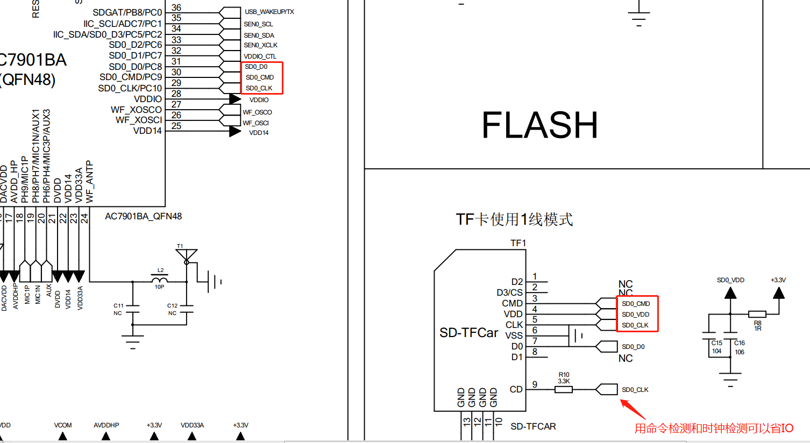
>
> 本例子需要看数据手册的 `doc/datasheet/AC791N规格书/datasheet`
>
> 

> **Note**
>
> 除以上之外还要在board.c添加SD模块配置和SD设备。

```c
/****************SD模块**********************************************************
 * 暂只支持1个SD外设，如需要多个SD外设，自行去掉下面SD0/1_ENABLE控制，另外定义即可
 ********************************************************************************/
#if (TCFG_SD0_ENABLE || TCFG_SD1_ENABLE)
#if TCFG_SD0_ENABLE                                                 //sd0
#define SD_PLATFORM_DATA_BEGIN()    SD0_PLATFORM_DATA_BEGIN(sd0_data)
#define SD_PLATFORM_DATA_END()      SD0_PLATFORM_DATA_END()
#define SD_CLK_DETECT_FUNC          sdmmc_0_clk_detect
#elif TCFG_SD1_ENABLE                                               //sd1
#define SD_PLATFORM_DATA_BEGIN()    SD1_PLATFORM_DATA_BEGIN(sd1_data)
#define SD_PLATFORM_DATA_END()      SD1_PLATFORM_DATA_END()
#define SD_CLK_DETECT_FUNC          sdmmc_1_clk_detect
#endif

SD_PLATFORM_DATA_BEGIN()
    .port = TCFG_SD_PORTS,
    .priority = 3,
    .data_width = TCFG_SD_DAT_WIDTH,
    .speed = TCFG_SD_CLK,
    .detect_mode = TCFG_SD_DET_MODE,
#if (TCFG_SD_DET_MODE == SD_CLK_DECT)
    .detect_func = SD_CLK_DETECT_FUNC,
#elif (TCFG_SD_DET_MODE == SD_IO_DECT)
    .detect_func = sdmmc_0_io_detect,
#else
    .detect_func = NULL,
    .power = NULL,//sd_set_power,                                  //是否需要PB8提供SD电源
#endif
SD_PLATFORM_DATA_END()
#endif
/****************SD模块***********************************************************/

//下面添加到device_table设备的子设备
#if TCFG_SD0_ENABLE
    { "sd0", &sd_dev_ops, (void *)&sd0_data },
#endif
#if TCFG_SD1_ENABLE
    { "sd1", &sd_dev_ops, (void *)&sd1_data },
#endif
```

> **Note**
>
> `.power` 参数说明： 某些芯片封装包含PB8，PB8硬件IO可以作为提供SD卡的VCC电源，当需要使用PB8作为SD的电源接口时，需配置 ： `.power = sd_set_power`，当不需要PB8提供SD电源时，可以直接去掉 `.power` 或者 `.power = NULL`，即可。
>
> **注意：** 当使用PB8作为SD的电源接口时，需要注意某些芯片封装内部会把PB8和其他IO绑在一块，此时需要设置其他IO为高阻态（关闭上下拉，关闭DIE，设置输入状态）。
>
> **注意：** 对于sd的IO组使用时候注意IO是否有占用IO问题，例如：使用SD1的A组IO，注意board.c中的adc_data是否有配置了MIC或者AUX通道导致录音时候掉卡。具体IO组中的IO使用可参考原理图。
>
> **1. `extern void sd_set_power(u8 enable);`** 配置SDGAT(PB8)给sd供电，在上述说明中，一般在板级中配置 `.power = sd_set_power`，就可以使用SDGAT(PB8)给sd供电，也可以直接调用使用进行上下电

## 2.11.2. 实验现象

系统启动后，拔插SD卡可以从串口打印看见 `sd in mount sd success` 和 `sd out unmount sd`。

# 2.12. SDRAM

## 2.12.1. 应用实例

**示例演示：**

example: 具体示例代码详见 `apps/common/movable/example.c`， 示例工程实现必须在 `apps/demo/demo_audio/include/app_config.h` 中定义宏 `CONFIG_NO_SDRAM_ENABLE` 和 `CONFIG_DYNAMIC_SDRAM_ONOFF_ENABLE`

```c
//sdram_cfg_info_t结构体的参数注释具体可参考isd_config_rule.c里面sdram相关配置的注释
static const struct sdram_cfg_info_t sdram_cfg = {
    .sdram_size = 2 * 1024 * 1024,              //封装sdram的容量
    .sdram_test_size = 4 * 1024,
    .sdram_config_val = -1,
    .sdram_mode = 0,
    .sdram_pll3_en = 0,
    .sdram_pll3_nousb_en = 0,
    .sdram_cl = 2,                              //sdram时钟配置
    .sdram_rlcnt = 1,
    .sdram_d_dly = 1,
    .sdram_q_dly = 1,
    .sdram_phase = 3,
    .sdram_dq_dly_trm = 4,                      //sdram时钟配置
};

sdram_init(&sdram_cfg);                         //打开sdram
sdram_uninit();                                 //关闭sdram
```

# 2.13. GPCNT

## 2.13.1. 应用示例

**示例演示：**

- gpcnt 为高速频率采样模块。采样范围20hz-200M 采样精度99.9。

example: 具体示例代码详见 `apps/common/example/peripheral/gpcnt/gpcnt_test.c`，示例工程实现需在 `apps/demo/demo_DevKitBoard/include/demo_config.h` 中开启宏 `USE_GPCNT_TEST_DEMO`

> **Note**
>
> 1. 开启宏之后，还要在对应的 `board.c` 文件中添加GPCNT基本配置。

```c
#include "gpcnt.h"

const struct gpcnt_platform_data gpcnt_data = {
    .gpcnt_gpio = IO_PORTC_07,
    .gss_clk_source = GPCNT_PLL_CLK,            //480M
    .ch_source = GPCNT_INPUT_CHANNEL1,
    .cycle = CYCLE_15,
};

{"gpcnt", &gpcnt_dev_ops, (void *) &gpcnt_data },
```

## 2.13.2. 常见问题

**GPCNT 采样能否采集内部时钟？**

如果多io采集 只需要open后

```c
dev_ioctl(gpcnt_hd, IOCTL_SET_GPIO, gpio0);
dev_ioctl(gpcnt_hd, IOCTL_SET_CYCLE, IOCTL_SET_GPIO);
dev_ioctl(gpcnt_hd, IOCTL_SET_CYCLE, CYCLE_15);
dev_ioctl(gpcnt_hd, IOCTL_SET_GSS_CLK_SOURCE, GPCNT_OSC_CLK);
dev_ioctl(gpcnt_hd, IOCTL_SET_CH_SOURCE, GPCNT_INPUT_CHANNEL4);
dev_ioctl(gpcnt_hd, IOCTL_GET_GPCNT, (u32)&gpcnt);

dev_ioctl(gpcnt_hd, IOCTL_SET_GPIO, gpio1);
dev_ioctl(gpcnt_hd, IOCTL_SET_CYCLE, IOCTL_SET_GPIO);
dev_ioctl(gpcnt_hd, IOCTL_SET_CYCLE, CYCLE_15);
dev_ioctl(gpcnt_hd, IOCTL_SET_GSS_CLK_SOURCE, GPCNT_OSC_CLK);
dev_ioctl(gpcnt_hd, IOCTL_SET_CH_SOURCE, GPCNT_INPUT_CHANNEL4);
dev_ioctl(gpcnt_hd, IOCTL_GET_GPCNT, (u32)&gpcnt);
```

# 2.14. GSENSOR

## 2.14.1. 应用示例

**示例演示：**

- gsensor相关配置方法
- 挂载da380传感器撞击测试

example: 具体示例代码详见 `apps/common/example/peripheral/gsensor/main.c`，示例工程实现需在 `apps/demo/demo_DevKitBoard/include/demo_config.h` 中开启宏 `USE_GSENSOR_TEST_DEMO`。

> **Note**
>
> 在对应的 `board.c` 添加iic和gsensor配置参数

```c
//添加软件IIC配置信息
SW_IIC_PLATFORM_DATA_BEGIN(sw_iic0_data)
    .clk_pin = IO_PORTH_00,                     //clk
    .dat_pin = IO_PORTH_01,                     //sdat
    .sw_iic_delay = 50,                         //clk时钟周期（系统的nop时间个数）
SW_IIC_PLATFORM_DATA_END()

//添加gensor配置信息
const struct gsensor_platform_data gsensor_data = {
    .iic = "iic0",
};

//设备列表添加iic设备和gsensor设备
{ "iic0",  &iic_dev_ops, (void *)&sw_iic0_data },
{"gsensor", &gsensor_dev_ops, (void *)&gsensor_data},
```

## 2.14.2. 操作说明

1. 编译工程，烧录镜像，复位启动
2. 系统启动后，可以通过串口软件看到gsensor挂载da380的情况，返回id号13即为挂载成功

   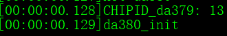
3. 若da380挂载成功，撞击带有da380的开发板，会产生如下打印信息

   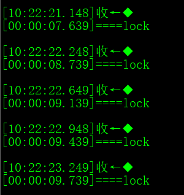

# 2.15. IRFLT红外接收模块

**Overview**

展示了系统提供的IRFLT模块的红外遥控接收使用示例。

## 2.15.1. 应用示例

**示例演示：**

1. 在 `app_config.h` 中打开 `TCFG_IRKEY_ENABLE` 宏，并在对应的 `board.c` 文件配置IRKEY映射的IO口

   ```c
   #if TCFG_IRKEY_ENABLE
   const struct irkey_platform_data irkey_data = {
       .enable = 1,
       .port = IO_PORTC_07,                    //配置正确的IO
   };
   #endif
   ```
2. 在 `apps/common/key/irkey.c` 配置键值表

   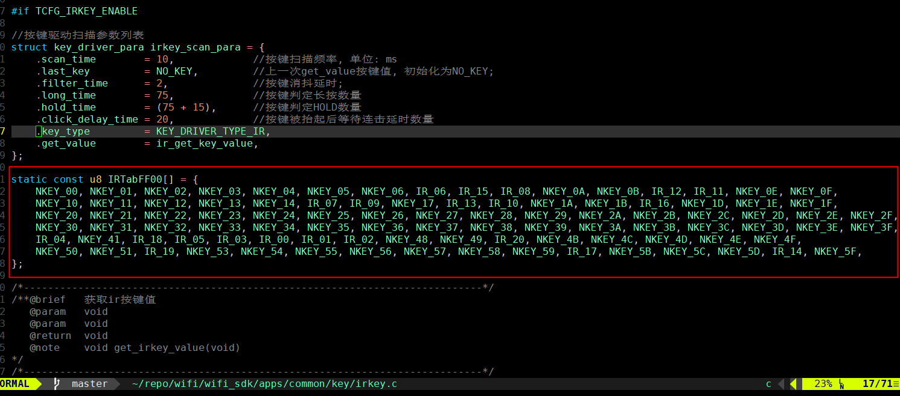
3. 配置键值表对应的具体指令

   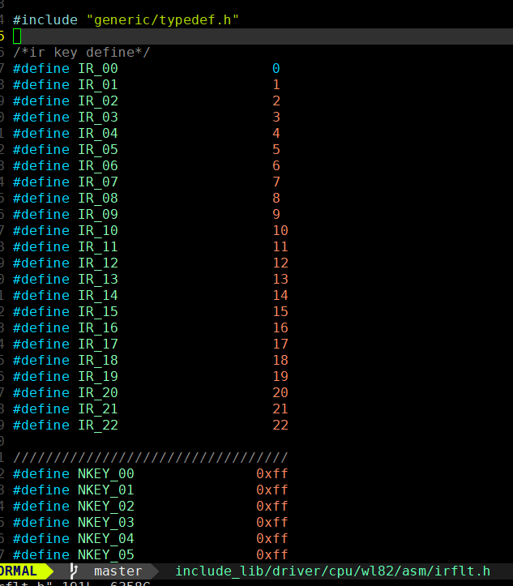

## 2.15.2. 常见问题

# 2.16. USB

## 2.16.1. 应用实例

**示例演示：**

- USB做masstorge主从机方法
- USB做UAC主从机方法
- USB做UVC主从机方法
- USB做HID主从机方法
- USB与PC通信

## 2.16.2. 公共配置说明

**1. 在 `apps/demo/demo_DevKitBoard/app_main.c` 中增加USB任务名字如下**

```c
/*任务列表 */
const struct task_info task_info_table[] = {
    {"app_core",            15,     2048,     1024 },
    {"sys_event",           29,     512,       0 },
    {"systimer",            14,     256,       0 },
    {"sys_timer",            9,     512,      128 },
#if CPU_CORE_NUM > 1
    {"#C0usb_msd",           1,      512,   128   },
#else
    {"usb_msd",              1,      512,   128   },
#endif
    {0, 0, 0, 0, 0},
};
```

**2. 在 `apps/demo/demo_DevKitBoard/board/wl82/DevKitBoard.c` 中增加USB配置如下**

```c
#if TCFG_USB_SLAVE_ENABLE || TCFG_USB_HOST_ENABLE
#include "otg.h"
#include "usb_host.h"
#include "usb_common_def.h"
#include "usb_storage.h"
#include "asm/uvc_device.h"
#endif

#if TCFG_USB_SLAVE_ENABLE || TCFG_USB_HOST_ENABLE
static const struct otg_dev_data otg_data = {
    .usb_dev_en = 0x01,                         //USB口使能：0x1-->USB0；0x2-->USB1；0x3--->USB0和USB1
#if TCFG_USB_SLAVE_ENABLE
    .slave_online_cnt = 10,                     //USB从机的上线检测次数，单位为detect_time_interval值
    .slave_offline_cnt = 10,                    //USB从机的下线检测次数，单位为detect_time_interval值
#endif
#if TCFG_USB_HOST_ENABLE
    .host_online_cnt = 10,                      //US主机的上线检测次数，单位为detect_time_interval值
    .host_offline_cnt = 10,                     //US主机的下线检测次数，单位为detect_time_interval值
#endif
    .detect_mode = OTG_HOST_MODE | OTG_SLAVE_MODE | OTG_CHARGE_MODE,  //检测模式：主机检测、从机检测、拔插充电检测
    .detect_time_interval = 50,                 //检测上下线的时间间隔，单位ms，默认50ms（不建议修改变小，否则USB事件可能会丢，最低为10ms）
};
#endif

REGISTER_DEVICES(device_table) = {
#if TCFG_USB_SLAVE_ENABLE || TCFG_USB_HOST_ENABLE
    { "otg", &usb_dev_ops, (void *)&otg_data},
#endif
};
```

USB的拔插事件通知在 `apps/common/system/device_mount.c` 的 `device_event_handler` 函数，当注册app状态机，则状态机事件处理也会有事件通知。

## 2.16.3. 操作说明

**1. USB做masstorge从机方法**

打开四个宏即可

1.1 配置SD卡相关参考 SD例子

1.2 `app_config.h` 修改配置，注意：读卡器功能，同时需要打开SD卡功能并插SD卡，电脑端才能显示读卡器的U盘盘符。

```c
#define TCFG_SD0_ENABLE                     1                    //使能sd卡
#define TCFG_PC_ENABLE                      1                    //使用从机模式
#define USB_PC_NO_APP_MODE                  2                    //不使用app_core
#define USB_DEVICE_CLASS_CONFIG             (MASSSTORAGE_CLASS)  //msd
```

**2. USB做UAC从机方法**

2.1 配置AUDIO工程相关参考 demo_audio工程

2.2 `app_config.h` 修改配置

```c
#define TCFG_PC_ENABLE                      1                    //使用从机模式
#define USB_DEVICE_CLASS_CONFIG             (AUDIO_CLASS)        //audio
#define CONFIG_PCM_ENC_ENABLE
#define CONFIG_PCM_DEC_ENABLE
#define CONFIG_AUDIO_ENC_SAMPLE_SOURCE      AUDIO_ENC_SAMPLE_SOURCE_MIC
```

2.3 增加uac相关库

| 文件/库         | 说明                                  |
| --------------- | ------------------------------------- |
| audio_config.c  | 用到了相关的api函数(get_ps_cal_api)   |
| usb_audio_api.c | usb和audio对接api函数                 |
| audio_server.a  | 音频编解码库                          |
| lib_usb_syn.a   | 用于变采样 专用于usb 不能用于其他地方 |

2.4 在 `board.c` 初始化dac相关硬件

```c
void board_early_init()
{
    extern void dac_early_init(u8 trim_en, u8 pwr_sel, u32 dly_msecs);
    dac_early_init(1, 1, 1000);
    devices_init();
}
```

2.5 在 `app_main.c` 增加相关代码

```c
{"uac_sync",            20,      512,   0     },
{"uac_play",             7,      768,   0     },
{"uac_record",           7,      768,   32    },
```

**3. USB做UVC从机方法（支持DVP摄像头数据到电脑）**

3.1 配置VIDEO工程相关参考 demo_video工程，先要移植摄像头并调试可以出图，电脑端才能有图像。

```c
//*********************************************************************************//
//          USB配置    USB查看软件 请在sdk_tools文件夹中找到AMCapSetup.exe            //
//*********************************************************************************//
#define TCFG_PC_ENABLE                      1                    //打开usb从机功能(打开连接PC电脑模式)
#if TCFG_PC_ENABLE
#define USB_PC_NO_APP_MODE                  2                    //不用APP状态机接收消息
#define USB_MALLOC_ENABLE                   1                    //buff采用申请方式
#define USB_DEVICE_CLASS_CONFIG             (UVC_CLASS)          //从机UVC电脑查看功能选择
//#define USB_DEVICE_CLASS_CONFIG           (MASSSTORAGE_CLASS)  //从机电脑盘符功能选择
#if ((USB_DEVICE_CLASS_CONFIG & UVC_CLASS) == UVC_CLASS)
#define CONFIG_USR_VIDEO_ENABLE
#endif
#endif
```

3.2 增加uvc相关库

| 文件/库           | 说明                               |
| ----------------- | ---------------------------------- |
| stream_protocol.c | 实时流中间层                       |
| user_video_rec.c  | 打开实时流api                      |
| video_rt_usr.c    | 封装给stream_protocol              |
| gc0308.c          | 摄像头驱动，根据实际摄像头选择驱动 |

3.3 uvc从机流程

（1）电脑开启UVC摄像头：设备USB连接电脑，电脑开启摄像头时，系统会进 `uvc.c` 的 `uvc_vs_itf_handle` 函数，执行打开摄像头 `usb_video_open_camera()`

```c
static u32 uvc_vs_itf_handle(struct usb_device_t *usb_device, struct usb_ctrlrequest *req)
{
    ...
    case USB_TYPE_STANDARD:
    ...
        usb_video_open_camera(usb_id);
    ...
}

///执行打开摄像头，指向函数uvc_video_open()
static void usb_video_open_camera(usb_dev usb_id)
{
    ...
    uvc_handle[usb_id]->video_open(usb_id, uvc_slave_probe_commit_control[usb_id][2] - 1,  //Format Index
                                  uvc_slave_probe_commit_control[usb_id][3] - 1,  //Frame  Index
                                  10000000 / fps);
}

static int uvc_video_open(int idx, int fmt, int frame_id, int fps)
{
    ...
#if UVC_FORMAT_MJPG
    set_video_rt_cb(uvc_send_buf, &uvc_video_info);    //注册JPEG回调函数
    //uvc_video_open函数调用user_video_rec.c里的API，实现打开摄像头出JPG图
    user_video_rec0_open(0);
}
```

（2）UVC发送JPEG到电脑：电脑请求设备UVC的数据包，则进入 `uvc_g_bulk_transfer()` 函数，进行JPEG图片获取，最终跑到 `uvc_video_req_buf()` 函数。

```c
static void uvc_g_bulk_transfer(struct usb_device_t *usb_device, u32 ep)
{
    ...
    //该函数为uvc_video_req_buf()
    len = uvc_handle[usb_id]->video_reqbuf(usb_id, tx_addr, UVC_FIFO_TXMAXP, &IsEOFFrame);
    ...
    //发送JPEG到USB
    usb_g_bulk_write(usb_id, UVC_STREAM_EP_IN, tx_addr, len);
}

static int uvc_video_req_buf(int idx, void *buf, u32 len, u32 *frame_end)
{
    ...
    //复制JPEG到USB缓存，下一步发送到USB
    memcpy(buf, uvc_video_info.reqbuf, uvc_video_info.send_len);
    ...
}
```

**4. USB做HID从机方法（演示做键盘的方法）**

4.1 在 `apps/demo/demo_DevKitBoard/include/demo_config.h`，开启宏 `USE_USB_HID_SLAVE_TEST_DEMO`

4.2 增加 `hid_keyboard.c`

4.3 在 `app_config.h` 修改宏和选择增加枚举键盘还是pos机，pos机流程一样，具体可以参考 `apps/scan_box/app_main.c`

```c
#define USB_DEVICE_CLASS_CONFIG             (HID_CLASS)
#if TCFG_USB_SLAVE_HID_ENABLE
#define USB_HID_KEYBOARD_ENABLE             1
#endif
```

**5. USB做主机读U盘**

5.1 在 `board.c` 增加配置

```c
{ "udisk", &mass_storage_ops, NULL },
```

5.2 在 `app_config.h` 打开宏

```c
#define TCFG_UDISK_ENABLE                   1                    //U盘功能
// #define USB_DEVICE_CLASS_CONFIG          (AUDIO_CLASS)
```

5.3 在 `apps/demo/demo_DevKitBoard/include/demo_config.h`，开启宏 `USE_USB_UDISK_HOST_TEST_DEMO`

**6. USB做UVC主机（设备USB口接上UVC摄像头）**

6.1 在 `app_config.h` 打开宏

```c
#define TCFG_HOST_UVC_ENABLE                1                    //打开USB 后拉摄像头功能，需要使能主机模式
```

6.2 查看USB摄像头方法：

- A：设备连接后，打开电脑自带的相机出图。下面三种方法是跑 `wifi_camera` 工程时的方法。
- B：使用DVrunning2的APP可以直接连接wifi热点出图。
- C：使用 `wifi_camera` 下 `demo_ui`，则开启UI，打开UI宏：codeblock的工程编译选项(build options)的#define选项加上CONFIG_UI_ENABLE，可以显示到屏幕（或者linux环境下的makefile加上UI宏CONFIG_UI_ENABLE）。
- D：在 `apps\wifi_camera\app_main.c` 开启插卡录像功能，如下代码块。插USB UVC摄像头后，再插SD卡就可以开启录像功能，在录像一个文件结束（默认3分钟）就可以拔出SD卡来插卡查看UVC录像视频。

6.3 UVC主机流程：

（1）打开UVC。以user_video_rec2.c为例子，user_video_rec2.c中的user_video_rec0_open()调用server_open()。

（2）中断接收数据。

```c
//*************usb_video.c****************//
int uvc_host_open_camera(void *fd)
{
    ...
    usb_uvc_info(device);                   //发送配置到从机UVC
    ret = usb_control_msg(host_dev, USB_REQ_SET_INTERFACE, 0x01, uvc->if_alt_num, hdl->itf_base + 1, NULL, 0);
    log_debug("USB_REQ_SET_INTERFACE %d to %d", hdl->itf_base + 1, uvc->if_alt_num);
    check_ret(ret);
    iso_ep_rx_init(device);                 //中断接收初始化
    uvc->camera_open = 1;
    ...
}

static void vs_iso_handler(struct usb_host_device *host_dev, u32 ep)
{
    //中断函数，数据包读取，数据包回调
    ...
    //请求下一个数据包
    usb_h_ep_read_async(usb_id, uvc->host_ep, uvc->ep, NULL, 0, USB_ENDPOINT_XFER_ISOC, 1);
    //当前数据包
    start_addr = hdl->buffer;
    ...
    //一帧JPEG结束，进入帧结束回调。uvc->stream_out实际指向uvc_host.c的uvc_mjpg_stream_out();
    if (uvc->stream_out) {
        uvc->stream_out(uvc->priv, -1, NULL, STREAM_ERR);
        stream_state = STREAM_ERR;
    }
}

//*************uvc_host.c****************//
int uvc_mjpg_stream_out(void *fd, int cnt, void *stream_list, int state)
{
    ...
    uvc_buf_stream_finish(fh, fh->buf, ch);  //推流往应用层
    ...
}
```

6.4 常见问题：

（1）UVC应用层接收帧率低问题处理。

- A：确定中断是否接受到足够帧，在中断函数一帧 JPEG 图片完成回调函数加打印计数等方式检测。
- B：检测是否在数据包回调函数丢帧，`uvc_mjpg_stream_out()` 函数。打开丢帧处理打印 `putchar('d');`。
- C：在 `app_config.h` 注释 `CONFIG_VIDEO_REC_PPBUF_MODE`，则使用 lbuf 模式。
- D：加大应用层视频对应的 buf 缓冲区大小，如 `user_video_rec2.c` 的请求视频流的 `req.rec.buf` 和 `req.rec.buf_len` 参数的值。
- E：APP 图传的部分详情 WIFI_CAMERA工程说明。

**7. USB做HID主机方法（演示做键盘的方法）**

7.1 在 `app_config.h` 修改宏，开启宏 `#define TCFG_HID_HOST_ENABLE`

```c
#ifdef CONFIG_USB_ENABLE
#define TCFG_PC_ENABLE                      0                    //使用从机模式
#define USB_PC_NO_APP_MODE                  2                    //不使用app_core
#define USB_MALLOC_ENABLE                   1
#define USB_DEVICE_CLASS_CONFIG             (HID_CLASS)
#define TCFG_HOST_AUDIO_ENABLE              0
#define TCFG_HOST_UVC_ENABLE                0                    //打开USB 后拉摄像头功能，需要使能主机模式
#define TCFG_HID_HOST_ENABLE                1                    //HID主机功能
#define TCFG_UDISK_ENABLE                   0                    //U盘功能
#endif
```

**8. USB做UAC主机方法**

具体代码参考 `uac_host_demo.c`，跑 `wifi_story_machine` 工程

8.1 在 `board_config.h` 修改宏

```c
#ifdef CONFIG_USB_ENABLE
#define TCFG_PC_ENABLE                      0                    //使用从机模式
#define TCFG_HOST_AUDIO_ENABLE              1                    //uac主机功能，用户需要自己补充uac_host_demo.c里面的两个函数
#endif
```

## 2.16.4. USB摄像头使用说明(UVC)

1. 例如：使用工程 `wifi_camera` 进行编译测试
2. 配置芯片使用SDRAM，即去掉 `CONFIG_NO_SDRAM_ENABLE` 宏，一般在全局宏配置
3. 在 `app_config.h` 中将 `CONFIG_UVC_VIDEO2_ENABLE` 宏开启
4. 在 `video_buf_config.h` 中改大 `NET_VREC0_FBUF_SIZE` 宏大小
5. 将 `CONFIG_VIDEO_REC_PPBUF_MODE` 宏进行屏蔽，屏蔽默认使用LBUF即帧buf
6. 有关帧数使用规格640*480 25fps(USB摄像头) wifi图传20fps
7. 当想要使用UI显示UVC摄像头时候需要提前确认好屏幕驱动已经调好能正常显示，然后将 `CONFIG_UI_ENABLE` 宏开启，并且在 `app_config.h` 中将 `TCFG_DEMO_UI_RUN`、`NO_UI_LCD_TEST` 均配置为 1（其他工程暂不支持）
8. 支持屏幕和UVC同时显示摄像头内容

## 2.16.5. USB与PC通信

列举了两种USB与PC端通信协议的使用方式，SCSI协议与CDC协议，可参考应用于PC端的上位机开发。

**1. USB SCSI协议的使用**

1.1 USB配置。SCSI协议一般用于U盘、读卡器等大容量存储设备。在SDK中，将USB配置成从机模式，并配置设备类型为存储设备；在 `app_config.h` 文件中进行配置，如下：

```c
#define TCFG_PC_ENABLE                      1                    //打开usb从机功能(打开连接PC电脑模式)
#define USB_DEVICE_CLASS_CONFIG             (MASSSTORAGE_CLASS)  //从机电脑盘符功能选择
```

1.2 SCSI协议数据处理。在 `include_lib/driver/device/usb/scsi.h` 文件中，添加自定义的SCSI协议的操作码，注意不能和现有的操作码重复，如下：

```c
#define MY_TEST_OPCODE                      0x7d
```

1.3 在 `apps/common/usb/device/msd.c` 文件中，添加SCSI协议数据的处理函数，如下:

```c
enum {
    TEST_CMD_0,
    TEST_CMD_1,
};

void test_cmd_deal(const struct usb_device_t *usb_device)
{
    u8 len;
    u8 buf[32];

    switch (msd_handle[usb_id]->cbw.lun) {
        case TEST_CMD_0:
            printf("^^^TEST_CMD_0\n");
            //返回数据至USB主机
            memset(buf, 0xaa, sizeof(buf));
            msd_mcu2usb(usb_device, buf, sizeof(buf));
            break;
        case TEST_CMD_1:
            printf("^^^TEST_CMD_1\n");
            //接收USB主机发送的数据
            len = msd_handle[usb_id]->cbw.LengthL;
            msd_usb2mcu(usb_device, buf, len);
            put_buf(buf, sizeof(buf));
            break;
        default:
            printf("^^^no support cmd\n");
            break;
    }
}

void USB_MassStorage(const struct usb_device_t *usb_device)
{
    //......
    switch (msd_handle[usb_id]->cbw.operationCode) {
        //......
        case MY_TEST_OPCODE:  //自定义的操作码处理
            test_cmd_deal(usb_device);
            break;
        //......
    }
}
```

1.4 数据收发测试。可使用USB调试助手，向USB从机发送SCSI命令进行测试。

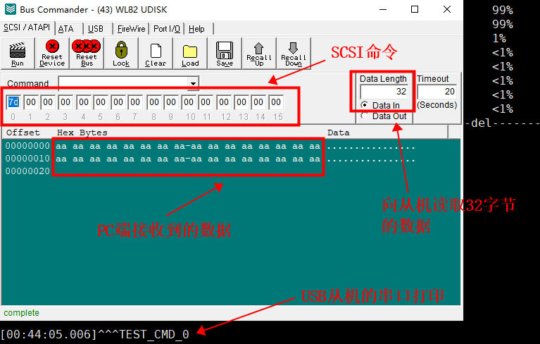

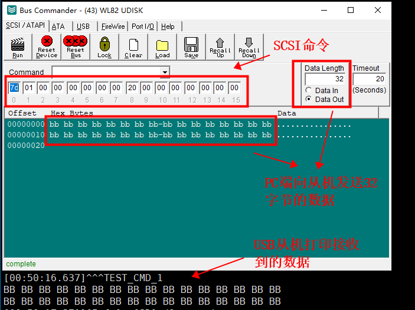

**2. USB CDC协议的使用**

2.1 USB配置。CDC协议将USB设备枚举为虚拟串口，PC端通过串口协议与USB从机进行通信。在SDK中，将USB配置成从机模式，并配置设备类型为CDC类设备；在 `app_config.h` 文件中进行配置，如下：

```c
//3.从机连接PC模式下：电脑盘符功能、UVC功能
#define TCFG_PC_ENABLE                      1                    //打开usb从机功能(打开连接PC电脑模式)
#if TCFG_PC_ENABLE
    ...
#define USB_DEVICE_CLASS_CONFIG             (CDC_CLASS)          //从机电脑盘符功能选择
#endif
```

2.2 CDC传输中断使能。在 `apps/common/usb/device/cdc.c` 中，开启cdc协议接收中断：

```c
static void cdc_endpoint_init(struct usb_device_t *usb_device, u32 itf)
{
    ......
    usb_g_set_intr_hander(usb_id, CDC_DATA_EP_OUT | USB_DIR_OUT, cdc_intrrx); //打开使能cdc中断
    /* usb_g_set_intr_hander(usb_id, CDC_DATA_EP_OUT | USB_DIR_OUT, cdc_wakeup_handler);//使能cdc中断同步注释*/
    ......
}

void cdc_register(const usb_dev usb_id)
{
    ......
    cdc_set_output_handle(0,NULL, usb_cdc_output_handler);  //注册数据处理函数
    ......
}
```

2.3 CDC协议数据处理。在 `apps/common/usb/device/cdc.c` 中，添加自定义的CDC协议数据处理代码。（该代码默认关闭，如需开启，把 `late_initcall(cdc_test_main)` 的注释去除即可）如下：

```c
static OS_SEM psem;
static u8 rx_buf[64];
static u8 rx_len;

s32 usb_cdc_output_handler(void *priv, u8 *buf, u32 len)
{
    //将收到的数据打印
    printf("len = %d, buf = %s\n", len, buf);
    rx_len = len;
    memcpy(rx_buf, buf, len);
    //post信号量
    os_sem_post(&psem);
    return 0;
}

void cdc_rx_test()
{
    os_sem_create(&psem, 0);
    while(1){
        //pend信号量
        os_sem_pend(&psem, 0);
        printf("len = %d, buf = %s\n", rx_len, rx_buf);
        //将收到的数据发送至终端
        cdc_write_data(0, &rx_buf, rx_len);
        printf("cdc_test\n");
    }
}

void cdc_test_main()
{
    if (thread_fork("cdc_rx_test", 10, 512, 0, NULL, cdc_rx_test, NULL) != OS_NO_ERR) {
        printf("thread fork fail\n");
    }
    return;
}
late_initcall(cdc_test_main);
```

2.4 数据收发测试。可通过串口调试助手进行收发测试。

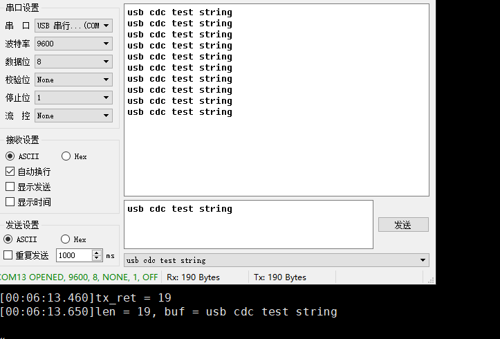

2.5 若想使用USB虚拟串口打印log：在 `apps/common/debug/debug_user.c` 打开宏 `#define CONFIG_USB_DEBUG_ENABLE     //开关USB虚拟串口打印信息`

## 2.16.6. 常见问题

1. 宏 `TCFG_PC_ENABLE`，是USB从机功能总包起来的宏，具体的定义可以进入 `apps/common/usb/usb_std_class_def.h` 和 `apps/common/usb/usb_common_def.h` 中查看。如需移植usb从机功能时，需包含 `usb_std_class_def.h` 和 `usb_common_def.h` 这两个文件。
2. 需要移植usb功能时，需要添加 `apps/common/system/device_mount.c` 文件。

# 2.17. FLASH应用层API

## 2.17.1. 示例

示例工程：具体示例代码详见 `apps/common/example/peripheral/flash/flash_api/main.c`，示例工程实现需在 `apps/demo/demo_DevKitBoard/include/demo_config.h` 中开启宏 `USE_FLASH_TEST_DEMO`。

## 2.17.2. 使用说明

**1. flash应用层使用API接口**

| 函数                                                                           | 说明                                                                                                                                                                                                                                                                                                               |
| ------------------------------------------------------------------------------ | ------------------------------------------------------------------------------------------------------------------------------------------------------------------------------------------------------------------------------------------------------------------------------------------------------------------ |
| `int norflash_open(const char *name, struct device **device, void *arg);`    | **描述：** norflash_open函数是初始化flash硬件，在用户使用flash的API接口首先需要打开才能使用flash API(多次打开没有影响)`<br>`**参数：** name、device、arg为NULL即可 `<br>`**返回值：** 0：成功 其他：失败                                                                                     |
| `int norflash_origin_read(u8 *buf, u32 offset, u32 len);`                    | **描述：** norflash_origin_read函数是直接SPI读取flash函数，用户应该使用的API接口。当通过norflash_write函数写，则norflash_origin_read读取与写的相同，需要加解密则应用层用户自行处理 `<br>`**参数：** buf:数据地址，offset:flash地址，len:数据长度 `<br>`**返回值：** 0：成功 其他：失败       |
| `int norflash_read(struct device *device, void *buf, u32 len, u32 offset);`  | **描述：** norflash_read函数是CPU读取flash，用户应使用该API接口时需要注意：读写地址小于VM区域时会做加解密处理 `<br>`**参数：** device为NULL，buf:数据地址，offset:flash地址，len:数据长度 `<br>`**返回值：** 0：成功 其他：失败                                                              |
| `int norflash_write(struct device *device, void *buf, u32 len, u32 offset);` | **描述：** norflash_write函数是直接SPI写flash函数，用户应该使用的API接口。当通过norflash_write函数写，则norflash_origin_read读取与写的相同，需要加解密则应用层用户自行处理 `<br>`**参数：** device为NULL，buf:数据地址，offset:flash地址，len:数据长度 `<br>`**返回值：** 0：成功 其他：失败 |
| `int norflash_ioctl(struct device *device, u32 cmd, u32 arg);`               | **描述：** norflash_ioctl，flash操作命令接口 `<br>`**返回值：** 0：成功 其他：失败                                                                                                                                                                                                                   |
| `void flash_read_write_init(void);`                                          | **描述：** 应用层用户初始化flash硬件接口 `<br>`**参数：** void `<br>`**返回值：** void                                                                                                                                                                                                       |
| `int flash_write_buff(u8 *buff, u32 addr, u32 len);`                         | **描述：** 应用层用户读写API，使用该函数前，先调用norflash_open函数初始化flash硬件接口 `<br>`**参数：** buff:数据地址指针；addr:地址；len：长度 `<br>`**返回值：** 0：成功 其他：失败                                                                                                        |
| `int flash_read_buff(u8 *buff, u32 addr, u32 len);`                          | **描述：** 应用层用户读写API，使用该函数前，先调用norflash_open函数初始化flash硬件接口 `<br>`**参数：** buff:数据缓存指针；addr:地址；len：长度 `<br>`**返回值：** 0：成功 其他：失败                                                                                                        |

**2. 读写数据注意事项**

> **注意事项：** 应用层使用norflash_read函数读取flash时系统会进行解密，因此在读之前需要保证：写flash时候加密，否则读取数据会出错；当使用norflash_origin_read函数读取，无需加解密（如果需要加解密，此时加解密由用户自己完成）。注意flash的写保护区域，(具体说明，请参考 FLASH写保护参数使说明)。

写flash前对数据进行加密函数使用例子：

```c
//==================flash写地址小于VM区，norflash_read函数读取的数据需要进行先加密写进=========================//
void doe(u16 k, void *pBuf, u32 lenIn, u32 addr);    //系统的加密函数
u32 get_system_enc_key(void);                        //系统加密秘钥
u32 get_norflash_vm_addr(void);                      //获取VM地址，VM长度为isd_config_rule.c文件配置的VM_LEN

//写地址小于VM区，数据进行加密，norflash_read读取正确
//当写flash不加密时，读取只能用norflash_origin_read
void flash_data_doe(u8 *buf, int len)
{
    doe(get_system_enc_key(), buf, len, 0);
}
```

**3. 测试程序代码如下**

```c
#include "app_config.h"
#include "system/includes.h"
#include "fs/fs.h"
#include "asm/sfc_norflash_api.h"

static void user_flash_test(void)
{
    void flash_test(void);
    void flash_read_write_init(void);
    int flash_write_buff(u8 *buff, u32 addr, u32 len);
    int flash_read_buff(u8 *buff, u32 addr, u32 len);

#if 0
    flash_test();    //flash测试，flash_test函数可以测试起始地址到结束地址
#else
    //1.初始化flash硬件，并读取ID、容量等
    flash_read_write_init();    //初始化flash硬件，并读取ID、容量等
  
    unsigned char *buff = malloc(4096);
    if(buff){    //4096字节读写测试
        for (int i = 0; i < 4096; i++) {
            buff[i] = (unsigned char)i;
        }
  
        //2.写数据
        flash_write_buff(buff, 2*1024*1024, 4096);    //2M地址起始测试，写
        memset(buff, 0, 4096);
  
        //3.读数据
        flash_read_buff(buff, 2*1024*1024, 4096);    //2M地址起始测试，读
  
        for (int i = 0; i < 4096; i++) {
            if (buff[i] != (unsigned char)i) {    //校验
                printf("user_flash_test test err buff[%d] = %d \n",i,buff[i]);
                break;
            }
        }
        free(buff);
    }
    printf("---> user_flash_test over \n");
#endif

    while (1) {
        os_time_dly(10);
    }
}

static int c_main(void)
{
    os_task_create(user_flash_test, NULL, 12, 1000, 0, "user_flash_test");
    return 0;
}
late_initcall(c_main);
```

## 2.17.3. 常见问题

（1）写入和读出数据不对？

答：写之前擦除对应扇区，确定写入地址和读取地址不在加密区域，对换读函数norflash_read、norflash_origin_read试试，注意flash的写保护区域（具体说明，请参考 FLASH写保护参数使说明）

（2）AC79 最大支持多大容量的FLASH?

答：最高支持128MB的flash，但是代码体积不能够超过16MB，并且如果使用大于16MB容量的flash，资源只能够配置单备份

# 2.18. FLASH-OTP区域使用方法

## 2.18.1. 示例

示例工程：具体示例代码详见 `apps/common/example/peripheral/flash/flash_opt/main.c`，示例工程实现需在 `apps/demo/demo_DevKitBoard/include/demo_config.h` 中开启宏 `USE_FLASH_OPT_TEST_DEMO`。

## 2.18.2. API说明

**1. 擦除**

|        |                                |
| ------ | ------------------------------ |
| 函数   | int norflash_eraser_otp(void); |
| 描述   | 擦除                           |
| 参数   | void                           |
| 返回值 | 0：成功 其他：失败             |

**2. 写**

|        |                                                               |
| ------ | ------------------------------------------------------------- |
| 函数   | int norflash_write_otp(u8 *buf, int len);                     |
| 描述   | 写                                                            |
| 参数   | buf:数据缓存存地址 `<br>`len:读取数据长度（主要：len<=768） |
| 返回值 | 0：成功 其他：失败                                            |

**3. 读**

|        |                                                               |
| ------ | ------------------------------------------------------------- |
| 函数   | int norflash_read_otp(u8 *buf, int len);                      |
| 描述   | 读                                                            |
| 参数   | buf:数据缓存存地址 `<br>`len:读取数据长度（主要：len<=768） |
| 返回值 | 0：成功 其他：失败                                            |

**Note**

注意：SDK的OTP读写最大字节768字节

# 2.19. FLASH写保护参数使说明

## 2.19.1. 配置说明

SDK默认不对flash进行区域写保护，需要用户自行打开,打开步骤如下：

1. 添加 `flash_write_protect.c` 到工程，并且在该文件设置 `FLASH_WRITE_PROTECT_EN` 为 1。

   ```c
   flash_write_protect.c
   ```

   ```c
   #define FLASH_WRITE_PROTECT_EN      1
   ```

   添加 `flash_write_protect.c` 到工程后，默认华邦flash的SDK启动全部保护，用户可以添加自己flash id型号和写保护参数，推荐用户根据flash型号只打开最后一大半最安全。 下列为 `flash_write_protect.c` 中的flash id型号和写保护参数列表，默认华邦flash打开写保护后SDK启动全保护，用户可在该列表添加，用户使用SDK过程中应 注意：启动flash写保护之后读写flash数据不对的情况。

   ```c
   static const struct flash_protect flash_protect_index[] = {
       //id      //写全保护参数
       /******华邦W25QXX*********/
       0xEF4014, 0x34,     //W25Q80
       0xEF4015, 0x38,     //W25Q16
       0xEF4016, 0x3C,     //W25Q32
       0xEF4017, 0x3C,     //W25Q64
       0xEF4018, 0x1003C,  //W25Q128
       0xEF4019, 0x1003C,  //W25Q256
   };
   ```
2. flash写保护函数使用说明

   **（1）写保护**

   |        |                                                                                                    |
   | ------ | -------------------------------------------------------------------------------------------------- |
   | 函数   | `int norflash_write_pretect(u32 cmd);` / `norflash_ioctl(NULL, IOCTL_SET_WRITE_PROTECT, cmd);` |
   | 描述   | 写保护                                                                                             |
   | 参数   | cmd：当传参的 cmd为0，则内部系统则对flash进行全部解除写保护。                                      |
   | 返回值 | 0：成功 其他：失败                                                                                 |

   **如何配置写保护参数cmd，下面举例为华邦的flash配置，其他型号flash同理：**


   1. 在flash数据手册找到flash区域写保护的表格，如下图，注意容量大的flash会有2个表格，区别在不同的CMP位。

      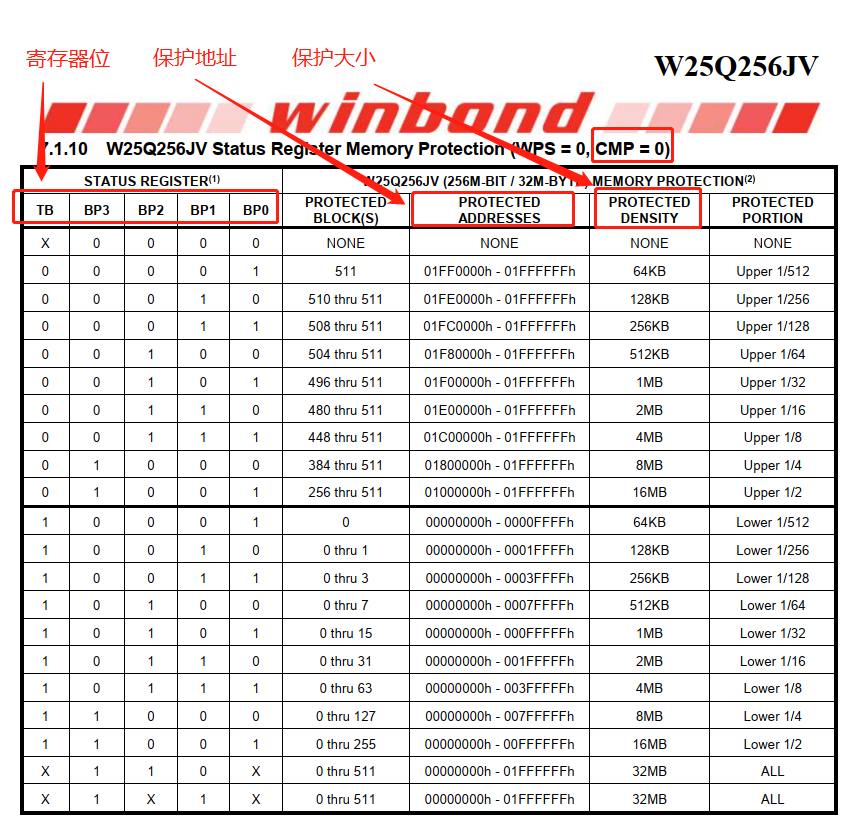

      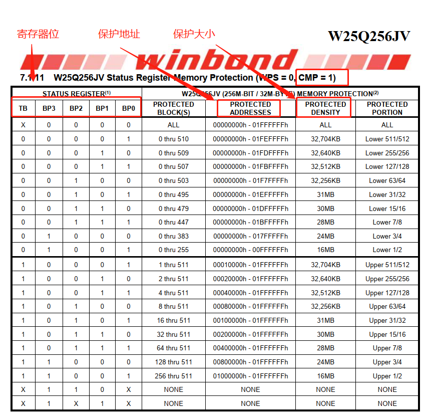
   2. 查看flash对应的寄存器位，如下图寄存器1(S0-S7)和2(S8-S15)，对应的红色框内的位是写保护相关的参数，具体功能详情flash数据手册。

      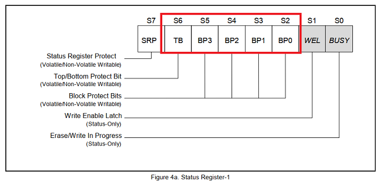

      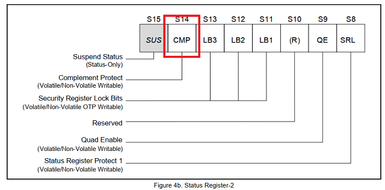
   3. 根据实际保护区域选合适的TB、BP3、BP2、BP1、BP0的值。如在上图的32M的flash中，需对flash进行前一半（0x0-0xFFFFFF）加上写保护，则选择如下如

      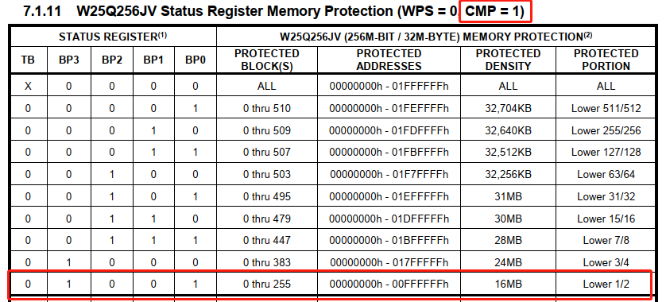

      那么对于的TB BP3 BP2 BP1 BP0为0 1 0 0 1，CMP为1，结合flash寄存器的分布，得知寄存器1(S0-S7)和2(S8-S15)的二进制分别为：
      0b00100100(0x24)、0b01000000(0x40)，则放在cmd参数32位整形数据十六进制为0x4024：寄存器1放在0-7位，寄存器2放在8-15位

      **注意：** 在写保护参数cmd中：第16位表示要写的flash寄存器2（S8-S15）（当写保护参数有CMP=0或1时，需要使用第16位，即设置cmd参数的第16位为1；在某些小容量flash的写保护参数没有使用CMP位，则第16位设置为0）。在上述的32M flash需要使用CMP位，则cmd的第16位为1，则cmd参数的十六进制为：0x14024，此时通过函数 `norflash_write_pretect(0x14024)` 可以把flash的前一半（0x0-0xFFFFFF）地址加上写保护。 当然，根据上图则可知解除全保护的cmd命令为0x10000 （当cmd为0，则内部系统重置命令为0x10000，因此cmd=0也可以完成解除写保护）。

      当使用CMP=0，则同理cmd=0x10064为写保护flash前一半区域，如下图。

      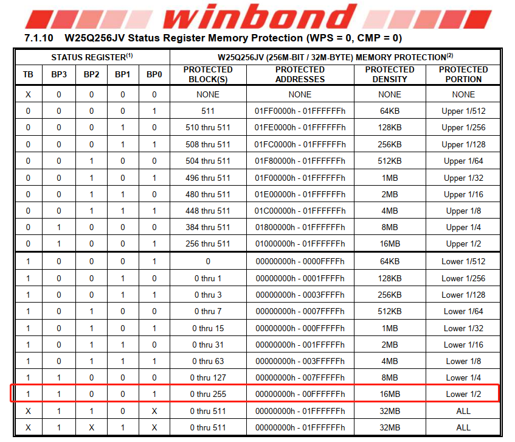

# 2.20. FLASH不完全指定物理空间用户区域使用

## 2.20.1. 示例

示例工程：示例工程实现需在 `demo_DevKitBoard/include/demo_config.h` 中开启宏 `USE_FLASH_TEST_DEMO`。

## 2.20.2. 使用说明

Note

注意事项： 本次示例的不完全指定物理空间用户区域使用方法 和 FLASH用户区域的（对应cpu的tools目录下）isd_config_rule文件中EXIF_ADR项有本质区别。

- FLASH用户区域方法的EXIF_ADR是工具会根据当前代码资源等情况在FLASH靠后分配一块可用大小的空间，系统运行后会分配用户区域给用户使用。
- FLASH不完全指定物理空用户区域使用方法是和工具和系统毫无关联，系统运行后不会操作该空间，同时当在isd_config_rule（对应CPU路径）文件中EXIF_ADR配置使用，则用户同时可以使用EXIF_ADR区域。

比如：flash大小为16M，用户需要flash的最后4M地址不受系统相关限制且随意由用户自己掌控，则配置如下：

(1) 指定系统使用相关的物理空间，预留部分空间给用户，则在对应的CPU目录下的 `isd_config_rule.c` 文件改"FLASH_SIZE=12M;"，即系统使用12M，剩下4M给用户使用

(2) flash使用API接口。(具体说明，请参考 FLASH应用层API)

(3) main.c测试14M起始地址程序代码如下。

```c
#include "app_config.h"
#include "system/includes.h"
#include "fs/fs.h"
#include "asm/sfc_norflash_api.h"

static void user_flash_test(void)
{
    void flash_test(void);
    void flash_read_write_init(void);
    int flash_write_buff(u8 *buff, u32 addr, u32 len);
    int flash_read_buff(u8 *buff, u32 addr, u32 len);

#if 0
    flash_test();    //flash测试，flash_test函数可以测试起始地址到结束地址
#else
    //1.初始化flash硬件，并读取ID、容量等
    flash_read_write_init();    //初始化flash硬件，并读取ID、容量等

    unsigned char *buff = malloc(4096);
    if(buff){    //4096字节读写测试
        for (int i = 0; i < 4096; i++) {
            buff[i] = (unsigned char)i;
        }

        //2.写数据
        flash_write_buff(buff, 14*1024*1024, 4096);    //14M地址起始测试，写
        memset(buff, 0, 4096);

        //3.读数据
        flash_read_buff(buff, 14*1024*1024, 4096);    //14M地址起始测试，读

        for (int i = 0; i < 4096; i++) {
            if (buff[i] != (unsigned char)i) {    //校验
                printf("user_flash_test test err buff[%d] = %d \n",i,buff[i]);
                break;
            }
        }
        free(buff);
    }
    printf("---> user_flash_test over \n");
#endif

    while (1) {
        os_time_dly(10);
    }
}

static int c_main(void)
{
    os_task_create(user_flash_test, NULL, 12, 1000, 0, "user_flash_test");
    return 0;
}
late_initcall(c_main);
```

**Note**

注意： FLASH不完全指定物理空间用户区域 禁止使用 norflash_read 读函数。只能使用：norflash_origin_read。

## 2.20.3. 常见问题

（1）FLASH不完全指定物理空间用户区域使用方法和FLASH用户区域的isd_config_rule（对应CPU路径）文件中EXIF_ADR项有什么区别？

- FLASH用户区域方法readme.md的EXIF_ADR是工具会根据当前代码资源等情况在FLASH靠后分配一块可用大小的空间，系统运行后会分配用户区域给用户使用。
- FLASH不完全指定物理空间用户区域使用方法是和工具和系统毫无关联，系统运行后不会操作改空间，同时当在isd_config_rule（对应CPU路径）文件中EXIF_ADR配置使用，则用户同时可以使用EXIF_ADR区域。

# 2.21. 配置项存储使用说明

## 2.21.1. 示例

示例工程：具体示例代码详见 `apps/common/example/peripheral/flash/flash_syscfg/main.c`，示例工程实现需在 `apps/demo/demo_DevKitBoard/include/demo_config.h` 中开启宏 `USE_FLASH_SYSCFG_TEST_DEMO`。

## 2.21.2. 常见问题

（1）除开系统中已用的配置项索引, 用户可用的配置项索引范围是什么

答:配置项索引一共为255个，有些配置索引为SDK保留配置项，用户不得占用。用户可通过 `syscfg_id.h` 文件查看用户可用配置项范围，从 `CFG_USER_DEFINE_BEGIN` 到 `CFG_USER_DEFINE_END` 共59个配置项。

（2）配置项最大配置长度是多少?

答:4095字节

（3）配置项区域大小如何配置?

- 对于具有VM空间优化配置的SDK版本（需要查看是否有如下配置：VM_MAX_PAGE_ALIGN_SIZE_CONFIG、VM_MAX_SECTOR_ALIGN_SIZE_CONFIG和VM_DEFRAG_SIZE），最大支持配置为64k，通过修改 `cpu/wl82/tools/isd_config_rule.c` 进行配置，如下图所示：

  ```c
  cpu/wl82/tools/isd_config_rule.c
  ```

  ```c
  VM_ADR=0;  [设置VM]
  VM_LEN=32K;  //最大支持64K
  VM_OPT=0;
  ```
- 对于没有VM空间优化配置的SDK版本，默认最大配置为32k。

（4）报[write overflow]错误?

答：一般情况下，对vm进行写入时，vm空间不够的情况下会首先进行碎片整理，但是当碎片整理后，vm的空间还是不够时，就会报[write overflow]的错误，有如下解决方法：

- 可以在 `cpu/wl82/tools/isd_config_rule.c` 文件中增大VM_LEN的长度。需要注意的是，该方法只适用于具有VM空间优化配置的SDK版本（需要查看是否有如下配置：VM_MAX_PAGE_ALIGN_SIZE_CONFIG、VM_MAX_SECTOR_ALIGN_SIZE_CONFIG和VM_DEFRAG_SIZE）
- 对于没有VM空间优化配置的SDK版本，可以适当减少VM_DEFRAG_SIZE的碎片整理百分比，如果配置太小，写vm时会出现频繁整理，这样会减少flash的使用寿命，同时频繁擦写flash也会造成频繁开关中断，影响都DAC和ADC，从而造成播歌录音出现卡顿，因此使用适当调整改参数。

（5）为减少频繁写入VM导致的长时间关中断问题

答：提供VM写入缓存机制，可在 `lib_system_config.c` 中打开 `const int config_vm_save_in_ram_enable = 1;` 调用 `vm_in_ram_update()` 才主动刷新到flash。

# 2.22. FLASH自定义读取寄存器数据说明

## 2.22.1. 示例

示例工程： 具体示例代码详见 `apps/common/example/peripheral/flash/flash_register/main.c`，示例工程实现需在 `apps/demo/demo_DevKitBoard/include/demo_config.h` 中开启宏 `USE_FLASH_REGISTER_TEST_DEMO`。

## 2.22.2. API说明

**函数**

|        |                                     |
| ------ | ----------------------------------- |
| 函数   | void norflash_enter_spi_code(void); |
| 描述   | 用户自定义操作flash的第一步骤       |
| 参数   | void                                |
| 返回值 | void                                |

**函数**

|        |                                    |
| ------ | ---------------------------------- |
| 函数   | void norflash_exit_spi_code(void); |
| 描述   | 用户自定义操作flash的最后步骤      |
| 参数   | void                               |
| 返回值 | void                               |

**函数**

|        |                                |
| ------ | ------------------------------ |
| 函数   | void norflash_spi_cs(char cs); |
| 描述   | flash片选                      |
| 参数   | cs: 0拉低，1拉高               |
| 返回值 | void                           |

**函数**

|        |                                                   |
| ------ | ------------------------------------------------- |
| 函数   | void norflash_spi_write_byte(unsigned char data); |
| 描述   | 用户往flash写字节                                 |
| 参数   | data:需要写入的字节                               |
| 返回值 | void                                              |

**函数**

|        |                                  |
| ------ | -------------------------------- |
| 函数   | u8 norflash_spi_read_byte(void); |
| 描述   | 用户从flash读字节                |
| 参数   | void                             |
| 返回值 | 一个字节的数据                   |

**函数**

|        |                                                                                       |
| ------ | ------------------------------------------------------------------------------------- |
| 函数   | int norflash_wait_busy(void);                                                         |
| 描述   | 用户等flash忙结束                                                                     |
| 参数   | void                                                                                  |
| 返回值 | 返回值0则不忙，返回非0则判忙等待超时（出现这种情况则说明flash出问题或者程序出问题了） |

**Note**

注意事项： 所有的调用上述函数应该统一放在一个函数里执行，且函数都要放在spi_code段，参考本示例 在norflash_enter_spi_code和norflash_exit_spi_code框内：所有代码和数据和const数组和变量只能在sdram或者内部sram， 数据和const数组和变量可以指定内部sram的SEC_USED(.sram)或者sdram的SEC_USED(.data)，如果系统的代码是跑flash（即打开了CONFIG_SFC_ENABLE宏），则不能加打印信息。

# 2.23. FLASH用户区域使用说明

## 2.23.1. 示例

示例工程： 具体示例代码详见 `apps/common/example/peripheral/flash/flash_user/main.c`，示例工程实现需在 `apps/demo/demo_DevKitBoard/include/demo_config.h` 中开启宏 `USE_FLASH_USER_TEST_DEMO`。

## 2.23.2. 常见问题

（1）如何修改用户flash可用空间大小?

答：找到配置文件 `cpu/wl82/tools/isd_config_rule.c`,然后修改对应预留区的 XXX_LEN 配置，如：修改EXIF预留区的 EXIF_LEN

```c
cpu/wl82/tools/isd_config_rule.c
```

```c
XXX_LEN
```

```c
EXIF_LEN
```

```c
#保留客户使用
EXIF_ADR=AUTO;
EXIF_LEN=0x1000;
EXIF_OPT=1;
```

（2）用户flash可用空间地址如何指定?

答:不能够强制指定,工具会根据当前代码资源等情况在FLASH靠后分配一块可用大小的空间, 如果空间不够编译的时候会报错

（3）用户如何对用户区域进行配置？

答：具体说明，请参考 reserved

# 2.24. 烧写文件到指定的flash地址说明

## 2.24.1. 操作说明

1. 修改write_file_to_flash.bat，修改需要烧写的文件名称和flash地址。
2. 进入烧写模式，显示盘符后，双击write_file_to_flash.bat文件。

## 2.24.2. 常见问题

（1）如何获取需要烧写的预留区的flash地址？

答：(具体说明，请参考 FLASH用户区域使用说明 )。

# 2.25. FLASH自定义空间作为EXTFLAH设备

## 2.25.1. 示例

示例工程： apps/demo/demo_DevKitBoard;

```c
apps/demo/demo_DevKitBoard
```

代码实现： apps/common/fat_nor/extflash.c。

```c
apps/common/fat_nor/extflash.c
```

## 2.25.2. 软件配置

在配置文件 `cpu/wl82/tools/isd_config_rule.c` 中，配置EXTFLAH空间大小，工具会根据当前代码资源等情况在FLASH靠后一块可用大小的空间作为EXTFLASH。

```c
cpu/wl82/tools/isd_config_rule.c
```

```c
//截取flash的一段空间作为extflash设备
EXTFLASH_ADR=AUTO;
EXTFLASH_LEN=0x100000;
EXTFLASH_OPT=1;
```

在配置文件 `apps/demo/demo_DevKitBoard/include/app_config.h` 中，使能宏 `TCFG_EXTFLASH_ENABLE`。

```c
apps/demo/demo_DevKitBoard/include/app_config.h
```

```c
#define TCFG_EXTFLASH_ENABLE      1
```

## 2.25.3. 文件系统读写EXTFLASH

将EXTFLASH挂载至文件系统，即可通过文件系统接口读写EXTFLASH，示例代码 `apps/common/fat_nor/extflash.c` -> `extflash_mount_to_fs_test()` 函数。

```c
apps/common/fat_nor/extflash.c
```

```c
extflash_mount_to_fs_test()
```

## 2.25.4. 枚举为mass_storage设备

将EXTFLASH枚举为mass_storage设备，插入电脑即可读写。在配置文件 `apps/demo/demo_DevKitBoard/include/app_config.h` 中，使能宏 `TCFG_EXTFLASH_UDISK_ENABLE`， 通过宏 `TCFG_PC_ENABLE`使能USB从机模式，并增加USB设备类MASSSTORAGE_CLASS，如下：

```c
apps/demo/demo_DevKitBoard/include/app_config.h
```

```c
#define TCFG_EXTFLASH_UDISK_ENABLE      1
```

```c
#define USB_DEVICE_CLASS_CONFIG (CDC_CLASS | MASSSTORAGE_CLASS)
```

# 2.26. USB读写测速

## 2.26.1. 主机模式U盘读写

- UDISK在文件系统JLFAT情况下使用的读写测速，对于fwrite（实际直接写入UDISK设备未进缓存）和fread直接测速，创建文件各读写十次，每个文件读写总数据量6M，每次读写固定byte，取每次读写固定byte后速度的平均值作为结果
- 测试条件：
- 开发板AC7921A
- sys_clk = 360000000, ddr_clk = 250000000, hsb_clk = 180000000, lsb_clk = 48000000, sfc_clk = 96000000
- UDISK：支持USB 3.2 GEN1的U盘
  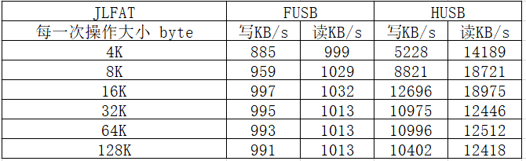

## 2.26.2. 从机模式（读卡器模式）读写速度测试

使用测试软件进行读写测试。sd卡驱动配置1线和4线模式，使用class10的卡进行测试。

测试条件：

开发板AC7921A

sys_clk = 360000000, ddr_clk = 250000000, hsb_clk = 180000000, lsb_clk = 40000000, sfc_clk = 96000000

SDIO:40M

1.sdio的1线模式

FUSB:
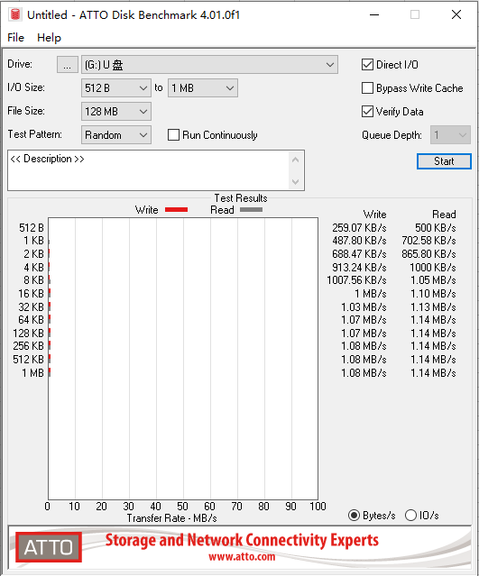

HUSB:

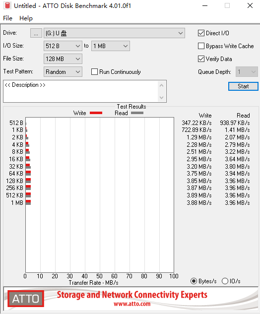

2.sdio的4线模式

FUSB:

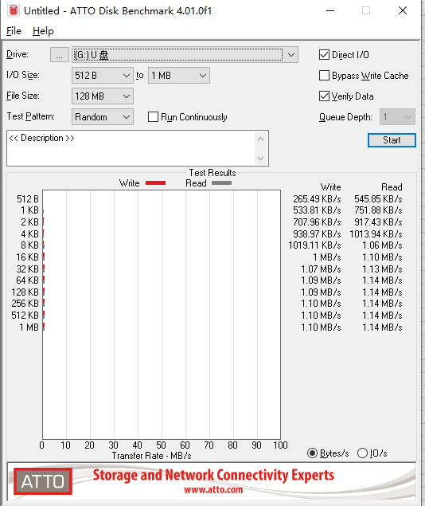

HUSB:

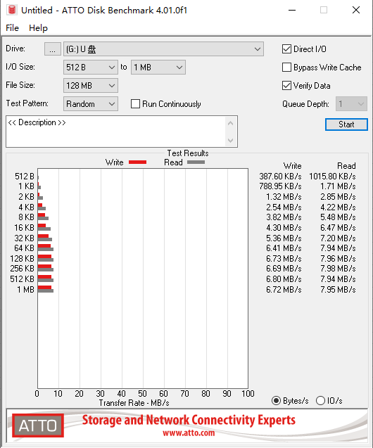

# 2.27. SD读写测速

- SD在文件系统JLFAT情况下使用的读写测速，对于fwrite（实际直接写入SD设备未进缓存）和fread直接测速，创建文件各读写十次，每个文件读写总数据量6M，每次读写固定byte，取每次读写固定byte后速度的平均值作为结果
- 测试条件：
- 开发板AC7921A
- sys_clk = 360000000, ddr_clk = 250000000, hsb_clk = 180000000, lsb_clk = 48000000, sfc_clk = 96000000
- SDIO:48M
- TF卡：CLASS10卡 簇大小32k
  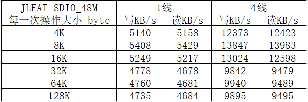
- sd nand
  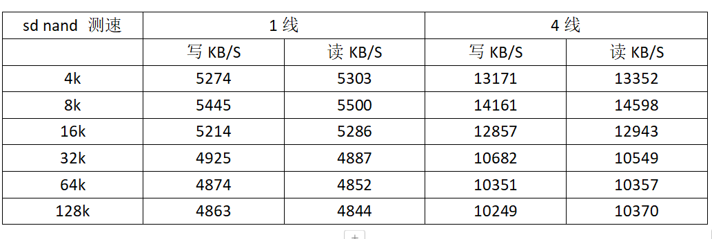

# 2.28. CAN

## 2.28.1. 配置说明

1.在板级文件 `apps/.../board.h` 中打开宏 `TCFG_CAN_ENABLE` 并进行对应配置

```c
#define TCFG_CAN_ENABLE                     1
```

## 2.28.2. 应用实例

示例演示：

- 演示阻塞式接收、非阻塞式接收、多帧发送与接收、二次修改相关配置、高帧率接收等。

example: 具体示例代码详见 `apps/common/example/peripheral/can/can_test.c`，示例工程实现需自行定义 `USE_CAN_TEST_DEMO`。

```c
apps/common/example/peripheral/can/can_test.c
```

```c
#define USE_CAN_TEST_DEMO
```

- 高帧率接收需要在 `apps/common/config/log_config/lib_driver_config.c` 中使能 `config_can_soft_enhanced_rx_mode_en` 以及使用非阻塞式接收。

```c
apps/common/config/log_config/lib_driver_config.c
```

```c
#define config_can_soft_enhanced_rx_mode_en
```

阻塞式接收受到程序执行等因素影响无法处理高帧率的情况，尤其是帧间隔小于4ms的情况，实际取决于应用层中单次执行 `dev_read()` 的周期。正常的非阻塞式接收受打印、应用层可能需要使能的其他中断影响，无法用于帧间隔小于1~2ms的情况，具体也是取决于应用层程序。高帧率接收模式可支持帧间隔小于1ms的情况，数据会在 `can_rx_task` 中读出，实测帧间隔为0.1ms时也能正常接收。

```c
dev_read()
```

```c
can_rx_task
```

## 2.28.3. 常见问题

（1）CAN过滤器如何使用？

答：① `accept_id(x)` 和 `mask_id(x)` 是对应关系，`accept_id(x)`配置过滤器的ID，`mask_id(x)`是将 `accept_id(x)`对应bit忽略，例如配置 `accept_id0 = 0x123` 和 `mask_id0 = 0x03` 最终过滤器配置的id为0x120。 `accept_rtr(x)` 指示的是只接受 0数据帧 或 1远程帧，并非0/1使能关系。

```c
accept_id(x)
```

```c
mask_id(x)
```

```c
accept_id0 = 0x123
```

```c
mask_id0 = 0x03 最终过滤器配置的id为0x120。 accept_rtr(x)
```

```c
0数据帧 或 1远程帧
```

② CAN的基础模式下只有单滤波器并且只能设置标准帧ID的高8位，对应mask_id同样是高8位，且无法设置rtr位。增强模式下分单滤波器与双滤波器、标准帧与扩展帧的配置差异，单滤波器下无论是标准帧还是扩展帧都能配置全ID的bit；双滤波器下仅支持高16bit。标准帧id只有11bit，所以是全bit匹配且支持rtr位。扩展帧id有29bit，仅支持高16bit且不支持rtr位。

（2）CAN的总线一直在报错，如何解决？

答：① 优先排查波特率是否正确设置。波特率计算公式： `baudrate = (lsb_clk)/((tseg1+tseg2+3)*(brp+1)*2)` 其中 `tseg1 = pts+pbs2`，`tseg2 = pbs2`。

```c
baudrate = (lsb_clk)/((tseg1+tseg2+3)*(brp+1)*2)
```

② 在增强模式下，可以调用 `dev_ioctl(can_Hdl, IOCTL_CAN_GET_ERROR_CAPTURE, (int *)arg)` 根据返回的arg或者debug的log，查询错误表格获取错误位置和错误原因。表格如下；

```c
dev_ioctl(can_Hdl, IOCTL_CAN_GET_ERROR_CAPTURE, (int *)arg)
```

（3）两个792同时挂载在CAN总线上时，出现接收异常，无法正常接收数据？

答：实际上接收数据没有异常，只是接收次数debug异常。三种解决方式：1、降低波特率；2、使用ioctl命令 `IOCTL_CAN_SET_RECV_WAIT_WHILE`，更换使用轮询状态位的方式，但是会额外增加cpu占用；3、使用ioctl命令 `IOCTL_CAN_SET_RECV_NON_BLOCK_ENABLE`，更换使用非阻塞式接收方式，在中断回调中自行获取数据后自行处理。

```c
IOCTL_CAN_SET_RECV_WAIT_WHILE
```

```c
IOCTL_CAN_SET_RECV_NON_BLOCK_ENABLE
```

（4）CAN在发送数据的时候，通过逻辑分析仪或示波器抓取信号存在部分BIT异常置位？

答：这是CAN协议的填充错误判断，在需要位填充的段内，连续检测到6位相同的电平时，会把末位电平翻转。但不影响CAN设备通信。

Note

说明：

- 错误信息查询表格

arg的bit6-bit7：00-位错误；01-格式错误；10-填充错误；11其他错误

arg的bit5：0-发送时发生的错误；1-接收时发生的错误

arg的bit0-bit4：查看下表

| 二进制  | 十六进制 | 错误信息     |
| ------- | -------- | ------------ |
| 0b00011 | 0x03     | 帧起始       |
| 0b00010 | 0x02     | ID BIT 28-21 |
| 0b00110 | 0x06     | ID BIT 20-18 |
| 0b00100 | 0x04     | SRTR位       |
| 0b00101 | 0x05     | IDE位        |
| 0b00111 | 0x07     | ID BIT 17-13 |
| 0b01111 | 0x0F     | ID BIT 12-5  |
| 0b01110 | 0x0E     | ID BIT 4-0   |
| 0b01100 | 0x0C     | RTR位        |
| 0b01101 | 0x0D     | 保留位1      |
| 0b01001 | 0x09     | 保留位0      |
| 0b01011 | 0x0B     | 数据长度代码 |
| 0b01010 | 0x0A     | 数据区       |
| 0b01000 | 0x08     | CRC序列      |
| 0b11000 | 0x18     | CRC界定符    |
| 0b11001 | 0x19     | 应答         |
| 0b11011 | 0x1B     | 应答界定     |
| 0b11010 | 0x1A     | 帧结束       |
| 0b10010 | 0x12     | 中止         |
| 0b10001 | 0x11     | 活动错误标志 |
| 0b10110 | 0x16     | 消极错误标志 |
| 0b10011 | 0x13     | 控制位误差   |
| 0b10111 | 0x17     | 错误定义符   |
| 0b11100 | 0x1C     | 溢出标志     |

（5）各个IOCTL_CAN_GET形参返回的arg对应信息是什么？

答：① `IOCTL_CAN_GET_INTERRUPT_SOURCE` ：BIT0-接收中断；BIT1-发送中断；BIT2-错误中断；BIT3-数据溢出中断；BIT5-被动错误中断；BIT6-仲裁丢失中断，当该bit返回为1时可调用 `IOCTL_CAN_GET_ARBITRATION_LOSS` 获取仲裁丢失位置；BIT7-总线错误中断。各个错误BIT置1后可调用 `IOCTL_CAN_GET_ERROR_CAPTURE` 获取详细错误信息。

② `IOCTL_CAN_GET_STATUS_CALLBACK` ：对应BIT置1为以下状态，置0则为相反状态；BIT0-接收缓冲器中存在数据；BIT1-接收数据已溢出；BIT2-发送缓冲器已释放；BIT3-发送请求处理完毕；BIT4-正在接收信息；BIT5-正在发送信息；BIT6-已超过设置的报警限制值，当该BIT置1，说明达到 `IOCTL_CAN_SET_ERROR_ALARM_CNT` 中预设的报警值，可以通过调用 `IOCTL_CAN_GET_RX_ERROR_CNT` 和 `IOCTL_CAN_GET_TX_ERROR_CNT` 查看发送或者接收时产生的错误次数；BIT7-CAN总线处于工作状态。

## 2.28.4. API参考

CAN dev_ioctl function select

CAN_MAGIC
IOCTL_CAN_SET_DMA_FRAMES
设置can-dma缓存数据

IOCTL_CAN_SET_INTERRUPT_ENABLE
中断使能

IOCTL_CAN_SET_INTERRUPT_DISABLE
中断失能

IOCTL_CAN_SET_MODE
修改can参数

IOCTL_CAN_SET_FILTER
修改can参数

IOCTL_CAN_SET_RATE
修改can参数

IOCTL_CAN_SET_RECV_WAIT_SEM
阻塞式接收-使用信号量,占用中断

IOCTL_CAN_SET_RECV_WAIT_WHILE
阻塞式接收-使用查询中断标志位，内部会清除中断

IOCTL_CAN_SET_RECV_NON_BLOCK_ENABLE
非阻塞式接收-使用中断接收，需要配置IOCTL_CAN_SET_IRQ_CB

IOCTL_CAN_SET_RECV_NON_BLOCK_DISABLE
非阻塞式接收-使用中断接收，需要配置IOCTL_CAN_SET_IRQ_CB

IOCTL_CAN_SET_IRQ_CB
非阻塞式接收会占用一个can接收中断，需要配置回调函数进行接收数据获取

IOCTL_CAN_SET_ERROR_ALARM_CNT
设置错误报警计数值，当达到预设值后会给STATUS_CALLBACKE的bit6置1

IOCTL_CAN_GET_INTERRUPT_SOURCE
获取中断源

IOCTL_CAN_GET_STATUS_CALLBACK
获取当前状态

IOCTL_CAN_GET_ARBITRATION_LOSS
获取仲裁丢失位

IOCTL_CAN_GET_ERROR_CAPTURE
错误捕获

IOCTL_CAN_GET_RX_ERROR_CNT
获取接收错误计数

IOCTL_CAN_GET_TX_ERROR_CNT
获取发送错误计数

IOCTL_CAN_GET_PUT_REGISTER_INFO
寄存器参数读取

---

CAN event interrupt

enum **can_event_isr_t**
Values:
enumerator CAN_EVENT_CLEAR_INTERRUPT
清除中断标志位

enumerator CAN_EVENT_RECEIVE_INTERRUPT
接收中断

enumerator CAN_EVENT_TRANSMIT_INTERRUPT
发送中断

enumerator CAN_EVENT_ERROR_INTERRUPT
错误中断

enumerator CAN_EVENT_DATA_OVERFLOW_INTERRUPT
数据溢出中断

enumerator CAN_EVENT_ALL_INTERRUPT_DISABLE
关闭所有中断

enumerator CAN_EVENT_ERROR_PASSIVE_INTERRUPT
被动错误中断

enumerator CAN_EVENT_ARBITRATION_LOST_INTERRUPT
仲裁丢失中断

enumerator CAN_EVENT_BUS_ERROR_INTERRUPT
总线错误中断

---

CAN event status

enum **can_event_status_t**
Values:
enumerator CAN_EVENT_RXFIFO_HAVE_DATA_STATUS
接收缓冲器中有数据

enumerator CAN_EVENT_RECEIVE_DATA_OVERFLOW_STATUS
接收数据已溢出

enumerator CAN_EVENT_TRANSMISSION_BUFFER_RELEASE_STATUS
发送缓冲器已释放

enumerator CAN_EVENT_TRANSMIT_END_STATUS
发送请求已处理完毕

enumerator CAN_EVENT_RECEIVING_DATA_STATUS
正在接收数据

enumerator CAN_EVENT_SENDING_DATA_STATUS
正在发送数据

enumerator CAN_EVENT_ERROR_OVERFLOW_STATUS
错误计数器达到设置的报警限制值

enumerator CAN_EVENT_BUS_IS_IDLE_STATUS
总线空闲状态

---

CAN mode

enum **can_mode_t**
Values:
enumerator CAN_MODE_BASICCAN
标准模式

enumerator CAN_MODE_ENHANCED
增强模式

enumerator CAN_MODE_MAX

---

CAN filter mode

enum **can_filter_t**
Values:
enumerator CAN_FILTER_DOUBLE_STAND
2 x 16bit filters

enumerator CAN_FILTER_DOUBLE_EXTEND
2 x 16bit filters

enumerator CAN_FILTER_SINGLE_STAND
1 x 32bit filter

enumerator CAN_FILTER_SINGLE_EXTEND
1 x 32bit filter

enumerator CAN_FILTER_MAX

---

CAN data format

enum **can_request_type_t**
Values:
enumerator CAN_REQUEST_DATA_TYPE
数据帧

enumerator CAN_REQUEST_REMOTE_TYPE
远程帧

enumerator CAN_REQUEST_MAX

---

CAN frame format

enum **can_frame_format_t**
Values:
enumerator CAN_FRAME_STANDARD_FORMAT
标准帧

enumerator CAN_FRAME_EXTENDED_FORMAT
扩展帧

enumerator CAN_FRAME_MAX

---

CAN irq callback

const struct device_operations **can_dev_ops**
rate = (lsb_clk)/((TSEG1+TSEG2+3)*(brp+1)*2) ///

struct **can_baudrate_t**
Public Members:
u16 brp
分频系数

u16 sjw
再同步补偿最大宽度，节点与总线再同步每一bit最多允许的补偿偏差

u16 aligned0
仅对齐作用

u8 sam
采样次数:0-采样1次;1-采样3次

u8 tseg2
PBS2

u8 tseg1
PBS1+PTS

---

struct **can_rx_filter_t**
Public Members:
can_filter_t filter_mode
ecan 双接收滤波器模/

u8 accept_rtr0
接收的rtr0

u8 accept_rtr1
接收的rtr1

u8 mask_rtr0
接收rtr0的屏蔽位

u8 mask_rtr1
接收rtr1的屏蔽位

u8 aligned
仅对齐作用

u32 accept_id0
接收的id0;扩展帧在双滤波器开启的状态下仅支持ID的高16位，即bit 28-bit 13

u32 accept_id1
接收的id1;扩展帧在双滤波器开启的状态下仅支持ID的高16位，即bit 28-bit 13

u32 mask_id0
接收id0的屏蔽位

u32 mask_id1
接收id1的屏蔽位

---

struct **can_data_t**
Public Members:
u32 id

u8 dlc

u8 data_format
标准帧/扩展帧标记位

u8 rtr

u8 aligned

u8 data[8]

---

struct **can_platform_data**
Public Members:
int rx_pin

int tx_pin

u8 stm
增强型can自检测模式使能

u8 lom
增强型can监听模式使能

u8 priority
can中断优先级-用于阻塞式接收-信号量/非阻塞式接收

u8 cpu_id
can中断注册cpu-用于阻塞式接收-信号量/非阻塞式接收

can_mode_t can_mode
can 模式

can_baudrate_t baudrate
波特率设置

can_rx_filter_t filter
滤波器ID设置

---

struct **can_cb_t**
Public Members:
int (*cb_func)(void *priv, can_data_t *data)

void *cb_priv

# 2.29. CANFESTIVAL

## 2.29.1. 应用实例

示例演示：

- 演示协议栈主站、从站使用等。

example: 具体示例代码详见 `apps/common/example/third_party/canfestival/canfestival_main.c`。

```c
apps/common/example/third_party/canfestival/canfestival_main.c
```

## 2.29.2. 配置说明

1.在板级文件 `apps/.../board.h` 中打开宏 `TCFG_CAN_ENABLE` 并打开宏 `TCFG_CANOPEN_ENABLE`，若运行CANOPEN务必将CAN的模式设定为增强模式。

```c
apps/.../board.h
```

```c
TCFG_CAN_ENABLE
```

```c
TCFG_CANOPEN_ENABLE
```

```c
#define TCFG_CAN_ENABLE 1
#if TCFG_CAN_ENABLE
#define TCFG_CANOPEN_ENABLE 1
#if TCFG_CANOPEN_ENABLE
#undef TCFG_CAN_ENABLE
#define TCFG_CAN_ENABLE 1
#endif
#endif
```

2.在CanFestival配置文件 `apps/common/example/third_party/canfestival/include/jieli/canopen_def.h` 中选择CanFestival的主从机模式以及定时中断使用的定时器。最好不要同时使能主站和从站，可以主站和从站动态切换

```c
#define TCFG_CANOPEN_MASTER_ENABLE 0 /*!< CANOPEN协议栈作主机模式*/
#define TCFG_CANOPEN_SLAVE_ENABLE 1 /*!< CANOPEN协议栈作从机模式*/
#define TCFG_CANOPEN_TIMER_10MS_ENABLE 1 /*!< 使能选择使用系统定时器最小支持10ms心跳时间，失能选择使用独立定时器最小支持1ms心跳时间*/
```

```c
apps/common/example/third_party/canfestival/include/jieli/canopen_def.h
```

## 2.29.3. 流程说明

1.canfestival根目录下的canfestival_main.c是CANOPEN协议栈的主函数入口；/src是CanFestival的.c源文件；/include是CanFestival的.h源文件；/drive是CanFestival的接收与发送等接口文件，包括字典.c/.h文件；/bsp是CanFestival的CAN和Timer硬件接口。

2.CANOPEN协议栈首先在canfestival_main.c创建主线程，并对硬件和协议栈进行初始化。

```c
static void canopen_main_task(void *p)
{
    canopen_can_init();//can硬件初始化

#if TCFG_CANOPEN_TIMER_10MS_ENABLE
    canopen_sys_timer_enable();//系统定时器初始化
#else
    canopen_solo_timer_enable();//独立定时器初始化
#endif

    canopen_driver_init(); //can接收任务与定时中断调用任务创建

#if TCFG_CANOPEN_MASTER_ENABLE
    unsigned char nodeID = 0x01;
    setNodeId(&TestMaster_Data, nodeID);//设置canfestival主机ID
    setState(&TestMaster_Data, Initialisation);//初始化canopen NMT网络主机设备
    setState(&TestMaster_Data, Operational);//进入操作状态
#endif

#if TCFG_CANOPEN_SLAVE_ENABLE
    unsigned char nodeID = 0x03;
    setNodeId(&TestSlave_Data, nodeID);//设置canfestival从机ID
    setState(&TestSlave_Data, Initialisation);//初始化canopen NMT网络从机设备
    setState(&TestSlave_Data, Operational);//进入操作状态
#endif

    while (1) {
        /*应用层，可在此处添加canopen协议条件发送报文。SDO或PDO*/
        os_time_dly(50);
    }
}
```

Note

说明：

- SDK中CANOPEN协议栈主站中仅有2s一次的心跳报文；从站集合了心跳报文、SDO、PDO等报文，具体请查看 `/drive/TestSlave.eds` 和 `/drive/TestSlave.od`。其中 `/drive/TestSlave.c` 和 `/drive/TestSlave.h` 是对应从站字典文件生成的.c/.h文件。
- CANOPEN协议栈最重要的是字典文件，如果想基于SDK示例中的字典文件进行二次开发，建议熟悉一下CANOPEN协议栈的字典文件内部定义以及CanFestival字典文件如何使用，其中CanFestival字典文件需要配置对应的python环境才能打开.od文件。.od字典文件准备好后建议导出的.c/.h文件名和SDK中使用的主站从站.c/.h文件名一致，否则会报错，需要根据错误修改代码。

```c
/drive/TestSlave.eds
```

```c
/drive/TestSlave.od
```

```c
/drive/TestSlave.c
```

```c
/drive/TestSlave.h
```

## 2.29.4. 常见问题

（1）协议栈启动后容易出现死机、复位、CPU占用高等情况。

答：排查是否配置了阻塞式接收死等方式，如果是则改用信号量的方式；检查是否CanFestival定时中断过于频繁，可以根据实际心跳报文的设置时间，调整定时回调的时间，注意不能动态调整回调时间。

（2）心跳报文设定在1s一次，用不上10ms或者1ms的回调，如何更改为100ms回调？

答：在 `canfstival/bsp/bsp_canopen.c` 中找到系统定时器或独立定时器的配置函数进行修改。修改bsp_canopen.c后需要同步修改 `canfstival/include/jieli/timerscfg.h` 中的协议栈心跳时间

```c
///canfstival/bsp/bsp_canopen.c
......
//独立定时器修改方法
void canopen_timer_run(void)
{
    u8 precesion;
    //precesion = 10;//单位0.1ms
    //从1ms回调修改为100ms回调
    precesion = 1000;//单位0.1ms
    ......
}
//系统定时器修改方法
void canopen_sys_timer_enable(void)
{
    os_sem_create(&canopen_timer_sem, 0);
    /*sys_hi_timer_add(NULL, canopen_sys_timer_isr, 10);*/
    sys_hi_timer_add(NULL, canopen_sys_timer_isr, 100);//从10ms回调修改为100ms回调
}
```

```c
///canfstival/include/jieli/timerscfg.h
......
```
