# 5. 显示部分

# 5.1. 概述

**Overview**

* 杰理UI为自研UI系统，支持多国语言文字，音标显示，垂直列表，水平列表，按键控件，表盘控件，滑块控件，等等
* 自带UI绘制工具，字库工具，支持多种字体文字显示
* 支持一层软件图层
* 支持无切线显示
* 支持横屏竖显
* 支持8080总线（接口PAP,EMI），支持单线SPI屏
* ui宏CONFIG_UI_ENABLE
* ui库ui.a,ui_font.a,ui_res.a,ui_draw.a四个库文件
* ui公共目录位置 apps/common/ui该文件夹下为UI驱动和LCD驱动文件
* AC791x_UI目前采用整帧发送数据（未采用分行）

---

# 5.2. LCD Driver

## 5.2.1. Overview

本文主要介绍AC792N SDK 的LCD驱动框架。目前LCD驱动已支持MIPI屏、RGB屏、MCU屏和SPI屏。

LCD Driver在SDK中的作用，是将各种类型屏幕和显示接口抽象出一套统一的接口，供给上层应用调用。

在AC792N芯片里，上述显示接口，DSI推MIPI屏、DPI推RGB/MCU屏、PAP(Parallel Active Port)推MCU屏、SPI可推SPI屏。图片中的DMM(Display Memory Management)模块负责从memory读取显示数据，再把显示数据提供给显示接口(仅DSI、DPI显示接口支持联动DMM)。

LCD Driver使用了device设备接口层，也就是说，上层应用需要通过 `dev_open()`、`dev_ioctl()`等接口来对LCD进行操作。开发者可以查看 `app/common/lcd/lcd_driver/lcd_driver.c`，并根据实际屏幕驱动需求进行修改。

一般来说，开发者只需要添加相应屏幕的配置文件，如 `lcd_480x480_st7701s.c`，即可驱动屏幕，不需要修改 `lcd_driver.c`。

目前驱动不支持多屏显示。

## 5.2.2. LCD驱动接口

### 5.2.2.1. Device接口

**1. 打开设备**

操作：使用 `dev_open()`打开设备。接口会遍历注册的屏幕配置，并根据屏幕的配置信息初始化显示接口等。

参数：arg0-设备名；arg1-NULL。

返回值：打开的设备的句柄。后续其他操作可通过该句柄对该设备进行操作。

注意：无。

```c
lcd_hdl = dev_open("lcd", NULL);
```

**2. 关闭设备**

操作：使用 `dev_close()`关闭设备。

参数：lcd设备open时获得的句柄。

返回值：固定为0。

注意：无。

```c
dev_close(lcd_hdl);
```

**3. IOCTL控制**

LCD支持的IOCTL命令：

```c
#define IOCTL_LCD_RGB_SET_ISR_CB _IOW('F', 1, sizeof(void *(*)(void)))
#define IOCTL_LCD_RGB_WAIT_FB_SWAP_FINISH _IOW('F', 2, sizeof(int))
#define IOCTL_LCD_RGB_START_DISPLAY _IOW('F', 3, sizeof(void *))
#define IOCTL_LCD_RGB_GET_LCD_HANDLE _IOR('F', 4, sizeof(struct lcd_dev_drive **))
#define IOCTL_LCD_RGB_SET_LINE_ISR_CB _IOW('F', 5, sizeof(int (*)(int)))
#define IOCTL_LCD_RGB_WAIT_LINE_FINISH _IOW('F', 6, sizeof(int))
```

- **IOCTL_LCD_RGB_SET_ISR_CB**

功能：设置中断回调函数。仅MIPI和RGB屏支持。

参数：回调函数地址。

返回值：固定为0。

```c
dev_ioctl(lcd_hdl, IOCTL_LCD_RGB_SET_ISR_CB, (u32)lcd_isr_cb);
```

- **IOCTL_LCD_RGB_WAIT_FB_SWAP_FINISH**

功能：等待FB交换BUF地址介绍。

参数：图像buf地址。

返回值：固定为0。

```c
dev_ioctl(lcd_hdl, IOCTL_LCD_RGB_WAIT_FB_SWAP_FINISH, 0);
```

- **IOCTL_LCD_RGB_START_DISPLAY**

功能：启动显示传入的图像buf。

参数：图像buf的地址。

返回值：固定为0。

```c
dev_ioctl(lcd_hdl, IOCTL_LCD_RGB_START_DISPLAY, (u32)display_buf);
```

- **IOCTL_LCD_RGB_GET_LCD_HANDLE**

功能：获取屏幕配置数据句柄

参数：存放句柄的指针变量的地址。

返回值：固定为0。

```c
struct lcd_dev_drive *lcd;
dev_ioctl(lcd_hdl, IOCTL_LCD_RGB_GET_LCD_HANDLE, (u32)&lcd);
```

- **IOCTL_LCD_RGB_SET_LINE_ISR_CB**

功能：等待行数据发送中断回调函数。

参数：回调函数地址。

返回值：固定为0。

```c
dev_ioctl(lcd_hdl, IOCTL_LCD_RGB_SET_LINE_ISR_CB, (u32)line_isr_cb);
```

- **IOCTL_LCD_RGB_WAIT_LINE_FINISH**

功能：等待行数据发送完成。

参数：无。

返回值：固定为0。

```c
dev_ioctl(lcd_hdl, IOCTL_LCD_RGB_WAIT_LINE_FINISH, (u32)0);
```

### 5.2.2.2. 其他接口

```c
void WriteCOM(u8 cmd); ///< 发送1 byte命令
void WriteDAT_8(u8 dat); ///< 发送1 byte数据
void WriteDAT_one_page(u8 *dat, int len); ///< 写一帧图像数据
```

MCU屏和SPI屏，通过 `WriteCOM()`和 `WriteDAT_8()`接口来发送init_code。

MCU屏和SPI屏，通过调用 `WriteDAT_one_page()`来向屏幕发送图像数据。

## 5.2.3. 添加LCD屏驱方法

添加屏幕驱动，需要修改三个位置：

1. **添加屏幕配置**。将屏幕类型、IO分配、init_code、屏厂提供的配置(如HFP)等信息，添加到屏驱配置文件中。可参考已支持的屏驱配置，比如开发板标配的屏幕配置文件 `lcd_480x800_st7701s.c`。开发者需要实现如下结构体配置信息。

```c
struct lcd_dev_drive {
    const char *logo; ///< LCD logo。例如"st7701s"
    enum LCD_IF type; ///< LCD 类型。例如 LCD_MIPI、LCD_RGB等
    int (*init)(void *_data); ///< 初始化接口。
    int (*draw)(void *_data); ///< 显示一帧图像的接口
    int (*uninit)(void *_data); ///< 反初始化接口
    void (*bl_ctrl)(void *_data, u8 onoff); ///< 背光控制接口
    union lcd_dev_info *dev; ///< LCD配置信息结构体的地址。需根据type类型选择配置项
};
```

2. **修改板级配置**。参考[《屏接口说明》]()章节进行IO分配，并修改板级配置文件(比如board_develop_AC7926A.h)里LCD的部分的IO。

```c
// board.h
#define TCFG_LCD_BL_VALUE 1 ///< 背光点亮时的IO电平，0-低电平，1-高电平。
#define TCFG_LCD_RESET_IO IO_PORTA_15 ///< 复位脚。
#define TCFG_LCD_BL_IO -1 ///< 背光控制脚。
#define TCFG_LCD_RS_IO IO_PORTB_01 ///< 指令/数据选择脚，MCU屏和SPI屏特有。
#define TCFG_LCD_CS_IO IO_PORTB_00 ///< 片选信号脚。
#define TCFG_LCD_SPI_INTERFACE "spi2" ///< 分配给屏的SPI口，SPI屏特有。
#define TCFG_LCD_TE_ENABLE 1 ///< TE(Tearing effect)放撕裂功能使能。MCU屏和SPI屏特有。
#define TCFG_LCD_TE_IO IO_PORTA_14 ///< TE信号脚。
#define TCFG_LCD_SDA_IO IO_PORTC_00 ///< SDA脚。部分屏幕需要单独的init code发送口，如lcd_480x800.c
#define TCFG_LCD_SCL_IO IO_PORTC_01 ///< SCL脚。同上。

// 在board.c，注册lcd配置
LCD_PLATFORM_DATA_BEGIN(lcd_data)
.lcd_name = TCFG_LCD_DEVICE_NAME,
.lcd_io = {
    .backlight = TCFG_LCD_BL_IO,
    .backlight_value = TCFG_LCD_BL_VALUE,
    .lcd_reset = TCFG_LCD_RESET_IO,
    .lcd_cs = TCFG_LCD_CS_IO,
    .lcd_rs = TCFG_LCD_RS_IO,
},
LCD_PLATFORM_DATA_END()
```

另外，MCU屏使用到了PAP接口(配置参考如下)，SPI屏使用到了SPI接口(配置参考专门的SPI文档)，因此需要对相应接口参数进行配置。

```c
// board.h
#define TCFG_PAP_ENABLE 1 ///< PAP接口使能。
#define TCFG_PAP_DATA_WIDTH PAP_DATAWIDTH_8BIT ///< PAP接口位宽，可选8bit或16bit。
#define TCFG_PAP_DATA_ENDIAN PAP_ENDIAN_BE ///< 大小端选择
#define TCFG_PAP_WRITE_ACTIVE_LEVEL PAP_WR_LEVEL_LOW ///< WR写有效电平
#define TCFG_PAP_READ_ACTIVE_LEVEL PAP_RD_LEVEL_LOW ///< RD读有效电平
#define TCFG_PAP_READ_ENABLE 0 ///< 读使能
#define TCFG_PAP_WE_IO IO_PORTA_12 ///< WR脚
#define TCFG_PAP_RE_IO -1 ///< RD脚

// board.c
PAP_PLATFORM_DATA_BEGIN(pap_data)
.datawidth = TCFG_PAP_DATA_WIDTH,
.endian = TCFG_PAP_DATA_ENDIAN,
.pwe = TCFG_PAP_WRITE_ACTIVE_LEVEL,
.pre = TCFG_PAP_READ_ACTIVE_LEVEL,
.rd_en = TCFG_PAP_READ_ENABLE,
.we_port = TCFG_PAP_WE_IO,
.re_port = TCFG_PAP_RE_IO,
.port_sel = PAP_PORT_A, ///< PAP出口选择。可选A或B端口
.timing_setup = PAP_TS_0_CLK, ///< TS时序配置
.timing_hold = PAP_TH_0_CLK, ///< TH时序配置
.timing_width = PAP_TW_1_CLK, ///< TW时序配置
PAP_PLATFORM_DATA_END();

//timing_setup(ts) timing_hold(th) timing_width(tw):数据传输配置
/*
写时钟信号:
          __________         _________
pwe=H:  ____________|        |_____________|        |__________
pwe=L:  ____________         _____________         __________
                    |________|             |_______|
数据信号:
                    ________________________       ______
data:   _____|                        |_____________________|
        |     |        |        |
        |     |        |        |
ts,tw,th:     |        |        |
        |<--ts->|<--tw--->|<-th->|
        |     |        |        |

ts:0-3,ts个lsb系统时钟宽度
tw:0-15,0-->16个lsb系统时钟宽度,1-15：tw个lsb系统时钟宽度
th:0-3,th个lsb系统时钟宽度
*/
```

3. **添加分辨率配置**。在lcd_config.h中添加相应屏幕分辨率。

```c
// 在lcd_config.h
// MIPI LCD
#if TCFG_LCD_MIPI_ST7701S_480x800
#define LCD_W 480
#define LCD_H 800
#endif
```

## 5.2.4. 屏幕配置文件说明

```c
int (*init)(void *_data); ///< 初始化接口
int (*draw)(void *_data); ///< 显示一帧图像的接口
int (*uninit)(void *_data); ///< 反初始化接口
void (*bl_ctrl)(void *_data, u8 onoff); ///< 背光控制接口
union lcd_dev_info *dev; ///< LCD配置信息结构体的地址。需根据type类型选择配置项
```

开发者在添加新屏驱时，一般只需要在SDK中找到同一类型屏幕的配置文件，稍加修改即可。下面对 `struct lcd_dev_drive`部分参数进行说明。

**init函数**：初始化屏幕的接口。AC792N SDK在这个接口里将屏厂提供的init_code通过显示接口或者专用的通讯接口发送给屏幕初始化（MIPI屏使用DSI接口的command模式发送DCS命令集）。一般情况下，AC792N 的init_code发送，RGB屏使用单独的CLK+DAT两线串行接口发送，MCU屏使用pap接口发送，SPI屏则直接用spi接口发送。

**draw函数**：显示一帧图像。AC792N SDK中只有MCU屏(`LCD_MCU`类型)和SPI屏需要实现此接口。

**uninit函数**：顾名思义。

**bl_ctrl函数**：背光控制接口。

**LCD配置信息结构体**：

- **MIPI屏**

```c
struct mipi_dev {
    struct imd_dmm_info info; ///< DMM配置
    struct pll4_info pll4; ///< MIPI PLL时钟配置
    struct te_mode_ctrl te_mode; ///< TE模式配置
    struct dsi_lane_mapping lane_mapping; ///< 使用的硬件lane接口配置。使用多少lane，是否对调P/N等配置
    struct dsi_video_timing video_timing; ///< DIS video时序配置。前肩、后肩等参数
    struct dsi_timing timing; ///< DSI时序设置
    u8 dsi_open_flag; ///< DSI已经打开标志
    unsigned int reset_gpio; ///< 复位IO
    void (*lcd_reset)(unsigned int reset_gpio); ///< 复位函数
    void (*lcd_reset_release)(unsigned int reset_gpio); ///< 复位释放函数
    const u8 *cmd_list; ///< DCS初始化命令集
    u16 cmd_list_item; ///< DCS初始化命令集占用空间大小
    u8 debug_mode; ///< 调试模式。使能时，DSI驱动会将DCS命令集打印出
};
```

- **RGB屏**

```c
struct imd_dev {
    struct imd_dmm_info info; ///< DMM配置
    struct te_mode_ctrl te_mode; ///< TE模式配置
    enum LCD_LSB data_out_mode; ///< 输出数据大小端。仅输出RGB565支持
    enum NCYCLE ncycle; ///< 每像素时钟数。如数据格式RGB888，接口位宽8bit，cycle = 24bit / 8bit =3 cycle
    enum PHASE raw_odd_phase; ///< 奇行相位
    enum PHASE raw_even_phase; ///< 偶行相位
    enum RAW_MODE raw_mode; ///< RAW模式选择
    enum LCD_PORT data_width; ///< 数据位宽
    enum LCD_GROUP lcd_group; ///< 输出端口选择
    u8 avout_mode; ///< 保留
    u8 show_buf_mode; ///< 显示buf模式
    u8 set_io_hd; ///< IO强驱配置。所dat、hsy、vsy、clk、den脚都会根据该配置设置强驱档位。
    u8 dclk_set; ///< dclk使能以及极性配置
    u8 sync0_set; ///< 配置为DE/HSYNC/VSYNC
    u8 sync1_set; ///< 配置为DE/HSYNC/VSYNC
    u8 sync2_set; ///< 配置为DE/HSYNC/VSYNC
    u8 sync3_set; ///< Reversed
    u8 dpi_open_flag; ///< dpi打开标志
    u32 clk_cfg; ///< dpi clk时钟配置。dpi模块的时钟配置
    u32 dclk_cfg; ///< dclk时钟配置。dpi输出的dclk的时钟源和时钟分频配置
    struct imd_dpi_timing timing; ///< 时序参数
};
```

- **MCU屏**

MCU屏可以用两种 `.type`去推，分别是 `LCD_MCU_SINGLE_FRAME`和 `LCD_MCU`。它们有如下区别：

- **LCD_MCU_SINGLE_FRAME**：发送init_code和cmd时使用PAP接口发送，发送图像数据时，使用DPI接口(的EMI模式)发送。该模式下因为使用了DPI，需要用到 `struct imd_dev`参数配置。需要注意，LCD的IO分配必须使用MCU接口中的PORT-A才能用该模式。

(可能有人会疑惑，PAP和DPI是两个独立的接口，怎么可以这样用？可以看下《屏接口说明》章节的IO分配，PAP接口的PORT-A与RGB接口的PORT-A的信号线出线是一样的。)

- **LCD_MCU**：init_code、cmd和图像数据全部都通过pap接口来发送。在需要大小端数据转换情况下，lcd_driver会需要malloc多一块buf用于存放转换后的数据，内存空间有点浪费。

**LCD_MCU_SINGLE_FRAME模式推屏的优点**是可以使用DMM模块，这样，DMM模块的一些特性就可以用上，例如大小端转换、颜色增强等。

建议AC792N推MCU屏使用LCD_MCU_SINGLE_FRAME模式。由于LCD_MCU_SINGLE_FRAME模式使用到了IMD的配置参数，相对复杂，因此调屏过程可以先用LCD_MCU模式，将init_code和PAP接口等调通后，再改为LCD_MCU_SINGLE_FRAME模式来调整IMD参数。

- **SPI屏**

```c
struct spi_dev {
    struct imd_dmm_info info; ///< DMM配置
    struct te_mode_ctrl te_mode; ///< TE模式配置
    enum LCD_LSB data_out_mode; ///< 输出数据大小端。选择MODE_BE时，将进行大小端数据转换。
    char *interface_name; ///< 使用的SPI口名。比如"SPI2"
    u8 spi_open_flag; ///< SPI LCD已经打开标志
};
```

注意：SPI屏参数如果配置了大小端转换(即 `.data_out_mode = MODE_BE`)，lcd_driver将会malloc一块buf空间用于存放转换后的图像数据，空间占用多一些。

## 5.2.5. 屏幕旋转配置

AC792N支持旋转 `ROTATE_90`、`ROTATE_180`、`ROTATE_270`度。配置方式：

1. **修改配置文件旋转角度**

驱动会根据 `.rotate`的值，来旋转图像地址空间。

```c
// lcd_xxx.c
REGISTER_IMD_DEVICE_BEGIN(lcd_mcu_dev) = {
    .info = {
        // ...
        .len = LEN_256,
        .interlaced_mode = INTERLACED_NONE,
        .rotate = ROTATE_0, ///< 旋转
        // ...
REGISTER_IMD_DEVICE_END()
```

2. **调整分辨率宽/高**

如果旋转角度选择了 `ROTATE_90`和 `ROTATE_270`，`LCD_W`和 `LCD_H`需要对调。该配置影响LVGL生成的图像分辨率。

```c
// lcd_config.h
/* #define LCD_W 320 */
/* #define LCD_H 480 */
#define LCD_W 480
#define LCD_H 320
```

## 5.2.6. TE(Tearing effect)使用说明

MCU/SPI屏显示为避免出现撕裂问题(Tearing effect)，lcd driver需要检测到帧TE信号后才开始推数据给屏幕，并且推屏速率需要遵循2倍关系:

1. 不能让读屏指针赶上写屏指针。写屏ram的数据时间(W)应该小于等于2倍MCU/SPI屏的自刷新时间(R)。
2. 不能让写屏指针赶上读屏指针。写屏ram的数据时间(W)应该大于MCU/SPI屏的自刷新时间(R)。即 `lcd_te_int_time < lcd_push_data_time <= 2 * lcd_te_int_time`

可调整接口推屏速率。推屏接口的时钟频率决定了推数据速率，各个接口的时钟频率调整位置:

1. SPI接口——修改波特率和LSB时钟;
2. PAP接口——修改TS、TH、TW时钟以及LSB时钟;(PAP的WR速率 = LSB / (TS + TH + TW))
3. DPI接口——修改 `.dclk_cfg`的时钟源和分频值;

当然，也可以调整MCU/SPI屏刷新帧率，需要咨询屏厂怎么修改。

### 5.2.6.1. 开启TE功能

在board.h中配置宏来使能TE功能：

```c
#define TCFG_LCD_TE_ENABLE 1 ///< 非0开启TE
#define TCFG_LCD_TE_IO IO_PORTA_14 ///< 配置TE脚
```

开启TE功能后，驱动会在lcd初始化时配置 `TCFG_LCD_TE_IO`的引脚为外部中断脚，以判断TE信号的到来。UI刷新图像给驱动，lcd驱动会等待TE信号来之后立马开始推一帧图像。

### 5.2.6.2. TE调试

为了方便调试TE，使得推屏速率需要遵循2倍关系，驱动提供一个调试方式，可配置 `LCD_TE_DEBUG_EN`为1来使能。

```c
#define LCD_TE_DEBUG_EN 0 ///< 开启TE调试。通过打印判断推屏速率是否在合适范围。

// TE速率判断逻辑
if (lcd_te_int_time > lcd_push_data_time) {
    // lcd推数据太快
    printf("TE issue! lcd push data is too fast. diff_time = %d\n", lcd_te_int_time - lcd_push_data_time);
} else if (lcd_te_int_time * 2 < lcd_push_data_time) {
    // lcd推数据太慢
    printf("TE issue! lcd push data is too slow. diff_time = %d\n", lcd_push_data_time - lcd_te_int_time * 2);
} else {
    // lcd推数据速率刚刚好
    printf("TE normal! diff_time = %d\n", lcd_te_int_time * 2 - lcd_push_data_time);
}
```

其中，`lcd_te_int_time`为通过TE中断获得的TE信号时间间隔。`lcd_push_data_time`为lcd驱动开始推数据给屏幕到结束的时间。

## 5.2.7. 注意点

1. 由于lcd driver和spi/pap都使用了device设备这一套接口，如果屏幕使用了相应的外设，那么就对设备注册有顺序要求。SDK开机启动流程中会通过 `devices_init()`对板级 `board_xxx.c`里注册的设备进行基本的初始化操作，设备的初始化顺序与板级里设备注册顺序有关，注册得越靠前，越早初始化。LCD驱动里，SPI屏需要依赖spi接口通信，MCU屏需要pap接口，因此，当驱动的屏幕为SPI屏/MCU屏，spi/pap设备注册应早于lcd设备。参考如下顺序：

```c
REGISTER_DEVICES(device_table) = {
    { "pap",   &pap_dev_ops, (void *)&pap_data  }, ///< MUC屏使用了pap，pap设备需要放在lcd前面注册
    { "spi2",  &spi_dev_ops, (void *)&spi2_data }, ///< SPI屏使用了spi2，spi2设备需要放在lcd前面注册
    { "lcd",   &lcd_dev_ops, (void *)&lcd_data  },
};
```

---

# 5.3. ui

## 5.3.1. ui 控件介绍

- **基础控件**：LVGL原生基础组件
- **容器控件**：LVGL原生容器组件
- **菜单控件**：杰理开发的专属菜单组件（以库形式提供）
- **组合控件**：由基础控件组合而成的复合组件
- **自定义控件**：杰理开发的专属组件（以库形式提供）
- **歌词控件**：歌词控件demo案例演示

## 5.3.2. 基础控件

### 页面

页面控件是lvgl中非常重要的一个控件，它可以用来创建多个页面，并且可以切换不同的页面。页面控件有三种类型，分别是**标准页面**、**顶层页面**、**动态页面**。

```c
lv_obj_t * page = lv_page_create(lv_scr_act());
lv_obj_set_size(page, 200, 150);
lv_obj_center(page);
```

使用UI设计工具创建页面：[页面文档]()

### 按钮

按钮控件，用于触发事件。是LVGL中最基础的控件之一。

```c
lv_obj_t * btn = lv_btn_create(lv_scr_act());
lv_obj_center(btn);
lv_obj_add_event_cb(btn, my_event_handler, LV_EVENT_CLICKED, NULL);
```

使用UI设计工具创建按钮：[按钮文档]()

### 图片按钮

**图片按钮**和**按钮**控件类似，但是图片按钮可以设置多个图片，根据不同状态显示不同图片。

```c
lv_obj_t * imgbtn = lv_imgbtn_create(lv_scr_act());
lv_imgbtn_set_src(imgbtn, LV_IMGBTN_STATE_RELEASED, NULL, &img_normal, NULL);
lv_imgbtn_set_src(imgbtn, LV_IMGBTN_STATE_PRESSED, NULL, &img_pressed, NULL);
```

使用UI设计工具创建图片按钮：[图片按钮文档]()

### 标签

标签控件用于显示文本信息。

```c
lv_obj_t * label = lv_label_create(lv_scr_act());
lv_label_set_text(label, "Hello JieLi!");
lv_obj_align(label, LV_ALIGN_CENTER, 0, 0);
```

使用UI设计工具创建标签：[标签文档]()

### 图片

图片控件用于显示图片资源，支持图片遮罩、缩放等功能。

```c
LV_IMG_DECLARE(my_img);
lv_obj_t * img = lv_img_create(lv_scr_act());
lv_img_set_src(img, &my_img);
lv_obj_center(img);
```

使用UI设计工具创建图片：[图片文档]()

### 文本框

文本框控件，用于输入和显示文本。支持虚拟键盘输入、滚动条等功能。

```c
lv_obj_t * ta = lv_textarea_create(lv_scr_act());
lv_textarea_set_placeholder_text(ta, "请输入内容...");
lv_obj_set_size(ta, 200, 80);
lv_obj_center(ta);
```

使用UI设计工具创建文本框：[文本框文档]()

### 开关

开关控件用于切换两种状态，例如开启和关闭。用户可以通过点击控件来切换其选中状态。

```c
lv_obj_t * sw = lv_switch_create(lv_scr_act());
lv_obj_center(sw);
lv_obj_add_event_cb(sw, switch_event_handler, LV_EVENT_VALUE_CHANGED, NULL);
```

使用UI设计工具创建开关：[开关文档]()

### 数字微调器

数字微调器控件，用于输入数值。

```c
lv_obj_t * spinbox = lv_spinbox_create(lv_scr_act());
lv_spinbox_set_range(spinbox, 0, 100);
lv_spinbox_set_digit_format(spinbox, 3, 0);
lv_obj_center(spinbox);
```

使用UI设计工具创建数字微调器：[数字微调器文档]()

### 复选框

复选框控件用于在界面上显示一个复选框，用户可以勾选或者取消勾选。

```c
lv_obj_t * cb = lv_checkbox_create(lv_scr_act());
lv_checkbox_set_text(cb, "我同意");
lv_obj_center(cb);
```

使用UI设计工具创建复选框：[复选框文档]()

### 下拉框

下拉框控件，用于选择一组选项中的一个。

```c
lv_obj_t * dd = lv_dropdown_create(lv_scr_act());
lv_dropdown_set_options(dd, "选项1\n选项2\n选项3");
lv_obj_center(dd);
```

使用UI设计工具创建下拉框：[下拉框文档]()

### 进度条

进度条控件用于显示操作的进度。

```c
lv_obj_t * bar = lv_bar_create(lv_scr_act());
lv_bar_set_range(bar, 0, 100);
lv_bar_set_value(bar, 50, LV_ANIM_OFF);
lv_obj_center(bar);
```

使用UI设计工具创建进度条：[进度条文档]()

### Lottie动画

用于在LVGL中播放Lottie动画的控件。

```c
lv_obj_t * lottie = lv_lottie_create(lv_scr_act());
lv_lottie_set_src(lottie, "S:/anim.json");
lv_obj_center(lottie);
```

使用UI设计工具创建Lottie动画：[Lottie动画文档]()

### 帧动画

帧动画是一个通过一系列图片快速切换来模拟动画效果的控件。

```c
lv_obj_t * animimg = lv_animimg_create(lv_scr_act());
lv_animimg_set_src(animimg, frame_imgs, frame_count);
lv_animimg_start(animimg);
```

使用UI设计工具创建帧动画：[帧动画文档]()

### 图表

图表组件用于在屏幕上显示动态数据，支持多种类型的图表（如折线图、柱状图等），并允许用户自定义轴线和刻度设置。通过配置属性，可以调整网格线的数量、每个序列的数据点数以及更新模式等参数，以适应不同的应用场景。

```c
lv_obj_t * chart = lv_chart_create(lv_scr_act());
lv_obj_set_size(chart, 200, 150);
lv_obj_center(chart);
lv_chart_series_t * ser = lv_chart_add_series(chart, lv_palette_main(LV_PALETTE_RED), LV_CHART_AXIS_PRIMARY_Y);
lv_chart_set_next_value(chart, ser, 10);
```

使用UI设计工具创建图表：[图表文档]()

### 滑动条

滑动条控件用于在数值范围内选择一个值。滑动条控件通常用在需要用户输入数值的场景中，例如音量调节、亮度调节等。

```c
lv_obj_t * slider = lv_slider_create(lv_scr_act());
lv_slider_set_range(slider, 0, 100);
lv_obj_center(slider);
```

使用UI设计工具创建滑动条：[滑动条文档]()

### 弧线

弧线是一个用于显示进度的控件。

```c
lv_obj_t * arc = lv_arc_create(lv_scr_act());
lv_arc_set_range(arc, 0, 100);
lv_arc_set_value(arc, 75);
lv_obj_center(arc);
```

使用UI设计工具创建弧线：[弧线文档]()

### 仪表盘

仪表盘组件用于显示一个数值的范围，通常用来表示速度、温度等。

```c
lv_obj_t * gauge = lv_meter_create(lv_scr_act());
lv_obj_set_size(gauge, 200, 200);
lv_obj_center(gauge);
lv_meter_indicator_t * indic = lv_meter_add_needle_line(gauge, 4, lv_palette_main(LV_PALETTE_BLUE), -10);
lv_meter_set_indicator_value(gauge, indic, 40);
```

使用UI设计工具创建仪表盘：[仪表盘文档]()

## 5.3.3. 菜单控件

### 圆弧菜单

圆弧菜单是一种常见的菜单样式，支持**平铺列表**、**左圆弧列表**、**右圆弧列表**三种菜单风格。

使用UI设计工具创建圆弧菜单：[圆弧菜单文档]()

### 齿轮菜单

齿轮菜单是一种常见的菜单样式，支持**顺时针、逆时针**两种方向展开菜单项。

使用UI设计工具创建齿轮菜单：[齿轮菜单文档]()

### 列表菜单

列表菜单是一个用于显示列表的菜单。通过改变不同的**菜单样式**，可以实现不同风格的列表菜单，也支持用户自定义菜单样式。

使用UI设计工具创建列表菜单：[列表菜单文档]()

### 曲线菜单

曲线菜单控件，用于显示一个圆形菜单，菜单项会以曲线的方式展开。

使用UI设计工具创建曲线菜单：[曲线菜单文档]()

### 网格菜单

网格菜单是一个用于显示网格布局的菜单。通过改变不同的**菜单样式**，可以实现不同风格的网格菜单，也支持用户自定义菜单样式。

使用UI设计工具创建网格菜单：[网格菜单文档]()

### 万花筒菜单

万花筒菜单（Spiral Menu）是一种环形菜单，它将多个选项分布在圆形或环形路径上。用户可以通过旋转设备或点击屏幕上的不同位置来选择不同的选项。这种类型的菜单通常用于需要快速访问大量选项的应用程序中，例如游戏、导航应用和工具类应用程序等。

使用UI设计工具创建万花筒菜单：[万花筒菜单文档]()

## 5.3.4. 容器控件

### 通用容器

通用容器是一个用来包裹其他控件的容器控件，它可以包含任意数量的子控件，子控件可以是任意类型的控件。

```c
lv_obj_t * cont = lv_obj_create(lv_scr_act());
lv_obj_set_size(cont, 200, 150);
lv_obj_center(cont);

/* 在容器中添加一个按钮 */
lv_obj_t * btn_in = lv_btn_create(cont);
lv_obj_align(btn_in, LV_ALIGN_CENTER, 0, 0);

lv_obj_t * label_in = lv_label_create(btn_in);
lv_label_set_text(label_in, "按钮");
lv_obj_center(label_in);
```

使用UI设计工具创建通用容器：[通用容器文档]()

### Flex布局

Flex布局是一种一维布局，在UI工具上，只能在一个方向上排列元素，可以是水平方向，也可以是垂直方向。

```c
lv_obj_t * flex_cont = lv_obj_create(lv_scr_act());
lv_obj_set_size(flex_cont, 300, 200);
lv_obj_center(flex_cont);

/* 设置为水平排列 */
lv_obj_set_flex_flow(flex_cont, LV_FLEX_FLOW_ROW);

/* 往容器里添加 3 个按钮 */
for(int i = 0; i < 3; i++) {
    lv_obj_t * btn = lv_btn_create(flex_cont);
    lv_obj_set_size(btn, 80, 50);

    lv_obj_t * label = lv_label_create(btn);
    char buf[16];
    lv_snprintf(buf, sizeof(buf), "按钮%d", i+1);
    lv_label_set_text(label, buf);
    lv_obj_center(label);
}
```

使用UI设计工具创建Flex布局：[Flex布局文档]()

## 5.3.5. 歌词控件

演示案例：

只修改三个文件：`lv_example_lyrics_3.c`、`lvgl_main.c`、`gui_timeline_timeline.c`。

**注意**：demo中的所有歌词一起平移是用了一个父控件实现的 `father_of_curr_obj_0`。其他动画的回调函数逻辑都比较易懂，看代码即可。

除了 `gui_timeline_timeline.c`文件以外的文件在其他sdk里应该都是一样的，不一样将其复制过去即可，没有四个文件就自行创建。

### lv_example_lyrics_3.c

作用：放了歌词控件的创建、更新、释放函数

```c
/*
 * @file lv_example_lyrics_3.c
 *
 * 演示了如何调用 lv_lyrics 控件和蓝牙播歌实现简单的歌词播放 demo
 */
#include "../../lv_examples.h"
#if 1

#include "os/os_api.h"
#include "lvgl.h"

#define CONFIG_UI_RES_PATH CONFIG_ROOT_PATH // SD 路径
#define CONFIG_FONT_TTF_PATH "storage/sd0/C/xxx.ttf" //字体
#define LYRICS_LETTER_NUM_MAX 256

static char lyrics_example3_text[LYRICS_LETTER_NUM_MAX] = " ";
lv_obj_t *curr_obj_0 = NULL;
lv_obj_t **curr_obj_single = NULL;
int count_of_text = 0;
static char *test_text = "两只老虎跑的快";

//释放歌词
void lyrics_example3_clean(void){
    for (int i = 0;i<count_of_text;i++){
        lv_anim_del(curr_obj_single[i],NULL);
        lv_lyrics_destructor(curr_obj_single[i]);
        curr_obj_single[i] = NULL;
    }
}

//创建歌词
void lv_example_lyrics_3_letter( lv_obj_t *dest_scr, const char *text, uint16_t font_size, const char *font_file){
    lyrics_example3_clean();
    size_t text_len = strlen(text);
    uint32_t *letter_buf = (uint32_t *)lv_mem_alloc(sizeof(uint32_t) * text_len); // 空间大小最大不会超过 text_len * 4
    uint16_t letter_num = 0;
  
    // 解析字符串中的每一个 unicode
    int ofs = 0;
    while (ofs < text_len) {
        uint32_t letter;
        uint32_t letter_next;
        printf("[chili] %s %d\n", __func__, __LINE__);
        _lv_txt_encoded_letter_next_2(text, &letter, &letter_next, &ofs);
        printf("ofs = %d; letter = 0x%08x; letter_next = 0x%08x.", ofs, letter, letter_next);
        letter_buf[letter_num] = letter;
        printf("info.letter_buf[%d] = 0x%08x.", letter_num, letter_buf[letter_num]);
        letter_num++;
        assert(letter_num < LYRICS_LETTER_NUM_MAX); // 歌词字符数量过大，有需求再修改
    }
  
    count_of_text = letter_num;
    printf("letter_num = %d.", letter_num);
    printf("text_len = %d.",text_len);
  
    curr_obj_single = (lv_obj_t **)malloc(100*sizeof(lv_obj_t *));
    for (int i = 0;i<letter_num;i++){
        curr_obj_single[i] = lv_lyrics_create(dest_scr, font_file, font_size, letter_buf + i, 1);
        //lv_lyrics_set_pos(curr_obj_single[i], 0 + i*70, 0);//正常字间距
        lv_lyrics_set_pos(curr_obj_single[i], 0 + i*80, 150);
    }
    lv_mem_free(letter_buf);
    return;
}

//更新歌词
void lv_example_lyrics_3_text_input(void *dest_scr , char *new_text){
    size_t text_len = strlen(new_text);
    if (text_len > LYRICS_LETTER_NUM_MAX) {
        printf("error: new_text is too len. len = %d.", text_len);
        return;
    }
    printf("[%s] new lyrics is [%s]", __func__, new_text);
    memcpy(lyrics_example3_text, new_text, text_len);
    lyrics_example3_text[text_len] = '\0';
    lv_example_lyrics_3_letter(dest_scr,lyrics_example3_text, 64, CONFIG_FONT_TTF_PATH);
}

//调用示例
//在lvgl以外线程使用lvgl_rpc_post_func(),歌词创建在lv_layer_top()页面,test_text为输入歌词
//lvgl_rpc_post_func(lv_example_lyrics_3_text_input, 2, lv_layer_top() , test_text);

#endif
```

### lvgl_main.c

作用：在lvgl_v8_main_task中调用demo

变量全局声明和函数定义：

```c
static char *test_text = "测试歌词"; //歌词
lv_obj_t *father_of_curr_obj_0 = NULL; //父控件（可选）

void lyric_test_demo(void){
    extern void lv_example_lyrics_3_text_input(void *dest_scr , char *new_text);//外部引用
    lv_example_lyrics_3_text_input(father_of_curr_obj_0, test_text); //歌词更新函数
}
```

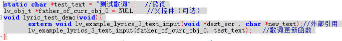

lvgl_v8_main_task中的调用：

```c
//jl_gui_init();
while (storage_device_ready() != true)
    os_time_dly(3);

father_of_curr_obj_0 = lv_obj_create(lv_scr_act());
lyric_test_demo();

gui_timeline_timeline_set_repeat_count(-1); // 无限循环（可选）
gui_timeline_timeline_set_period(500); // 设置一次动画的周期（可选）
gui_timeline_timeline_start(); // ✅ 启动动画
```

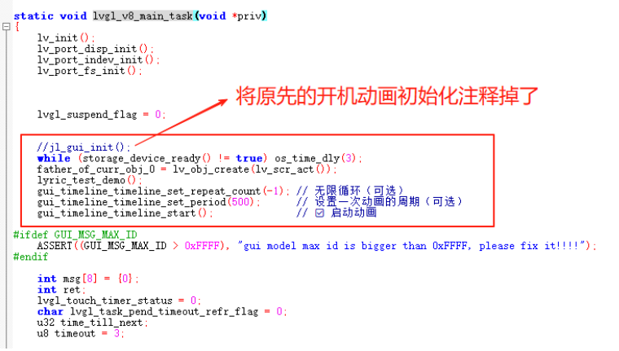

### gui_timeline_timeline.c

作用：实现时间轴动画，完成歌词的平移、旋转、缩放
除了gui_timeline_timeline.c文件以外的文件在其他sdk里应该都是一样的，不一样将其复制过去即可,没有四个文件就自行创建

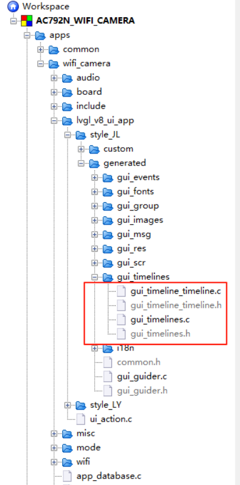

```c
/*Generate Code, Do NOT Edit!*/
#if LV_USE_GUIBUILDER_SIMULATOR
#include <stdio.h>
#endif

#include <stdlib.h>
#include "lvgl.h"
#include "../gui_guider.h"
#include "./gui_timeline_timeline.h"

extern lv_obj_t *father_of_curr_obj_0;//父控件
extern lv_obj_t **curr_obj_single;//单个字数组
bool first_init = 1; //是否第一次init
extern count_of_text; //text的字数

lv_timeline_timeline_t gui_timeline_timeline;

void set_center(lv_obj_t *obj,int statement){//设置控件obj在父控件中心,statement为1代表是歌词，为0表示普通控件
    lv_coord_t width;
    lv_coord_t height;
    lv_coord_t width_p;
    lv_coord_t height_p;
    lv_coord_t x;
    lv_coord_t y;
  
    if (statement){
        lv_lyrics_info *lyrics_info = (lv_lyrics_info *)lv_obj_get_user_data(obj);
        width = lyrics_info->curr_fontimg->header.w;
        height = lyrics_info->curr_fontimg->header.h;
        printf("width = %d , height = %d\n",width,height);
    }else{
        width = lv_obj_get_width(obj);
        height = lv_obj_get_height(obj);
    }
  
    lv_obj_t *parent = lv_obj_get_parent(obj);
    if (statement){
        width_p = 400;
        height_p = 400;
    }else{
        width_p = lv_obj_get_width(parent);
        height_p = lv_obj_get_height(parent);
    }
  
    x = width_p/2 - width/2;
    y = height_p/2 - height/2;
    printf("set_center x = %d,y = %d\n",x,y);
  
    if (statement){
        lv_lyrics_set_pos(obj, x, y);
    }else {
        lv_obj_set_x(obj, x);
        lv_obj_set_y(obj, y);
    }
}

//↓↓下面都是动画回调函数
void gui_timeline_set_lyrics_zoom(void *obj, int32_t v){//缩放动画
    lv_lyrics_info *lyrics_info = (lv_lyrics_info *)(((lv_obj_t *)obj)->user_data);
    lv_lyrics_set_zoom(obj, v, v);
    lv_lyrics_fontimg_redarw(obj);
}

void gui_timeline_set_lyrics_rotation(void *obj, int32_t v){//旋转动画
    lv_lyrics_info *lyrics_info = (lv_lyrics_info *)(((lv_obj_t *)obj)->user_data);
    lyrics_info->tc_point.x = 0.5f;
    lyrics_info->tc_point.y = 0.5f;
    lv_lyrics_set_rotation(obj, 0, 0, v);//在动画刷屏时才会绘制
    lv_lyrics_fontimg_redarw(obj);
}

void gui_timeline_init(struct _lv_anim_t *a){//开始动画的一些初始化
    if (first_init){
        lv_obj_set_width(father_of_curr_obj_0, 400);
        lv_obj_set_height(father_of_curr_obj_0, 400);
        set_center(father_of_curr_obj_0,0);
        lv_obj_set_style_bg_opa(father_of_curr_obj_0, LV_OPA_TRANSP, LV_PART_MAIN | LV_STATE_DEFAULT); // 背景透明
        lv_obj_set_style_border_width(father_of_curr_obj_0, 0, LV_PART_MAIN | LV_STATE_DEFAULT); // 去边框
        lv_obj_set_style_radius(father_of_curr_obj_0, 0, LV_PART_MAIN | LV_STATE_DEFAULT); // 去圆角
        lv_obj_set_style_shadow_width(father_of_curr_obj_0, 0, LV_PART_MAIN | LV_STATE_DEFAULT); // 去阴影
        first_init = 0;
    }
    set_center(father_of_curr_obj_0,0);
    for (int i = 0;i<count_of_text;i++){
        lv_lyrics_set_pos(curr_obj_single[i], 0 + i*80, 150);
    }
}

void gui_timeline_set_obj_y(void * var, int32_t v){//平移控件y坐标动画
    lv_obj_set_y((lv_obj_t *)var, v);
}

void gui_timeline_set_obj_x(void * var, int32_t v){//平移控件x坐标动画
    lv_obj_set_x((lv_obj_t *)var, v);
}

void gui_timeline_set_lyrics_y(void *var,int32_t v){//平移歌词动画
    lv_lyrics_set_y((lv_obj_t *)var, v);
}

void gui_timeline_timeline_end_cb(struct _lv_anim_t *a){//结束动画
    if(gui_timeline_timeline._repeat_count == -1) {
        gui_timeline_timeline_start();
    } else if(gui_timeline_timeline._repeat_count > 0) {
        gui_timeline_timeline._repeat_count--;
        gui_timeline_timeline_start();
    }
}

void gui_timeline_set_opa(void *var,int32_t v){//透明度渐变动画
    lv_obj_set_style_bg_img_opa((lv_obj_t *)var,v,LV_PART_MAIN);
}
//↑↑上面都是动画回调函数

int32_t gui_timeline_timeline_init(lv_ui *ui){//设置动画持续时间、执行开始时间、给obj绑定动画回调函数初始化
    gui_timeline_timeline.timeline = lv_anim_timeline_create();
  
    lv_anim_t home_view_1_1_init;
    lv_anim_init(&home_view_1_1_init);
    lv_anim_set_var(&home_view_1_1_init, father_of_curr_obj_0);
    lv_anim_set_start_cb(&home_view_1_1_init, gui_timeline_init);
    lv_anim_set_time(&home_view_1_1_init, 10);
    lv_anim_timeline_add(gui_timeline_timeline.timeline, 0, &home_view_1_1_init);
  
    lv_anim_t home_view_1_top_1_0_a;
    lv_anim_init(&home_view_1_top_1_0_a);
    lv_anim_set_var(&home_view_1_top_1_0_a, father_of_curr_obj_0);
    lv_anim_set_early_apply(&home_view_1_top_1_0_a, false);
    lv_anim_set_values(&home_view_1_top_1_0_a, 140, -300);
    lv_anim_set_exec_cb(&home_view_1_top_1_0_a, gui_timeline_set_obj_y);
    lv_anim_set_path_cb(&home_view_1_top_1_0_a, lv_anim_path_linear);
    lv_anim_set_time(&home_view_1_top_1_0_a, 2000);
    lv_anim_timeline_add(gui_timeline_timeline.timeline, 10, &home_view_1_top_1_0_a);
  
    lv_anim_t home_view_1_left_1_0_a;
    lv_anim_init(&home_view_1_left_1_0_a);
    lv_anim_set_var(&home_view_1_left_1_0_a, father_of_curr_obj_0);
    lv_anim_set_early_apply(&home_view_1_left_1_0_a, false);
    lv_anim_set_values(&home_view_1_left_1_0_a, 200, 500);
    lv_anim_set_exec_cb(&home_view_1_left_1_0_a, gui_timeline_set_obj_x);
    lv_anim_set_path_cb(&home_view_1_left_1_0_a, lv_anim_path_linear);
    lv_anim_set_time(&home_view_1_left_1_0_a, 2000);
    lv_anim_timeline_add(gui_timeline_timeline.timeline, 10, &home_view_1_left_1_0_a);
  
    for (int i = 0;i<count_of_text;i++){//给每个歌词都绑定下面的动画
        lv_anim_t lyrics_example3_play_anim_single;
        lv_anim_init(&lyrics_example3_play_anim_single); // 初时化动画变量
        lv_anim_set_var(&lyrics_example3_play_anim_single, curr_obj_single[i]); //设置动画关联的对象img
        lv_anim_set_early_apply(&lyrics_example3_play_anim_single, false);
        lv_anim_set_exec_cb(&lyrics_example3_play_anim_single, gui_timeline_set_lyrics_rotation); //设置动画执行的回调函数set_angle
        lv_anim_set_values(&lyrics_example3_play_anim_single, 0, (i%2 == 0)?600:(-600));
        lv_anim_set_time(&lyrics_example3_play_anim_single, 1000);
        lv_anim_set_path_cb(&lyrics_example3_play_anim_single, lv_anim_path_linear);
        lv_anim_set_playback_time(&lyrics_example3_play_anim_single, 1000);
        lv_anim_timeline_add(gui_timeline_timeline.timeline, 10, &lyrics_example3_play_anim_single);
  
        lv_anim_t home_view_1_top_1_0_letter;
        lv_anim_init(&home_view_1_top_1_0_letter);
        lv_anim_set_var(&home_view_1_top_1_0_letter, curr_obj_single[i]);
        lv_anim_set_early_apply(&home_view_1_top_1_0_letter, false);
        lv_anim_set_values(&home_view_1_top_1_0_letter, 150, (i%2==0)?100:50);
        lv_anim_set_exec_cb(&home_view_1_top_1_0_letter, gui_timeline_set_lyrics_y);
        lv_anim_set_path_cb(&home_view_1_top_1_0_letter, lv_anim_path_linear);
        lv_anim_set_time(&home_view_1_top_1_0_letter, 2000);
        lv_anim_timeline_add(gui_timeline_timeline.timeline, 10, &home_view_1_top_1_0_letter);
  
        lv_anim_t home_view_1_top_1_0_letter_opa;
        lv_anim_init(&home_view_1_top_1_0_letter_opa);
        lv_anim_set_var(&home_view_1_top_1_0_letter_opa, curr_obj_single[i]);
        lv_anim_set_early_apply(&home_view_1_top_1_0_letter_opa, false);
        lv_anim_set_values(&home_view_1_top_1_0_letter_opa, 255, 0);
        lv_anim_set_exec_cb(&home_view_1_top_1_0_letter_opa, gui_timeline_set_opa);
        lv_anim_set_path_cb(&home_view_1_top_1_0_letter_opa, lv_anim_path_linear);
        lv_anim_set_time(&home_view_1_top_1_0_letter_opa, 1000);
        lv_anim_timeline_add(gui_timeline_timeline.timeline, 10, &home_view_1_top_1_0_letter_opa);
    }
  
    lv_anim_t timeline_end_a;
    lv_anim_init(&timeline_end_a);
    lv_anim_set_time(&timeline_end_a, gui_timeline_timeline._period);
    lv_anim_set_deleted_cb(&timeline_end_a, gui_timeline_timeline_end_cb);
    lv_anim_timeline_add(gui_timeline_timeline.timeline, 1100, &timeline_end_a);
  
    return 0;
}

//↓↓下面都是默认存在的函数(无需修改)
void gui_timeline_timeline_start(){
    if (gui_timeline_timeline.timeline) {
        int32_t temp_repeat_count = gui_timeline_timeline._repeat_count;
        gui_timeline_timeline._repeat_count = 0;
        lv_anim_timeline_del(gui_timeline_timeline.timeline);
        gui_timeline_timeline._repeat_count = temp_repeat_count;
    }
    int32_t res = gui_timeline_timeline_init(&guider_ui);
    if(res != -1) {
        lv_anim_timeline_start(gui_timeline_timeline.timeline);
    }
}

void gui_timeline_timeline_stop(){
    gui_timeline_timeline._repeat_count = 0;
    if(gui_timeline_timeline.timeline) {
        lv_anim_timeline_stop(gui_timeline_timeline.timeline);
    }
}

void gui_timeline_timeline_delete(){
    gui_timeline_timeline._repeat_count = 0;
    gui_timeline_timeline._period = 0;
    if(gui_timeline_timeline.timeline) {
        lv_anim_timeline_del(gui_timeline_timeline.timeline);
        gui_timeline_timeline.timeline = NULL;
    }
}

void gui_timeline_timeline_set_period(uint32_t period){
    gui_timeline_timeline._period = period;
}

void gui_timeline_timeline_set_repeat_count(int32_t count){
    gui_timeline_timeline._repeat_count = count;
}
```

**说明**：demo中的所有歌词一起平移是用了一个父控件实现的 `father_of_curr_obj_0`。
**其他动画的回调函数逻辑都比较易懂，看代码即可，下面举个例子 ：

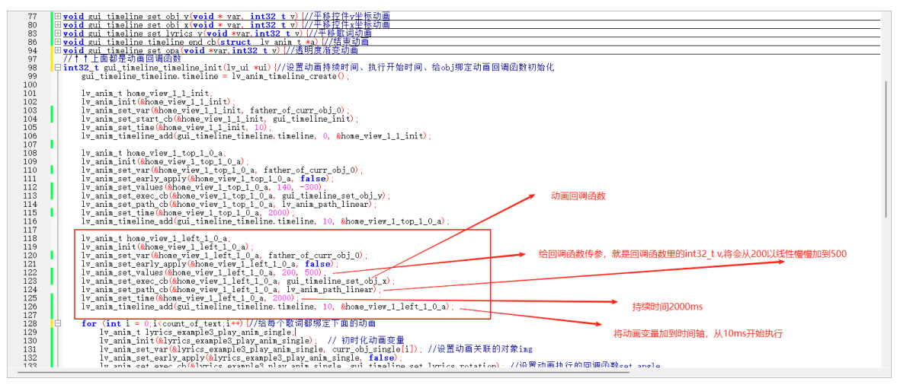

**最终效果：**

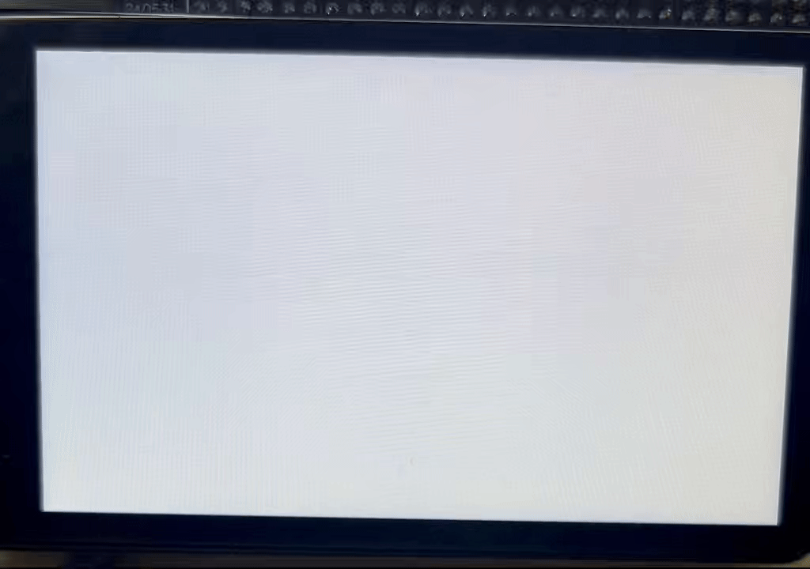

## 5.3.6. 高德地图离线显示demo

### 地图包下载地址

- 地图包1下载地址：[缩放等级15_北京市朝阳区]()
- 地图包2下载地址：[缩放等级16_北京市朝阳区]()

将地图包放到SD卡或其他存储设备中：

- 第一个地址放一个空文件的地址即可，用于放临时文件
- 第二个地址放存放这两个.gdp文件的文件夹的地址

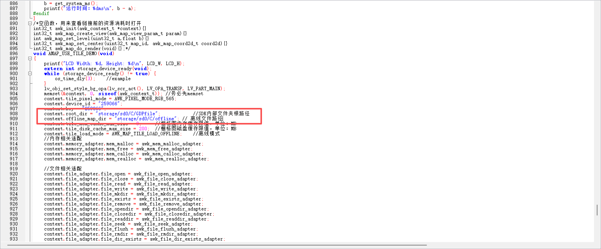

### 使用例

1. 打开wifi_camera工程
2. 修改以下文件：
   - `ui_action.c`

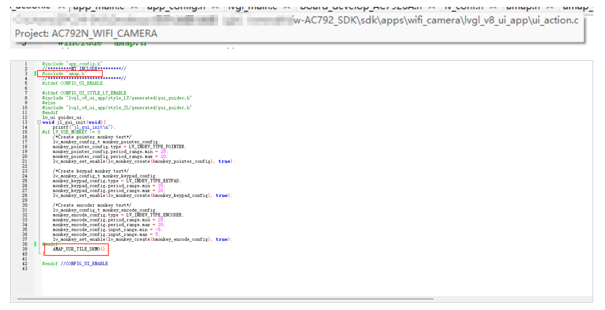

- `app_main.c`


- `app_config.h`

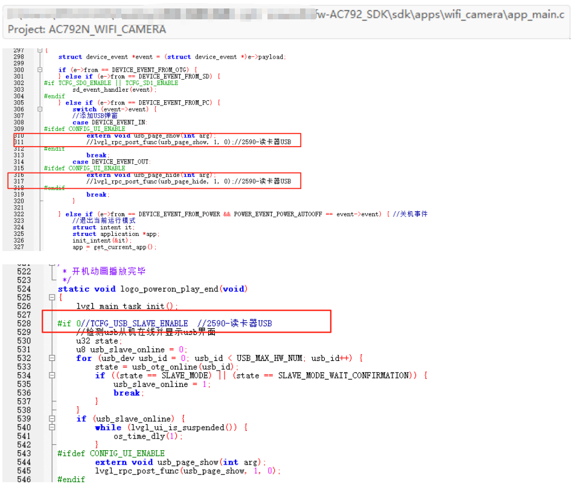

- `lv_conf.h`

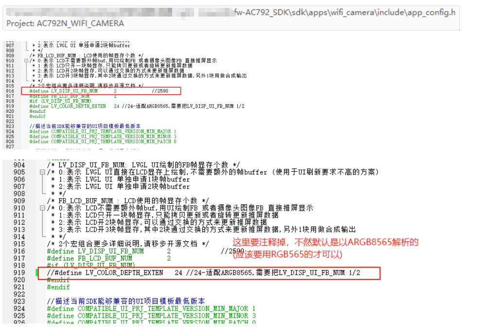

### 配置说明

- `LV_USE_DEMO_AMAP` 是DEMO的开关
- `AMAP_USE_CANVAS` 是地图是否使用画布的开关（耗费内存）
- `AMAP_OPEN_INFO` 是调试信息的开关（通过串口输出，默认波特率为1000000）
- `MAP_BORDER_GIRD_FIX` 是修复无CANVAS版本地图网格和残留问题的开关
  - 设置为1是解决该问题（帧率会变低）
  - 设置为0是不解决该问题（帧率会变高）
- 最佳帧率配置是 `AMAP_USE_CANVAS`设置为1

相关文件：`amap_canvas.c` & `amap_non_canvas.c  `
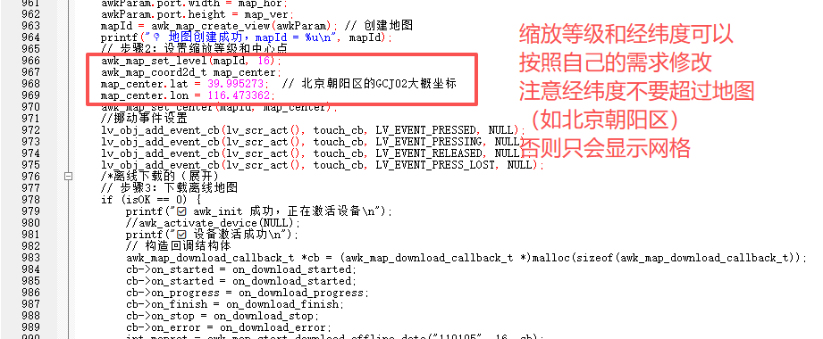

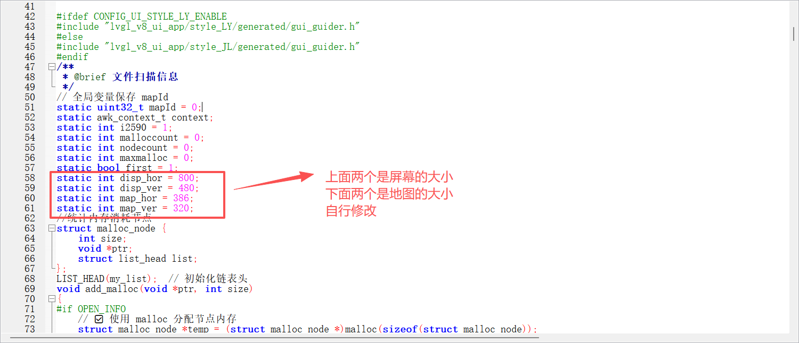

### 最终效果图

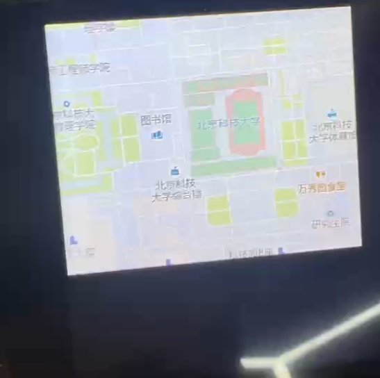

**下一页详细查看杰理UI工具的用法**

---

# 5.4. ui_tool

## 5.4.1. 杰理UI设计工具(JieLiGuiBuilder)介绍

杰理UI设计工具(JieLiGuiBuilder)，通过GUI界面快速生成基于lvgl的代码，并结合公司的芯片，快速实现HMI应用开发。


## 5.4.2. 工具概述

- **中文名称**：UI设计工具
- **英文名称**：JieLiGuiBuilder
- **核心功能**：通过可视化界面快速生成基于LVGL框架的嵌入式UI代码
- **使用平台**：Windows 7及以上的64位操作系统

## 5.4.3. 获取与安装

### 下载地址

- [阿里云盘](https://www.alipan.com/s/UJrsK96oLPC)下载地址
- Gitee下载SDK地址：[Gitee地址](https://gitee.com/Jieli-Tech/fw-AC792_SDK/)

### 硬件资料

- 硬件资料1：[792x上创建空白UI模板方法](https://www.kdocs.cn/l/cg6zeRjCLwkQ)
- 硬件资料2：[AC792N开发-入门到进阶开发指导文档](https://www.kdocs.cn/l/cgESw1sY7o5H)
- 硬件资料3：[AC792 开源项目文档](https://doc.zh-jieli.com/AC792/zh-cn/wifi_video_master/index.html)
- 硬件资料4：[UI设计工具详细使用文档](https://doc.zh-jieli.com/JLGuiBuilder/zh-cn/master/)

### 安装步骤

1. 从阿里云盘下载最新版本压缩包
2. 解压下载的文件包
3. 双击运行 `JieLiGuiBuilder.exe` 即可启动程序

### 公众号

杰理科技官方微信公众号


## 5.4.4. 核心概念说明

### 首页功能区

- **项目管理**：工具中创建和管理的所有UI项目
- **回收站**：临时存放已删除项目，支持彻底删除或恢复
- **本地存储**：项目文件在操作系统中的实际存储位置
- **在线市场**：登录后可访问的资源市场，提供内核、插件等在线资源
- **内核系统**：项目依赖的嵌入式核心，包含LVGL库及杰理开发的专属控件库
- **开发板配置**：用户自定义开发板配置目录，支持快速交叉编译固件
- **资源管理**：项目所需的图片、字体等资源文件
- **插件中心**：已安装或可下载的功能插件列表

### 主界面功能区域

#### 工具栏

- **编译控制**：编译｜停止｜清理
- **运行调试**：预览｜仿真
- **构建部署**：打包｜下载
- **功能模块**：代码｜资源｜事件｜动画｜场景｜模型｜工程
- **编辑工具**：撤销｜重做｜对齐｜排序

#### 侧边栏

- **页面导航**：项目所有页面列表
- **控件库**：基础控件｜容器控件｜组合控件｜自定义控件
- **设计画布**：可视化UI设计区域
- **输出窗口**：编译日志｜运行时输出
- **调试控制台**：命令行交互界面
- **对象管理器**：当前页面控件层级结构
- **属性编辑器**：控件属性｜样式｜事件配置

#### 菜单系统

- **项目**：新建｜打开｜保存｜属性｜导出
- **运行**：编译｜仿真｜清理｜打包｜下载
- **编辑**：页面管理｜对齐工具｜排序工具｜复制粘贴｜搜索｜边框设置
- **视图**：界面布局控制
- **资源**：多媒体资源管理
- **工具**：辅助工具集
- **帮助**：文档｜设置｜更新｜关于
- **插件**：扩展功能管理

### 控件分类

- **基础控件**：LVGL原生基础组件
- **容器控件**：LVGL原生容器组件
- **菜单控件**：杰理开发的专属菜单组件（以库形式提供）
- **组合控件**：由基础控件组合而成的复合组件
- **自定义控件**：杰理开发的专属组件（以库形式提供）

### 属性配置体系

- **基础属性**：坐标｜尺寸｜可见性等基本参数
- **样式系统**：
  - 支持多状态样式（默认｜按下｜选中等）
  - 支持CSS式样式配置（颜色｜字体｜边框｜圆角等）
  - 模块化样式（针对复杂控件的不同部件）
- **事件系统**：可视化事件绑定与管理


# 5.5. lcd_tools

## 5.5.1. lcd tools 介绍

* lcd tools 是用于实时调整屏幕参数的工具，参数包括：gamma参数、ccm矩阵、r分量增益、g分量增益、b分量增益、亮度、对比度、对比度均值、饱和度、色相。

Warning

注意事项：lcd tools 需要打开CDC功能，配置PID和VID为0x3654、0x7756。

## 5.5.2. lcd tools 功能介绍

* 当配置正确后，通过usb连接设备和电脑，打开lcd tools后，在设备名处会显示CDC的端口号。


### 5.5.2.1. 连接设备

* 点击“连接设备”按钮，上位机会连续下发连接设备、显示图片、获取默认参数三条指令，屏幕会显示一张开机图片，上位机也会根据收到的默认参数调整界面上各个参数。

### 5.5.2.2. 默认参数

* 点击“默认参数”，上位机下发指令获取屏幕默认参数，上位机获取到的参数值后会将上位机中的各个参数设置恢复为默认值。

### 5.5.2.3. 加载参数

* 点击“加载参数”按钮，上位机会将保存的屏幕参数bin文件发送给设备，设备根据bin文件中的参数值设置屏幕参数。

### 5.5.2.4. 保存参数

* 点击“保存参数”按钮，上位机会将当前屏幕参数保存为bin文件，保存的bin文件格式为  *帧头+参数值+CRC校验码* ，帧头为“JL”，参数值为结构体数据，CRC校验码为16位无符号整数。

其中数据部分为结构体数据：

```
typedef struct {
     dmm_gamma_param_t rgb_gamma_param; // rgb gamma参数
     dmm_ccmf_param_t ccmf_param;       // ccm矩阵
     float rbs;              // in_swp:r分量和b分量需要对调
     float r_gain;           //r分量增益 (0.00-2.00, 步进0.01)
     float g_gain;           //g分量增益 (0.00-2.00, 步进0.01)
     float b_gain;           //b分量增益 (0.00-2.00, 步进0.01)
     float bright_gain;      //亮度 (0.00-4.00, 步进0.01)
     float contrast_gain;//对比度 (0.00-4.00, 步进0.01)
     float mean;             //对比度均值 (0.0-255.00, 步进1)
     float saturation_gain;//饱和度 (0.00-4.00, 步进0.01)
     float angle;            //色相 (0.00-360.00, 步进1)
 } dmm_param;
```

### 5.5.2.5. 加载图片

* 加载图片功能，可以将本地图片发送给设备，设备将图片显示在屏幕上，并且恢复默认参数。

### 5.5.2.6. 显示摄像头

* 显示摄像头功能，可以将设备的摄像头实时显示在屏幕上，并且恢复默认参数。

### 5.5.2.7. 调整参数

* 拖动各个参数滑块，可以调整各个参数的值，并实时显示在屏幕上。
