# 9. 音频部分

---

# 9.1. AUDIO_ADC

**概述**

- WL83有两个ADUIO_ADC通道
- 提供AUDIO_ADC的MIC和LINEIN配置介绍、推荐使用方式和注意点
- ADC的硬件配置均在板级文件中 `board_develop.c`，在 `board_devolop_AC792x.h`中进行宏定义修改配置

```c
/**
 * @brief struct AUDIO_ADC参数设置结构体
 */
struct adc_platform_data {
    int mic_port[4];              /*!< 用到的mic的io组 [0]MIC0P [1]MIC0N [2]MIC1P [3]MIC1N */
    int linein_port[4];           /*!< 用到的linein的io组 [0]AUX0P [1]AUX0N [2]AUX1P [3]AUX1N */
    u8 mic_ch_num;                /*!< 用到的mic通道数 */
    u8 mic_share_micbias;         /*!< 共用micbias使用 */
    u8 mic_other_power_enable;    /*!< 不使用micbias使能普通io或外部ldo供电做mic电源 */
    int mic_other_power_port[2];  /*!< 不使用micbias使用普通io或外部ldo供电做mic供电电源 */
    u8 linein_ch_num;             /*!< 用到的linein通道数 */
    u8 isel;                      /*!< AD电流档，一般没有特殊要求不建议改动 */
    u8 inside_bias_resistor;      /*!< MIC BIAS是否使用内置电阻 */
    u8 all_channel_open;          /*!< 所有AD通道打开，使用多路AD时建议打开 */
    u8 dmic_enable;               /*!< 数字麦通道使能，此时模拟麦通道会被替换 */
    u16 sr_points;                /*!< 多少个采样点进一次中断，一般不建议修改 */
    u16 dump_num;                 /*!< 打开adc时丢掉点数 */
    u16 dmic_init_delay_ms;       /*!< 数字麦初始化后等待SCLK稳定的延时ms */
    u32 dmic_sclk_fre;            /*!< 数字麦的sclk输出频率 */
    int dmic_io_sclk;             /*!< 数字麦的sclk输出引脚 */
    int dmic_io_idat0;            /*!< 数字麦的dat输入引脚0 */
    int dmic_io_idat1;            /*!< 数字麦的dat输入引脚0 */
};

//*********************************************************************************//
//                              AUDIO ADC配置                                      //
//*********************************************************************************//
//--- MICBIASA: PC9  MICBIASB: PC10
//--- AIN_AP0: PC7  AIN_AN0: PC6  AIN_BP0: PC11  AIN_BN0: PC12
//--- AIN_AP1: PC3  AIN_AN1: PC2  AIN_BP1: PC4   AIN_BN1: PC5

#define TCFG_AUDIO_ADC_ENABLE                   1
#define TCFG_MIC_IO_PORT                        {-1/*MIC0P*/, -1/*MIC0N*/, IO_PORTC_11/*MIC1P*/, IO_PORTC_12/*MIC1N*/}
#define TCFG_MIC_CHANNEL_NUM                    1
#define TCFG_MIC_SHARE_MICBIAS_ENABLE           0    //使用到两个mic时候，共用偏置电压MICBIASB:PC10使用
#define TCFG_MIC_OTHER_POWER_ENABLE             0    //不使用micbias使能普通io或外部ldo供电做mic电源
#define TCFG_MIC_OTHER_POWER_IO_PORT            {-1/*MIC0_POWER*/, -1/*MIC1_POWER*/}  //不使用micbias时的供电io，外部ldo供电填-1
#define TCFG_LINEIN_IO_PORT                     {IO_PORTC_07/*AUX0P*/, IO_PORTC_06/*AUX0N*/, -1/*AUX1P*/, -1/*AUX1N*/}
#define TCFG_LINEIN_CHANNEL_NUM                 1
#define TCFG_AUDIO_ADC_ALL_CHANNEL_OPEN         1
#define TCFG_DMIC_ENABLE                        0
#define TCFG_DMIC_SCLK_FREQUENCY                2000000
#define TCFG_DMIC_IO_SCLK                       IO_PORTC_11
#define TCFG_DMIC_IO_IDAT0                      IO_PORTA_11
#define TCFG_DMIC_IO_IDAT1                      IO_PORTA_11

// 通道配置说明
// TCFG_MIC_IO_PORT和TCFG_LINEIN_IO_PORT配置io使用， 未配置使用时将io值设置为-1
// 单端mic或者单端linein时候只能设置正端使用
// MIC0P MIC0N AUX0P AUX0N 使用的是ADC0
// MIC1P MIC1N AUX1P AUX1N 使用的是ADC1
// mic和linein可分时复用，有两组io分别对应
// 对应ADC通道的引脚可查看io_map或者查看板级文件中注释

//使用mic adc0 单端情况
#define TCFG_MIC_CHANNEL_NUM 1
#define TCFG_MIC_IO_PORT {IO_PORTC_07/*MIC0P*/, -1/*MIC0N*/, -1/*MIC1P*/, -1/*MIC1N*/}
#define TCFG_MIC_IO_PORT {IO_PORTC_03/*MIC0P*/, -1/*MIC0N*/, -1/*MIC1P*/, -1/*MIC1N*/}

//使用mic adc1 单端情况
#define TCFG_MIC_CHANNEL_NUM 1
#define TCFG_MIC_IO_PORT {-1/*MIC0P*/, -1/*MIC0N*/, IO_PORTC_11/*MIC1P*/, -1/*MIC1N*/}
#define TCFG_MIC_IO_PORT {-1/*MIC0P*/, -1/*MIC0N*/, IO_PORTC_04/*MIC1P*/, -1/*MIC1N*/}

//使用mic adc0 差分情况
#define TCFG_MIC_CHANNEL_NUM 1
#define TCFG_MIC_IO_PORT {IO_PORTC_07/*MIC0P*/, IO_PORTC_06/*MIC0N*/, -1/*MIC1P*/, -1/*MIC1N*/}
#define TCFG_MIC_IO_PORT {IO_PORTC_03/*MIC0P*/, IO_PORTC_02/*MIC0N*/, -1/*MIC1P*/, -1/*MIC1N*/}

//使用mic adc1 差分情况
#define TCFG_MIC_CHANNEL_NUM 1
#define TCFG_MIC_IO_PORT {-1/*MIC0P*/, -1/*MIC0N*/, IO_PORTC_11/*MIC1P*/, IO_PORTC_12/*MIC1N*/}
#define TCFG_MIC_IO_PORT {-1/*MIC0P*/, -1/*MIC0N*/, IO_PORTC_04/*MIC1P*/, IO_PORTC_05/*MIC1N*/}

//使用mic adc0 和 adc1 单端情况
#define TCFG_MIC_CHANNEL_NUM 2
#define TCFG_MIC_IO_PORT {IO_PORTC_07/*MIC0P*/, -1/*MIC0N*/, IO_PORTC_11/*MIC1P*/, -1/*MIC1N*/}
#define TCFG_MIC_IO_PORT {IO_PORTC_03/*MIC0P*/, -1/*MIC0N*/, IO_PORTC_04/*MIC1P*/, -1/*MIC1N*/}

//使用mic adc0 和 adc1 差分情况
#define TCFG_MIC_CHANNEL_NUM 2
#define TCFG_MIC_IO_PORT {IO_PORTC_07/*MIC0P*/, IO_PORTC_06/*MIC0N*/, IO_PORTC_11/*MIC1P*/, IO_PORTC_12/*MIC1N*/}
#define TCFG_MIC_IO_PORT {IO_PORTC_03/*MIC0P*/, IO_PORTC_02/*MIC0N*/, IO_PORTC_04/*MIC1P*/, IO_PORTC_05/*MIC1N*/}

//使用mic adc0单端 和 adc1差分情况
#define TCFG_MIC_CHANNEL_NUM 2
#define TCFG_MIC_IO_PORT {IO_PORTC_07/*MIC0P*/, -1/*MIC0N*/, IO_PORTC_11/*MIC1P*/, IO_PORTC_12/*MIC1N*/}
#define TCFG_MIC_IO_PORT {IO_PORTC_03/*MIC0P*/, -1/*MIC0N*/, IO_PORTC_04/*MIC1P*/, IO_PORTC_05/*MIC1N*/}

//使用mic adc0差分 和 adc1单端情况
#define TCFG_MIC_CHANNEL_NUM 2
#define TCFG_MIC_IO_PORT {IO_PORTC_07/*MIC0P*/, IO_PORTC_06/*MIC0N*/, IO_PORTC_11/*MIC1P*/, -1/*MIC1N*/}
#define TCFG_MIC_IO_PORT {IO_PORTC_03/*MIC0P*/, IO_PORTC_02/*MIC0N*/, IO_PORTC_04/*MIC1P*/, -1/*MIC1N*/}

//以上为mic使用adc的所有情况， linein配置使用情况与mic使用配置情况相同
```

## 9.1.1. API参考

**Functions**

**ADC多路复用时的模拟增益设置**

- `source` – 采样源 "mic" "linein"
- `channel_bit_map` – 通道选择
- `gain` – 模拟增益 0-100

**ADC多路复用时打开通道**

- `source` – 采样源 "mic" "linein"
- `channel_bit_map` – 通道选择
- `rec_linein_channel_bit_map` – linein回采通道选择

**打开ADC**

- `source` – 采样源 "mic" "linein"
- `adc_platform_data` – *pd adc配置参数结构体指针

**ADC采样率设置**

- `sample_rate` – 采样率

**ADC模块使能**

- `source` – 采样源 "mic" "linein"

**ADC中断函数**

**ADC模块失能**

**关闭ADC**

**设置ADC中断的回调函数**

- `priv` – 传入指针
- `handler` – 回调函数

**ADC增益设置**

- `source` – 采样源 "mic" "linein"
- `gain` – 模拟增益 0-100

**LINEIN模拟直通到DACL/R**

- `enable_dacl` – 直通使能DACL位
- `enable_dacr` – 直通使能DACR位

**MIC模拟直通到DACL/R**

- `channel_bit_map` – 通道选择
- `enable_dacl` – 直通使能DACL位
- `enable_dacr` – 直通使能DACR位

**vcm电压初始化**

- `delay_ms` – 毫秒级稳定延时

**linein模拟直通DAC的模拟增益控制开关**

- `enable` – 1：使能 0：关闭

**struct adc_platform_data 参数说明**

Public Members:

- `mic_port[4]` - 用到的mic的io组 [0]MIC0P [1]MIC0N [2]MIC1P [3]MIC1N
- `linein_port[4]` - 用到的linein的io组 [0]AUX0P [1]AUX0N [2]AUX1P [3]AUX1N
- `mic_ch_num` - 用到的mic通道数
- `mic_share_micbias` - 共用micbias使用
- `mic_other_power_enable` - 不使用micbias使能普通io或外部ldo供电做mic电源
- `mic_other_power_port[2]` - 不使用micbias使用普通io或外部ldo供电做mic供电电源
- `linein_ch_num` - 用到的linein通道数
- `isel` - AD电流档，一般没有特殊要求不建议改动
- `inside_bias_resistor` - MIC BIAS是否使用内置电阻
- `all_channel_open` - 所有AD通道打开，使用多路AD时建议打开
- `dmic_enable` - 数字麦通道使能，此时模拟麦通道会被替换
- `sr_points` - 多少个采样点进一次中断，一般不建议修改
- `dump_num` - 打开adc时丢掉点数
- `dmic_init_delay_ms` - 数字麦初始化后等待SCLK稳定的延时ms
- `dmic_sclk_fre` - 数字麦的sclk输出频率
- `dmic_io_sclk` - 数字麦的sclk输出引脚
- `dmic_io_idat0` - 数字麦的dat输入引脚0
- `dmic_io_idat1` - 数字麦的dat输入引脚1

---

# 9.2. AUDIO_DAC

**概述**

提供DAC的配置介绍、推荐使用方式和注意点

## 9.2.1. 常见问题

- WL83 有两个AUDIO_DAC通道
- DAC模拟通道hw_channel配置说明，dac的硬件配置均在板级文件中 `board_develop.c`，在 `board_devolop_AC792x.h`中进行宏定义修改配置

```c
/**
 * @brief struct AUDIO_DAC参数设置结构体
 */
struct dac_platform_data {
    int pa_mute_port;             /*!< 功放MUTE IO */
    u8 pa_auto_mute;              /*!< 关闭DAC时是否自动MUTE功放 0:不mute功放 1:MUTE功放 */
    u8 pa_mute_value;             /*!< MUTE电平值 0:低电平 1:高电平 */
    u8 trim_en;                   /*!< 是否每次开机都trim dac */
    u8 differ_output;             /*!< 是否使用硬件差分输出模式 0:不使用 1:使用 */
    u8 hw_channel;                /*!< 硬件DAC模拟通道 */
    u8 ch_num;                    /*!< 数字通道，软件输出通道数 */
    u8 auto_src_enable;           /*!< 根据当前解码的最高采样率自动调整最佳DAC采样率 */
    u8 fade_enable;               /*!< 数字音量淡入淡出使能位 */
    u8 fade_points_step;          /*!< 数字音量淡入淡出每隔多少个采样点更新一次音量 */
    u8 fade_volume_step;          /*!< 数字音量淡入淡出音量每次更新的步进 */
    u16 mute_delay_ms;            /*!< MUTE延时 */
    u16 fade_delay_ms;            /*!< 模拟音量淡入淡出延时 */
    u16 sr_points;                /*!< 多少个采样点进一次中断，一般不建议修改 */
    u16 vcm_init_delay_ms;        /*!< VCM电压初始化后等待稳定的延时ms */
    u32 poweron_delay;            /*!< 低功耗睡眠时恢复DAC模块的延迟us */
    void (*pa_mute_cb)(u8 mute);  /*!< 功放mute用户操作回调 */
};

//*********************************************************************************//
//                              AUDIO DAC配置                                      //
//*********************************************************************************//
#define TCFG_AUDIO_DAC_ENABLE                   1
#define TCFG_AUDIO_DAC_PA_AUTO_MUTE_ENABLE      1
#define TCFG_AUDIO_DAC_PA_MUTE_PORT             IO_PORTE_15
#define TCFG_AUDIO_DAC_PA_MUTE_LEVEL            0
#define TCFG_AUDIO_DAC_DIFFER_OUTPUT_ENABLE     1
#define TCFG_AUDIO_DAC_HW_CHANNEL               (AUDIO_DAC_CH_L | AUDIO_DAC_CH_R)
#define TCFG_AUDIO_DAC_VCM_CAP_ENABLE           1

#if TCFG_AUDIO_DAC_VCM_CAP_ENABLE
#define TCFG_AUDIO_DAC_VCM_INIT_DELAY_MS        1000
#else
#define TCFG_AUDIO_DAC_VCM_INIT_DELAY_MS        0
#endif

#define TCFG_AUDIO_DAC_PA_MUTE_DELAY_MS         500

/*通道配置说明*/
//单声道单端输出
#define TCFG_AUDIO_DAC_DIFFER_OUTPUT_ENABLE     0
#define TCFG_AUDIO_DAC_HW_CHANNEL               (AUDIO_DAC_CH_L)  //或者(AUDIO_DAC_CH_R) 配置单左或者单右单端模式

//双声道单端输出
#define TCFG_AUDIO_DAC_DIFFER_OUTPUT_ENABLE     0
#define TCFG_AUDIO_DAC_HW_CHANNEL               (AUDIO_DAC_CH_L | AUDIO_DAC_CH_R)

//单声道差分输出
#define TCFG_AUDIO_DAC_DIFFER_OUTPUT_ENABLE     1
#define TCFG_AUDIO_DAC_HW_CHANNEL               (AUDIO_DAC_CH_L)
```

- DAC开机第一声出声延时默认1秒，延时时间可通过配置板级的 `vcm_init_delay_ms`参数调整

## 9.2.2. API参考

**DAC通道选择**

- 通道0 左声道
- 通道1 右声道

**淡入淡出状态**

- 淡入淡出失能
- 淡入淡出模拟音量淡出
- 淡入淡出模拟音量淡入
- 淡入淡出模拟音量调节

**dac_early_init, dac初始化**

- `hw_channel` – 硬件dac通道配置BIT(x)
- `vcm_cap` – VCM是否外挂电容

**打开dac模块**

- `struct dac_platform_data *pd` – dac配置参数结构体参数指针

**dac模块使能**

**dac模块失能**

**关闭dac模块**

**低功耗休眠起来后恢复dac模块**

**低功耗进入前挂起dac模块**

**dac数字音量设置**

- `volume` – 音量0-100

**dac采样率设置**

- `sample_rate` – 采样率

**获取当前dac采样率**

- 返回：DAC当前采样率

**dac中断函数**

**dac中断的回调函数设置**

- `priv` – 传入指针
- `handler` – 传入的回调函数

**dac模拟增益设置**

> **Note**: 本芯片无效

- `gain` – 模拟增益0-31
- `fade_opt` – 淡入淡出状态位

**dac直通模拟增益设置**

> **Note**: 本芯片无效

- `gain` – 模拟增益0-31

**dac模拟增益淡入淡出设置**

> **Note**: 本芯片无效

- `enable` – 0：关闭 1：使能

**读取DAC DMA BUF的单通道数据**

- `read_pos` – 读指针
- `points_offset` – 偏移量
- `data` – 数据指针
- `len` – 数据长度
- 返回：数据长度

**struct dac_platform_data 参数说明**

Public Members:

- `pa_mute_port` - 功放MUTE IO
- `pa_auto_mute` - 关闭DAC时是否自动MUTE功放 0:不mute功放 1:MUTE功放
- `pa_mute_value` - MUTE电平值 0:低电平 1:高电平
- `trim_en` - 是否每次开机都trim dac
- `differ_output` - 是否使用硬件差分输出模式 0:不使用 1:使用
- `hw_channel` - 硬件DAC模拟通道
- `ch_num` - 数字通道，软件输出通道数
- `auto_src_enable` - 根据当前解码的最高采样率自动调整最佳DAC采样率
- `fade_enable` - 数字音量淡入淡出使能位
- `fade_points_step` - 数字音量淡入淡出每隔多少个采样点更新一次音量
- `fade_volume_step` - 数字音量淡入淡出音量每次更新的步进
- `mute_delay_ms` - MUTE延时
- `fade_delay_ms` - 模拟音量淡入淡出延时
- `sr_points` - 多少个采样点进一次中断，一般不建议修改
- `vcm_init_delay_ms` - VCM电压初始化后等待稳定的延时ms
- `poweron_delay` - 低功耗睡眠时恢复DAC模块的延迟us
- `pa_mute_cb` - 功放mute用户操作回调

---

# 9.3. IIS(ALNK)

**概述**

提供IIS配置介绍、推荐使用方式和注意点

## 9.3.1. 应用实例

**示例演示**：

进入 `demo_DevKitBoard/include/demo_config.h`，开启宏 `USE_AUDIO_DEMO`

根据IO说明进行两设备的连接

## 9.3.2. 常见问题

> **Note**
>
> - IIS0和IIS1是两个互相独立的模块，每个模块具有四个独立的通道CH0~CH3，都可设为输入或输出，但同一模块的同一通道使用时不能同时设置为输出和输入。四个通道共用MCLK/LRCK/SCLK信号
> - SCLK，叫做串行时钟，也叫位时钟（BCLK），用于每一位数据传输的同步，SCLK的频率=2×采样频率×64或32。LRCK，帧时钟，也叫作WS，用于左右声道数据的区分，如高电平表示右声道数据，低电平表示左声道数据，其频率等于设置的采样频率
> - MCLK、SCLK和LRCK由主机提供给从机，当从机自带晶振时可不需由主机提供MCLK
> - 测试时请保证通道数、采样率、位宽的设置是否正确，IO口不要被占用

## 9.3.3. 配置说明

```c
struct iis_platform_data {
    u8 channel_in;       //输入通道 BIT(X)
    u8 channel_out;      //输出通道 BIT(X)
    u8 port_sel;         //IO组选择
    u8 data_width;       //BIT(X)为通道X使用24bit模式
    u8 mclk_output;      //1:输出mclk 0:不输出mclk
    u8 slave_mode;       //1：从机模式 0：主机模式
    u16 dump_points_num; //丢弃刚打开iis硬件时的数据点数
};
```

**配置示例**：

```c
/*************************************板A作为iis输出***************************************/
//app_config.h配置
#define CONFIG_AUDIO_DEC_PLAY_SOURCE "iis0"  //播放输出源选择

//DevKitBoard.c配置
static const struct iis_platform_data iis0_data = {
    .channel_in = 0,
    .channel_out = BIT(0),      //通道0输出
    .port_sel = IIS_PORTA,
    .data_width = 0,
    .mclk_output = 0,
    .slave_mode = 0,
    .dump_points_num = 320,
};

/*************************************板B作为iis输入**************************************/
//app_config.h配置
#define CONFIG_AUDIO_ENC_SAMPLE_SOURCE AUDIO_ENC_SAMPLE_SOURCE_IIS0  //录音输入源选择
#define CONFIG_AUDIO_RECORDER_SAMPLERATE 44100  //录音采样率，需与板A输出音频采样率一致
#define CONFIG_AUDIO_RECORDER_CHANNEL 2         //录音通道数，需与板A输出音频通道数一致

//DevKitBoard.c配置
static const struct iis_platform_data iis0_data = {
    .channel_in = BIT(0),       //通道0输入
    .channel_out = 0,
    .port_sel = IIS_PORTA,
    .data_width = 0,
    .mclk_output = 0,
    .slave_mode = 1,            //从机模式
    .dump_points_num = 320,
};
```

根据以上两块板的配置，可实现由板A本地播放模式播放音频通过iis输出，之后由iis输入到板B作为录音模式的输入，板B通过DAC播放

## 9.3.4. API参考

> **Warning**: doxygenfile: Cannot find file "cpu/wl82/asm/iis.h"

---

# 9.4. PDM LINK

**概述**

本说明介绍了PLNK数字麦的配置和使用说明

## 9.4.1. 应用实例

**示例演示**：

- 进入 `demo_DevKitBoard/include/demo_config.h`，开启宏 `USE_AUDIO_DEMO`
- 按键切换使用录音模式，在 `app_config.h`中选择录音输入源为PLNK，如：
  ```c
  #define CONFIG_AUDIO_ENC_SAMPLE_SOURCE AUDIO_ENC_SAMPLE_SOURCE_PLNK0  //录音输入源选择
  ```

## 9.4.2. 配置说明

**硬件连接**：将数字麦引出的MIC_VDD(电源3.3V)、GND(地)、DAT(数据通道)和CLK(时钟线)进行连接。两个数字麦可共用DAT数据线和CLK时钟线

**PLNK使用配置** `board.c`：

```c
//hw_channel 输入通道选择
#define PLNK_MIC_MASK       (BIT(0) | BIT(1))  //掩码通道
#define PLNK_CH_MIC_L       BIT(0)             //通道0 两个MIC共用DAT0也使用该宏
#define PLNK_CH_MIC_R       BIT(1)             //通道1 两个MIC共用DAT1也使用该宏
#define PLNK_CH_MIC_DOUBLE  (BIT(0) | BIT(1)) //通道0和通道1

//plnk参数结构体
struct plnk_platform_data {
    void (*port_remap_cb)(void);   //设置IO重映射
    void (*port_unremap_cb)(void); //解除IO重映射
    u8 hw_channel;                 //数字麦克风的通道选择（见hw_channel 输入通道选择）
    u8 clk_out;                    //是否输出时钟信号 1：是 0：否
    u8 high_gain;                  //0db增益输出 1：使用 0：-6db输出
    u8 sample_edge;                //采样边沿 1：上升沿 0：下降沿
    u16 sr_points;                 //采样点，不建议修改
    u8 share_data_io;              //两个数字麦共用一个DAT脚 1：是 0：否
    u8 dc_cancelling_filter;       //去直流滤波器，0-15
    u32 dump_points_num;           //丢弃硬件刚打开是的数据点数
};

//board.c板级文件配置
//设置重映射
static void plnk0_port_remap_cb(void)
{
    //重映射PDM DAT-PH2 PDM CLK-PH3 重映射的DAT脚和CLK时钟脚可根据原理图所有引脚选择
    extern int gpio_plnk_rx_input(u32 gpio, u8 index, u8 data_sel);
    gpio_plnk_rx_input(IO_PORTH_02, 0, 0); //plnk数字DAT0输入，当第三个参数为1时gpio_plnk_rx_input(IO_PORTH_02, 0, 0);plnk数字DAT1输入
    gpio_output_channle(IO_PORTH_03, CH0_PLNK0_SCLK_OUT); //SCLK0使用outputchannel0
    JL_IOMAP->CON3 |= BIT(18); //PLNK0 SCLK0 输出使能，若使用PLNK1数字麦1,JL_IOMAP->CON3 |= BIT(19)
}

//解除重映射
static void plnk0_port_unremap_cb(void)
{
    JL_IOMAP->CON3 &= ~BIT(18); //PLNK0 SCLK0 输出失能 若使用PLNK1数字麦1，JL_IOMAP->CON3 &= ~BIT(19);
    gpio_clear_output_channle(IO_PORTH_03, CH0_PLNK0_SCLK_OUT); //释放outputchannel0
    gpio_set_die(IO_PORTH_02, 0); //数字/模拟输入切换
}

//plnk的时钟和数据引脚都采用重映射的使用例子
static const struct plnk_platform_data plnk0_data = {
    .hw_channel = PLNK_CH_MIC_L,        //使用DAT0输入
    .clk_out = 1,                       //使能时钟输出
    .port_remap_cb = plnk0_port_remap_cb,     //重映射
    .port_unremap_cb = plnk0_port_unremap_cb, //解除重映射
    .sample_edge = 0,                   //在CLK的下降沿采样左MIC，上升沿采样右MIC
    .share_data_io = 1,                 //两个数字MIC共用一个DAT脚
    .high_gain = 1,                     //强增益输出
    .dc_cancelling_filter = 14,         //去直流滤波器
    .dump_points_num = 640,             //丢弃刚打开硬件时的数据点数
};
```

## 9.4.3. 常见问题

> **Note**
>
> - 检查设置的采样边沿是否和接入的数字麦的datasheet说明是否一致
> - 设置的IO重映射是否正确
> - 不共用DAT脚时，可使用DAT0和DAT1两个通道，设置 `hw_channel = PLNK_CH_MIC_L | PLNK_CH_MIC_R`

## 9.4.4. API参考

> **Warning**: doxygenfile: Cannot find file "cpu/wl82/asm/plnk.h"

# 9.5. SRC变采样

**概述**

* SRC变采样模块用于将输入的音频信号从一个采样频率转换为另一个采样频率输出
* 详细参数设置可参考例程 apps/common/example/audio/src_test

## 9.5.1. 使用原理

* SRC变采样主要用于* 1.做n倍插值，即低采样率转换为高采样率
  * 2.做n倍抽样，即高采样率转换为低采样率
* SRC模块直接支持1-8条通道的转换，前提是这些通道具有相同的转换设置。如果转换设置不同，则需要软件配合做分次转换。
* in_chinc和in_spinc用于设置输入数据的组织结构，out_chinc和out_spinc用于设置输出数据的组织结构，建议使用交织方式存放
* 顺序方式为ch0dat0 ch0dat1 … ch0datN ch1dat0 ch1dat1 …

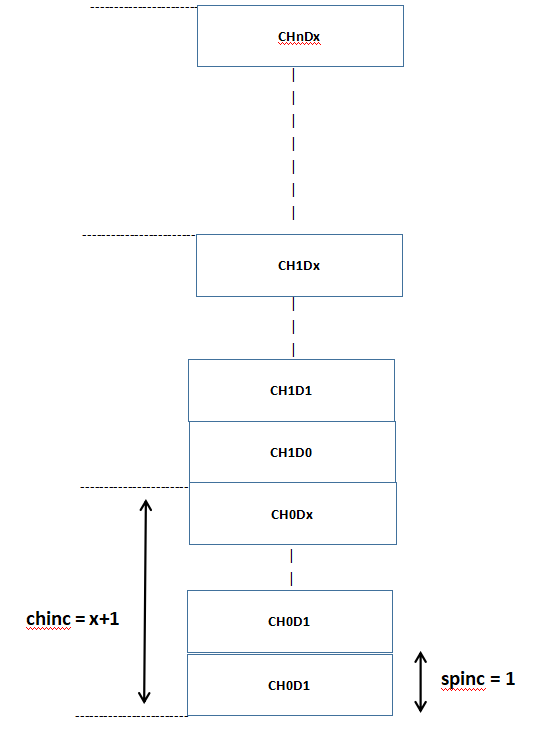

* 交织方式为ch0dat0 ch1dat0 ch0dat1 ch1dat1 … ch0datN ch1datN

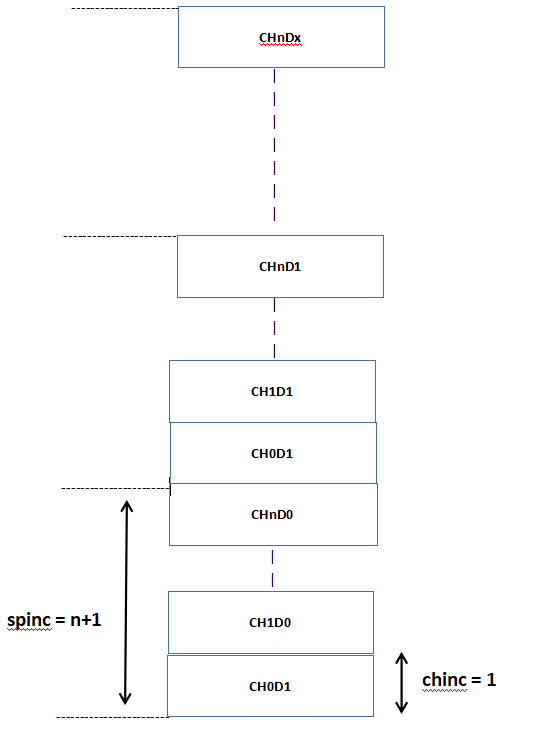

* 当为单通道时，数据只能为顺序方式
* 当为多通道时，可为：* 输入：交织方式 输出：交织方式
  * 输入：交织方式 输出：顺序方式
  * 输入：顺序方式 输出：交织方式
  * 输入：顺序方式 输出：顺序方式
* in_len和out_len为用于一次转换的输入和输出数据的数目即长度，由于进行变采样的操作进行插值或者抽样，输入数据和输出数据数目是不一样的，当其中有一个数目完成时，本次转换过程就会停止

```
/**
* @brief src配置参数结构体
*/
typedef struct {
    u8 nchannel;        /*!< 一次转换的通道个数，取舍范围(1 ~ 8)，最大支持8个通道 */
    u8 reserver[3];     /*!< 未使用 */
    u16 in_rate;        /*!< 输入采样率 */
    u16 out_rate;       /*!< 输出采样率 */
    u16 in_chinc;       /*!< 输入方向,多通道转换时，每通道数据的地址增量 */
    u16 in_spinc;       /*!< 输入方向,同一通道后一数据相对前一数据的地址增量 */
    u16 out_chinc;      /*!< 输出方向,多通道转换时，每通道数据的地址增量 */
    u16 out_spinc;      /*!< 输出方向,同一通道后一数据相对前一数据的地址增量 */
    s16 *in_addr;           /*!< 输入数据地址指针 */
    u32 in_len;                     /*!< 输入数据长度 */
    s16 *out_addr;          /*!< 输出数据地址指针 */
    u32 out_len;            /*!< 输入数据长度 */
    void (*output_cbk)(void *priv, u8 *, u16, u8); /*!< 一次转换完成后，输出中断会调用此函数用于接收输出数据，数据量大小由outbuf_len决定 */
    void *priv;                     /*!< 指针 */
} src_param_t;

/**
    * @brief src滤波器参数结构体
    */
    typedef struct {
        u16 fltb_buf[24 * 2]; /*!< 滤波器buf */
        u32 phase;                    /*!< 相位 */
        u8 fltb_offset;       /*!< 滤波器偏移量 */
    } src_fltb_t;
```

### 9.5.1.1. 应用示例

* `apps/demo/demo_DevKitBoard/include/demo_config.h`打开 `#define USE_SRC_TES` 宏使用，例程文件为 `apps/common/example/audio/src_test/main.c`
* 该例子中以正弦波pcm数据作为输入数据，进行采样率16k转8k的操作
* situaiton四种状况：* situaiton=0 输入：交织方式 输出：交织方式
  * situaiton=1 输入：交织方式 输出：顺序方式
  * situaiton=2 输入：顺序方式 输出：交织方式
  * situaiton=3 输入：顺序方式 输出：顺序方式
* 查看例程效果：
* 将打印出来的输入输出数据使用winhex软件生成文件后，将文件以原始数据导入音频分析软件后可查看变采样前后数据结果
* 1.打开winhex新建文件选择1byte

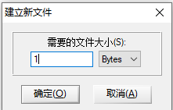

* 2.winhex将打印输出的situation = 0的bufin数据从文件开头复制后选择

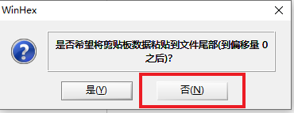

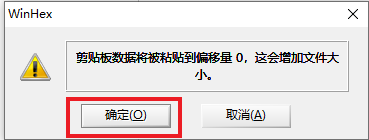

* 3.winhex保存数据文件，任意取文件名不需加格式

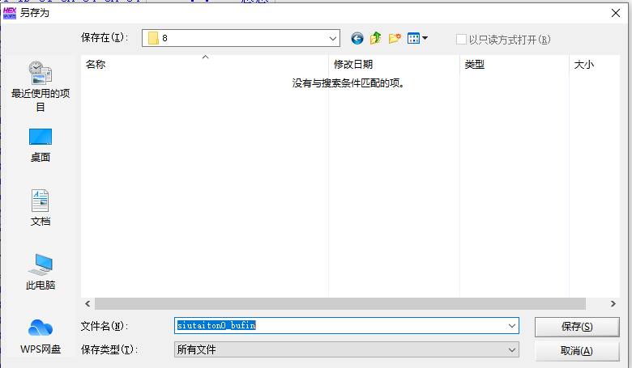

* 4.打开音频分析软件Audacity，选择 文件-导入-原始数据 bufin采样率选择16k bufout采样率选择8k

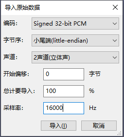

* 5.situation = 0的bufout数据重复上述步骤
* 下图为situaiton=0 输入（交织方式） 输出（交织方式），上方双通道为输入数据采样率16k正弦波数据，下方双通道为变采样后采样率8k正弦波数据

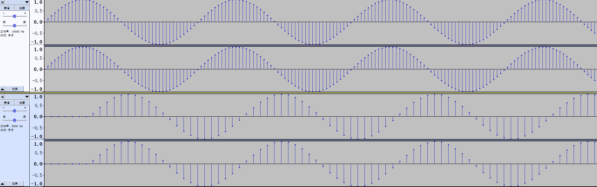

## 9.5.2. API参考

**Warning**

doxygenfile: Cannot find file "cpu/wl82/asm/src.h

---

# 9.6. EQ

**概述**

本工程展示了 AC790N 与 AC791N 的EQ工具使用示例：

1. 如何使用EQ工具在线调试；
2. 如何使用EQ导入/导出EQ配置文件；
3. 如何使用动态DRC调试；

## 9.6.1. AC790N配置

### 9.6.1.1. 配置说明

在 `app_config.h`中，若使用在线EQ调试，配置如下

```c
#define TCFG_EQ_ENABLE          1  //支持EQ功能
#define TCFG_EQ_ONLINE_ENABLE   1  //支持在线EQ调试
#define TCFG_LIMITER_ENABLE     1  //限幅器
```

### 9.6.1.2. 操作说明

**example**: 以故事机工程作为例子说明。

**打开EQ调试工具** AC790N_配置工具入口：`cpu/wl80/tools/AC791N_config_tool/AC790N_配置工具入口(Config Tools Entry).jlxproj`，选择"打开EQ工具"。

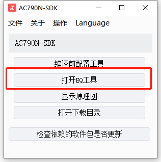

**1.在线模式**

在线调试通过串口进行与上位机通讯，选择好固件(AC790N)，配置好串口端口（默认使用uart1，配置在相关板级里，默认波特率1000000，USBA的DMDP作为TX，RX），点击打开串口，工具最下面有信息栏提示 `串口打开成功`，之后勾选 `在线EQ`，这个时候一边播歌一边调节EQ等参数。(注意：只支持均衡器与限幅器，如操作了其他地方导致通讯失败，需重新勾选 `在线EQ`）

```c
UART1_PLATFORM_DATA_BEGIN(uart1_data)
    .baudrate = 1000000,
    .port = PORTUSB_A,
    .tx_pin = IO_PORT_USB_DPA,
    .rx_pin = IO_PORT_USB_DMA,
    .max_continue_recv_cnt = 1024,
    .idle_sys_clk_cnt = 500000,
    .clk_src = PLL_48M,
    .flags = UART_DEBUG,
UART1_PLATFORM_DATA_END();
```

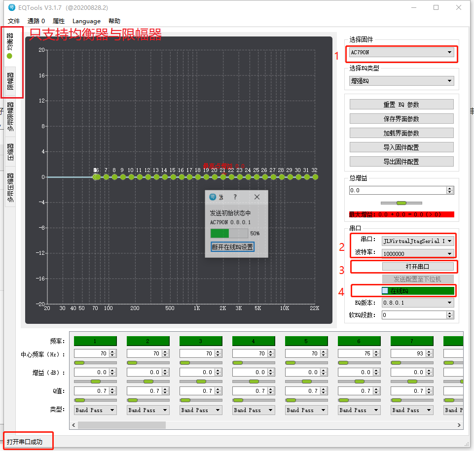

**2.读取文件模式**

读取存放在flash里面的bin文件，以文件中的数据调整eq参数，该文件存放在 `tools\cfg\eq_cfg_hw.bin`，由在线调试EQ工具生成，如图，使用该模式，需要改动如下：

```c
#define TCFG_EQ_ONLINE_ENABLE   0  //支持在线EQ调试
#define TCFG_EQ_FILE_ENABLE     1  //从bin文件读取eq配置数据
```

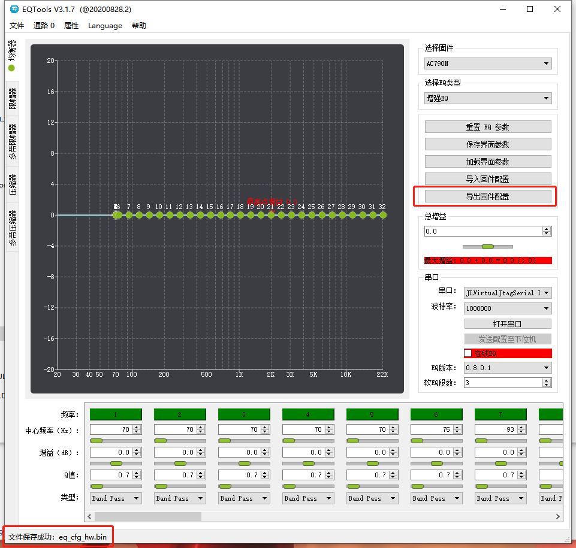

注：请注意导出的bin不一定直接存放到 `tools\cfg\` 目录，请多留意，有必要自行挪到对应地方。

**3.读取TABLE模式**

读取存放在代码段中的数据，以该TABLE的数据为准，该TABLE存放在 `apps/common/config/include/eq_tab.h`，使用该模式，需要改动如下：

```c
#define TCFG_EQ_ONLINE_ENABLE   0  //支持在线EQ调试
#define TCFG_EQ_FILE_ENABLE     0  //从bin文件读取eq配置数据
```

**优先级**：在线模式 > 读取文件模式 > 读取TABLE模式

## 9.6.2. AC791N配置

### 9.6.2.1. 配置说明

**example**: 进入 `demo_DevKitBoard/include/demo_config.h`，开启宏 `USE_AUDIO_DEMO`

在 `app_config.h`中，保证配置如下

```c
#define TCFG_EQ_ENABLE          1  //支持EQ功能
#define TCFG_EQ_ONLINE_ENABLE   1  //支持在线EQ调试
#define TCFG_LIMITER_ENABLE     1  //限幅器
#define TCFG_DRC_ENABLE         TCFG_LIMITER_ENABLE  //DRC使能
#define TCFG_COMM_TYPE          TCFG_USB_COMM
#define USB_DEVICE_CLASS_CONFIG (CDC_CLASS)
```

**外部库依赖**：`libcompressor.a`、`lib_crossover_coff.a`、`media_app.a`、`libdrc.a`

**以DEMO_EDR工程为例**，工程需要添加文件：

- `apps/common/audio_music/audio_eff_default_parm.c`
- `apps/common/audio_music/audio_config.c`
- `apps/common/audio_music/effects_adj.c`
- `apps/common/audio_music/eq_config_new.c`
- `apps/common/config/new_cfg_tool.c`

**由于需要用到USB功能**，则需继续添加：

- `apps/common/system/device_mount.c`
- `apps/common/usb` 目录下所有文件

**添加搜索目录**：

- `apps/common/usb`
- `apps/common/usb/device`
- `apps/common/usb/host`
- `apps/common/usb/include/host`
- `apps/common/usb/include`
- `include_lib/driver/device/usb`
- `include_lib/driver/device/usb/device`
- `include_lib/driver/device/usb/host`

### 9.6.2.2. 操作说明

打开EQ调试工具 AC791N_配置工具入口：`cpu/wl82/tools/AC791N_config_tool/AC791N_配置工具入口(Config Tools Entry).jlxproj`，选择"打开音效配置工具(新EQ工具)"，然后选择"ATK"后点击确定。

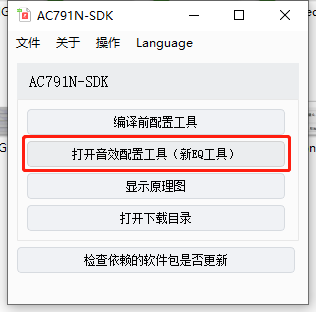

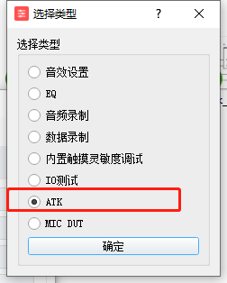

**1. 在线模式**

**1.1** 在线调试通过串口进行与上位机通讯，配置好串口端口（USB串行设备），波特率后（波特率可自行选择，SDK会自动适配，默认115200，类型为异步），点击打开（暂时不支持蓝牙串口模式），进行通讯，通讯成功以后会跳转到【音效调节】界面，进行EQ、DRC各模块参数配置。

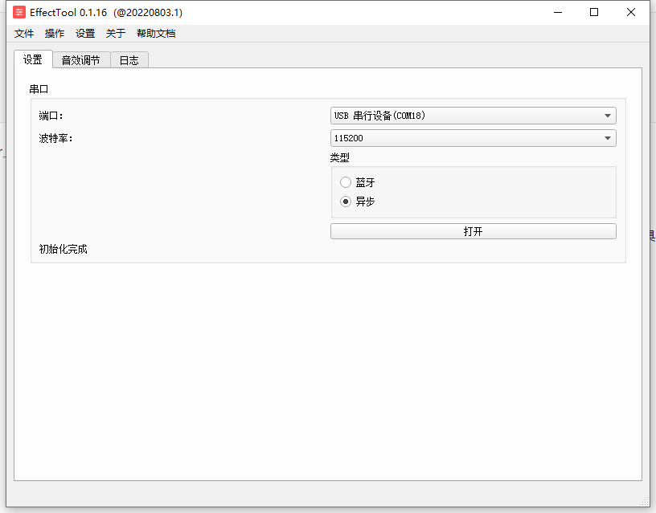

**1.2** 选择对应的音效，然后右键点击编辑（或者双击），若当前设备在播放音乐，能直接听到修改前后的差别，根据需要进行调节。

> **注**：增加新模式，模式流程图如下，模式切换可以通过修改 `app_config.h` 中 `#define TCFG_EQ_MODE_CHOOSE` 与加载对应的bin文件进行切换，bin文件在路径 `tools\AC791N_config_tool` 中，若需要下次烧录能够直接烧录到小机上，则需要将名字修改成 `eq_cfg_hw.bin`，然后替换到 `tools\cfg` 目录下（模式1下，为4通道独立EQ，独立DRC控制）
>
> 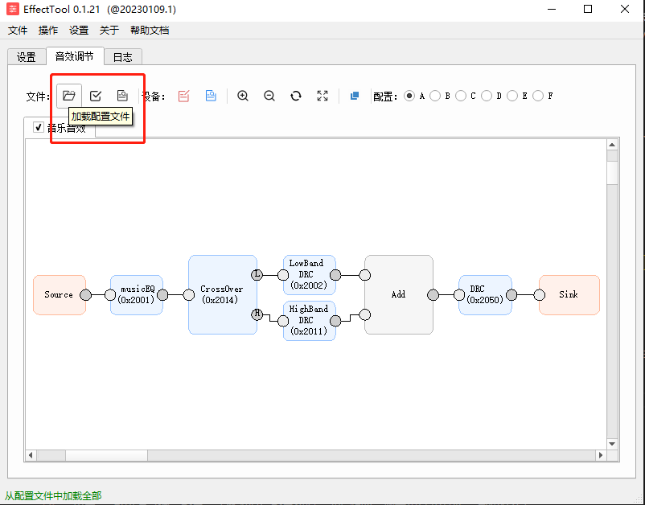
>
> 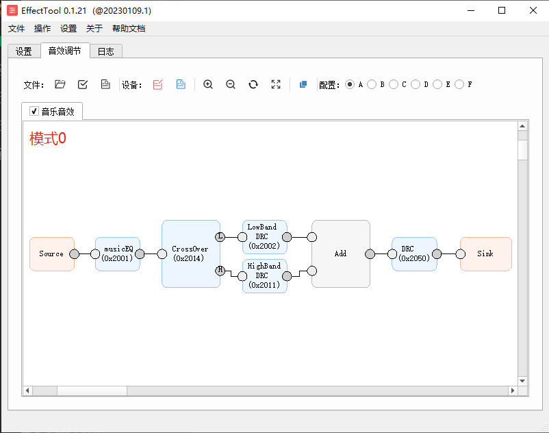
>
> 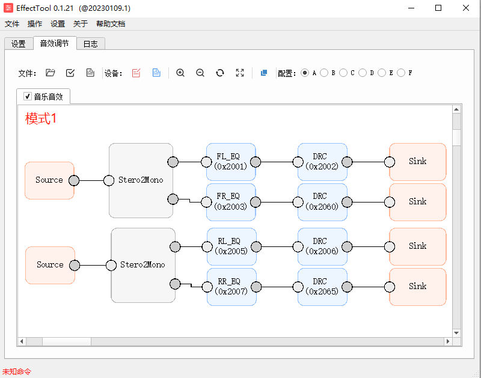

**1.3** 进入 `musicEQ` 界面，可以通过调节段点，或修改对应段点数据，进行频率、增益和高/中/低带通等的设置。

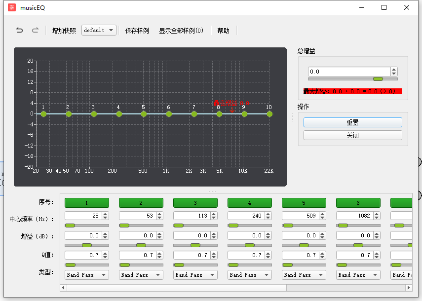

**1.4** 进入 `CrossOver` 界面：可以设置低中分频点，也可调节分频器阶数。

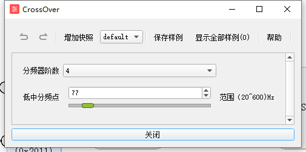

> **分频点处问题**：由于分频点是低中DRC处理器的界限，所以在该频点处两个DRC的调节叠加会比较明显。
>
> 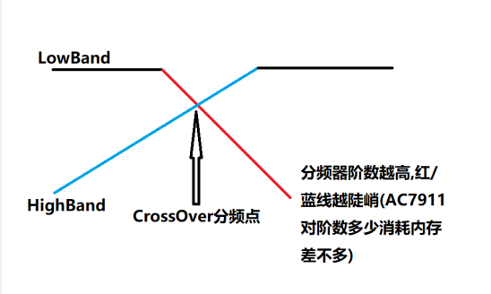

**1.5** 进入 `LowBandDRC` `HighBandDRC` `DRC` 界面：可以使用限幅器、多带限幅器、压缩器和多带压缩器，例子可以查看快照。曲线可以通过双击增加节点，右键可以编辑节点位置信息。

在 `include_lib/media/effects_adj.h` 中，如下宏控制DRC使能与否（v1.2.0以后，该宏移去 `app_config.h`，并且增加模式二，EQ/DRC可以控制左右前后声道是否共用与独立处理，若共用则默认使用左/前声道的EQ/DRC）

```c
#if (TCFG_EQ_MODE_CHOOSE == 0)
#define TCFG_AUDIO_MDRC_ENABLE      2  //0:不使能低中DRC 1: 多带分频器使能 2: 多带分频后，再做一次全带处理使能
#define TCFG_LAST_WHOLE_DRC_ENABLE  1  //0:不使能最后的全带DRC; 1:使能
#elif (TCFG_EQ_MODE_CHOOSE == 1)
#define TCFG_EQ_DIVIDE_ENABLE       1  //0:前后通道共用EQ/DRC 1:支持EQ/DRC前后声道独立处理
#define TCFG_EQ_SPILT_ENABLE        1  //0:左右通道共用EQ 1:支持EQ左右声道独立处理
#define TCFG_DRC_SPILT_ENABLE       1  //0:左右通道共用DRC 1:支持DRC左右声道独立处理
#endif
```

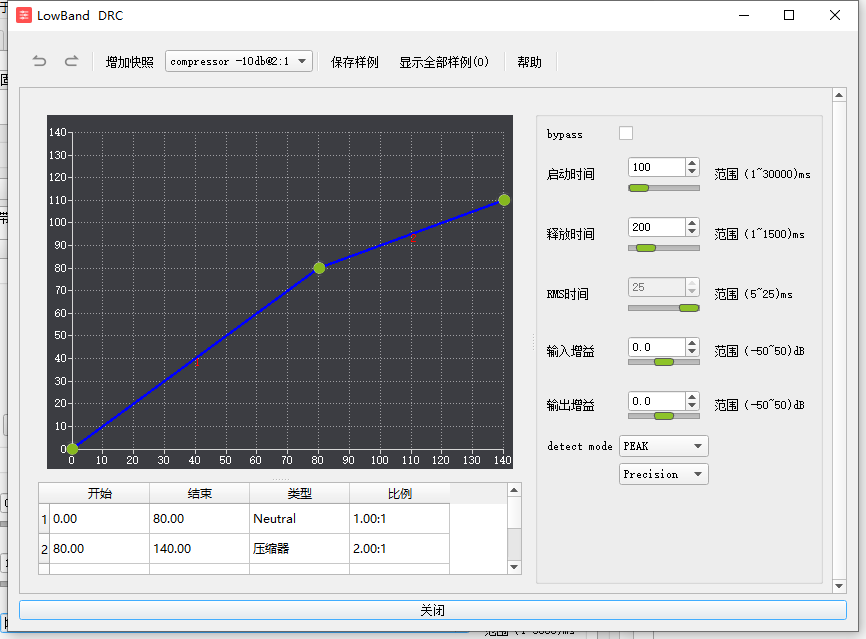

- **bypass**：勾选后该DRC不起作用。
- **启动时间**：输入幅值在曲线以上时，启动DRC到声音幅值稳定所需时间。
- **释放时间**：输入幅值在曲线以下时，关闭DRC到声音幅值稳定所需时间。
- **RMS时间**：detect mode在RMS模式下有效，算法一小段数据的采样范围（包含多个采样点），用于求平均值，以一个数据代表这段时间的数据。
- **输入增益**：进入该DRC前的一个数字gain增益。
- **输出增益**：退出该DRC后的一个数字gain增益。
- **detect mode**：
  - **RMS算法**：取多个采样点的平均声音幅值作为当前RMS时间的平均幅值，低频有效减少声音抖动，高频效果不明显（占用算力大）
  - **PEAK算法**：取多个采样点，取到的采样点都加入算法运算。
  - **precision和precision+**：precision精度比precision+差点，但是运算速度是precision+的一倍。

**1.6** 修改完后，点击"保存配置"，生成"eq_cfg_hw.bin"配置文件，将该文件放置 `cpu/wl82/tools/cfg` 目录下，重新烧录的时候会将该文件烧写进设备，也可以点击 `加载配置文件` 加载文件里的配置。设备开机时，首先会读取加载烧录进设备的EQ文件，当打开在线EQ调试，会加载当前工具的配置，可以点击左上角 `将配置写入设备` 覆盖设备里旧的配置，也可以点击 `从设备中读取` 按钮读取设备配置。

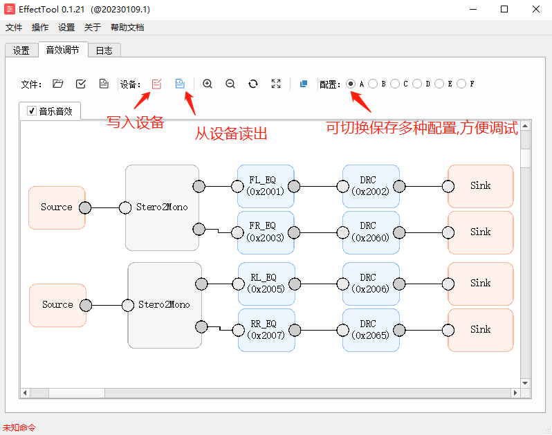

**SDK代码需要在请求打开解码器时需要加上以下参数才会有EQ效果**：

```c
#if TCFG_EQ_ENABLE
#if defined EQ_CORE_V1
    req.dec.attr |= AUDIO_ATTR_EQ_EN;
#if TCFG_LIMITER_ENABLE
    req.dec.attr |= AUDIO_ATTR_EQ32BIT_EN;
#endif
#if TCFG_DRC_ENABLE
    req.dec.attr |= AUDIO_ATTR_DRC_EN;
#endif
#else
    struct eq_s_attr eq_attr = {0};
    extern void set_eq_req_attr_parm(struct eq_s_attr * eq_attr);
    set_eq_req_attr_parm(&eq_attr);
    req.dec.eq_attr = &eq_attr;
    req.dec.eq_hdl = __this->eq_hdl;
#endif
#endif
```

### 9.6.2.3. 常见问题

> **Note**
>
> - 在线调试发送命令一直提示超时，请检查USB/串口 IO是否被其他模块占用，检查杜邦线连接是否正常

### 9.6.2.4. API参考

> **Warning**: doxygenfile: Cannot find file "cpu/wl82/asm/eq.h"

---

# 9.7. 音频编码AUDIO_ENC

**概述**

提供音频编码的使用流程

## 9.7.1. 使用流程

**1. 打开编码服务**

```c
struct server *enc_server = server_open("audio_server", "enc"); //打开编码服务
```

**2. 注册编码服务事件回调**

> **注意**：服务事件回调是通过任务的队列消息传递的，此消息是不允许丢失的，使用者需要做好相应的异步处理，哪个线程注册该回调函数就是该线程负责接收，特别需要注意不能出现消息队列填满引起的死锁问题，调用的任务需要通过os_taskq_pend接收消息回调。

```c
static void enc_server_event_handler(void *priv, int argc, int *argv)
{
    switch (argv[0]) {
    case AUDIO_SERVER_EVENT_END:        //编码结束
        break;
    case AUDIO_SERVER_EVENT_ERR:        //编码错误
        break;
    case AUDIO_SERVER_EVENT_SPEAK_START://VAD检测到开始说话
        break;
    case AUDIO_SERVER_EVENT_SPEAK_STOP: //VAD检测到停止说话
        break;
    }
}

server_register_event_handler(enc_server, priv, enc_server_event_handler);//注册编码服务事件回调
```

通常将编码服务事件回调注册到app_core中接收队列消息：

```c
server_register_event_handler_to_task(enc_server, priv, enc_server_event_handler, "app_core");
```

也可以注册到创建的线程中，可参考：[virtual_enc虚拟源编码](https://doc.zh-jieli.com/AC792/zh-cn/wifi_video_master/module_example/audio/virtual_enc.html) 中注册编码服务事件回调函数的方式

**3. 编码请求参数解析**

```c
struct audio_enc_req {
    u8 cmd;                         /*!< 请求操作类型 */
    u8 status;                      /*!< 编码器状态 */
    u8 channel;                     /*!< 同时编码的通道数 */
    u8 channel_bit_map;             /*!< ADC通道选择 */
    u8 volume;                      /*!< ADC增益(0-100)，编码过程中可以通过AUDIO_ENC_SET_VOLUME动态调整增益 */
    u8 priority;                    /*!< 编码优先级，暂时没用到 */
    u8 use_vad : 2;                 /*!< 0:关闭vad功能 1:使用旧vad算法 2:使用JL新vad算法 */
    u8 vad_auto_refresh : 1;        /*!< 是否自动刷新VAD状态，赋值1表示SPEAK_START->SPEAK_STOP->SPEAK_START->SPEAK_STOP->....循环 */
    u8 direct2dac : 1;              /*!< AUDIO_AD直通DAC功能 */
    u8 high_gain : 1;               /*!< 直通DAC时是否打开模拟增益调整 */
    u8 amr_src : 1;                 /*!< amr编码时的强制16k变采样为8kpcm数据，因为amr编码器暂时只支持8k编码 */
    u8 aec_enable : 1;              /*!< AEC回声消除功能开关，常用于蓝牙通话 */
    u8 ch_data_exchange : 1;        /*!< 用于AEC差分回采时和MIC的通道数据交换 */
    u8 no_header : 1;               /*!< 用于opus编码时是否需要添加头部格式 */
    u8 vir_data_wait : 1;           /*!< 虚拟编码时是否允许丢失数据 */
    u8 no_auto_start : 1;           /*!< 请求AUDIO_ENC_OPEN时不自动运行编码器，需要主动调用AUDIO_ENC_START */
    u8 sample_depth : 3;            /*!< 采样深度16bit或者24bit */
    u8 dns_enable : 1;              /*!< dns降噪算法 0:不使用 1:使用 */
    u8 reserve : 1;                 /*!< 保留位 */
    u16 vad_start_threshold;        /*!< VAD连续检测到声音的阈值，表示开始说话，回调AUDIO_SERVER_EVENT_SPEAK_START，单位ms，填0使用库内默认值 */
    u16 vad_stop_threshold;         /*!< VAD连续检测到静音的阈值, 表示停止说话，回调AUDIO_SERVER_EVENT_SPEAK_STOP，单位ms,填0使用库内默认值 */
    u16 frame_size;                 /*!< 编码器输出的每一帧帧长大小，只有pcm格式编码时才有效 */
    u16 frame_head_reserve_len;     /*!< 编码输出的帧预留头部的大小 */
    u32 bitrate;                    /*!< 编码码率大小 */
    u32 delay_ms;                   /*!< 当编码器读写不到数据后的延时等待 */
    u32 output_buf_len;             /*!< 编码buffer大小 */
    u32 sample_rate;                /*!< 编码采样率 */
    u32 msec;                       /*!< 编码时长，填0表示一直编码，单位ms，编码结束会回调AUDIO_SERVER_EVENT_END消息 */
    FILE *file;                     /*!< 编码输出文件句柄 */
    u8 *output_buf;                 /*!< 编码buffer，默认填NULL，由编码器自动分配和释放资源 */
    const char *format;             /*!< 编码格式 */
    const char *sample_source;      /*!< 采样源，支持"mic","linein","plnk0","plnk1"，"virtual"，"iis0"，"iis1"，"spdif" */
    const struct audio_vfs_ops *vfs_ops; /*!< 虚拟文件操作句柄 */
    u32 (*read_input)(u8 *buf, u32 len);  /*!< 用于虚拟采样源"virtual"编码时的数据读取操作读输入buf及其长度 */
    void *aec_attr;                 /*!< AEC回声消除算法配置参数 */
};
```

**3.1 cmd**

完整的编码命令使用流程应该是 `AUDIO_ENC_OPEN` -> `AUDIO_ENC_CLOSE`，其他命令暂时无效，每一次编码结束后一定要主动调用 `AUDIO_ENC_CLOSE` 释放当前的资源，才能再次调用 `AUDIO_ENC_OPEN`。

**3.2 channel和channel_bit_map**

编码通道数同时支持四路，需要哪一路数据就填 `BIT(x)`，多路数据通过 `|` 叠加

**3.3 format**

当前编码格式支持：spx、opus、wav、amr、pcm、cvsd、msb、sbc、mp3、mp2、adpcm。

**3.4 vfs_ops和file**

当 `vfs_ops` 为空时，默认编码封装成文件，此时 `file` 不能为空，`file` 需要赋值为 `fopen` 操作成功后返回的文件句柄，当编码结束后用户自己需要调用 `fclose` 关闭文件。

当 `vfs_ops` 非空时，编码器编码后的数据写入操作都通过该虚拟文件操作句柄，此时 `file` 参数可传入用户的私有数据指针，具体例子如下代码的 `reverberation_vfs_ops`。

```c
static int reverberation_vfs_fwrite(void *file, void *data, u32 len)
{
    //此函数内一定不能堵塞
    return len; //返回0可以强制触发编码结束，会有回调消息AUDIO_SERVER_EVENT_ERR
}

static int reverberation_vfs_fclose(void *file)
{
    return 0;
}

static const struct audio_vfs_ops reverberation_vfs_ops {
    .fwrite = reverberation_vfs_fwrite,
    .fclose = reverberation_vfs_fclose,
};
```

**4. 关闭编码服务**

```c
server_close(enc_server);
```

## 9.7.2. API参考

**音频编解码请求操作类型**

- 解码请求
- 编码请求
- 命令控制

**命令控制**

- 打开解码
- 开始解码
- 暂停解码
- 停止解码
- 快进
- 快退
- 获取断点数据
- 暂停/播放
- 设置解码音量
- 设置当前解码的MUTE状态
- 设置变速变调的参数
- 获取当前解码器状态
- 设置AB点复读播放
- 关闭AB点复读播放
- 获取对应音效算法的句柄
- 设置循环播放
- 打开编码
- 开始编码
- 暂停编码
- 停止编码
- 关闭解码
- 设置编码模拟增益
- 获取当前编码器状态
- 暂停/编码

**AB点复读设置状态**

Values:

- 未设置AB点
- 已设置A点
- 已设置B点

**AB点复读模式**

Values:

- 设置A点参数
- 设置B点参数
- 设置取消AB点参数

**解码器控制命令**

Values:

- 设置复读A点
- 设置复读B点
- 设置AB点取消复读模式
- 设置循环播放
- 设置采样率或者码率
- 设置指定位置播放
- 获取毫秒级时间

**AUDIO_SERVER事件回调**

Values:

- AUDIO_SERVER编/解码当前时间
- AUDIO_SERVER编/解码结束
- AUDIO_SERVER编/解码错误
- VAD检测到开始说话
- VAD检测到停止说话

**解码附加属性**

Values:

- 保证解码的实时性，解码读数不能堵塞，仅限于蓝牙播歌时时钟同步使用
- 伴奏功能，只支持双声道
- 变速变声功能开关
- 解码器左右通道数据叠加
- 文件解密播放，需要配合对应的加密工具
- 模拟音量淡入淡出，解码开始和暂停时使用
- EQ功能开关
- DRC功能开关，使能时需要打开EQ功能
- EQ 32bit输出
- 蓝牙AAC解码
- 当前解码输出mute使能
- 当前解码无限循环播放使能
- 当前解码强制不走叠音流程
- 数字音量淡入淡出，解码开始时使用
- 播放存储在sdram的提示音
- 当前解码开始时不需等待解码数据缓存

**音效附加属性**

Values:

- 对音频解码数据进行频谱运算
- 对音频解码数据进行数字音量调整
- 对音频解码数据进行虚拟低音

**struct audio_enc_req - 编码请求参数**

Public Members:

- `cmd` - 请求操作类型
- `status` - 编码器状态
- `channel` - 同时编码的通道数
- `channel_bit_map` - ADC通道选择
- `volume` - ADC增益(0-100)，编码过程中可以通过AUDIO_ENC_SET_VOLUME动态调整增益
- `priority` - 编码优先级，暂时没用到
- `use_vad` - 0:关闭vad功能 1:使用旧vad算法 2:使用JL新vad算法
- `vad_auto_refresh` - 是否自动刷新VAD状态
- `direct2dac` - AUDIO_AD直通DAC功能
- `high_gain` - 直通DAC时是否打开模拟增益调整
- `amr_src` - amr编码时的强制16k变采样为8kpcm数据
- `aec_enable` - AEC回声消除功能开关，常用于蓝牙通话
- `ch_data_exchange` - 用于AEC差分回采时和MIC的通道数据交换
- `no_header` - 用于opus编码时是否需要添加头部格式
- `vir_data_wait` - 虚拟编码时是否允许丢失数据
- `no_auto_start` - 请求AUDIO_ENC_OPEN时不自动运行编码器
- `sample_depth` - 采样深度16bit或者24bit
- `dns_enable` - dns降噪算法 0:不使用 1:使用
- `vad_start_threshold` - VAD连续检测到声音的阈值，单位ms
- `vad_stop_threshold` - VAD连续检测到静音的阈值，单位ms
- `frame_size` - 编码器输出的每一帧帧长大小
- `frame_head_reserve_len` - 编码输出的帧预留头部的大小
- `bitrate` - 编码码率大小
- `delay_ms` - 当编码器读写不到数据后的延时等待
- `output_buf_len` - 编码buffer大小
- `sample_rate` - 编码采样率
- `msec` - 编码时长，填0表示一直编码，单位ms
- `file` - 编码输出文件句柄
- `output_buf` - 编码buffer，默认填NULL
- `format` - 编码格式
- `sample_source` - 采样源，支持"mic","linein","plnk0","plnk1"，"virtual"，"iis0"，"iis1"，"spdif"
- `vfs_ops` - 虚拟文件操作句柄
- `read_input` - 用于虚拟采样源"virtual"编码时的数据读取操作
- `aec_attr` - AEC回声消除算法配置参数

**解码虚拟输出时的cbuf读写参数结构体**

Public Members:

- cbuf句柄
- 写信号量指针
- 读信号量指针
- 读写结束
- 是否正在解码状态

**解码断点播放信息结构体**

Public Members:

- buf长度
- 断点位置偏移量
- 断点数据指针 ape格式断点最大2036字节

**获取audio解码器信息**

Public Members:

- 通道
- 名称编码 0:ansi, 1:unicode_le, 2:unicode_be
- 采样率
- 比特率
- 总时间

**audio命令控制**

Public Members:

- 请求操作类型
- 传入指针

**指定位置播放参数**

Public Members:

- 要跳转过去播放的起始时间。单位：ms。设置后跳到start_time开始播放
- 要跳转过去播放的目标时间。单位：ms。播放到dest_time后如果callback_func存在，则调用callback_func
- 到达目标时间后回调
- 回调参数，可以在callback_func回调中实现对应需要的动作

**音频虚拟文件操作句柄**

Public Members:

- 打开创建路径文件
- 读文件
- 写文件
- 寻址文件
- 返回给定流stream的当前文件位置
- 获取文件长度
- 关闭文件

**相位修复**

Public Members:

- 相位修复buf

**循环播放配置**

Public Members:

- 置1使能
- 砍掉前面几帧，仅mp3格式有效
- 砍掉后面几帧，仅mp3格式有效
- 循环播放回调，返回0-正常循环；返回非0-结束循环
- 回调参数指针
- 相位修复buf指针

**解码请求参数**

Public Members:

- 请求操作类型
- 请求后返回的解码状态
- 解码通道数
- 模拟音量(0-100)
- 数字音量初始值(0-100)
- 解码优先级，暂时没用到
- > 80是变快，<80是变慢，建议范围：30到130
  >
- 循环播放次数
- > 32768是音调变高，<32768音调变低，建议范围20000到50000
  >
- 解码附加属性
- 音效附加属性
- 解码buffer大小
- 强制变采样前的原始采样率，当混响使能强制变采样时才使用
- 强制变采样的目标采样率
- 实际的解码采样率
- 快进快退级数
- 解码的总共时长
- 断点恢复时的当前播放时间
- 解码缓存buffer，默认填NULL，由解码器自己实现分配和释放
- FILE 需要解码的文件句柄
- 解码格式
- 播放源，支持"dac","iis0","iis1"
- 断点播放信息句柄
- 虚拟文件操作句柄
- eq属性设置
- 预先申请好的的eq句柄
- 虚拟解码句柄，供外部读写使用
- 解码后的PCM数据回调
- 解码对端采样率同步，常用于蓝牙解码
- 获取私有句柄
- 解码对端采样率同步私有指针

**audio服务请求参数**

Public Members:

- audio_dec_req 解码请求
- audio_enc_req 编码请求
- audio_ioctl 命令控制
- audio_finfo 音频信息

---

# 9.8. 音频解码AUDIO_DEC

**概述**

提供音频解码的使用流程

## 9.8.1. 使用流程

**1. 打开解码服务**

```c
struct server *enc_server = server_open("audio_server", "dec"); //打开解码服务
```

**2. 注册解码服务事件回调**

> **注意**：服务事件回调是通过任务的队列消息传递的，此消息是不允许丢失的，使用者需要做好相应的异步处理，哪个线程注册该回调函数就是该线程负责接收，特别需要注意不能出现消息队列填满引起的死锁问题，调用的任务需要通过os_taskq_pend接收消息回调。

```c
static void dec_server_event_handler(void *priv, int argc, int *argv)
{
    switch (argv[0]) {
    case AUDIO_SERVER_EVENT_END:        //解码结束
        //建议在解码结束时加上暂停操作，避免出现死锁问题
        union audio_req r = {0};
        r.dec.cmd = AUDIO_DEC_PAUSE;
        server_request(dec_server, AUDIO_REQ_DEC, &r);
        break;
    case AUDIO_SERVER_EVENT_CURR_TIME:  //当前播放时间
        log_d("play_time: %d\n", argv[1]);
        break;
    }
}

server_register_event_handler(dec_server, priv, dec_server_event_handler);//注册解码服务事件回调
```

通常将解码服务事件回调注册到app_core中接收队列消息：

```c
server_register_event_handler_to_task(dec_server, priv, dec_server_event_handler, "app_core");
```

也可以注册到创建的线程中，可参考：[virtual_enc虚拟源编码](https://doc.zh-jieli.com/AC792/zh-cn/wifi_video_master/module_example/audio/virtual_enc.html) 中注册编码服务事件回调函数的方式

**3. 解码请求参数解析**

```c
struct audio_dec_req {
    u8 cmd;                         /*!< 请求操作类型 */
    u8 status;                      /*!< 请求后返回的解码状态 */
    u8 channel;                     /*!< 解码通道数 */
    u8 volume;                      /*!< 解码音量(0-100) */
    u8 priority;                    /*!< 解码优先级，暂时没用到 */
    u8 speedV;                      /*!< >80是变快，<80是变慢，建议范围：30到130 */
    u16 pitchV;                     /*!< >32768是音调变高，<32768音调变低，建议范围20000到50000 */
    u16 attr;                       /*!< 解码附加属性 */
    u8 digital_gain_mul;            /*!< 数字增益乘值 */
    u8 digital_gain_div;            /*!< 数字增益除值 */
    u32 output_buf_len;             /*!< 解码buffer大小 */
    u32 orig_sr;                    /*!< 原始采样率，当使能强制变采样时才使用 */
    u32 force_sr;                   /*!< 强制变采样的目标采样率，当使能强制变采样时才使用 */
    u32 sample_rate;                /*!< 实际的解码采样率 */
    u32 ff_fr_step;                 /*!< 快进快退级数 */
    u32 total_time;                 /*!< 解码的总共时长 */
    u32 play_time;                  /*!< 断点恢复时的当前播放时间 */
    void *output_buf;               /*!< 解码缓存buffer，默认填NULL，由解码器自己实现分配和释放 */
    FILE *file;                     /*!< 需要解码的文件句柄 */
    const char *dec_type;           /*!< 解码格式 */
    const char *sample_source;      /*!< 播放源，支持"dac","iis0","iis1" */
    struct audio_dec_breakpoint *bp;/*!< 断点播放信息句柄 */
    const struct audio_vfs_ops *vfs_ops; /*!< 虚拟文件操作句柄 */
    void *eq_attr;                  /*!< eq属性设置 */
    void *eq_hdl;                   /*!< 预先申请好的的eq句柄 */
    struct audio_cbuf_t *virtual_audio; /*!< 虚拟解码句柄，供外部读写使用 */
    int (*dec_callback)(u8 *buf, u32 len, u32 sample_rate, u8 ch_num); /*!< 解码后的PCM数据回调 */
    int (*dec_sync)(void *priv, u32 data_size, u16 *in_rate, u16 *out_rate); /*!< 解码对端采样率同步，常用于蓝牙解码 */
};
```

**3.1 cmd**

完整的解码命令使用流程应该是AUDIO_DEC_OPEN->AUDIO_DEC_START->AUDIO_DEC_PAUSE->AUDIO_DEC_STOP，每一次解码结束后一定要主动调用AUDIO_DEC_STOP释放当前的解码资源，才能再次调用AUDIO_DEC_OPEN，其他指令除了AUDIO_DEC_GET_STATUS外，使用提前是已经调用AUDIO_DEC_OPEN。

```c
#define AUDIO_DEC_OPEN              0   //打开解码
#define AUDIO_DEC_START             1   //开始解码
#define AUDIO_DEC_PAUSE             2   //暂停解码
#define AUDIO_DEC_STOP              3   //停止解码
#define AUDIO_DEC_FF                4   //快进
#define AUDIO_DEC_FR                5   //快退
#define AUDIO_DEC_GET_BREAKPOINT    6   //获取断点数据
#define AUDIO_DEC_PP                7   //暂停/播放
#define AUDIO_DEC_SET_VOLUME        8   //设置解码音量值
#define AUDIO_DEC_DIGITAL_MUTE_SET  9   //设置当前解码的MUTE状态
#define AUDIO_DEC_PS_PARM_SET       10  //设置变速变调的参数
#define AUDIO_DEC_GET_STATUS        11  //获取当前的解码器状态
#define AUDIO_DEC_AB_REPEAT_SET     12  //设置AB点复读播放
#define AUDIO_DEC_AB_REPEAT_CLOSE   13  //关闭AB点复读播放
```

**3.2 status**

返回当前的解码状态

```c
#define AUDIO_DEC_OPEN      0   //解码已打开
#define AUDIO_DEC_START     1   //解码已开始
#define AUDIO_DEC_PAUSE     2   //解码已暂停
#define AUDIO_DEC_STOP      3   //解码已停止
```

**3.3 channel**

解码通道数 0: 从解码器的格式检查中自动获取 1:单通道 2:双通道

**3.4 volume**

音量取值范围为0-100，使用命令->AUDIO_DEC_OPEN或AUDIO_DEC_SET_VOLUME

**3.5 attr**

```c
AUDIO_ATTR_REAL_TIME        = BIT(0),   //保证解码的实时性，解码读数不能堵塞，仅限于蓝牙播歌时时钟同步使用
AUDIO_ATTR_LR_SUB           = BIT(1),   //伴奏功能，只支持双声道
AUDIO_ATTR_PS_EN            = BIT(2),   //变速变声功能开关
AUDIO_ATTR_LR_ADD           = BIT(3),   //左右通道数据叠加
AUDIO_ATTR_DECRYPT_DEC      = BIT(4),   //文件解密播放，需要配合对应的加密工具
AUDIO_ATTR_FADE_INOUT       = BIT(5),   //模拟音量淡入淡出，解码开始和暂停时使用
AUDIO_ATTR_EQ_EN            = BIT(6),   //EQ功能开关
AUDIO_ATTR_DRC_EN           = BIT(7),   //DRC功能开关，使能时需要打开EQ功能
AUDIO_ATTR_EQ32BIT_EN       = BIT(8),   //EQ 32bit输出
AUDIO_ATTR_BT_AAC_EN        = BIT(9),   //蓝牙AAC解码
AUDIO_ATTR_DEC_MUTE_EN      = BIT(10),  //当前解码输出mute使能
```

**3.6 effect**

解码输出后的音效处理

**3.7 output_buf_len和output_buf**

output_buf_len必须填非0值，output_buf默认填NULL，由解码器自己实现分配和释放资源，使用命令->AUDIO_DEC_OPEN

**3.8 orig_sr、force_sr和sample_rate**

orig_sr和force_sr为非0值时，启用强制变采样解码，orig_sr为原始采样率，force_sr为变采样后的采样率，目前仅用于叠音功能上，使用命令->AUDIO_DEC_OPEN

**3.9 total_time和play_time**

当请求打开解码后，该参数保存当前解码的播放总时长和断点恢复时的当前播放时间，一般是从解码器的格式检查中获取，使用命令->AUDIO_DEC_OPEN

**3.10 vfs_ops和file**

当vfs_ops为空时，默认为解码文件操作，此时file不能为空，file需要赋值为fopen操作成功后返回的文件句柄，当解码结束后用户自己需要调用fclose关闭文件。

当vfs_ops非空时，解码器的解码数据源读取操作都通过该虚拟文件操作句柄获取，此时file参数可传入用户的私有数据指针，具体例子如下代码的net_audio_dec_vfs_ops。

当有使用到jltar打包文件时，需要播放打包中文件，可参考apps/demo/demo_audio/demo/local_music.c中vfs_sd_test部分例子中进行参考使用vfs_ops

```c
static const struct audio_vfs_ops net_audio_dec_vfs_ops {
    .fread = net_download_read,
    .fseek = net_download_seek,
    .flen = net_download_get_file_len,
};
```

**3.11 dec_type**

当前解码格式支持mp2、mp3、m4a、ape、flac、wav、amr、pcm、adpcm、wma、aac、spx、sbc、cvsd、msbc、opus、dts，使用命令->AUDIO_DEC_OPEN

**3.12 sample_source**

播放源默认为"dac"，还支持"IIS0"和"IIS1"硬件输出，使用命令->AUDIO_DEC_OPEN

**3.13 bp**

使用命令->AUDIO_DEC_OPEN，bp非空时作用是恢复该断点播放。

使用命令->AUDIO_DEC_GET_BREAKPOINT，bp保存下当前解码的断点数据，获取后的bp->data需要用户自行释放内存

**3.14 eq_attr和eq_hdl**

eq_attr为空时，启用eq功能，用户需要配置好合适的eq参数，请求后eq_hdl返回唯一的eq句柄，所有解码器都是共用同一个eq句柄，使用命令->AUDIO_DEC_OPEN

注意：这两个函数仅限于AC790X旧EQ工具使用，新EQ工具无效

**3.15 pitchV和speedV**

变速变调参数设置，使用命令->AUDIO_DEC_OPEN和AUDIO_DEC_PS_PARM_SET

**3.16 ff_fr_step**

设置快进快退时的秒数，使用命令->AUDIO_DEC_FF或者AUDIO_DEC_FR

**4. 关闭编码服务**

```c
server_close(dec_server);
```

## 9.8.2. 常见问题

**打印[Info]: [SERVER_CORE]server_event_handler wait_send_event: app_core, 这是啥原因造成的?**

这是消息事件推送不出去的打印, 导致这个情况的原因大概率是由于app_core这个线程中做了一些延时的操作导致这个线程卡住, 没有及时获取最新的事件, 事件池占满。解决方法是不能在app_core这个线程中做延时或其他能够让这个线程卡住的操作。

## 9.8.3. API参考

**音频编解码请求操作类型**

AUDIO_REQ_DEC
解码请求

AUDIO_REQ_ENC
编码请求

AUDIO_REQ_IOCTL
命令控制

AUDIO_DEC_OPEN
打开解码

AUDIO_DEC_START
开始解码

AUDIO_DEC_PAUSE
暂停解码

AUDIO_DEC_STOP
停止解码

AUDIO_DEC_FF
快进

AUDIO_DEC_FR
快退

AUDIO_DEC_GET_BREAKPOINT
获取断点数据

AUDIO_DEC_PP
暂停/播放

AUDIO_DEC_SET_VOLUME
设置解码音量

AUDIO_DEC_DIGITAL_MUTE_SET
设置当前解码的MUTE状态

AUDIO_DEC_PS_PARM_SET
设置变速变调的参数

AUDIO_DEC_GET_STATUS
获取当前解码器状态

AUDIO_DEC_AB_REPEAT_SET
设置AB点复读播放

AUDIO_DEC_AB_REPEAT_CLOSE
关闭AB点复读播放

AUDIO_DEC_GET_EFFECT_HANDLE
获取对应音效算法的句柄

AUDIO_DEC_REPEAT_SET
设置循环播放

AUDIO_ENC_OPEN
打开编码

AUDIO_ENC_START
开始编码

AUDIO_ENC_PAUSE
暂停编码

AUDIO_ENC_STOP
停止编码

AUDIO_ENC_CLOSE
关闭解码

AUDIO_ENC_SET_VOLUME
设置编码模拟增益

AUDIO_ENC_GET_STATUS
获取当前编码器状态

AUDIO_ENC_PP
暂停/编码

**enum [anonymous]**

AB点复读设置状态

Values:

enumerator AB_REPEAT_STA_NON
未设置AB点

enumerator AB_REPEAT_STA_ASTA
已设置A点

enumerator AB_REPEAT_STA_BSTA
已设置B点

**enum [anonymous]**

AB点复读模式

Values:

enumerator AB_REPEAT_MODE_BP_A
设置A点参数

enumerator AB_REPEAT_MODE_BP_B
设置B点参数

enumerator AB_REPEAT_MODE_CUR
设置取消AB点参数

**enum [anonymous]**

解码器控制命令

Values:

enumerator AUDIO_IOCTRL_CMD_SET_BREAKPOINT_A
设置复读A点

enumerator AUDIO_IOCTRL_CMD_SET_BREAKPOINT_B
设置复读B点

enumerator AUDIO_IOCTRL_CMD_SET_BREAKPOINT_MODE
设置AB点取消复读模式

enumerator AUDIO_IOCTRL_CMD_REPEAT_PLAY
设置循环播放

enumerator AUDIO_IOCTRL_CMD_SET_DEC_SR
设置采样率或者码率

enumerator AUDIO_IOCTRL_CMD_SET_DEST_PLAYPOS
设置指定位置播放

enumerator AUDIO_IOCTRL_CMD_GET_PLAYPOS
获取毫秒级时间

**Enums**

**enum [anonymous]**

enum AUDIO_SERVER事件回调

Values:

enumerator AUDIO_SERVER_EVENT_CURR_TIME
AUDIO_SERVER编/解码当前时间

enumerator AUDIO_SERVER_EVENT_END
AUDIO_SERVER编/解码结束

enumerator AUDIO_SERVER_EVENT_ERR
AUDIO_SERVER编/解码错误

enumerator AUDIO_SERVER_EVENT_SPEAK_START
VAD检测到开始说话

enumerator AUDIO_SERVER_EVENT_SPEAK_STOP
VAD检测到停止说话

**enum [anonymous]**

解码附加属性

Values:

enumerator AUDIO_ATTR_REAL_TIME
保证解码的实时性，解码读数不能堵塞，仅限于蓝牙播歌时时钟同步使用

enumerator AUDIO_ATTR_LR_SUB
伴奏功能，只支持双声道

enumerator AUDIO_ATTR_PS_EN
变速变声功能开关

enumerator AUDIO_ATTR_LR_ADD
解码器左右通道数据叠加

enumerator AUDIO_ATTR_DECRYPT_DEC
文件解密播放，需要配合对应的加密工具

enumerator AUDIO_ATTR_FADE_INOUT
模拟音量淡入淡出，解码开始和暂停时使用

enumerator AUDIO_ATTR_EQ_EN
EQ功能开关

enumerator AUDIO_ATTR_DRC_EN
DRC功能开关，使能时需要打开EQ功能

enumerator AUDIO_ATTR_EQ32BIT_EN
EQ 32bit输出

enumerator AUDIO_ATTR_BT_AAC_EN
蓝牙AAC解码

enumerator AUDIO_ATTR_DEC_MUTE_EN
当前解码输出mute使能

enumerator AUDIO_ATTR_UNLIMITED_REPEAT
当前解码无限循环播放使能

enumerator AUDIO_ATTR_DEC_SOLO
当前解码强制不走叠音流程

enumerator AUDIO_ATTR_DIGITAL_FADE_INOUT
数字音量淡入淡出，解码开始时使用

enumerator AUDIO_ATTR_SDRAM_PROMPT
播放存储在sdram的提示音

enumerator AUDIO_ATTR_NO_WAIT_READY
当前解码开始时不需等待解码数据缓存

**enum [anonymous]**

音效附加属性

Values:

enumerator AUDIO_EFFECT_SPECTRUM_FFT
对音频解码数据进行频谱运算

enumerator AUDIO_EFFECT_DIGITAL_VOL
对音频解码数据进行数字音量调整

enumerator AUDIO_EFFECT_VIRTUAL_BASS
对音频解码数据进行虚拟低音

**struct audio_cbuf_t**

#include <audio_server.h>

解码虚拟输出时的cbuf读写参数结构体

Public Members

void *cbuf
cbuf句柄

void *wr_sem
写信号量指针

void *rd_sem
读信号量指针

volatile u16 end
读写结束

volatile u8 state
是否正在解码状态

**struct audio_dec_breakpoint**

#include <audio_server.h>

解码断点播放信息结构体

Public Members

int len
buf长度

u32 fptr
断点位置偏移量

u8 *data
断点数据指针 ape格式断点最大2036字节

**struct audio_finfo**

#include <audio_server.h>

获取audio解码器信息

Public Members

u8 channel
通道

u8 name_code
名称编码 0:ansi, 1:unicode_le, 2:unicode_be

int sample_rate
采样率

int bit_rate
比特率

int total_time
总时间

**struct audio_ioctl**

#include <audio_server.h>

audio命令控制

Public Members

u32 cmd
请求操作类型

void *priv
传入指针

**struct audio_dest_time_play_param**

#include <audio_server.h>

指定位置播放参数

Public Members

u32 start_time
要跳转过去播放的起始时间。单位：ms。设置后跳到start_time开始播放

u32 dest_time
要跳转过去播放的目标时间。单位：ms。播放到dest_time后如果callback_func存在，则调用callback_func

u32 (*callback_func)(void *priv)
到达目标时间后回调

void *callback_priv
回调参数，可以在callback_func回调中实现对应需要的动作

**struct audio_vfs_ops**

#include <audio_server.h>

音频虚拟文件操作句柄

Public Members

void *(*fopen)(const char *path, const char *mode)
打开创建路径文件

int (*fread)(void *file, void *buf, u32 len)
读文件

int (*fwrite)(void *file, void *buf, u32 len)
写文件

int (*fseek)(void *file, u32 offset, int seek_mode)
寻址文件

int (*ftell)(void *file)
返回给定流stream的当前文件位置

int (*flen)(void *file)
获取文件长度

int (*fclose)(void *file)
关闭文件

**struct fixphase_repair_obj**

Public Members

short fifo_buf[18 + 12][32][2]
相位修复buf

**struct audio_repeat_mode_param**

Public Members

int flag
置1使能

int headcut_frame
砍掉前面几帧，仅mp3格式有效

int tailcut_frame
砍掉后面几帧，仅mp3格式有效

int (*repeat_callback)(void*)
循环播放回调，返回0-正常循环；返回非0-结束循环

void *callback_priv
回调参数指针

struct fixphase_repair_obj *repair_buf
相位修复buf指针

**struct audio_dec_req**

#include <audio_server.h>

解码请求参数

Public Members

u8 cmd
请求操作类型

u8 status
请求后返回的解码状态

u8 channel
解码通道数

u8 volume
模拟音量(0-100)

u8 digital_volume
数字音量初始值(0-100)

u8 priority
解码优先级，暂时没用到

u8 speedV

> 80是变快，<80是变慢，建议范围：30到130

u16 repeat_num
循环播放次数

u16 pitchV

> 32768是音调变高，<32768音调变低，建议范围20000到50000

u16 attr
解码附加属性

u16 effect
音效附加属性

u32 output_buf_len
解码buffer大小

u32 orig_sr
强制变采样前的原始采样率，当混响使能强制变采样时才使用

u32 force_sr
强制变采样的目标采样率

u32 sample_rate
实际的解码采样率

u32 ff_fr_step
快进快退级数

u32 total_time
解码的总共时长

u32 play_time
断点恢复时的当前播放时间

void *output_buf
解码缓存buffer，默认填NULL，由解码器自己实现分配和释放

FILE *file
需要解码的文件句柄

const char *dec_type
解码格式

const char *sample_source
播放源，支持"dac","iis0","iis1"

struct audio_dec_breakpoint *bp
断点播放信息句柄

const struct audio_vfs_ops *vfs_ops
虚拟文件操作句柄

void *eq_attr
eq属性设置

void *eq_hdl
预先申请好的的eq句柄

struct audio_cbuf_t *virtual_audio
虚拟解码句柄，供外部读写使用

int (*dec_callback)(u8 *buf, u32 len, u32 sample_rate, u8 ch_num)
解码后的PCM数据回调

int (*dec_sync)(void *priv, u32 data_size, u16 *in_rate, u16 *out_rate)
解码对端采样率同步，常用于蓝牙解码

void *get_hdl
获取私有句柄

void *sync_priv
解码对端采样率同步私有指针

**struct audio_enc_req**

#include <audio_server.h>

编码请求参数

Public Members

u8 cmd
请求操作类型

u8 status
编码器状态

u8 channel
同时编码的通道数

u8 channel_bit_map
ADC通道选择

u8 rec_linein_channel_bit_map
ADC的linein回采通道选择

u8 volume
ADC增益(0-100)，编码过程中可以通过AUDIO_ENC_SET_VOLUME动态调整增益

u8 priority
编码优先级，暂时没用到

u8 use_vad
0:关闭vad功能 1:使用旧vad算法 2:使用JL新vad算法

u8 vad_auto_refresh
是否自动刷新VAD状态，赋值1表示SPEAK_START->SPEAK_STOP- >SPEAK_START->SPEAK_STOP->….循环

u8 direct2dac
AUDIO_AD直通DAC功能

u8 high_gain
直通DAC时是否打开模拟增益调整

u8 amr_src
amr编码时的强制16k变采样为8kpcm数据，因为amr编码器暂时只支持8k编码

u8 aec_enable
AEC回声消除功能开关，常用于蓝牙通话

u8 ch_data_exchange
用于AEC差分回采时和MIC的通道数据交换

u8 no_header
用于opus编码时是否需要添加头部格式

u8 vir_data_wait
虚拟编码时是否允许丢失数据

u8 no_auto_start
请求AUDIO_ENC_OPEN时不自动运行编码器，需要主动调用AUDIO_ENC_START

u8 sample_depth
采样深度16bit或者24bit

u8 dns_enable
dns降噪算法 0:不使用 1:使用

u8 wait_sem
编码器数据输出时如果缓存已满即等待信号量

u16 vad_start_threshold
VAD连续检测到声音的阈值，表示开始说话，回调AUDIO_SERVER_EVENT_SPEAK_START，单位ms，填0使用库内默认值

u16 vad_stop_threshold
VAD连续检测到静音的阈值, 表示停止说话，回调AUDIO_SERVER_EVENT_SPEAK_STOP，单位ms,填0使用库内默认值

u16 frame_size
编码器输出的每一帧帧长大小，只有pcm格式编码时才有效

u16 frame_head_reserve_len
编码输出的帧预留头部的大小

u32 bitrate
编码码率大小

u32 delay_ms
当编码器读写不到数据后的延时等待

u32 output_buf_len
编码buffer大小

u32 sample_rate
编码采样率

u32 msec
编码时长，填0表示一直编码，单位ms，编码结束会回调AUDIO_SERVER_EVENT_END消息

FILE *file
编码输出文件句柄

u8 *output_buf
编码buffer，默认填NULL，由编码器自动分配和释放资源

const char *format
编码格式

const char *sample_source
采样源，支持"mic","linein","plnk0","plnk1"，"virtual"，"iis0"，"iis1"，"spdif"

const struct audio_vfs_ops *vfs_ops
虚拟文件操作句柄

int (*read_input)(u8 *buf, u32 len)
用于虚拟采样源"virtual"编码时的数据读取操作读输入buf及其长度，返回负值自动停止编码并回调编码结束的事件

void *aec_attr
AEC回声消除算法配置参数

**union audio_req**

#include <audio_server.h>

audio服务请求参数

Public Members

struct audio_dec_req dec
解码请求

struct audio_enc_req enc
编码请求

struct audio_ioctl ioctl
命令控制

struct audio_finfo info
音频信息

---

# 9.9. DNS神经网络降噪算法

**概述**

提供DNS神经网络降噪算法的配置和使用说明

## 9.9.1. 应用实例

- 普通MIC数据降噪配置
- 蓝牙通话降噪配置

进入 `demo_DevKitBoard/include/app_config.h` ，开启宏 `CONFIG_DNS_ENC_ENABLE`。

### 9.9.1.1. 普通MIC数据降噪配置

```c
union audio_req req = {0};
req.enc.channel_bit_map = BIT(CONFIG_AUDIO_ADC_CHANNEL_L);
req.enc.frame_size = sample_rate / 100 * 4 * channel; //收集够多少字节PCM数据就回调一次fwrite
req.enc.output_buf_len = req.enc.frame_size * 3; //底层缓冲buf至少设成3倍frame_size
req.enc.cmd = AUDIO_ENC_OPEN;
req.enc.channel = channel;
req.enc.volume = __this->gain;
req.enc.sample_rate = sample_rate;
req.enc.format = "pcm";
req.enc.sample_source = "mic";
if (sample_rate == 8000 || sample_rate == 16000)) {
    req.enc.dns_enable = 1; //打开降噪功能
}
//配置DNS参数
struct aec_s_attr parm = {0};
parm.DNS_gain_floor = 0.05;
parm.DNS_over_drive = 1;
req.enc.aec_attr = &parm;
err = server_request(__this->enc_server, AUDIO_REQ_ENC, &req);
```

> **Note**
>
> 1. CONFIG_DNS_ENC_ENABLE必须打开
> 2. 需要在配置MIC的时候参数把dns_enable置1
> 3. 需要链接libdns.a和libjlsp.a库，工程需要添加 `apps/common/jl_math/jl_fft.c`
> 4. 通过配置channel_bit_map的通道数量, 来控制选择单/双麦降噪算法(其他配置不变), 如配置 `req.enc.channel_bit_map = BIT(CONFIG_AUDIO_ADC_CHANNEL_L);` 则是单麦算法, 配置 `req.enc.channel_bit_map = BIT(CONFIG_AUDIO_ADC_CHANNEL_L) | BIT(CONFIG_AUDIO_ADC_CHANNEL_R);` 则是双麦算法
> 5. DNS参数配置可以通过传参数进行调节算法, 具体参数说明参考 `include_lib/server/audio_dev.h` , 目前暂时支持配置 `DNS_gain_floor` 与 `DNS_over_drive`

### 9.9.1.2. 蓝牙通话降噪配置

```c
#define AEC_EN          BIT(0)
#define NLP_EN          BIT(1)
#define ANS_EN          BIT(2)
/*aec module enable bit define*/
#define AEC_MODE_ADVANCE    (AEC_EN | NLP_EN | ANS_EN)

struct aec_s_attr aec_param = {0};
aec_param.EnableBit = AEC_MODE_ADVANCE;
req.enc.aec_attr = &aec_param;
req.enc.aec_enable = 1; //使能aec_enable
get_cfg_file_aec_config(&aec_param);
#if 0
aec_param.ANS_NoiseLevel = 2.2e3f; //初始噪声水平,用来加速降噪收敛,跟 mic 信号的信噪比有关。 Mic 信号信噪比高， 该值可以小一点， 反之则需要稍微大一点。default: 2.2e3f(0 ~ 32767)
#endif
aec_param.EnableBit |= BIT(5); //BIT(5)是DNS标志位
aec_param.AGC_echo_look_ahead = 100;
aec_param.AGC_echo_hold = 400;
aec_param.ES_Unconverge_OverDrive = aec_param.ES_MinSuppress;
if (req.enc.sample_rate == 16000) {
    aec_param.wideband = 1;
    aec_param.hw_delay_offset = 50;
} else {
    aec_param.wideband = 0;
    aec_param.hw_delay_offset = 75;
}
err = server_request(__this->enc_server, AUDIO_REQ_ENC, &req);
```

> **Note**
>
> 1. CONFIG_DNS_ENC_ENABLE和CONFIG_AEC_ENC_ENABLE必须打开
> 2. aec_param.EnableBit需要与上BIT(5)
> 3. req.enc.aec_enable需要置1
> 4. 需要链接libaec.a、libdns.a和libjlsp.a库
> 5. app_main.c任务列表需要增加dns_encoder任务，否则会打开失败
> 6. aec_param的配置读取, 参数配置与说明参考 《回声消除算法》 章节

## 9.9.2. 常见问题

**DNS神经网络降噪能使用多少采样率?**

答: DNS目前只支持采样率8000 或 16000，且输入通道数目前支持1/2个通道, 但是输出通道都是1通道, 详情请看当前文档 `普通MIC数据降噪配置` 部分。

---

# 9.10. JL_KWS打断唤醒

**概述**

本文档简单展示了jlkws打断唤醒的说明，具体实现代码均在 `jlkws.c` 中查看

## 9.10.1. 应用实例

1. 使用wifi_story_machine工程，进入 `app_config.h` ，开启宏 `#define CONFIG_ASR_ALGORITHM  JLKWS_ALGORITHM` //本地打断唤醒算法选择。
2. 未获取授权时，默认使用临时授权，临时授权每次开机后算法可使用二十分钟，逾时临时授权失效唤醒失效
3. 获取授权方式:发送邮件到 weiyushu@zh-jieli.com 杰理开发团队进行申请，然后把申请到的客户批次号填写到 `apps/common/net/platform_cfg.c` 的get_kws_auth_key()和get_kws_code()函数中
4. 第一次需联网获取到权限以后会把license记录到flash保存，之后可不需联网进行本地唤醒

```c
#if (defined CONFIG_ASR_ALGORITHM) && (CONFIG_ASR_ALGORITHM == JLKWS_ALGORITHM)
char *get_kws_auth_key(void)
{
    return "kws_test_key";
}
char *get_kws_code(void)
{
    return "jieli_TWbvCB";
}
#endif
```

**发送邮件模板:**

```
首次申请账号及产品
公司名称
联系人
联系人手机
邮箱
产品名称
类型：KWS
当前申请批次数量： 100
按需申请，每次申请一定数量（首次申请，会给出auth_key、proj_code）

同个产品第二次申请数量
公司名称：
产品名称：
当前申请数量：5000
在上次基础上，同个产品申请数量，auth_key、proj_code不变。

第二次申请新产品
公司名称：
产品名称：
类型：KWS
数量：100
新产品proj_code会给个新的。
具体剩余数量，可以登录系统查询。
```

## 9.10.2. 操作说明

**1. 连接配置好对应的MIC引脚**

jlkws.c中编码参数默认使用req.enc.channel_bit_map = BIT(CONFIG_AISP_MIC0_ADC_CHANNEL==1); 对应板级文件board.c使用adc1对应引脚

```c
#define TCFG_MIC_IO_PORT {-1/*MIC0P*/, -1/*MIC0N*/, IO_PORTC_11/*MIC1P*/, IO_PORTC_12/*MIC1N*/}
```

**2. app_config.h**

打开 `#define CONFIG_ASR_ALGORITHM  AISP_ALGORITHM` 本地打断唤醒算法选择

**3. 具体实现流程代码在 jlkws.c 文件中**

**4. 唤醒词**

```
//jl_far_kws_model_process识别数据后返回值
//ret = jl_far_kws_model_process(kws, model, (u8 *)near_data_buf, sizeof(near_data_buf));
//if (ret > 1) {
    //log_info("jlkws wakeup event : %d", ret);
唤醒词 - 返回值
小杰小杰  2
播放音乐  4
暂停播放  5
增大音量  7
减小音量  8
上一首    9
下一首    10
```

**5. 回声消除**

回声消除app_cofnig.h中打开CONFIG_AEC_ENC_ENABLE宏，具体回声消除参数查看jlkws.c中宏包住部分代码， 回声消除使用16k采样率数据

代码中默认使用硬件回采在app_config.h中打开宏 `#define CONFIG_AEC_HW_REC_LINEIN_ENABLE` //AEC回采使用硬件通道数据

```c
#if defined TCFG_AUDIO_ADC_ALL_CHANNEL_OPEN && defined CONFIG_AISP_LINEIN_ADC_CHANNEL && defined CONFIG_AEC_HW_REC_LINEIN_ENABLE
if (req.enc.aec_enable) {
    aec_param.output_way = 1;    //1:使用硬件回采 0:使用软件回采
    req.enc.rec_linein_channel_bit_map = BIT(CONFIG_AISP_LINEIN_ADC_CHANNEL); //设置linein的回采通道
    req.enc.channel_bit_map |= BIT(CONFIG_AISP_LINEIN_ADC_CHANNEL);      //配置回采硬件通道
    if (CONFIG_AISP_LINEIN_ADC_CHANNEL < CONFIG_PHONE_CALL_ADC_CHANNEL) {
        req.enc.ch_data_exchange = 1;    //如果回采通道使用的硬件channel比MIC通道使用的硬件channel靠前的话处理数据时需要交换一下顺序
    }
}
#endif
//使用adc0的linein进行回采
#define TCFG_LINEIN_IO_PORT {IO_PORTC_07/*AUX0P*/, IO_PORTC_06/*AUX0N*/, -1/*AUX1P*/, -1/*AUX1N*/}
```

使用软件回采，关掉app_config.h中宏 `#define CONFIG_AEC_HW_REC_LINEIN_ENABLE` //AEC回采使用硬件通道数据

软件回采不同采样率的需要打开宏 `#define CONFIG_AEC_USE_PLAY_MUSIC_ENABLE` //播歌时需要使用AEC进行变采样，而且回采的采样率必须为16k的整数倍，解码部分必须强制变采样为16k的整数倍，在解码部分加上强制变采样参数req.dec.force_sr，并在编码参数中加上aec_param.dac_ref_sr回采的参考采样率

**6. 查看唤醒时的回声消除数据**

- 在app_config.h中打开宏 `#define CONFIG_AUDIO_ENC_AEC_DATA_CHECK` //打开查看AEC操作数据(mic/dac/aec数据)
- 在jlkws.c中打开宏 `#define AEC_DATA_TO_SD 1` //将唤醒前的mic/dac/aec数据写卡进行查看,3channel(mic,dac,aec)
- 插入sd开机后，进行唤醒测试，唤醒成功后，可查看数据aec.pcm中的三通道数据mic/dac/aec数据，可查看aec效果

---

# 9.11. FM电台

**概述**

本说明介绍了fm功能（需外挂fm功能模块）：包括开关fm、暂停/播放、音量调节、频率调节、上下电台和扫描频率调节。

## 9.11.1. 使用配置说明

```c
//app_config.h:
#define CONFIG_FM_DEV_ENABLE            1       //打开外挂FM模块功能
#define CONFIG_FM_LINEIN_ADC_GAIN       100
#define CONFIG_FM_LINEIN_ADC_CHANNEL    3       //FM音频流回采AD通道
#define TCFG_FM_QN8035_ENABLE           1
#define TCFG_FM_BK1080_ENABLE           0
#define TCFG_FM_RDA5807_ENABLE          0

//board.c 板级iic配置，使用硬件iic0
{"iic1", &iic_dev_ops, (void *)&sw_iic0_data},
{"iic0", &iic_dev_ops, (void *)&hw_iic1_data},
```

```c
//fm消息处理
static void fm_msg_deal(struct fm_info *fm, int msg)
{
    switch (msg) {
    case FM_DEC_ON:             //开启fm播放
        fm_dec_onoff(fm, 1);
        break;
    case FM_DEC_OFF:            //关闭fm播放
        fm_dec_onoff(fm, 0);
        break;
    case FM_MUSIC_PP:           //静音
        fm_volume_pp(fm);
        break;
    case FM_PREV_FREQ:          //上一个频率
        fm_prev_freq(fm);
        break;
    case FM_NEXT_FREQ:          //下一个频率
        fm_next_freq(fm);
        break;
    case FM_VOLUME_UP:          //调节音量
    case FM_VOLUME_DOWN:
        fm_volume_set(fm);
        break;
    case FM_PREV_STATION:       //上一个电台
        fm_prev_station(fm);
        break;
    case FM_NEXT_STATION:       //下一个电台
        fm_next_station(fm);
        break;
    case FM_SCAN_ALL_DOWN:      //扫描搜寻所有以下频率电台
        fm_scan_all_down(fm);
        break;
    case FM_SCAN_ALL_UP:        //扫描搜寻所有以下频率电台
        fm_scan_all_up(fm);
        break;
    default:
        break;
    }
}
```

## 9.11.2. 代码流程

**1. fm_manage.c：创建和杀死fm线程**

**2. fm_manage.c：fm处理消息任务**

```c
int fm_server_msg_post(int msg)//post消息到fm_task线程
{
    return os_taskq_post("fm_task", 1, msg);
}

static void fm_task(void *priv)//fm任务
{
    struct fm_info *fm = (struct fm_info *)priv;
    int err;
    int msg[32];

    if (0 != fm_manage_init(fm)) {
        return;
    }

    fm_app_mute(fm, 1);
    fm_read_info_init(fm);
    os_time_dly(1);
    fm_app_mute(fm, 0);
    fm_dec_onoff(fm, 1);//开启fm

    while (1) {
        err = os_taskq_pend("taskq", msg, ARRAY_SIZE(msg));
        if (err != OS_TASKQ || msg[0] != Q_USER) {
            continue;
        }
        switch (msg[1]) {
        case FM_MSG_EXIT:
            fm_manage_close(fm);//关闭fm
            return;
        default:
            fm_msg_deal(fm, msg[1]);//fm消息处理
            break;
        }
    }
}
```

## 9.11.3. fm模式按键说明

- 长按KEY_DOWN进行下一个电台播放 `fm_next_station(fm);` //下一个电台
- 长按KEY_UP进行上一个电台播放 `fm_prev_station(fm);` //上一个电台
- 长按KEY_CANCELL进行扫描搜寻会自动进行搜台播放（如下图） `fm_scan_all_down(fm);` //扫描搜寻所有以上频率电台
  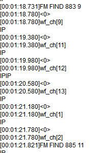

## 9.11.4. 常见问题

**1. 切换到fm模式无响应**

答：查看外挂fm功能宏是否打开，查看iic是否对应配置，打开初始时会有底噪声则已打开fm功能

**2. fm搜寻到电台但是只播放噪声，未能成功收听到电台声**

答：查看外挂fm模块天线是否接收信号良好

---

# 9.12. AB点复读播放

**概述**

提供AB点复读的使用流程

> **Note**
>
> - AB点复读播放功能仅作用于同一首音频文件中，目前支持MP3、FLAC、WAV、DTS、WMA和APE格式文件
> - 正处播放状态时使用AUDIO_DEC_AB_REPEAT_SET或AUDIO_DEC_AB_REPEAT_CLOSE命令设置AB点状态，会有短暂的暂停播放后继续播放的过程

## 9.12.1. 使用说明

使用audio_server进行服务命令请求

- AUDIO_DEC_AB_REPEAT_SET 设置AB点状态
- AUDIO_DEC_AB_REPEAT_CLOSE 清除AB点设置

```c
union audio_req req = {0};
req.dec.cmd = AUDIO_DEC_AB_REPEAT_SET;
server_request(__this->dec_server, AUDIO_REQ_DEC, &req);
```

- 进行AUDIO_DEC_AB_REPEAT_SET命令第一次请求设置A点，第二次命令请求AUDIO_DEC_AB_REPEAT_SET设置B点，随后播放为AB点复读模式，第三次命令请求AUDIO_DEC_AB_REPEAT_SET清除AB点设置，随后播放正常播放
- 可查看打印file_dec_ab_repeat_switch = 1为设置了A点，file_dec_ab_repeat_switch = 2为设置了B点，file_dec_ab_repeat_switch = 0为未有设置AB点

```c
union audio_req req = {0};
req.dec.cmd = AUDIO_DEC_AB_REPEAT_CLOSE;
server_request(__this->dec_server, AUDIO_REQ_DEC, &req);
```

- 命令请求AUDIO_DEC_AB_REPEAT_CLOSE清除A和B点设置，随后播放正常播放
- 当前设置了A点或者设置了A点和B点，使用命令请求AUDIO_DEC_AB_REPEAT_CLOSE都能清除设置的A点和B点

---

# 9.13. 音频播放跳转与时间获取

**概述**

提供音频播放跳转与音频播放时间点获取的使用流程

> **Note**
>
> - 音频播放跳转功能与音频播放时间点获取功能仅作用于同一首音频文件中，目前支持MP3,WAV,WMA格式文件
> - 正处播放状态时使用AUDIO_IOCTRL_CMD_SET_DEST_PLAYPOS命令设置跳转时间, 或使用AUDIO_IOCTRL_CMD_GET_PLAYPOS命令获取时间点.

## 9.13.1. 使用说明

使用audio_server进行服务命令请求

- AUDIO_IOCTRL_CMD_SET_DEST_PLAYPOS 设置指定位置播放
- AUDIO_IOCTRL_CMD_GET_PLAYPOS 获取毫秒级时间
- 注意server_request的命令是 `AUDIO_REQ_IOCTL`

```c
//跳转时间命令
union audio_req req = {0};
req.ioctl.cmd = AUDIO_IOCTRL_CMD_SET_DEST_PLAYPOS;
struct audio_dest_time_play_param parm = {0};
parm.start_time = 60000;        //60s播放
parm.dest_time = 90000;         //90s执行函数
parm.callback_func = test_func; //测试函数
parm.callback_priv = &test_priv;//测试参数
req.ioctl.priv = &parm;
server_request(__this->dec_server, AUDIO_REQ_IOCTL, &req);
```

```c
//获取时间命令
union audio_req req = {0};
req.ioctl.cmd = AUDIO_IOCTRL_CMD_GET_PLAYPOS;
u32 get_time;
req.ioctl.priv = &get_time;
server_request(__this->dec_server, AUDIO_REQ_IOCTL, &req);
printf("---%s---%s---%d get_time = %d\n\r",__FILE__,__func__,__LINE__,get_time);
```

---

# 9.14. 语音活动检测(VAD)

**概述**

提供语音活动检测的配置和使用说明

## 9.14.1. 配置说明

进入 `demo_DevKitBoard/include/app_config.h` ，开启宏 `CONFIG_VAD_ENC_ENABLE` ，app_main.c任务列表需要增加vad_encoder任务，否则会打开失败

```c
union audio_req req = {0};
req.enc.channel_bit_map = BIT(CONFIG_AUDIO_ADC_CHANNEL_L);
req.enc.frame_size = sample_rate / 100 * 4 * channel;
req.enc.output_buf_len = req.enc.frame_size * 3;
req.enc.cmd = AUDIO_ENC_OPEN;
req.enc.channel = channel;
req.enc.volume = __this->gain;
req.enc.sample_rate = sample_rate;
req.enc.format = "pcm";
req.enc.sample_source = "mic";
if (channel == 1 && !strcmp(req.enc.sample_source, "mic") && (sample_rate == 8000 || sample_rate == 16000)) {
    req.enc.use_vad = 1;            //打开VAD断句功能
    req.enc.vad_auto_refresh = 1;   //VAD自动刷新
}
if(req.enc.use_vad == 1){
    req.enc.vad_start_threshold = 0;    //ms
    req.enc.vad_stop_threshold = 0;     //ms
}
```

> **Note**
>
> 1. req.enc.use_vad ：
>    - 1：使用第三方VAD算法库，需要链接libvad.a库；
>    - 2：使用JLVAD算法库，需要链接lib_dvad.a、libjlsp.a库。
> 2. eq.enc.vad_auto_refresh：
>    - 1：使能VAD自动刷新，检测到语音停止后会自动刷新算法；
>    - 0：关闭VAD自动刷新，语音停止后不刷新算法。
> 3. 语音检测开始会下发AUDIO_SERVER_EVENT_SPEAK_START事件,语音检测结束会下发AUDIO_SERVER_EVENT_SPEAK_STOP。

## 9.14.2. 常见问题

**语音活动检测能使用多少采样率?**

VAD目前只支持采样率8000 或 16000，且输入通道数只支持1个通道。

**这两个算法库算法的区别是什么，各有什么优缺点?**

1. 第三方VAD库的灵敏度相比于JLVAD库会低一点，检测语音活动启动的时候会有一定的延时，但抗干扰会比JLVAD库强，在人多嘈杂的环境误唤醒率比JLVAD库低；第三方库多两个参数可以设置,详情查看API注释
2. JLVAD库的灵敏度相比于第三方VAD库高一点，检测语音活动启动延时低，抗干扰会弱一点，人多嘈杂环境误唤醒比第三方VAD库高。

## 9.14.3. API参考

音频编解码请求操作类型

AUDIO_REQ_DEC
解码请求

AUDIO_REQ_ENC
编码请求

AUDIO_REQ_IOCTL
命令控制

AUDIO_DEC_OPEN
打开解码

AUDIO_DEC_START
开始解码

AUDIO_DEC_PAUSE
暂停解码

AUDIO_DEC_STOP
停止解码

AUDIO_DEC_FF
快进

AUDIO_DEC_FR
快退

AUDIO_DEC_GET_BREAKPOINT
获取断点数据

AUDIO_DEC_PP
暂停/播放

AUDIO_DEC_SET_VOLUME
设置解码音量

AUDIO_DEC_DIGITAL_MUTE_SET
设置当前解码的MUTE状态

AUDIO_DEC_PS_PARM_SET
设置变速变调的参数

AUDIO_DEC_GET_STATUS
获取当前解码器状态

AUDIO_DEC_AB_REPEAT_SET
设置AB点复读播放

AUDIO_DEC_AB_REPEAT_CLOSE
关闭AB点复读播放

AUDIO_DEC_GET_EFFECT_HANDLE
获取对应音效算法的句柄

AUDIO_DEC_REPEAT_SET
设置循环播放

AUDIO_ENC_OPEN
打开编码

AUDIO_ENC_START
开始编码

AUDIO_ENC_PAUSE
暂停编码

AUDIO_ENC_STOP
停止编码

AUDIO_ENC_CLOSE
关闭解码

AUDIO_ENC_SET_VOLUME
设置编码模拟增益

AUDIO_ENC_GET_STATUS
获取当前编码器状态

AUDIO_ENC_PP
暂停/编码

---

enum [anonymous]
AB点复读设置状态
Values:
enumerator AB_REPEAT_STA_NON
未设置AB点

enumerator AB_REPEAT_STA_ASTA
已设置A点

enumerator AB_REPEAT_STA_BSTA
已设置B点

---

enum [anonymous]
AB点复读模式
Values:
enumerator AB_REPEAT_MODE_BP_A
设置A点参数

enumerator AB_REPEAT_MODE_BP_B
设置B点参数

enumerator AB_REPEAT_MODE_CUR
设置取消AB点参数

---

enum [anonymous]
解码器控制命令
Values:
enumerator AUDIO_IOCTRL_CMD_SET_BREAKPOINT_A
设置复读A点

enumerator AUDIO_IOCTRL_CMD_SET_BREAKPOINT_B
设置复读B点

enumerator AUDIO_IOCTRL_CMD_SET_BREAKPOINT_MODE
设置AB点取消复读模式

enumerator AUDIO_IOCTRL_CMD_REPEAT_PLAY
设置循环播放

enumerator AUDIO_IOCTRL_CMD_SET_DEC_SR
设置采样率或者码率

enumerator AUDIO_IOCTRL_CMD_SET_DEST_PLAYPOS
设置指定位置播放

enumerator AUDIO_IOCTRL_CMD_GET_PLAYPOS
获取毫秒级时间

---

Enums

enum [anonymous]
enum AUDIO_SERVER事件回调
Values:
enumerator AUDIO_SERVER_EVENT_CURR_TIME
AUDIO_SERVER编/解码当前时间

enumerator AUDIO_SERVER_EVENT_END
AUDIO_SERVER编/解码结束

enumerator AUDIO_SERVER_EVENT_ERR
AUDIO_SERVER编/解码错误

enumerator AUDIO_SERVER_EVENT_SPEAK_START
VAD检测到开始说话

enumerator AUDIO_SERVER_EVENT_SPEAK_STOP
VAD检测到停止说话

---

enum [anonymous]
解码附加属性
Values:
enumerator AUDIO_ATTR_REAL_TIME
保证解码的实时性，解码读数不能堵塞，仅限于蓝牙播歌时时钟同步使用

enumerator AUDIO_ATTR_LR_SUB
伴奏功能，只支持双声道

enumerator AUDIO_ATTR_PS_EN
变速变声功能开关

enumerator AUDIO_ATTR_LR_ADD
解码器左右通道数据叠加

enumerator AUDIO_ATTR_DECRYPT_DEC
文件解密播放，需要配合对应的加密工具

enumerator AUDIO_ATTR_FADE_INOUT
模拟音量淡入淡出，解码开始和暂停时使用

enumerator AUDIO_ATTR_EQ_EN
EQ功能开关

enumerator AUDIO_ATTR_DRC_EN
DRC功能开关，使能时需要打开EQ功能

enumerator AUDIO_ATTR_EQ32BIT_EN
EQ 32bit输出

enumerator AUDIO_ATTR_BT_AAC_EN
蓝牙AAC解码

enumerator AUDIO_ATTR_DEC_MUTE_EN
当前解码输出mute使能

enumerator AUDIO_ATTR_UNLIMITED_REPEAT
当前解码无限循环播放使能

enumerator AUDIO_ATTR_DEC_SOLO
当前解码强制不走叠音流程

enumerator AUDIO_ATTR_DIGITAL_FADE_INOUT
数字音量淡入淡出，解码开始时使用

enumerator AUDIO_ATTR_SDRAM_PROMPT
播放存储在sdram的提示音

enumerator AUDIO_ATTR_NO_WAIT_READY
当前解码开始时不需等待解码数据缓存

---

enum [anonymous]
音效附加属性
Values:
enumerator AUDIO_EFFECT_SPECTRUM_FFT
对音频解码数据进行频谱运算

enumerator AUDIO_EFFECT_DIGITAL_VOL
对音频解码数据进行数字音量调整

enumerator AUDIO_EFFECT_VIRTUAL_BASS
对音频解码数据进行虚拟低音

---

struct **audio_cbuf_t**
#include <audio_server.h>
解码虚拟输出时的cbuf读写参数结构体
Public Members:
void *cbuf
cbuf句柄

void *wr_sem
写信号量指针

void *rd_sem
读信号量指针

volatile u16 end
读写结束

volatile u8 state
是否正在解码状态

---

struct **audio_dec_breakpoint**
#include <audio_server.h>
解码断点播放信息结构体
Public Members:
int len
buf长度

u32 fptr
断点位置偏移量

u8 *data
断点数据指针 ape格式断点最大2036字节

---

struct **audio_finfo**
#include <audio_server.h>
获取audio解码器信息
Public Members:
u8 channel
通道

u8 name_code
名称编码 0:ansi, 1:unicode_le, 2:unicode_be

int sample_rate
采样率

int bit_rate
比特率

int total_time
总时间

---

struct **audio_ioctl**
#include <audio_server.h>
audio命令控制
Public Members:
u32 cmd
请求操作类型

void *priv
传入指针

---

struct **audio_dest_time_play_param**
#include <audio_server.h>
指定位置播放参数
Public Members:
u32 start_time
要跳转过去播放的起始时间。单位：ms。设置后跳到start_time开始播放

u32 dest_time
要跳转过去播放的目标时间。单位：ms。播放到dest_time后如果callback_func存在，则调用callback_func

u32 (*callback_func)(void *priv)
到达目标时间后回调

void *callback_priv
回调参数，可以在callback_func回调中实现对应需要的动作

---

struct **audio_vfs_ops**
#include <audio_server.h>
音频虚拟文件操作句柄
Public Members:
void *(*fopen)(const char *path, const char *mode)
打开创建路径文件

int (*fread)(void *file, void *buf, u32 len)
读文件

int (*fwrite)(void *file, void *buf, u32 len)
写文件

int (*fseek)(void *file, u32 offset, int seek_mode)
寻址文件

int (*ftell)(void *file)
返回给定流stream的当前文件位置

int (*flen)(void *file)
获取文件长度

int (*fclose)(void *file)
关闭文件

---

struct **fixphase_repair_obj**
Public Members:
short fifo_buf[18 + 12][32][2]
相位修复buf

---

struct **audio_repeat_mode_param**
Public Members:
int flag
置1使能

int headcut_frame
砍掉前面几帧，仅mp3格式有效

int tailcut_frame
砍掉后面几帧，仅mp3格式有效

int (*repeat_callback)(void*)
循环播放回调，返回0-正常循环；返回非0-结束循环

void *callback_priv
回调参数指针

struct fixphase_repair_obj *repair_buf
相位修复buf指针

---

struct **audio_dec_req**
#include <audio_server.h>
解码请求参数
Public Members:
u8 cmd
请求操作类型

u8 status
请求后返回的解码状态

u8 channel
解码通道数

u8 volume
模拟音量(0-100)

u8 digital_volume
数字音量初始值(0-100)

u8 priority
解码优先级，暂时没用到

u8 speedV

> 80是变快，<80是变慢，建议范围：30到130

u16 repeat_num
循环播放次数

u16 pitchV

> 32768是音调变高，<32768音调变低，建议范围20000到50000

u16 attr
解码附加属性

u16 effect
音效附加属性

u32 output_buf_len
解码buffer大小

u32 orig_sr
强制变采样前的原始采样率，当混响使能强制变采样时才使用

u32 force_sr
强制变采样的目标采样率

u32 sample_rate
实际的解码采样率

u32 ff_fr_step
快进快退级数

u32 total_time
解码的总共时长

u32 play_time
断点恢复时的当前播放时间

void *output_buf
解码缓存buffer，默认填NULL，由解码器自己实现分配和释放

FILE *file
需要解码的文件句柄

const char *dec_type
解码格式

const char *sample_source
播放源，支持”dac”,”iis0”,”iis1”

struct audio_dec_breakpoint *bp
断点播放信息句柄

const struct audio_vfs_ops *vfs_ops
虚拟文件操作句柄

void *eq_attr
eq属性设置

void *eq_hdl
预先申请好的的eq句柄

struct audio_cbuf_t *virtual_audio
虚拟解码句柄，供外部读写使用

int (*dec_callback)(u8 *buf, u32 len, u32 sample_rate, u8 ch_num)
解码后的PCM数据回调

int (*dec_sync)(void *priv, u32 data_size, u16 *in_rate, u16 *out_rate)
解码对端采样率同步，常用于蓝牙解码

void *get_hdl
获取私有句柄

void *sync_priv
解码对端采样率同步私有指针

---

struct **audio_enc_req**
#include <audio_server.h>
编码请求参数
Public Members:
u8 cmd
请求操作类型

u8 status
编码器状态

u8 channel
同时编码的通道数

u8 channel_bit_map
ADC通道选择

u8 rec_linein_channel_bit_map
ADC的linein回采通道选择

u8 volume
ADC增益(0-100)，编码过程中可以通过AUDIO_ENC_SET_VOLUME动态调整增益

u8 priority
编码优先级，暂时没用到

u8 use_vad
0:关闭vad功能 1:使用旧vad算法 2:使用JL新vad算法

u8 vad_auto_refresh
是否自动刷新VAD状态，赋值1表示SPEAK_START->SPEAK_STOP- >SPEAK_START->SPEAK_STOP->….循环

u8 direct2dac
AUDIO_AD直通DAC功能

u8 high_gain
直通DAC时是否打开模拟增益调整

u8 amr_src
amr编码时的强制16k变采样为8kpcm数据，因为amr编码器暂时只支持8k编码

u8 aec_enable
AEC回声消除功能开关，常用于蓝牙通话

u8 ch_data_exchange
用于AEC差分回采时和MIC的通道数据交换

u8 no_header
用于opus编码时是否需要添加头部格式

u8 vir_data_wait
虚拟编码时是否允许丢失数据

u8 no_auto_start
请求AUDIO_ENC_OPEN时不自动运行编码器，需要主动调用AUDIO_ENC_START

u8 sample_depth
采样深度16bit或者24bit

u8 dns_enable
dns降噪算法 0:不使用 1:使用

u8 wait_sem
编码器数据输出时如果缓存已满即等待信号量

u16 vad_start_threshold
VAD连续检测到声音的阈值，表示开始说话，回调AUDIO_SERVER_EVENT_SPEAK_START，单位ms，填0使用库内默认值

u16 vad_stop_threshold
VAD连续检测到静音的阈值, 表示停止说话，回调AUDIO_SERVER_EVENT_SPEAK_STOP，单位ms,填0使用库内默认值

u16 frame_size
编码器输出的每一帧帧长大小，只有pcm格式编码时才有效

u16 frame_head_reserve_len
编码输出的帧预留头部的大小

u32 bitrate
编码码率大小

u32 delay_ms
当编码器读写不到数据后的延时等待

u32 output_buf_len
编码buffer大小

u32 sample_rate
编码采样率

u32 msec
编码时长，填0表示一直编码，单位ms，编码结束会回调AUDIO_SERVER_EVENT_END消息

FILE *file
编码输出文件句柄

u8 *output_buf
编码buffer，默认填NULL，由编码器自动分配和释放资源

const char *format
编码格式

const char *sample_source
采样源，支持”mic”,”linein”,”plnk0”,”plnk1”，”virtual”，”iis0”，”iis1”，”spdif”

const struct audio_vfs_ops *vfs_ops
虚拟文件操作句柄

int (*read_input)(u8 *buf, u32 len)
用于虚拟采样源”virtual”编码时的数据读取操作读输入buf及其长度，返回负值自动停止编码并回调编码结束的事件

void *aec_attr
AEC回声消除算法配置参数

---

union **audio_req**
#include <audio_server.h>
audio服务请求参数
Public Members:
struct audio_dec_req dec
解码请求

struct audio_enc_req enc
编码请求

struct audio_ioctl ioctl
命令控制

struct audio_finfo info
音频信息

---

# 9.15. 变速变调

**概述**

提供变速变调的使用流程

> **Note**
>
> - 变速设置范围是30-130，大于80是变快，小于80是变慢，变速越快或者越慢，出来的效果的过渡音就越明显，这是算法固有的特性
> - 变调设置范围是20000-50000，大于32768是音调变高，小于32768是音调变低
> - 外部库依赖lib_pitch_speed.a，同时需要打开宏 `CONFIG_AUDIO_PS_ENABLE`

## 9.15.1. 使用说明

`apps/demo/demo_DevKitBoard/include/demo_config.h` 打开 `#define USE_PITCH_SPEED_TEST` 宏使用，例程文件为 `apps/common/example/audio/pitch_speed/main.c`

使用audio_server进行服务命令请求

- AUDIO_DEC_PS_PARM_SET 设置变速变调的参数

```c
union audio_req req = {0};
req.dec.cmd = AUDIO_DEC_PS_PARM_SET;
req.dec.speedV = 80;        // >80是变快，<80是变慢，建议范围：30到130
req.dec.pitchV = 32768;     // >32768是音调变高，<32768音调变低，建议范围20000到50000
req.dec.attr = AUDIO_ATTR_PS_EN;    //打开或关闭变速变掉功能
server_request(__this->dec_server, AUDIO_REQ_DEC, &req);
```

- 无论是中途设置还是开始解码就使能变速变调功能，都需要在请求解码AUDIO_DEC_OPEN命令操作时设置好speedV和pitchV参数，这样才会预申请必要的资源
- 想在一开始解码就使能变速变调功能，可在请求解码AUDIO_DEC_OPEN命令操作时，加上req.dec.attr = AUDIO_ATTR_PS_EN

---

# 9.16. AEC回声消除算法

**概述**

提供回声消除算法的配置和使用说明

## 9.16.1. 使用说明

进入相应的工程 `/include/app_config.h` ，开启宏 `CONFIG_AEC_ENC_ENABLE`，在请求编码服务时 `AUDIO_ENC_OPEN` 增加以下代码

```c
struct aec_s_attr aec_param = {0};
req.enc.aec_attr = &aec_param;
req.enc.aec_enable = 1;
extern void get_cfg_file_aec_config(struct aec_s_attr * aec_param);
get_cfg_file_aec_config(&aec_param);
#if 0
aec_param.ANS_NoiseLevel = 2.2e3f; //初始噪声水平,用来加速降噪收敛,跟 mic 信号的信噪比有关。 Mic 信号信噪比高， 该值可以小一点， 反之则需要稍微大一点。default: 2.2e3f(0 ~ 32767)
#endif
if (aec_param.EnableBit == 0) {
    req.enc.aec_enable = 0;
    req.enc.aec_attr = NULL;
}
#if defined CONFIG_ALL_ADC_CHANNEL_OPEN_ENABLE && defined CONFIG_AISP_LINEIN_ADC_CHANNEL && defined CONFIG_AEC_LINEIN_CHANNEL_ENABLE
if (req.enc.aec_enable) {
    aec_param.output_way = 1;      //1:使用硬件回采 0:使用软件回采
    if (aec_param.output_way) {
        req.enc.channel_bit_map |= BIT(CONFIG_AISP_LINEIN_ADC_CHANNEL);      //配置回采硬件通道
        if (CONFIG_AISP_LINEIN_ADC_CHANNEL < CONFIG_PHONE_CALL_ADC_CHANNEL) {
            req.enc.ch_data_exchange = 1;    //如果回采通道使用的硬件channel比MIC通道使用的硬件channel靠前的话处理数据时需要交换一下顺序
        }
    }
}
#endif
if (req.enc.sample_rate == 16000) {
    aec_param.wideband = 1;
    aec_param.hw_delay_offset = 50;
} else {
    aec_param.wideband = 0;
    aec_param.hw_delay_offset = 75;
}
server_request(__this->enc_server, AUDIO_REQ_ENC, &req);
```

> **Note**
>
> - 外部依赖库libaec.a、libdns.a、libjlsp.a，工程需要添加 `apps/common/jl_math/jl_fft.c`

## 9.16.2. 查看效果

使用打断唤醒或者蓝牙通话时，想查看mic的数据回声消除效果如何时

**1. 打断唤醒：**

在app_config.h中打开宏 `#define WIFI_PCM_STREAN_SOCKET_ENABLE` //打开打断唤醒pcm音频流局域网传输工具，设备与PC电脑处理同一局域网，打开SDK中sdk_tool目录下 `局域网传送PCM流测试工具.exe` 工具，输入设备ip4地址（打印中可查看）和电脑的ip4地址，有唤醒时会在sdk_tool目录下生成test.pcm文件，使用音频分析软件按4通道打开，signed 16-bit PCM 小尾端，打断唤醒采样率（SDK中默认16k）。四通道分别为两个MIC通道数据（单MIC的话一个通道数据为空），一个通道为回采DAC，一个通道为AEC回声消除后数据

**2. 蓝牙通话：**

在master的WIFI_STORY_MACHINE工程代码中apps/wifi_story_machine/bt_ble/bt_decode.c，打开宏 `#define AEC_MIX_DATA_TO_SD 0` //将蓝牙通话mic、dac和aec的混合数据写到sd卡里,3channel(mic,dac,aec)

## 9.16.3. 参数调试

- 打开编译前配置工具，AC791N_配置工具入口： `cpu/wl82/tools/AC791N_config_tool/AC791N_配置工具入口(Config Tools Entry).jlxproj)` ，选择"编译前配置工具"
  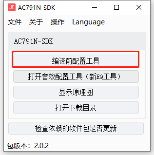
- 点击通话参数配置，通过点击ON/OFF按钮选择打开或关闭需要的功能模块，AGC模块暂时不支持使用
  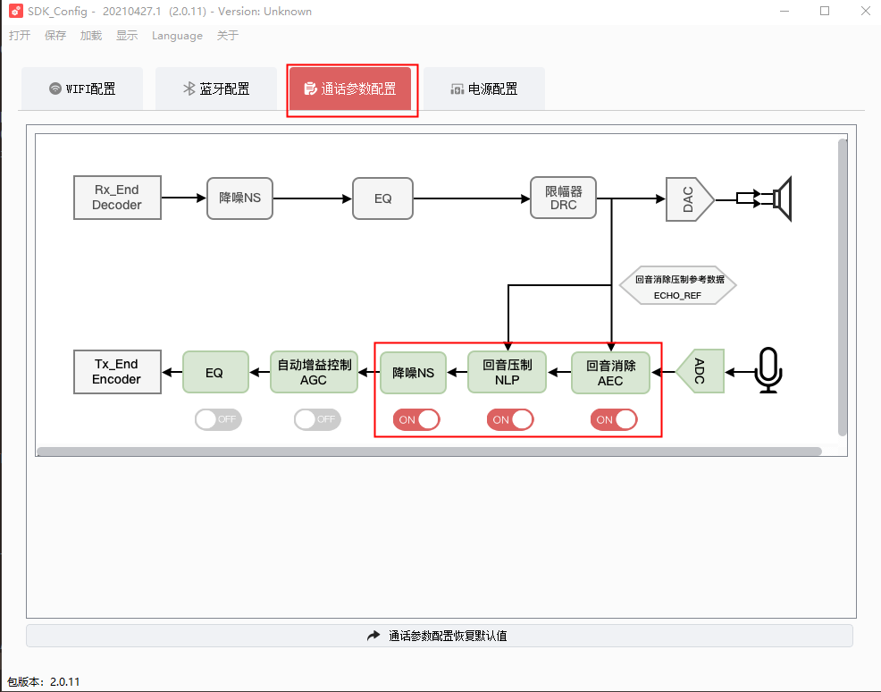
- 点击其中某一个模块，可调整具体参数, 具体配置参数描述, 请查看 `doc/stuff/JL通话调试手册.pdf`
  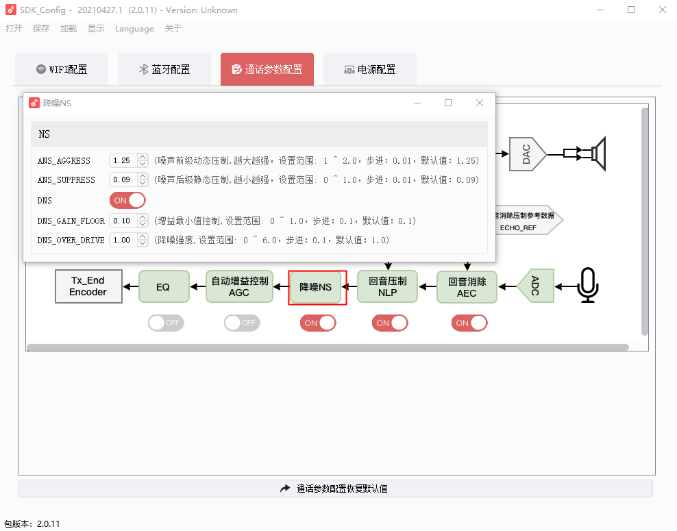
- 参数设置完成后，点击保存成bin文件，将生成的cfg_tool.bin文件复制到 `cpu\wl82\tools` 目录，重新烧录即可生效
  

## 9.16.4. 常见问题

**回声消除算法支持哪些采样率?**

答: AEC目前只支持采样率8000或16000，且只支持单通道。

**回声消除打开后发现无效果?**

答: 检查AEC是否打开成功，aec_encoder任务是否有加到app_main.c的任务列表，任务是否创建成功，MIC配置是否正确。

**回声消除后还是有一点回声未能完全消掉，应该如何优化?**

答: 考虑到外接功放模块的特性，可采用硬件差分回采电路，效果比纯软件回采DAC输出数据更好。

---

# 9.17. 数字音量(DIGITAL_VOL)

**概述**

提供数字音量的使用流程

`audio_config.c` 文件, 可配置以下参数:

```c
const int config_digital_fade_step = 1;     //单位采样点音量变化量
const int config_digital_vol_max = 100;     //最大音量
```

用户自定义音量表参考如下:

```c
static const u16 user_dig_vol_table[] = {
    0    , //0
    93   , //1
    111  , //2
    132  , //3
    158  , //4
    189  , //5
    226  , //6
    270  , //7
    323  , //8
    386  , //9
    462  , //10
    552  , //11
    660  , //12
    789  , //13
    943  , //14
    1127 , //15
    1347 , //16
    1610 , //17
    1925 , //18
    2301 , //19
    2751 , //20
    3288 , //21
    3930 , //22
    4698 , //23
    5616 , //24
    6713 , //25
    8025 , //26
    9592 , //27
    11466, //28
    15200, //29
    16000, //30
    16384  //31
};
```

## 9.17.1. 使用流程

**1. 打开解码服务后,在调用cmd AUDIO_DEC_OPEN 时候传递参数**(解码服务打开流程详情查看 `音频解码` 章节)

```c
/*中间省略其他参数*/
req.dec.cmd = AUDIO_DEC_OPEN;
req.dec.effect = AUDIO_EFFECT_DIGITAL_VOL;
err = server_request(__this->dec_server, AUDIO_REQ_DEC, &req);
```

**2. 获取音效处理句柄**

调用cmd `AUDIO_DEC_GET_EFFECT_HANDLE` , 返回的 `req.dec.get_hdl` 就是音效处理句柄, 此时可以选择设置用户自定义音量表(可选),不设置的话默认用库里面的音量表

```c
req.dec.cmd = AUDIO_DEC_GET_EFFECT_HANDLE;
req.dec.effect = AUDIO_EFFECT_DIGITAL_VOL;
err = server_request(__this->dec_server, AUDIO_REQ_DEC, &req);
user_audio_digital_set_volume_tab(req.dec.get_hdl, user_dig_vol_table, ARRAY_SIZE(user_dig_vol_table)); //自定义音量表(可选)
```

**3. 调节数字音量**

调节数字音量, 可以单独调节当前解码器,当前音频的声音大小, 不影响到另外一个解码器, 常常用在混音、叠音中。

```c
user_audio_digital_volume_set(req.dec.get_hdl, volume, fade_en);
```

**4. 获取数字音量**

```c
int get_volume = user_audio_digital_volume_get(req.dec.get_hdl);
```

**5. 重置数字音量**

```c
user_audio_digital_volume_reset_fade(req.dec.get_hdl);
```

## 9.17.2. API参考

**Functions**

**打开数字音量处理**
- priv – 私有指针
- parm – 始化参数，详见结构体digital_vol_open_parm

返回：句柄

**关闭数字音量处理**
- priv – 句柄

返回：0:成功 -1：失败

**数字音量运行**

> **Note**
>
> 数字音量调节, 调整输入数据的幅值

- priv – 句柄
- data – 输入数据
- len – 输入数据长度
- sample_rate – 采样率

返回：0:成功 -1：失败

**获取当前数字音量大小**
- priv – 句柄

返回：返回音量大小

**设置当前数字音量大小,是否淡入淡出**
- priv – 句柄
- vol – 音量大小
- fade_en – 淡入淡出使能

返回：0:成功 -1：失败

**重置清零淡入淡出**
- priv – 句柄

返回：0:成功 -1：失败

**设置自定义音量表**
- priv – 句柄
- user_vol_tab – 自定义音量表,自定义表长user_vol_max+1
- user_vol_max – 音量级数

**等待淡入淡出完成**
- priv – 句柄
- pcm_cache_buf_size – 缓存的pcm数据大小

返回：0:成功 -1：失败

**数字音量参数结构体**

Public Members:
- 通道数
- 当前音量大小
- 是否使能淡入淡出

---

# 9.18. 音频FFT频谱显示

**概述**

提供音频FFT频谱显示的使用流程

## 9.18.1. 使用流程

**1. 打开解码服务后，在调用cmd AUDIO_DEC_OPEN 时候传递参数**(解码服务打开流程详情查看 `音频解码` 章节)

```c
/*中间省略其他参数*/
req.dec.cmd = AUDIO_DEC_OPEN;
req.dec.effect = AUDIO_EFFECT_SPECTRUM_FFT;
err = server_request(__this->dec_server, AUDIO_REQ_DEC, &req);
```

**2. 获取音效处理句柄**

调用cmd `AUDIO_DEC_GET_EFFECT_HANDLE` ，返回的 `req.dec.get_hdl` 就是音效处理句柄，可用一个全局变量暂时缓存起来供后续使用

```c
req.dec.cmd = AUDIO_DEC_GET_EFFECT_HANDLE;
req.dec.effect = AUDIO_EFFECT_SPECTRUM_FFT;
err = server_request(__this->dec_server, AUDIO_REQ_DEC, &req);
```

**3. 获取频谱个数**

```c
audio_spectrum_fft_get_num(req.dec.get_hdl);
```

**4. 获取频谱值**

```c
short *db_data = audio_spectrum_fft_get_val(req.dec.get_hdl);//获取存储频谱值的地址
if (db_data) {
    for (int i = 0; i < audio_spectrum_fft_get_num(req.dec.get_hdl); i++) {
        //输出db_num个 db值
        /* printf("db_data db[%d] %d\n", i, db_data[i]); */
    }
}
```

> **Note**
>
> - 获取音效处理句柄后，如果是异步调用api获取频谱值，要避免在调用AUDIO_DEC_STOP停止解码释放句柄后还继续访问，否则会出现内存越界访问的情况，请用户自行做好互斥处理
> - 需要打开宏 `CONFIG_SPECTRUM_FFT_EFFECT_ENABLE` ，外部库依赖lib_spectrum_show.a和硬件FFT模块

## 9.18.2. API参考

**Functions**

**打开频谱运算**
- priv – 私有指针
- parm – 始化参数，详见结构体spectrum_fft_open_parm

返回：句柄

**关闭频谱计算处理**
- priv – 句柄

返回：0:成功 -1：失败

**频谱计算同步处理，每次run都会把输入buf消耗完，才会往下走**

> **Note**
>
> 频谱计算处理，只获取输入的数据，不改变输入的数据

- priv – 句柄
- data – 输入数据
- len – 输入数据长度
- sample_rate – 采样率

返回：len

**频谱计算运行过程做开关处理**
- priv – 句柄
- en – 0 关闭频响运算 1 打开频响运算

**获取频谱个数**
- priv – 句柄

返回：返回频谱的个数

**获取频谱值**
- priv – 句柄

返回：返回存储频谱值的地址

**频谱运算参数结构体**

Public Members:
- 采样率
- 通道数
- 模式，双声道起作用，0计算的是第一声道的频谱值，1计算的是第二声道频谱值，2为第一声道与第二声道相加除2的频谱值
- 运行一次采样点数
- 下降因子[0,1)
- 上升因子[0,1)

---

# 9.19. dec解码virtual输出

**概述**

dec解码后,不通过dac播放, 而是通过virtual虚拟源输出

## 9.19.1. 应用实例

- `apps/demo/demo_DevKitBoard/include/demo_config.h` 打开 `#define USE_VIRTUAL_DAC_TEST` 宏使用，例程文件为 `apps/common/example/audio/virtual_dac/main.c`
- 该例子中以文件 `1.mp3` 作为输入数据，进行dec的解码, 输出pcm数据到 `2.mp3` 文件保存

## 9.19.2. 例子流程

1. 等待SD卡挂载
2. 打开dec服务
3. 打开输入文件
4. 打开输出文件
5. 打开解码器
6. 获取虚拟句柄
7. 创建数据接收线程
8. 开始解码
9. 等待解码完成
10. 关闭文件, post信号量, 关闭解码器

## 9.19.3. API参考

```c
//解码虚拟输出时的cbuf读写参数结构体
struct audio_cbuf_t {
    void *cbuf;         /*!< cbuf句柄 */
    void *wr_sem;       /*!< 写信号量指针 */
    void *rd_sem;       /*!< 读信号量指针 */
    volatile u16 end;   /*!< 读写结束 */
    volatile u8 state;  /*!< 是否正在解码状态 */
};
```

---

# 9.20. 编码数据流dec解码

**概述**

MP3编码文件数据流, 通过vfs_ops传入进行dec解码

## 9.20.1. 应用实例

- `apps/demo/demo_DevKitBoard/include/demo_config.h` 打开 `#define USE_AUDIO_BUFFER_TEST` 宏使用，例程文件为 `apps/common/example/audio/play_audio_buffer/main.c`
- 该例子中以文件 `1.mp3` 作为输入数据，进行dec的解码, 输出pcm数据到dac播放

## 9.20.2. 例子流程

1. 等待SD卡挂载
2. 参数初始化
3. 创建信号量
4. 打开解码服务
5. 打开文件
6. 动态申请cbuf内存
7. 创建数据源线程
8. 开始解码
9. 等待数据读完整, 文件播放完毕后调用事件END
10. 停止解码
11. 释放cbuf内存
12. 关闭文件
13. 注销解码服务
14. 销毁信号量

## 9.20.3. 注意事项

- 首先读取到的512字节数据是MP3解码库所需要拿到的MP3信息, 参考MP3文件前512字节数据, 使用数据流的时候注意下这一点.
- 由于不同解码库读取数据的方式与顺序不一样, 所以该例子只针对MP3解码, 不适用与其他解码.

---

# 9.21. lc3编解码(jla)

**概述**

通过输入16bit/24bit的正弦波数据,测试lc3的编码与解码功能(测试的正弦波都为1KHZ, 采样率为44100), 后续版本改名为jla(SDK中对应的字母改名: lc3->jla, LC3->JLA)

## 9.21.1. 操作说明

**app_config.h 文件中, 确保打开以下宏:**
- 打开宏`#define CONFIG_LC3_ENC_ENABLE`
- 打开宏`#define CONFIG_LC3_DEC_ENABLE`

**audio_config.c 文件中, LC3的参数配置如下:**

```c
const int LC3_INT24bit_INOUT = 0;       //如果是1，则认为编码input的时候，读到的数据认为是int的类型，存放着24bit的数据。
                                        //解码output的时候也是int类型，存放24bit数据。
                                        //如果为0，则 认为是short的。
const int LC3_DMS_VAL = 100;            //配置: 25ms 50ms 75ms 100ms 帧
const int LC3_DMS_FSINDEX = 5;          //采样率配置：8000:0, 16000:1 ,24000:2, 32000:3, 48000:4, 可配采样率：5
                                        //(0-4固定采样率,5为可变采样率)
const int LC3_QUALTIY_CONFIG = 1;       //可选1/2/3/4
const int LC3_PLC_EN = 1;               //置1做plc，置0的效果类似补静音包
const int LC3_HW_FFT = 0;               //置1使用硬件模块FFT, 置0使用软件模块FFT, AC791芯片有硬件模块, 推荐使用硬件FFT
```

## 9.21.2. 应用实例

- `apps/demo/demo_DevKitBoard/include/demo_config.h` 打开 `#define USE_LC3_TEST` 宏使用，例程文件为 `apps/common/example/audio/lc3/main.c`
- 该例子中,16bit的采样深度数据,以dac播放, 24bit的采样深度数据,以virtual输出(详情请查看 `dec解码virtual输出` 章节),写到 `1.pcm` 文件保存.

> **Note**
>
> - 编码需要传入比特率bitrate, 否则打开编码器失败

## 9.21.3. 例子流程

1. 如为24bit数据, 则先转换成32bit格式
2. 创建cbuf
3. 打开编码器, 使用virtual传入pcm数据
4. 打开解码器, 获取编码后的lc3数据

---

# 9.22. opus编解码以及ogg封装

**概述**

本文档说明介绍opus的编解码配置与注意事项, ogg封装注意事项等

## 9.22.1. 操作说明

**app_config.h 文件中, 确保打开以下宏:**
- 打开宏`#define CONFIG_OPUS_ENC_ENABLE`
- 打开宏`#define CONFIG_OPUS_DEC_ENABLE`

## 9.22.2. 应用示例

**编码配置代码如下:**

```c
req.enc.channel_bit_map = BIT(CONFIG_AUDIO_ADC_CHANNEL_L);
req.enc.frame_size = sample_rate / 10 * 4 * channel; //收集够多少字节PCM数据就回调一次fwrite
req.enc.output_buf_len = req.enc.frame_size * 3; //底层缓冲buf至少设成3倍frame_size
req.enc.cmd = AUDIO_ENC_OPEN;
req.enc.channel = 1;
req.enc.volume = __this->gain;
req.enc.sample_rate = sample_rate;
req.enc.format = "opus";
req.enc.sample_source = __this->sample_source;
req.enc.vfs_ops = &recorder_vfs_ops;
req.enc.file = (FILE *)&__this->save_cbuf;
req.enc.frame_head_reserve_len = 0;
req.enc.bitrate = 16000;//64000, 32000, 16000
if(!strcmp(req.enc.format, "opus")){
    req.enc.no_header = 1;
}
```

> **Note**
>
> - 编码需要注意的地方: 如果no_header是0, 则编码出来后每一帧开始偏移2个字节, 用于某种特定通讯如酷狗等, frame_head_reserve_len默认为0, 如非0, 编码后帧头部预留对应字节大小.
> - opus编码只支持单通道(channel = 1), 只支持采样率为8000和16000
> - opus编码可以设置比特率, 设置选项为16000, 32000, 64000, 如果不设置, 默认为16000.

**解码配置代码如下:**

```c
req.dec.cmd = AUDIO_DEC_OPEN;
req.dec.volume = __this->volume;
req.dec.output_buf_len = 4 * 1024;
req.dec.channel = 2;
req.dec.sample_rate = sample_rate;
req.dec.vfs_ops = &recorder_vfs_ops;
req.dec.dec_type = format;
req.dec.sample_source = CONFIG_AUDIO_DEC_PLAY_SOURCE;
req.dec.file = (FILE *)&__this->save_cbuf;
```

> **Note**
>
> - 解码需要注意的地方: 如果是需要编码与解码对应自编自解, 则编码处必须no_header非0, 解码通道固定2通道(编码1通道, 解码出来会是2通道).
> - 解码拿数据的函数, 如果是传入vfs_ops,确保fread函数读取到解码器所需长度len才返回, 不然数据不连续会导致解码出来的声音有问题.

**ogg封装代码如下:**

```c
req.enc.channel_bit_map = BIT(CONFIG_AUDIO_ADC_CHANNEL_L);
req.enc.frame_size = sample_rate / 10 * 4 * channel; //收集够多少字节PCM数据就回调一次fwrite
req.enc.output_buf_len = req.enc.frame_size * 3; //底层缓冲buf至少设成3倍frame_size
req.enc.cmd = AUDIO_ENC_OPEN;
req.enc.channel = 1;
req.enc.volume = __this->gain;
req.enc.sample_rate = sample_rate;
req.enc.format = "ogg";
req.enc.sample_source = __this->sample_source;
req.enc.vfs_ops = &recorder_vfs_ops;
req.enc.file = (FILE *)&__this->save_cbuf;
req.enc.frame_head_reserve_len = 0;
```

> **Note**
>
> - 编码需要注意的地方: frame_head_reserve_len默认为0, 如非0, 编码后帧头部预留对应字节大小.
> - ogg封装是opus编码加上了ogg的头部, 只支持单通道(channel = 1), 只支持采样率为8000和16000
> - 暂时不支持ogg解码.

---

# 9.23. 单曲循环播放命令

**概述**

- 目前支持MP3和WAV的单曲循环播放
- 通过audio_server使用解码器的单曲循环播放命令

## 9.23.1. 使用方式

```c
union audio_req req = {0};
req.dec.cmd = AUDIO_DEC_REPEAT_SET; //解码器循环命令
req.dec.attr |= AUDIO_ATTR_UNLIMITED_REPEAT; //无限循环，AUDIO_ATTR_UNLIMITED_REPEAT:无限循环开启,repeat_num设置无效。不设置req.dec.attr |= AUDIO_ATTR_UNLIMITED_REPEAT时无限循环关闭
req.dec.repeat_num = 2; //循环次数
server_request(__this->dec_server,AUDIO_REQ_DEC,&req); //请求audio_server服务
```

**1. 参数：**
- **AUDIO_DEC_REPEAT_SET**：解码器循环命令
- **req.dec.attr |= AUDIO_ATTR_UNLIMITED_REPEAT**时无限循环，此时设置的repeat_num循环次数无效。
- **req.dec.repeat_num**：当未设置req.dec.attr |= AUDIO_ATTR_UNLIMITED_REPEAT;时，循环播放的次数。

**2. 注意：**
1. 只有正播放时使用AUDIO_DEC_REPEAT_SET
2. 无限循环与repeat_num循环次数关系

---

# 9.24. virtual_enc虚拟源编码

**概述**

pcm数据通过虚拟源编码成想要的格式（例如：mp3、amr、ogg、opus、jla、spx、aac等）数据

## 9.24.1. 应用示例

- `apps/demo/demo_DevKitBoard/include/demo_config.h` 打开 `#define USE_VIRTUAL_ENC_TEST` 宏使用，例程文件为 `apps/common/example/audio/virtual_enc/main.c`
- 该例子中以文件 `4.pcm` 作为输入数据，进行virtual_enc, 输出mp3数据到 `out_file.mp3` 文件保存

## 9.24.2. 例子流程

1. 开启编码服务和注册编码服务事件回调函数
2. 等待SD卡挂载,打开输入文件和创建输出文件
3. 设置编码参数，请求打开编码器
4. 编码结束，关闭编码器和编码服务

## 9.24.3. 关键过程说明

**1. 注册编码服务事件回调函数**

```c
//线程接收编码服务回调消息队列方式
/*static void server_back()
{
    while(1){
        int msg[32];
        os_time_dly(2);
        os_taskq_pend("taskq",msg,ARRAY_SIZE(msg));
    }
}*/

//2.开启编码服务和注册编码服务回调
if (!__this->enc_server) {
    __this->enc_server = server_open("audio_server", "enc");
    if (!__this->enc_server) {
        return -1;
    }
    //a.将编码服务回调函数注册到"app_core"消息队列 常用方式
    server_register_event_handler_to_task(__this->enc_server, NULL, enc_server_server_event_handler, "app_core");
    //b.将编码服务回调函数注册到创建的线程中接收消息队列
    /* thread_fork("server_back", 10, 1024, 32, NULL, server_back, NULL); */
    /* server_register_event_handler_to_task(__this->enc_server, NULL, enc_server_server_event_handler,"server_back"); */
} else {
    return -1;
}
```

**2. 设置编码参数，请求打开编码器**

- `req.enc.read_input = enc_server_read_input;` //用于虚拟采样源"virtual"编码时的数据读取操作读输入buf及其长度，返回负值自动停止编码并回调编码结束的事件
- `req.enc.vfs_ops = &enc_server_vfs_ops;` //编码后数据在fwrite回调中输出
- `req.enc.vir_data_wait = 1;` //等待数据编码完成才进行下一帧数据编码，数据完整

```c
//3.设置编码参数，请求打开编码器
union audio_req req = {0};
req.enc.cmd = AUDIO_ENC_OPEN;
req.enc.channel = 2;
req.enc.volume = 100;
req.enc.output_buf = NULL;
req.enc.output_buf_len = 3200 * 8;
req.enc.sample_rate = 16000;
req.enc.format = "mp3";
req.enc.frame_size = 3200; //frame_size为read_input的len
req.enc.sample_source = "virtual";
req.enc.read_input = enc_server_read_input; //用于虚拟采样源"virtual"编码时的数据读取操作读输入buf及其长度，返回负值自动停止编码并回调编码结束的事件
req.enc.vfs_ops = &enc_server_vfs_ops; //编码后数据在fwrite回调中输出
req.enc.vir_data_wait = 1; //等待数据编码完成才进行下一帧数据编码，数据完整
/* req.enc.no_header = 1; */
/* req.enc.bitrate = 16000; */
err = server_request(__this->enc_server, AUDIO_REQ_ENC, &req); //请求编码器

//编码虚拟源输入
static u32 enc_server_read_input(u8 *buf, u32 len)
{
    int rlen;
    if (__this->in_file) {
        rlen = fread(buf, len, 1, __this->in_file);
        if (rlen == len) {
            return rlen;
        } else {
            fclose(__this->in_file);
            __this->in_file = NULL;
            return rlen;
        }
    } else {
        return -1; //read_input返回-1表示输入数据完成，没有数据输入,让编码服务发结束消息出来AUDIO_SERVER_EVENT_END去进行结束编码的操作
    }
}
```

- 开启编码请求后会自动调用enc_server_read_input输入函数，其中参数len为编码参数中设置的frame_size为设置的需要输入的数据长度，buf为需要输入给编码器的数据，返回值为实际输入数据长度，当设置返回负数时，virtual_enc获取到编码结束事件
- 除了在read_input数据输入获取编码结束事件，也可以在编码参数中增加req.enc.msec 设置编码时长（单位ms）
- 上述两种方式的去获取到编码结束编码 AUDIO_SERVER_EVENT_END，在事件中调用去结束编码服务一系列操作
- 想要获取到编码结束事件，一定要在上面注册编码服务回调中将编码服务回调函数enc_server_server_event_handler注册

---

# 9.25. AUDIO_VFS_OPS

**概述**

AUDIO_VFS_OPS使用说明，编码输出数据或解码输入数据；编码输出非文件形式或解码输入非文件形式下使用

## 9.25.1. 应用实例

可查看 `apps/demo/demo_audio/demo/recorder.c` 中recorder_play_to_dac(),该函数实现由mic通道采样的数据进行编码输出pcm数据，然后pcm数据再作为解码器的输入数据进行解码dac播放，实现边录音边播放

## 9.25.2. 详细过程

```c
/**
 * @brief 音频虚拟文件操作句柄
 */
struct audio_vfs_ops {
    void *(*fopen)(const char *path, const char *mode); /*!< 打开创建路径文件 */
    int (*fread)(void *file, void *buf, u32 len);       /*!< 读文件 */
    int (*fwrite)(void *file, void *buf, u32 len);      /*!< 写文件 */
    int (*fseek)(void *file, u32 offset, int seek_mode);/*!< 寻址文件 */
    int (*ftell)(void *file);                           /*!< 返回给定流stream的当前文件位置 */
    int (*flen)(void *file);                            /*!< 获取文件长度 */
    int (*fclose)(void *file);                          /*!< 关闭文件 */
};

//例程中注册的操作句柄
static const struct audio_vfs_ops recorder_vfs_ops = {
    .fwrite = recorder_vfs_fwrite,
    .fread = recorder_vfs_fread,
    .fclose = recorder_vfs_fclose,
    .flen = recorder_vfs_flen,
};
```

**1. 例程中流程是先打开解码器，再打开编码器，为的是防止反过来打开编码器打开了有编码数据输出然后解码器还没打开完成造成一开始的边录边播数据丢失**

**2. 编码器部分。** 编码参数使用req.enc.vfs_ops = &recorder_vfs_ops; //编码使用vfs_ops输出数据，编码完成之后的数据就会输出到vfs_ops操作句柄的fwrite

```c
//编码器输出PCM数据
static int recorder_vfs_fwrite(void *file, void *data, u32 len)
{
    cbuffer_t *cbuf = (cbuffer_t *)file;
    if (0 == cbuf_write(cbuf, data, len)) {
        //上层buf写不进去时清空一下，避免出现声音滞后的情况
        cbuf_clear(cbuf);
    }
    os_sem_set(&__this->r_sem, 0);
    os_sem_post(&__this->r_sem);
    ...
    ...
    return len;
}

/****************打开编码器********************/
memset(&req, 0, sizeof(union audio_req));
//BIT(x)用来区分上层需要获取哪个通道的数据
if (channel == 2) {
    req.enc.channel_bit_map = BIT(CONFIG_AUDIO_ADC_CHANNEL_L) | BIT(CONFIG_AUDIO_ADC_CHANNEL_R);
} else {
    req.enc.channel_bit_map = BIT(CONFIG_AUDIO_ADC_CHANNEL_L);
}
req.enc.frame_size = sample_rate / 100 * 4 * channel; //收集够多少字节PCM数据就回调一次fwrite
req.enc.output_buf_len = req.enc.frame_size * 3; //底层缓冲buf至少设成3倍frame_size
req.enc.cmd = AUDIO_ENC_OPEN;
req.enc.channel = channel;
req.enc.volume = __this->gain;
req.enc.sample_rate = sample_rate;
req.enc.format = "pcm";
req.enc.sample_source = __this->sample_source;
req.enc.vfs_ops = &recorder_vfs_ops; //编码使用vfs_ops输出数据
req.enc.file = (FILE *)&__this->save_cbuf;
if (channel == 1 && !strcmp(__this->sample_source, "mic") && (sample_rate == 8000 || sample_rate == 16000)) {
    req.enc.use_vad = 1; //打开VAD断句功能
    req.enc.dns_enable = 1; //打开降噪功能
    req.enc.vad_auto_refresh = 1; //VAD自动刷新
}
err = server_request(__this->enc_server, AUDIO_REQ_ENC, &req);
if (err) {
    goto __err1;
}
```

**3. 解码器部分。** 解码参数使用req.enc.vfs_ops = &recorder_vfs_ops; //解码使用vfs_ops输入数据,解码开始后在vfs_ops的fread回调中读取数据到解码器进行解码

```c
//解码器读取PCM数据
static int recorder_vfs_fread(void *file, void *data, u32 len)
{
    cbuffer_t *cbuf = (cbuffer_t *)file;
    u32 rlen;
    do {
        rlen = cbuf_get_data_size(cbuf);
        rlen = rlen > len ? len : rlen;
        if (cbuf_read(cbuf, data, rlen) > 0) {
            len = rlen;
            break;
        }
        //此处等待信号量是为了防止解码器因为读不到数而一直空转
        os_sem_pend(&__this->r_sem, 0);
        if (!__this->run_flag) {
            return 0;
        }
    } while (__this->run_flag);
    //返回成功读取的字节数
    return len;
}

/****************打开解码DAC器********************/
req.dec.cmd = AUDIO_DEC_OPEN;
req.dec.volume = __this->volume;
req.dec.output_buf_len = 4 * 1024;
req.dec.channel = channel;
req.dec.sample_rate = sample_rate;
req.dec.vfs_ops = &recorder_vfs_ops; //解码使用vfs_ops输入数据
req.dec.dec_type = "pcm";
req.dec.sample_source = CONFIG_AUDIO_DEC_PLAY_SOURCE;
req.dec.file = (FILE *)&__this->save_cbuf;
/* req.dec.attr = AUDIO_ATTR_LR_ADD; */ //左右声道数据合在一起,封装只有DACL但需要测试两个MIC时可以打开此功能
err = server_request(__this->dec_server, AUDIO_REQ_DEC, &req);
if (err) {
    goto __err;
}
req.dec.cmd = AUDIO_DEC_START;
req.dec.attr = AUDIO_ATTR_NO_WAIT_READY;
server_request(__this->dec_server, AUDIO_REQ_DEC, &req);
```
