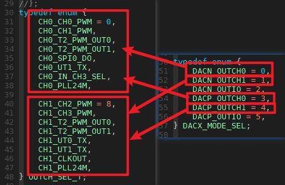

# 8. GPIO接口说明

AC104/AD14/15/17/18 SDK提供了操作gpio相关功能的函数接口；

其头文件位于include_lib/cpu/sh5x/gpio.h；

下面分为4个部分进行GPIO接口函数介绍：

## 8.1. DACP，DACN口设置（AC104/AD14/15/17）

（1）void gpio_dacnp_out_mode_init(DACX_MODE_SEL mode, OUTCH_SEL_T outchsel, u8 out)

**该函数实现将DACNO,DACNP作为普通IO输出，或者作为outputch输出，其中参数：**

> ```
> mode     : DACP引脚选择做普通IO引脚（DACP_OUTIO）或者做输出通道(DACP_OUTCHx);
> outchsel ：选择output源，该参数只在mode参数选择做输出方式时有效;
> out      ：该参数只在mode选择做普通IO引脚输出时有效；
>            0：输出0；
>            1：输出1；
> ```

**注意：**

当 **mode** 选择输出通道时， **mode** 选择的通道需要与 **outchsel** 通道一样；

如： **mode** 选择了DACN_OUTCH0,则 **outchsel** 必须选择 通道0 的 output 源（即0~7）；（对应下图）



（2）void gpio_dacnp_out_set(DACX_MODE_SEL mode, u8 out)

**该函数实现将DACNO,DACNP作为普通IO输出，输出0还是1**

 ```
 mode : DACN_OUTIO或者DACP_OUTIO；
 out  ：0：输出0；
        1：输出1；
 ```

## 8.2. 普通IO口(AC104/AD14/15/17/18)

**寄存器设置示例:**

```
示例PA1 IO口常见操作：
JL_PORTA->DIR |= BIT(1);     //PA1口设为输入
JL_PORTA->DIE |= BIT(1);     //PA1口使能数字输入
JL_PORTA->PU |= BIT(1);      //PA1口打开上拉
JL_PORTA->PD |= BIT(1);      //PA1口打开下拉
JL_PORTA->OUT |= BIT(1);     //PA1口输出高电平
JL_PORTA->OUT &= ~BIT(1);    //PA1口输出低电平
```

**函数使用示例：**

```
gpio_set_direction(IO_PORTA_01,1);      //PA1口设为输入
gpio_set_die(IO_PORTA_01,1);            //PA1口使能数字输入
gpio_set_pull_up(IO_PORTA_01,1);        //PA1口打开上拉
gpio_set_pull_down(IO_PORTA_01,1);      //PA1口打开下拉
gpio_write(IO_PORTA_01,1);              //PA1口输出高电平
gpio_write(IO_PORTA_01,0);              //PA1口输出低电平

gpio_set_direction(IO_PORT_DP,1);       //USB_DP口设为输入
gpio_set_die(IO_PORTA_01,1);            //USB_DP口使能数字输入
gpio_set_pull_up(IO_PORTA_01,1);        //USB_DP口打开上拉
gpio_set_pull_down(IO_PORTA_01,1);      //USB_DP口打开下拉
gpio_write(IO_PORTA_01,1);              //USB_DP口输出高电平
gpio_write(IO_PORTA_01,0);              //USB_DP口输出低电平
```

下面介绍相关函数

- （1）int gpio_set_direction(u32 gpio, u32 dir)

  **该函数实现设置io口方向，其中参数:**`gpio  ：参考宏IO_PORTx_xx，如：IO_PORTA_00； dir   ：0：输出；        1：输入； 返回值 ：0：设置成功；        其他值：设置失败； `

- （2）int gpio_set_pull_up(u32 gpio, int value)

  **该函数实现设置gpio口上拉状态,其中参数:**`gpio  ：参考宏IO_PORTx_xx，如：IO_PORTA_00； value ：0：不上拉；        1：上拉； `**注意：**`该函数只有GPIO设为输入时有效。 `

- （3）int gpio_set_pull_down(u32 gpio, int value)

  **该函数实现设置gpio口下拉状态，其中参数**`gpio  ：参考宏IO_PORTx_xx，如：IO_PORTA_00； value ：0：不下拉；        1：下拉； `**注意：**`该函数只有GPIO设为输入时有效。 AD18部分IO下拉使用寄存器配置无效（即JL_PORTx->PD），需要用p33接口函数，该函数内部已做处理。 `详细说明可参考链接 [AD18部分IO下拉使用寄存器设置无效](https://doc.zh-jieli.com/AD14/zh-cn/master/gpio/gpio.html#ad18io)

- （4）int gpio_set_die(u32 gpio, int value);

  **该函数实现设置io口数字输入状态，其中参数:**`gpio  ：参考宏IO_PORTx_xx，如：IO_PORTA_00 value ：0：IO模拟输入；        1：IO数字输入； 返回值 ：0：设置成功；        其他值：设置失败； `

- （5）u32 gpio_set_dieh(u32 gpio, u32 value)

  **该函数实现设置io口输入状态，其中参数:**`gpio  ：参考宏IO_PORTx_xx，如：IO_PORTA_00； value ：0：IO模拟输入；        1：IO普通输入； 返回值 ：0，设置成功；        其他值，设置失败； `

- （6）int gpio_read(u32 gpio)

  **该函数实现读取io逻辑输入电平，io口需要设置成数字输入，其中参数:**`gpio  ：参考宏IO_PORTx_xx，如：IO_PORTA_00； 返回值 ：0：逻辑0；        1：逻辑1； `

- （7）u32 gpio_write(u32 gpio, u32 value)

  **该函数实现设置io输出值，其中参数**`gpio  ：参考宏IO_PORTx_xx，如：IO_PORTA_00； value ：0：输出0；        1：输出1；`

## 8.3. 模块IO映射

**注意：不同芯片映射函数有所区分。**

下面分3个部分进行介绍：

### 8.3.1. AC104/AD14/AD15

- （1）u32 gpio_output_channle(u32 gpio, u32 clk)

  **该函数实现将outputchannel输出到io口；其中参数:**`gpio  ：参考宏IO_PORTx_xx，如：IO_PORTA_00； clk   ：参考gpio.h文件中的枚举，如：CH0_CH0_PWM； 返回值 ：0：设置成功；        其他值：设置失败； `**注意：**（1）mcpwm映射时前两路（即mcpwm0/1）用通道0，后两路（即mcpwm2/3）用通道1；（2）如果串口使用了固定引脚，则默认使用了CH1_UT0_TX;

------


### 8.3.2. AD17

- （1）int gpio_och_sel_output_signal(u32 gpio, enum OUTPUT_CH_SIGNAL signal)

  **该函数实现部分模块IO输出映射到任意IO**`gpio  ：参考宏IO_PORTx_xx，如：IO_PORTA_00； signal：参考gpio.h文件中OUTPUT_CH_SIGNAL的枚举，如：OUTPUT_CH_SIGNAL_TIMER1_PWM； 返回值 ：无效； 可参考定时器配置（timer_pwm.c） `

- （2）int gpio_och_disable_output_signal(u32 gpio, enum OUTPUT_CH_SIGNAL signal)

  **该函数实现关闭对应模块IO输出映射**`gpio  ：参考宏IO_PORTx_xx，如：IO_PORTA_00； signal：参考gpio.h文件中OUTPUT_CH_SIGNAL的枚举，如：OUTPUT_CH_SIGNAL_TIMER1_PWM； 返回值 ：无效； `

- （3）int gpio_ich_sel_input_signal(u32 gpio, enum INPUT_CH_SIGNAL signal, enum INPUT_CH_TYPE type)

  **该函数实现部分模块IO输入映射到任意IO**`gpio  ：参考宏IO_PORTx_xx，如：IO_PORTA_00； signal：参考gpio.h文件中INPUT_CH_SIGNAL的枚举，如：INPUT_CH_SIGNAL_TIMER1_CIN； type  ：参考gpio.h文件中的INPUT_CH_TYPE枚举，如：INPUT_CH_TYPE_GP_ICH； 返回值 ：通道号； 可参考红外按键设置（irflt.c） `

- （4）int gpio_ich_disable_input_signal(u32 gpio, enum INPUT_CH_SIGNAL signal, enum INPUT_CH_TYPE type)

  **该函数实现关闭对应模块IO输入映射**`gpio  ：参考宏IO_PORTx_xx，如：IO_PORTA_00； signal：参考gpio.h文件中INPUT_CH_SIGNAL的枚举，如：INPUT_CH_SIGNAL_TIMER1_CIN； type  ：参考gpio.h文件中的INPUT_CH_TYPE枚举，如：INPUT_CH_TYPE_GP_ICH； 返回值 ：通道号； `


### 8.3.3. AD18

- （1）u32 gpio_mux_out(u32 gpio, enum GPIO_OUTPUT_FUN fun)

  **该函数实现部分模块输出映射到任意io口；其中参数:**`gpio  ：参考宏IO_PORTx_xx，如：IO_PORTA_00； fun   ：参考gpio.h文件中GPIO_OUTPUT_FUN的枚举，如：GPIO_OUT_COMP0_MC_PWM0_H； `可参考定时器模块配置（timer_drv.c）

- （2）u32 gpio_mux_out_close(u32 gpio, u32 fd)

  **该函数实现关闭对应模块输出映射；其中参数:**`gpio  ：参考宏IO_PORTx_xx，如：IO_PORTA_00； fd    ：参考gpio.h文件中GPIO_OUTPUT_FUN的枚举，如：GPIO_OUT_COMP0_MC_PWM0_H； `

- （3）int gpio_mux_in(u32 gpio, enum GPIO_INPUT_FUN fun)

  **该函数实现部分模块输入映射到任意io口；其中参数:**`gpio  ：参考宏IO_PORTx_xx，如：IO_PORTA_00； fun   ：参考gpio.h文件中GPIO_INPUT_FUN的枚举，如：GPIO_INPUT_ICH0_TIMER0_CLK； `可参考红外按键模块配置（irflt.c）

- （4）u32 gpio_mux_in_close(u32 fd)

  **该函数实现关闭对应模块的输入映射；其中参数:**`fd    ：参考gpio.h文件中GPIO_INPUT_FUN的枚举，如：GPIO_INPUT_ICH0_TIMER0_CLK；`


