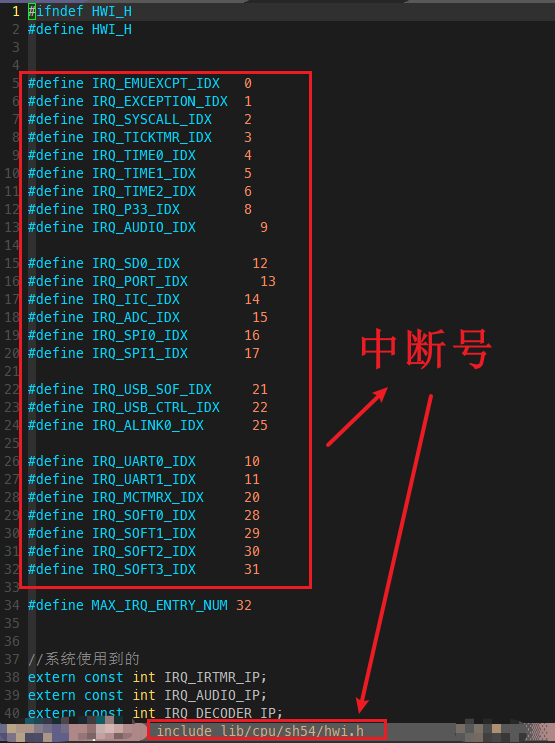
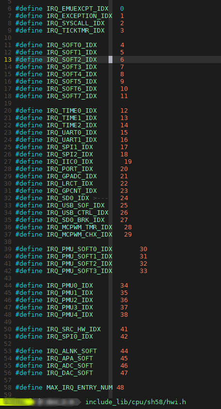
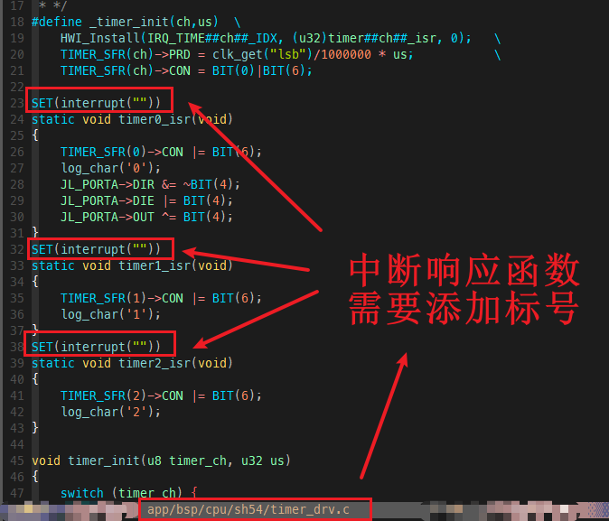
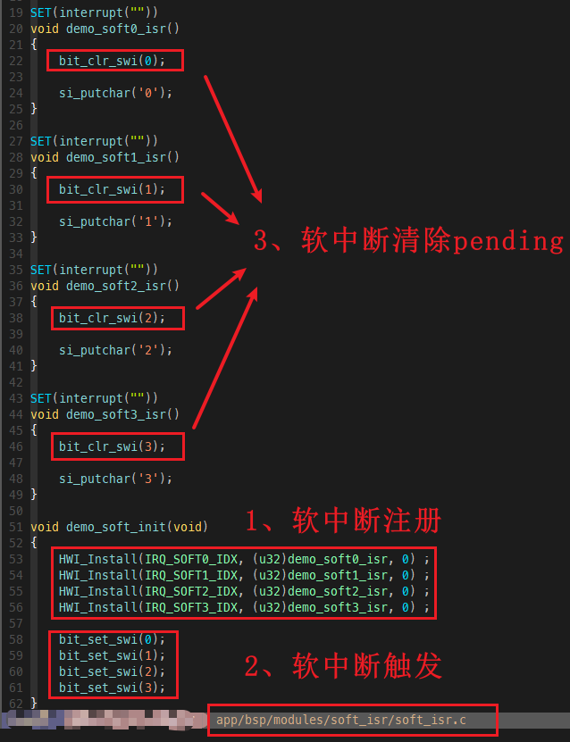
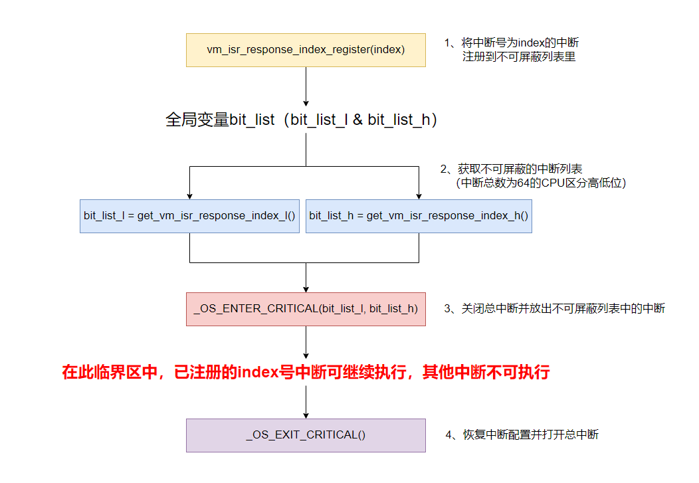

# 5. 中断系统

AD系列支持众多硬件中断，拥有8级中断优先级，支持中断嵌套；除了硬件中断，还支持软件中断；中断数量如下表所示：

| CPU            | 中断号数量             | 中断优先级 |
| -------------- | ---------------------- | ---------- |
| AD14N / AC104N | 32个（包含4个软中断）  | 0~7，共8级 |
| AD15N          | 32个（包含4个软中断）  | 0~7，共8级 |
| AD17N          | 32个（包含4个软中断）  | 0~7，共8级 |
| AD18N          | 64个（包含4个软中断）  | 0~7，共8级 |
| AD24N          | 48个（包含8个软中断）  | 0~7，共8级 |
| AD23N          | 128个（包含8个软中断） | 0~7，共8级 |

**注：中断优先级0~7，共8级，数值越大，优先级越高**

## 5.1. 中断的注册与注销

AD系列注册一个中断，需要中断号、中断响应函数以及中断优先级；

- 中断号：每一个中断会分配一个唯一的中断号，可在hwi.h文件中查看；





中断响应函数：中断影响函数类型必须为无返回值的void类型，且中断函数定义时需添加中断标志；



- 中断优先级：中断响应优先级，共8级，分别为0~7，数值越大，优先级越高；

### 5.1.1. 函数void HWI_Install(unsigned char index, unsigned int isr, unsigned char priority)

该函数实现注册一个中断，其中参数:

> ```
> 1、index：需要注册的中断号；
> 2、isr：中断响应函数；
> 3、priority：中断优先级；
> ```

### 5.1.2. 函数void HWI_Uninstall(unsigned char index)

> 该函数实现注销一个中断，其中参数:

```
1、index：需要注销的中断号；
```

## 5.2. 软中断说明

AD系列支持软件中断；软件中断的注册、注销方式与硬件中断一致；SDK中可在soft_isr.c文件中查看示例：



### 5.2.1. 函数void bit_set_swi(unsigned char index)

该函数实现触发一个软件中断，其中参数:

 ```
1、index：需要触发的软件中断序号（软中断0~软中断3分别对应0~3）；
 ```

 注：需要注意此处index与中断号不同；软中断2的中断号在AD14N上是30，需要触发该中断时，该接口传参的index传2即可！*

### 5.2.2. 函数void bit_clr_swi(unsigned char index)

 该函数实现清除一个软中断的Pending，其中参数:

 ```
 1、index：需要清除pending的软件中断序号（软中断0~软中断3分别对应0~3）；
 ```

 *注：需要注意此处index与中断号不同；软中断2的中断号在AD14N上是30，需要清除该中断pending时，该接口传参的index传2即可！*

------

## 5.3. 软件不可屏蔽中断

在进行VM擦写时系统会关闭总中断并操作系统flash，该过程耗时较长，可能会导致播歌卡顿或其他外设中断无法及时响应；

SDK提供了软件不可屏蔽中断，在关闭总中断的同时允许放出部分中断继续执行（例如放出audio中断优化操作vm卡音问题），该部分中断函数以及依赖的变量都需要放在ram里；

**注：AD23N SDK在读写flash时关闭总中断，此时不能使用软件不可屏蔽中断。**

本小节介绍软件不可屏蔽中断相关的接口与使用，流程如下：



### 5.3.1. 函数void _OS_ENTER_CRITICAL(u32 bit_list)

该函数适用于中断总数为32的芯片（AD14N / AD15N / AD17N等），实现关闭总中断的同时放出bit_list参数中置1的中断，其中参数:

 ```
 1、bit_list：需要单独放出的中断list，bit0~bit31分别对应0号~31号中断；
 ```

 例如AD14N需要同时放出audio（中断号为9）和ticktimer中断（中断号为3）；那么bit_list传入0x208即可；

### 5.3.2. 函数void _OS_ENTER_CRITICAL(u32 bit_list_l, u32 bit_list_h)

 该函数适用于中断总数超过32，小于64的芯片（AD16N / AD18N等），实现关闭总中断的同时放出bit_list_l和bit_list_h参数中置1的中断，其中参数:

 ```
 1、bit_list_l：需要单独放出的中断list的低32位，bit0~bit31分别对应0号~31号中断；
 2、bit_list_h：需要单独放出的中断list的高32位，bit0~bit31分别对应32号~63号中断；
 ```

 例如AD18N需要同时放出音频APA中断(中断号为37)和ticktimer(中断号为3)，那么bit_list_h传入0x20，bit_list_l传入0x8即可；

### 5.3.3. 函数void _OS_ENTER_CRITICAL(IRQ_IDX_BITMAP *p_irq_bitmap)

 该函数适用于中断号总数超过64的芯片（AD23N），实现关闭总中断的同时放出p_irq_bitmap参数中置1的中断，其中参数:

 ```
 1、p_irq_bitmap->irq_0_31：需要单独放出的0号~31号中断，bit0~bit31分别对应0号~31号中断；
 2、p_irq_bitmap->irq_32_63：需要单独放出的32号~63号中断，bit0~bit31分别对应32号~63号中断；
 ```

 例如AD23N需要同时放出timer2中断(中断号为6)和ticktimer(中断号为3)，那么p_irq_bitmap->irq_0_31=(BIT(IRQ_TICK_TMR_IDX) | BIT(IRQ_TIME2_IDX))即可；

### 5.3.4. 函数void _OS_EXIT_CRITICAL(void)

 该函数实现恢复中断配置并退出关中断状态；

### 5.3.5. 函数void vm_isr_response_index_register(u8 index)

 **注：该函数AD23N不适用**

 SDK中存在一个全局变量用于存储需要放出来的中断list，该函数实现往该变量中添加中断bit，其中参数:

 ```
 1、index：需要添加的不屏蔽中断号；例如AD14N的audio中断号为9，则传入9即可；
 ```

### 5.3.6. 函数void vm_isr_response_index_unregister(u8 index)

 **注：该函数AD23N不适用**

 该函数实现恢复中断配置并退出关中断状态，其中参数:

 ```
 1、index:删除已添加的不屏蔽中断号；
 ```

### 5.3.7. 函数u32 get_vm_isr_response_index_l(void)

 该函数实现获取全局的不可屏蔽中断list的低32位，其中:

 ```
 1、对于中断总数为32的芯片，获取到完整的bit_list；
 2、对于中断总数超过32且少于64的芯片，获取到低32位中断的bit_list；
 ```

### 5.3.8. 函数u32 get_vm_isr_response_index_h(void)

 该函数实现获取全局的不可屏蔽中断list的高32位，仅中断总数超过32且少于64的芯片有该接口；

## 5.4. 硬件不可屏蔽中断

 硬件不可屏蔽中断允许中断在关闭总中断(即调用了函数local_irq_disable())的情况下继续运行；目前支持硬件不可屏蔽中断的芯片有：AD17N、AD18N、AD24N、AD23N；

 *注：若需要中断完全不被打断，需要软硬件不可屏蔽中断功能搭配使用；*

### 5.4.1. 函数void irq_unmask_set(u8 index)

 该函数实现将传入的index中断的优先级设置为最高，并加入硬件不可屏蔽中断列表；其中参数:

 ```
 1、index:需要添加的不屏蔽中断号；
 ```

### 5.4.2. 函数void irq_unmask_disable(u8 index)

 该函数实现关闭硬件不可屏蔽中断功能；


