# 4. 内置系统flash写保护

本说明适用于开源SDK，主要介绍如何将内置flash的代码与资源区域设置为写保护状态，包括以下几点：

- 对于A0芯片，介绍用户如何根据flash手册添加写保护参数；

- 对于内封flash的芯片，如何使用烧写器自动获取对应flash型号的写保护参数；

- 介绍程序中如何打开与关闭内置flash写保护，介绍写保护相关接口；

支持的SDK版本

| 芯片   | 支持的SDK版本                                     |
| ------ | ------------------------------------------------- |
| AD14N  | ad140-release_v1.4.0 开源sdk_v1.6.0 以及之后的SDK |
| AC104N | ac104-release_v1.4.0 开源sdk_v1.6.0 以及之后的SDK |
| AD15N  | ad150-release_v1.4.0 开源sdk_v1.6.0 以及之后的SDK |
| AD17N  | 开源sdk_v1.7.0 以及之后的SDK                      |
| AD18N  | 开源sdk_v1.8.0 以及之后的SDK                      |

## 4.1. A0芯片如何添加写保护参数

### 4.1.1. flash写保护工具说明

SDK的下载目录（路径：app\post_build\sh5x\voice_toy(工程)\）中存放有“flash_write_protect”文件夹，文件夹中包含以下文件：

- flash_wp_info.csv：该文件以文本形式记录各种flash的写保护参数
- csv2dir.bat：该脚本实现将上述csv文件转成小机可识别的dir_sys_info文件

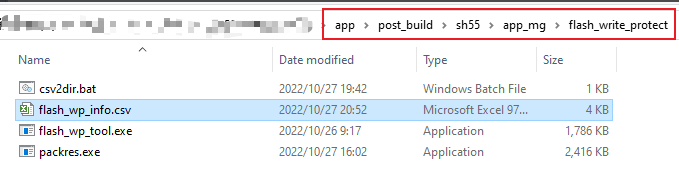

其中，flash_wp_info.csv文件中涵盖了内封flash的绝大部分型号。对于A0芯片，用户可自行根据使用的flash型号datasheet添加相应的写保护参数以及指令。

添加完成后，点击csv2dir.bat脚本，即可生成dir_sys_info文件，将该文件放在下载目录中，添加到download.bat的资源文件中下载到小机中，小机即可识别并添加写保护。

运行csv2dir.bat脚本时，需要注意是否有执行成功。

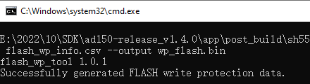

没有执行成功时，需要关注错误信息，重新修改flash_wp_info.csv文件；下图的错误信息显示同时存在两组相同的flash写保护参数。

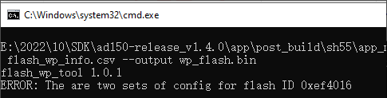

### 4.1.2. 新增flash写保护参数与指令

如下对于A0的芯片，用户可自行根据需要使用的flash的datasheet，在flash_wp_info.csv文件中添加写保护参数以及相关指令，下文以华邦W25Q32 FLASH为例，介绍根据手册添加参数。

#### 4.1.2.1. Flash SR1、SR2寄存器和写保护范围

在flash datasheet中，可通过查找关键字“BP1”快速找到SR1寄存器，查找关键字“LB1”快速找到SR2寄存器；

检查SR1寄存器中是否有SEC、TB、BP2、BP1、BP0位，检查SR2寄存器是否有CMP位；

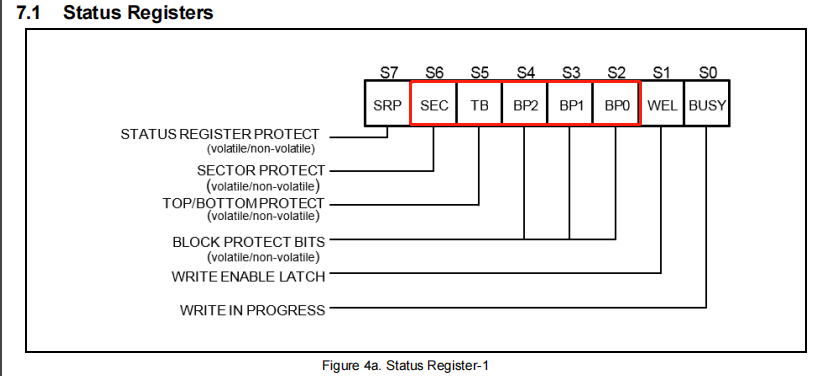

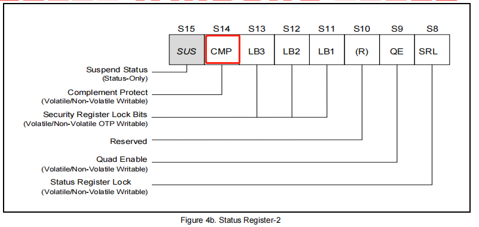

通过查找关键字“Density”快速搜索写保护列表，并查看flash支持的写保护范围。

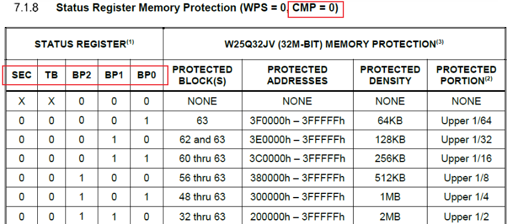

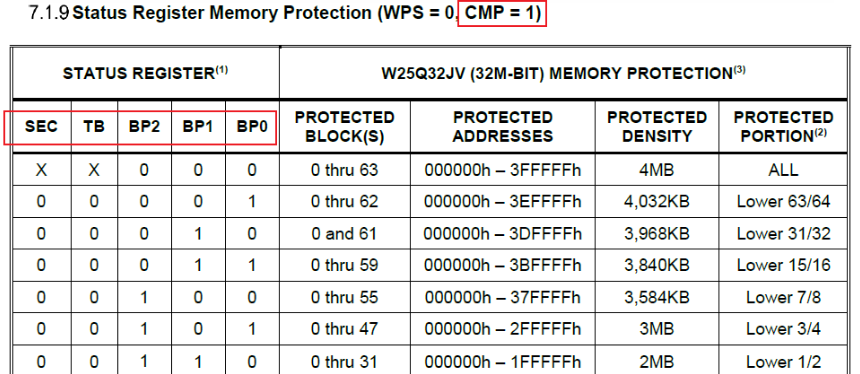

#### 4.1.2.2. 如何添加flash写保护参数[](https://doc.zh-jieli.com/AD14/zh-cn/master/flash_write_protect/flash_write_protect.html#id5)

打开flash_wp_info.csv文件并根据3.1.1中的信息填写参数，我司配置flash写保护范围从0地址开始，向后覆盖。

表格找到上一组flash数据空两至三行后，在第一行填写flash标号、flash id以及写使能（Write Enable）指令。

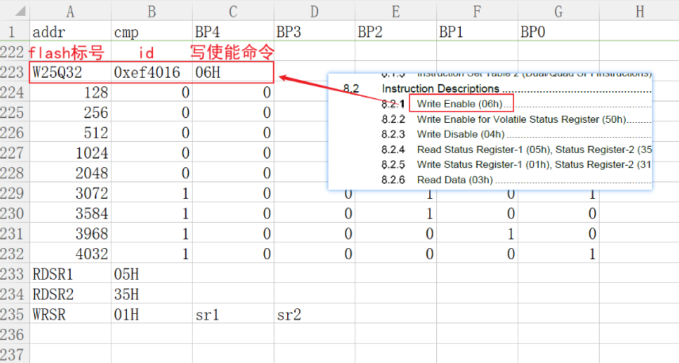第二行开始填写flash写保护参数，最大

支持9组flash写保护参数。

通过保护范围的大小，设置SEC、TB、BP0、BP1、BP2（不同的flash SEC和TB标识可能是其它，如BP4、BP3）和CMP的值。

例如：当CMP = 0时，SEC TB BP2 BP1 BP0为0b01101，可保护000000h - 0fffffh范围内1MB的数据。

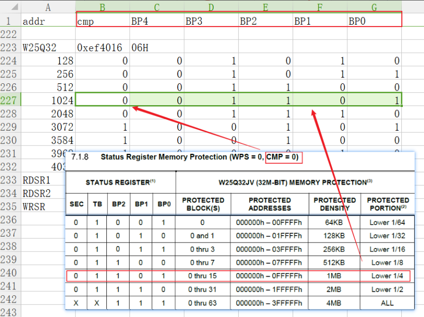

当CMP = 1时，SEC TB BP2 BP1 BP0为0b00001，可保护000000h - 3effffh范围内4032KB的数据。

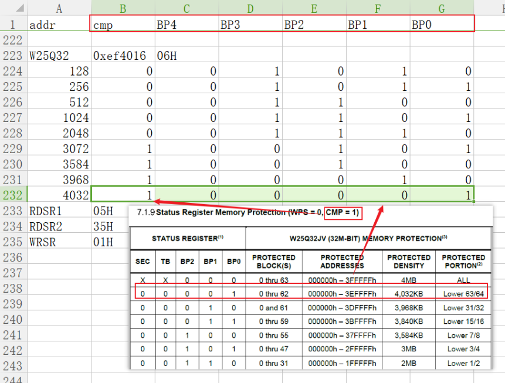

#### 4.1.2.3. flash读写SR1、SR2指令

Flash配置写保护时，需要读写SR1、SR2 寄存器。查找手册找到读写SR1、SR2的指令，并填入表格中。

如果datasheet上有31H命令，优先使用分开写SR1、SR2模式；

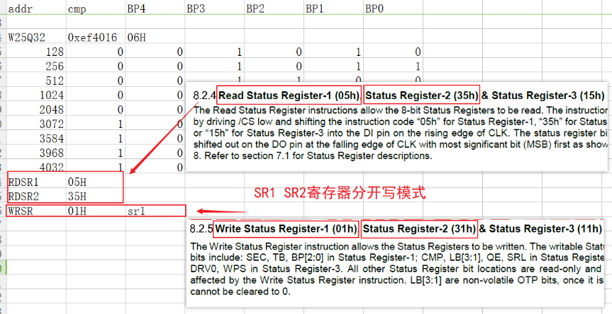

若上述分开写SR1、SR2模式在芯片运行中添加写保护不成功，则使用01H指令连续写SR1、SR2模式；

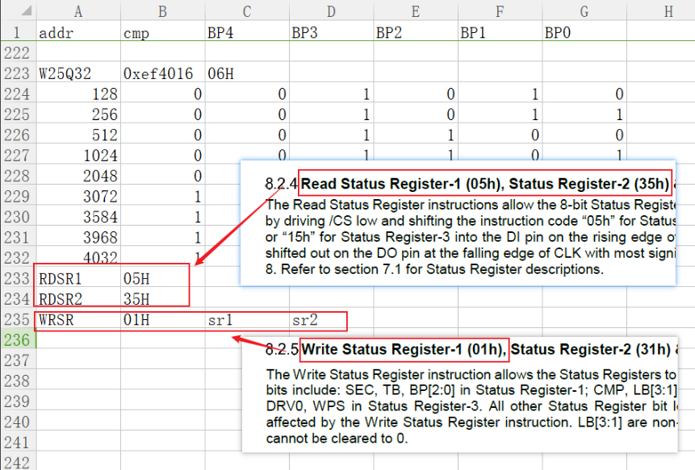

部分Flash不存在SR2寄存器，则无需写SR2相关指令。

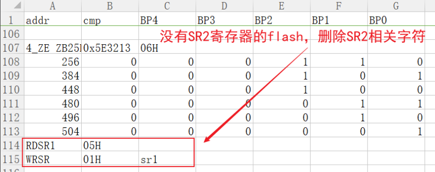

### 4.1.3. 写保护参数下载说明

添加好写保护参数后，根据2.1的说明执行脚本生成dir_sys_info文件，并将其添加到SDK资源列表中，小机通过路径搜索找到该文件并进行解析。

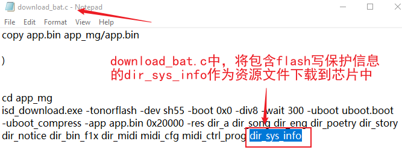

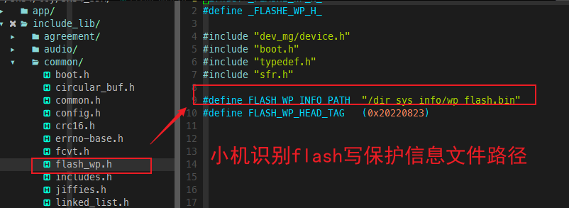

### 4.1.4. 第一点相关函数说明

#### 4.1.4.1. 函数struct flash_wp_arg *find_flash_wp_file_arg(void)

该函数实现解析dir_sys_info中的wp_flash.bin文件，逐个查找与正在运行的flash匹配的写保护参数，其中：

1． 返回值：

成功，返回匹配成功的写保护结构体flash_wp_arg指针；

失败，返回NULL；

## 4.2. 内封flash芯片如何添加写保护参数（旧）

上文通过表格的方式保存flash写保护参数，存在更新不及时的问题。对于杰理非A0的芯片，内封的flash型号可能会发生变动，不适合用表格形式记录。

我司烧写器可联网更新flash写保护参数，烧写器可在烧写阶段将内封flash对应的写保护参数记录在flash最尾部，由程序去查找该文件并配置写保护。

本文将介绍如何配置ini文件实现该功能；

支持旧的内封flash写保护策略的芯片：

支持写保护策略的芯片AD14N / AC104N，AD15N，AD17N

### 4.2.1. 配置烧写器获取内封flash写保护参数

在SDK的下载目录（路径：app\post_build\sh5x\app_mg（或其他工程）\）中打开isd_config.ini文件，并在其中添加烧写器flash写保护配置项。

‘’’ [BURNER_PASSTHROUGH_CFG] FLASH_WRITE_PROTECT=YES; ‘’’

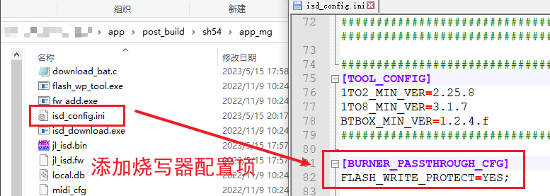

### 4.2.2. 配置强制下载工具获取内封flash写保护参数

isd_config.ini文件添加了FLASH_WRITE_PROTECT=YES配置后，使用强制升级工具更新程序会报如下错误：

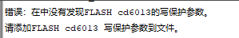

解决办法是将FLASH_WRITE_PROTECT注释掉或者配置为NO。

### 4.2.3. 第三点相关函数说明

#### 4.2.3.1. 函数int norflash_set_write_protect(u8 enable_write_protect)

- 该函数实现开启或关闭内置flash写保护功能，其中参数：

1. Enable_write_protect1：开启写保护0：关闭写保护
2. 返回值开启写保护成功：写保护的最大地址（即flash的0~返回值这块区域保护）；关闭写保护成功/开启写保护失败：

- 失败问题原因分析步骤：

1.开写保护打印（在app_config.c里EEPROM区的打印打开）；

2.检查打印，如果没有任何打印直接返回0，则用户直接跳到步骤3；如果只有写保护失败打印，则跳到步骤4；如果打印相关寄存器值出来和失败打印，则跳到步骤4

3.写保护参数没有放进flash当中，用户可以按照文档逐步操作：

4.确认自己芯片的flash是否在csv烧写文件里；确认app.bin + 资源文件少于对应flash的最小保护区域，用户可以在下载目录里加一些无用的资源文件。

## 4.3. 内封flash芯片如何添加写保护参数（新）

部分芯片支持新的内封flash写保护策略，固件API接口没有改变，isd_config.ini、download.bat配置发生变化，具体请参考文档：[OTP_CFG(VOTP)区域配置说明](https://doc.zh-jieli.com/Tools/zh-cn/dev_tools/toolchains/otp_cfg.html)

支持新的内封flash写保护策略的芯片：

​	支持写保护策略的芯片AD18N

## 4.4. 程序中开启与关闭写保护功能

SDK中默认会在内置flash初始化的最后，配置flash写保护状态。

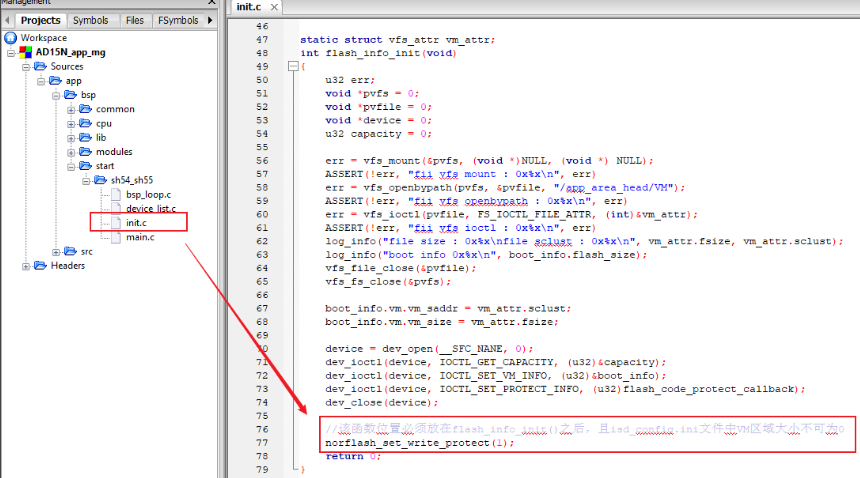

### 4.4.1. 第五点相关函数说明

#### 4.4.1.1. 函数int norflash_set_write_protect(u8 enable_write_protect)[](https://doc.zh-jieli.com/AD14/zh-cn/master/flash_write_protect/flash_write_protect.html#id20)

该函数实现开启或关闭内置flash写保护功能，其中参数：

Enable_write_protect

1：开启写保护

0：关闭写保护返回值开启写保护成功：写保护最大地址；

返回值

开启写保护成功：写保护最大地址；

关闭写保护成功/开启写保护失败：0

#### 4.4.1.2. 函数int norflash_write_protect_config(struct device *device, u32 addr, struct flash_wp_arg *p)

该函数实现配置flash写保护范围，其中参数：

device:设备句柄，传NULL即可；

addr：写保护截止范围，传代码资源区后的地址；

p：flash写保护参数；

返回值：

​	开启写保护成功：写保护最大地址；

​	关闭写保护成功/开启写保护失败：0

#### 4.4.1.3. 函数u16 norflash_read_sr1_sr2(void)

该函数实现获取内置flash的Status Register 1和Status Register 2寄存器，其返回值高8位为SR2，低8位为SR1；

#### 4.4.1.4. 函数u32 flash_code_protect_callback(u32 offset, u32 len)

该函数实现软件上限制驱动操作内置flash（存放代码的flash）.

内置flash进行写或擦除操作前会回调该函数，判断会操作到代码与资源区域，则不进行相应操作;

- 可减低程序跑飞导致程序意外擦写flash的概率。其中参数：

offset：设备进行写或擦除操作的地址

len：设备进行写或擦除操作的长度

返回值：

​	开启写保护成功：写保护最大地址；

​	关闭写保护成功/开启写保护失败：0

