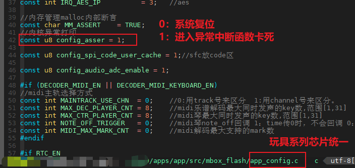
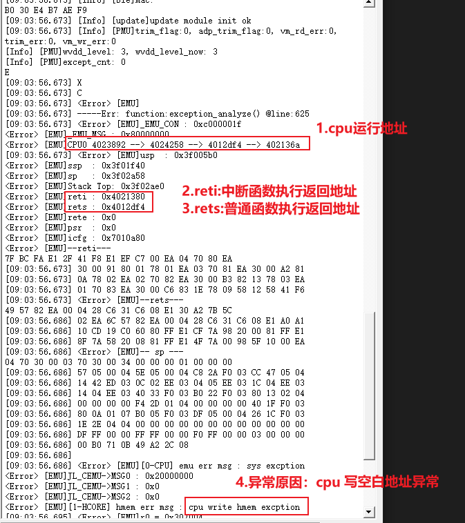
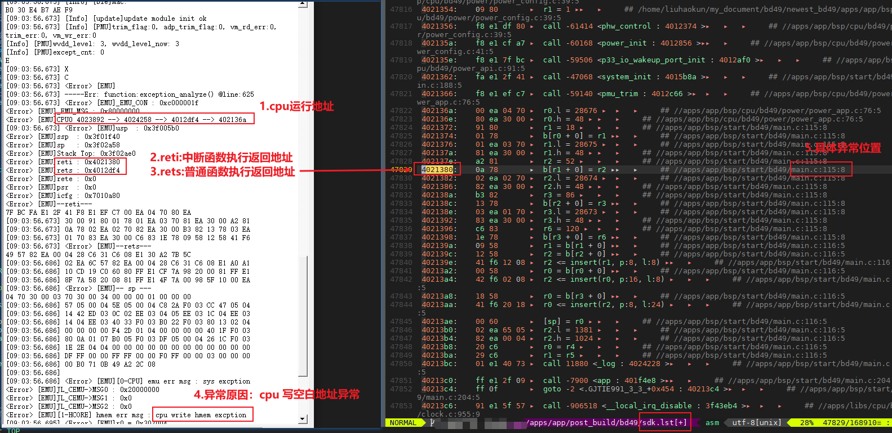
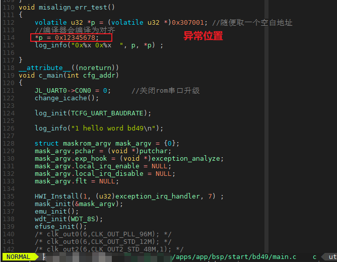

# 2. 异常

芯片在运行代码时，由于软件 / 硬件状态出错，当该错误状态未在硬件 / 软件 程序设计覆盖的容错范围时，就会引起系统处于未知状态的异常。

在触发异常后，会有两种后果：

> 一、系统复位；
>
> 二、进入系统异常中断函数并死循环住；

用户可以通过配置 config_asser 来选择触发异常后是系统复位还是进入系统异常中断函数卡死。

## 2.1. 异常分析

用户在触发异常后，可以观察异常信息里的 reti 和 rets 的地址，在下载目录里的sdk.lst文件查看对应地址的代码是出现在那里。

下面例子为SDK操作了一个指向空白地址的指针给他赋值导致的cpu写空白地址异常。（其他异常分析均可类似分析）

1. 分析异常信息

2. 在下载目录里的sdk.lst文件查找 rets 和 reti 的位置 （若分析该两处地址分析不出具体异常原因，可查看异常信息里的cpu的运行地址来反推异常位置）

3. 追踪到SDK具体异常位置。 SDK操作了一个指向空白地址的指针给他赋值导致的cpu写空白地址异常。

有一些异常信息往往不在具体异常代码那一行，而是在附近。

## 2.2. 常见异常

常见异常信息有：

> 1. pc_limit：程序跑飞，指CPU的PC指针跑到了不允许操作的地址；
>2. misalign_err：非对齐访问，指CPU访问内存数据时，寻址指针要求地址4字节对齐访问；
> 3. cpu read / write hmem excption : cpu读 / 写空白地址访问异常，指CPU读/写了内存里的空白地址；
> 4. watchdog time out : 看门够异常，指系统未在看门狗规定范围时间内进行清狗操作。

