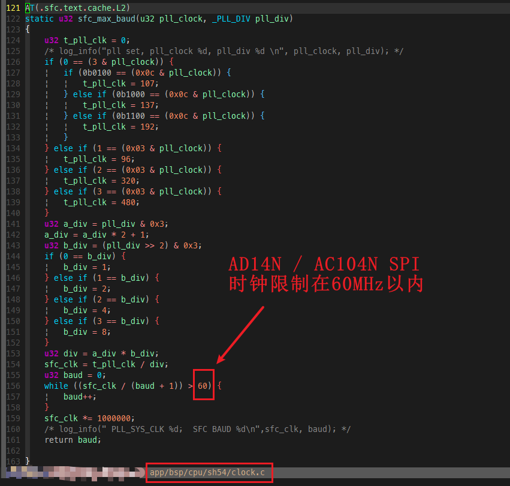
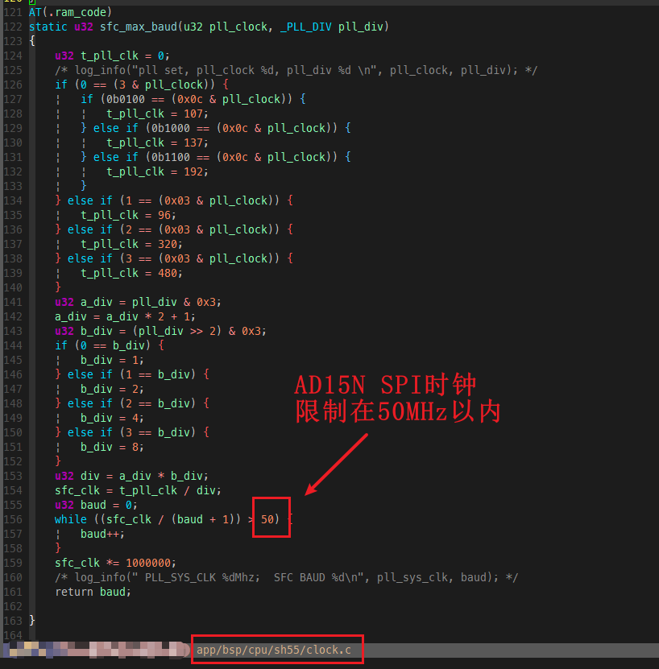
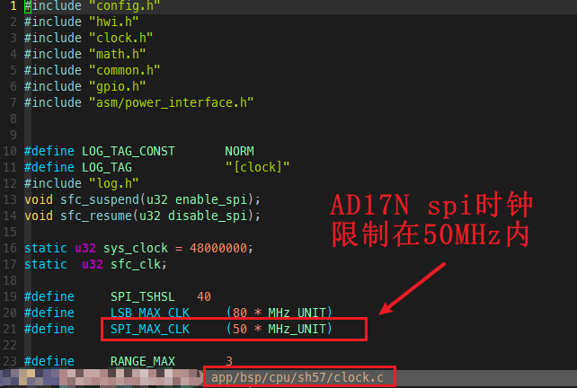
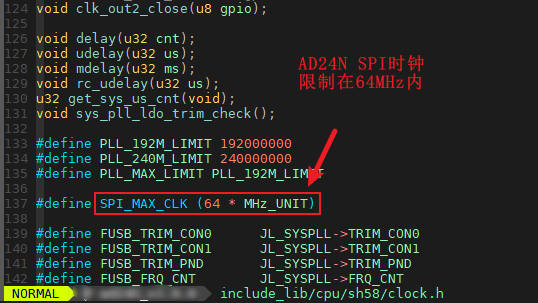

<!-- docs/cpp.md -->

# 1. 时钟驱动

AD14N / AD15N / AC104N / AD17N / AD18N / AD24N 支持动态设置系统HSB、LSB时钟，支持多种分频组合；
时钟驱动中限制着内置系统flash的spi时钟速度，SDK为兼容大多数flash，默认的spi时钟不超过60MHz；

最高系统时钟如下：

| 最高系统时钟 / CPU | AD14N / AC104N | AD15N | AD17N | AD18 |
|-------------------|----------------|-------|-------|------|
| HSB（系统时钟）    | 192MHz（超频）  | 160MHz | 160MHz | 160MHz |
| LSB               | 96MHz（超频）   | 80MHz  | 80MHz  | 96MHz |

AD14/15/17以及AC104时钟相关函数：
```
void pll_sel(u32 pll_clock, _PLL_DIV pll_div, _PLL_B_DIV pll_b_div);
int clk_get(const char *name);
```

AD18时钟相关函数：:
```
int clk_set(const char *name, int clk);
int clk_get(const char *name);
```

## 1.1. AD14N / AC104N 系统时钟超频说明

AD14N / AC104N支持最高192MHz的系统时钟，在运行大于160MHz系统时钟前需要提高系统内核电压，否则可能会导致运行异常；

支持192MHz时钟的内核电压，需要调用以下接口修改，需要在系统时钟初始化前调用：

```
VDC13_VOL_SEL(VDC13_VOL_SEL_140V);
SYSVDD_VOL_SEL(SYSVDD_VOL_SEL_129V);
```

| 系统时钟不超过 | 内核电压挡位 | 内置系统Flash | A0芯片外挂系统Flash |
|---------------|-------------|---------------|-------------------|
| 160MHz        | 默认值       | 支持          | 支持              |
| 192MHz        | 1.29V       | 支持          | 支持              |

*表 系统时钟支持情况*

## 1.2. 内置系统flash spi时钟说明

当使用A0芯片时，系统Flash需要外挂，由于Flash的型号以及性能，加上PCB布线等情况的影响，不能预测系统Flash波特率运行在超过50Mhz、甚至是到96MHZ的具体情况；在此种情况下，客户如果需要系统Flash波特率运行在超过50Mhz，需要自行评估。

| 系统Flash波特率 | 内置系统Flash | A0芯片外挂系统Flash |
|-----------------|---------------|-------------------|
| ≤ 60MHz         | 支持          | 支持              |
| 60MHz ~ 96MHz   | 支持          | 不能直接支持      |
| > 96MHz         | 不支持        | 不支持            |

*表 系统Flash波特率支持情况*

### 1.2.1. AD14N / AC104N SPI时钟限制



### 1.2.2. AD15N SPI时钟限制



### 1.2.3. AD17N SPI时钟限制



### 1.2.4. AD24N SPI时钟限制




## 1.3. 时钟相关函数

### 1.3.1. 函数void pll_sel(u32 pll_clock, _PLL_DIV pll_div, _PLL_B_DIV pll_b_div)

此函数用于AD14/15/17以及AC104，实现动态配置系统时钟源和分频，系统时钟配置关系如下：

> sys_clk = pll_clock / pll_div / pll_b_div;
>
> *注：选择系统时钟时，优先调整二级分频 pll_b_div，无法满足所需要的时钟下再调整一级分频 pll_div！*

AD17N的二级分频参数命名为hsb_div，枚举类型为_HSB_CLK_DIV，效果与其他芯片一致！

其中参数：

```
1. pll_clock：PLL时钟源
    ①、PLL_96M；
    ①、PLL_107M；
    ①、PLL_137M；
    ①、PLL_192M；
    ①、PLL_320M；
    ①、PLL_480M；
2. pll_div：PLL时钟一级分频
    ①、可选PLL_DIV1~PLL_DIV56，具体请参考_PLL_DIV枚举；
3. pll_b_div：PLL时钟二级分频
    ①、可选PLL_B_DIV1~PLL_B_DIV8，具体请参考_pll_b_div枚举；
```

### 1.3.2. 函数int clk_get(const char *name);

此函数用于实现获取各时钟域的频率，具体参数支持”sys”、”hsb”、”lsb”。

### 1.3.3. 函数int clk_set(const char *name, int clk)

此函数用于AD18N、AD24N，AD23N实现动态配置系统时钟源和分频

其中参数：

```
1. name：时钟名，可配置以下时钟
    ①、sys：系统时钟，即hsb时钟；
    ①、lsb：低速时钟；
    ①、sfc: sfc时钟；
2. clk：时钟设置目标频率
```

### 1.3.4. 函数int clk_early_init(enum pll_ref_source pll_ref, u32 ref_frequency, u32 pll_frequency);[](https://doc.zh-jieli.com/AD14/zh-cn/master/system/clock/clock.html#int-clk-early-init-enum-pll-ref-source-pll-ref-u32-ref-frequency-u32-pll-frequency)

此函数用于AD24N/23N初始化时钟，main函数固定要使用，如果需要修改相关流程和参数需要联系开发人员。

其中参数：::

1. pll_frequency; PLL时钟频率。例：AD24如果需要将系统时钟运行至240M，则需要先将pll_frequency设置成240M，然后再通过clk_set将系统时钟调整至240M


