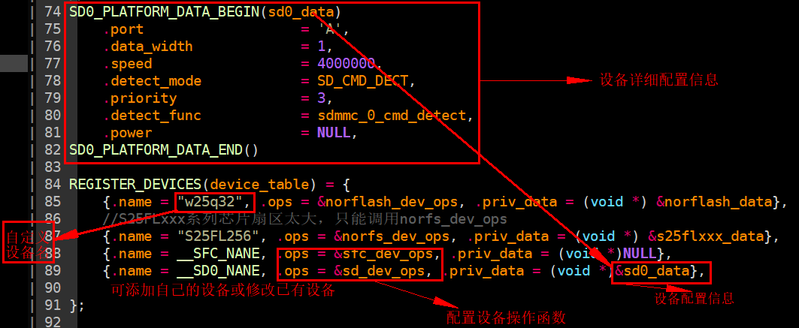

# 1. 时钟驱动

各芯片支持的设备类型如下：

| 芯片支持的设备 | 内置flash | 外置flash | SDMMC | usb      |
| -------------- | --------- | --------- | ----- | -------- |
| AD14N / AC104N | √         | √         | √     | √        |
| AD15N          | √         | √         | √     |          |
| AD17N          | √         | √         |       |          |
| AD18N          | √         | √         |       | √        |
| AD24N          | √         | √         | √     | √        |
| AD23N          | √         | 暂不支持  | √     | 暂不支持 |

设备管理库的目录位于include_lib/liba/dev_mg_lib.a。其中主要的函数有:

```c
int  devices_init();
bool dev_online(const char* name);
void* dev_open(const char* name, void* arg);
int  dev_ioctl(void* device, int cmd, u32 arg);
int  dev_close(void* device);
int  dev_bulk_read(void* _device, void* buf, u32 offset, u32 len);
int  dev_bulk_write(void* _device, void* buf, u32 offset, u32 len);
int  dev_byte_read(void* _device, void* buf, u32 offset, u32 len);
int  dev_byte_write(void* _device, void* buf, u32 offset, u32 len);
```

**一般设备使用流程：**

1. 定义并赋值设备表；
2. 开机调用devices_init()完成对所有设备的初始化；
3. 调用dev_open打开参数中名字为name的设备;
4. 对设备进行读写（dev_bulk_read/dev_bulk_write/dev_byte_read/dev_byte_write）等操作; 

## 1.1. 设备注册表

设备注册表device_tab中注册了全部需要使用到的设备，其中成员如下:

1. name：设备名称的字符串（自定义名称）
2. ops：设备内部接口函数集合（不可更改）
3. priv_data：设备使用的底层硬件资源及相关模式配置（可根据需要自行配置）

如果要添加设备，直接在下图注册表中接着添加。开机时初始化程序会自动执行初始化。

注：内置FLASH只读时不需要挂设备驱动，因为内部硬件已经实现了支持，在使用时向文件系统传递NULL的设备句柄就能实现读取内部的sydf文件系统！

设备注册表定义及初始化如图所示。



​                                     																			         **图1 设备注册表**

注意flash注册时有两组接口：norflash_dev_ops、norfs_dev_ops（位置见图2/图3）。

注册norflash_dev_ops接口时，起始地址及长度以512字节为单位，比如读取(dev_bulk_read)时带入地址1实际是从1*512=512开始读取，且写函数内部自带擦除操作，可以直接写入。

注册norfs_dev_ops接口时，起始地址及长度以1字节为单位，写函数内部没有擦除，调写函数前需确定要写入的内存地址中没有存入数据，如果有数据要自己写擦除操作。

（注意：读写flash设备操作不是调用图2图3中函数，而是调用dev_bulk_read/dev_bulk_write执行读写）


​                            																		  **图2 flash设备norflash_dev_ops接口**


​                   																		 **图3 flasflash设备norfs_dev_ops接口h配置信息**

图1中设备详细数据配置信息介绍见下图，SD接口配置信息见图4，flash配置信息图5。


​                                         																			   **图4 SD接口配置信息**


​       						 																							**图5 flash配置信息**

## 1.2. 设备函数

### 1.2.1. 函数int devices_init()

​	 	此函数会将device_tab中注册的设备全部初始化，这一步一般在开机时进行。返回值未使用。

### 1.2.2. 函数bool dev_online(const char* name)

​		此函数会根据传入的设备名称返回设备在线情况。

​		返回值: 1表示设备在线;0表示不在线;

### 1.2.3. 函数void* dev_open(const char* name, void* arg)

​		此函数可以打开设备，函数会返回设备句柄供读写等函数调用。只有打开设备，才能使用读写等函数。函数调用前定义好设备句柄变量:				

1. name:需要打开的设备名称;
2. arg:设备参数（多数时候为0，不使用）;
3. 返回值：设备句柄，用于读写等操作函数;

设备名称可自定义，名称信息见下图6。


​																					**图6 注册表名称信息**

### 1.2.4. 函数int dev_bulk_read(void* _device, void* buf, u32 offset, u32 len)

本函数实现从设备某个地址offset读取长度为len * 512字节的数据到buf的功能:

1. _device：dev_open函数返回的设备句柄；
2. buf：缓存，保存读出的数据，需自定义；
3. offset：读取起始设备地址；
4. len：需要读取的块数，通常为len*512字节长度；
5. 返回值：正常情况返回长度即形参Len，错误时返回0

注意：形参offset、len范围要在图7定义的起始地址和大小范围内才能正常操作设备。

### 1.2.5. 函数int dev_bulk_write(void* _device, void* buf, u32 offset, u32 len)

本函数实现把长度为len * 512字节的buf数据写入设备的功能，写入起始地址为offset:

1. _device: dev_open函数返回的设备句柄；
2. Buf ：缓存，保存着需写入的数据；
3. Offset ：写入起始设备地址；
4. Len ：需要写入的块数，通常为len*512字节长度。
5. 返回值 :正常情况返回长度即形参Len，错误时返回0

注意：形参offset、len范围要在图7定义的起始地址和大小范围内才能正常操作设备。

### 1.2.6. 函数int dev_byte_read(void* _device, void* buf, u32 offset, u32 len)

本函数实现从设备某个地址offset读取长度为len字节的数据到buf的功能:

1. _device：dev_open函数返回的设备句柄；
2. buf：缓存，保存读出的数据，需自定义；
3. offset：读取起始设备地址；
4. len：需要读取的字节长度；
5. 返回值：正常情况返回长度即形参Len，错误时返回0

注意：形参offset、len范围要在图7定义的起始地址和大小范围内才能正常操作设备。

### 1.2.7. 函数int dev_byte_write(void* _device, void* buf, u32 offset, u32 len)

本函数实现把长度为len字节的buf数据写入设备的功能，写入起始地址为offset:

1. _device: dev_open函数返回的设备句柄；
2. Buf ：缓存，保存着需写入的数据；
3. Offset ：写入起始设备地址；
4. Len ：需要写入的字节长度。
5. 返回值 :正常情况返回长度即形参Len，错误时返回0

注意：形参offset、len范围要在图7定义的起始地址和大小范围内才能正常操作设备。

### 1.2.8. 函数int dev_ioctl(void* device, int cmd, u32 arg)

本函数实现获取设备信息或设置设备信息，擦除设备等功能:

device：设备句柄；

cmd：命令，include_lib/dev_mg/ioctl_cmds.h内能查到定义；详细命令表参见图8。常用命令有：（注：不同设备支持命令会有差别，并不是支持所以命令）

1. IOCTL_CMD_SUSPEND,设备挂起
2. IOCTL_CMD_RESUME，设备解挂
3. IOCTL_GET_ID，获取设备ID
4. IOCTL_GET_SECTOR_SIZE，获取设备扇区大小
5. IOCTL_GET_BLOCK_SIZE，获取设备块大小
6. IOCTL_GET_CAPACITY，获取设备容量
7. IOCTL_GET_STATUS，获取设备状态
8. IOCTL_ERASE_SECTOR，擦除设备扇区
9. IOCTL_ERASE_BLOCK，擦除设备块
10. IOCTL_ERASE_CHIP，对设备整片擦除

arg：获取信息时：用作保存返回的设备信息如容量、ID等; 擦出时：用作带入要擦除的地址。

返回值：反应函数运行状态。 0：表示正常 其他值：出错


​																												**图8 cmd可选择的命令**

### 1.2.9. 函数int dev_close(void* device)

本函数实现关闭设备的功能，对于一些设备调用此函数能省电:

1. device：dev_open返回的设备句柄；
2. 返回值：暂无意义


