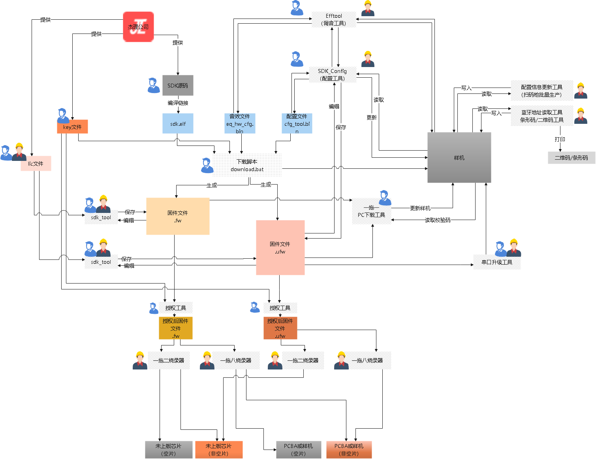
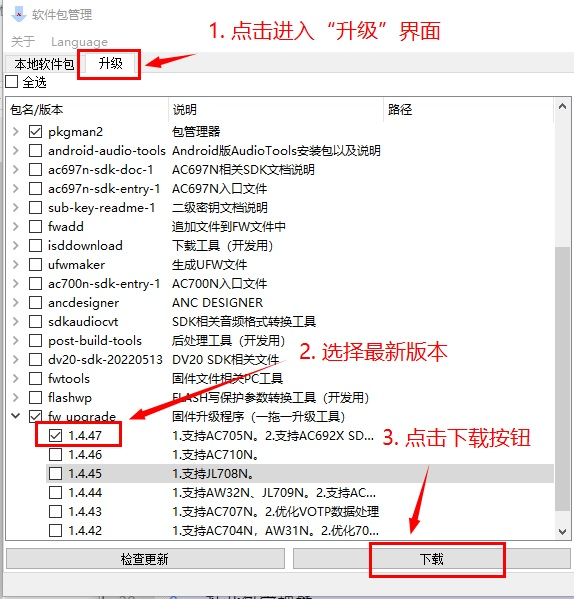

# 1. 固件文件相关工具

对于固件文件，即 .fw 或者 .ufw 后缀的文件。有一些工具可以用于编辑、修改其中的内容。

固件文件的生成、使用流程，如下图所示：

## 1.1. 固件文件下载

在 SDK 开发的时候，后处理脚本会调用`isd_download.exe`生成固件文件的同时，并将该文件下载到设备中。但是`isd_download.exe`工具本身**不能直接下载**一个固件文件到样机中。

如果现在手头上只有一个固件文件(.fw或者.ufw)。可以一些额外的工具来实现：

### 1.1.1. 固件升级工具（一拖一PC下载工具）

本工具用于产品研发初期，开发者已经将样机送至第三方后，需要更新样机固件的情况。

例如开发者将样机送至第三方后，由于软件功能变更等等其他因素导致需要更新样机固件的情况。

> **Note**
>
> 也就是，将一个 fw/ufw 文件直接下载到样机中

为方便开发者与第三方确认固件程序。本工具提供以下功能：

1. 升级样机固件
2. 校验样机固件
3. 显示样机中固件文件(FW/UFW)的校验码
4. 显示样机中固件是由哪个版本烧写工具烧写的
5. 将升级的固件文件和工具打包
6. 工具界面上显示指定的文字信息 以上功能可在配置文件`config.ini`中配置是否使能。`config.ini`文件相对exe的路径为`data/config.ini`。

> **Important**
>
> 由于PC升级环境无法对样机进行测试，所以 **禁止使用此工具进行量产** 。

#### 1.1.1.1. 如何得到固件升级工具

可以通过`杰理包管理器`获取此工具。

1. 如果您没有安装`杰理包管理器`，请先下载安装（[包管理器下载链接](https://pkgman.jieliapp.com/s/pkgman)）。
2. 打开包管理器, 参照下图操作下载工具。

3. 下载完成后，可通过`本地软件包`页面的`执行`按钮启动工具。或者通过`文件管理器中显示`按钮打开工具所在目录。如下图。

