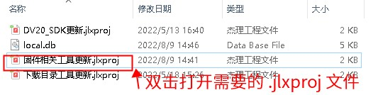
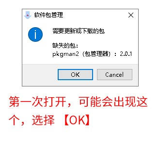
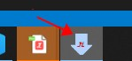
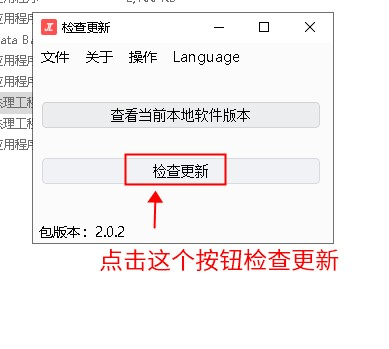

# 3.1. 如何使用 .jlxproj 文件来升级工具[](https://doc.zh-jieli.com/Tools/zh-cn/other_info/faqs/how_to_update_using_jlxproj.html#jlxproj)

一些工具可以通过 `.jlxproj` 文件来实现更新。主要步骤如下：

1. 确认已经安装了 杰理包管理器。 在正确安装后，可以双击打开 `.jlxproj` 文件。
2. 双击打开对应的 `.jlxproj` 文件。如下图：

截图中只是演示，并不代表每次都打开同样名字的文件。具体打开哪个文件，依据你的需要决定。

3. 第一次打开的时候，可能会出现提示缺乏包（可能会弹出一到两次），选择 OK 等待安装完成即可

注意，这个时候需要确保你的电脑是可以连接网络的。这个工具会连接杰理的服务器下载最新工具。

如果程序一直无反应，请查看 任务栏 是否有下面图标的程序，是则点开。

4. 在加载界面后，界面上会有一个【检查更新】的按钮，点击改按钮检查并更新工具

5. 更新完毕后，对应的工具会被下载到 `.jlxproj` 文件所在的目录下。如下图所示：

