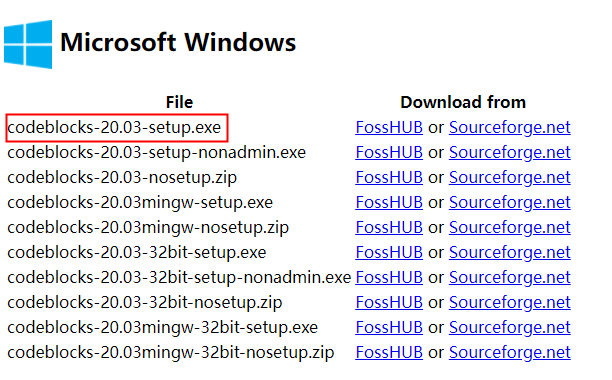

# 1. 开发环境安装说明

## 1.1. Windows 环境

SDK工程默认支持在 Windows 系统上，用 Code::Blocks 开发。

配置环境主要分为三步：

1. 下载并安装 [Windows版Code::Blocks（点击此处下载）](https://pkgman.jieliapp.com/s/codeblocks)
2. 打开安装好的 Code::Blocks 后，关闭 Code::Blocks （这是为了让Code::Blocks生成一些基础设置信息）
3. 下载并安装 [最新版本的杰理Windows版工具链（点击此处下载）](https://pkgman.jieliapp.com/s/win-toolchain)

到现在，你已经可以打开 Code::Blocks 工程进行编译开发了，具体方式，参考 [SDK 编译以及下载](docs/Environment/程序开发相关工具/2.md#2-SDK-编译以及下载)。

> **Note**
>
> 第一次使用 Code::Blocks 编译可能会有 Security Warning 弹窗。 解决方法见：[常见报错](docs/Environment/程序开发相关工具/3.md#32-常见报错)。
>
> 其它常见问题参考：
>
> [Code::Blocks 使用说明以及常见问题处理](docs/Environment/程序开发相关工具/3.md)
>
> [常见问题以及处理方法](docs/Environment/程序开发相关工具/4.md#41-常见问题以及处理方法)
>
> [其它常见问题以及处理方法](docs/Environment/程序开发相关工具/7.md)

下面是一些详细的说明，**可以略过**：

### 1.1.1. 安装 Code::Blocks

Code::Blocks既可以从官方网站下载，也可以直接从杰理网站镜像的地址下载。

#### 1.1.1.1. 从杰理工具网站下载安装

在浏览器中打开链接：[Code::Blocks Windows版本（点击此处下载）](https://pkgman.jieliapp.com/s/codeblocks)

双击下载后的 `codeblocks-latest.exe` ，按照提示进行安装即可。

#### 1.1.1.2. CodeBlocks官方网站下载安装

- 首先打开网址：[Code::Blocks 官网](https://www.codeblocks.org/downloads/binaries/) 。

- 进入下图所示的下载界面后，选择最新版本的 `codeblocks-20.03-setup.exe` 下载，下载后双击进行安装，按提示安装即可。

  

