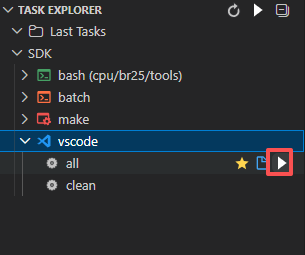

# 1. 开发环境安装说明

## 1.1. Windows 环境

### 1.1.1. Code::Blocks编译环境

SDK工程默认支持在 Windows 系统上，用 Code::Blocks 开发。

配置环境主要分为三步：

1. 下载并安装 [Windows版 Code::Blocks（点击此处下载）](https://doc.yunthinker.com/downloads/codeblocks-latest.exe )
2. 打开安装好的 Code::Blocks 后，关闭 Code::Blocks （这是为了让Code::Blocks生成一些基础设置信息）
3. 下载并安装 [最新版本的杰理Windows版工具链（点击此处下载）](https://doc.yunthinker.com/downloads/2.5.2.exe)，如果需要编译固件，参考[固件文件处理工具](docs/Environment/固件文件处理工具/1.md)

到现在，你已经可以打开 Code::Blocks 工程进行编译开发了，具体方式，参考 [SDK 编译以及下载](docs/Environment/程序开发相关工具/2.md#2-SDK-编译以及下载)。

> **Note**
>
> 第一次使用 Code::Blocks 编译可能会有 Security Warning 弹窗。 解决方法见：[常见报错](docs/Environment/程序开发相关工具/3.md#32-常见报错)。
>
> 其它常见问题参考：
>
> [Code::Blocks 使用说明以及常见问题处理](docs/Environment/程序开发相关工具/3.md)
>
> [常见问题以及处理方法](docs/Environment/程序开发相关工具/4.md#41-常见问题以及处理方法)

### 1.1.2. VS Code编译环境

配置环境主要分为三步：

1. 下载并安装 [Windows版 VS Code（点击此处下载）](https://code.visualstudio.com/sha/download?build=stable&os=win32-x64-user )

2. 打开安装好的 VS Code 后，安装插件 Task Explorer，插件版本太高会无法编译，推荐安装 2.13.14版本

3. 下载并安装 [最新版本的杰理Windows版工具链（点击此处下载）](https://doc.yunthinker.com/downloads/2.5.2.exe)，如果需要编译固件，参考[固件文件处理工具](docs/Environment/固件文件处理工具/1.md)

4. 点击编译即可。

   
