# 2. SDK 编译以及下载

在安装好工具链后，即可开始进行编译。

默认情况下，SDK 支持在 Windows 系统下进行编译以及下载。在 Linux 系统上，仅支持编译。

SDK 发布的时候，默认发布了 .cbp 后缀的 Code::Blocks 工程。此外，还同时发布了 Makefile 以及 VSCode 的配置。用户可以自行选择使用命令行进行编译。

## 2.1. 使用 Code::Blocks 进行编译

默认情况下，SDK 发布都是以 Code::Blocks 工程（即扩展名为 .cbp 的文件）的形式发布。

### 2.1.1. 使用 Code::Blocks 编译 SDK 的步骤

使用 Code::Blocks 进行编译分为两步。下面以 AC695N 的 SDK 为例说明：

#### 2.1.1.1. 打开 SDK 目录下的 cbp 工程

如下图所示：

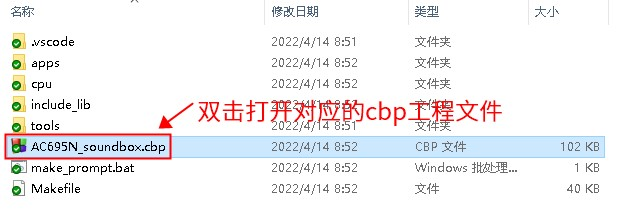

#### 2.1.1.2. 使用强制下载工具连接开发板（样机）与PC

强制升级工具的USB母头与电脑连接，USB公头连接样机或开发板。（**注意不要接反**，参考下图）

详细参考：[升级与下载说明](docs/Environment/程序开发相关工具/6.md#61-升级与下载说明)

##### 2.1.1.3. 点击【编译】或者【重新编译】按钮

如下图所示：

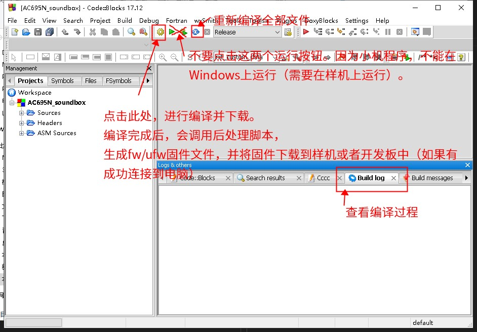

> **important**
>
> 请勿点击【运行】或者【调试】。因为这两个按钮会导致 Code::Blocks 尝试在当前 Windows 机器上运行小机的固件程序。由于小机的固件程序并不是 Windows 上的可执行文件。这会导致报错。

点击【编译】按钮，当 Code::Blocks 编译成功后，将会调用下载目录中的 `download.bat` 后处理脚本，将程序下载到开发板（样机）中。我们只需要点击【编译】按钮即可。

### 2.1.2. 常见问题

> **Note**
>
> 1. 如果使用 Code::Blocks 过程中遇到问题，可以参考[常见报错](docs/Environment/程序开发相关工具/3.md#32-常见报错)，这里列举了常见的问题以及处理方式。
> 2. 如果编译报错，参考：[常见问题以及处理方法](docs/Environment/程序开发相关工具/4.md#41-常见问题以及处理方法)
> 3. 如果下载程序报错，参考：[为什么无法下载程序](docs/Environment/程序开发相关工具/7.md#76-为什么无法下载程序)

## 2.2. 使用 make 进行编译

较新的 SDK 默认都会支持使用 make 编译（支持 Windows 以及 Linux）。

SDK 的根目录下有一个 Makefile 文件。此外，为了支持 Windows 下使用 make。SDK 额外附带了 tools 目录，里面放置了必要的编译工具。

### 2.2.1. Windows 下使用 make 进行编译

在 Windows 下进行编译分为两步。下面以 AC695N 的 SDK 为例进行说明：

1. 打开 SDK 目录下 `tools` 目录内的 `make_prompt.bat` 脚本。如下图所示：

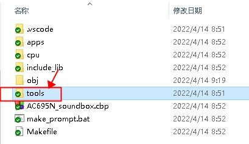

> **Note**
>
> 如果 `tools` 目录下，未能找到 `make_prompt.bat` 文件，则打开 SDK 根目录下的 `make_prompt.bat`。如果还未能找到，则参考：7.1如何将 Code::Blocks 工程转换为 make/VSCode 工程。
>
> 如果你不使用我们提供的 `make_prompt.bat` 来设置 `%PATH%` 环境变量，则你需要自行参考 `make_prompt.bat` 的内容来设置。

2. 在弹出的命令行窗口中，输入`make`并回车。

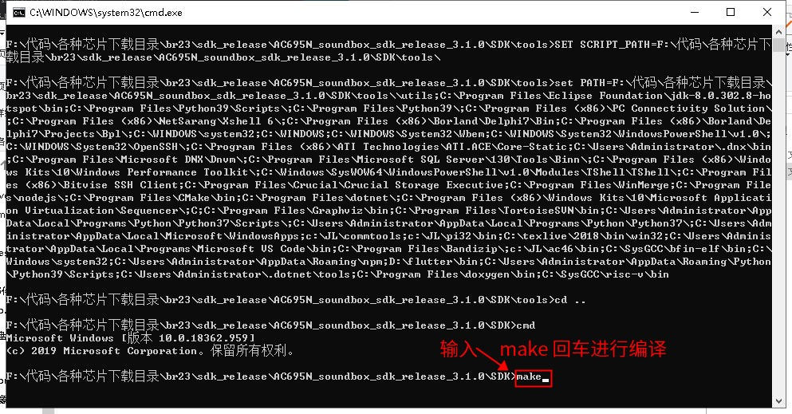

### 2.2.2. Linux 下使用 make 进行编译

在 Linux 下进行编译，分为以下四步：

1. 首先点击下载[Linux 下的工具链](https://pkgman.jieliapp.com/s/linux-toolchain)。
2. 解压工具到`/opt/jieli`目录下，保证`/opt/jieli/common/bin/clang`存在（注意目录层次）
3. 确认`ulimit -n`的结果足够大（建议大于`8096`)。否则链接可能会因为打开文件较多而失败。 可以通过`ulimit -n 8096`来设置一个较大的值。
4. 进入 SDK 根目录，并输入`make`进行编译

### 2.2.3. 排查使用 Makefile 编译出错的步骤

1. 检查 SDK 所在的路径中，是否有空格、中文。
2. 检查 SDK 所在的路径，是否层次过深。
3. 检查 SDK 根目录中的 tools 文件夹，是否与 [转换工具（点击此处下载）](https://pkgman.jieliapp.com/s/cbp2make) 中的 tools 文件夹一致。检查是否有缺失的文件。
4. 检查对应的 Code::Blocks 工程是否能够编译，确认工具链环境是否有问题。
5. 如果你不是使用我们提供的 `make_prompt.bat` 来编译，确认是否正确设置了 `%PATH%` 环境变量，即，这个环境变量中能否找到对应的工具链。

### 2.2.4. 常见问题

> **Note**
>
> 1. 如果编译报错，参考：[常见问题以及处理方法](docs/Environment/程序开发相关工具/4.md#41-常见问题以及处理方法)
> 2. 如果下载程序报错，参考：[为什么无法下载程序](docs/Environment/程序开发相关工具/7.md#76-为什么无法下载程序)

## 2.3. 使用 VSCode 进行编译

较新的 SDK 默认都会支持使用 VSCode 进行开发编译（包括 Windows 以及 Linux）。

VSCode 下编译是通过调用`make`命令实现的。Linux下需要参考 `2.2. 使用 make 进行编译`的步骤先进行配置。

### 2.3.1. VSCode 设置步骤

下面以 AC695N 的 SDK 为例进行说明：

##### 2.3.1.1. 安装必要的插件`Task Explorer`和`C/C++`

如下图所示：

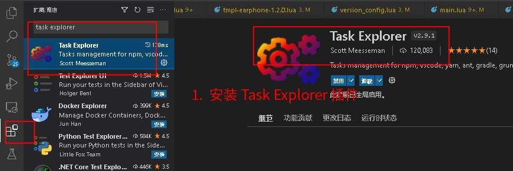

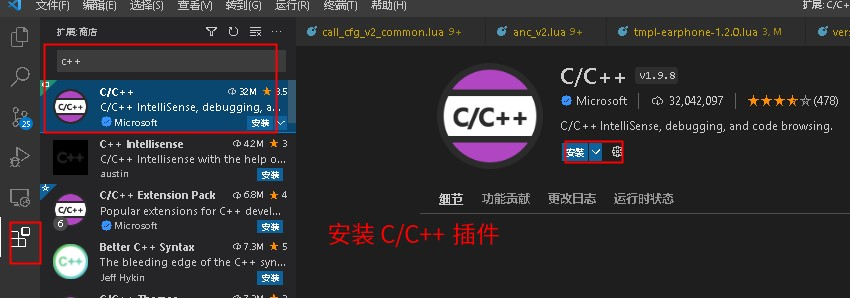

##### 2.3.1.2. 使用 VSCode 打开 SDK 目录

如下图所示：

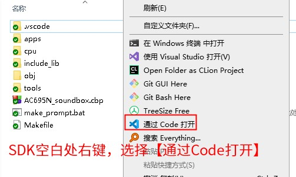

> **Note**
>
> 如果在右键菜单中，未能找到【通过 Code 打开】，这个有以下几种可能：
>
> 你未安装 VSCode
>
> 在安装 VSCode 的时候，未勾选在右键菜单栏显示的选项
>
> 你可以直接打开 VSCode，然后再 VSCode 菜单栏处选择打开目录，并选择 SDK 目录打开，如下图所示：
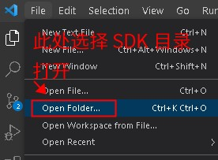

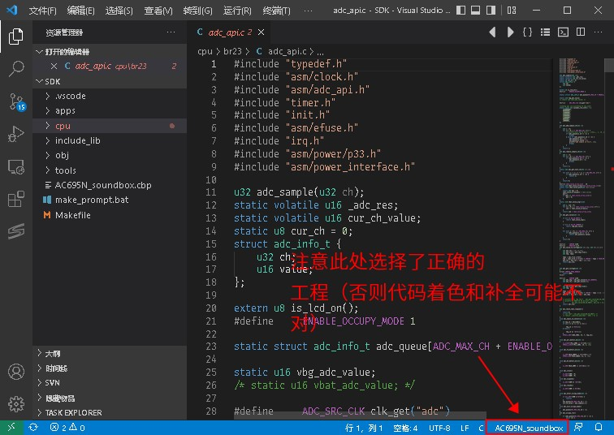

##### 2.3.1.3. 选择对应的 task 进行编译

如下图所示：

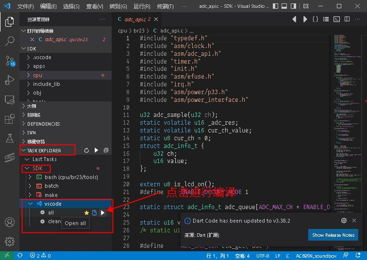

SDK 目录下的 `.vscode` 目录里面包含了`tasks.json`以及`c_cpp_properties.json`文件。这两个是 VSCode 所需要的配置。更多可以参考这里的设置。

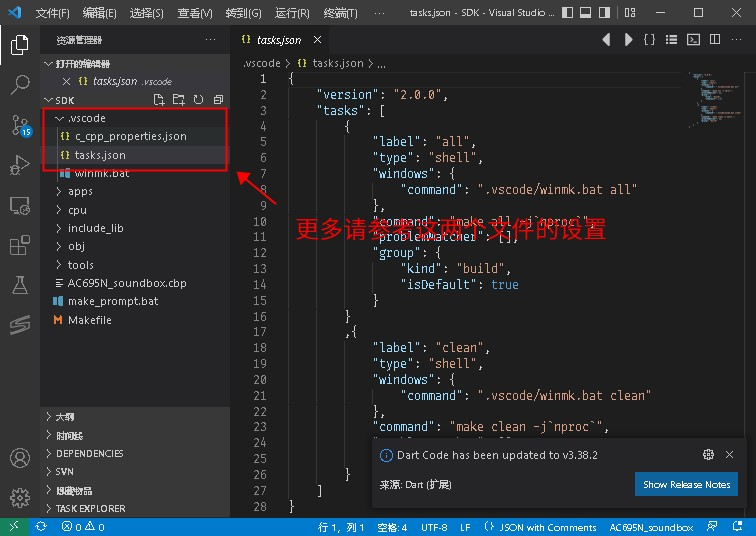

### 2.3.2. 排查 VSCode 编译出错问题

1. VSCode 编译是通过调用 Makefile 实现的，所以先检查 Makefile 是否正常。
2. 检查上述的插件是否正常安装。

> **Important**
>
> 注意要通过插件来运行编译任务。这是因为编译过程中，需要使用到一些额外的工具，例如 `mkdir_win`, `make` 等。
>
> 这些工具一般跟随 SDK 发布（通常在 `tools` 目录下）。在编译之前，需要将这些工具所在的目录，添加到 `%PATH%` 环境变量中。
>
> 这个是通过 `.vscode/winmk.bat` 脚本来完成的。
>
> 假如你希望在 vscode 自带的终端中编译，请按照 `.vscode/winmk.bat` 的调用方式来编译。

### 2.3.3. VScode编译的注意事项

插件安装完成后，编辑器状态栏的区分设备型号的选项及C语言的语法着色、代码高亮、定义引用查找跳转无法使用

可能原因及解决办法：

> **Note**
>
> STM32-cube-clange 等有关STM32型单片机开发的插件也自带了一个intelli引擎，
>
> 会与VScode标准的C/C++的引擎冲突，只能二选其一，而STM32的插件一般会把标准C/C++的引擎关掉。
>
> 选择芯片型号的功能，是由VScode标准的”C/C++环境“提供，恢复插件使能即可。
>
> 一般插件安装时会主动提示冲突，让你选择”关掉“还是”无视（不再弹窗）“，这时得注意查看和排查是否是已安装的其他插件有冲突。

### 2.3.4. 常见问题

> **Note**
>
> 1. 如果编译报错，参考：[常见问题以及处理方法](docs/Environment/程序开发相关工具/4.md#41-常见问题以及处理方法)
>
> 2. 如果下载程序报错，参考：[为什么无法下载程序](docs/Environment/程序开发相关工具/7.md#76-为什么无法下载程序)

