# 3. CodeBlock说明以及常见问题处理

## 3.1. 应该如何实现某功能

### 3.1.1. 添加新的文件到工程中编译

打开工程后，在如下菜单栏出选择：

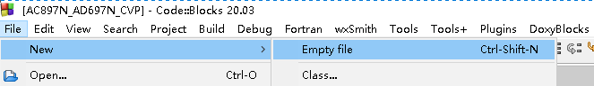

如有下面弹出，则选择【是】

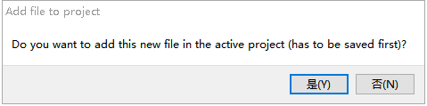

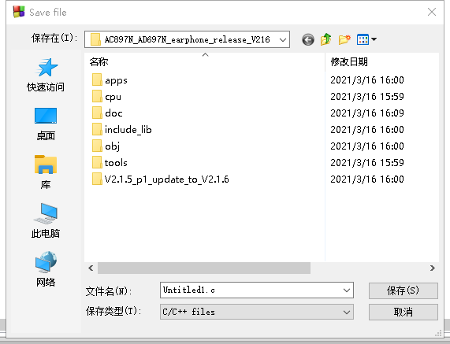

选择文件需要保存的路径。

为了确定文件是否加入了当前编译目标，可以通过下面方式确认：

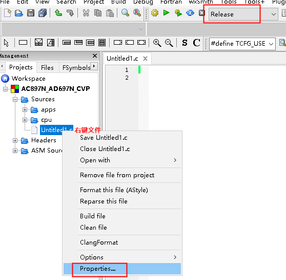

如图，Release是当前的编译目标，在右键文件的Properties后，如下图：

表示已经加入到了当前编译目标中。

另外一种添加文件的方式：

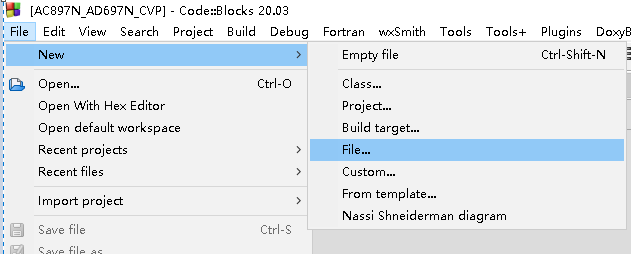

然后选想要的文件类型后，点击【Go】

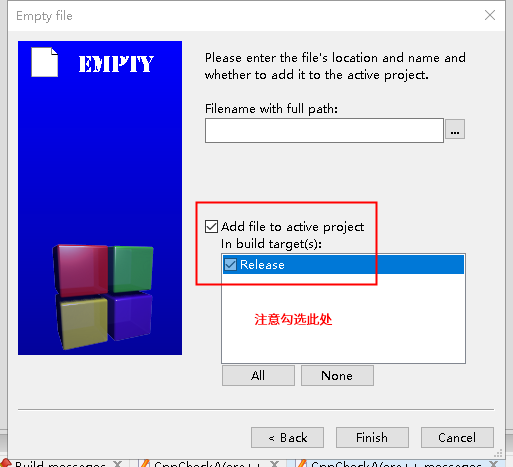

### 3.1.2. 如何添加搜索路径

1. 右键选择build options

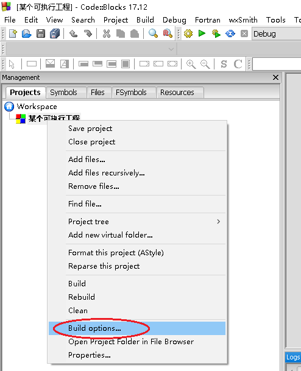

2. 如下设置

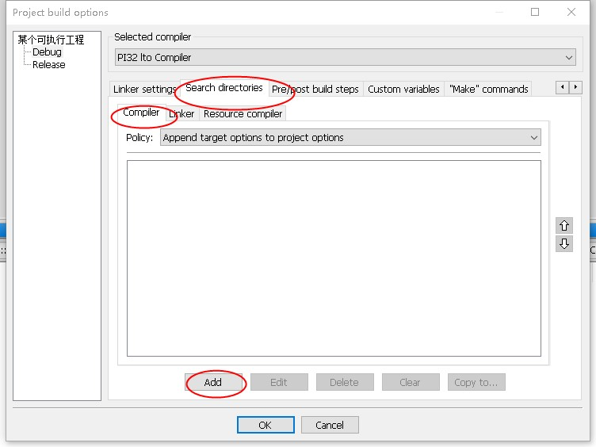

## 3.2. 常见报错

下面列举了一些常见的报错，以及处理方式

### 3.2.1. Environment error（找不到GNU GCC）

有时候打开 Code::Blocks 会出现如下错误。这个是因为 Code::Blocks 会查找系统中gcc的位置。找不到之后会报错。但是由于我们并没有使用gcc。**所以这个并不会造成影响**。如果希望不再出现，可以安装gnu gcc。例如安装 codeblocks-mingw32 的版本。

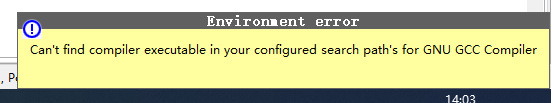

### 3.2.2. 打开工程提示不能找到编译器配置（cannot find/run the compiler）

出现这种情况的原因是cbp工程中指定需要使用的编译器，在当前电脑安装的 Code::Blocks 的全局配置中找不到。这有两种可能：

1. 当前的 cbp 工程指定的编译器错误（查看方式：见[如何查看当前工程是什么工具](https://doc.zh-jieli.com/Tools/zh-cn/dev_tools/codeblocks/howto_view_toolset.html)）
2. 当前的 cbp 工程指定的编译器正确，当前电脑的 Code::Blocks 的全局配置未及时更新（也就是需要更新工具链）
3. 当前工具链已经是最新，可能是因为原来电脑中的配置因为某种原因被破坏了。

一般情况下，先重新安装最新版本[工具链（点击此处下载）](https://pkgman.jieliapp.com/s/win-toolchain)后，再重试是否问题还存在。

查看 Code::Blocks 的全局编译器配置

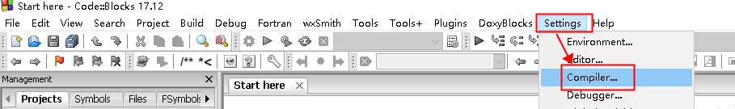

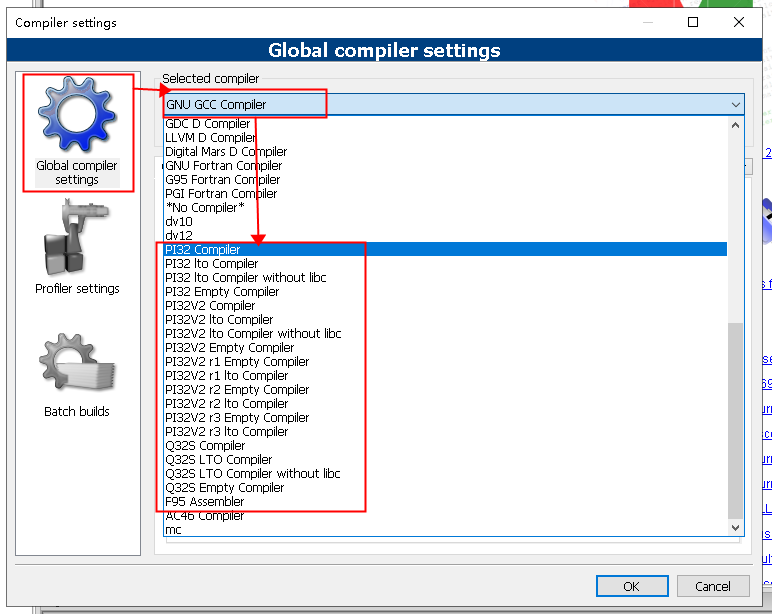

### 3.2.3. 不支持的16位应用程序/已停止工作

当点击【运行】或者【编译后调试】的按钮（即， 这两个按钮)，会出现类似如下的提示：

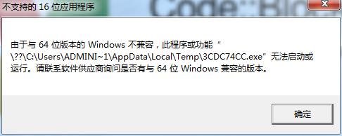 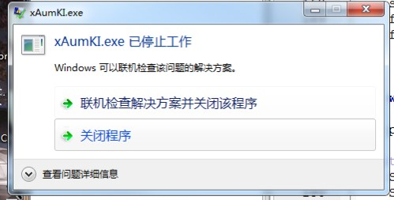

这是因为，小机的程序不是 Windows 应用程序，无法在 Windows 上运行（而是在样机上运行）。

点击【编译】按钮（即，)

> **Note**
>
> 如果点击的是【编译】按钮，但仍然弹出了这个错误，那一般是因为你的电脑被感染了病毒，杀毒后再尝试。（这是因为有些病毒会尝试感染并运行所有被编译出来的文件)。

### 3.2.4. 编译的时候提示Security Warning

由于Windows下命令行参数长度有限，当链接较多文件后，可能会超过长度限制导致链接失败。为了支持链接更多的文件，需要把一部分命令行参数写入到临时的文件（目前是工程目录下的`objs.txt`文件）中，然后再链接。创建文件的操作会触发警告。

从编译器2.4.1版本开始，Code::Blocks 在编译的时候，可能会提示类似如下的内容：

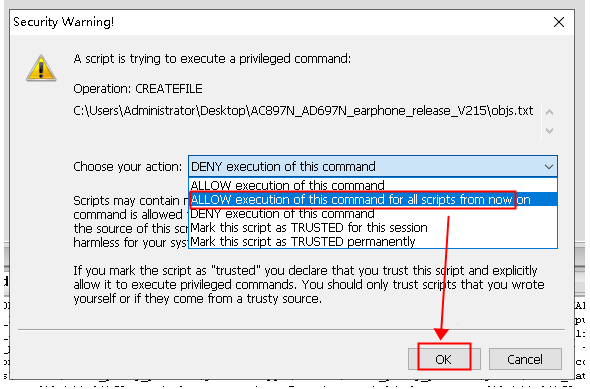

请选择图中的【ALLOW execution of this command for all scripts from now on】并点击【OK】。

如果第一次没有选择，也可以通过下面方式修改：

 

### 3.2.5. 链接的时候，提示无法找到`@xxx.objs.txt`文件[](https://doc.zh-jieli.com/Tools/zh-cn/dev_tools/codeblocks/faq_objs_txt_not_found.html#xxx-objs-txt)

这个`objs.txt`的文件，一般是在链接前通过 Code::Blocks 的脚本生成的文件。里面包含了所有需要链接的文件的路径。如果在一开始没有允许 Code::Blocks执行生成文件的脚本，则会导致问题。可以通过下面方式来允许：

 

### 3.2.6. 为什么 Code::Blocks 语法着色不对

一些情况下，会发现 Code::Blocks 的语法着色不对。例如，下图中，已经定义了 `UART_TEST_EN`，但是 Code::Blocks 未能正确识别，仍然讲代码块识别为无效。

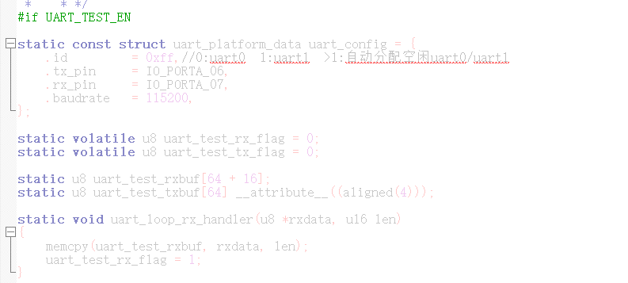

这通常是因为 Code::Blocks 的着色插件精度不够。可以考虑更新 Code::Blocks 版本，或者使用 VSCode（一般情况下，我们的 SDK 都同时支持 VSCode 和 Code::Blocks）。

