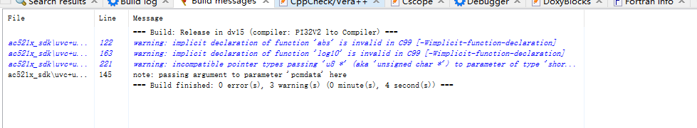
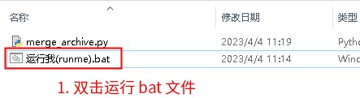
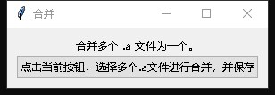
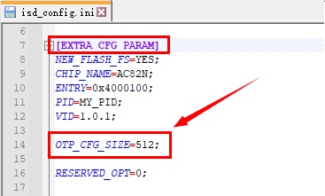
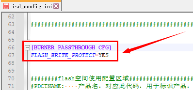
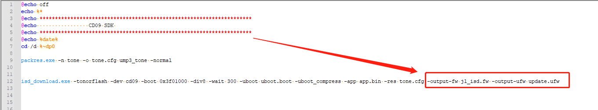
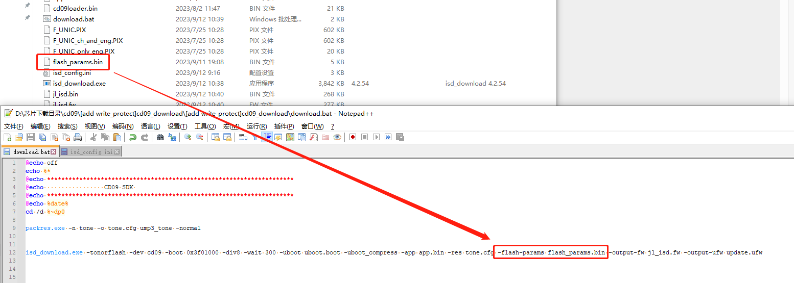
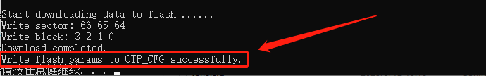

# 4. 工具链相关说明

## 4.1 常见问题以及处理方法

### 4.1.1 为什么printf无法输出浮点数

为了缩减代码体积。目前大部分SDK中，并没有支持`%f`格式化的输出。也就是并不会打印浮点数。为了处理这个问题，可有两个办法：

1. 打印浮点数的内存。例如，`float a; printf("%x\n", (uint32_t *)&a);`
2. 或者使用`put_float`函数单独打印浮点数。参考实现如下：

```c
#include <math.h>
#include <string.h>
#include <stdio.h>
#define PAD_RIGHT 1
#define PAD_ZERO 2
#define SIGN    4               // Unsigned/signed long
#define SPACE   8               // Space if plus
#define LEFT    16              // Left justified
#define SPECIAL 32              // 0x
#define LARGE   64              // Use 'ABCDEF' instead of 'abcdef'
#define PLUS    128               // Show plus
#define CVTBUFSIZE  128
static char *flt(char **str, double num, int size, int precision, char fmt, int flags);
static char *ecvtbuf(double arg, int ndigits, int *decpt, int *sign, char *buf);
static char *fcvtbuf(double arg, int ndigits, int *decpt, int *sign, char *buf);
void put_float(double fv)
{
    if (__builtin_isnan(fv)) {
        puts("nan");
    } else if (__builtin_isinf(fv)) {
        puts("inf");
    } else {
        flt((void *)0, fv, 10, 3, 'f', ' ' | SIGN);
    }
}
extern void putbyte(char a);
static void printchar(char **str, int c)
{
    if (str) {
        **str = c;
        ++(*str);
    } else {
        putbyte(c);
    }
}
static void cfltcvt(double value, char *buffer, char fmt, int precision)
{
    int decpt, sign, exp, pos;
    char *digits = (char *)0;
    char cvtbuf[CVTBUFSIZE + 1];
    int capexp = 0;
    int magnitude;
    if (fmt == 'G' || fmt == 'E') {
        capexp = 1;
        fmt += 'a' - 'A';
    }
    if (fmt == 'g') {
        digits = ecvtbuf(value, precision, & decpt, & sign, cvtbuf);
        magnitude = decpt - 1;
        if (magnitude < - 4  ||  magnitude > precision - 1) {
            fmt = 'e';
            precision -= 1;
        } else {
            fmt = 'f';
            precision -= decpt;
        }
    }
    if (fmt == 'e') {
        digits = ecvtbuf(value, precision + 1, & decpt, & sign, cvtbuf);
        if (sign) {
            * buffer ++ = '-';
        }
        * buffer ++ = * digits;
        if (precision > 0) {
            * buffer ++ = '.';
        }
        memcpy(buffer, digits + 1, precision);
        buffer += precision;
        * buffer ++ = capexp ? 'E' : 'e';
        if (decpt == 0) {
            if (value == 0.0) {
                exp = 0;
            } else {
                exp = - 1;
            }
        } else {
            exp = decpt - 1;
        }
        if (exp < 0) {
            * buffer ++ = '-';
            exp = - exp;
        } else {
            * buffer ++ = '+';
        }
        buffer[2] = (exp % 10) + '0';
        exp = exp / 10;
        buffer[1] = (exp % 10) + '0';
        exp = exp / 10;
        buffer[0] = (exp % 10) + '0';
        buffer += 3;
    } else if (fmt == 'f') {
        digits = fcvtbuf(value, precision, & decpt, & sign, cvtbuf);
        if (sign) {
            * buffer ++ = '-';
        }
        if (* digits) {
            if (decpt <= 0) {
                * buffer ++ = '0';
                * buffer ++ = '.';
                for (pos = 0; pos < - decpt; pos ++) {
                    * buffer ++ = '0';
                }
                while (* digits) {
                    * buffer ++ = * digits ++;
                }
            } else {
                pos = 0;
                while (* digits) {
                    if (pos ++ == decpt) {
                        * buffer ++ = '.';
                    }
                    * buffer ++ = * digits ++;
                }
            }
        } else {
            * buffer ++ = '0';
            if (precision > 0) {
                * buffer ++ = '.';
                for (pos = 0; pos < precision; pos ++) {
                    * buffer ++ = '0';
                }
            }
        }
    }
    * buffer = '\0';
}
static void forcdecpt(char *buffer)
{
    while (* buffer) {
        if (* buffer == '.') {
            return;
        }
        if (* buffer == 'e' || * buffer == 'E') {
            break;
        }
        buffer ++;
    }
    if (* buffer) {
        int n = strlen(buffer);
        while (n > 0) {
            buffer[n + 1] = buffer[n];
            n --;
        }
        * buffer = '.';
    } else {
        * buffer ++ = '.';
        * buffer = '\0';
    }
}
static void cropzeros(char *buffer)
{
    char *stop;
    while (* buffer && * buffer != '.') {
        buffer ++;
    }
    if (* buffer ++) {
        while (* buffer && * buffer != 'e' && * buffer != 'E') {
            buffer ++;
        }
        stop = buffer --;
        while (* buffer == '0') {
            buffer --;
        }
        if (* buffer == '.') {
            buffer --;
        }
        while ((*++ buffer = * stop ++));
    }
}
static char *flt(char **str, double num, int size, int precision, char fmt, int flags)
{
    char tmp[80];
    char c, sign;
    int n, i;
    if (flags & LEFT) {
        flags &= ~ PAD_ZERO;
    }
    // Determine padding and sign char
    c = (flags & PAD_ZERO) ? '0' : ' ';
    sign = 0;
    if (flags & SIGN) {
        if (num < 0.0) {
            sign = '-';
            num = - num;
            size --;
        } else if (flags & PLUS) {
            sign = '+';
            size --;
        } else if (flags & SPACE) {
            sign = ' ';
            size --;
        }
    }
    // Compute the precision value
    if (precision < 0) {
        precision = 6;    // Default precision: 6
    } else if (precision == 0 && fmt == 'g') {
        precision = 1;    // ANSI specified
    }
    // Convert floating point number to text
    cfltcvt(num, tmp, fmt, precision);
    // '#' and precision == 0 means force a decimal point
    if ((flags & SPECIAL) && precision == 0) {
        forcdecpt(tmp);
    }
    // 'g' format means crop zero unless '#' given
    if (fmt == 'g' && !(flags & SPECIAL)) {
        cropzeros(tmp);
    }
    n = strlen(tmp);
    // Output number with alignment and padding
    size -= n;
    if (!(flags & (PAD_ZERO | LEFT))) while (size -- > 0) {
            printchar(str, ' ');    //* str ++ = ' ';
        }
    if (sign) {
        printchar(str, sign);    //* str ++ = sign;
    }
    if (!(flags & LEFT)) while (size -- > 0) {
            printchar(str, c);    //* str ++ = c;
        }
    for (i = 0; i < n; i ++) {
        printchar(str, tmp[i]);    //* str ++ = tmp[i];
    }
    while (size -- > 0) {
        printchar(str, ' ');    //* str ++ = ' ';
    }
    return (char *)str;
}
static char *cvt(double arg, int ndigits, int *decpt, int *sign, char *buf, int eflag)
{
    int r2;
    double fi, fj;
    char *p, * p1;
    if (ndigits < 0) {
        ndigits = 0;
    }
    if (ndigits >= CVTBUFSIZE - 1) {
        ndigits = CVTBUFSIZE - 2;
    }
    r2 = 0;
    * sign = 0;
    p = & buf[0];
    if (arg < 0) {
        * sign = 1;
        arg = - arg;
    }
    arg = modf(arg, & fi);
    p1 = & buf[CVTBUFSIZE];
    if (fi != 0) {
        p1 = & buf[CVTBUFSIZE];
        while (fi != 0) {
            fj = modf(fi / 10, & fi);
            *-- p1 = (int)((fj + .03) * 10) + '0';
            r2 ++;
        }
        while (p1 < & buf[CVTBUFSIZE]) {
            * p ++ = * p1 ++;
        }
    } else if (arg > 0) {
        while ((fj = arg * 10) < 1) {
            arg = fj;
            r2 --;
        }
    }
    p1 = & buf[ndigits];
    if (eflag == 0) {
        p1 += r2;
    }
    * decpt = r2;
    if (p1 < & buf[0]) {
        buf[0] = '\0';
        return buf;
    }
    while (p <= p1 && p < & buf[CVTBUFSIZE]) {
        arg *= 10;
        arg = modf(arg, & fj);
        * p ++ = (int) fj + '0';
    }
    if (p1 >= & buf[CVTBUFSIZE]) {
        buf[CVTBUFSIZE - 1] = '\0';
        return buf;
    }
    p = p1;
    * p1 += 5;
    while (* p1 > '9') {
        * p1 = '0';
        if (p1 > buf) {
            ++*-- p1;
        } else {
            * p1 = '1';
            (* decpt)++;
            if (eflag == 0) {
                if (p > buf) {
                    * p = '0';
                }
                p ++;
            }
        }
    }
    * p = '\0';
    return buf;
}
static char *ecvtbuf(double arg, int ndigits, int *decpt, int *sign, char *buf)
{
    return cvt(arg, ndigits, decpt, sign, buf, 1);
}
static char *fcvtbuf(double arg, int ndigits, int *decpt, int *sign, char *buf)
{
    return cvt(arg, ndigits, decpt, sign, buf, 0);
}
```

### 4.1.2. 为什么找不到 vsprintf, sprintf, vprintf

这几个函数目前未放置到 libc.a 中，可以用下面的实现：

```c
#include <stdarg.h>

int sprintf(char *out, const char *format, ...)
{
	va_list args;
	va_start(args, format);

	return print(&out, 0, format, args);
}

int vprintf(const char *fmt, va_list va)
{
	return print(0, 0, fmt, va);
}

int vsprintf(char *out, const char *format, va_list va)
{
	return print(&out, 0, format, va);
}

int snprintf(char *out, size_t sz, const char *format, ...)
{
	va_list args;
	va_start(args, format);

	if (sz == 0) {
		return 0;
	}
	
	int ret = print(&out, out + sz - 1, format, args);
	
	return ret;
}
```

### 4.1.3. 关于调用了未声明函数的警告

当我们在代码中，调用了未声明的函数的时候，会出现 `warning: implicit declaration of function` 的警告。这个警告的含义是，你调用了一个函数。但是未提前声明这个函数。



这个在一些情况下，是会影响程序的行为。

按照 C 语言的标准规定，当一个函数未声明的时候，会假定这个函数的原型是下面的样子：

```c
/* 当 foo 未被声明的时候，会假定 foo 的原型如下 */
extern int foo(...);
```

#### 4.1.3.1. 如何转换为报错

一般来说，我们都是需要先声明函数原型之后，再去调用。以避免一些未预料的错误。

为了让编译器将这个警告转换为错误，可以在编译参数中添加：`-Werror=implicit-function-declaration`。

### 4.1.4. 浮点数相关FAQ

#### 4.1.4.1. C代码中能否正常使用浮点数

C代码中总是可以使用浮点数运算的。数学库`libm`也是支持的（`tan`,`sin`等函数所在的库）。区别在于：

1. 有一些芯片没有**硬件浮点**（也就是指，单条硬件指令实现的浮点运算），这种情况下，编译器会生成软件实现的浮点运算（即libcompiler_rt.a库中的`__adddf3`之类的函数）。
2. 有一些芯片支持**单精度硬件浮点**（也就是指，对于单精度`float`相关的运算，有单条指令硬件指令实现的浮点运算），这种情下，对于单精度运算，编译器会生成相关的指令。但是双精度浮点运算，仍然会使用软件实现的方式（例如，双精度浮点加法`__adddf3`）。
3. 硬件浮点和软件浮点的差异主要在于运算速度和生成的代码大小。结果是一致的。软件实现的运算速度更慢、代码更大。

#### 4.1.4.2. 哪些芯片支持单精度硬件浮点

目前只有部分 pi32v2 架构的芯片支持单精度硬件浮点。其中，r3,r4版本的指令集的芯片是支持的。也就是编译的时候，指定了`-mcpu=r3`,`-mcpu=r4`参数的芯片。

#### 4.1.4.3. 为什么我的代码没有生成单精度硬件浮点指令

这个一般有多种情况

1. 当前编译选项未指定`-mcpu=r3`参数。
2. 如果是库，需要检查库编译时候，是否添加了`-mcpu=r3`参数。（**注意，库和SDK可能会被程序员错误地设置成了不同的-mcpu参数）
3. 代码本身并没有使用单精度浮点指令。
   1. 注意，浮点常数默认是`double`。在常数末尾加上f后，才是单精度。例如，`1.0`是一个`double`，`1.0f`是一个`float`。后者才是单精度浮点数
   2. 当单精度和双精度混合运算的时候，会先把单精度提升为双精度再进行双精度运算。

#### 4.1.4.4. 为什么我的代码中有双精度运算

一般情况下，我们会在仅支持硬件单精度浮点运算的芯片上，尽量避免使用双精度。但是有些情况下仍然会出现了双精度的运算，例如，发现调用了`__adddf3`之类的双精度软件实现函数。这主要有下面几点原因：

1. 浮点常数默认是`double`。在常数末尾加上f后，才是单精度。例如，`1.0`是一个`double`，`1.0f`是一个`float`。后者才是单精度浮点数。
2. 当单精度和双精度混合运算的时候，会先把单精度提升为双精度再进行双精度运算。
3. 当给带有可变长参数（即，`...`）的函数传参时，会提升为双精度。例如，对`int` `printf(const char *fmt, ...)`;这样的函数，执行`float a = 1.0f; printf("%f\n", a);`的时候，`a`会被提升为`double`后再传递。 注意，如果函数未声明，默认参数列表是可边长的，参考：[关于调用了未声明函数的警告](https://doc.zh-jieli.com/Tools/zh-cn/dev_tools/toolchains/faqs/faq_warn_implicit_fun.html)

#### 4.1.4.5. 为什么出现了浮点异常

芯片的浮点异常是可以打开或者关闭的。默认情况下，编译器会假设芯片没有开启浮点异常。也就是说，当出现浮点运算有问题的时候，只会产生NaN。例如，除零的时候，结果是NaN，但是不发生异常。

但是有时候为了调试，可能会打开浮点异常。这个时候，除零之类的错误将会导致异常中断。为了配合这种情况，编译参数需要对应加上`-mllvm -floating-point-may-trap`，链接参数需要对应加上`--plugin-opt=-floating-point-may-trap`。这两个参数的作用是告诉编译器浮点数运算可能会导致异常，有一些优化不能做。

#### 4.1.4.6. 为什么浮点函数好像不正常

- 确认是否出现调用了未声明的问题。

### 4.1.5. 如何合并`.a`文件

`.a`即静态库文件。`.a`文件是一种归档格式，里面是若干个`.o`文件。

`.a`文件通常用`ar`程序生成。

> **Note**
>
> 注意，`ar`是一种简称，不同的芯片可能具体的程序名字有所不同，通常会带有一些前缀。 特定于杰理的工具链中的`ar`，位于`C:\JL\pi32\bin\llvm-ar.exe`。

使用`ar`程序，可以生成或者解开.a文件。如果想要合并两个或者更多`.a`文件，则一般是先每个`.a`文件解开成`.o`文件后，重新用`ar`程序，打包成一个新的`.a`。

可以使用我们提供的[合并脚本（点击此处下载）](https://pkgman.jieliapp.com/s/merge-archives)。

#### 4.1.5.1. 使用方式

1. 安装 [python3（点击此处下载）](https://pkgman.jieliapp.com/s/py3) 环境，注意要将 python 添加到 PATH 中：


2. 解压下载的合并脚本，如下图所示：



3. 界面如下图所示，点击按钮选择文件即可：



> **Note**
>
> 如果希望用命令行来合并，可以使用下面的命令：
>
> `python3 merge_archive.py input1.a input2.a input3.a --output new.a` 这个命令，将 `input1.a`, `input2.a`, `input3.a` 合并生成 `new.a`

## 4.2. isd_config.ini 配置文件说明

### 4.2.1. 各个配置段说明

| 段名                       | 说明                                                         |
| -------------------------- | ------------------------------------------------------------ |
| `[EXTRA_CFG_PARAM]`        | 用于配置生成flash.bin前所需要的信息。                        |
| `[SYS_CFG_PARAM]`          | 用于配置系统所需要的参数，该配置的所有选项都会进过转后然后存入flash.bin中。 |
| `[TOOL_CONFIG]`            | 用于配置相关工具信息。                                       |
| `[CHIP_VERSION]`           | 用于配置芯片版本相关信息。                                   |
| `[RESERVED_CONFIG]`        | 用于配置预留区域信息的区域，如果`[EXTRA_CFG_PARAM]`区域有设置RESERVED_OPT配置项，则当前区域最多只能配置6个。 |
| `[RESERVED_EXPAND_CONFIG]` | 用于配置预留区域信息的区域，与`[RESERVED_CONFIG]`，该区域是为了预防`[RESERVED_CONFIG]`区域不够而添加的。 |

### 4.2.2. 选项

**默认值指的是，当选项不出现的时候的值。**

**有效值指的是，对应配置值接收指定的值。**

#### 4.2.2.1. `[EXTRA_CFG_PARAM]`段选项说明

| 选项               | 类型   | 默认值 | 有效值     | 说明                                                         |
| ------------------ | ------ | ------ | ---------- | ------------------------------------------------------------ |
| NEED_RESERVED_4K   | 布尔   | YES    | YES/NO     | 预留部分空间用于保存SDK需要的配置，默认不修改，如需修改请联系杰理工程师 |
| NEED_RESERVED_AREA | 布尔   | YES    | YES/NO     | 预留区域是否一定要配置BTIF区域的限制 没有蓝牙配置的芯片型号的会配置为NO，例如AD14N, AD15N |
| NEW_FLASH_FS       | 布尔   |        | YES/NO     | 是否使用新的文件系统（BR22)，该配置与双备份配置互斥          |
| BR22_TWS_DB        | 布尔   |        | YES/NO     | 是否使用BR22双备份flash结构，该配置与单备份配置互斥（需要配合FLASH_SIZE、BR22_TWS_VERSION一起使用） |
| BR22_TWS_VERSION   | 立即数 |        |            | 双备份的版本号（一般配合BR22_TWS_DB一起使用）                |
| FLASH_SIZE         | 立即数 |        |            | 指定当前FLASH的大小（一般配合BR22_TWS_DB一起使用）           |
| CHECK_OTA_BIN      | 布尔   |        | YES/NO     | 可以指定 YES 或者 NO；如果不指定，则默认会在单备份(BR22_TWS_DB 表示双备份)情况下检查 ota.bin 并计算大小。如果是 NO 则不检查 ota.bin |
| CHIP_NAME          | 字符串 |        |            | 芯片名称                                                     |
| ENTRY              | 立即数 |        |            | SDK的入口地址                                                |
| RESERVED_OPT       | 立即数 |        | 0          | 预留区域是否需要提前预留                                     |
| PID                | 字符串 |        |            | 芯片的pid(少于等于16个byte的字符串)                          |
| VID                | 字符串 |        |            | 芯片的vid(少于等于4个byte的字符串)                           |
| DOWNLOAD_MODEL     | 字符串 |        | USB/SERIAL | 下载模式，可选择USB下载或者串口下载（默认使用USB下载）       |
| COMPACT_SETTING    | 布尔   | NO     | YES/NO     | 是否允许文件起始位置不按4K对齐                               |
| EXPAND_BIN         | 布尔   | NO     | YES/NO     | 是否生成jl_isd_expand.bin。将jl_isd.bin扩展到方案实际占用flash的大小(jl_isd.bin后面追加0xFF)。 |
| SDK_VERSION        | 字符串 |        |            | 当前SDK的版本信息，此参数由编译脚本自动配置                  |
| SPECIAL_OPT        | 立即数 |        | 0          | FLASH格式，默认不修改，如需修改请联系杰理工程师              |
| FORCE_4K_ALIGN     | 布尔   |        | YES/NO     | 默认的FLASH BIN格式，默认不修改，如需修改请联系杰理工程师    |
| UFW_ELEMENT        | 格式   |        |            | UFW文件中FLASH BIN的格式和顺序，默认不修改，如需修改请联系杰理工程师 |
| AREA_ALIGN         | 立即数 |        | 1/0x10     | 离线生成FLASH BIN的对齐方式，默认不修改，如需修改请联系杰理工程师 |

#### 4.2.2.2. `[SYS_CFG_PARAM]`段选项说明

该区域的配置是自定一配置，对应配置会转化后存入flash.bin中供固件使用。

目前已有配置：

| 配置                  | 说明                                                         |
| --------------------- | ------------------------------------------------------------ |
| SPI=2_3_0_0           | 配置spi参数，等号右边的参数含义是 `datawidth_clk_mode_port`  |
| OSC=btosc             | 使用的参数，指定系统始终源,一般注释掉                        |
| OSC_FREQ=12MHz        | 使用的参数，指定FREQ频率，可填写12MHz或24MHz，一般注释掉     |
| SYS_CLK=24MHz         | 使用的参数，指定CLK频率，可填写24MHz或48MHz，一般注释掉      |
| UTTX=PA05             | 串口tx                                                       |
| UTBD=1000000          | 串口波特率                                                   |
| UTRX=PB01             | 串口升级，可填写PB00、PB05、PA05，一般注释掉                 |
| RESET=PB01_08_0       | 指定重启按键引脚和重启参数，等号右边的含义是 port口_长按时间_有效电平（长按时间有00、01、02、04、08、16六个值可选，单位为秒，当长按时间为00时，则关闭长按复位功能。） |
| EX_FLASH=PB07_2A_PB11 | 用于isd_download.exe工具烧写外部flash时指定外部升级参数， CS引脚为PB07 使用SPI1的C端 如果norflash电源为vddio，填NULL即可，否则填写对应的引脚号， 需要配合packres.exe工具使用 |
| EOFFSET=0             | 请勿随便修改，如需要修改请联系杰理工程师，注意：此功能需要UBOOT支持 |
| AUTH_CODE=0           | 默认关闭， 如需开启请联系杰理工程师，根据SDK实际情况填写该值 |
| POWERON_TIMES=0       | 芯片在烧写完毕后第一次上电时间，单位：ms，最长可配置60S，默认不填写，仅AC695X、AC635N、AC6083型号在2.27.2及以上版本支持， 如需开启请联系杰理工程师 |

#### 4.2.2.3. `[TOOL_CONFIG]`段选项说明

| 配置                  | 说明                                                         |
| --------------------- | ------------------------------------------------------------ |
| 1TO2_MIN_VER=2.24.0   | 允许加载当前配置生成的FW/UFW文件的一拖二烧写器最低版本是2.24.0，不能修改，如需修改请联系杰理工程师，根据SDK实际情况填写该值 |
| 1TO8_MIN_VER=3.0.34   | 允许加载当前配置生成的FW/UFW文件的一拖八烧写器最低版本是3.0.34，不能修改，如需修改请联系杰理工程师，根据SDK实际情况填写该值 |
| BTBOX_MIN_VER=1.2.4.f | 允许加载当前配置生成的UFW文件的蓝牙测试盒最低版本是1.2.4.f，不能修改，如需修改请联系杰理工程师，根据SDK实际情况填写该值 |

#### 4.2.2.4. `[CHIP_VERSION]`段选项说明

| 配置                 | 说明                                                         |
| -------------------- | ------------------------------------------------------------ |
| SUPPORTED_LIST=A,B,C | 允许当前配置生成的FW/UFW烧写到A、B、C版芯片中，不能修改，如需修改请联系杰理工程师 根据SDK实际情况填写该值 |

#### 4.2.2.5. `[RESERVED_CONFIG]`段选项说明

该区域用于配置预留区域，可单独存在，其中VM和PRCT这两个区域是特殊区域，VM是用于表示VM相关的信息，PRCT是用于表示保护区域的信息。

如果`[EXTRA_CFG_PARAM]`区域中有**`RESERVED_OPT`**的配置，那么当前区域不能配置超过6项。

VM、PROC和BIIF这三个配置必须在预留配置区域（`[RESERVED_CONFIG]`或`[RESERVED_EXPAND_CONFIG]`其中一个区域）中有对应的配置，不然会报错。

每个配置项目都遵循下面的固定格式：

| 配置            | 配置说明                                                 | 值说明                                                       |
| --------------- | -------------------------------------------------------- | ------------------------------------------------------------ |
| XXXX_ADR        | 区域起始地址，XXXX为预留区域名字                         | AUTO：由工具自动分配起始地址(PROC与VM配置不支持) 如果填写立即数即代表绝对地址 VM配置如果填写0则代表自动分配 |
| XXXX_LEN        | 区域长度，XXXX为预留区域名字                             | CODE_LEN：代码长度(只针对PROC配置) 如果填写立即数即代表指定长度 |
| XXXX_OPT        | 区域操作属性，XXXX为预留区域名字                         | 0: 下载代码时擦除指定区域 1: 下载代码时不操作指定区域 2: 下载代码时给指定区域加上保护 |
| XXXX_FILE(可选) | 下代码时指定的文件会下载到对应的区域，XXXX为预留区域名字 | 1、指定的文件名(该文件必须要与isd_download.exe同在一个目录) 2、如果需要找到该区域，则需要根据XXXX(该预留区域名字)来的定位到对应的预留区域头，根据头中的地址信息获取到数据对应的位置 |

#### 4.2.2.6. [RESERVED_EXPAND_CONFIG] 段选项说明（可选）

该区域就是`[RESERVED_CONFIG]`区域的扩展，也是用于配置预留配置信息，格式也遵循`[RESERVED_CONFIG]`中配置项的规则。

该区域没有个数限制，如果只配置了`[RESERVED_EXPAND_CONFIG]`区域没有配置[RESERVED_CONFIG]区域，那么`[EXTRA_CFG_PARAM]`区域中的**RESERVED_OPT**的配置则无效。

该区域可以与`[RESERVED_CONFIG]`区域同时存在，这种情况下`[EXTRA_CFG_PARAM]`区域中的**`RESERVED_OPT`**的配置还是会生效。

## 4.3. OTP_CFG(VOTP)区域配置说明

如SDK需要增加OTP_CFG配置，请按照以下说明更新SDK。

### 4.3.1. 支持OTP_CFG的工具的最低版本

SDK需要支持支持OTP_CFG配置，相关工具需要更新到以下版本(或之后版本)。

| 工具             | 最低版本 | 说明                                                         |
| ---------------- | -------- | ------------------------------------------------------------ |
| isd_download.exe | 4.2.54   | [如何更新,请点击此处查看](https://doc.zh-jieli.com/Tools/zh-cn/other_info/index.html) |
| 一拖二烧录器     | 2.27.7   | [如何更新,请点击此处查看](https://doc.zh-jieli.com/Tools/zh-cn/mass_prod_tools/burner_1tuo2/remote_update.html) |
| 一拖八烧录器     | 3.1.22   | [如何更新,请点击此处查看](https://doc.zh-jieli.com/Tools/zh-cn/mass_prod_tools/burner_1tuo8/remote_update.html) |

### 4.3.2. SDK修改点

#### 4.3.2.1. isd_config.ini文件

在isd_config.ini的`EXTRA_CFG_PARAM`配置段中增加`OTP_CFG_SIZE`配置

> **Note**
>
> [EXTRA_CFG_PARAM]
> OTP_CFG_SIZE=512

如下图：



如需同时启用FLASH写保护功能，需要在isd_config.ini中增加以下配置

> **Note**
>
> [BURNER_PASSTHROUGH_CFG]
> FLASH_WRITE_PROTECT=YES

如下图:



启用FLASH写保护功能，使用支持写保护功能的烧录器烧录时，会将芯片FLASH对应的写保护参数烧录到OTP_CFG区域中

#### 4.3.2.2. download.bat文件

> **Important**
>
> 启用OTP_CFG(VOTP)后，jl_isd.bin文件格式将升级为新格式。
> fw_add.exe/ufw_maker.exe是无法识别的。
> 如果download.bat是通过fw_add.exe/ufw_maker.exe生成最终的FW/UFW文件，
> 那么需要删除download.bat中的fw_add.exe/ufw_maker.exe相关语句。

删除fw_add.exe/ufw_maker.exe相关语句后，
在isd_download.exe后增加`-output-fw`和`-output-ufw`参数，生成最终的FW/UFW文件。

如下图:



#### 4.3.2.3. 开发调试阶段启用FLASH写保护功能

如果需要在开发调试阶段启动FLASH写保护功能，
可以通过isd_download.exe参数`-flash-params`指定FLASH写保护参数配置文件。

如下图:



FLASH写保护参数配置数据，从以下链接可以获取：
[20251215_flash_params.bin (点击此处下载_2025_12_15)](https://jl-update.oss-cn-shenzhen.aliyuncs.com/20251215_flash_params.bin)
[20251215_flash_params_v3.bin(点击此处下载_2025_12_15)](https://jl-update.oss-cn-shenzhen.aliyuncs.com/20251215_flash_params_v3.bin)
设置FLASH写保护参数配置文件，连接样机后，
执行download.bat批处理后，如开发板/样机中的FLASH支持写保护功能，
则会将开发板/样机中FLASH对应的写保护参数下载到OTP_CFG区域，并且有相关打印信息输出，如下图：


