# 6. 杰理科技强制升级工具4.0使用说明

前言

诚挚的感谢您使用杰理科技强制升级工具4.0！

正式使用之前，敬请仔细阅读本手册，确保您的正确和安全使用。阅后请妥善保管本手册，以方便他人进一步查阅使用。

您在使用过程中，如遇到任何解决不了的问题，请随时与本公司的工程师联系，我们将会及时向您提供最有效的服务。

## 6.1. 升级与下载说明

### 6.1.1. 升级操作

大部分情况下，当需要下载程序到开发板、样机的时候，都是使用**常规升级**的方式。少部分的芯片使用**串口升级**的情况（如AD15）。

#### 6.1.1.1. 常规升级

**1、强制升级工具拨码**

从下面表格的拨码形式来进入升级模式

| **拨码开关低四位** | **灯状态**         | **按键**                         | **说明**                                                     |
| ------------------ | ------------------ | -------------------------------- | ------------------------------------------------------------ |
| 不拨               | 红灯常亮，绿灯闪烁 | 需要按按键                       | 因为按按键实际上是停止一次电源输出250ms以上，来让芯片复位，发一次握手信号。 |
| 拨1挡              | 红灯常亮，绿灯常亮 | 不需要按按键                     | 因为工具会定期停止电源输出，让芯片复位，定期发握手信号。     |
| 拨2挡              | 红灯常亮，绿灯闪烁 | 需要按按键                       | 因为按按键实际上是停止一次电源输出250ms以上，来让芯片复位，发一次握手信号。 |
| 拨3挡              | 红灯常亮，绿灯常亮 | 不需要按按键，要快插或者芯片唤醒 | 工具一直在发握手信号，快插的目的是让芯片上电复位，而芯片唤醒也是复位的一种形式，也可以握手成功。 |

> **Note** 每次只能拨其中一位，并且需要**重新**将强制升级工具连接电脑

**2、芯片与强制升级工具连接**
强制升级工具的USB母头与电脑连接，USB公头连接样机或开发板。（**注意不要接反**，参考下图）

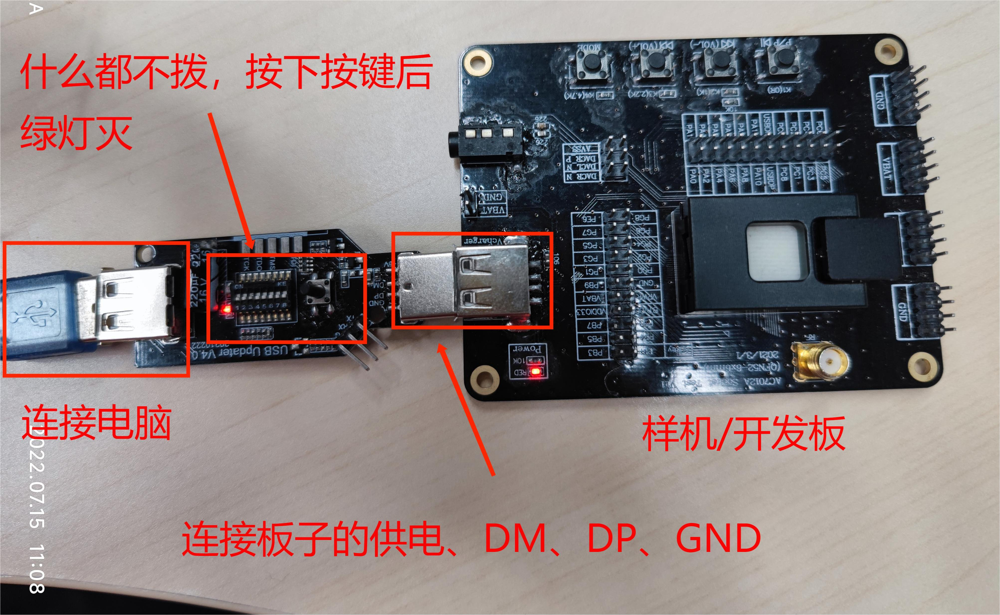

**3、进行下载升级**
第二步后，选择不拨或者拨2档需要按按键至**绿灯灭**，**红灯常亮**；拨1档或拨3档的至**绿灯灭**，**红灯常亮**就可以进入下载升级；（灯状态参考《[灯的状态说明](https://doc.zh-jieli.com/Tools/zh-cn/dev_tools/forced_upgrade/led_status.html)》
打开SDK里的下载目录运行`download.bat`即可升级下载。

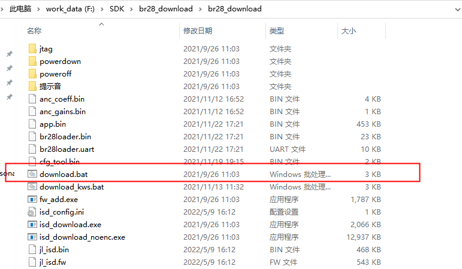

**芯片进入强制升级模式的原理：**
首要条件，是让芯片复位，即芯片要从头跑启动代码开始。
其次，于芯片复位之际，工具给芯片发送握手信号，即usbkey，ispkey，uartkey等等。
最后，芯片握手成功后，就进入了强制升级模式，此时电脑的设备管理器会出现芯片型号的盘符。
例如，这里显示的是蓝牙系列的一款芯片BR28(蓝牙类一般是BR开头的，视频类一般是DV，通用一般是SH)：

通过拨动强制升级工具工具中的低四位来选择工具发送什么握手信号给芯片
通过《[工具拨码开关说明](https://doc.zh-jieli.com/Tools/zh-cn/dev_tools/forced_upgrade/toggle_switch.html)》来查看低四位开关

#### 6.1.1.2. 串口升级

**强制升级工具4.0是支持芯片通过串口升级的**

现以AC697x为例操作如下：

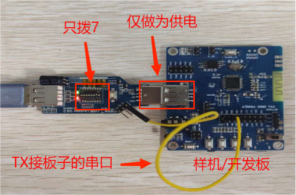

（1）工具要拨拨码开关第7挡，并且要与虚拟串口绑定。(参考《[虚拟串口](https://doc.zh-jieli.com/Tools/zh-cn/dev_tools/forced_upgrade/virtual_serial.html)》)。

（2）工具的TX脚与芯片的串口升级引脚相连接，AC697x芯片之后的芯片的串口升级脚都是LDOIN脚，AC697x芯片之前的芯片的串口升级脚都是PB05脚，芯片由工具供电，并且共地。

> **Note** 注意，第（3）步一般情况下，SDK已经设置好。无需在自行修改设置ini文件。

（3）打开下载目录，编辑目录里的`isd_config.ini`文件，修改名为`DOWNLOAD_MODEL`的配置项，修改为`SERIAL`（**一般情况下SDK已经默认设置了，无需修改）**，并保存修改。

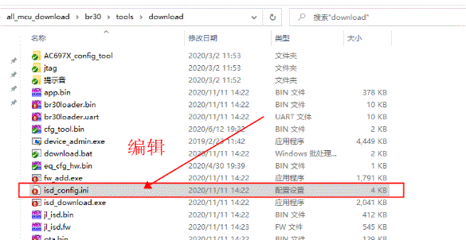

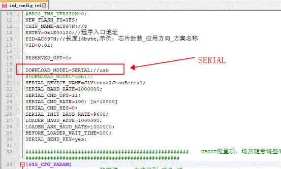

（4）双击下载目录的`download.bat`文件，即可进行串口升级。

## 6.2. 灯的状态说明

在拨码开关默认不拨的状态下：

| **状态**         | **红灯** | **绿灯** |
| ---------------- | -------- | -------- |
| **上电**         | 闪一下   | 闪一下   |
| **常态**         | 常亮     | 闪烁     |
| **按键按下**     | 常亮     | 常亮     |
| **升级模式**     | 常亮     | 灭       |
| **JTAG连接失败** | 闪烁     | 闪烁     |

## 6.3. 工具拨码开关说明

### 6.3.1. 拨码开关低四位（每时每刻只能拨一个位）

| **拨码开关低四位** | **KEY** | **说明**                                   |
| ------------------ | ------- | ------------------------------------------ |
| **不拨**           | usbkey  | 几乎可升级所有芯片                         |
| **第1位**          | usbkey  | 循环断电的，间歇发usbkey的自动升级         |
| **第2位**          | ispkey  | 升级需要test的芯片，如ac608n的无晶振升级等 |
| **第3位**          | usbkey  | 不断电的，一直发usbkey的自动升级           |
| **第4位**          | 预留    |                                            |

### 6.3.2. 拨码开关高四位（可多个位同时拨）

1. 工具是否需要与PC端通讯，由拨码开关第7位决定
   - 不拨：工具无法与PC通讯，则以下几点的操作均无效。包括串口也不能使用。
   - 第7位：工具初始化有USB功能，可做串口工具，可接收PC端命令。
2. 工具输出端的DP、DM的默认状态，由拨码开关第5位决定
   - 不拨：工具输出端的DP、DM默认高阻。
   - 第5位：工具输出端的DP、DM默认用于串口功能。
3. 工具接收到PC端发来的设置波特率的命令

| **波特率** | **串口** | **说明**                                                     |
| ---------- | -------- | ------------------------------------------------------------ |
| 1或111     | 双工模式 | 默认为双工模式                                               |
| 2或112     | 单线模式 | TX收发一体                                                   |
| 3或113     | 单线模式 | TX收发一体。并且当设置的波特率小于等于9600时，TX发送uartkey。（目前用于支持单线串口升级的芯片） |

4.工具接收到PC端发来的jtag操作命令 工具输出端的DP、DM用于jtag通讯功能。

5.工具接收到PC端发来的升级操作命令 等价于按下升级按键，进入升级流程。

6.工具接收到PC端发来的flash操作命令 工具输出端的DP、DM用于flash操作功能。（flash操作结束后，自动恢复到默认状态）

工具上的RX引脚接flash的CS引脚。

工具输出端的DP接flash的CLK引脚。

工具输出端的DM引脚同时接flash的DO和DO引脚。

`RX --> CS`

`DP --> CS`

`DM --> DO`

`DM --> DO`

工具上已经将这几个引脚引出JTAG的10针接口：

`TCK --> DP`

`TDO --> DM`

`TDI --> DM`

`TMS --> RX`

> **Note**
>
> 还要记得给flash供电3.3V，共地。
>
> 如果要对SH50的片上flash进行操作，那么就要拨拨码开关的第6位，工具的枚举为SH50 Burn v1.0.0.

7. 工具的自身需求 第8位：进入升级模式后，不会自动退出升级模式。

## 6.4. 工具自身固件如何更新

### 6.4.1. 安装杰理包管理器

> **Note** 如果已经电脑已经安装过了，这一步就直接跳过。

点击这里 [下载包管理器](https://pkgman.jieliapp.com/s/pkgman) ，下载完毕后双击运行，按照步骤安装即可

### 6.4.2. 远程固件升级操作

双击盘符里的`remote_upgrade_tool.jlxproj`文件

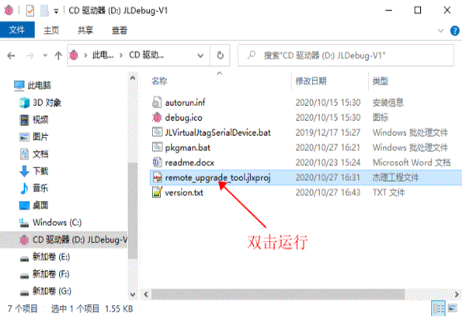

先弹出一个小窗口，点击“检测更新”，确保是最新版本，如果不是最新版本，则按照更新提示，一步一步更新就行。然后点击“打开远程升级工具”

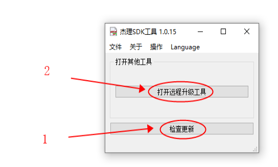

此时弹出远程固件更新窗口，按照图中步骤，完成对强制升级工具自身固件的刷新：

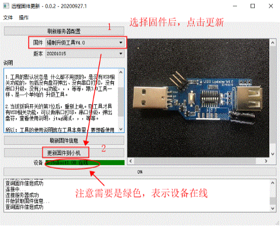

#### 6.4.2.1. 进入升级模式的方法

1. 手头上至少要有两个强制升级工具，用另一个工具给当前工具升级：

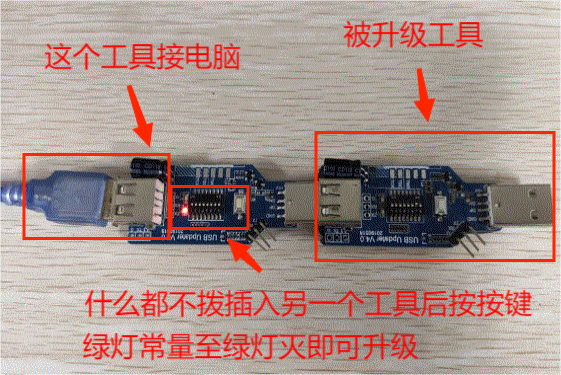

2. 或按住工具上的按键不放，再插入PC_USB线，待弹出盘符，即工具进入了升级模式。

## 6.5. 虚拟串口

一些芯片需要用到串口下载方式。这个时候需要使用虚拟串口的功能。

> **Note** 需要将拨码开关第7位打开，然后断电，重新连接强制下载工具和电脑，才能打开此功能

### 6.5.1. 设置虚拟串口

#### 6.5.1.1. 下载虚拟串口驱动及安装

下载[强制升级工具4.0串口驱动（点击此处下载）](https://pkgman.jieliapp.com/s/serdrv) ，下载完毕后双击运行，按照步骤安装即可

> **Note** 安装驱动后，需要重启电脑

#### 6.5.1.2. 新建虚拟串口

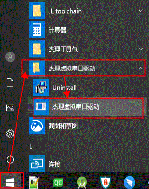

点击“添加新的虚拟串口”

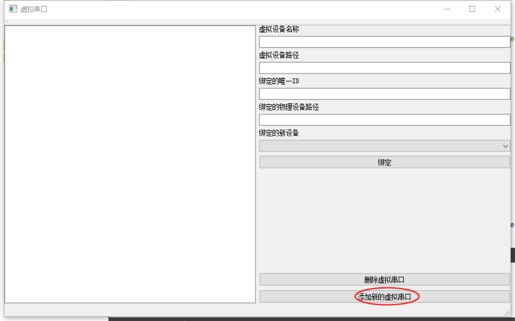

#### 6.5.1.3. 绑定物理设备

新建成功后，左侧会多出一个虚拟串口。点击后，右侧会显示其信息。其中，新建的虚拟串口没有任何绑定的物理串口，其“绑定的唯一ID”是“NOT SET”。插入物理设备后，右侧的“绑定的新设备”下拉框处会有显示对应在线的物理设备。

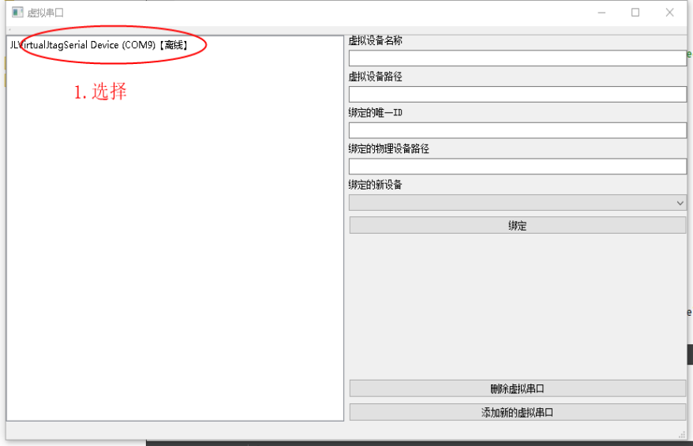

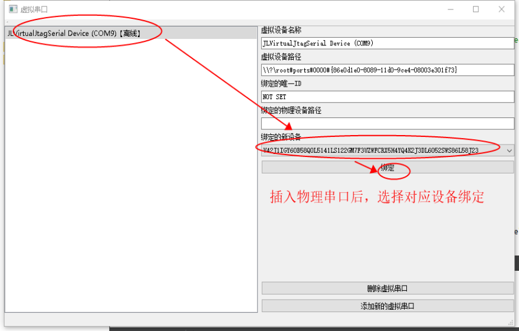

#### 6.5.1.4. 显示绑定信息

选择想要绑定的物理设备的ID后，点击绑定。绑定成功后，再次选择虚拟串口，这时候绑定的ID则显示了对应的设备ID了。

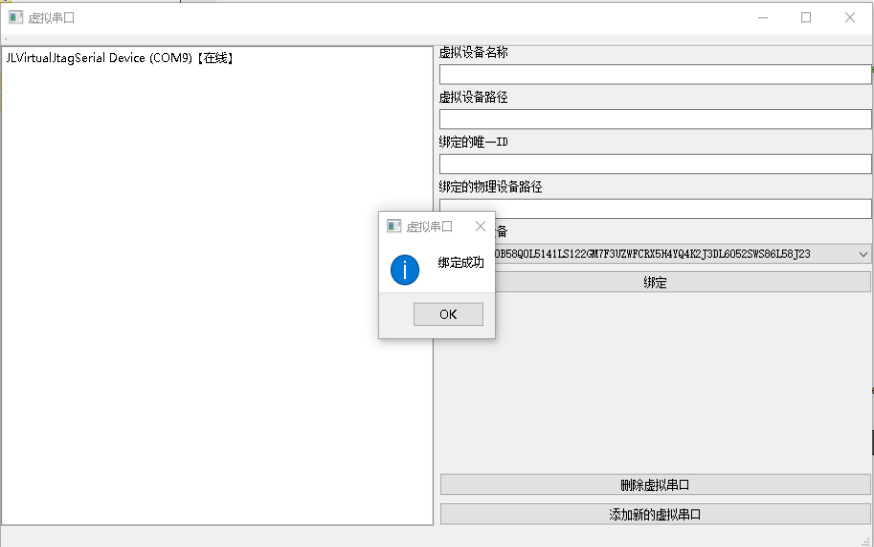

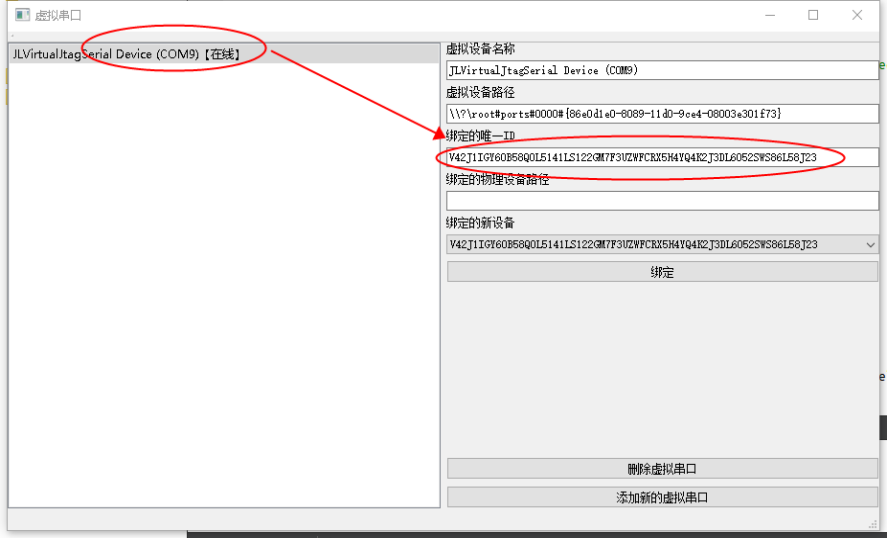

### 6.5.2. 串口通讯

在正确绑定，并接入对应的强制下载工具后。可以用串口工具打开对应的虚拟串口。

> **Note** 一些串口工具可能会与我们的虚拟串口工具有兼容性问题。经过测试，SSCOM 是可以的。

### 6.5.3. 串口下载功能

参考：[串口升级](https://doc.zh-jieli.com/Tools/zh-cn/dev_tools/forced_upgrade/upgrade_and_download.html#target-forceupgrade-serial-update)
