# 7. 其他常见问题以及处理方法

## 7.1. 如何将 Code::Blocks 工程转换为 make/VSCode 工程

>  **Note**
>
> 默认情况下，新的 SDK 已经同时支持 make 以及 VSCode 进行开发编译。
>
> 如果 SDK 工程根目录下，存在`.vscode`文件夹。则说明当前 SDK 版本已经支持 make 以及 VSCode 进行开发编译。 这种情况下，**无需做额外的操作即可使用**。

对于还未支持的旧的 SDK 版本，可以通过下面的方式来实现：

1. 下载并安装 [python3（点击此处下载）](https://pkgman.jieliapp.com/s/py3) 。如果已经安装 python3 则跳过当前步骤，注意需要勾选 将 python 添加到 PATH 环境变量中：

2. 下载[转换工具（点击此处下载）](https://pkgman.jieliapp.com/s/cbp2make)并解压到 SDK 根目录，如下图所示

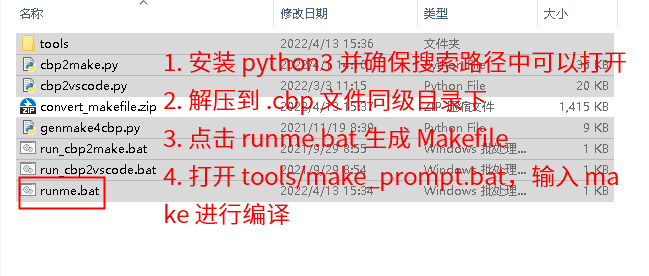

3. 双击`runme.bat`进行转换。完成后将会生成 `.vscode` 文件夹以及 `Makefile` 文件。

4. 参考 [使用 make 进行编译](https://doc.zh-jieli.com/Tools/zh-cn/dev_tools/build_download/build_with_makefile.html) 和 [使用 VSCode 进行编译](https://doc.zh-jieli.com/Tools/zh-cn/dev_tools/build_download/build_with_vscode.html) 进行编译。

## 7.2. 在已经有了标准 SDK 工程的情况下，如何获得编译库的工程

一般情况下，SDK 只有生成最终可执行程序的 Code::Blocks 工程，但是没有对应编译库的工程（即，生成静态库 .a 的工程）。

这个时候，可以通过下面的工具来进行转换获得。这个工具会复制 SDK 中工程的配置（包括编译参数等），然后生成一个静态库的工程。

下面是具体的转换步骤：

1. 下载并安装 [python3（点击此处下载）](https://pkgman.jieliapp.com/s/py3) 。如果已经安装 python3 则跳过当前步骤，注意需要勾选 将 python 添加到 PATH 环境变量中：

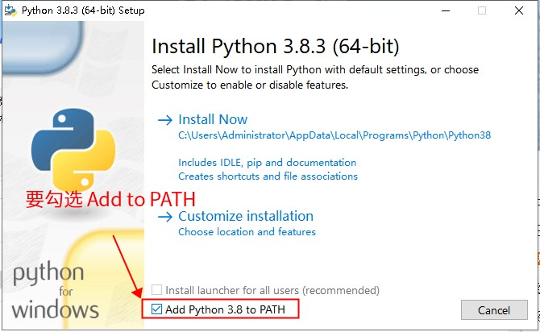

2. 下载[转换工具（点击此处下载）](https://pkgman.jieliapp.com/s/execbp2libcbp)并解压到一个新的空白目录中，如下图所示：

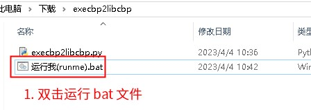

3. 双击 `运行我(runme).bat` 批处理进行转换。工具界面如下图所示，选择需要的选项后，点击下方按钮选择 SDK 的 cbp 工程文件，生成编译库的 cbp 工程文件。

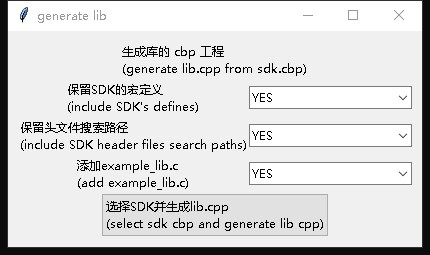

> **Note**
>
> 如果选项【保留头文件搜索路径】，则需要把库的 cbp 工程和 SDK 的 cbp 工程放到相同的一个目录下，以避免搜索路径不一致。
>
> 不同的 SDK 编译的参数可能会有所不同。如果需要给不同的 SDK 都编译库，需要对应生成不同的库工程。

### 7.2.1. 如何修改库工程的名称

1. 打开 `lib.cbp`，并如下图右键工程

2. 在 `Title` 栏出输入新名字，并保存

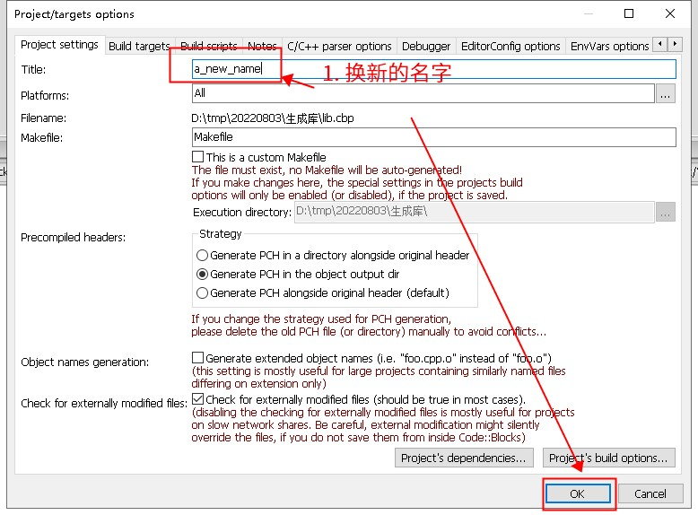

### 7.2.2. 如何生成 VSCode, Makefile 工程

在获得 Code::Blocks 工程的 `lib.cbp` 文件后，可以参照 [如何将 Code::Blocks 工程转换为 make/VSCode 工程](https://doc.zh-jieli.com/Tools/zh-cn/dev_tools/faqs/howto_convert_cbp.html)，进一步生成 VSCode 和 Makefile 工程。

## 7.3. 如何给 SDK 工程添加第三方库

### 7.3.1. 第三方库包含的文件

一些情况下，会需要添加第三方提供的库文件（.a 文件）。一般来说，主要是需要添加下面两种的文件：

1. 头文件 (.h) 文件。这些文件里面，一般包含了对应的函数声明（也就是 .a 文件中对外提供的函数的声明）
2. .a 文件本身，其中包含了函数体的实现

### 7.3.2. 添加第三方库前需要确认的事情

在添加第三方库之前，需要确认的事情如下：

1. 确认第三方库的编译参数，与当前的 SDK 的编译参数保持了一致。因为不同的 SDK，使用的指令集可能有所差异。 一定要首先确保，**第三方库和SDK的编译参数保持一致**（特别是 `-target xxx` 参数以及 `-mcpu=xx` 参数。

> **Note**
>
> 如果你是第三方库的作者，想要自己打包一个第三方库，参考文档：[在已经有了标准 SDK 工程的情况下，如何获得编译库的工程](https://doc.zh-jieli.com/Tools/zh-cn/dev_tools/faqs/howto_convert_sdk_to_lib.html)

2. 确认你当前使用的 SDK 是 Code::Blocks 工程、Makefile 工程，还是 VSCode 工程。 不同的工程，需要对应修改不同的位置。

#### 7.3.3. 添加第三方库需要修改的地方

添加第三方库，主要是需要修改下面一些地方：

1. 复制 .a 库文件到 SDK 工程目录中，例如 `include_lib\liba\${CPU}\` 目录下。`${CPU}` 表示 CPU 型号，例如 br23。 具体参考 SDK 对应目录。
2. 复制 .h 头文件到 SDK 工程目录中，例如 `include_lib\liba\3rd\` 目录下。**如果目录不存在，可以自行建立**。
3. 修改链接参数，添加对应 .a 库文件所在的路径。

下面，以一个 libtest.a 以及 libtest.h 为例，具体说明在 AC695X SDK 中，对于不同的工程，如何修改：

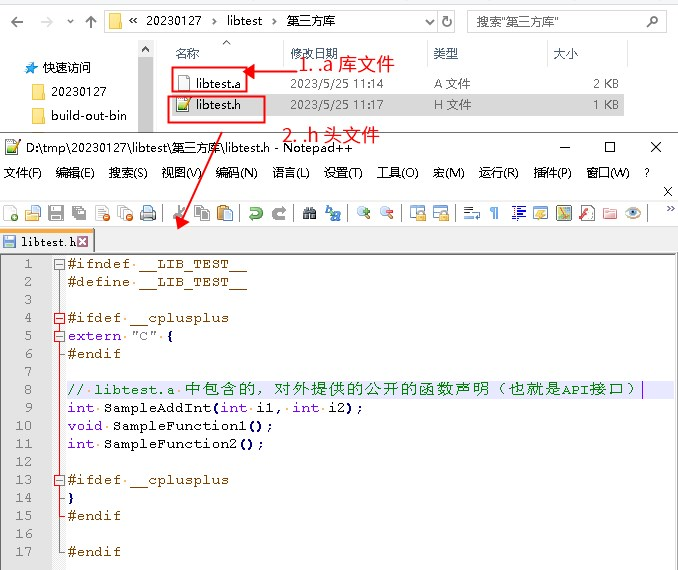

1. 复制 libtest.a 到 SDK 工程目录中，示例中是 `include_lib\liba\${CPU}` 目录，如下图所示：

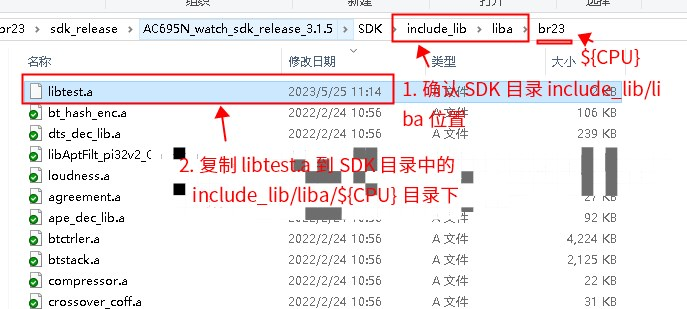

2. 复制 libtest.h 到 SDK 工程目录中，示例中是 `include_lib\3rd` 目录，如下图所示：

3. 修改链接参数，添加 libtest.a 所在的相对路径。
   1. **如果你是用SDK是用的 Code::Blocks 工程**，如下图操作：

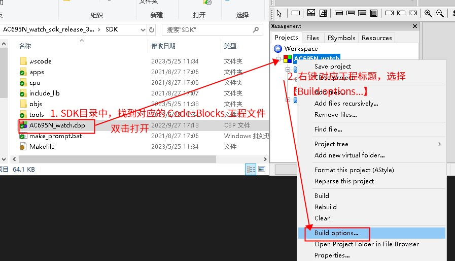

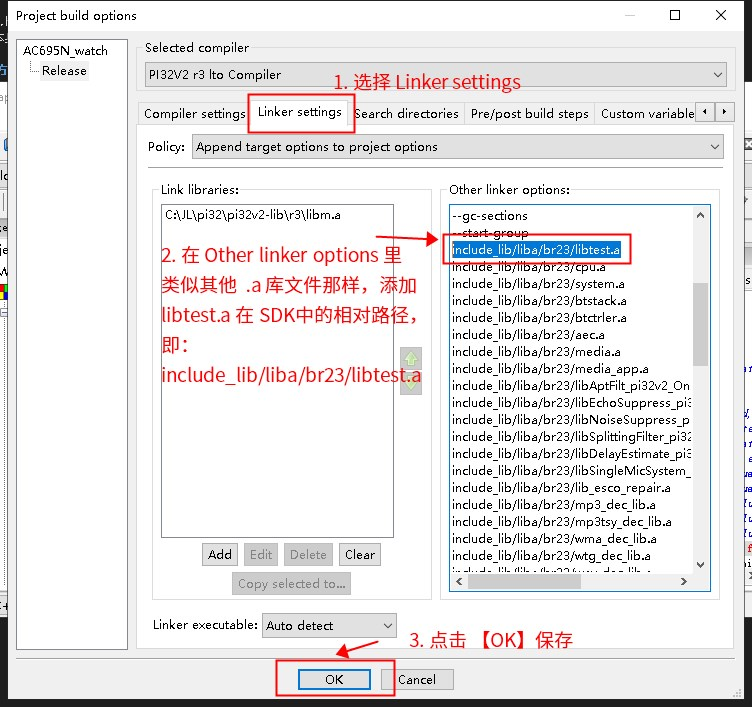

   2. **如果你是用的 Makefile 或者 VSCode（也是用Makefile）**，如下图操作：

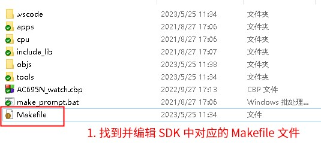

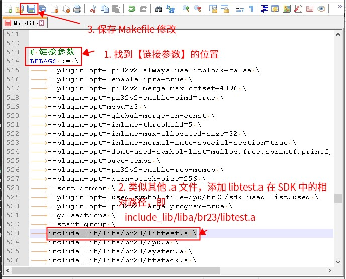

​	在修改完链接参数后，可以测试调用 libtest.a 中的函数

4. 测试调用 libtest.a 中的函数，如下图所示（以 Code::Blocks 为例）

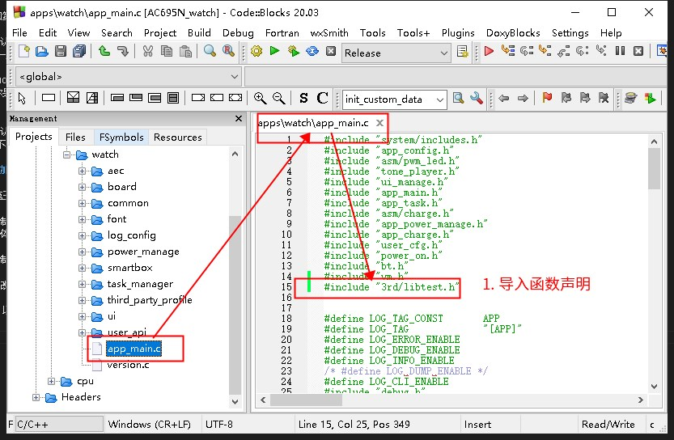

> **Important**
>
> 如果 `#include` 的时候提示无法找到头文件，可能你还需要修改头文件的搜索路径

## 7.4. 为什么有些 SDK 编译很慢

在 Windows上 用 Code::Blocks 编译 SDK 的时候，有时候会比较慢，可能是下面几种情况：

1. 安装了杀毒软件，但是没有信任`C:\JL`目录下的所有可执行程序（递归所有目录）。 导致每次调用编译器的时候，杀毒软件会拦截并扫描进程，这个会拖累速度。**建议关闭杀毒软件或者信任该目录**。
2. 可能是 Code::Blocks 版本较低，未能支持并行编译。建议更新到[最新的稳定版本Code::Blocks（点击此处下载）](https://pkgman.jieliapp.com/s/codeblocks)。
3. 可能是 SDK 中打开了`-Wundef`等编译警告参数，但是 SDK 中未消除这些警告。导致了较多的编译输出。拖慢了速度。可以考虑去掉，方式如下：

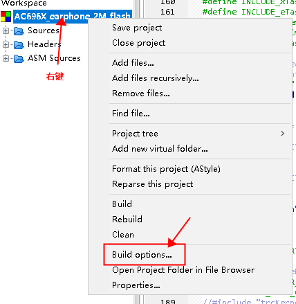

然后在Compiler Settings中：

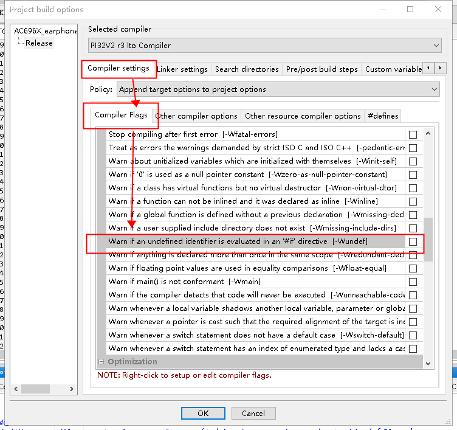

其他的参数以此类推，另外，有些参数会在Other compiler options里面

## 7.5. 为什么编译得到的文件不一致

一些情况下，会发现编译出来的文件（即、sdk.elf, app.bin）不一样，例如，文件的大小或者校验码发生了变化。这有几种可能的情况。

### 7.5.1. 同一个工程编译出来的文件不一致

有些情况下，同一个工程（即，同一个 cbp 工程、或者同一个 Makefile 工程），编译出来的文件不一致。

有下面几种可能：

1. 工程本身的设置（编译参数等）、库文件（.a）文件、文件的链接顺序等或者源文件本身被修改了
2. 工程内的源代码中，使用了例如 `__DATE__`, `__TIME__` 之类的与时间相关的宏
3. 工程所在的路径被修改了（即，移动了工程的位置），而源代码中使用了例如 `__FILE__` 之类与文件路径有关的宏

### 7.5.2. cbp 工程与 Makefile（VSCode） 工程编译出来的结果不一致

cbp 工程与 Makefile 工程在编译链接的过程中，使用的都是同样的工具链（编译器、链接器、下载工具等）。 他们的区别在于，cbp 工程是通过 Code::Blocks 来调用工具链，Makefile 工程是通过 make 来调用工具链。

也就是说，这两者最终使用的工具链，是一致的，只是面向用户的界面有所差异。

如果两者的设置是等价的，则应该得到同样的结果。

cbp 工程并不是和 Makefile 天然同步的，两个是独立的东西，如果修改了其中一个，另外一个需要对应设置。 例如，在 cbp 工程中增加了一个文件，也需要在 Makefile 中对应增加这个文件，否则两边得到的结果是不一样的。

如果发现两者的结果不一样，考虑下面的可能：

1. 上一节中提到的可能性
2. cbp 工程和 Makefile 工程的设置不一致。例如，可能只修改了 cbp 工程的设置，但是未对应修改 Makefile。 如果修改了 cbp 工程，需要更新 Makefile，可以手动对应修改，也可以参考：[如何将 Code::Blocks 工程转换为 make/VSCode 工程](https://doc.zh-jieli.com/Tools/zh-cn/dev_tools/faqs/howto_convert_cbp.html) 重新生成 Makefile。

## 7.6. 为什么无法下载程序

有些时候，会出现编译后，无法将固件文件下载到设备中的情况。 可以通过下面的步骤来排除情况：

### 7.6.1. 下载脚本 download.bat 编码错误

Windows 运行`bat`批处理文件的时候，要求文件的编码是本地编码。中文系统一般就是`gbk`编码。 如果`download.bat`的编码是`utf-8`的时候，则会报类似`不是内部或外部命令，也不是可运行的程序`之类的错误，如下图：

这个时候，可以考虑通过`Notepad++`之类的工具将文件编码修改为`gbk`，或者把文件中的中文都去掉。这样就会相当于是`ANSI`编码的文件。

### 7.6.2. 设备不在线

检查 Code::Blocks 的 build log 日志，是否有`Device Offline`之类的报错，如下图所示：

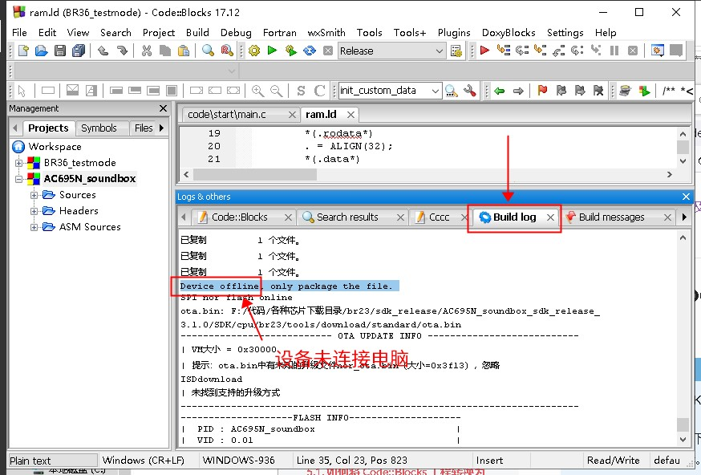

如果有，则表明设备未连接电脑，或者设备未进入下载模式。可能有下面几种原因：

1. 未正确插入样机、USB 线松动等，设备管理器中未能查看到（见下面的说明）
2. 插入了错误的样机、芯片的型号不匹配。

> **Note**
>
> 正确连接下载模式的设备后，我的电脑打开后，应当会多了一个隐藏磁盘（确认当前文件浏览器可以查看隐藏文件或设备）。
>
> 此外，【我的电脑】-【设备管理】-【磁盘驱动器】下，应该会有一个带有 `br**uboot1.0`、`bd**uboot1.0` 或者 `dv**uboot1.0` 的磁盘设备。
>
> 更详细步骤，参考：[升级与下载说明](https://doc.zh-jieli.com/Tools/zh-cn/dev_tools/forced_upgrade/upgrade_and_download.html)
>
> 如果设备管理器中已经有对应的设备，但是仍然有`Device Offline`的提示，依次尝试下面的方法：
>
> 1. 尝试用管理员权限进行下载。即，用管理员权限打开 Code::Blocks，打开工程后再编译下载。 下载工具需要操作物理设备，有些情况下可能会被 Windows 拒绝。例如远程登录的情况下
> 2. 确认电脑是否有安装杀毒软件、权限控制软件等，当前用户是否有允许操作 USB 设备的权限（下载工具需要读写 USB 设备，一些电脑为了安全保密可能被设置成了无法操作 USB 设备）。
> 3. 如果上述都不行，尝试更换其它电脑。

#### 7.6.2.1. 为什么有时候设备只能下载一次代码

一种常见的错误是，板子设计的时候，没有留烧录的脚。烧录过一次之后，固件会跑起来，就不在烧录状态了。 最常见的表现是：**空片烧录正常，之后再也无法进入下载模式**。 具体请联系代理商或者提供 SDK 的人，咨询板子应该如何设计，烧录脚如何设计。

### 7.6.3. KEY文件与芯片不匹配

提示`key mismatch`或者`不匹配`之类的错误。这个错误表示**key文件和芯片不匹配**。需要检查下载脚本`download.bat`中调用`isd_download.exe`的参数：

- 如果芯片是**空片**，则下载时候**无需**指定`-key xxxxx`的参数，请移除。空片不需要添加 key 文件。
- 如果芯片**不是空片**，则下载时需要指定对应的`-key xxxxx`，其中`xxxxx`就是和芯片匹配的key文件。**这个文件需要找代理商获取**。

> **Note**
>
> 如果确认芯片不是空片，而且下载的时候指定了 KEY 文件但是还是报不匹配错误。
>
> 这说明你指定的 KEY 文件和当前的芯片不匹配。 也就是说，这个芯片已经烧录了别的 key 文件（而不是你当前指定的这个 KEY 文件）。 可能是你拿到了被错误烧录的芯片，或者是你拿到了错误的 KEY 文件。
>
> **芯片与 KEY 文件必须一一对应，已经烧录过其它 KEY 的芯片的 KEY 不能被修改，也不能被其它 KEY 文件烧录**

注意，`download.bat`脚本，可能会引用别的 bat 脚本。所以建议**整个 SDK 工程全局搜索** `isd_download.exe` 关键字。

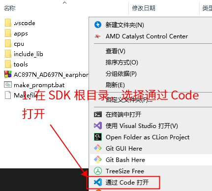

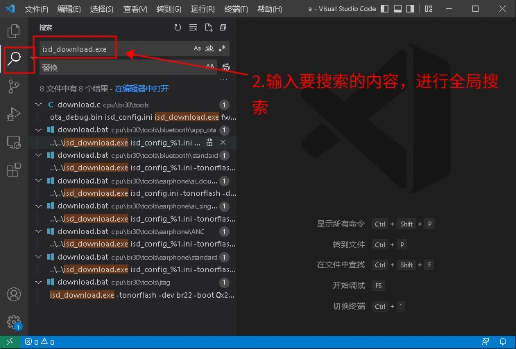

> **Note**

1. 如果你的 KEY 文件名字中有空格。建议去掉空格。或者用双引号 “” 括起来，例如 “key file with space.key”。
2. 为了防止问题，建议key文件名不要有任何空格。

### 7.6.4. USB 连线不稳或者 FLASH 损坏

提示 `错误信息:ERR_CRCCMP`。这个错误表示，在完成下载后，比对**FLASH**内容的时候，出现内容不匹配。如下图所示：

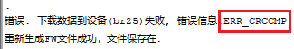

这个可能是：

- 样机（设备）和电脑连接不稳定，导致偶现失败。可以考虑重新接稳USB连线后重试。
- 样机（设备）的 FLASH 受到了损坏，导致部分区域无法正确写入。可以考虑更换样机（设备）后重试。

### 7.6.5. USB 连线不稳或者芯片本身损坏

提示 `错误：分析设备信息失败`。这个错误表示，解析设备信息的时候出错：

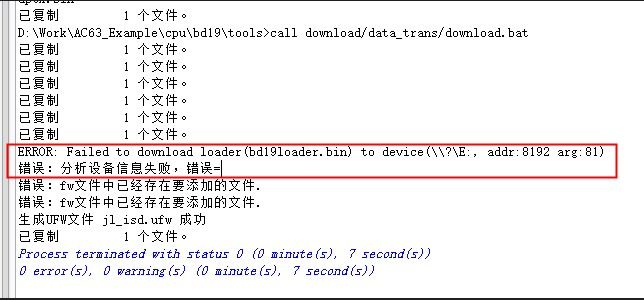

这个可能是：

- 样机（设备）和电脑连接不稳定，导致偶现失败。可以考虑重新接稳USB连线后重试。
- 样机（设备）芯片本身损坏，导致与 PC 工具通讯异常。

### 7.6.6. 未正确设置虚拟串口

提示`打开设备(JLVirtualtagSerial)失败`。这个错误表示无法打开虚拟串口设备。这个可能是因为没有设置虚拟串口。参考[串口升级](https://doc.zh-jieli.com/Tools/zh-cn/dev_tools/forced_upgrade/upgrade_and_download.html#target-forceupgrade-serial-update)。

### 7.6.7. 其它可能的原因

如果出现其它情况，可以尝试下面的步骤：

- 更换电脑后，重新下载
- 更换样机后，重新下载

这样来确定，不能下载的现象是与电脑还是与样机有关。

## 7.7. 如何修改临时目录

由于链接器 ld 处理一些中文字符的时候会出现问题。编译过程中，会生成一些临时文件。 这些文件会放到环境变量`TMP`，`TEMP`指向的目录中。默认情况下，就是当前用户的`%USERDATA%`下，而这个目录会包含用户名。 如果用户名是包含了中文或者别的一些字符可能会导致问题。

可以通过下面的方法来修改：

1. 在 `C` 盘根目录下，新建一个文件夹，叫做 `tempdir`
2. 打开我的电脑，点击在菜单栏的【系统属性】

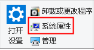

3. 选择【高级系统属性】

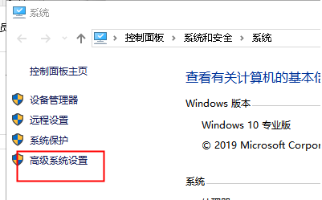

4. 选择【高级】标签页中的【环境变量】

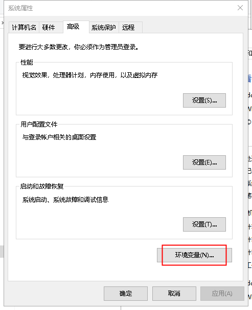

5. 找到对应的环境变量`TMP`和`TEMP`，并修改成 `C:\tempdir`

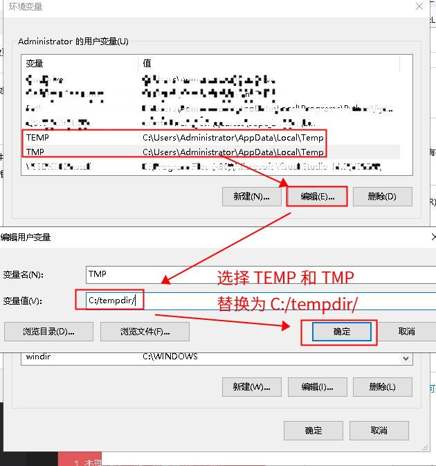

## 7.8. 关于工具（误）报毒问题

由于我们大部分工具都是静态链接，我们的工具一般都链接了 [Windows CRT](https://docs.microsoft.com/zh-cn/cpp/c-runtime-library/windows-platforms-crt?view=msvc-170) 的内容（也就是 Windows 的 LIBC 实现，里面包含了例如 `printf`, `fopen` 等函数实现）。

这个导致 360 等杀毒软件容易误报（可能是因为病毒也会静态链接 CRT，360 的检查算法可能是对比匹配度）。

一般情况下，如果 360 报告了 `HEUR/QVM` 这个类型的，都属于误报（也可以用火绒杀毒软件之类的其它杀毒软件交叉确认）。

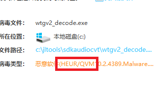

> **Important**
>
> 如果是其它类型，可能是你手上的工具确实被感染了，最好是全盘扫描后确认。

## 7.9. 如何确认当前工程使用的下载脚本 `download.bat` 是哪个

一些工程中，可能会有多个下载脚本 `download.bat`。当我们需要修改下载脚本的时候，会需要先确定哪个才是我们需要修改的下载脚本。

下载脚本，是在编译链接完成后，SDK 会调用的一个脚本。用于将我们编译链接出来的程序，下载到我们的样机中。

所以，这个问题的关键在于，如何找到编译链接完成之后，SDK 执行了哪些动作。

### 7.9.1. Code::Blocks 工程确认下载脚本的方式

对于 Code::Blocks 工程，编译链接完成之后执行的脚本，叫做 `post-build step`，这里面调用的就是下载脚本。

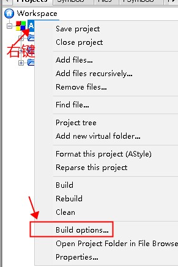 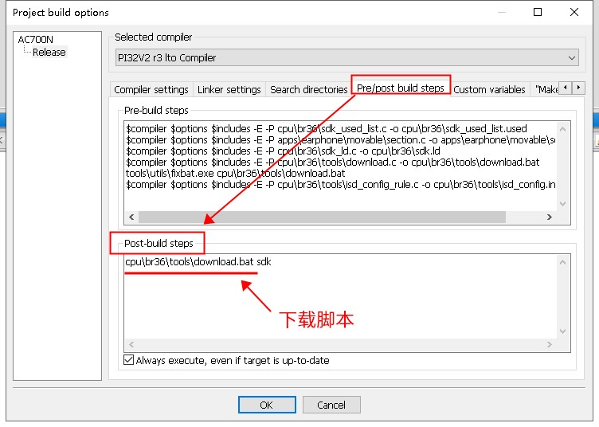

### 7.9.2. Makefile/VSCode 工程确认下载脚本的方式

对于 Makefile/VSCode 工程，我们需要先找到对应的 Makefile 文件。

在 `all` 目标下，有一个名为 `$(RUN_POST_SCRIPT)` 的调用，这个变量对应的就是下载脚本。

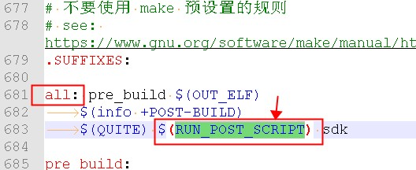 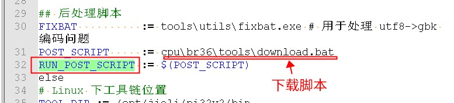

### 7.9.3. 注意事项

1. 在一些 SDK 中， `download.bat` 是依据 `download.c` 生成的。且每次编译都会重新生成。如果是，请直接修改 `download.c`，否则你的修改会被覆盖掉。
2. 在一些 SDK 中，`download.bat` 还会调用其它的 `download.bat` 脚本，请确认调用顺序。

## 7.10. 如何在下载前对芯片进行全擦除

一些情况下，希望在下载代码到芯片之前，对芯片进行全擦除（即、擦除芯片 FLASH 中所有内容）

> **Note**
>
> 芯片的 KEY 不能被擦除。

这个需要我们修改下载脚本 `download.bat` 中，调用 `isd_download.exe` 的地方，加上 `-format all` 参数。

类似下图：

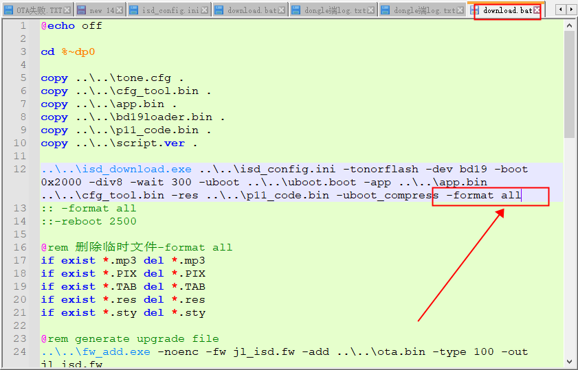

> **Note**
>
> 查找下载脚本的方法，参考：[如何确认当前工程使用的下载脚本 download.bat 是哪个](https://doc.zh-jieli.com/Tools/zh-cn/dev_tools/faqs/howto_find_downloadbat.html)

## 7.11. 如何在下载后自动复位芯片

一些情况下，希望在下载代码到芯片之后，对芯片进行复位操作

这个需要我们修改下载脚本 `download.bat` 中，调用 `isd_download.exe` 的地方，加上 `-reboot 2000` 参数。

> **Note**
>
> `-reboot 2000` 中的 `2000` 的单位是 `ms`，可以将 `2000` 修改为其他值。表示等待多少时间(ms)，后才复位。

类似下图：

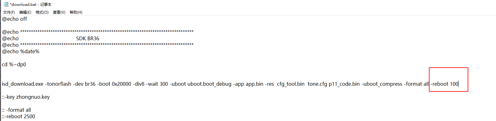

> **Note**
>
> 查找下载脚本的方法，参考：[如何确认当前工程使用的下载脚本 download.bat 是哪个](https://doc.zh-jieli.com/Tools/zh-cn/dev_tools/faqs/howto_find_downloadbat.html)

## 7.12. 如何读取芯片的 FLASH ID

一些情况下，需要读取芯片的 FLASH ID。 在下载固件到芯片的过程中，下载工具会打印输出芯片的 FLASH ID。

所以，只需要在 Code::Blocks 工程中的，点击编译后，观察 Build log 窗口的输出，找到`Online flash id`字符串的位置，如下图所示：

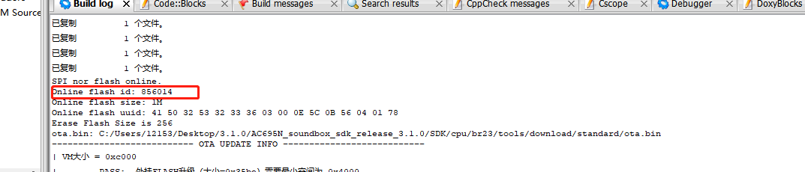

> **Note**
>
> 如果你使用的不是 Code::Blocks 工程，而是 Makefile 或者 VSCode，也是类似的。在编译后，观察命令行窗口输出，找到`Online flash id`字符串的位置。

