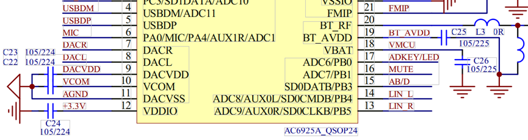
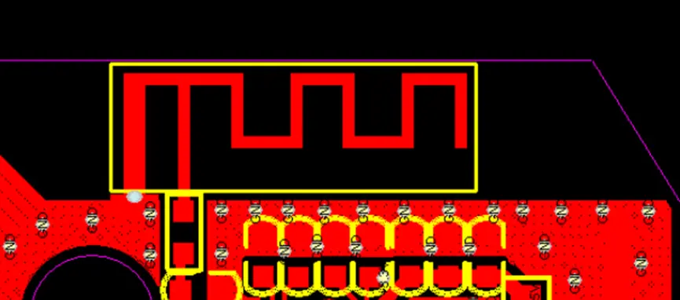
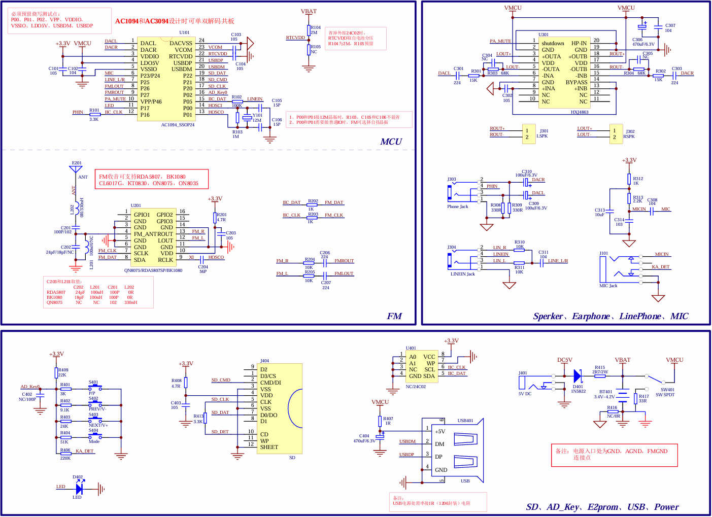

# 4. 硬件设计

## 4.1. 硬件设计注意事项
### 4.1.1 电源、地线

1、分 AGND 和 GND 二个地，AGND 在功放处或电池处和 GND 短接，可以消除共地引起的各种噪声。

2、VDDIO、DACVDD 、RTCVDD 这几个引脚输出 3.3V，其中 VDDIO 带负载能力强，可以用来给外部芯片供电；
VCOM 输出 1.5V；布局时，C22/C23/C24/C25/C26 尽量靠近相应管脚；如下图。

  

3、VBAT 是电源引脚，输入电压不要超过 5V，如使用电池供电，要使用带保护板的电池。

### 4.1.2 信号

1、晶振要靠近主控放置，走线不可以太长。晶振选型要求如下：
  封装：可兼容49S、3225、2016等不同封装(建议优先使用49S、3225等常用封装)；
  要求：稳定性、一致性要好，频偏偏差：±10PPM以内；
  电容：晶振匹配电容位置请预留；
提醒：晶振品质会直接影响蓝牙信号的距离与稳定性，强烈建议使用杰理配套晶振，请联系我司销售人员。

2、RF 天线必须放置在板边，严禁被 GND 包裹，且正反面不能有金属器件，采用三面镂空方式（上、左、右），顶层和底层都要镂空，如下图。

  

### 4.1.3 预留升级测试点

1、开发设计时必须引出 VBAT、GND、DP、DM 四个升级测试点，其中AD15N系列预留VBAT PB9(UART_TRX) GND三个升级测试点，测试点位置需考虑方便治具的使用。（备注：大货生产时，万一出现软件问题，在最坏的情况下，还可以通过治具进行芯片程序升级工作）。此项非常重要，设计过程中如有疑问请跟我们沟通确认；

### 4.1.4 功放

1、MUTE 脚是功放静音脚，接主控普通 IO 口控制。

2、AB/D 类引脚

（1）、有收音功能，该引脚接主控普通 IO 口，在收音模式 IO 输出低电平，控制功放进 AB 类。在其他模式时，输出高电平，控制功放进 D 类。

（2）、没有收音功能，直接将该引脚拉高到 3.3V，控制在 D 类模式即可。

### 4.1.5 软关机需要注意事项

1、ADKEY 按键，22K 电阻上拉必须接到 RTCVDD，待机功耗在 4UA 以内。不能上拉到 VDDIO。如果接到 VDDIO，待机功耗会有 70UA，这个是不能接受的。

2、软关机项目，在测试过程中，一定要测试待机电流，这个非常重要。不然会存在待机时间短，长时间放置以后，开不了机。

## 4.2. 常用元器件封装

[杰理常用封装(云信)_AD.PcbDoc](https://www.yunthinker.com/downshow_71.html)

[杰理常用封装(云信)_pads.pcb](https://www.yunthinker.com/downshow_72.html)

晶振的封装：对尺寸大小没要求选49S, 尺寸空间较小选3225封装，更小尺寸选2016封装。

## 4.3. 外置FM方案设计参考
对于收音效果要求较高的客户，可通过外置FM收音芯片的方案来实现，具体硬件设计可参考如下[原理图](http://yunthinker.com/downshow_97.html)；
  