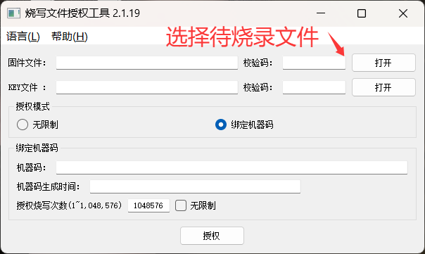
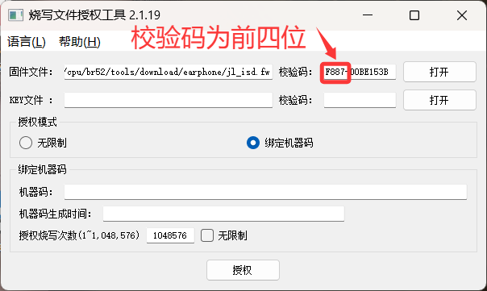

# 7. 生产与测试

## 7.1. 芯片软件代烧录指引
请发正式芯片采购订单与对应的烧录文件给我司销售人员，采购订单里需至少包含三个关键信息：芯片型号、数量、芯片对应软件的校验码（此校验码信息建议写在采购订单的“规格”栏或“备注”栏里）。

* 温馨提醒
  
    1. 由我司代烧录芯片，需在软件中加入我司的key后方可生产；

    2. 我司由校验码来唯一标识相关软件，需提供给我司校验码信息，查看软件校验码的具体操作为如下，[工具下载](https://doc.yunthinker.com/downloads/烧写文件授权工具_2.1.19.exe):

 
 